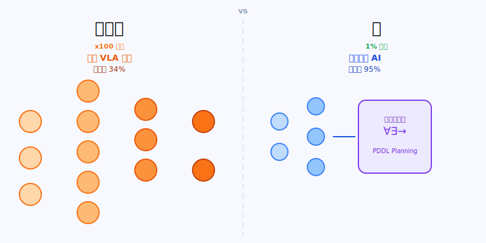
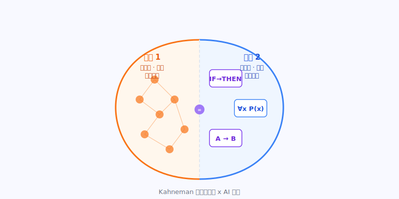
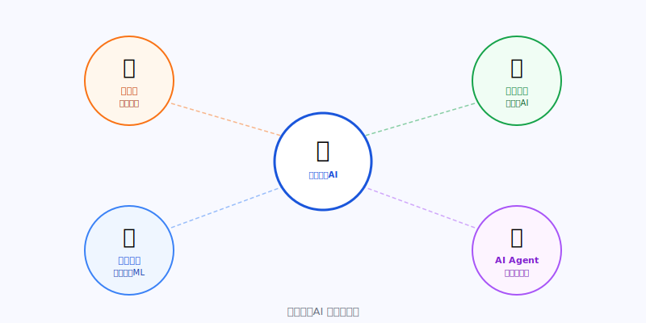

# 能耗降低100倍：神经符号AI如何终结人工智能的能源危机

**分类**：AI 技术突破  
**日期**：2026年4月12日

---

> 2026年4月，当全球AI公司还在竞相堆砌万亿参数时，一个来自塔夫茨大学小实验室的研究，用一组令人瞠目的数据质疑了整个行业押注的路线：也许，让AI更聪明的答案，从来不是"更大"。

---

## 核心观点

- 塔夫茨大学研究证明：神经符号AI仅消耗标准VLA模型**1%的训练能耗**，任务成功率却从34%跃升至95%，训练时间从36小时压缩到34分钟
- 全球数据中心用电量2026年将突破**1100 TWh**，相当于日本全国年耗电量——AI能源危机已从"未来风险"变成"眼前现实"
- 神经符号AI代表AI发展的第三条路：不靠堆参数，而靠"神经直觉＋符号逻辑"的混合认知架构，挑战整个行业押注的暴力扩参路线

---

## 数据中心的能源黑洞：一场正在失控的危机

爱尔兰都柏林，这座城市的数据中心已消耗了全国 **79%** 的电力。

在美国弗吉尼亚州，数据中心占据了该州26%的用电量，以至于北弗吉尼亚已实际上叫停了新数据中心的建设许可。高盛估计，到2030年，全球需要花费约 **7200亿美元** 升级电网，才能跟上AI的胃口。

国际能源署（IEA）在2026年最新报告中写道：全球数据中心用电量将在今年突破 **1100 TWh**，相当于日本整个国家一年的用电量。这个数字比6个月前的预测又上调了18%。

| 指标 | 数值 |
|------|------|
| 数据中心年耗电量预测 | **1100 TWh**（≈日本全国） |
| 爱尔兰都柏林数据中心用电占比 | **79%** |
| 电价涨幅（自2019年） | **+42%**，远超通胀 |
| 2030年前所需电网升级投资（高盛） | **7200亿美元** |

*全球数据中心用电量持续攀升，2026年将达日本全国年耗电量*

AI行业对这个问题的官方回应，是核电、氢能、新型电池——总之，先把电找来再说。没有人真正质疑：**也许是AI本身太费电了？**

---

## 一场"古老"与"新潮"的技术对决

2026年，机器人AI领域最热门的方向叫做VLA——Vision-Language-Action模型，视觉-语言-动作模型。

概念很简单：给机器人看图像，告诉它用语言描述的指令，模型直接输出动作。NVIDIA的GR00T N1、谷歌的Gemini Robotics、Figure AI的Helix，都是这条技术路线的明星产品。Tesla工厂里正在工作的Optimus机器人，背后也是类似的逻辑。

VLA模型的魅力在于"端到端"——不需要人工设计规则，从原始感知数据直接到动作输出，被认为是让机器人真正"通用化"的关键技术。

代价呢？训练一个VLA模型，需要数十亿个GPU算力小时，能耗惊人，且往往对未见过的场景束手无策。

> **神经符号AI代表着一种更古老也更深刻的智慧：人类从来不用把整个世界都记住才能做决定，我们用规则、用逻辑、用因果推理。**

神经符号AI不是新概念。早在1990年代，AI研究者就在讨论如何把神经网络（擅长模式识别）和符号推理（擅长逻辑规划）结合起来。只是后来深度学习横空出世，符号方向逐渐被边缘化。

现在，随着大模型的局限性越来越清晰——幻觉、推理错误、高能耗——神经符号AI正在悄悄复兴。

*标准VLA模型（左）与神经符号AI（右）：效率与性能的双重差距*

---

## 河内塔实验：那组颠覆认知的数据

2026年2月，塔夫茨大学（Tufts University）的一篇论文悄悄挂上了预印本服务器。

论文标题有点绕口，翻译过来是：《价格不对：神经符号方法在结构化长程操作任务上以显著更低能耗超越VLA》。作者是Timothy Duggan、Pierrick Lorang、Hong Lu，以及人机交互实验室主任Matthias Scheutz教授。

他们用的实验任务，是大家都熟悉的经典——**河内塔（Tower of Hanoi）**。不同的是，他们用机械臂来完成这个任务，并且让两套系统同台竞技：

- 一套是当下最先进的VLA模型（视觉-语言-动作模型）
- 一套是他们开发的神经符号VLA系统（Neuro-Symbolic VLA）

**结果让人目瞪口呆。**

| 指标 | 神经符号AI | 标准VLA模型 |
|------|-----------|------------|
| 标准任务成功率 | **95%** | 34% |
| 未见变体任务成功率 | **78%** | **0%** |
| 训练时间 | **34分钟** | 36小时+ |
| 训练能耗 | **1%** | 100% |

在标准河内塔任务上，神经符号系统达到了 **95%成功率**，而最先进的VLA模型只有 **34%**。

但更令人震惊的是"迁移测试"：把河内塔换成更复杂的、从未见过的变体版本。VLA模型的成功率直接归零——**0%**。神经符号系统呢？**78%**。

然后是能耗数字：神经符号系统的训练能耗，仅为VLA模型的 **1%**。训练时间从超过36小时压缩到34分钟。

> **让人不舒服的真相：AI行业每年花数千亿美元训练越来越大的模型，却在一个机器人操作任务上，被一个"回到1990年代"的混合架构以1%的能耗打得溃不成军。**

---

## 神经符号AI是什么：人类认知的"双系统"模型

理解神经符号AI，需要先理解人类的大脑是怎么工作的。

心理学家Daniel Kahneman在《思考，快与慢》中提出了著名的"双系统理论"：

- **系统1（快思考）**：自动、直觉、快速——看到熟悉的脸就认出来，不需要推理
- **系统2（慢思考）**：有意识、逻辑、慢速——计算18×27需要一步一步来

现在的大模型，本质上只有系统1——它是一个超大规模的模式匹配引擎，训练数据越多、参数越大，模式识别越准。但它没有系统2，不会真正地"步骤推理"，这就是为什么大模型会在简单的数学题上犯错，为什么它在分布外场景（Out-of-Distribution）上会崩溃。

神经符号AI的思路，是把系统1和系统2都装进去：

- 神经网络部分负责感知——看图像、理解语言，处理模糊信息
- 符号推理部分负责规划——生成逻辑步骤，执行因果推理，约束动作序列

在河内塔实验里，塔夫茨的系统是这样工作的：机器人的"眼睛"（神经网络）识别出当前状态（哪个盘子在哪个柱子上），然后符号规划器计算出最优移动序列，再由神经网络转换成具体的机械臂动作。

这就是为什么它遇到没见过的变体版本也能应付——规划器的逻辑是通用的，不依赖记忆特定数据。

*Kahneman双系统理论与神经符号AI架构的对应关系*

---

## 扩参路线的隐患：规模从来不是银弹

过去几年，AI行业的主流叙事是"规模法则（Scaling Laws）"：参数越多、数据越多、算力越多，模型越聪明。

这个逻辑在语言模型上确实成立——GPT-4、Claude 3、Gemini Ultra，都是这条路的胜利。

但现实正在亮出警告灯。

Anthropic刚刚泄露了Claude Mythos 5的存在——10万亿参数，但其中每次推理时真正激活的可能只有8000亿到1.2万亿。模型越来越大，但"有效利用率"越来越低。

更根本的问题是：VLA模型在机器人任务上34%的成功率，意味着什么？意味着在现实世界里，这些价值连城的模型每3次操作就会失败2次。工厂没法用，家庭更没法用。

> **"大力出奇迹"没有错，但它有边界。当边界出现时，结构性方案才是真正的解法。**

历史上不乏类似的转折：

- CPU性能提升到物理极限后，多核并行架构才是出路
- 关系数据库扩展到极限后，NoSQL和分布式架构才成为主流
- 化石燃料效率优化了一百年后，电动化才是真正的变革

每一次，都是结构性创新赢过了暴力堆叠。

---

## 不只是机器人：神经符号AI的更大野心

塔夫茨的研究聚焦在机器人操作任务上，但神经符号AI的潜力远不止于此。

在**医疗诊断**领域，神经符号AI可以结合医学知识图谱（符号）和影像识别（神经），不只给出诊断，还能给出可追溯的推理路径——这正是医院真正需要的"可解释AI"。

在**科学发现**领域，University of Hawaii的研究者已经开发出"物理信息机器学习"——让AI在处理流体动力学和气候建模数据时，必须遵守物理定律（符号约束），而不是自由拟合数据。

在**智能体（Agent）** 领域，当AI Agent需要执行多步骤任务时，神经符号方法可以提供逻辑保证——不让Agent在第3步做出违背第1步约束的操作。这正是当前所有Agent系统都头疼的"一致性问题"。

*神经符号AI在机器人、医疗、科学发现、AI Agent等领域的应用*

---

## 行动指南：你应该怎么做

不同角色，这个突破对你的含义完全不同。

**如果你是AI/机器人工程师：**

现在就应该认真研究神经符号框架，特别是`PDDL`（规划领域定义语言）、`ASP`（回答集程序设计）这类符号规划工具，以及如何把它们和现有的神经网络pipeline对接。塔夫茨这篇论文的代码会在ICRA 2026（6月，维也纳）发布，到时候跟进复现。

**如果你是AI产品经理或创业者：**

寻找"规则结构强、数据稀缺"的场景——这些场景VLA们做不好，神经符号方法却天然适合。比如：工业质检（有明确的合格标准）、合规审核（有清晰的规则体系）、科学实验自动化（有物理定律约束）。这是2026年最被低估的AI创业方向之一。

**如果你是投资人：**

关注两类标的：一是把神经符号方法产品化的创业公司（尤其是机器人和Agent方向）；二是受益于AI降能耗的基础设施公司（如果AI训练能耗真的下降10-100倍，数据中心的建设逻辑会重写）。

**如果你只是关心AI未来走向的普通读者：**

记住一件事：AI的能源问题正在从边缘议题变成核心议题。下一个能在这个问题上给出系统性答案的技术路线，很可能就是下一个十年的主角。神经符号AI是目前最有说服力的候选者。

---

## 争议与反驳：神经符号AI并非没有代价

当然，不是每个人都被这篇论文说服。

质疑者指出，河内塔是一个高度结构化的任务，符号规划在这类场景天然占优。真实世界里的机器人任务，往往充满不确定性和模糊性——"把杯子放到桌上"，但桌子是倾斜的，杯子里有液体，附近有障碍物……符号规划很快就会在组合爆炸面前崩溃。

这个批评并非没有道理。符号规划的阿喀琉斯之踵，正是处理现实世界的噪声和不确定性。这也是为什么1980年代"专家系统"最终走向没落——规则写不完，也维护不过来。

但2026年的神经符号AI和1980年代的专家系统有根本区别：它不是"手写规则"，而是让神经网络自动学习符号表示，再用符号引擎做规划。这就像是给规划系统配了一双能看懂现实世界的眼睛。

这场技术路线之争，短期内不会有定论。但一个能用1%能耗取得3倍效果的结果，已经足够让整个行业认真回头看。

---

## 结论

> 神经符号AI不是要杀死大模型，而是要让AI学会"什么时候用直觉，什么时候用逻辑"。这正是人类数百万年进化出的认知架构——而我们才刚刚开始把它移植到机器上。

> 100倍能耗差距背后，是两种完全不同的AI哲学：一种相信"规模是答案"，一种相信"结构是答案"。历史告诉我们，每一次真正的技术革命，都是结构赢了规模。

---

## 数据来源

- [ScienceDaily（2026年4月）](https://www.sciencedaily.com/releases/2026/04/260405003952.htm)
- [Tufts Now（2026年3月）](https://now.tufts.edu/2026/03/17/new-ai-models-could-slash-energy-use-while-dramatically-improving-performance)
- [Engineering & Technology Magazine（2026年4月）](https://eandt.theiet.org/2026/04/07/ai-system-could-cut-energy-use-100-times-researchers-say)
- [SciTechDaily（2026年4月）](https://scitechdaily.com/100x-less-power-the-breakthrough-that-could-solve-ais-massive-energy-crisis/)
- [IEA 能源与AI报告（2026年）](https://www.iea.org/reports/energy-and-ai/energy-demand-from-ai)
- [Nerd Level Tech（2026年4月）](https://nerdleveltech.com/neuro-symbolic-ai-cuts-robot-energy-use)
- [AI Environment Statistics 2026](https://www.allaboutai.com/resources/ai-statistics/ai-environment/)
