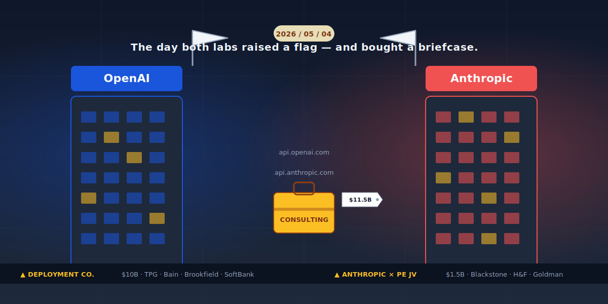

# 他们卖了五年 API，这一天集体承认：客户根本用不来

> **发布日期**：2026-05-11 | **分类**：AI 商业拆解

## 核心观点

- 5 月 4 日 OpenAI 和 Anthropic 同一天宣布合资公司，不是巧合，是同时招认
- 「模型即产品」的故事在这天被两个最大的卖故事的人亲手撕了
- 真正被吃掉午饭的不是 MBB，是中间层 SI；同时 AI 大厂的软件估值倍数也开始倒计时

---

## 导语

2026 年 5 月 4 日，星期一。

那一天纽约时间下午，两条新闻前后脚出现在 Bloomberg 终端上，间隔大概十几分钟。

**第一条**：OpenAI 拉着 TPG、Brookfield、Bain Capital、Advent、Dragoneer、SoftBank 一共 19 个投资人，凑了 40 亿美金，估值 100 亿，搞了一家叫 **The Deployment Company** 的合资公司。OpenAI 自己出 15 亿，多数控股，正在谈三家"服务公司"的收购。

**第二条**：Anthropic 拉着 Blackstone、Hellman & Friedman、Goldman Sachs 三个 PE 巨头，加上 Apollo、General Atlantic、GIC、Sequoia、Leonard Green，凑了 15 亿承诺资本，搞了一家**到现在还没起名字**的服务公司。Anthropic 自己出 3 亿，Blackstone 3 亿，H&F 3 亿，Goldman 1.5 亿。

两家公司，同一天，同样的事，间隔十几分钟。

媒体的标题大同小异：「AI 巨头进军企业服务」、「OpenAI 和 Anthropic 双双押注部署」、「私募巨头与 AI 实验室联手」——你能想到的所有正面词，都被造完一遍。

只有一句话没人说出来——

这哥俩同一天宣布的不是什么"进军"，是同一天**集体招认**。

招认什么呢？

招认他们花了五年告诉你 AI 多好用，结果客户买回去打开一看，自己不会用。

招认那个被资本市场吹了五年的"API 即产品、模型即护城河"的故事，到这一周，**靠他们自己讲不下去了**。

招认得这么齐，齐到只差十几分钟——

那就不叫巧合，那叫两个考生抄了同一张小抄，监考老师没发现，他们自己先慌了。

---

## 一、先把这两笔账，老老实实摊在桌上

我们先不解读，先做笔账房先生干的事——把数字一个个码清楚。

**OpenAI 这一边**：

- 公司名：The Deployment Company。简单粗暴，直接叫"部署公司"，连个像样的英文壳都懒得包。
- 估值：100 亿美金。
- 募资规模：40 亿美金，来自 19 个外部投资人。
- 投资人清单（已确认）：TPG、Brookfield Asset Management、Bain Capital、Advent International、Dragoneer Investment Group、SoftBank Group。
- OpenAI 自己掏多少：最多 15 亿美金（5 亿当下到账，10 亿后续期权）。
- 谁说了算：OpenAI 多数控股。
- 在干嘛：「正在三家 AI 服务公司的高级收购谈判中」（advanced talks for three acquisitions）。
- 模式：「forward-deployed engineers」——这词是 Palantir 用了二十年的老词，意思是把工程师直接派去客户公司内部坐着。
- 目标行业：医疗、物流、制造、金融服务。

**Anthropic 这一边**：

- 公司名：（截至发稿）没起。一家 15 亿美金的公司没名字，这件事本身就很 Anthropic。
- 估值/承诺资本：15 亿美金。
- 出资明细：Anthropic 3 亿、Blackstone 3 亿、Hellman & Friedman 3 亿、Goldman Sachs 1.5 亿（《华尔街日报》数字）。剩下的来自 Apollo Global Management、General Atlantic、GIC、Leonard Green、Sequoia Capital。
- 模式：「embed engineers inside companies to redesign workflows」——直接派工程师进客户公司，重做客户的内部流程。
- 起步客户：Blackstone / H&F / Goldman 旗下的 PE 投资组合公司，挑健康医疗、制造、金融服务、零售、地产这五个行业。
- Anthropic CFO Krishna Rao 唯一对外说的一句话：「Enterprise demand for Claude is significantly outpacing any single delivery model.」

把这一段中文翻译翻译：「企业对 Claude 的需求，已经超过任何单一交付模式能消化的程度。」

「单一交付模式」是什么？

就是 API 啊朋友们。

就是过去五年，每一篇 Anthropic 的文章里都吹的、SDK 一接、Token 一充、产品立刻起飞的那套东西。

CFO 现在亲口告诉你：那东西扛不住了（笑）。

  
📊

  
信息图占位

  

规格卡
<pre>【图类型】：对账图
【副标题】：同一天，两笔交易，两个版本的"我自己也得下场装"
【单位】：亿美元
【核心判断】：OpenAI 押 100 亿估值的 Deployment Company，Anthropic 用 15 亿承诺资本起步——同样的事，不同的赌注大小
【核心内容】：
  - OpenAI · The Deployment Company 估值 [流入]：100
  - OpenAI 自掏上限 [流出]：15
  - PE/外部募资 [流入]：40
  - Anthropic · 合资公司承诺资本 [流入]：15
  - Anthropic 自掏 [流出]：3
  - 三家 PE 巨头自掏 [流入]：7.5</pre>

仔细看这张表，会发现一件**反直觉**的事：

OpenAI 把这家公司估到 100 亿、自己最多掏 15 亿，等于愿意在这件事上**让出多数的钱**——但要**多数控股**。

Anthropic 反过来：自己只掏 3 亿，跟 Blackstone、H&F 三家一比一对等出资，把 Goldman 当小股东塞进来。15 亿的盘子，**人家是真把这件事当一个独立的合资公司在搞**。

这两种结构暴露了两家不同的恐惧。

OpenAI 怕的是：Microsoft 看见我去干服务这件事，又要来抢一口。所以我宁愿少出钱，也得多数控股，先把治理权焊死。

Anthropic 怕的是：PE 朋友们带我进客户家，结果把我端走变成 Blackstone 的子公司。所以我对等出资，让你们三家彼此互相牵制。

两家都没说，但都干了同一件事——

**找一个体外公司，把"部署"这个最脏最重最不像软件的活，从主体表外搬出去。**

体外搬出去这件事，听着很金融，本质很俗气：

就是不想让这部分的毛利率，污染主体公司"我是 SaaS、我配 30 倍 P/S"的估值故事。

---

## 二、为什么必须在同一天宣布

这件事如果只是 OpenAI 一家干，那是 OpenAI 的战略选择。

如果只是 Anthropic 一家干，那是 Anthropic 在补短板。

**两家在同一天、间隔十几分钟先后宣布**，那就只剩下一种解释——

他们都看到了同一个数字，都到了同一个临界点，都不敢比对方晚那么一天。

那个数字叫 **88%**。

IDC 在 2026 年初放出来的数据：企业内部跑过的 AI 概念验证项目里，**88% 没能进入规模化部署**。换算一下——一家公司投资 33 个 AI PoC，平均只有 4 个能上生产线。

Composio 同期出的《AI Agent Report 2025》数字更难看：97% 的高管说自己公司部署过 AI Agent，但**只有 12% 的 Agent 项目能上规模化生产**；追踪到的 847 个 Agent 部署里，**76% 在头 90 天内出现严重故障**。

这些数字，OpenAI 看得见，Anthropic 也看得见。

Salesforce 看得见、Microsoft 看得见、AWS 看得见——但他们不慌，因为他们卖的是云、是席位、是用量，**客户用不起来，他们一样收钱**。

OpenAI 和 Anthropic 慌，因为他们之前给投资人讲的故事是「我们卖 API，每个 Token 都是真用」。

如果 88% 的客户**买回去打不开**，那意味着 88% 的 API 调用根本不是真业务驱动的——

要么是 PoC 反复跑的 Demo 调用，要么是开发者半夜调通了一次然后再没人用，要么是数据科学家把成本花完了等下一个季度预算。

每过一个季度，这个故事就更难讲一点。

到 2026 年第一季度，Anthropic ARR 据传冲到 440 亿，但他们自己开始往两个地方加塞——一个是签 SpaceX 的算力（5/7 拿下 Colossus 1，22 万张 H100），一个是把 Claude 跟 Microsoft 365 缝合（5/5 公布）。

**前者是在解决"我承诺出去的 3300 亿美金账单怎么消耗掉"的问题。**

**后者是在解决"我卖出去的 Token 怎么变成真实业务调用"的问题。**

后者解决不了，前者就是金融操作——而金融操作支撑不起一家"AGI 公司"的叙事。

5 月 4 日，两家想到了同一个答案——

既然客户没办法把我们用起来，那我们自己派人去帮客户用起来好了。

这个答案听上去合情合理，听到第三遍开始觉得有点不对——

朋友，AI 不是号称在替代员工吗？

号称替代员工的产品，**最后是创业公司自己派员工去客户家替员工用产品**——

这件事如果不是一个笑话，那语言学已经没意义了。

  
📊

  
信息图占位

  

规格卡
<pre>【图类型】：条形图
【副标题】：企业 AI 项目"卡死率"是 OpenAI/Anthropic 同日下场的真正燃料
【单位】：%
【核心判断】：88% 卡在 PoC、76% 上线三个月内出问题——客户不会用，逼着卖方自己上门
【核心内容】：
  - IDC：进不了规模化部署的 PoC 比例 [流出]：88
  - Composio：上不了规模化生产的 Agent 项目比例 [流出]：88
  - Composio：头 90 天内出严重故障的 Agent 部署 [流出]：76
  - 真正进入生产规模的 AI 项目 [正]：12</pre>

---

## 三、那 Accenture、McKinsey、Deloitte 现在该不该慌

这是过去一周市场上吵得最响的问题。

大量公众号写了「AI 大厂把咨询行业的午饭端走了」、「埃森哲的末日要来了」、「四大要被颠覆」。

讲真，看到第三篇这种文章的时候，我都怀疑这些作者是不是住在 2021。

正确答案是这样的——

**MBB（McKinsey/BCG/Bain）现在不慌**。原因很简单：

- McKinsey 自己内部已经跑着 **20,000 个 AI Agent + 40,000 个人**的混合工作流。
- BCG / Bain 也在用 OpenAI 的 Frontier 平台——2026 年 2 月，OpenAI 同时跟 McKinsey、BCG、Accenture、Capgemini 签了合作。
- 这一周 OpenAI 自己搞 Deployment Company，**没有把 MBB 列为竞争对手**，反而 PE 投资人里站满了——TPG、Brookfield 跟 MBB 是几十年的甲方乙方关系。
- McKinsey 全球营收里 **只有 25% 跟"结果"挂钩，剩下 75% 还是按小时收**。AI 越涨，每小时单价只会越高，不会越低。

**Accenture 不慌的成本要更高一点**。

4 月初 Accenture 刚收了 Faculty——那是一家 400 人的 AI 工程公司，过去几年同时给 OpenAI 和 Anthropic 做安全和落地。换句话说，Accenture 用真金白银买了一支「跟 AI 实验室一起睡过觉」的工程团队，**用来防的就是这一周发生的事**。

同时 Accenture 自己已经替客户构建了 **450 多个 Agent**，跟 Anthropic 单签了多年合作。Dario Amodei 自己的原话：「跟 Accenture 这件合作意味着数万名 Accenture 开发者会用 Claude Code——这是我们史上最大的部署。」

**Deloitte 跟着 Accenture 走**，已经替客户部署了 **100+ Agent**。Google Cloud 4 月 22 日宣布的 **7.5 亿美金合作伙伴基金**，主要的钱也是流向这几家。

那谁慌？

**夹在中间的 SI（系统集成商）和地区性 AI 服务公司慌**。

OpenAI 那句「正在三家服务公司的高级收购谈判」——

被收购的那三家，**就是这一层人**。

不是 Accenture，不是 Deloitte，是那些 50 到 500 人的中等规模 AI 集成商。他们过去两年靠"帮你接 OpenAI"挣钱，明天醒来发现 OpenAI 自己来抢这碗饭。

行业话里有个词叫"squeezed middle"，中间挤压。

这件事的本质，**不是 AI 大厂跟 MBB 抢午饭，是 AI 大厂跟二线 SI 抢午饭，顺带把 MBB 抬上贵宾席**。

MBB 收钱卖战略思考，AI 大厂卖部署执行，二线 SI 被两边压扁——

整个咨询业务的食物链被压成了两层。

但故事到这儿，还没结束。

因为 OpenAI 和 Anthropic 接下来要面对一件更深的麻烦事——

**他们自己的估值故事，也被这笔交易撕开了一个口子。**

为什么 OpenAI 把 Deployment Company 做成独立体外公司？为什么 Anthropic 一定要 1:1:1 跟 PE 三家分股？

因为咨询服务公司的市场估值倍数，**通常是营收的 1 到 3 倍**。

软件公司，是营收的 15 到 30 倍。

OpenAI 主体的估值要按"软件公司"来算，按 30 倍 P/S。Anthropic 也是。这两个估值现在加起来超过 7000 亿美金。

但如果未来三年，他们大头的"真实变现"是靠 Deployment Company 把工程师塞进客户家去手动接 API——

那这部分收入，市场最后会按服务公司的 2 倍来算，不会按 30 倍。

把这件事**放进表外子公司**，是他们能用的最干净的金融操作。

你以为他们是不想要这部分钱，他们其实是不想要这部分钱**带来的估值打折**。

这个心眼，比"我们要更好地服务客户"的官话，要诚实得多（笑）。

  
📊

  
信息图占位

  

规格卡
<pre>【图类型】：对账图
【副标题】：软件公司估值倍数 vs 服务公司估值倍数——两家 AI 大厂为什么必须把"部署"装进体外子公司
【单位】：倍 P/S
【核心判断】：把服务收入合并进主体，等于把 30x 的估值故事拖回 2x，资本市场会一夜之间把估值砍掉一半
【核心内容】：
  - 顶尖 SaaS 公司估值倍数 [流入]：30
  - 平庸 SaaS 公司估值倍数 [流入]：15
  - 头部咨询公司估值倍数 [流出]：3
  - 普通服务公司估值倍数 [流出]：1</pre>

---

## 四、模型不是产品——这一周他们一起承认了

回到最开始的那个问题——

为什么 OpenAI 和 Anthropic 在 5 月 4 日同一天、相差十几分钟、几乎一字不差地宣布同一件事？

媒体上能看到的解释有三种：

「他们都看到了企业 AI 的巨大机会。」「他们都意识到了 PE 是天然的客户分发网络。」「Sam Altman 跟 Dario Amodei 私下打架，互相不让对方先发」（笑）。

这些解释都对，但都没说到底。

真正发生的事——

**他们俩在同一天，被同一组数字推到了同一个墙角**。

那组数字是 88% 的 PoC 失败率，是 76% 的 Agent 90 天故障率，是「我跟你说的 ARR 增长，里面有多少其实是 PoC 反复跑的回声」这种问题再也藏不住的临界点。

也是 OpenAI 在过去 18 个月签出去 1 万亿美金算力承诺、Anthropic 签出去 3300 亿、加起来 1.3 万亿——

**而他们俩主体公司一年的真实营收，加起来不到 1000 亿。**

承诺账单和真实变现的差距，每多一个季度都更难看。

唯一能补这个差距的，**不是再发布一个更聪明的模型**——

是**派人去客户家，把客户买了一年但没打开的那个 dashboard，亲手打开**。

这件事一开始，他们就回不去了。

回不去那个"模型即产品"的世界，回不去 90% 毛利率的 SaaS 故事，回不去"我们不做服务，我们只做 API"的硅谷优越感。

**API 不是终点，部署才是。**

**模型不是产品，模型周围那 200 行 IF-ELSE 是产品。**

**护城河不是参数，护城河是"我派的工程师比你 IT 总监更懂你公司业务"这件事。**

OpenAI 和 Anthropic 在 5 月 4 日同时承认了这一切。

从今天开始，再看任何一家 AI 公司的财报、新模型、benchmark 分数——

你问的问题该变了。

你不该问「这家模型现在多强」。

你该问「这家公司离客户有多近」。

强的模型可以一夜被超越，**离客户近这件事，要花几千个工程师、几百次部署、几年的合同周期，才能挪一寸**。

5 月 4 日的两条新闻，本质都是一句话——

我们卖了五年 API，**这一天才发现：真正值钱的不是 API，是会按 API 的那只手**。

那只手现在很贵。

而且这只手，五年来一直在 Accenture、在 Deloitte、在那些 50 人到 500 人的中型 SI 手上。

现在 OpenAI 想自己长一只，Anthropic 想跟 PE 借一只。

剩下的故事，明年这个时候，可以接着写第二集。

---

## 数据来源

- [TechCrunch（2026-05-04）](https://techcrunch.com/2026/05/04/anthropic-and-openai-are-both-launching-joint-ventures-for-enterprise-ai-services/)
- [CNBC（2026-05-04）](https://www.cnbc.com/2026/05/04/anthropic-goldman-blackstone-ai-venture.html)
- [Bloomberg（2026-05-04）](https://www.bloomberg.com/news/articles/2026-05-04/openai-finalizes-10-billion-joint-venture-with-pe-firms-to-deploy-ai)
- [Reuters / U.S. News（2026-05-05）](https://money.usnews.com/investing/news/articles/2026-05-05/openai-anthropic-ventures-in-talks-to-buy-ai-services-firms-sources-say)
- [PYMNTS](https://www.pymnts.com/artificial-intelligence-2/2026/openai-venture-in-talks-to-buy-ai-services-firms/)
- [The Decoder](https://the-decoder.com/openai-raises-over-4-billion-for-new-enterprise-deployment-venture/)
- [Anthropic 官方公告](https://www.anthropic.com/news/enterprise-ai-services-company)
- [Blackstone 官方公告](https://www.blackstone.com/news/press/anthropic-partners-with-blackstone-hellman-friedman-and-goldman-sachs-to-launch-enterprise-ai-services-firm/)
- [GIC 官方公告](https://www.gic.com.sg/newsroom/all/anthropic-partners-with-blackstone-hellman-friedman-and-goldman-sachs-to-launch-enterprise-ai-services-firm/)
- [Axios：私募为何与 AI 实验室合作（2026-05-05）](https://www.axios.com/2026/05/05/openai-anthropic-private-equity)
- [Fortune：Anthropic 直击咨询业（2026-05-04）](https://fortune.com/2026/05/04/anthropic-claude-consulting-industry-joint-venture-blackstone-goldman-sachs/)
- [CIO：服务推进新阶段](https://www.cio.com/article/4167787/openai-anthropic-expand-services-push-signaling-new-phase-in-enterprise-ai-race.html)
- [Accenture：收购 Faculty 公告（2026）](https://newsroom.accenture.com/news/2026/accenture-to-acquire-faculty-to-scale-ai-capabilities)
- [Accenture × Anthropic 合作公告](https://www.anthropic.com/news/anthropic-accenture-partnership)
- [Google Cloud 7.5 亿合作伙伴基金（2026-04-22）](https://www.googlecloudpresscorner.com/2026-04-22-Google-Cloud-Commits-750-Million-to-Accelerate-Partners-Agentic-AI-Development)
- [CIO：88% AI PoC 进不了规模化部署（IDC 数据）](https://www.cio.com/article/3850763/88-of-ai-pilots-fail-to-reach-production-but-thats-not-all-on-it.html)
- [Composio AI Agent Report 2025（76%/12%/97% 数据）](https://aiassemblylines.com/post/enterprise-ai-agents-fail-production-2026)
