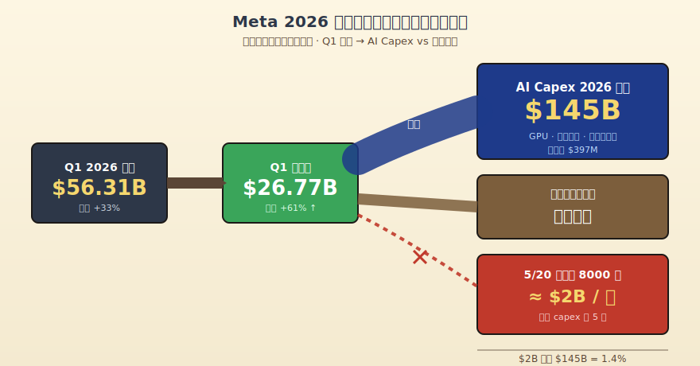
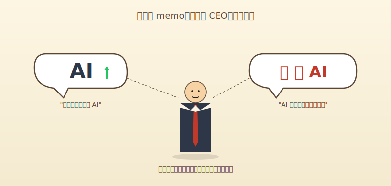
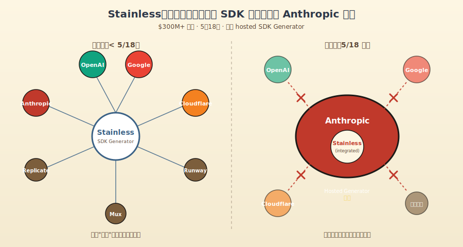
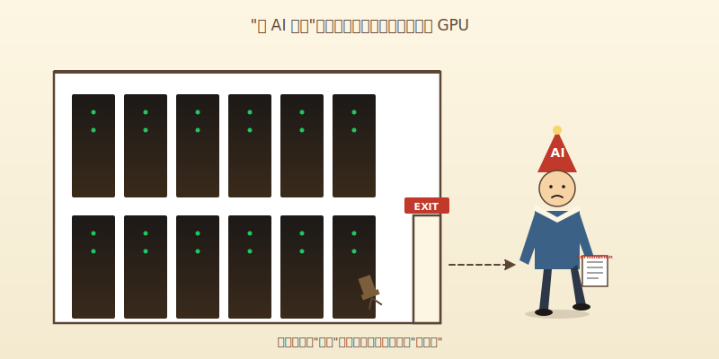
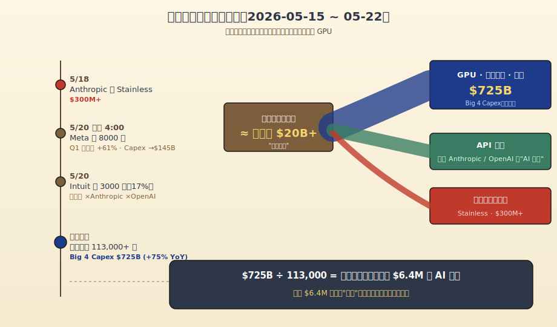

# 裁8000人省下的钱，够Meta烧5天GPU

> **发布日期**：2026-05-22 | **分类**：AI行业观察

## 导语

5 月 20 日凌晨 4 点，8000 个 Meta 员工的邮箱里都收到了一封同样格式的邮件。这一周里，Zuckerberg 在另一封内部信里写道："Success isn't a given."（成功不是理所应当的。）就在四周之前，Meta 公布了 Q1 财报——季度营收 $56.31B、净利润 $26.77B、同比涨了 61%。

这一周硅谷一共裁了一万一千多人。AI 不是凶手，AI 是借口。

---

## 一、凌晨 4 点的邮件，季报上的 61%

5 月 20 日凌晨 4 点，Meta 的人力系统发了 8000 封邮件。收件人是被裁的员工——大约相当于 Meta 全员的 10%。同期被冻结的还有 6000 个空缺岗位，意思是这一年 Meta 实际从市场上抽走了 14000 个人形劳动力的供应。被保留下来的另外 7000 个同事，则被"重新分配到 AI 团队"。

Zuckerberg 给这件事打的标签是"AI 重组"。memo 里那句话现在看起来挺有内味儿：AI 是我们这一生最具决定性的技术（AI is the most consequential technology of our lifetimes）。

翻译成会计语言：

> **这是我这辈子见过最贵的一笔账，所以我需要在别的地方省一点。**

省哪儿了？省人。

把数字摊开看。Q1 财报发布的当天，Meta 顺手把 2026 年全年的资本开支指引从 $115–135B 上调到 $125–145B（前后差了 100 亿美元），目的地全部是 GPU、数据中心、第三方算力。同期 Q1 营收 $56.31B、同比 +33%，净利润 $26.77B、同比 +61%，运营利润 $22.9B——已经把 Reality Labs 那个常年亏损的部门也一起摊进去了。

这不是一家熬冬的公司。这是一家钱多到要花、但花的方向不在你身上的公司。

把数字摊开做一道小学算术：$145B 的全年 capex 摊到 365 天，是每天 $397M。8000 个员工一年的工资是多少？按 Meta 工程师的市场行情估，base 在 $200K 上下，加股票期权和福利大概 $250K 不到——这是相对保守的估算。8000 × $250K = $2B。

$2B 听起来很多对吗。

$2B 除以 $397M 等于 5.04。

> **这 8000 个员工的工资一年加起来，够 Meta 烧 5 天 GPU。**

就 5 天。

那 5 天能换来什么？1450 亿美元里那剩下的 360 天能换来什么？答案是：让 Meta 的广告 AI 模型 GEM 把广告转化率再撬高几个百分点——Q1 已经撬了 6% 出头，是公司有史以来第一次把 AI 对广告效果的贡献量化进财报。再让 FAIR 和 Reality Labs 继续在 H200/B200 上烧实验，让 Llama 系列模型继续更新到下一个版本号。

8000 个员工，是这张账单里最便宜的一项。

> **因为他们是活的，所以可以解雇。**

GPU 不行，GPU 已经下单了，违约金比工资贵。数据中心的电力合同已经签了，三年期不能反悔。Broadcom 的定制芯片已经流片了，回不去了。员工不一样，员工的"违约金"叫遣散费，按公司政策结算，下个季度财报就消化干净。

凌晨 4 点的邮件，是为下午 4 点的算力账单腾出现金流的。

老粉都知道，半佛过去解释过一种叫"会计学美容"的活——一笔损益本来不好看，会计师让你换个分类，看起来就好多了。Meta 这次不是损益问题，是现金流问题。账面利润漂亮归漂亮，账面利润不等于自由现金流，自由现金流要拿去交 GPU 押金。Capex 不在利润表上扣，它在现金流量表上扣。但 8000 个员工的工资是费用，扣在运营成本里。

把人砍掉，运营利润看起来更漂亮；把 GPU 加上，运营利润不受影响。完美。

## 二、Intuit 学会了一种新的双语

Meta 这事还有遮羞布——它至少财报漂亮，裁员只是为了腾现金流。Intuit 这一周的操作就更生动了。

也是 5 月 20 日，Intuit 同步宣布裁员 3000 人，占全球员工的 17%，覆盖 7 个国家、4 个品牌：TurboTax（报税软件）、QuickBooks（中小企业财务）、Credit Karma（信用评估）、Mailchimp（邮件营销）。被裁的美国员工拿到的遣散包算厚道：16 周基础工资打底，再按工龄每年加 2 周。美国本土员工的最后工作日定在 7 月 31 日。

但你点开 Intuit CEO Sasan Goodarzi 那份内部 memo，你会发现一件很 funny 的事——他在公开口径里同时说了两件互相矛盾的话。

第一句是："我们要重新聚焦 AI"（We are sharpening our focus on AI）。这句话被各大科技媒体抄进了标题，TechCrunch 那篇直接叫"Intuit to lay off over 3,000 employees to refocus on AI"——为了聚焦 AI 而裁员。

第二句，是后续澄清里出现的："AI 不是这次裁员的原因。"

读到这里我笑了。

这就像一个男的跟你说：我没出轨，我只是和我女同事下班吃了顿饭，但不是为了出轨，是因为我们公司食堂关门了。每一个字都对，组合起来你就知道发生了什么。

把 Intuit 的实际操作摊开看更清楚。Intuit 在 2026 年 2 月和 Anthropic 签了多年合作协议，把 Claude 嵌入 TurboTax 和 QuickBooks 的"金融智能体"功能里。同期又和 OpenAI 签了另一份多年合作。两份都是吃钱的协议——也就是说，Intuit 一边把 3000 人从工资单里划掉，一边把更多的钱划进了 Anthropic 和 OpenAI 的 API 账单。

Intuit 不公开 API 合同金额，但行业里"multi-year deal"通常是九位数级别（笑）。两份协议加起来，大概率覆盖了 3000 人省下的全部工资还有余。

省下来的人头钱直接喂给硅谷两家 AI 新贵了。

CEO 在 memo 里还有一句更精彩的："我们要通过简化公司架构来降低复杂度。"（reduce complexity by simplifying the company's corporate structure）这句话直译成中文叫"降低公司复杂度"，翻译成黑话叫"我们裁人是因为我们想裁人，原因不重要"。

为什么这么解读？

因为 Intuit 这一年其实没什么"组织复杂度"问题。它真正的复杂度问题是它的客户群——美国中产报税的、小生意主、信用卡用户、邮件营销人——这群人没有一个会因为"AI 转型"变得更值钱。Intuit 的股价从 2026 年初的 $813 跌到了 $388，YTD 跌了 38%。市场不是在奖励它的 AI 转型，市场是在用脚投票：你这个行业的客户被 ChatGPT 直接吃掉一半了——人们开始用 ChatGPT 问报税问题，用 Claude 问财务问题，用 Perplexity 查 1099 表怎么填。

Intuit 是被 AI 颠覆的，不是因为 AI 而升级的。但 CEO 不能这么说，因为这么说股价当天就崩了。所以他要把这件事包装成"我们主动重组以拥抱 AI"。

3000 个被裁的人不是被 AI 替代的，是被自己公司付给 Anthropic 和 OpenAI 的 API bill 买单的。

把账单摊开：

- Intuit 一年省下 3000 人的工资（按美国软件公司平均 $180K 估算，约 $540M）
- 拿出去的"multi-year deal"金额不公开，但行业惯例至少是九位数级别
- 客户用产品的体验是：开 TurboTax 弹出一个 Claude 助手帮你填表

那个 Claude 助手，背后是 Anthropic 的工程师写的、用 Anthropic 的 GPU 跑的。Intuit 自己原来报税板块里那批每天和 W-2、1099 表格打交道的产品经理和工程师，去哪儿了？

被解雇了。

但 CEO 说："AI 不是这次裁员的原因。"

行。

## 三、Anthropic 在另一头收东西

挨刀的看完了，看挥刀的。

同一周的 5 月 18 日，Anthropic 在自家官网发了一篇博客，标题三个字：Anthropic acquires Stainless。

Stainless 这家公司你大概率没听过。它干什么的？给所有 API 公司生成 SDK。

简单解释：今天所有 AI 公司发布模型的时候，都要给开发者提供 SDK（Software Development Kit）——也就是各种语言的客户端库。OpenAI 发 GPT-5.5 的时候，你能用 Python、TypeScript、Go、Java 一行 `import openai` 就调用——这背后的 SDK 不是 OpenAI 一行行手写的，是 Stainless 用一个叫 codegen 的系统从 API spec 自动生成的。

谁在用 Stainless？官方公开的客户名单包括：

- **OpenAI**
- **Google**
- **Cloudflare**
- **Anthropic**（也就是收购方自己）
- **Replicate**
- **Runway**
- **Mux**

发现什么了吗？

OpenAI、Google、Anthropic——硅谷三家最大的、号称在 AI 战争里你死我活的对手——它们对外发布的 SDK，都是同一家小公司做的。

Stainless 是 2022 年成立的，创始人 Alex Rattray 之前在 Stripe 干了三年（2017-2020），干的就是 API 文档和 codegen——他写过 Stripe 那个被申请专利的 codegen 系统，写过 Stripe 的 TypeScript 客户端，重做过 Stripe 的 API docs。他是这个细分领域里最懂行的那个人。从 Stripe 离职以后，开发者们追着他要"Stripe 那样质量的 SDK"，他于是创办了 Stainless。

Anthropic 据 The Information 报道，花了**超过 3 亿美元**买下他。

"超过"两个字才是关键——大于号的另一头有多远没披露，但起步就是九位数。3 亿美元在 AI 行业能买什么？大概是 Anthropic 三周到一个月的 GPU 账单。但对一家几十人的 SDK 工具公司来说，这是天价。

收购公告里 Anthropic 写了一段非常体面的话：现有 Stainless 客户的 SDK 所有权归客户，他们可以自行修改和扩展。听起来挺无情？再看下一句——**Anthropic 会关停所有 Stainless 的 hosted 产品，包括它的 SDK generator**。

也就是说：

- 你之前用 Stainless 自动生成 SDK？以后不行了
- 你之前依赖 Stainless 跟着 API 变更自动同步 SDK？以后没了
- 你之前付钱给 Stainless 让它帮你维护跨语言 SDK？合同到期不续

OpenAI、Google、Cloudflare——这三家手里捧着 Stainless 已经生成的 SDK，名义上"所有权归你"，但 codegen 平台关了。换句话说：你的 SDK 还是你的，但你不能再让 Stainless 帮你升级了。下次你的 API 加新功能，你要么自己写 SDK 维护团队（贵），要么找一个新的 SDK 公司从头开始（也贵），要么——

去用 Anthropic 的 API（笑）。

Anthropic 不是在收一家 SDK 公司。Anthropic 是在收一面镜子——这家镜子工厂以前同时给三家武林高手照镜子，看清自己长什么样、明天该怎么练剑。Anthropic 把工厂买了，把外面的店关了，留给自己用。

3 亿美元能买到的具体的东西，包括但不限于：

- Anthropic 自己内部的 SDK 工具链得到强化（Stainless 本来就是 Anthropic 一直在用的，现在彻底吸收）
- 对手（OpenAI、Google）的开发者关系工具链受到延迟性打击
- Stainless 的整个工程师团队成为 Anthropic 自己的 developer relations 内核
- Anthropic 多了一张原来没有的牌：知道竞争对手的 SDK 设计、节奏、习惯

这才是 AI 战争该有的样子。不是模型评测榜上互相绕来绕去的"我又超越了你 0.3%"，是把对手的供应链买下来关掉。

同一周的另一头还在烧钱：Anthropic 在 4 月公布的 Google + Broadcom 算力合作——3.5 GW 的 TPU 算力（2027 年起），加上已经在供应的 1 GW，加上 Anthropic 已经承诺的 $50B 美国 compute infrastructure 投资——这一切的背景数字是 Anthropic 的 run rate 已经从 2025 年底的 $9B 涨到 2026 年 4 月的 $30B，4 个月涨了 3.3 倍，年付超过 $1M 的企业客户从 500 家不到涨到了 1000+ 家。

裁员的不在 Anthropic。Anthropic 在招人、在收购、在签客户。AI 不是凶手——AI 公司是受益者。

那么凶手是谁？

## 四、Altman 和 Andreessen 已经替我们承认了

有两个人的原话值得拿出来念一念。这两个人都站在这场 AI 资本盛宴的 C 位——一个是 OpenAI 的 CEO，一个是 a16z 的合伙人——他们是最不该替"AI 不是裁员真因"这件事背书的。

但他们俩都说了实话。我猜是手抖。

**Sam Altman 的原话**：

> "There is some AI washing where people are blaming AI for layoffs that they would otherwise do."
>
> （有一些 AI 漂绿现象——公司把本来就要做的裁员栽在 AI 头上。）

Altman 是 OpenAI 的 CEO，AI 故事最大的受益者。连他都说"AI 是个借口"。这就像麦当劳的 CEO 公开说"其实很多人买巨无霸不是因为饿"。

**Marc Andreessen（a16z）的原话**：

> AI 是 "the silver bullet excuse: 'Ah, it's AI.'"
>
> （银弹借口：'啊，是 AI 干的。'）

Andreessen 也是公开说的，把 AI 描述成裁员的"silver bullet excuse"——意思是不管真因是疫情后超额招聘、还是利率太高、还是产品周期到了，只要套上 AI 这个标签就万能。

为什么这两个最该信 AI 的人会说真话？

因为他们俩比谁都清楚：AI 现在的部署根本不到能"替代"几万人的程度。Oxford Economics 反复测算过这个数据：大多数雇主并没有真的用 AI 替换大量员工，大多数裁员的岗位上根本没有 AI 接过去。

那些被裁的人去哪儿了？没去 Anthropic（Anthropic 招的是研究员和基础设施工程师），没去 OpenAI（OpenAI 同样在招芯片和数据中心的人），没去 GPU——GPU 不需要人。

他们去了：劳动力市场的下一个工位。一个写 React 的工程师，被裁之后投了 50 家公司，里面 49 家还在用 React，没有一家在面试他"AI prompt"能力。但他自己在投简历的时候要把"AI 经验"写上去——因为不写好像找不到工作，写了又确实不知道写什么——所以他写："Familiar with prompt engineering, ChatGPT, Claude usage in daily workflow."

你看，这其实就是大多数被裁的人最后的"AI 经验"。

把全行业的数据摊开看更直接：

- 截至 2026 年 5 月 18 日，2026 年科技行业累计裁员 **113,000+ 人**，分布在 179 家公司
- 平均每天裁 **825 人**
- 同期，亚马逊、谷歌、Meta、微软四家公司 2026 年的 capex 加起来是 **$725B**，同比 +75%
- 几乎全部用在 AI 数据中心、芯片、基础设施

$725B 除以 113000，等于每个被裁的人头上压着 $6.4M 的 AI 投入。但你要注意——**大多数被裁的人，岗位上根本没有被 AI 真的接过去**。这 $6.4M 不是"取代"了被裁的那个人。这 $6.4M 是去喂英伟达 H200 的、是去给电力公司打款的、是去给台积电 Arizona 厂下定金的、是去给 Stainless 这种被收购的小工具公司付 3 亿的。

每一个被裁员工头上的 $6.4M 不在替代他们干活，而在跟他们抢"公司预算上的座位"。

这就是为什么"AI 替代你"这个叙事在事实层面站不住脚，但在传播层面又特别成功——四方共谋的结果：

- 对管理层来说，把裁员包装成"AI 转型"是最体面的版本——看起来在前进，不是在后撤
- 对员工来说，"被 AI 替代"听起来比"被 capex 挤掉"更高级——被未来淘汰，不是被会计淘汰
- 对投资人来说，听到"AI 重组"就给溢价，听到"现金流紧张"就抛售
- 对监管者来说，"AI 失业潮"是一个会被讨论但不会被立法干预的政治议题

113000 个被裁的人，戴着一顶"被 AI 替代"的帽子去找下一份工作。但他们实际是被自己原公司里那条"GPU 押金条款"挤下去的。

帽子上写着"未来"。但底层会计科目写的是"现金流"。

## 五、你被 GPU 替代了，不是被 AI

把这一周硅谷的事件摊在一张表上：

| 公司 | 操作 | 数字 |
|------|------|------|
| Meta | 裁 8000，重分配 7000 到 AI | Q1 净利润 +61%，全年 capex 上调到 $145B |
| Intuit | 裁 3000（17% 员工） | 同期与 Anthropic、OpenAI 都签了多年合作 |
| Anthropic | 收购 Stainless（$300M+） | run rate 从 $9B 涨到 $30B（4 个月 +3.3x）|
| 全行业 | 累计裁员 113,000+ | Big 4 capex 合计 $725B（+75% YoY）|

这四行放一起，就是这一周 AI 行业的真实结构。

被 AI 替代的人有没有？有。但数量级很小。被 GPU 替代的人有多少？

> **11 万。**

不是 AI 替代你。是 GPU 把你的工位挪了。

GPU 是怎么挪你的工位的？

它走了一条会计的暗路：

1. 公司说"我要做 AI"——这是叙事
2. 公司去买 GPU——这是支出
3. GPU 上财务报表是资本支出，要折旧 5 年
4. 但买 GPU 之前要付现金，几十亿、几百亿、上千亿
5. 现金从哪儿来？营业利润——但营业利润已经被股东盯着了
6. 怎么撬出来更多现金？砍人——人砍掉了，运营利润看起来更漂亮，自由现金流也更宽松
7. 砍下来的人头上盖一个"为 AI 让路"的章——比"为现金流让路"好听

整个流程里，AI 模型本身做的事情就两件：让 Meta 的广告转化率涨 6%、让 Intuit 的 TurboTax 多了个聊天助手。这俩成绩加在一起，根本不需要裁 11000 人。

那为什么裁这 11000 人？

因为 Capex 表上的那个数字膨胀了，营运利润表上的某个数字必须缩。不是因为 AI 比你聪明，是因为 GPU 比你贵。

更狠的是：你被裁之后，AI 也不会真的来接你的工位。它接不了。Goodarzi 自己澄清"AI 不是裁员原因"——他没说错。但他的下一步是给 Anthropic 和 OpenAI 打款。你的 KPI 表上那一栏下个季度可能确实空着，因为没有 AI 真的来接，但你的工位坐了一个新的 PM，每年的人头预算从工资单挪到了 API 账单。

最讽刺的一幕是：那些"被 AI 替代"的人，下一份工作大概率还是不被 AI 替代的——因为 AI 现在做不了多少事。但他们要在被 AI 替代的 narrative 里找工作，要在面试时说"我对 AI 时代很期待"——其实他们刚刚被这个 narrative 当作"成本项"砍掉。

5 月 20 日凌晨 4 点的那封邮件，Meta 的员工读完之后大概率不会想到这些。他们会想：我接下来去哪儿？我学不学 AI？我是不是要去做 Prompt Engineer？

但 Prompt Engineer 是 AI 公司在替自己招的人。他们招的人坐在那儿管 Claude、管 GPT，每天写 prompt——你猜每写一个 prompt 是谁付钱？

你之前的雇主。从那笔 API 账单里。

那笔 API 账单的支付方式是预付。预付，是从你之前公司的现金流里走的。整条链是这样的：你之前的雇主把你裁掉，省下的工资预付给 OpenAI，OpenAI 用这笔钱雇 Prompt Engineer，Prompt Engineer 替你之前的雇主写一些不咋样的工单回复模板。

整条链的最末端是被裁的你。

最讽刺的是这条链整完，AI 转型还没真转完。Meta 内部 7000 个"重新分配到 AI 团队"的同事——他们做的事大概率是接入更多的 LLM API、调一些参数、搭一些 internal tools、写一些没人会用的 Slack bot。这些活的本质，是把现有产品包装得"看起来用了 AI"，不是真的产生 AI 替代效率。

回到 5 月 20 日凌晨 4 点。那封邮件抵达员工邮箱的时候，Zuckerberg 那句 memo 还在继续传播："Success isn't a given."

是的，成功不是理所应当的。

但 GPU 是。GPU 已经下单了，已经付定金了，已经签了三年期的电力合同了。GPU 一定会来，而你一定不会回去。

转什么 AI。这是金融操作，不是技术革命。

就这。

---

## 数据来源

- [Zuckerberg's Meta layoffs memo: 'Success isn't a given' in the AI era - CNBC](https://www.cnbc.com/2026/05/20/meta-layoffs-zuckerberg-says-success-isnt-a-given-in-memo.html)
- [Meta slashes 8000 jobs as it pivots towards AI - NPR](https://www.npr.org/2026/05/20/nx-s1-5826917/meta-layoffs-ai-jobs)
- [Meta Q1 2026 earnings report - CNBC](https://www.cnbc.com/2026/04/29/meta-q1-earnings-report-2026.html)
- [Meta bumps 2026 capex forecast up to $145 billion - Fortune](https://fortune.com/2026/04/29/meta-zuckerberg-145-billion-ai-spending-roi/)
- [Anthropic acquires Stainless - Anthropic](https://www.anthropic.com/news/anthropic-acquires-stainless)
- [Anthropic has acquired the dev tools startup used by OpenAI, Google, and Cloudflare - TechCrunch](https://techcrunch.com/2026/05/18/anthropic-has-acquired-the-dev-tools-startup-used-by-openai-google-and-cloudflare/)
- [Anthropic Acquires Stainless for Over $300M - Analytics Insight](https://www.analyticsinsight.net/news/anthropic-acquires-stainless-for-over-300m-to-strengthen-ai-sdk-and-tool-access)
- [Intuit to lay off over 3,000 employees to refocus on AI - TechCrunch](https://techcrunch.com/2026/05/20/intuit-to-lay-off-over-3000-employees-to-refocus-on-ai/)
- [Intuit (INTU) Q3 earnings report 2026 - CNBC](https://www.cnbc.com/2026/05/20/intuit-intu-q3-earnings-report-2026.html)
- [Anthropic expands partnership with Google and Broadcom - Anthropic](https://www.anthropic.com/news/google-broadcom-partnership-compute)
- [Anthropic Tops $30 Billion Run Rate - Bloomberg](https://www.bloomberg.com/news/articles/2026-04-06/broadcom-confirms-deal-to-ship-google-tpu-chips-to-anthropic)
- [113K Tech Layoffs in 2026 While AI Spending Hits $725B - TechJournal](https://techjournal.org/tech-layoffs-2026-ai-spending)
- [More companies are pointing to AI as they lay off employees - CBS News](https://www.cbsnews.com/news/ai-layoffs-2026-artificial-intelligence-amazon-pinterest/)
