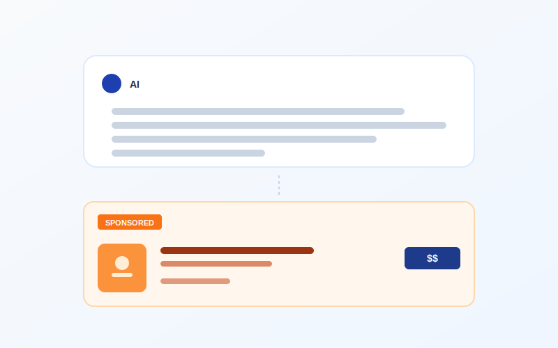
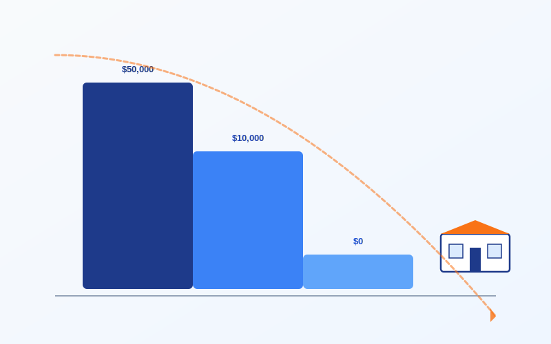
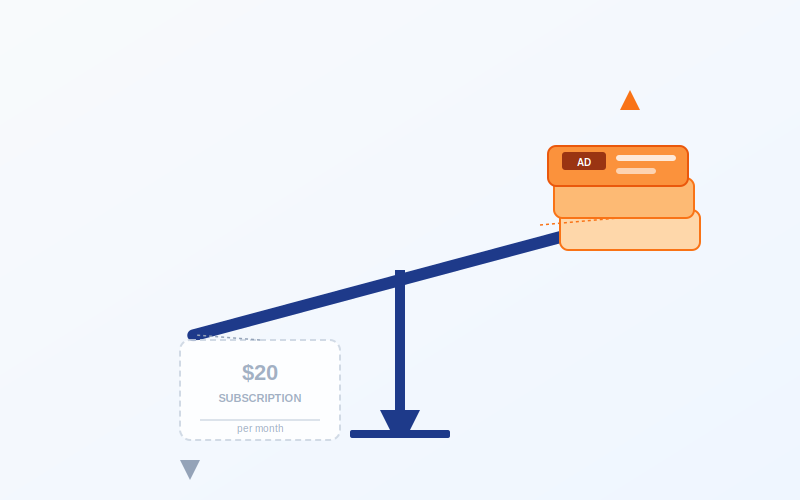
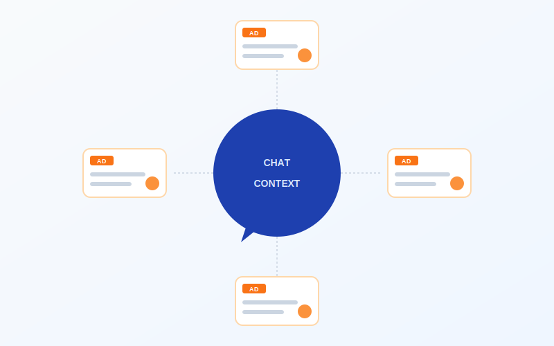

# 你每月付的20美元，正在变成一条赞助卡

> **发布日期**：2026-05-23 | **分类**：AI产业深度

## 导语

OpenAI 用六周时间把 ChatGPT 里的广告业务跑到了一亿美元年化收入，然后给所有美国企业开了一个自助下单后台。这件事看起来像是一个新业务线的诞生。它实际上是另一件事的死亡通知——AI 公司收你每月二十美元想让你认真用大模型，这个商业模式从来没有跑通过。

---

## 一、六周一亿美元

2026 年 5 月 5 日，OpenAI 的货币化负责人 Asad Awan 在博客上宣布，ChatGPT 自助广告管理后台开始向全美企业开放公测。前一个月，最低消费门槛从五万美元降到零；前一周，CPM 报价从开盘时的六十美元跌到了二十五美元；同一周，CPC 竞价模式上线，每次点击三到五美元。

这一组数字单看是产品迭代节奏。摆在一起看就不是了——这是 OpenAI 在用最快的速度把广告这件事从"试点"变成"基础设施"。

广告业务的早期数据更扎眼。OpenAI 公开的口径是：六周时间，年化收入跑到一亿美元，吸引了六百多家广告主。对照一下 ChatGPT Plus 的处境——这款定价二十美元一个月的订阅产品，OpenAI 自己的内部预测是 2026 年订阅数会从 2025 年的四千四百万跌到九百万，跌幅 80%。

订阅在收缩，广告在膨胀。

OpenAI 给投资人看的另一组数字解释了为什么。2026 年广告收入目标二十五亿美元；2027 年一百一十亿；2028 年二百五十亿；2029 年五百三十亿；2030 年一千亿美元。这条曲线的斜率比 ChatGPT 用户增长曲线还陡。作为对照，Google 整个广告业务跑了二十多年，2025 年的收入是两千九百四十六亿美元——OpenAI 给自己的 2030 年目标是这个数的三分之一。

四年时间，从零到 Google 三分之一。

支撑这条曲线的产品形态已经摆在用户面前。免费版和 Go 版（八美元/月的廉价订阅）的用户，在某些类型的对话里——食物、产品、购物、本地服务、旅行、娱乐——会在 ChatGPT 答完之后看到一个"赞助卡"：带品牌 logo、产品名、价格、库存、配送时间，下面一行小字写"Sponsored"。

Plus、Pro、Business、Enterprise、Edu——这五个付费档不投广告。

逻辑一目了然。给你看广告的是没付钱的用户，和付了八块钱的用户。付二十、付两百、付两千的不看广告——他们看的是 OpenAI 真正想留住的人。但 OpenAI 自己的预测里，2026 年 Plus 用户要跌到九百万，Go 用户要冲到一亿一千两百万。

广告池要爆炸性扩张了。这不是副业。

---

## 二、五万美元的门槛是怎么消失的

OpenAI 内部把 2026 年广告业务的扩张分了三个动作。

第一个动作是降价。2026 年初进入 ChatGPT 广告池的那批"灯塔客户"——Adobe、Criteo、Dentsu、Omnicom、Publicis、WPP——拿到的报价是 CPM 六十美元（每千次曝光六十美元）。在数字广告行业里，这是一个高端 Premium 价格——Google 显示广告的 CPM 通常在五到十五美元之间。OpenAI 当时给了它一个"前沿溢价"——意思是，你在新东西上抢位置，得多付钱。

三个月后，CPM 跌到了二十五美元。Digiday 引述参与试点的广告代理商的话是一句：「Everything is coming down」。一切都在跌。

跌的不只是价格。CPC（按点击付费）模式在五月正式上线，每次点击三到五美元——这是一个让广告主可以衡量 ROI 的定价。CPM 卖的是"你的广告被人看见"，CPC 卖的是"你的广告被人点击"。前者赌的是品牌曝光，后者赌的是真实意图。后者更难做，但更容易让广告主续费。

第二个动作是拆门槛。早期 ChatGPT 广告的最低承诺消费是五万美元——这个数字过滤掉了 99% 的中小广告主，只留下大品牌和大代理商。2026 年 4 月，这个门槛降到了一万美元。2026 年 5 月 5 日，自助后台开放公测的同一天，门槛被取消了——美国境内所有注册企业都可以登录、注册、上传素材、设置预算、跑广告。

整个流程从"你认识 OpenAI 销售吗"变成了"你有信用卡吗"。

第三个动作是扩品类。最早 ChatGPT 广告只允许消费品、本地服务、旅游、娱乐和数字/教育产品几个类别。2026 年春天，金融服务被开放——这是一个高 CPM、高合规要求的领域，传统上是 Google 广告收入的现金奶牛之一。Marketing Brew 报道这件事时用了个不那么委婉的词："the pilot is opening up"。试点正在打开。

国家也在打开。OpenAI 计划接下来几周把广告业务推到英国、墨西哥、巴西、日本、韩国。

把这三个动作连起来看，逻辑很干净。第一步降价拉回头客；第二步去门槛拉新客户；第三步扩品类把广告位填满。这是任何广告平台从冷启动到规模化必经的三步——Facebook 在 2007 年到 2010 年走过，Google 在 2003 年到 2006 年走过，TikTok 在 2019 年到 2021 年走过。

唯一的区别是，OpenAI 把这三步压缩进了一年。

Asad Awan 在 5 月 5 日的对外采访里没有掩饰这种紧迫。他说 OpenAI 想象中的未来是——广告主以后不需要再雇代理商，不需要再学 Ads Manager 的复杂界面，而是直接对 ChatGPT 说一句话："帮我给我的咖啡店投个广告，预算两千美元，目标是让方圆五公里的人来店里。"然后 ChatGPT 帮你拆解目标、生成素材、出价、跑数据、自动优化。

意思是，OpenAI 不只想做广告平台。它想做一个吃掉广告代理商的广告平台。

这个野心在五年前是科幻。现在它是商业计划书上的一条 KPI。

---

## 三、二十美元月费的死亡螺旋

要理解 OpenAI 为什么要这么快做广告，得先看一下它的财务报表。

OpenAI 自己披露给投资人的数字：2026 年全年收入预期三百亿美元，净亏损一百四十亿美元。第一季度的非 GAAP 运营利润率是 -122%——意思是，每挣到一美元，要倒贴一美元两毛二。按这个利润率推算，2026 年全年的运营亏损会接近三百六十亿美元。

亏损来自一个所有 AI 公司都绕不开的成本结构：算力。OpenAI 的服务器账单大部分付给微软 Azure，少部分付给 Oracle 和自有数据中心。每一个用户问 ChatGPT 一个问题，模型推理一次，OpenAI 就要付一笔实打实的美元。九亿周活、每天两亿五千万次对话，这些数字翻译成账单是一个让人睡不着觉的数字。

二十美元月费的 ChatGPT Plus，原本是用来撑住这个账单的。

但 OpenAI 自己的 2026 年内部预测里，Plus 订阅数会从 2025 年的四千四百万跌到九百万——四千四百万到九百万是个什么概念？是一年蒸发掉 3500 万付费用户。同期 ChatGPT 周活用户从 8 亿涨到 9 亿。用户在涨，付二十美元的人在跌。

OpenAI 不是没意识到这个问题。它的应对是推出更便宜的 ChatGPT Go——美国八美元/月，其他国家约五美元/月。内部预测 Go 订阅会从近乎零冲到一亿一千两百万。

听起来不错。但算一笔账——四千四百万乘二十等于八亿八千万。九百万乘二十加一亿一千两百万乘八等于十亿七千八百万。订阅收入只多了一点点，但用户量翻了两倍多，意味着每个用户能分到的算力被极大稀释。

这就是上一篇关于「AI 变懒」的稿子写的那件事——Plus 用户付二十美元，但每个 Plus 用户实际消耗的推理成本可能是五十到一百美元。把每个用户的推理预算砍掉一半，让模型答得短一点、想得浅一点，是订阅模式下唯一能续命的办法。

广告业务是另一个办法。

Google 用了二十多年向所有人证明了一件事——一个让数十亿人每天使用的产品，最大的变现方式不是订阅，是广告。订阅养不起一个 9 亿周活的免费产品。广告可以。

OpenAI 给投资人画的 2030 年图是这样的：二十七亿五千万周活用户，一千亿美元广告收入。把这两个数字除一下——每个周活用户每年贡献约 36 美元广告收入。Meta 在 2025 年的 ARPU 是 49 美元；Google 是 200 美元。OpenAI 的 36 美元假设并不疯狂——疯狂的是它假设自己能在四年内拥有 27.5 亿周活，相当于 Google 现在搜索用户的一半。

但这个数字是关键——你能看出来 OpenAI 把自己最重要的护城河押在了哪里。不是 GPT-7，不是 Agent，不是 AGI。是把"ChatGPT 是 27 亿人每天打开的免费工具"做成事实。

让 ChatGPT 一直免费的成本，由广告主付。让广告主愿意付的前提，是 ChatGPT 真的有 27 亿用户。

这就是为什么 OpenAI 不能让 Plus 的二十美元月费撑起体验——撑起体验意味着提高单用户成本，意味着用户量增长会被算力瓶颈卡死，意味着 2030 年的 27 亿用户故事讲不下去，意味着一千亿广告收入的曲线塌掉。

订阅死掉的过程，就是广告业务起来的过程。这不是巧合。这是同一件事的两个剖面。

---

## 四、广告是什么形状的

OpenAI 的广告产品形态值得拆开看，因为它和过去二十年的所有数字广告都不一样。

Google 搜索广告的形态是这样——你搜"附近的牙医"，结果页前三条带"赞助"小字，下面是自然搜索结果。广告和内容在视觉上有差异，但都在做同一件事：回答你的查询。

Facebook 信息流广告的形态是——你刷动态，刷三条朋友的更新，第四条是品牌的推广帖。广告插在内容流里，长得跟内容差不多，但带一个"赞助"标签。

ChatGPT 的广告形态不一样。OpenAI 在帮助文档里写得很具体——当你在某些话题（食物、产品、购物、本地服务、旅行、娱乐）下问 ChatGPT 一个问题，ChatGPT 答完你的问题之后，会在答案下方弹出一张"产品卡"。卡上有品牌 logo、产品名、价格、库存状态、配送或服务时间，再加上一行小字"Sponsored"。

关键的设计选择是——广告不插在答案中间，不替换 ChatGPT 自己的回答，不污染答案的逻辑链。广告是答案之后的"延伸"。

这个设计听起来很克制。但 OpenAI 不掩饰它的另一面——广告主跟 OpenAI 签合作的同时，OpenAI 也在用合作伙伴关系给 ChatGPT 的回答做"建议"。Adobe、Criteo、Kargo、Pacvue、StackAdapt 这些广告技术公司被允许调整广告的预算、出价、素材，但广告显示在 ChatGPT 哪里，由 OpenAI 决定。

控制权全部在 OpenAI。广告主只能在它划出的方框里跳舞。

这个权力结构在历史上有过先例——苹果 App Store 上架审核、Google Play 下架机制、亚马逊产品搜索排序——都是平台方对供应方拥有绝对话语权。但在数字广告史上，这是一个新东西。Facebook 和 Google 都允许广告主在相当宽的范围内决定自己想出现在哪里、给谁看。ChatGPT 不行。

为什么 OpenAI 要把控制权抓得这么紧？

因为 ChatGPT 的广告位是一种"上下文"广告——它的价值不来自定向数据库，来自当下对话的语义匹配。一个用户问"我想给我妈买个生日礼物"，ChatGPT 回答完之后弹一张鲜花订购卡，这个卡之所以值钱，不是因为 OpenAI 知道这个用户是谁，而是因为这张卡精准接在了对话的当下。

定向广告的护城河是数据。上下文广告的护城河是理解。

OpenAI 比任何人都理解对话当下在说什么——它就是那个 AI。这意味着它的广告精准度有可能超过 Google（Google 知道你搜了什么）、超过 Facebook（Facebook 知道你的社交图谱）——因为它知道你的意图本身。

这个判断决定了 OpenAI 的定价策略。CPC 三到五美元一次点击，已经接近 Google 高竞争行业（保险、法律、贷款）的报价。OpenAI 在赌一件事——它的广告点击转化率比 Google 高得多，因为用户已经在跟 AI 谈论这个需求，下单的心理距离更短。

但这个赌局里有一个尴尬。用户跟 ChatGPT 的关系，过去三年是建立在"它不卖东西给我"上的——Google 帮你找东西但它的目的是赚你的钱，ChatGPT 帮你想东西但它的目的好像是帮你想清楚。这种信任是 ChatGPT 用户黏性的核心。

赞助卡出现的那一瞬间，这种关系发生了一个很小但很关键的变化——你开始要在 ChatGPT 的回答里分辨："这个建议是它真的觉得对，还是付了钱的人想让我相信对？"

OpenAI 在帮助文档里很努力地解释这个问题——它说广告只会出现在"答案之后"，不会污染答案本身；它说 ChatGPT 的回答永远不会因为某个品牌付了钱就推荐它。但这种解释只能解决用户的明面问题。它解决不了暗面问题——一旦广告业务变成 OpenAI 主要的收入来源（按它的预测，2030 年广告收入会占总收入相当大的比例），整个公司的产品决策就会被广告主的需求牵引。哪些话题适合插广告，哪些话题适合让用户多聊几句以积累上下文，哪些品类的回答应该更详细以便挂卡——这些决策不需要明面上"出卖"用户，就足以慢慢改变 ChatGPT 的形状。

商业模式塑造产品。这是过去三十年互联网史教过我们的最硬的一课。

---

## 五、ChatGPT 不是免费产品

把所有信息放在桌面上。

OpenAI 2026 年收入预期三百亿美元，亏损一百四十亿美元。Plus 订阅一年要丢 3500 万用户。ChatGPT 广告业务六周跑出一亿美元年化收入，目标 2030 年到一千亿美元。CPM 在跌、CPC 在上线、门槛在取消、品类在扩张、国家在打开。

这些数字单看都是商业新闻。摆在一起看是一份遗书——二十美元月费撑起 AI 服务的模式，写好了死亡时间。

实际上不是 OpenAI 一家的问题。Anthropic 收入年化三百亿美元，刚接近盈亏平衡。Anthropic 五月也宣布了和 Blackstone、Goldman Sachs 合资十五亿美元做企业 AI 服务——这意味着它的下一步是 B 端定制化收费，不是 C 端订阅扩大。Google 用 Gemini Omni、Gemini 3.5 Flash 和 Search 重建在打仗，但它真正的护城河仍然是 Search 广告——2025 年 2946 亿美元广告收入。

所有人都在跑同一件事——让大模型这个东西，从"用户付费"过渡到"广告主付费"。

这件事如果做成了，普通用户会得到三样东西：第一，更便宜的入门门槛（八美元的 Go 或者免费版变得越来越能用）；第二，悄悄缩水的服务质量（订阅版本继续被推理预算优化）；第三，越来越多的赞助卡（出现在你跟 AI 对话的"延伸"位置）。

这件事如果做不成，用户也会得到三样东西：第一，更贵的订阅价格（Plus 涨到三十、四十、五十）；第二，更小的免费版功能（Free 砍到只能聊几句）；第三，更频繁的"额度用完了"提示。

两条路殊途同归——都把"用户体验"这件事，从"AI 公司应该想办法做好"变成了"AI 公司必须想办法压成本"。

所以下一次你打开 ChatGPT，问它一个关于咖啡机的问题，看到下面弹出一张赞助的咖啡机产品卡——别觉得这是 ChatGPT 突然开始向你推销。这只是 OpenAI 在解一个它没法不解的方程：算力账单 + 用户增长 - 订阅天花板 = 必须接广告。

也别觉得这跟你没关系，因为你没付费、没看广告、用的是公司的 Enterprise 账号。OpenAI 给企业账号开的特权是"不投广告"，但它给企业账号收的钱，需要的依然是一个 27 亿用户的广告业务在另一边持续抽血来支撑——只有那个免费用户池子够大，企业才会相信 ChatGPT 是"AI 时代的基础设施"，才愿意付那个企业账单。

那 27 亿人——是真正在养你免费午餐的人。

互联网历史上有一句旧话：「如果你没付钱，那你就是产品。」这句话第一次说是用来形容 Facebook 和 Google。今天它落到了 ChatGPT 头上，落得比 Google 还彻底——因为 Google 知道你搜了什么，ChatGPT 知道你想了什么。

二十美元一个月的时代是个误会。它从来不是 AI 行业的最终商业模式，只是一个临时的、由风险投资补贴的、给免费版用户练手的过渡产品。OpenAI 用六周时间证明了广告这条路能跑通，剩下的事就是把那条路修宽，让更多车开上去。

至于你那个月付二十美元的 Plus 订阅——它没有死，它会变贵、变小、变得越来越像一个企业版的简化套餐。但 OpenAI 真正的未来不在你这里。

它在那个免费版用户底下的赞助卡里。

## 数据来源

- [OpenAI launches self-serve ad platform](https://www.axios.com/2026/05/05/openai-self-serve-ad-platform)
- [New ways to buy ChatGPT ads | OpenAI](https://openai.com/index/new-ways-to-buy-chatgpt-ads/)
- [Ads in ChatGPT | OpenAI Help Center](https://help.openai.com/en/articles/20001047-ads-in-chatgpt)
- [Testing ads in ChatGPT | OpenAI](https://openai.com/index/testing-ads-in-chatgpt/)
- [OpenAI opens ChatGPT Ads Manager to all US businesses with CPC bidding](https://ppc.land/openai-opens-chatgpt-ads-manager-to-all-us-businesses-with-cpc-bidding/)
- [OpenAI opens up ChatGPT ads manager to the U.S. while promising third-party measurement, CPA bidding](https://digiday.com/marketing/openai-opens-up-chatgpt-ads-manager-to-the-u-s-while-promising-third-party-measurement-cpa-bidding/)
- ['Everything is coming down': ChatGPT ads are getting cheaper](https://digiday.com/marketing/everything-is-coming-down-chatgpt-ads-are-getting-cheaper/)
- [ChatGPT ads hit $100M in six weeks - and OpenAI is just getting started](https://ppc.land/chatgpt-ads-hit-100m-in-six-weeks-and-openai-is-just-getting-started/)
- [Scoop: OpenAI projects $100 billion in ad revenue by 2030](https://www.axios.com/2026/04/09/openai-100-billion-in-ad-revenue)
- [OpenAI Had A Negative 122% Non-GAAP Operating Margin In Q1 2026](https://www.wheresyoured.at/news-openai-had-a-negative-122-operating-margin-in-q1-2026-and-chatgpt-growth-has-stalled/)
- [OpenAI Projects ChatGPT Plus subscriptions to drop by 80%](https://www.wheresyoured.at/openai-projects-chatgpt-plus-subscriptions-to-drop-by-80-from-44-million-in-2025-to-9-million-in-2026-made-up-using-cheaper-subscriptions-somehow/)
- [ChatGPT reaches 900M weekly active users](https://techcrunch.com/2026/02/27/chatgpt-reaches-900m-weekly-active-users/)
- [OpenAI exec wants advertisers to ditch agencies and just prompt ChatGPT for ads](https://ppc.land/openai-exec-wants-advertisers-to-ditch-agencies-and-just-prompt-chatgpt-for-ads/)
- [OpenAI is allowing financial services brands into the ChatGPT ads pilot](https://www.marketingbrew.com/stories/openai-financial-services-brands-chatgpt-ads-pilot)
