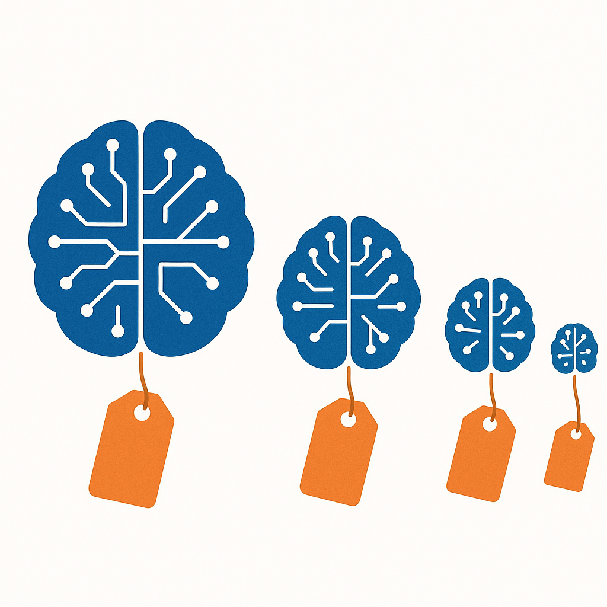

# 你的AI为什么越来越懒

> **发布日期**：2026-05-23 | **分类**：AI产业深度

## 导语

大模型"降智"不是技术故障。当用户量增长10倍而GPU只增3倍，让每个用户"少想一点"不是选择，是唯一的出路。一个参数的调整，揭开了AI产业最深处的结构性矛盾。

---

2026年3月3日，Anthropic的一名工程师改了一个参数。

具体来说，他把Claude的推理深度从最高档调到了中档——内部代号"effort 85"，意思是让模型只用85%的力气思考。没有发布公告，没有更新日志。在Anthropic看来，这是一次常规的性能优化。

用户那边的感受完全是另一回事。一周之内，用户反馈中"lazy"这个词的出现频率上升了93%。有人做了实测：同样的问题，推理过程的字符数从2200个缩减到了560个——缩水了67%。

这不是一次偶发的技术故障。也不是某个工程师的失误。这是一个所有AI公司迟早都要做的决定。

要理解这个决定，需要先看一组数字：在参数调整前后的同一时期，Claude的API请求量从1498次暴增到了11.9万次。对应的推理成本从345美元跳到了42121美元。用户在增长，但每个用户带来的不是利润，而是亏损。

这笔账的背后，是整个AI产业最不愿意公开讨论的问题：**你每月付的那20美元会员费，根本不够AI替你"认真想"的。**

---

## 一、不只是Claude

Claude被投诉降智的同一时期，ChatGPT和Gemini的用户也在抱怨同样的事情。有人整理了2025年下半年到2026年初的用户反馈趋势，发现几乎所有主流大模型都经历了类似的质量波动。

Anthropic的Claude Code负责人在回应中说了实话：这是"优化token消耗"。每一个token都是钱。模型思考得越深入，输出的token越多，Anthropic付给GPU的账单就越贵。

2025年2月，Anthropic先是引入了"自适应思维"模式，让模型自行决定在每个问题上花多少"思考时间"。一个月后，他们直接把推理深度的默认值从最高档拧到了中档。效果立竿见影：推理成本下降，服务器容量腾出来给更多用户。

代价是用户体验。但财务报表上只有一个数字在乎：推理成本。

AI行业的投入和产出严重倒挂。2025年，全球五大云厂商为AI基础设施砸了4430亿美元。而用这些基础设施运行模型的公司呢？OpenAI预计2026年全年亏损140亿美元。Anthropic收入增长到300亿美元年化，也只是刚刚接近盈亏平衡。花得多赚得少，这个行业的基本面决定了每一次推理调用都必须精打细算。

一个简单的类比：AI公司现在的处境，就像一家自助餐厅发现食材成本是餐费的两倍。每多来一个客人，就多亏一份钱。唯一的应对方法是什么？把牛排换成鸡肉，把大虾换成鱼丸——但菜单上的名字不改。

---

## 二、AI版"缩水通胀"

消费品行业有一个被研究了几十年的现象：缩水通胀（shrinkflation）。可口可乐的罐装从355毫升变成330毫升，薯片袋里的空气越来越多，洗衣液的浓度悄悄降低——价格不变，内容变少。消费者很少注意到，因为变化总是渐进的，而且包装看起来没什么不同。

大模型正在做同样的事。

你付的月费没涨，甚至在一些平台上还降了。但你得到的推理深度在下降，回答的详尽程度在缩水，模型"思考"的时间在缩短。一家公司的道德有好有坏，但成本结构没有感情。订阅制商业模式遇到推理经济学，结果是确定的。

问题出在定价结构上。AI公司向用户收的是固定月费（ChatGPT Plus 20美元/月，Claude Pro 20美元/月），但它们付给GPU的钱是按token计算的。每多想一步，每多输出一个字，就多花一份钱。用户付的是自助餐价格，AI公司承担的是单点菜的成本。

当用户量快速增长时，这个矛盾被急剧放大。Anthropic的数据显示，Claude的日均token消耗量在一年内增长了数十倍。但订阅收入的增长远远跟不上推理成本的增长——因为每个新用户带来的是20美元月费，但消耗的推理成本可能是50甚至100美元。

Sam Altman在2025年说过一句被广泛引用的话：同等AI水平的使用成本每12个月下降约10倍。这句话是对的。但他没有说的是另一半事实——AI公司正在把这个成本下降的空间，用于服务更多用户，而不是给每个用户更好的体验。

换句话说，技术进步带来的效率提升，被增长的用户量吃掉了。分母变大的速度快于分子。

这就是为什么你觉得AI在变懒。它确实在变懒——不是因为底层模型变弱了，而是因为分给你的算力变少了。就像高速公路拓宽了两倍，但同时涌入了五倍的车流。每辆车的体验不是变好了，而是变差了。

---

## 三、谁在这场降智中赚了钱

AI产业链的利润分配，可能是整个科技行业最讽刺的数据之一。

NVIDIA在2026财年第三季度的数据中心收入达到512亿美元，年化收入约2500亿美元，净利润约530亿美元。这家卖GPU的公司拿走了整个AI产业链约79%的毛利润。

而训练和运行这些模型的公司呢？OpenAI预计2026年全年亏损140亿美元，不预计2029年前实现正现金流。Anthropic刚接近盈亏平衡。DeepSeek在2026年4月启动了首轮融资——自有资金不够了。下游做应用的（Cursor、Perplexity等），加在一起的利润份额不到产业链的5%。

这就是AI产业最不对劲的地方。做模型的公司卡在利润最薄的位置——上面要付NVIDIA巨额芯片账单，下面要用低价争夺用户。每赚一块钱的收入，先付出三到四块钱的成本。

这就是为什么"降智"不是偶发行为，而是结构性的必然。当你的利润是负的，你唯一能压缩的可变成本就是推理深度。固定成本（GPU采购、数据中心建设、研发团队薪资）已经沉没了，用户增长不能停（否则估值下降、融资受阻），能动手术的只有每一次回答的"认真程度"。

---

## 四、当所有AI都一样聪明（或一样懒）

模型降智的故事还有另一层含义。

2024年初，中美顶级大模型在MMLU基准测试上的差距是17.5个百分点。到2026年初，这个差距缩小到了0.3%。Chatbot Arena排行榜上，前六名模型的Elo评分差距在80分以内——对于一个满分1500+的评分体系来说，这已经进入了统计误差区间。

模型趋同是一个比降智更深远的变化。它意味着大模型公司正在失去技术层面的差异化能力。当GPT-5.4、Claude Sonnet 4.6、Gemini 3.1 Pro在大多数任务上表现几乎一致时，用户的选择逻辑就不再是"谁更聪明"，而是"谁更便宜"或者"谁更稳定"。

对模型公司来说，这是一个双重打击。一方面，同质化导致定价权流失——你无法为一个跑分高出0.3%的模型收取两倍价格。另一方面，同质化使得"降智"的成本更低——反正用户也分不太清楚不同模型之间的区别，推理深度降低一点，大多数人不会注意到。

在国内市场，这个趋势走得更极端。2024年5月，DeepSeek-V2以每百万token一元的价格引爆了大模型价格战。一周之内，字节、阿里、百度、腾讯全部跟进。阿里通义千问降价97%，百度文心轻量版直接免费。到了2024年底，DeepSeek V3以0.27美元/百万token的价格达到了GPT-4o的水平。

但价格战不可能永远打下去。2026年2月，智谱打了行业涨价的"第一枪"——三个月内两次提价，累计涨幅83%。一个月后，阿里云、腾讯云、百度云的AI算力服务全面涨价10%到34%。唯一逆势的是DeepSeek，把价格压到了0.001元/千token的地板。

同一个月份里出现"地板价"和"全面涨价"，看起来矛盾，实际上揭示的是同一件事：大模型的定价已经脱离了"技术竞赛"的逻辑，进入了"生存竞赛"的逻辑。涨价的是不得不涨——成本撑不住了。降价的是选择了另一条路——用极致效率换市场份额。

但不管涨还是降，分给每个用户的推理资源只会变少，不会变多。这一点不会因为价格标签的变化而改变。

---

## 五、什么才是真正值钱的

Anthropic的财务数据里藏着一个耐人寻味的信号。

这家公司在2026年4月的年化收入达到300亿美元，超过了OpenAI的240亿。但它的消费端用户数只有ChatGPT的约5%。真正撑起Anthropic收入的是30万家企业客户，贡献了80%的收入，其中包括8家财富10强企业。

Anthropic的模型在大多数基准测试中排不到第一。那这30万家企业在为什么买单？

答案不是"最聪明的AI"，而是"最不容易出事的AI"。个人用户在乎的是"这个回答有多惊艳"，企业在乎的是"这东西会不会在凌晨三点给CEO发一封充满幻觉的邮件"。Anthropic卖的不是跑分，而是安全承诺和企业级SLA。微软的Copilot走的也是同一条路——在2026年企业AI部署中拿下32%份额，核心卖点不是模型最强，而是和Office生态的深度集成让出错的可能性最低。

当模型能力趋同到Elo分差80分以内时，竞争维度已经从"谁更聪明"转移到了"谁更可靠"。推理深度的绝对值不再是唯一重要的指标——稳定性、安全性、集成深度、错误率才是。一个每次都给你80分回答的AI，对企业来说比一个有时给95分有时给30分的AI更有价值。

AI编程工具市场是最早出现这个拐点的领域。85%的开发者已经在用AI辅助编程，他们同时使用2到4个工具。留存率最高的不是跑分最好的，而是在复杂工程任务中出错最少的。

PC行业在1990年代末从"谁的主频高"转向了"谁不蓝屏"。云计算在2010年代从"谁的算力便宜"转向了"谁的SLA更硬"。AI正在经历同样的拐点。

---

## 回到那个参数

2026年3月3日做出的那个决定——把推理深度从最高档调到中档——看起来是一次技术参数的优化。但它实际上回答了一个更根本的问题：

当AI的智能有成本时，谁来决定你能得到多少智能？

在当前的商业模式下，这个问题的答案不是用户。用户付了固定的月费，获得的是AI公司单方面决定的推理深度。你感受到的"变懒"，是AI公司在利润压力下做出的一次次隐蔽调整的累积。

一个月20美元的订阅费，覆盖不了无限制的深度推理。这不需要控诉，算一笔账就够了。

但这件事值得被说清楚。模型在变强，分给你的那一份在变少。进步是真的，缩水也是真的。

如果你真的在乎AI输出的质量——用AI辅助编程、做商业分析、处理专业文档——考虑切换到按量付费的API模式。你为每一个token付费，AI公司没有动力让模型"偷懒"。月费更低不代表更划算，因为你付的是打了折的智能。

至于整个行业，Anthropic的路径给出了一种可能的答案：不卖最聪明的AI，卖最可靠的AI。当技术差异消失后，信任变成了最贵的商品。

那个3月3日改参数的工程师，做了一个所有AI公司都会做的决定。但他也许无意间揭示了这个行业最重要的一个转向信号：**AI竞赛的下半场，比的不是谁的模型想得最深，而是谁能让用户相信它想得足够深。**

## 数据来源

- [Claude又又又又降智了 - 36氪](https://36kr.com/p/3767261832446727)
- [AI API Pricing History - TokenMix](https://tokenmix.ai/blog/ai-pricing-trends-history)
- [告别价格战，大模型共迎通胀时代 - 36氪](https://36kr.com/p/3777770980300039)
- [大模型价格战逆转？深扒17家厂商最新定价 - 知乎](https://zhuanlan.zhihu.com/p/1942707679077306986)
- [Anthropic Just Passed OpenAI in Revenue - SaaStr](https://www.saastr.com/anthropic-just-passed-openai-in-revenue-while-spending-4x-less-to-train-their-models/)
- [The Great LLM Convergence - Towards AI](https://towardsai.net/p/machine-learning/the-great-llm-convergence-when-everyones-best-becomes-nobodys-advantage)
- [NVIDIA Financial Results - Investor Relations](https://investor.nvidia.com/news/press-release-details/2024/NVIDIA-Announces-Financial-Results-for-Second-Quarter-Fiscal-2025/)
- [AI Coding Assistant Market Share 2026 - IdeaPlan](https://www.ideaplan.io/blog/ai-coding-assistant-market-share-2026)

