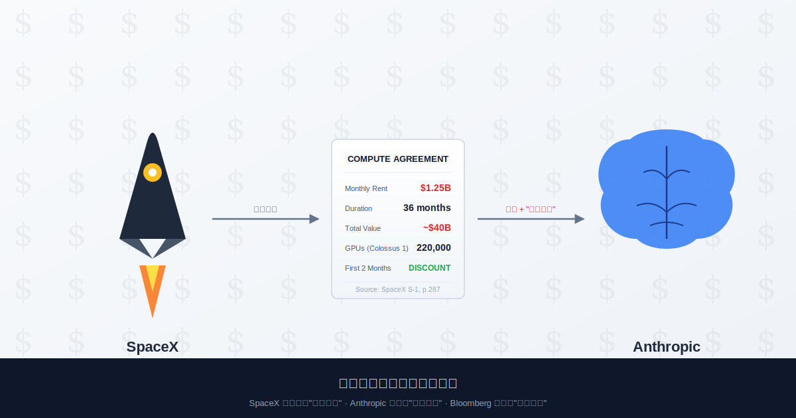

# Anthropic 宣布盈利那周，刚好开始给 Musk 寄 125 亿房租

> **发布日期**：2026-05-24 | **分类**：AI产业深度

## 导语

5 月 20 日这一天，Anthropic 同时宣布了三件事：估值冲到 9000 亿美元、第二季度首次实现 5.59 亿运营利润、接管 Elon Musk 旗下 SpaceX 的 220000 张 GPU。这三件事看着不相关，但 SpaceX 同一天递交给 SEC 的招股书第 287 页解释了它们的关系——三件事是同一笔交易的三种披露口径。所谓"盈利"，是清库存；所谓"合作"，是接盘；所谓"9000 亿估值"，是把这两件事打包卖给 LP（笑）。

---

## 一、5 月 20 日那两个小时

那天美东时间下午两点，SpaceX 把一份 1300 多页的 S-1 招股书丢进了 SEC EDGAR 系统。

招股书翻到第 287 页，有一行字：「公司已与 Anthropic, PBC 签订算力供应协议，自 2026 年 5 月起按月收取约 12.5 亿美元，合同期 36 个月，前两月有定价折扣。」一行字翻译成具体的数字——每月 12.5 亿、一年 150 亿、三年总值超过 400 亿、有折扣的两个月恰好是 5 月和 6 月。

两个小时之内，CNBC 发出独家报道：Anthropic 第二季度营收预计 109 亿美元，**实现自成立以来首次运营盈利 5.59 亿美元**。一个小时之后，Bloomberg 跟上：Anthropic 9000 亿美元估值的 300 亿新融资轮，预计本周内 close。

时间线再退一步看。5 月 6 日，Anthropic 和 SpaceX 联合发公告，说要搞个"compute partnership"。5 月 18 日，Musk 状告 OpenAI 索赔 1500 亿的案子在加州联邦法院开庭，陪审团用不到两个小时把 Musk 全部诉求否了（律师当场只回了一个词：「Appeal」）。5 月 19 日，Google 开 I/O 大会刷屏。5 月 20 日，三件事在两个小时内挤爆同一个新闻周期。

你可以说这是巧合。问题是，没人能这么巧。

把这几件事按动机重排，画面就出来了：一家急着 IPO 的火箭公司需要"客户收入"塞满招股书；一家急着 close 9000 亿融资的 AI 公司需要"盈利"叙事打动 LP；一个刚被陪审团打脸的硅谷创始人需要重塑"行业领袖"形象。三方各自缺一个故事，这周一起找到了。

---

## 二、从「Misanthropic」到「亲密房东」

要看懂这笔交易的形状，要先回到 2026 年 2 月。

2 月 7 日，Musk 在 X 上甩了一条推：「Anthropic doomed to become the opposite of its name. Misanthropic.」翻成中文大概是「Anthropic 注定要变成反人类，就叫 Misanthropic 算了」。这条推获得了 38 万次互动。3 月，Musk 又骂了一遍，加上「这家公司反西方文明」。4 月，Musk 继续在 X 上点名 Dario Amodei 是"evil"。

时间到 5 月 6 日，Anthropic 和 SpaceX 联合发了合作公告。从骂街到合作，外面所有人的解读都是「Musk 和 Dario 和解了」「Musk 大度」「AI 行业巨头放下成见共同应对算力危机」（笑）。

5 月 20 日的 S-1 把这套叙事按在地上摩擦。

招股书里写得很清楚：这份合同的核心条款是在「Q1 末段」就谈定的——也就是 3 月底到 4 月初之间。换句话说，Musk 一边在 X 上骂 Anthropic「反人类」「邪恶」「反西方文明」，一边在签字桌上和它把 400 亿美元的合同条款一条一条敲完。

骂街是公开做戏给媒体看，合同是关起门来该签就签。这两件事不矛盾。这就是商业。

Anthropic 这边的姿势也值得看——5 月 19 日，公司在官方博客发了篇文章谈「AI 安全标准与负责任部署」。第二天，它最大的新房东，是公开宣称"AI 风险被夸大"的那位（就这）。

所谓 AI 安全公司，意思是除了客户、供应商、董事会和现金流之外都很安全（笑）。

<<__AIWRITER_PLACEHOLDER__>>

---

## 三、12.5 亿一个月的房租到底租了什么

12.5 亿一个月，租来的到底是什么？这个问题决定了整笔交易的性质。

xAI 官方公告说得明白：Anthropic 接管 Colossus 1 数据中心里超过 220000 张 NVIDIA GPU（混合 H100、H200、GB200），合计算力约 300 MW，使用至 2029 年 5 月。Colossus 1 是 Musk 2024 年在田纳西州孟菲斯建的那个超算中心，去年还吹是「全世界最大的 AI 训练集群」。

听起来很猛。问题是，xAI 自己怎么会把全世界最大的训练集群整个让出来？

答案在 xAI 公告里有一句轻描淡写的话——「reallocating」。重新分配。这个词在英文商业语境里的意思约等于中文里的"腾出来"。

为什么要腾出来？因为 Colossus 1 已经被 Colossus 2 接班了。Musk 2025 年底在密西西比州又建了一个更大的，2026 年 Q1 上线，1.2 GW 算力、超过 100 万张 GPU。Colossus 1 在 xAI 内部的地位，从「主战场」降级成「老旧资产」。SemiAnalysis 的数据显示，Grok 4 推理调用量大约只有 Anthropic 的 1/8、OpenAI 的 1/15。Colossus 1 那 220000 张 GPU 里，相当大一部分实际利用率长期低于 30%。

低于 30% 是什么概念？意味着每个月这堆 GPU 的折旧、电费、维护、人员成本是真金白银地烧，但创造的收入是零头。一台数据中心闲着，比着火更可怕——着火至少保险能赔，闲着只能自己亏。

SpaceX 4 月已经启动 IPO 流程。投行最关心的事情是招股书里「客户多元化」「收入可见度」这两栏。一个估值 1.75 万亿的科技公司，如果主要客户只有自己（Starlink + xAI 内部使用），LP 看到就要皱眉。皱眉就是估值打折，估值打折就是 Musk 个人净资产蒸发几百亿（这是世界首富最不想看到的画面）。

把闲置的 GPU 重新打包成「外部客户长期合同」，是临 IPO 之前能做的最聪明的一笔账面操作。需要找一个体面的接盘侠——不能是中国公司（政治风险），不能是 OpenAI（仇人），不能是 Google/Meta（自己有），算下来只剩 Anthropic（笑）。

至于 Anthropic 为什么愿意接？因为 GPU 真的紧缺，且 SpaceX 报价确实比 AWS、Google Cloud、Oracle 都便宜一点（特别是前两月那个折扣）。需要不等于必须租这家，但便宜 + 紧缺这两个条件叠加，足够让 Dario 把"那个公开骂我们公司反人类的人"这条心理障碍忽略掉。

这事的本质是：Musk 把 Colossus 1 卖不掉的二手算力，找到了 AI 行业最体面的接盘侠。

<<__AIWRITER_PLACEHOLDER__>>

---

## 四、「首次盈利」是怎么算出来的

绕回 5 月 20 日。同一天，Anthropic 这边宣布了「Q2 营收 109 亿、运营利润 5.59 亿、首次实现盈利」。

只看数字，这是 AI 行业值得鼓掌的好消息——一家烧钱出名的 AI 公司终于赚钱了。问题是，把时间窗口对齐着看，这个数字的构成就有点意思了。

Q2 是哪几个月？4 月、5 月、6 月。

Anthropic 给 SpaceX 付的房租是 12.5 亿/月——但前两个月（5 月、6 月）按 S-1 披露有折扣。也就是说，恰好在 Anthropic 宣布"首次盈利"的这个季度，它最大的算力成本被人为压低了。

继续算。Anthropic 全年算力成本预算是多少？根据它向 AWS 承诺的 1000 亿合同 + Google TPU 多年期合作 + xAI 400 亿合同，年化保底 GPU 支出在 200 亿到 300 亿之间。Q2 假设按 1/4 摊，应该是 50 到 75 亿。如果这个数字成立，营收 109 亿减去算力成本 50-75 亿，再扣人员、研发、销售、市场，运营利润只有 5.59 亿——这个数字几乎是擦着零的边缘飞过的。

擦着零的边缘飞过，意味着只要 xAI 折扣不到位、AWS 摊销往后排一个季度、Google TPU 的预付款递延入账，账面上就能从亏变盈。Anthropic 是私人公司，不必按上市公司会计准则披露细节，这些操作空间它都有。

科技行业评论员 Ed Zitron 5 月 20 日当天发了篇长文，把这个时点选择拆得很直接：「Anthropic 第一个盈利季度，恰好发生在 xAI 给它折扣价的两个月、恰好发生在 9000 亿融资 close 的同一周、恰好发生在它不必披露会计明细的最后一个季度。三个'恰好'摞一起，是巧合还是设计，你们自己判断。」

更狠的是，这个「首次盈利」一旦写进 Bloomberg、CNBC、WSJ 的报道里，就成了 LP 在评估 9000 亿估值时绕不开的锚点。9000 亿是什么概念？是 OpenAI 上一轮 8520 亿的估值再加 5%，是 SpaceX 1.75 万亿的一半，是阿里巴巴市值的 60%。这种估值想 close 下来，没有"盈利"这个故事根本谈不动。

「首次盈利」+「最大私人 AI 公司估值」+「全球顶级 GPU 集群合作」——这套组合拳打出来，Sequoia、Dragoneer、Greenoaks、Altimeter 各出 20 亿领投的合同就签得动了。三件事不是巧合，是同一个 PR 节奏下精密设计的三档发布。

<<__AIWRITER_PLACEHOLDER__>>

---

## 五、圆环财务的尽头是 IPO

把镜头再拉远。

这种交易在 AI 行业不是个案，是一整张地图的局部。

把 2026 年 5 月这一周 SEC 文件里能查到的合同金额列一下：OpenAI 已对 Oracle/NVIDIA/CoreWeave 等承诺 1.15 万亿美元采购，NVIDIA 反过来投了 CoreWeave 20 亿、投了 OpenAI 1000 亿，CoreWeave 最大的客户是 Microsoft 和 OpenAI，Microsoft 的 Azure 是 OpenAI 第一大算力供应商，OpenAI 又是 Microsoft Azure 增长第一推力。Anthropic 这边，AWS 投了 250 亿、Anthropic 承诺给 AWS 1000 亿算力订单，Google 投了 30 亿、Anthropic 承诺用 Google TPU，现在 xAI 接进来 400 亿。

每一笔交易拆开看都合理。组合起来看，AI 行业的"客户收入"和"投资款"之间，存在大量同方向、同主体、同步收发的现金流。这种结构在金融术语里有个不太友好的名字：圆环融资（round-tripping）。

圆环融资的尽头不是利润，是 IPO。

每一家在圆环里的公司，最终都需要把自己手里的合同金额、客户收入、营收 ARR 包装成一份招股书，卖给二级市场的散户。散户买进来，圆环里的现金才真正变成了利润。在那之前，所有人都在用对方的承诺给自己撑面子。

SpaceX 这份 S-1 比所有人都先一步——它直接把 Anthropic 写进了"主要客户"那一栏。这是这场圆环里第一笔被白纸黑字写进 SEC 文件的"AI 客户收入"。下一份招股书会写 OpenAI 是谁的客户、谁是 CoreWeave 的客户、谁又是 Anthropic 的客户。再下一份就把 NVIDIA 自己塞进去。

到那时候大家才会发现，AI 行业最大的"AI 客户"，从来不是真正用 AI 的人，是另一家 AI 公司。

5 月 20 日这一天，Anthropic 同时宣布了三件事：估值、盈利、合作。但 SpaceX 的招股书第 287 页只说了一件事：这门生意，已经开始走向二级市场了。

下一次看到 AI 公司发"首次盈利"公告，先翻 SEC 文件。这一行动作，比读十篇财经报道都管用。

---

## 数据来源

- [SEC EDGAR — SpaceX S-1 招股书（2026-05-20）](https://www.sec.gov/Archives/edgar/data/0001181412/000162828026036936/spaceexplorationtechnologi.htm)
- [xAI 官方：New Compute Partnership with Anthropic](https://x.ai/news/anthropic-compute-partnership)
- [Anthropic 官方：Higher usage limits for Claude and a compute deal](https://www.anthropic.com/news/higher-limits-spacex)
- [CNBC：Anthropic set to hit $10.9B in Q2 revenue (5/20)](https://www.cnbc.com/2026/05/20/anthropic-revenue-explosive-growth-ipo-profitable-quarter.html)
- [TechCrunch：Anthropic will pay xAI $1.25B per month for compute](https://techcrunch.com/2026/05/20/anthropic-will-pay-xai-1-25-billion-per-month-for-compute/)
- [TechCrunch：The SpaceX IPO filing is filled with AI bets](https://techcrunch.com/2026/05/20/the-spacex-ipo-filing-ai-bets-starship-dreams-elon-musk/)
- [Axios：Anthropic is paying SpaceX $15 billion per year](https://www.axios.com/2026/05/20/anthropic-spacex-compute)
- [Axios：Two hours that changed AI (5/21)](https://www.axios.com/2026/05/21/ai-news-cycle-openai-anthropic-spacex)
- [Axios：How Elon grew to love Anthropic (5/7)](https://www.axios.com/2026/05/07/musk-anthropic-compute-spacex-ai)
- [Fortune：Musk's "evil" comment vs. landlord role](https://fortune.com/2026/05/07/spacex-anthropic-deal-elon-musk-ai-landlord-evil/)
- [Bloomberg：Anthropic in talks to raise $30B at $900B valuation](https://www.bloomberg.com/news/articles/2026-05-12/anthropic-in-talks-to-raise-30-billion-at-900-billion-valuation)
- [NPR：Jury dismisses all Musk claims against OpenAI (5/18)](https://www.npr.org/2026/05/18/nx-s1-5822366/musk-altman-openai-jury-verdict-claims-dismissed)
- [TIME：Musk's failed OpenAI lawsuit](https://time.com/article/2026/05/19/elon-musk-openai-trial-xai-jury-verdict/)
- [Where's Your Ed At：Anthropic's "Profitability" Swindle](https://www.wheresyoured.at/anthropics-profitability-swindle/)
- [Data Center Knowledge：SpaceX IPO recasts as AI infrastructure giant](https://www.datacenterknowledge.com/build-design/spacex-ipo-filing-recasts-company-as-ai-infrastructure-giant)
