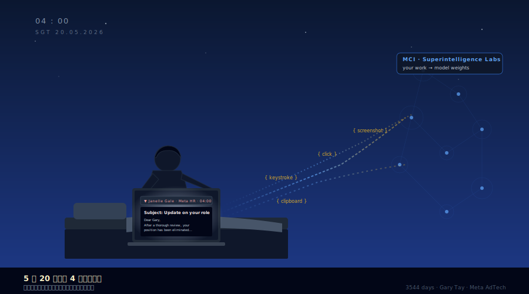
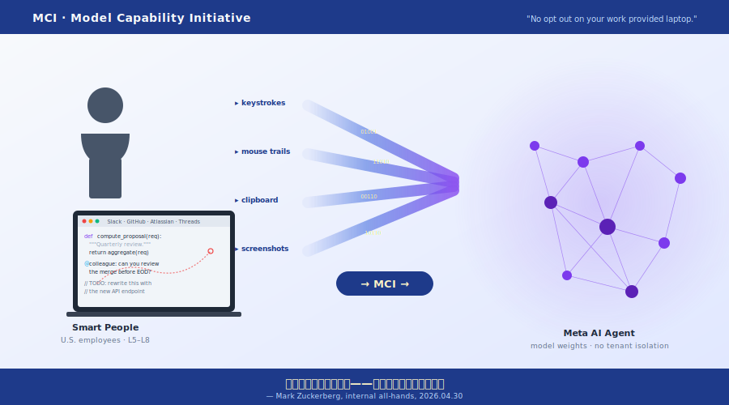

# Meta 让员工训练 AI 训了三个月，5 月 20 日把训练员裁了（笑）

> **发布日期**：2026-05-25 | **分类**：AI产业深度

## 导语

2026 年 5 月 20 日新加坡时间凌晨 4 点，Gary Tay 在床上看到一封裁员邮件。他在 Meta 干了 3544 天，前一天还在给新来的 pod engineer 做交接培训，妻子怀孕、孩子还没出生。

24 小时之前的太平洋东岸，一家叫 More Perfect Union 的劳工倡导媒体在网上挂出一段 6 分钟录音——扎克伯格 4 月 30 日全员会上亲口辩护一个代号 MCI 的项目：Meta 在公司发的工作笔记本上采集员工的鼠标轨迹、键盘输入、剪贴板和定期屏幕截图，喂给 AI 代理学习"聪明人怎么用电脑"，理由是"这些人比合同工聪明得多"。

录音上线一天之内，Meta 全球开始裁 8000 人。被采集训练数据的工程师，是收信优先序排前面的那批。两件事看起来是两条新闻，账翻过来其实是同一笔。

---

## 一、5 月 20 日凌晨 4 点的新加坡

新加坡凌晨 4 点这个时点是公关团队精确算过的——亚太上班最早的城市能让员工"在到办公室之前知道"的极限时间。你不会在工位上当着同事的面收到通知，你会在自己床上看完之后再决定要不要去办公室。新加坡这一波是亚太区第一刀，100 多人；裁员邮件之后按时区波次推到欧洲，再推到东海岸，到 5 月 20 日全球下班时，账面上已经裁掉 8000 人。Meta 同时把另外 6000 个开放招聘需求作废，一进一出净减员 14000。

Gary Tay 没去办公室。他在 LinkedIn 发了一条帖，第一句直接写：

> 「Yesterday I was training up my new pod engineer, glad I managed to squeeze in everything. Today, I'm laid off.」

昨天他在训新来的 pod engineer，今天他被裁了。Tay 按 LinkedIn 自述司龄"比目前全球 99.5% 的员工都长"。3544 天约等于 9 年 9 个月，从伦敦入职、外派新加坡、做到 AdTech 业务支持工程师组里的中坚。过去一年他主要在围绕 AI 重新培训自己，给团队搭出"工作流提速 200-300%"的系统，他自己原话是把这一切"做得让自己 expendable"——这一句他原本是当工程师美德写的：好的工程师应该让流程跑得不依赖自己。5 月 20 日凌晨 4 点之后，这句话的意思被现实加了一层注脚：**他亲手训练了取代自己的工具，然后被取代了**。

把视野从 Tay 一个人放大到 Meta 内部沟通的 timeline 看，戏剧性更清晰。

4 月 22 日，CNBC 和 Reuters 同日打头报道 MCI——内部的人开始知道公司在采集自己电脑屏幕。4 月 29 日 Meta Q1 财报电话会，CFO Susan Li 把全年 capex 指引从 $115-135B 上调到 $125-145B，向华尔街交代要烧多少钱搞 AI 基础设施。4 月 30 日，扎克伯格在全员会上正面答辩 MCI，那段 6 分钟录音就是当天录的。5 月 19 日下午，工运组织 More Perfect Union 把录音挂上互联网。5 月 20 日凌晨 4 点（新加坡），第一批邮件发出。

裁员决策的签批链当然早于 5 月 19 日的录音泄漏——8000 人级的全球行动至少要走两到三周法务、HR、PR 准备流程。录音外泄是工运组织对裁员的反应窗口，不是触发。但反应窗口和裁员公告挤在同一个 24 小时里，意味着这件事的整体叙事节奏被一家工运 TikTok 媒体抢走了——Meta 原本想用"我们 disciplined，进入 AI native 时代"的剧本发裁员稿，结果发出去那一刻头条上挂的是"老板偷偷拿你电脑训 AI"。

Meta 的传播节奏原本是这样的：4/29 财报上调 capex 告诉投资人要烧多少、4/30 关门跟员工交代训练数据从哪儿来、5/20 裁 8000 人外加挪 7000 人到新建"AI pod"，把"老 Meta"工号腾出来重新分配。三步原本是一个完整的资本配置动作——先告诉投资人钱的去向、再告诉员工训练数据的来源、再把生产关系一次性重组。

外面看是三个新闻。里面看是同一份 PPT 的第三页、第二页、第一页。

---

## 二、扎克伯格 6 分钟亲口说了什么

MCI 全称 Model Capability Initiative。这名字是 Meta CTO Andrew Bosworth 在公司内部 Workplace 平台上自己写出来的——不是泄漏来的代号，是官方挂在内网项目页里的全名。

4 月 22 日 Reuters 和 CNBC 同日把这项目曝光的时候，已经知道几条事实：MCI 在 4 月底开始陆续装到美国员工的工作笔记本上，采集键盘输入、鼠标轨迹、点击位置、剪贴板内容，加上周期性屏幕截图。覆盖的应用清单是 Google 搜索、LinkedIn、Wikipedia、GitHub、Slack、Atlassian 全家桶、Meta 自家 Threads 和 Manus——最早一版的清单里还包括 OpenAI 的 ChatGPT 和 Anthropic 的 Claude（就这）。欧洲员工因 GDPR 被豁免。Bosworth 在内网员工激烈追问下，原话是这么写的：「No there is no opt out on your work provided laptop」。在公司发的电脑上没有退出选项。

事情曝光后扎克伯格 4 月 30 日在全员会上正面答辩。这段 6 分钟录音里有四段引语值得逐字看。

第一段，关于用途：

> 「We are using this to feed a very large amount of content into the AI model, so that way it can learn how smart people use computers to accomplish tasks. I think that this is going to be a very big advantage if we can do it.」

翻译过来——「我们用这个把大量内容喂给 AI 模型，让它能学到聪明人怎么用电脑完成任务。我觉得只要我们能做到，这会是很大的优势。」「smart people」这个词成了之后所有争议的中心。

第二段，关于为什么用员工不用合同工：

> 「The average intelligence of the people who are at this company is significantly higher than the average set of people that you can get to do tasks if you're working through these contractors.」

公司里的人平均智力显著高于你能通过外包公司找到的人。用员工训 AI 不是临时方案，是首选方案——因为他们的脑子比合同工值钱。

第三段，关于编程能力：

> 「So if we're trying to teach the models coding, for example, then having people internally build tools or solve tasks that help teach the model how to code, we think is going to dramatically increase our models' coding ability faster than what others in the industry have the capability to do.」

「比如教模型写代码，让公司里的人在内部搭工具、解任务，这会让我们模型的编程能力比业内任何人都快地提升。」翻译过来就是：你坐工位写的每一行代码，理论上都是你雇主的 AI 的训练数据。

第四段，是为了挡刀的：

> 「No human is looking at or watching what people are doing on their computers… None of the data is being used for looking at what people are doing or surveillance or performance tracking or anything like that.」

「没有任何人在看员工的电脑屏幕……没有任何数据用于绩效追踪、监控或类似的事情。」Meta 发言人 Andy Stone 给 Reuters 的官方话术里也强调 MCI 数据「不会用于绩效评估」、有「safeguards 保护敏感内容」——但 safeguards 是什么、敏感内容怎么定义，Meta 至今没公开过。

这四段引语凑在一起的逻辑是：员工的电脑活动会被采集、会被喂给 AI 模型、会让模型变强；但「没有任何人在看」，所以你不用担心。这种话术的精度——「没有任何人在看」字面上确实是真的，因为看的不是人，是模型——是公司法务部反复推敲过的语言。Meta 没有撒谎，Meta 只是在玩字。

最讽刺的一句藏在录音另一段里——24/7 Wall St 整理的版本里有这么一句：「We're studying you to figure out how to make this all more effective.」我们在研究你，目的是让这一切更有效。这一句和第四段「没有人在看」是同一个录音里。

---

## 三、「Smart People」这个词的认知陷阱

扎克伯格 4 月 30 日全员会上用「smart people」这个词的时候，本意大概是安抚——你们这帮人比合同工聪明，所以我们选你们做训练样本，这是一种荣誉。

问题是这句话翻一面看就是：你们这帮人足够聪明、足够有价值，所以你们已经被纳入「可被压缩成模型权重的资产」这个类别。

把这句话和 Gary Tay 的 LinkedIn 帖放一起读，是教科书级别的反讽样本。

Tay 3544 天工龄、AdTech 业务支持工程师、过去一年自学 AI 给团队搭出 200-300% 提速的工作流——他是 Meta 员工的标准画像，工作熟练度、AI 适应度、团队贡献度三个指标全在前 10%。按扎克伯格的定义，他完美符合「smart people」。然后他被裁了。

把 Tay 的处境抽象一层就是：他在「smart」这一维度上的得分越高，他被 MCI 采集来的训练数据就越值钱；他的训练数据越值钱，他对组织的边际贡献就越接近 AI 代理；他对组织的边际贡献越接近 AI 代理，他被裁的概率就越大。

这不是阴谋论。这就是「数据-能力-成本」三段式替换的自然写法。一个人主动用 AI 提升自己产能的过程，同时是 MCI 采集高质量训练样本的过程，同时也是雇主在边际上把他的位置标价的过程。三个过程是一回事。

Tay 自己的 LinkedIn 帖里有一段是这样写的——他写到他过去一年帮团队做的事，按他的描述是「让我自己变得 expendable」（可替换）。他原本是把这当工程师美德写——一个好的工程师应该让流程跑得不依赖自己。但 5 月 20 日凌晨 4 点之后，这句话的意思被现实加了一层注脚：你让自己 expendable 的能力越强，你被 expend 的速度就越快。

这种「越积极配合越快淘汰」的结构，在制造业转型史里有个老名字：泰勒制悖论。20 世纪初福特工厂里，工人越熟练地配合时间动作研究（让管理者拿着秒表测量每一个动作），就越快把自己变成可被流水线分解的标准件。区别是当时秒表在工头手里，现在秒表在你自己的工作笔记本里。当时的训练数据是动作分解表，现在是键盘事件流。唯一变了的是你看不见管理者拿秒表，因为秒表已经长在你的 Slack 里。

Meta 给 Andy Stone 的话术留了一道挡板——MCI 数据「不会用于绩效评估」。技术上这是真的，HR 部门跑绩效用 Workday，MCI 数据归 Superintelligence Labs，两边是分开的数据池。挡板严丝合缝。

可是这道挡板挡的是「员工被开除是因为 MCI 采集的具体数据」这一条窄路径，挡不住「员工被开除是因为他们的劳动已经被压缩成模型权重」这条宽路径。前者是个体审计意义上的因果，后者是组织级资本配置意义上的因果。Meta 的法务挡住了前者，但前者本来就不是问题的核心。

扎克伯格在录音里说员工平均智力比合同工高。Bosworth 在内网上说工作笔记本上没有 opt-out。两句话挤在一起，意思是——「你比外包工值钱，所以我们用你训 AI；你的电脑在我手里，所以你没得选。」

---

## 四、36 比 1 的账本：这次裁员根本不是为了省钱

回到 4 月 29 日的 Meta Q1 财报电话会。CFO Susan Li 把全年 capex 指引从此前的 $115-135B 上调到 $125-145B，单季度新签的多年期基础设施合约一笔签了 $107B。这些数字都印在 Meta 提交给 SEC 的 8-K 附件里——没人能改，没人能解释成别的意思（笑）。

拿 Q1 2026 实际 capex 数字 $198 亿做锚点（不用全年指引上限，免得被人挑会计口径），年化大约 $790 亿。这是 Meta 在 2026 年实际写出去的现金，主要付给 NVIDIA、Oracle、CoreWeave 和数据中心地皮供应商。

裁员这一面，按 Meta 软件工程师 levels.fyi 公开的中位数 total comp $400K 算，扣掉股权（RSU，约占 40% 且分四年 vest）和福利负担，单年的现金节省口径大约 $250K/人。8000 人 × $250K = $20 亿一年。

$790 亿 / $20 亿 = 39.5 倍。

哪怕把 RSU 全部算成现金（实际上不是），8000 人 × $500K = $40 亿，对比 $790 亿仍然是 20 倍差距。Meta 这次裁掉 8000 人节省的钱，最多够买 18 天的 AI 基础设施投入（$790 亿 ÷ 365 × 18 ≈ $40 亿）。整整一年的裁员省下来的现金，等于 Meta 给云厂商和 NVIDIA 写支票时的不到 3 周。

<<__AIWRITER_PLACEHOLDER__>>

这个比例说明一件事：**Meta 裁这 8000 人，不是为了省钱**。

20-40 倍的差距已经把"裁员省钱"叙事打穿。一家市值 1.6 万亿美元、净利润 605 亿美元的公司，绝对犯不上为了 20-40 亿一年的现金成本，去发动一场公关代价巨大、监管风险叠加、外加触发集体工会化运动的全球裁员。

那真正的目的是什么？

把同一份 Janelle Gale 备忘录翻另一面读，写得很清楚——「many teams can operate in flatter structures, acting faster and taking on more ownership in smaller pods/cohorts」。Many teams 可以扁平化、更快、更小的 pod。pod 是关键词。同一份备忘录还提到，被裁的 8000 人之外，另有 7000 人「reassign」进 Applied AI Engineering、Agent Transformation Accelerator XFN、Central Analytics 等新建团队。这些团队都归在 Alexandr Wang 4 月入伙后挂帅的 Superintelligence Labs 名下。

把账本翻过来看就是：Meta 不是要省 $4B，是要在不撑爆 OpEx 的前提下，给 Alexandr Wang 的新团队腾出 1500-2000 个高 comp 的股权预算名额。一进一出，对外讲的是「disciplined」，对内做的是「换血」。**老 Meta 人腾出来的工号位置，会被「AI native」新血填上**——这两批人的 total comp 区间高度重叠，区别只在简历那一栏写的是 React 还是 PyTorch。

更精准的逻辑是：MCI 项目在过去三个月已经把「老 Meta 人」的工作流压缩成训练数据；只要这批训练数据被 Superintelligence Labs 的新人拿来微调出可用的 agent，组织里就不再需要「老 Meta 人」具体的人，只需要「老 Meta 人」具体的输入输出模式。这个时点裁员，是 capital allocation 意义上的最优解——你已经把他们的劳动模式存下来了，你只是不再需要保管他们这具肉身（笑）。

这就是为什么 8000 这个数字偏偏出现在 4 月 29 日财报会上调 capex 指引、4 月 30 日扎克伯格关门解释 MCI 用途的三周后。三件事不是巧合，是同一份 PPT 第三页、第二页、第一页。

---

## 五、对客户温柔，对员工无情：SaaS 时代的权力距离

MCI 这事如果只看 Meta 一家，会觉得它就是一家公司的越界事故。把镜头拉远看同行的同期政策，画面就完整了——

Microsoft 365 Copilot 的官方页面（Microsoft Learn 文档）写得清清楚楚：「Prompts, responses, and data accessed through Microsoft Graph aren't used to train the foundation LLMs that Copilot uses.」用户的 prompt、模型回复、通过 Microsoft Graph 访问到的所有数据，都不会被用于训练 Copilot 调用的基础模型。

这里有个 nuance 必须挑明：Microsoft 没承诺"完全不用你的数据"——它承诺的是数据只在你这个租户内部做检索增强（RAG）和上下文 grounding，不会跨租户进入基础模型权重。换句话说，你公司用 Copilot 写出来的文档，会被用来让 Copilot 在你公司内部"更懂你公司"，但不会让 Copilot 在你竞争对手那边"更懂你公司"。这是租户级别的隔离承诺，写在企业合同里、可以被法务部翻出来追责。

Google Workspace 的 Gemini 企业版走同样路线——企业客户数据不用于训练基础模型，消费者版本另说。条款明确，分级清晰。

Anthropic、OpenAI 的企业 API 协议——同样的 opt-out 默认（除非客户主动同意纳入 training corpus）。

只有两个反向案例。一个是 Salesforce Spring '26 release，把「客户数据训练全局预测 AI 模型」设置为默认开启，必须客户 admin 主动 toggle 关闭——结果引发企业客户和 Salesforce 第三方咨询社区集体喊话，把这事推上 The Information 头条。另一个是 Zoom 2023 年那次——ToS 偷偷加了一条「可用客户音视频聊天训练 AI」，48 小时之内被推上 Twitter 风口，公司紧急撤回条款道歉。

把这四家放一起看，结论很简单——当用户是付费客户的时候，AI 时代的隐私默认是 opt-out 加租户级隔离，越线会被骂、会上头条、会回滚条款；当用户是自己员工的时候，隐私默认是 no opt-out 加跨员工汇聚，越线只会内部传单+录音泄漏+8000 人裁员邮件。

更精确地说：MCI 不是"Copilot 那种 tenant-internal RAG"。Meta 直接把员工屏幕活动喂进 Superintelligence Labs 的 agent 训练管线——这意味着 Tay 工作笔记本上的工作流，会进 Meta 给所有客户和所有员工使用的同一个 agent 的权重，不存在租户隔离这一层防火墙。这不是"foundation model 训练 vs tenant grounding"的灰色地带，是直接进基础模型的状态。

<<__AIWRITER_PLACEHOLDER__>>

差别不是技术问题，是权力距离问题。

付费客户不爽了可以换 SaaS——CRM 从 Salesforce 换到 HubSpot、协作工具从 Zoom 换到 Teams、模型从 OpenAI 换到 Anthropic。换的成本不便宜，但是真的可以换。Meta 员工的电脑在 IT 部门手里。Bosworth 那句「no opt out on your work provided laptop」点穿了这件事的本质——你之所以同意，不是因为你想，是因为你没得选。

这就是 SaaS 时代的双重隐私标准：对客户承诺的是「我们不会用你的数据训练 foundation model」，对员工默认的是「我们用你的数据训练所有 model」。同一家公司的两个 product line 出自同一份 AI policy template——客户那一页写满 safeguards，员工那一页留白。

更尴尬的是，Meta 自己的 Microsoft 365 license 续约的时候，肯定也写明白「我们的员工 prompt 不会被微软用来训练 Copilot」。意思是——Meta 自己作为 SaaS 客户的时候要 opt-out 保护，作为雇主的时候不给员工同等保护。你买的服务和你提供的劳动，在隐私问题上享受的是完全不同的法律地位。

把这一层挑明，MCI 就不再是一家公司的丑闻，是 SaaS-AI 时代的默认架构。每一家公司在 2026 年都会经历同一套压力测试——「客户数据要 opt-out 保护」和「员工劳动是免费训练数据」这两条公司政策，最迟会在某个工程师向《纽约时报》发邮件那天，被钉在一面公开的墙上。

Meta 只是被钉得早了一点。

---

## 六、录音不是《华尔街日报》拿到的

5 月 19 日下午把扎克伯格 6 分钟录音挂上互联网的，不是 Bloomberg、不是 The Information、不是 New York Times，是一个叫 More Perfect Union 的左翼工运媒体——总部在华盛顿特区，主营业务是 TikTok 上拍亚马逊仓库工人和星巴克咖啡师的工会故事。一家从来没报道过硅谷大厂内部音频的媒体，第一次进场就拿到了 Meta 创始人的内部录音。

这个细节本身就是新闻。

过去十年硅谷大厂的内部录音泄漏给谁？2017 年 Susan Fowler 那篇 Uber 内部文化贴是博客自发，但后续推进是 NYT；2019 年 Google 内部反性骚扰罢工的录音文件是给的 BuzzFeed News；2023 年 Twitter 文件给的是 Matt Taibbi；甚至 2024 年 OpenAI 内部安全争议都是 The Information 第一个拿到。财经主流媒体一直是科技公司内部知情者的默认出口。

5 月 19 日，这条默认链路被绕开了。

Meta 员工把 6 分钟扎克伯格录音递给一家专门给仓库工人拍 TikTok 的劳工组织——意思是这一批员工不再把自己定位为「硅谷精英」、不再相信 NYT 那一套深度调查能保护他们，而是把自己定位为「需要工会的劳动者」。从「向财经媒体爆料」到「向工运媒体爆料」的位移，是科技行业自我身份认同的位移。

更重要的是 More Perfect Union 选择释放的时点。5 月 19 日下午挂网，5 月 20 日凌晨 4 点新加坡邮件——24 小时。这不是巧合，是协调。

同步发生的事还有：
- mcipetition.com 在 5 月 20 日上线，请愿要求 Meta 停止 MCI 并就采集数据负责，48 小时内超过 500 个签名（其中相当一部分是 Meta 现员工，按签名页所要求的 @meta.com 邮箱验证）
- 英国的 United Tech and Allied Workers（UTAW）同期把 Meta 列入工会化运动 campaign，伦敦办公室开始内部发传单
- 律所 Sanford Heisler Sharp McKnight 5 月 21 日公开宣布开案，调查 Meta 5/20 裁员是否违反 WARN Act（联邦法律要求 60 天提前通知）

这是一套多前线攻势。录音是 PR 武器、请愿是政治压力、工会是组织基础、律师是法律杠杆——四条线全部在 24 小时内启动。没有协调几乎不可能做到。

Meta 至今没有公开否认录音真实性。Meta 拒绝回复 The Register 的邮件询问。Meta 发言人 Andy Stone 给出的最强回应仅仅是「数据不会用于绩效评估」、有「safeguards」——但没否认扎克伯格说了什么。**沉默就是默认**。

这一整套动作的隐含意思：硅谷工程师阶层在 2026 年第一次集体使用「我们是劳动者，不是合伙人」的话语来组织。过去十年硅谷大厂员工讨价还价的话术是股票期权、是 levels、是跳槽——这些都是「合伙人」逻辑里的概念。5 月 20 日之后，话术变了——是工会、是 WARN Act、是请愿、是「我的工作笔记本上不应该有 keylogger」。这是一次身份切换。

类比劳工史上的事件，最近的对照是 1979 年 *Norma Rae* 那部电影里的真实事件——纺织工人把工资单的不公拍下来贴上工厂墙壁，触发组建工会。MCI 这一次员工拿到的不是工资单，是 6 分钟 AI 训练数据辩护录音——但叙事张力是一样的：**当雇主用员工说不清的方式从员工身上取走价值，员工迟早会找到说得清的证据**。

录音就是 2026 年版本的工资单。

---

## 七、训练数据的离场费

5 月 20 日这一天，戏剧不止 Meta 一家上演。

同一天美东时间下午，Intuit CEO Sasan Goodarzi 上 CNBC 的 Mad Money 节目。主持人 Cramer 问他 17% 裁员 3000 人是不是 AI 替代造成的。Goodarzi 看着镜头，一字一句地说——「None of it had to do with AI.」一点 AI 关系都没有。

同一天上午，Intuit 投资者关系页面挂出两份新闻稿：第一份宣布与 Anthropic 多年期合作，「为中型企业部署定制 AI 代理」；第二份宣布与 OpenAI 多年期合作，「把它们的模型嵌入 Intuit 税务和财务平台」。同一天，Intuit 提交给 SEC 的 FY26 Q3 8-K 文件里写明，这一轮重组将产生 $300-340M 一次性费用，资金的去向是「reallocating capital toward AI partnerships」——把资本重新分配到 AI 合作上去。

Cramer 节目对外讲：跟 AI 无关。SEC 8-K 对内讲：钱挪给 AI 合作了。这不是矛盾，是分发策略——对消费者市场说一套（怕 TurboTax 用户怕 AI 抢账户），对资本市场说另一套（要拿估值倍数）。Goodarzi 不是异类，是 2026 年所有 SaaS CEO 的标配剧本——**Meta 用员工训 AI 再裁员，是 hardware 版的剧本；Intuit 让 Anthropic 做客服 agent 再裁客服，是 outsource 版的剧本**。两版剧本本质是同一个：把人换成模型权重，把成本换成 capex，把"裁员"叙事换成"reallocate capital"。

回到 Gary Tay 的 LinkedIn 帖。

他帖子最后一段是这样写的——「I'll figure out what's next. To my baby, sorry dad doesn't have a job for now.」我会想出下一步。对我没出生的孩子，抱歉爸爸暂时没工作了。这一段没有数字、没有公司名、没有缩写——但它是 5 月 20 日所有数字的脚注。$145B capex、78865 员工、8000 裁员、3544 天工龄、6 分钟录音、24 小时窗口——所有这些数字最终都要在某个未出生孩子的爸爸那里收一次账。

回到导语那个问题：两条新闻是不是同一笔账？

是同一笔账。Meta 给 Tay 16 周的遣散包（按 Meta 美国员工遣散政策算，约相当于 3-4 个月工资），名义上是「the company appreciates your service」，是对九年九个月辛苦的补偿。

按这篇文章的算法，**这 16 周不是离职补偿，是训练数据的版权费**——因为 Tay 过去三个月给 MCI 贡献的高质量训练样本，按市场上最贵的标注外包合同算（OpenAI 给 Scale AI 那种顶级 SME 标注数据每小时 $50-100）也值这个钱，何况他贡献的不是标注数据，是真实工作流。Meta 没欠他什么——它把训练数据的版权费用「遣散」两个字付清了，账就两清了。

**所谓 AI 替代人类，本质是用 A 同事这周的劳动训练 B 同事下周的失业**。

下一次你看到「公司宣布大规模 AI 转型并伴随裁员」，作为外部观察者先翻三页：第一页看 capex 指引和裁员节省的比例（如果差 20 倍以上，请打开第二页）；第二页找最近一年这家公司有没有内部数据采集项目（Slack 全员通知、笔记本上突然多出来的 IT agent、Workday 加的新条款）；第三页找 8-K 里有没有同期的「reallocating capital toward AI」表述。三页对得上，账就齐了。

如果你不是观察者，你是 Tay，需要翻的是另外三页：第一页查你公司笔记本上 MDM（设备管理）软件清单——开 Activity Monitor / Task Manager 看有没有你不认识的后台 agent，搜公司 IT 政策文档里"endpoint telemetry"这一栏；第二页查你 employment contract 和 acceptable use policy 里有没有"工作产品归属公司"和"AI training clause"——后者是 2026 年新增的常见条款，写着公司有权用员工"作业行为数据"训练内部 AI 模型；第三页查公司过去一年发的全员邮件搜"productivity"、"AI assistant"、"workflow capture"这些关键词——这是 MCI 类项目最常用的对外口径。

三页都翻一遍。然后做决定：留下来继续给训练集贡献样本，还是把数据足迹尽量留在自己控制得了的地方。

---

## 数据来源

- [The Register — Zuck defends monitoring employees to win AI race in purported leaked audio (5/22)](https://www.theregister.com/ai-ml/2026/05/22/zuck-defends-monitoring-employees-to-win-ai-race-in-purported-leaked-audio/5245379)
- [Common Dreams — In Leaked Audio, Zuckerberg Tells Meta Workers He's Been Using Them to Train AI (5/20)](https://www.commondreams.org/news/meta-ai-layoff)
- [CNBC — Meta tracks employee usage on Google, LinkedIn, Wikipedia (4/22)](https://www.cnbc.com/2026/04/22/meta-tracks-employee-usage-on-google-linkedin-ai-training-project.html)
- [NPR — Meta announces 8,000 layoffs as it pivots to AI (5/20)](https://www.npr.org/2026/05/20/nx-s1-5826917/meta-layoffs-ai-jobs)
- [CNBC — Intuit CEO says company's 17% workforce cut had 'nothing to do with AI' (5/20)](https://www.cnbc.com/2026/05/20/intuit-ceo-says-companys-17percent-workforce-cut-had-nothing-to-do-with-ai.html)
- [The Information — Meta layoffs hit Instagram, Facebook and Reality Labs, WhatsApp less affected](https://www.theinformation.com/articles/metas-layoffs-hit-instagram-facebook-and-reality-labs-whatsapp-less-affected)
- [Platformer — Meta MCI Monitoring Layoffs Knowledge Work](https://www.platformer.news/meta-mci-monitoring-layoffs-knowledge-work/)
- [HCAmag — Meta's 8,000 job cuts began in Singapore at 4 AM (5/20)](https://www.hcamag.com/asia/news/general/metas-8000-job-cuts-began-in-singapore-at-4am-this-morning/575851)
- [Meta Q1 2026 8-K — Capex 指引上调到 $125-145B](https://www.sec.gov/Archives/edgar/data/0001326801/000162828026028364/meta-03312026xexhibit991.htm)
- [Meta 2025 10-K — 全球员工 78,865 人](https://www.sec.gov/Archives/edgar/data/0001326801/000162828026003942/meta-20251231.htm)
- [Intuit FY26 Q3 Earnings Press Release — 重组费用 + AI 合作披露](https://www.sec.gov/Archives/edgar/data/0000896878/000089687826000024/fy26q3earningspressrelease.htm)
- [Intuit-Anthropic 联合新闻稿](https://investors.intuit.com/news-events/press-releases/detail/1305/intuit-and-anthropic-partner-to-bring-trusted-financial-intelligence-and-custom-ai-agents-to-consumers-and-businesses)
- [Sanford Heisler Sharp McKnight — Investigation of Meta's Recent Mass Layoff](https://sanfordheisler.com/investigation-of-metas-recent-mass-layoff/)
- [IBTimes UK — Leaked Zuckerberg Audio](https://www.ibtimes.co.uk/meta-layoffs-update-leaked-zuckerberg-audio-1798063)
- [State of Surveillance — Meta MCI Keystroke Surveillance](https://stateofsurveillance.org/news/meta-employee-keystroke-surveillance-mci-ai-training-2026/)
- [Microsoft Learn — Microsoft 365 Copilot enterprise data protection](https://learn.microsoft.com/en-us/microsoft-365/copilot/enterprise-data-protection)
- [Salesforce Ben — Salesforce's New AI Data Setting Sparks Debate Over What Customers Agreed To](https://www.salesforceben.com/salesforces-new-ai-data-setting-sparks-debate-over-what-customers-agreed-to/)
- [Futurism — Meta Employee Attacks Zuckerberg Over Employee Data](https://futurism.com/artificial-intelligence/meta-employee-attacks-zuckerberg-employee-data)
