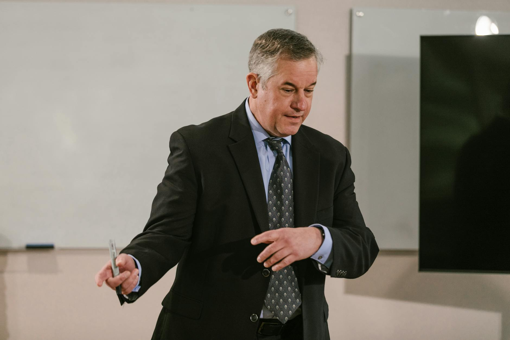

# Sam Altman 说"AI 杀白领"是他直觉失灵那天，OpenAI 招股书已经递了 4 天

> **发布日期**：2026-05-27 | **分类**：AI产业深度

## 导语

2026 年 5 月 26 日上午 9 点（澳洲东部时间），悉尼。Commonwealth Bank of Australia 在自家总部办的「Accelerate AI」开发者大会。台上主持人是 CBA 集团 CEO Matt Comyn，台上嘉宾位是一块屏幕——Sam Altman 远程视频连线。Comyn 把过去一年里被全球外媒反复转的那个问题摆到台面上：你 2023 年开始反复警告 AI 会消灭白领工作，到现在为止你怎么看？

Altman 的原话是这样的：

> 「I'm delighted to be wrong about this. I thought there would have been more impact on entry-level white-collar jobs being eliminated by now than has actually happened. I now think I understand more about why it hasn't, and I'm obviously grateful but that is an area where my intuitions were just off.」

我很高兴自己错了。我以为入门级白领工作早该被消灭得更多，现在看并没有。我现在大概明白为什么没发生了，当然挺感激的，但那确实是我直觉失灵的一个领域。

这一句被悉尼当地媒体 Startup Daily、欧洲版 Euronews、TIME、BNN Bloomberg 在 4 个时区接力跟进。Fortune 当天下午把这一段和三周前 Anthropic CEO Dario Amodei 5 月 5 日在曼哈顿与 JPMorgan Chase 的 Jamie Dimon 同台时那一句「If you automate 90% of the job, then everyone does the 10% of the job」剪在一起，做了一个标题：「Sam Altman and Dario Amodei are both walking back their AI jobs apocalypse prophecies as they eye blockbuster IPOs」——两位 CEO 同步撤回他们的 AI 末日预言，时机刚好踩在两家 IPO 路演窗口前。

Altman 这句"我错了"距离 OpenAI 向 SEC 秘密递交 IPO S-1 招股书，只有 4 天。

那 4 天里发生的事情，比"AI 不会杀白领"这个判断本身更值得看。

---

## 一、5 月 26 日上午 9 点，悉尼

Sydney CBA「Accelerate AI」大会的官方主办方稿被发在 CBA Newsroom 上，标题叫「We try to think out loud: OpenAI's Sam Altman on closing the gap between AI tech and how we're adopting it」。这是 CBA 自己的传播渠道，意味着 Altman 那一段发言完全没有任何媒体加工——是公司公关合规之后挂出来的版本。

Altman 在这场对话里讲了三件事。第一件是上面已经引过的"我错了"那一段。第二件是关于被人骂"散布恐慌"的回应：

> 「People are like 'oh you could have saved the world a lot of fear mongering and a lot of doom and gloom' but at the time I was like 'I see this is a real risk we should probably talk about it' and it still may.」

有人说"你本可以省下大家很多恐慌和很多悲观情绪"，但当时我觉得这是一个真实的风险，我们应该谈一谈，而且这风险可能仍在。

第三件事是关于 AI 用于私人沟通的「dehumanising」（去人性化）问题——Altman 承认自己一度让 AI 帮他回 Slack 和邮件，每条加一个署名「this is Sam's AI」。后来放弃了，理由原话是「surprisingly dehumanising」。这一段被 Startup Daily 在标题里直接拎出来：「Sam Altman thinks using AI in emails and Slack is 'dehumanising'」。

三段话拼起来的传播效果是：Altman 既软化了过去三年的恐慌叙事，又给自己留了一道"我当时是有道理的"出口，最后还顺便给"AI 用在哪里合适"补了一句温情的尾巴。从公关学的角度，这是一份近乎完美的发言。

而这一份发言三周前，5 月 5 日上午，Lower Manhattan，Anthropic 自己办了一场金融服务客户邀请制 briefing。台上 Dario Amodei 旁边坐的是 JPMorgan Chase CEO Jamie Dimon。同台首秀。Amodei 在这一场里第一次把"Jevons Paradox"（杰文斯悖论）框架放进自己的对外口径——「If you automate 90% of the job, then everyone does the 10% of the job」。这一句被 Fortune 当天就拎出来做了一篇标题叫《Dario Amodei spent last year warning of an AI white-collar bloodbath. Now he's changing the narrative》的稿子——Dario Amodei 过去一年都在警告 AI 会血洗白领，现在他正在换叙事。

Jevons Paradox 这个 19 世纪经济学概念的字面意思是：当一种资源的使用效率提升时，对它的总需求反而会增加。Amodei 把这个框架套在"AI 自动化"上的结果是：AI 不消灭工作，AI 增加每个工人的产出，所以企业雇佣更多人。从公关角度，这一句是用经济学外壳重新包装了"AI 创造就业"——但措辞够学术，所以不像在打脸。

5 月 5 日 Amodei 在曼哈顿用 Jevons 改口，5 月 26 日 Altman 在悉尼直接说"我错了"。21 天，两位市值前两的 AI 公司 CEO 把过去三年最响亮的一句话——「AI 即将大规模消灭白领工作」——同步撤回。

---

## 二、Altman 的三年原话回放

Altman 这一次"撤回"的对象，是他自己 36 个月里在 8 个不同的公开场合反复说过的话。逐字摆出来：

**2023 年 3 月 16 日，ABC News，主持人 Rebecca Jarvis。**这是 ChatGPT 上线 4 个月后 Altman 第一次接受美国主流电视台专访。原话被剪进 World News Tonight 和 Good Morning America：

> 「It is going to eliminate a lot of current jobs. That's true. We can make much better ones.」

它将消灭很多现在的工作，这是真的，但我们可以创造更好的工作。同一段采访 Altman 承认自己 「a little bit scared」（有点害怕）这件技术。

**2023 年 5 月 16 日，美国参议院司法委员会隐私、技术与法律小组委员会作证。**Altman 的书面证词上交在 judiciary.senate.gov 的官方 PDF 里，第 4 页原话：

> 「There will be an impact on jobs. We try to be very clear about that, and I think it will require partnership between the industry and government, but mostly action by government, to figure out how we want to mitigate that.」

会对工作有影响。我们尽量讲清楚这一点。我认为这需要行业和政府合作，但主要是政府主导，来想办法缓解。这段证词的 C-SPAN 录像至今还挂在网上。

**2024 年 1 月 17 日，达沃斯，Bloomberg House。**第一次软化。原话：

> 「AI will change the world much less than we all think and it will change jobs much less than we all think.」

AI 改变世界的程度会比我们所有人想的小得多，改变工作的程度也会比我们想的小得多。这一句被 Axios 当时拎出来转，但被淹没在 Davos 周的整体喧嚣里。

**2025 年 9 月，Tucker Carlson 长达一小时的播客访谈。**这一场 Altman 回到强警告口径：

> 「I'm confident that a lot of current customer support that happens over a phone or computer, those people will lose their jobs, and that'll be better done by an AI.」

我有信心，目前通过电话或电脑做的很多客服工作，那些人会失业，那部分会被 AI 做得更好。Altman 在同一场访谈里给出一个理论框架：「punctuated equilibria」，断续平衡——按过去 75 年的均值，社会每 75 年承担 50% 的岗位变更，而 AI 把这 50% 压缩到短期内完成。这一句被 Tucker Carlson 自家 X 账号剪成 30 秒短视频。

**2026 年 3 月 11 日，华盛顿 DC，BlackRock 美国基建峰会。**Altman 与 BlackRock CEO Larry Fink 同台。Rev.com 全场速记里 Altman 原话：

> 「If it's hard in many of our current jobs to outwork a GPU, then that changes. If there was an easy consensus answer, we'd have done it by now, so I don't think anyone knows what to do. Tech-related job displacement is on the way.」

如果在我们当前的很多工作中，要比一块 GPU 干得更多很难，那情况就会改变。如果有现成的共识答案，我们早就给出了——所以我不认为有人知道该怎么办。技术导致的岗位替代正在到来。

把这五段话按时间排出来——

| 日期 | 场合 | 关于"AI 杀工作"的口径 |
|---|---|---|
| 2023/3/16 | ABC News 电视专访 | 「会消灭很多工作」（强警告） |
| 2023/5/16 | 美国参议院作证 | 「会对工作有影响」（强警告） |
| 2024/1/17 | 达沃斯 Bloomberg House | 「比想的少得多」（软化） |
| 2025/9 | Tucker Carlson Show | 「客服员工会失业」（强警告） |
| 2026/3/11 | BlackRock DC 峰会 | 「替代正在到来」（强警告） |
| **2026/5/26** | **Sydney CBA 大会** | **「我错了」（撤回）** |

三年里 5 次警告，1 次软化（达沃斯一过就又转回去）。第 6 次直接撤回。撤回的时间是 5 月 26 日。撤回的时间和 5 月 22 日之间——这一天 OpenAI 向 SEC 秘密递交 S-1 招股书——隔了 96 小时。

---

## 三、5 月 22 日同一天，两件事

5 月 22 日发生了两件事。一件是 Bloomberg 的独家——「Anthropic to Close Over $30 Billion Round as Soon as Next Week」，Anthropic 这一轮 300 亿美金融资将在下周封盘，pre-money 估值 9000 亿美金，超过 OpenAI 上一轮（2026 年 3 月）8520 亿成为全球最贵 AI 创业公司。Sequoia、Dragoneer、Altimeter、Greenoaks 四家 co-lead 各出资约 20 亿。

另一件是 Fortune 当天下午发出的稿子——「The big questions OpenAI's trillion-dollar IPO filing may finally answer」——标题里那个「filing」是 5 月 22 日 OpenAI 通过 Goldman Sachs 和 Morgan Stanley 主导、JPMorgan 协办向 SEC 秘密提交的 S-1 注册声明。目标 IPO 时间窗 2026 年 Q4，估值区间从最低 8520 亿（与 3 月一级市场 take-out）到最高破 1 万亿美金。

Anthropic 这边目标 IPO 窗口是 2026 年 10 月，已经聘请 Wilson Sonsini Goodrich & Rosati 做注册律所。OpenAI 这边 S-1 秘密提交后，SEC 标准 review cycle 是 30-60 天，第一次回函 comments 之后还有 30-90 天的 amendments 周期，加路演定价大概 4-6 个月。两条路径都把"路演开始"的窗口推到 2026 年 7 月到 9 月。

这就是 Altman 那句"我错了"的真正坐标——5 月 26 日，距离 S-1 提交日 4 天，距离 SEC 回函预期约 25-55 天，距离投行预热路演的窗口大约 60-90 天。

在 IPO 注册阶段的 CEO 公开发言有一项硬约束，叫「quiet period」——Reg S-K 和 FINRA Rule 5121 共同管控下，公司在递表之后到上市之前的所有 CEO 公开发言，必须避免和招股书里的陈述构成"实质性差异"（material discrepancy）。Goldman Sachs 等顶级承销商的标准做法是给 IPO 公司发一份「communications protocol」备忘录，明确列出 CEO 在 quiet period 期间能说什么、不能说什么——核心要求只有一句：**口径必须和招股书保持一致**。

这就是 Altman 5 月 26 日那句"我错了"的另一个解读路径——这不是 CEO 个人观点更新，是 IPO communications protocol 在生效。

---

## 四、招股书里那条不庇护 CEO 嘴的法条

美国证券交易委员会（SEC）对 IPO 招股书风险因素的要求写在「Regulation S-K Item 105」里。原文挂在 eCFR 17 CFR 229.105：

> 「Provide under the caption 'Risk Factors' a discussion of the material factors that make an investment in the registrant or offering speculative or risky.」

在「风险因素」标题下讨论让发行人或发行变得有投机性或风险的"重大"因素。SEC 在 2020 年这一条做了修订，把原来的「most significant」改成了「material」，并且强制：风险因素章节超过 15 页的，必须在最前面有 2 页摘要；通用性（generic）风险因素必须单独放在章末。

这一条规则的执行细节是：哈佛法学院公司治理论坛 2024 年 11 月的统计显示，Fortune 100 公司里超过 85% 在 2025 年度年报的风险因素章节里写了 AI（前一年 65%），其中 1/3 把 AI 列为 standalone（独立）风险因素（前一年 14%）。AI 已经从"机会陈述"全面转入"风险陈述"——而且律师在写风险因素章节的时候，会按职业本能把"最坏情况"写满。

OpenAI 和 Anthropic 各自的 S-1 草稿里关于 AI 对就业市场的风险因素措辞会是什么样子？没人看过原文。但参考 2024 年 3 月 Reddit 在 S-1/A-3 里关于 AI 的风险段落原话——

> 「The U.S. Federal Trade Commission has informed us that it intends to conduct a non-public inquiry into our practices related to artificial intelligence...These regulatory dealings could be lengthy and unpredictable...could result in substantial costs.」

——美国联邦贸易委员会已通知我们将对我们与人工智能相关的做法进行非公开调查……这些监管事务可能漫长且不可预测，可能导致重大成本。这只是一段"被监管"的风险。OpenAI / Anthropic 的 S-1 里围绕 AI 对就业的风险段落只会更长——因为律师不写最坏情况，将来集体诉讼起来要赔的就是他自己。

而这就接到了第二条监管规则：**Private Securities Litigation Reform Act of 1995 的前瞻性陈述安全港**。这一条规则的字面意思是：上市公司高管对外做的"前瞻性陈述"（比如"AI 会让我们三年内……"），只要附了「meaningful cautionary statements」（实质性的警示语），就在民事证券诉讼里享有诉讼豁免——也就是说告不动。

但 PSLRA 安全港有一条例外。15 U.S. Code § 78u-5(b)(2)(D) 原文：

> 「shall not apply to a forward-looking statement that is...made in connection with an initial public offering.」

不适用于……与 IPO 相关做出的前瞻性陈述。

也就是说，**IPO 注册期间 CEO 的所有前瞻性陈述都没有安全港**。任何关于"AI 会消灭多少白领工作"、"AI 会带来多少失业率"的口头预言，如果上市后被证明与实际偏差大、或与招股书风险因素章节的陈述构成实质性矛盾，都可以成为集体诉讼里的「重大误导性陈述」（material misleading statement）证据。

这就是为什么 Cooley、Wilson Sonsini、Latham & Watkins 等顶级 IPO 律所的标准做法是在 S-1 第 2 页都放一段「Special Note Regarding Forward-Looking Statements」，并且要求 CEO 在 quiet period 把口径全部对齐到招股书。Pillsbury 律所一份 2024 年发出的客户简报里直接写：「When Speaking to Investors, Mix Facts with Predictions at Your Peril」——和投资者讲话时，把事实与预测混在一起，自负风险。

这一条监管常识，对应的是 5 月 26 日 Altman 那一句"我错了"的法务背景——他不能再说之前那些话。他必须改口。改口的时间，在 S-1 提交之后的 96 小时内完成。

---

## 五、自家研究部门，6 个月前已经在打脸自家 CEO

更尴尬的是，Altman 和 Amodei 这一次"撤回"，撤回的对象不只是他们自己过去三年的话，还包括他们的口径已经和自家公司研究部门的官方报告对不上很久了。

Anthropic 自己挂在 anthropic.com/economic-index 的「Anthropic Economic Index」系列报告里，2026 年 3 月 24 日那一期标题叫「Learning curves」，2026 年 5 月那一期是 Maxim Massenkoff 和 Peter McCrory 合著的「Labor market impacts of AI: A new measure and early signals」。后者的原文结论：

> 「No clear spike in unemployment rates for workers in the most AI-exposed occupations.」

在 AI 暴露度最高的职业里，失业率没有出现明显跳升。报告同时指出，AI 当下的实际使用率只占任务可行域的 20-30%，远低于能力上限的 70-90%——存在巨大的「observed exposure」（实际暴露度）缺口。报告作者自己给的结论是：早期信号只是"slower hiring of young workers in some of these roles"（在这些岗位里年轻员工的招聘速度变慢），**完全不支持"50% 入门级白领被消灭"的预言**。

Dario Amodei 自己 2025 年 5 月 28 日在 Axios 发表「white-collar bloodbath」预言（AI 可在 1-5 年内消灭 50% 入门级白领岗位，把美国失业率推到 10-20%）的时候，Anthropic Economic Index 当时还在第一期，数据基数小。到 2026 年 3 月、5 月两期出来之后，公司自家研究部门的数据正面否定了 CEO 自己嘴里说的预言。

OpenAI 这边也一样。OpenAI 首席经济学家 Ronnie Chatterji 和 Alex Martin Richmond 合著的「The AI Jobs Transition Framework: Mapping AI's Near-Term Impact on Jobs」2026 年 4 月发布，挂在 cdn.openai.com 上。这份报告覆盖 921 个职业（占美国就业 99.7%）的核心发现是：

| 类别 | 占比 |
|---|---|
| 短期面临自动化风险 | 18% |
| 工作量收缩但仍需要人 | 24% |
| 因 AI 而增长的岗位 | 12% |
| 短期变化不大 | 46% |

总和 46% + 12% = 58% 的岗位**短期内不会被 AI 显著影响或反而受益**。18% 这一档是"风险"，不是"已发生消灭"。OpenAI 自家经济学家给出的官方框架，和 Sam Altman 在 2025 年 9 月对 Tucker Carlson 说的"客服员工会失业"、2026 年 3 月在 BlackRock 峰会说的"替代正在到来"，是直接对冲的。

CEO 嘴和自家研究部门口径不一致这件事，本来在 PSLRA 安全港庇护下不算法律问题。一旦进入 IPO 注册阶段、安全港失效，律师团队会反复确认两件事：第一，CEO 公开发言里的所有预测必须落回招股书风险章节的口径范围；第二，公司自家研究部门已发表的官方数据，是 CEO 改口的最有力遮挡——因为 CEO 可以声称"我之前是基于早期直觉，现在公司研究部门的数据更新了我的判断"。

5 月 26 日 Altman 那一句「my intuitions were just off」（我直觉失灵了），完美套进上述律师推荐口径——把过去三年的强警告归结为"直觉"，把现在的撤回归结为"基于研究"。原话里的 intuition 这个词不是随便选的。

---

## 六、真实数据：CEO 撤回是诚实的，但叙事节奏是 IPO 设计的

撤回的内容本身，对照真实就业数据是诚实的。

美国劳工统计局（BLS）2026 年 4 月 Employment Situation Report：总失业率 4.3%，与 3 月持平。非农新增就业 +115,000。Professional and Business Services 这一类（包括律师、咨询师、金融分析师等 Amodei 在 2025 年 5 月点名要被消灭的岗位）岗位数变动接近零。Information 部门也没有显著下行。5 月数据要等 6 月 5 日发布。

纽约联邦储备银行 Liberty Street Economics 2026 年 5 月 14 日发的研究「Do Job Postings Show Early Labor-Market Effects of AI?」——作者 Richard Audoly、Miles Guerin、Giorgio Topa——结论：

> 「While AI may be contributing to recent labor market developments, it is not the main driver of the slowdown in hiring. No divergence in labor demand between junior and senior positions within highly exposed occupations.」

虽然 AI 可能在最近的劳动市场变化里有贡献，但**不是雇佣放缓的主因**。在高暴露度职业里，初级和高级岗位的劳动需求没有出现分化——也就是说不能把入门级岗位的雇佣放缓单独归因于 AI。这是美联储体系内对"AI 是否在消灭白领"这个问题的官方结论，5 月 14 日发布——比 Altman 5 月 26 日"我错了"早了 12 天。

也就是说，5 月 26 日 Altman 撤回预言的时候，所有支撑他撤回的官方数据已经全部就位：BLS 数据稳定、纽约联储研究新鲜出炉、自家 OpenAI Economic Impact 框架 4 月份发布、Anthropic Economic Index 5 月新一期挂网。**CEO 改口的所有论据，过去 60 天里被一份一份摆好**——等的就是 S-1 提交之后的合规窗口打开。

这一周还有最后一个细节值得拎出来。Dario Amodei 2024 年 10 月 11 日自己发在 darioamodei.com 上的一篇长文，标题叫「Machines of Loving Grace」，14,000 字，开篇原话：

> 「I think and talk a lot about the risks of powerful AI. ... But as I dig into these positive aspects, it strikes me how much there is to say. Fear is one kind of motivator, but it's not enough: we need hope as well.」

我大量思考和谈论强大 AI 的风险……但当我深入这些积极面的时候，我意识到有多少东西可以说。恐惧是一种动力，但不够：我们还需要希望。这一篇文章 Amodei 自己当时在 X 上转推过——「Compressed 21st century」，AI 可以让生物医学领域 50-100 年的进展压缩到 5-10 年。

这一篇 2024 年 10 月的温情叙事长文，和他 2025 年 5 月在 Axios 的 white-collar bloodbath 预言之间隔了 7 个月。从写出来到使用之间隔了 19 个月。**Anthropic 仓库里的温情叙事素材一直备着，5 月 5 日只是从抽屉里拿出来对准了 Jamie Dimon 和接下来要见的一级市场 LP**。

「末日论」是融资期的话术——融早期资本需要让 LP 相信这一波 AI 比互联网革命大三个数量级，所以必须用"白领要消灭一半"这种数字才能压住每一轮估值的 14 倍跳涨。「温情叙事」是 IPO 期的话术——卖股票给二级市场散户和养老基金需要让他们相信 AI 不会先把买股票那个人的工作消灭掉。前者收一级市场投资人的钱，后者收二级市场散户的钱。两套话术、两位 CEO、同一个时间窗口。

5 月 22 日 OpenAI 递 S-1 那一天的 96 小时之内，Altman 把过去三年讲的话整段撤回。这不是 CEO 认知的更新，是律师改稿的开始。改稿的下一稿，会出现在 IPO 路演的招股书最终版里。再下一稿，会出现在 2027 年第一季度的 10-Q 里。最后一稿出现在 2030 年那场不一定会发生但会备着的集体诉讼里——届时 5 月 26 日 Sydney 那场 CBA 大会的视频会被原告律师剪进证据材料，标题写：「Defendant CEO admitted predictions were wrong 96 hours after S-1 filing.」

被告 CEO 在 S-1 提交 96 小时之后承认预测是错的。

那一刻就是这一刻。

---

## 七、把这一周摆在一张时间表上

把 5 月 5 日到 5 月 26 日这 21 天的关键时间点摆在一张表上看。

5 月 5 日，Amodei 在曼哈顿与 Jamie Dimon 同台首秀，Jevons Paradox 框架第一次进入公开口径。

5 月 12 日，Bloomberg 独家披露 Anthropic 与四家 co-lead VC 谈判 300 亿美金、9000 亿估值。

5 月 20 日，Altman 在 Y Combinator 给每家在营 YC 公司发 200 万美金 OpenAI tokens 换股权——"mic drop"动作。

5 月 22 日，OpenAI 向 SEC 秘密提交 S-1。同一天 Bloomberg 报道 Anthropic 这一轮即将封盘。

5 月 26 日，Altman 在 Sydney CBA「Accelerate AI」大会远程视频连线，原话「I'm delighted to be wrong about this」。

5 月 27 日，Fortune 标题：「Sam Altman and Dario Amodei are both walking back their AI jobs apocalypse prophecies as they eye blockbuster IPOs」。

这一组日期里最重要的是 5 月 22 日和 5 月 26 日之间那 96 小时——它是过去三年所有"AI 杀白领"预言被法务正式叫停的窗口。OpenAI 内部、Anthropic 内部、Goldman Sachs、Morgan Stanley、Wilson Sonsini、Cooley——这一组律所和投行的 communications protocol 在这 96 小时内一起生效。所有 CEO 嘴里关于 AI 对就业市场的措辞，从这一刻起，都要回到招股书里写好的那一段范围之内。

而招股书里写好的那一段，是律师按 PSLRA 安全港不庇护 IPO 前瞻性陈述的规则、按公司自家研究部门已经摆好的数据、按集体诉讼可能起诉的语言风险——一句一句过出来的。

Altman 5 月 26 日那句「I'm delighted to be wrong about this」从 CEO 个人发言的层面看，是一次心智更新；从公司治理结构的层面看，是 IPO communications protocol 第一次完整落地；从证券法的层面看，是 PSLRA 安全港例外条款在 quiet period 的强制作用结果。

三层意思指向同一句话：**这不是 CEO 想说，是律师让他说**。

而想说这句话的人，过去三年是 Altman 自己。

---

## 数据来源

- [CBA Newsroom — Sam Altman on closing the gap between AI tech and how we're adopting it (5/26/2026)](https://www.commbank.com.au/articles/newsroom/2026/05/sam-altman-close-ai-gap.html)
- [TIME — Sam Altman Says AI 'Jobs Apocalypse' Probably Won't Happen (5/26/2026)](https://time.com/article/2026/05/26/sam-altman-ai-job-losses-openAI-/)
- [Euronews — No AI 'jobs apocalypse' so far, says OpenAI's Sam Altman (5/26/2026)](https://www.euronews.com/next/2026/05/26/no-ai-jobs-apocalypse-so-far-says-openais-sam-altman)
- [BNN Bloomberg — OpenAI's Altman says AI unlikely to lead to 'jobs apocalypse' (5/26/2026)](https://www.bnnbloomberg.ca/business/2026/05/26/openais-altman-says-ai-unlikely-to-lead-to-jobs-apocalypse/)
- [Startup Daily — Sam Altman thinks using AI in emails and Slack is 'dehumanising' (5/27/2026)](https://www.startupdaily.net/topic/artificial-intelligence-machine-learning/sam-altman-thinks-using-ai-in-emails-and-slack-is-dehumanising-and-revenue-will-take-a-bit-longer-to-figure-out/)
- [Fortune — Sam Altman and Dario Amodei are both walking back their AI jobs apocalypse prophecies as they eye blockbuster IPOs (5/26/2026)](https://fortune.com/2026/05/26/sam-altman-dario-amodei-walking-back-ai-jobs-apocalypse-prophecies-ipo/)
- [Fortune — Dario Amodei spent last year warning of an AI white-collar bloodbath. Now he's changing the narrative (5/5/2026)](https://fortune.com/2026/05/05/dario-amodei-jevons-paradox-will-ai-wipe-out-white-collar-jobs/)
- [Fortune — Anthropic deepens push into Wall Street with new AI agents, full Microsoft 365 integration, Moody's data partnership (5/5/2026)](https://fortune.com/2026/05/05/anthropic-wall-street-financial-services-agents-jamie-dimon/)
- [CNBC video — Anthropic's Dario Amodei and JPMorgan's Jamie Dimon on AI (5/6/2026)](https://www.cnbc.com/video/2026/05/06/anthropics-dario-amodei-and-jpmorgans-jamie-dimon-on-ai-boom-ai-regulation-impact-on-jobs.html)
- [Axios — A white-collar bloodbath (5/28/2025)](https://www.axios.com/2025/05/28/ai-jobs-white-collar-unemployment-anthropic)
- [CNBC — Anthropic CEO Dario Amodei warns AI may cause 'unusually painful' disruption to jobs (1/27/2026)](https://www.cnbc.com/2026/01/27/dario-amodei-warns-ai-cause-unusually-painful-disruption-jobs.html)
- [Fortune — At Davos, CEOs said AI isn't coming for jobs as fast as Anthropic CEO Dario Amodei thinks (1/27/2026)](https://fortune.com/2026/01/27/at-davos-ceos-said-ai-isnt-coming-for-jobs-as-fast-as-anthropic-ceo-dario-amodei-thinks/)
- [CBS News — Anthropic CEO Dario Amodei 60 Minutes transcript (11/2025)](https://www.cbsnews.com/news/anthropic-ceo-dario-amodei-warning-of-ai-potential-dangers-60-minutes-transcript/)
- [ABC News — OpenAI CEO Sam Altman says AI will reshape society (3/16/2023)](https://abcnews.go.com/Technology/openai-ceo-sam-altman-ai-reshape-society-acknowledges/story?id=97897122)
- [U.S. Senate Judiciary — Written Testimony of Sam Altman PDF (5/16/2023)](https://www.judiciary.senate.gov/imo/media/doc/2023-05-16%20-%20Bio%20&%20Testimony%20-%20Altman.pdf)
- [C-SPAN — OpenAI CEO Testifies on Artificial Intelligence (5/16/2023)](https://www.c-span.org/program/senate-committee/openai-ceo-testifies-on-artificial-intelligence/627836)
- [WEF — Davos 2024: Sam Altman on the future of AI](https://www.weforum.org/stories/2024/01/davos-2024-sam-altman-on-the-future-of-ai/)
- [Axios — Sam Altman says ChatGPT will have to evolve in 'uncomfortable' ways (1/17/2024)](https://www.axios.com/2024/01/17/sam-altman-davos-ai-future-interview)
- [Tucker Carlson on X — Sam Altman on customer support jobs (9/2025)](https://x.com/TuckerCarlson/status/1965825529111515296)
- [Rev.com — Altman Speaks at BlackRock's U.S. Infrastructure Summit transcript (3/11/2026)](https://www.rev.com/transcripts/altman-speaks-at-blackrocks-us-infrastructure-summit)
- [Fortune — Sam Altman admits AI is killing the labor-capital balance (3/12/2026)](https://fortune.com/2026/03/12/sam-altman-ai-labor-capital-jobs-nobody-knows/)
- [Bloomberg — Anthropic to Close Over $30 Billion Round as Soon as Next Week (5/22/2026)](https://www.bloomberg.com/news/articles/2026-05-22/anthropic-to-close-over-30-billion-round-as-soon-as-next-week)
- [Bloomberg — Anthropic In Talks to Raise $30 Billion at $900 Billion Valuation (5/12/2026)](https://www.bloomberg.com/news/articles/2026-05-12/anthropic-in-talks-to-raise-30-billion-at-900-billion-valuation)
- [Fortune — The big questions OpenAI's trillion-dollar IPO filing may finally answer (5/22/2026)](https://fortune.com/2026/05/22/openai-ipo-filing-1-trillion-may-finally-answer-these-big-questions/)
- [Marketplace — SpaceX, OpenAI, and Anthropic are expected to IPO in 2026 (5/21/2026)](https://www.marketplace.org/story/2026/05/21/spacex-open-ai-and-anthropic-are-expected-to-ipo-in-2026)
- [eCFR — 17 CFR 229.105 (Regulation S-K Item 105 Risk Factors)](https://www.ecfr.gov/current/title-17/chapter-II/part-229/subpart-229.100/section-229.105)
- [Cornell LII — 15 U.S. Code § 78u-5 (PSLRA Safe Harbor)](https://www.law.cornell.edu/uscode/text/15/78u-5)
- [SEC — Modernization of Regulation S-K Items 101, 103, and 105 Small Entity Compliance Guide](https://www.sec.gov/resources-small-businesses/small-business-compliance-guides/modernization-regulation-s-k-items-101-103-105-small-entity-compliance-guide)
- [Cooley IPO GO — Special Note Regarding Forward-Looking Statements](https://ipogo.cooley.com/documentation/special-note-regarding-forward-looking-statements/)
- [Pillsbury — When Speaking to Investors, Mix Facts with Predictions at Your Peril](https://www.pillsburylaw.com/en/news-and-insights/pslra-safe-harbor-ninth-circuit.html)
- [Harvard Law Forum — Largest Companies View AI as a Risk Multiplier (11/2024)](https://corpgov.law.harvard.edu/2024/11/20/largest-companies-view-ai-as-a-risk-multiplier/)
- [Reddit S-1/A-3 — SEC EDGAR](https://www.sec.gov/Archives/edgar/data/0001713445/000162828024011789/reddit-sx1a3.htm)
- [Anthropic — Anthropic Economic Index](https://www.anthropic.com/economic-index)
- [Anthropic Research — Labor market impacts of AI: A new measure and early signals (3/5/2026)](https://www.anthropic.com/research/labor-market-impacts)
- [Anthropic Research — Economic Index Learning Curves Report (3/24/2026)](https://www.anthropic.com/research/economic-index-march-2026-report)
- [OpenAI — The AI Jobs Transition Framework PDF (4/2026)](https://cdn.openai.com/pdf/the-ai-jobs-transition-framework_report.pdf)
- [OpenAI Global Affairs — New economic analysis](https://openai.com/global-affairs/new-economic-analysis/)
- [BLS — Employment Situation Summary April 2026](https://www.bls.gov/news.release/empsit.nr0.htm)
- [BLS — Economics Daily nonfarm payroll April 2026](https://www.bls.gov/opub/ted/2026/nonfarm-payroll-employment-increased-by-115000-in-april-2026.htm)
- [NY Fed Liberty Street Economics — Do Job Postings Show Early Labor-Market Effects of AI? (5/14/2026)](https://libertystreeteconomics.newyorkfed.org/2026/05/do-job-postings-show-early-labor-market-effects-of-ai/)
- [Federal Reserve FEDS Notes — AI Adoption and Firms' Job-Posting Behavior (3/27/2026)](https://www.federalreserve.gov/econres/notes/feds-notes/ai-adoption-and-firms-job-posting-behavior-20260327.html)
- [Dario Amodei — Machines of Loving Grace (10/11/2024)](https://www.darioamodei.com/essay/machines-of-loving-grace)
- [TechCrunch — Sam Altman makes 'mic drop' offer to every Y Combinator startup (5/20/2026)](https://techcrunch.com/2026/05/20/sam-altman-makes-mic-drop-offer-to-every-y-combinator-startup/)
- [Anthropic — Introducing Claude Opus 4.7](https://www.anthropic.com/news/claude-opus-4-7)
