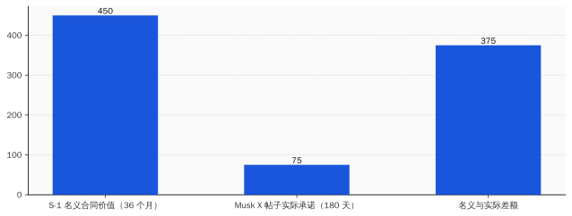
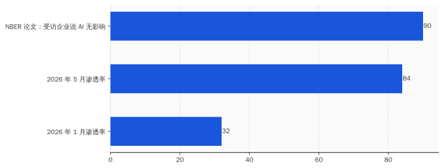
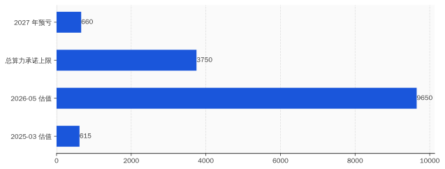

# Anthropic 估值冲到 9650 亿那个下午，Musk 在 X 上把租约改成了 180 天

> **发布日期**：2026-05-29 | **分类**：AI产业深度

## 导语

2026 年 5 月 28 日，美东时间下午 4 点 17 分，Anthropic 把 Series H 公告挂在 anthropic.com/news/series-h——募资 650 亿美元，投后估值 9650 亿。两个月前的估值是 3500 亿。十四个月前是 615 亿。

Krishna Rao，Anthropic CFO，2024 年 5 月从 Airbnb 跳过来，3 月 9 日刚在加州北区法院的一份 sworn declaration 里签了字。他在 Series H 的官方 quote 里说：

> 「Claude is increasingly indispensable to our growing global community of customers.」

Claude 对客户来说越来越不可或缺。

同一天，加州时间下午 6 点 02 分，太平洋时间和东部时间差三个小时——Anthropic 公告挂上去 1 小时 45 分钟之后——Elon Musk 在 X 上回了一条转发数 8400 的帖子。原话两句：

> 「The short term was our request, not Anthropic's.」

短期是我们要求的，不是 Anthropic 要求的。

> 「If compute gets super tight I said we might need it back at some point.」

算力紧张的时候，我说我们可能要拿回去。

8 天前，5 月 20 日，SpaceX 把那份合同写进递交给 SEC 的 S-1：每月 12.5 亿美元，写到 2029 年 5 月。名义价值 450 亿。8 天后，金主在 X 上把它改口成「180 天 + 90 天可取消」。

合同名义 450 亿，缩到 75 亿，对方还能随时拿回。

Anthropic 那天 9650 亿的估值，锚定的就是这份合同——以及 Q2 那笔 5.59 亿"首次运营盈利"。盈利怎么来的，第三节讲。SpaceX 合同里那笔没写明额度的"5、6 月限时折扣"是怎么"不存在"在任何披露文件里的，也是第三节讲。

就这。

---

## 一、5 月 28 日下午两个时间戳

把 5 月 28 日这一天的事按时间排开。

**美东时间下午 4 点 17 分**——Anthropic 把 Series H 公告挂在 anthropic.com 的 newsroom。标题原文：「Anthropic raises $65B in Series H funding at $965B post-money valuation」。投资人名单：ICONIQ、Lightspeed、TPG、Fidelity、Blackstone、Coatue 领投；Dragoneer、Greenoaks、Sequoia、Altimeter 跟投每家约 20 亿；hyperscaler 们一共"previously committed" 150 亿，其中 Amazon 自己 50 亿写在脚注。

run-rate 营收 470 亿美元——是截至 5 月初的年化值。比 2 月那笔 35 亿 run-rate 涨了 13 倍。比 2025 年底 90 亿涨了 5 倍。Anthropic 用的是 run-rate，不是 trailing twelve months——这个区别第三节会用到。

Series H 之后，Anthropic 估值正式超过 OpenAI。OpenAI 3 月 31 日最后那轮 122 亿融资关账时投后 8520 亿——两个月之前 OpenAI 还是世界上最值钱的初创。8 天前，5 月 20 日，OpenAI 自己也悄悄提交了 confidential S-1，IPO 在路上。两家在赛跑（笑），谁先把 S-1 公开版本挂出来谁先收割二级市场流动性。

按 Anthropic 自己公告里给的数字：Fortune 10 里 9 家是客户，10 万家以上企业付费，1000 家以上客户每家每年付超过 100 万美元。

Krishna Rao 的官方 quote 我前面贴过。Dario Amodei 这次没出官方 quote——他在 Series H 公告里只挂了一句"We are profoundly grateful to our investors"。CEO 公告挂一句话感谢，CFO 挂一段话谈 Claude——这个分工本身值得看一眼，意味着这一轮的叙事重心是财务面、不是研究面。

**太平洋时间下午 6 点 02 分**——Series H 公告挂上去 1 小时 45 分钟之后——Elon Musk 在 X 上回了那条 8400 转发的帖子。原帖问的是 SpaceX 给 Anthropic 的算力合同：是不是真的写到 2029 年。Musk 的回复，是把这份 8 天前在 S-1 里写得清清楚楚到 2029 年 5 月的合同，"澄清"成 180 天的租约 + 90 天双方可取消。

Musk 这两句话用词很有意思。「short term was our request」——是我们要求的短期；「we might need it back」——我们可能拿回去。把控制权牢牢握在 SpaceX 这一边。

8 天前 S-1 里写的是「at present, expected to extend through May 2029, subject to early termination by either party upon 90 days' written notice」——双方任一方可凭 90 天书面通知终止。文件没写 180 天初始期。SEC 备案的文本和 CEO 当天在社交媒体的"澄清"，对不上。

这两个时间戳之间，差了 1 小时 45 分钟。差的是什么——

是估值锚的稳定性。

  
🎨

  
概念图占位

  

生成 Prompt
<pre>A flat minimalist illustration showing a large neon storefront billboard reading "$965B" being held up by thin scaffolding, while a tiny tweet bubble at the bottom is pulling out a paper labeled "lease" from underneath the scaffolding. Tech style, blue and white color palette, no text on the storefront other than the dollar value, clean white background</pre>

---

## 二、12.5 亿 × 36 个月 = 450 亿，Musk 改口后剩 75 亿

把那份 SpaceX 合同条款逐条摆出来，看 8 天前的"原始版本"长什么样。

来源是 SpaceX S-1，2026 年 5 月 20 日递交，SEC EDGAR CIK 0001181412。文件里关于 Anthropic 那一段大致原文（节选）：

> 「Effective May 2026, we have entered into a customer agreement with Anthropic, PBC for the provision of compute capacity at our Colossus data center facility. Subject to monthly payments of approximately $1.25 billion, the agreement is expected to extend through May 2029, subject to early termination by either party upon 90 days' written notice.」

> 「Anthropic 自 2026 年 5 月起向 SpaceX 支付约 12.5 亿美元/月，预期至 2029 年 5 月，任一方可凭 90 天书面通知终止。」

这份合同的标的是 Colossus 1——SpaceX 在路易斯安那州 Caddo Parish 建的数据中心。300 兆瓦电力。22 万张 Nvidia GPU。混合 H100、H200、GB200。Tom's Hardware 2026 年 1 月那篇报道里给过容量分布。

12.5 亿一个月，36 个月，名义价值 450 亿美元。

Musk 5 月 28 日 X 上的版本不一样。把 Musk 那两句话和 S-1 文本逐项对比：

| 项 | S-1（2026-05-20） | Musk X 帖子（2026-05-28） |
|---|---|---|
| 起始 | 2026 年 5 月 | 2026 年 5 月 |
| 月费 | ~$1.25B | （未提） |
| 初始期 | 至 2029 年 5 月 | 180 天 |
| 终止条款 | 双方 90 天通知 | "可能算力紧张时拿回" |
| 客户控制权 | 写在合同里 | "我们要求短期" |
| 名义合同价值 | ~$45B | ~$7.5B（180 天 × $1.25B） |

差额是 375 亿。

需要补两句话。"180 天 + 90 天可取消"这个组合在企业算力采购里有个名字，叫"试用期 + 双方可走"。这种条款本身不少见——AWS、Azure、Google Cloud 都给大客户做过类似试用。问题不在条款本身，问题在两件事。

第一件，S-1 文本和 CEO 在 X 上的口径对不上。SEC 备案文件里写到 2029 年 5 月，CEO 当天说 180 天。两个版本写在不同地方、面向不同读者、产生不同后果。S-1 是给 IPO 投资人看的——说"我们和 Anthropic 锁了 36 个月、450 亿"；X 帖子是给客户看的——说"算力紧张时我们拿回来"。

S-1 是法律文件。X 是社交媒体。法律文件按 securities fraud 标准看，社交媒体按 vibes 看。一份合同同时跑在两套标准上。

第二件，Anthropic 的 Series H 估值锚定这份合同——锚的是 36 个月版本，不是 180 天版本。9650 亿估值假设 Anthropic 拿到的算力是可锁定、可摊销、可在财务模型里折现到 2029 年的资产。Musk 当天用一条 X 帖子告诉市场——这资产，我 180 天能拿回。

Anthropic 那边没有官方回应。一直到本文完稿为止，anthropic.com 没出过澄清。Dario 没出过推文。Krishna Rao 没出过 quote。8 天前 CFO 出现在 SpaceX 自家 S-1 文件里有头有脸的客户名册上，8 天后 SpaceX CEO 在公开社交平台说"那不算 36 个月合同"——Anthropic 选择不回应（笑）。

不回应有两种解读。一种是"Musk 在 X 上瞎说，正式合同已签到 2029 年"。另一种是"S-1 那段是 SpaceX 单方面表述，Anthropic 没承诺到 2029 年"。两种解读，二级市场的估值后果差出 375 亿。

Anthropic 不回应的成本，是 Series H 那份估值表里那一格"算力承诺"该填多少。

---

## 三、Q2 那笔 5.59 亿盈利，是 5、6 月那两个月凑出来的

CNBC 2026 年 5 月 20 日那篇《Anthropic set to hit $10.9 billion in revenue in Q2》，作者 Hayden Field。文章引述了三个数字：Q1 营收 48 亿、Q2 预期 109 亿（环比 +130%）、Q2 预期运营利润 5.59 亿。

毛利率倒推一下，大约 5%。换句话说 Q2 109 亿收入里，103 亿要付出去——绝大部分是算力账单。

5.59 亿是个标志性数字。这是 Anthropic **首次**实现季度运营盈利。OpenAI 至今没盈利过——3 月 31 日 122 亿融资关账时投后估值 8520 亿，但 GAAP 口径每个季度都在亏。Anthropic 这次"先盈利、再 IPO"的剧本，本来是 2026 年 AI 行业最大的转折点。

Ed Zitron 5 月 25 日发的《Anthropic's "Profitability" Swindle》——swindle 这个词在英文里意思是"骗局"——把这笔盈利拆解了一遍。Zitron 是 Where's Your Ed At / Better Offline 的主理人，长期写 AI 商业模式批评。他这篇文章的核心论据有两条。

第一条：Q2 的 5、6 月这两个月，正好是 SpaceX-Anthropic 合同的"前两个月"。合同 2026 年 5 月生效——Q2 的 4 月还没生效，5、6 月生效。SpaceX 这边作为新供应商，给前两个月一笔"前期客户优惠"是行业惯例。优惠多少不公开。S-1 里也没写。

第二条：在算力账单占成本 95% 以上的情况下，前两个月的供应商优惠，可以直接把这两个月的毛利率从平时的 -5% 拉高到 +5%。两个月凑出来的 5.59 亿盈利，足够撑起整个 Q2 的 GAAP 报表。

Gary Marcus 2026 年 5 月 27 日在 Substack 发了《Breaking: bad news for three of the biggest IPOs in history》，把 Zitron 的论点接着推了一层。Marcus 原话：

> 「That is amazing—assuming it actually happens—but if it does it will be in no small part because Anthropic is getting a one-time (nonrecurring) discount for that quarter on compute from SpaceX. The exact number is not given but that discount may well be bigger than the projected $559M profit.」

那笔折扣可能比 5.59 亿利润本身还大。

折扣额度多少，没人知道。SpaceX S-1 没披露。Anthropic 官方公告没披露。CNBC 那篇报道引的是知情人士，知情人士也没披露具体金额。

3 月 9 日 Krishna Rao 在加州北区法院案 No. 3:26-cv-01996 的 sworn declaration 里宣誓签字，原话：

> 「Anthropic's total revenue to date exceeds $5 billion.」

Anthropic 成立至今总收入超过 50 亿。

这个声明日期是 3 月 9 日，对应的是 2025 年底前的累计数。Q1 2026 营收 48 亿——意味着 Q1 一个季度就快赶上"成立至今总营收"。这是真增长，没人否认。

但有个数字对不上。Sacra 的 Anthropic dossier 里写 Anthropic 2025 全年营收 70 亿——比 Krishna Rao 法庭宣誓的"成立至今 50 亿"高出 20 亿。两个数字的差额，可能来自不同口径——bookings、recognized revenue、合并报表 vs 单体——但 Anthropic 没公开过任何一份对账。

法庭宣誓数、官方 ARR 数、Sacra 估算数，三个相互独立的数据点，差额未被解释。Series H 的 9650 亿估值同时援引了第二个——「run-rate 470 亿」。这个 run-rate 怎么算的、5、6 月 SpaceX 折扣有没有计入分母、算入哪个时点——Anthropic 不披露。

CFO 不披露。CEO 不出 quote。Series H 公告里反复出现的措辞是"crossed $7 billion in annualized revenue""run-rate exceeding $47 billion in early May"——全部用 run-rate 和 annualized 这两个词。这两个词的特点是：用某一个具体时点的当月数字 × 12，就能算出来。如果那个具体时点恰好是 5、6 月——SpaceX 折扣最厚的两个月——这两个数字就能比"正常 trailing twelve months"高一截（笑）。

这不是会计造假。这是合规口径下的估值故事。两件事不一样，但二级市场看的是估值故事，不是会计造假。

  
🎨

  
概念图占位

  

生成 Prompt
<pre>A flat minimalist illustration of a quarterly financial report showing a large bold "$559M Q2 PROFIT" headline at top, with a tiny asterisk footnote at the very bottom barely readable showing "*includes one-time discount from supplier (amount not disclosed)". Above the report, a confetti celebration. Tech style, blue and white color palette, clean white background</pre>

---

## 四、"Fortune 10 里 9 家是客户"——Uber 用 4 个月烧完了整年 AI 预算

Anthropic Series H 公告里反复提的客户口径有三条：「9 of the Fortune 10」、「100,000+ businesses」、「1,000+ customers each spending over $1 million per year」。

这三个数字本身都不假。但都在回避一个问题——

这些客户为什么用 Claude。

Praveen Neppalli Naga，Uber CTO，2026 年 5 月初在 Brian Halligan 的 Rapid Response Podcast 里给了一个一手案例。Cybernews 后来把他的发言转成了文章。

Uber 内部 Claude Code 使用率从 32% 涨到 84%，用了 4 个月。同期单个工程师每月 API 花费在 500 到 2000 美元之间。Uber 2026 全年的 AI 预算——Naga 在那期播客里原话——4 个月烧光。

为什么烧得这么快。Naga 自己给的解释，KPI 是"prompts per engineer"——每个工程师每月发的 prompt 数。这个指标越高代表使用率越高，使用率越高代表 AI 转型推进得越好，使用率越好代表团队下个季度不被裁。所以工程师不烧 token，等于自己给自己挖坑。

Uber CTO 自己披露这件事——意思是 Uber 自己也意识到，渗透率涨到 84% 这件事，不全是因为 Claude 真的把效率提了。

NBER 工作论文 2026 年 2 月那篇《Generative AI at Work: Evidence from US Manufacturing》——3 万家美国制造业企业面板数据——结论是：90% 受访企业反映 AI 对工作和生产力毫无影响；只有高管投影中，AI 将给 2027 年带来 1.4% 生产率增长。NBER 那篇文章里有一句被广泛引用的话：「Implementation is not impact.」部署不等于影响。

把这两份数据放一起看。Anthropic 的「9 of the Fortune 10」是事实——Walmart、ExxonMobil、Apple、UnitedHealth、CVS、Berkshire、Alphabet、McKesson、Amazon——九家肯定在用 Claude 或者 Claude Code。但「在用」和「在烧 token、拉满 KPI、年底续费、明年加预算」之间，还差 5 个 ROI 计算。

Uber 是头部 AI 客户。Uber 的 CTO 自己说全年预算 4 个月烧完。Uber 这种规模的客户，把预算烧完之后，要么砍 KPI、要么砍预算、要么砍 Anthropic。砍哪个不知道，但 5、6、7、8 月这四个月之后，Uber 一定要做这个选择。

Sacra 那份 Anthropic dossier 里有一组数字：超过 1000 家企业客户每家年付超过 100 万美元，2 个月翻倍。这是按月度账单倒推的 ARR 数字。两个月翻倍意味着——这些客户里，相当一部分还在初始 ramp-up 阶段，账单从 0 涨到 100 万美元/年。如果按 Uber 的节奏，4 个月烧光预算的那一刻就是续约决策时点。

Claude Code 单独的 ARR 是 25 亿美元，截至 2026 年 2 月。增速很猛——但增速的分母是上一个月，不是基线。当一家公司的 KPI 是"prompt per engineer"，这个指标只会涨，不会反映实际生产率。当 KPI 改成"AI ROI per engineer"，曲线立刻翻向另一边。

这里需要补一句反方论据。Brad Gerstner（Altimeter Capital 创始人）在 2026 年 2 月 BG2 Pod 那期里给的判断："Anthropic has won the enterprise market"——Anthropic 已经赢了企业市场。Gerstner 的依据是企业客户结构本身就是黏的——一旦把 Claude 嵌入 CI/CD、嵌入内部知识库、嵌入产品工作流，迁移成本极高。这个判断有道理，但前提是企业不在 KPI 倒推预算。Uber 的案例说明前提不成立。

KPI 一改，token 就断。token 一断，run-rate 470 亿就要重算。

---

## 五、估值 20.5 倍、算力承诺 1800 亿、2027 年预亏 660 亿

把 Anthropic 估值历史曲线和算力承诺账本并排摆出来。

估值曲线：

| 时点 | 估值（亿美元） | 倍数 |
|---|---|---|
| 2025-03 | 615 | — |
| 2025-09 | 1830 | 3.0x |
| 2026-01 | 3500 | 5.7x（vs 2025-03） |
| 2026-02 | 3800 | 6.2x |
| 2026-05 | **9650** | 15.7x |

14 个月，估值翻 15.7 倍。

算力承诺账本，这是 Anthropic 已经公开承诺的、写在博客或合同里的对外支付义务：

| 算力供应商 | 承诺金额 | 期限 | 来源 |
|---|---|---|---|
| AWS | $100B+ | 10 年 | 2026-04-20 公告 |
| Google Cloud / Broadcom | $200B | 5 年 | 2026-04-24 公告 |
| Microsoft Azure | $30B | 未公开 | 2026 早期协议 |
| SpaceX Colossus | $45B（名义） | 至 2029-05 | 2026-05-20 S-1 |
| **合计承诺上限** | **>$375B** | **5-10 年** | |
| 摊到每年 | **~$60B–$75B/年** | | |

把 Series H 公告里的 470 亿 run-rate 和这 60-75 亿/年承诺并排——一家"刚到 470 亿年化营收"的公司，已经签下了未来每年最少 60 亿、最多 75 亿的外部算力承诺。

The Information 4 月那期投资人材料（被 Sacra 转引）里的预亏数字：2026 年预亏 290 亿美元，2027 年预亏 660 亿美元。

这两个数字也是数字游戏。「预亏」算的是 GAAP 口径下的 net loss，包含算力摊销、研发、补贴。"预测"的部分是营收增速——如果 2027 年 Anthropic 营收能从 2026 年的 ~$50B 涨到 ~$120B，那 660 亿预亏才落在"合理增长期亏损"区间。如果 2027 年营收只涨到 ~$70B，660 亿预亏就是结构性的。

营收增速取决于什么——取决于企业客户续不续约。续不续约取决于 ROI——ROI 在 NBER 那份论文里是 90% 不可见的。

把这三套数字摞起来：估值 9650 亿、年化营收 470 亿、年算力承诺 60-75 亿、2027 年预亏 660 亿。一家估值倍数 20.5x（基于 run-rate）、未来每年至少要付 60 亿算力账单、明年要亏 290 亿的公司。

同期 NVIDIA Q1 FY27 财报——5 月 20 日递交的 8-K——单季营收 816 亿，数据中心业务 752 亿。NVIDIA 一个季度从这个生态里赚的钱，比 Anthropic 全年营收还多 6 倍。

钱进了 NVIDIA。Anthropic 的角色是：(a) 给 NVIDIA 兜单——通过 AWS / Google / SpaceX 转手把推理需求摊到 GPU；(b) 给市场提供 GAAP 口径下的"AI 商业模式正在跑通"的叙事；(c) 把 ICONIQ / Lightspeed / TPG / Fidelity / Blackstone / Coatue 这些 LP 的钱锁在自己资产负债表上。

第一项的受益方是 NVIDIA。第二项的受益方是整个 AI 投资生态——包括 OpenAI 的 IPO 估值。第三项的受益方是 Anthropic 自己。

谁是这一轮里付钱的——是 LP 池子里那些等着 2026-2028 年退出窗口的养老金、主权财富基金和大学捐赠基金。

---

## 六、Series H 这 650 亿，是同一张支票在 5 家公司之间转账签名

把这一周和 Anthropic 估值相关的 5 件事拼起来，看一个共同点。

**5 月 20 日**——SpaceX 在 SEC EDGAR 提交 S-1。文件里第一次曝光 Anthropic 12.5 亿美元/月的合同。同一天，OpenAI 也在 Axios 报道里被确认提交了 confidential S-1。同一天，NVIDIA 公布 Q1 FY27 财报，单季 816 亿、数据中心 752 亿。同一天，WSJ 和 CNBC 援引知情人士披露 Anthropic Q1 营收 48 亿、Q2 109 亿、首次盈利 5.59 亿。

四件事挤在同一天。

**5 月 22 日**——Bloomberg 抢发"Anthropic to Close Over $30 Billion Round as Soon as Next Week"，写的是 30B+ 募资和 900B+ 估值。这个数字 6 天后被翻倍——实际公告的是 650 亿 / 9650 亿。Bloomberg 的知情人士只看到了底牌的一半。

**5 月 25 日**——Ed Zitron 发《Anthropic's "Profitability" Swindle》。Zitron 这篇文章在 Better Offline / Where's Your Ed At 上的阅读量到本文截稿时是 80 万次，被 Hacker News、Bloomberg Opinion 多次转载。

**5 月 27 日**——Gary Marcus 跟着发《Breaking: bad news for three of the biggest IPOs in history》。指名要看的三家是 OpenAI、Anthropic、SpaceX——这三家都在 2026 年中段同步走 IPO 流程。Marcus 在文中给的判断是「Caveat emptor」——买者自负。

**5 月 28 日**——Anthropic Series H 关账。同日 Musk 在 X 改口 SpaceX 合同。同日发布 Claude Opus 4.8——SWE-bench Verified 88.6%、SWE-bench Pro 69.2%。SWE-bench Pro 这个数字是 4 月对外开的新基准，前代 Claude Opus 4.7 跑 64.3%，4.8 涨 4.9 个百分点。

把这五天合起来看，每一件事都在为同一笔交易做注脚。

Anthropic 拿到的 650 亿，要花到三个地方：AWS、Google Cloud、SpaceX——三家算力供应商。三家算力供应商的算力来自哪里——NVIDIA 的 GPU。NVIDIA 的 GPU 谁付钱——AWS、Google Cloud、SpaceX 自己。AWS 和 Google 的 GPU 采购预算从哪里来——一部分来自 Anthropic 的预付账单。SpaceX 的 GPU 采购预算从哪里来——一部分来自 Series E 之后的融资和 Starlink 自由现金流，但 Colossus 这块也需要 Anthropic 的预付。

一笔 650 亿融资款，在 Anthropic → AWS → NVIDIA → AWS → Anthropic 这个圈里转一圈，五家公司的资产负债表都增厚一次。

Bloomberg Graphics 4 月那张《AI Circular Deals》图，把这个循环画了三家版本——OpenAI、Microsoft、NVIDIA 互相投资+互相采购。Anthropic 在那张图上是个角落。5 月 28 日之后，Anthropic 从角落升到了正中——通过 AWS、Google、SpaceX 三家算力枢纽嵌进同一个循环。

OpenAI 同一周提交 S-1，时间紧贴 SpaceX 那次提交。两家 SEC 备案放在一起，给市场释放的信号是"AI IPO 在路上"。但 OpenAI 8520 亿、Anthropic 9650 亿——两家估值差 1130 亿。OpenAI 投行已经定下 Morgan Stanley + Goldman 领衔。Anthropic Series H 关账之后下一步就是公开 S-1。两家的 IPO 节奏在赛跑——谁先上谁先收割二级市场流动性。

这场赛跑的胜负，取决于 Q2、Q3 的财务报表。Q2 已经预告了 5.59 亿首次盈利。Q3 没人保证再续——续不续取决于 SpaceX 折扣还在不在。SpaceX 折扣还在不在，取决于 Musk 那天的心情。

Daron Acemoglu 5 月 11 日在 MIT Technology Review 那期采访给的预测是：AI 在未来 10 年只会给美国 GDP 涨 1.1%，年生产率涨 0.05%。Acemoglu 是 2024 年诺贝尔经济学奖得主，他这个数字和 Goldman Sachs 同期给的 7% 差出 70 倍。Acemoglu 那期采访里特别点了三件事——"agentic AI deployments""enterprise ROI realization""compute concentration"——三件事全部对应 Anthropic 这一周的故事。

第一件——agent 的实际部署效果——上周 ClawBench 数据出炉，153 个真实网站任务，最强模型 33.3%。第二件——企业 ROI 兑现——Uber CTO 自爆 4 个月烧光年预算、NBER 论文 90% 企业看不到影响。第三件——算力集中度——SpaceX/AWS/Google/Microsoft 四家把全球 80% AI 训练算力包了。

三件事里，本周新增的最重要数据点是第二件的反面——Uber CTO 那段 Rapid Response Podcast 自白。这条信息没进 Anthropic 公告，没进 Bloomberg 报道，没进 CNBC 报道，但它在那期播客里就摆着。tokenmaxxing 这个词是 Gary Marcus 5 月 27 日那篇文章里造的——意思是企业为了不掉队鼓励员工无脑灌 token。tokenmaxxing 就是 run-rate 470 亿的真实成色。

那条把"36 个月、450 亿"改口成"180 天、75 亿"的推特发出来 1 小时之后，Anthropic 估值 9650 亿这个数字仍然挂在 newsroom 上。8 天之内已经发布的 S-1 文本写得清清楚楚到 2029 年 5 月。Series H 投资人当天看到了 Musk 那条推特。Krishna Rao 看到了。Dario Amodei 看到了。

没人回应。

不回应有不回应的好处——估值已经锚住，9650 亿这个数字已经写在每一份基金的内部估值表上、每一份投资人新闻通稿上、每一份 Anthropic IPO roadshow 的 banner 上。回应只会给市场两种选择题——一种"反驳 Musk"（伤情面），一种"承认 180 天"（伤估值）。两种都是损失。最优解是不回应（笑）。

3 个月之后，下一份 Q3 财报出来。Q3 财报里 SpaceX 折扣还在不在、450 亿/75 亿这个差额怎么记账、Anthropic 的 IPO 时点定不定——三件事会同时摊牌。9650 亿这个数字能不能撑过去，看 Q3。

Mustapha Lazrek 上周（5 月 13 日）说「agents that actually do the work」。Musk 这周（5 月 28 日）说「The short term was our request」。两句 corporate-speak，意思完全相反，但句式一模一样——都是把对方该承担的风险，悄悄挪到自己想要的位置。

agent 把工作风险挪给企业 IT。Musk 把合同风险挪给 Anthropic。Anthropic 把估值风险挪给 LP。

风险最后到了谁那。

到了那些以 9650 亿估值认购了 Anthropic Series H、相信 run-rate 470 亿能撑到 IPO、相信 SpaceX 那份合同能跑到 2029 年的人。Brad Gerstner、Doug Leone、Roelof Botha、Marc Stad——这一轮领头的几个名字，背后是 LP 池子里那些 5 年、10 年、20 年才能退出的耐心资本。

耐心资本能等。Musk 那条推特不能。

就这。

  
🎨

  
概念图占位

  

生成 Prompt
<pre>A flat minimalist illustration of five corporate buildings arranged in a circle (Anthropic, AWS, NVIDIA, SpaceX, Google), with a single dollar-shaped check flowing in a circular arrow pattern between them, being endorsed and signed at each stop. Tech style, blue and white color palette, no text on the buildings, clean white background</pre>

---

## 数据来源

### Series H 与估值
- [Anthropic raises $65B in Series H funding at $965B post-money valuation](https://www.anthropic.com/news/series-h) — Anthropic 官方公告，2026-05-28
- [Anthropic raises $65 billion, nears $1T valuation ahead of IPO](https://techcrunch.com/2026/05/28/anthropic-raises-65-billion-nears-1t-valuation-ahead-of-ipo/) — TechCrunch，投资人列表，2026-05-28
- [Anthropic hits $965B valuation with latest funding round, overtaking OpenAI](https://thehill.com/policy/technology/5900111-anthropic-valuation-openai-race/) — The Hill，2026-05-28
- [Anthropic to Close Over $30 Billion Round as Soon as Next Week](https://www.bloomberg.com/news/articles/2026-05-22/anthropic-to-close-over-30-billion-round-as-soon-as-next-week) — Bloomberg，2026-05-22
- [What's rarer than a unicorn?](https://fortune.com/2026/05/28/anthropic-series-h-valuation-ipo-unicorn/) — Fortune，2026-05-28
- [Sacra: Anthropic revenue, valuation & funding](https://sacra.com/c/anthropic/) — 估值历史曲线、预亏数据

### SpaceX 合同
- [SpaceX S-1, SEC EDGAR](https://www.sec.gov/Archives/edgar/data/1181412/000162828026036936/spaceexplorationtechnologi.htm) — 2026-05-20 递交
- [Anthropic is paying SpaceX $15 billion per year](https://www.axios.com/2026/05/20/anthropic-spacex-compute) — Axios，2026-05-20
- [Anthropic will pay xAI $1.25 billion per month for compute](https://techcrunch.com/2026/05/20/anthropic-will-pay-xai-1-25-billion-per-month-for-compute/) — TechCrunch，2026-05-20
- [How long is Anthropic's lease with SpaceX? Opinions vary](https://techcrunch.com/2026/05/28/how-long-is-anthropics-lease-with-spacex-opinions-vary/) — TechCrunch，Musk 改口报道，2026-05-28

### 营收与盈利
- [Anthropic set to hit $10.9 billion in revenue in Q2](https://www.cnbc.com/2026/05/20/anthropic-revenue-explosive-growth-ipo-profitable-quarter.html) — CNBC，2026-05-20
- [Declaration of Krishna Rao, Case No. 3:26-cv-01996](https://storage.courtlistener.com/recap/gov.uscourts.cand.465515/gov.uscourts.cand.465515.6.5.pdf) — CFO 法庭宣誓，2026-03-09
- [Anthropic's "Profitability" Swindle](https://www.wheresyoured.at/anthropics-profitability-swindle/) — Ed Zitron，2026-05-25
- [Breaking: bad news for three of the biggest IPOs in history](https://garymarcus.substack.com/p/breaking-bad-news-for-three-of-the) — Gary Marcus，2026-05-27

### 算力承诺
- [Expanding our use of Google Cloud TPUs](https://www.anthropic.com/news/expanding-our-use-of-google-cloud-tpus-and-services) — Anthropic 官方，2026-04-24
- [Anthropic and Amazon expand collaboration](https://www.anthropic.com/news/anthropic-amazon-compute) — Anthropic 官方，2026-04-20

### 客户与 ROI
- [Uber spends entire 2026 AI budget in 4 months](https://cybernews.com/ai-news/uber-ai-return-of-investment-token-usage/) — Cybernews，转引 Rapid Response Podcast
- [Generative AI at Work: Evidence from US Manufacturing](https://www.nber.org/papers/w33809) — NBER Working Paper，2026-02

### 模型与同期事件
- [Introducing Claude Opus 4.8](https://www.anthropic.com/news/claude-opus-4-8) — Anthropic 官方，2026-05-28
- [NVIDIA Q1 FY27 8-K](https://www.sec.gov/Archives/edgar/data/0001045810/000104581026000051/q1fy27pr.htm) — SEC EDGAR，2026-05-20
- [OpenAI prepares confidential IPO filing](https://www.axios.com/2026/05/20/openai-ipo-spacex-musk) — Axios，2026-05-20
- [AI Circular Deals](https://www.bloomberg.com/graphics/2026-ai-circular-deals/) — Bloomberg Graphics
