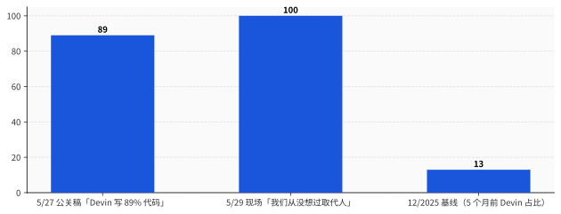
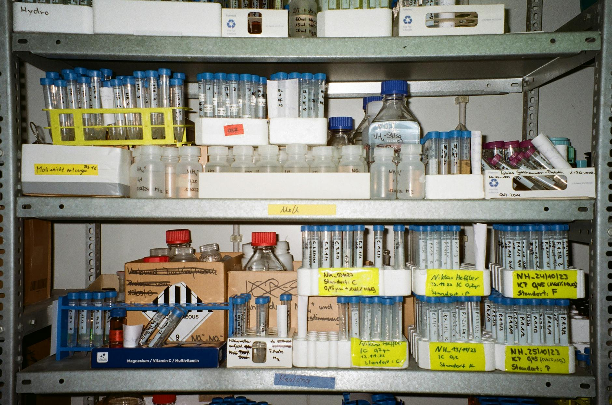
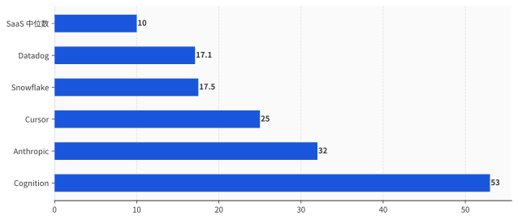

# Cognition 公布 89% 代码 AI 写完那个下午，CEO 反手说"我们从没想过取代人"

> **发布日期**：2026-05-31 | **分类**：AI产业深度

## 导语

2026 年 5 月 27 日，Cognition 在自己博客 cognition.ai/blog/series-d 挂了一条公告。

10 亿美元 Series D 完成，估值 260 亿美元。八个月前是 102 亿。八个月翻 2.5 倍。

同一篇公告里还塞了两个数字。第一个：过去 12 个月的 ARR 从 3700 万美元飙到 4.92 亿美元，13 倍。第二个，更扎眼：

> "89% of code committed by our engineers is committed by Devin."
>
> 我们工程师提交的代码里，89% 是 Devin 提交的。

2025 年 12 月这个比例还是 13%。5 个月，从 13% 走到 89%。

48 小时后，5 月 29 日，TechCrunch Disrupt 现场，CEO Scott Wu 被主持人 Kirsten Korosec 追问"Devin 会不会取代 mid-level engineer"。原话：

> "We've never thought about it as replacing humans. I know it's like a scenario, folks have said these things. It has never been our view."
>
> 我们从没想过这是取代人。这种说法，我知道有人在讲，但从来不是我们的想法。

同一周的另外几条新闻可以并排摆出来——

5 月 28 日，Salesforce CEO Marc Benioff 在彭博访谈里说 FY26 工程师团队没招一个新人，唯一在扩张的部门是销售。

5 月 19 日，OpenAI 联合创始人 Andrej Karpathy——7 个月前在 Dwarkesh Patel 播客里把 AI agent 叫 "slop"（一坨垃圾）、说"真能用还得 10 年"的那位——加入了 Anthropic 预训练团队。

Stanford 数字经济实验室 8 月已经发表过基于 ADP 真实工资单的研究：AI 暴露岗位上 22-25 岁早期员工的就业下降 13-16%，软件开发岗下降接近 20%。

这五件事拼起来是这样的：

一个公司的 CEO 一手公开"我们 AI 写了我们 89% 的代码"，另一手公开"我们从没想过取代人"；同行 Salesforce 的 CEO 公开"FY26 招 0 个工程师"；最大对家 Anthropic 把 7 个月前嘲笑 agent 的人挖了过去；学术界给出 22-25 岁程序员 -20% 的硬数据。

中文圈这周写了 5 篇 Cognition 报道。新浪两篇，网易一篇，36Kr 一篇，DataPipe 一篇。标题大同小异，无非"AI 写了自己 90% 的代码，估值涨 25 倍"和"三个 90 后华裔奥赛冠军估值 720 亿"。没一篇把 5/27 那条 89% 数字和 5/29 现场那句"我们从没想过取代人"摆在一起读。

那就摆一下。

这篇拆五件事：
- 第一件，**48 小时**里 CEO 公关稿和现场发言为什么是两个版本
- 第二件，**89% 是怎么 5 个月内从 13% 长出来的**——具体在 Mercedes、Itaú、Goldman 的哪些活上
- 第三件，Wu 不是在撒谎，他在**念一条 5 月底集体出炉的行业新咒语**
- 第四件，**Karpathy 这 14 天**——把 agent 叫 slop 那位，怎么转身进了 Anthropic 预训练组
- 第五件，260 亿估值卖的根本不是"AI 程序员"——它卖的是另一样东西

---

## 一、48 小时——融资公关稿和现场发言的两个版本

把这 48 小时拆开看。

**5 月 27 日**，Cognition 官方博客 series-d 那篇公告，作者署名是 Scott Wu 本人。第三段原文摆在那儿：

> "Today, 89% of code committed by our engineers is committed by Devin. In December 2025, that number was 13%."

89% / 13% / 12 月。三个具体数字、一个具体月份。

公告同时给客户列了一行长名单：Goldman Sachs、Citi、Mercedes-Benz、Dell、Santander、Palantir、NASA、美国陆军、美国海军、巴西最大私人银行 Itaú Unibanco。这一段在博客里叫 "Companies trust Devin"。

公告最后一句是这样：「We're hiring across all teams.」

我们各团队都在招。

把 89% 和 We're hiring 并排放——89% 的代码是 AI 写的，但我们还在大量招人。Wu 给这两个数字之间留了一条公关意义上的"安全带"——Devin 写了 89% 的代码，但没替换工程师。是工程师在用 Devin。

**5 月 28 日**早晨，Bloomberg 独家把融资消息发出来。当晚 Anthropic 把自己的 Series H 公告也甩了——估值 9650 亿美元，超过 OpenAI 当下 5000 亿那一档（这事我前天写过了）。Cursor 在私下融资谈判里被多个一手源指认正在敲 500 亿估值（4 月 TechCrunch 报道，5 月底已默认成行业共识）。

编程 agent 赛道一夜之间 Anthropic-9650 亿、Cursor-500 亿、Cognition-260 亿 三家估值合计 1.7 万亿。这是有史以来最贵的一个垂直赛道，且垂直到只服务一个工种：程序员。

**5 月 29 日**，TechCrunch Disrupt 现场，主持人 Kirsten Korosec 把麦克风递给 Scott Wu。问题是这么开始的：「Devin 现在能力到底相当于一个什么样的工程师？」

Wu 给出第一个回答：

> "I think they're around between a junior and a mid-level engineer."
>
> 大概在 junior 和 mid-level 之间。

讲完这句他大概是听见自己说了什么。下一个回答几乎是反射性的：

> "We've never thought about it as replacing humans."

「我们从没想过这是取代人。」

把这两句话放一起，意思是这样的：我们的产品现在能干一个 junior 到 mid-level 工程师的活，但我们从没想过它会取代任何人。

这种话的语言结构有个名字，叫"修辞性否认"——产品能力前置定义清楚，然后用一句意图声明把效果撇清。一个律师懂这个，一个上市公司公关懂这个，一个准备明年走 IPO 的初创 CEO 当然也懂。

公关稿要喂市场和投资人——89% 是飞轮信号，越大越好；现场发言要喂监管、媒体、客户——「不取代人」越坚定越好。两份目标受众，两个版本。

**89% 是给资本市场看的。「不取代人」是给监管、媒体、和那些 12000 人开发团队的 CIO 看的。**

后者那群 CIO 这一年最怕的，是哪天上头朝他们拍桌子问「你买这个 AI 是为了取代员工吗」——一旦答"是"，加州 SB53、欧盟 AI Act 的 layoff 报告条款、企业内部 ESG、媒体头条、工会，所有人都会同时进来。这套"我们买 AI 是为了 augment"的话术，是 CIO 这一年的标准防御。Wu 那句"我们从没想过取代人"是给 CIO 准备的合规弹药。

不是撒谎。是**给客户写台词**。

就这。

---

## 二、89% 是怎么来的——5 个月内长出来的具体活

光看 89% 这个数字会以为是 Cognition 自家的实验室数据。其实它有具体落地的客户和具体做完的活。一手案例从 Cognition 官方博客和 devin.ai 的 customers 子站可以扒齐三个。

#### Mercedes-Benz：200,000 行 COBOL，原计划 8 个月，结果 8 天

Cognition 官方博客 cognition.ai/blog/mercedes-benz-cognition 那篇案例里写得清楚。Mercedes 一套核心库存系统跑在 COBOL 上，200,000 行代码，要迁移到 Java 微服务。原本和某家全球咨询公司签了 8 个月的合同，做现代化重写。

Cognition 用 Devin 加上 Windsurf（去年从 Google 反向收购回来的 IDE 团队），做了 4 周 pilot。Devin 第一周把整套 COBOL 解析完，输出依赖图和迁移方案；第二周开始把 COBOL 子模块一个个翻成 Java；第三周做 unit test；第四周收尾——8 天完成主体重写。Mercedes 把项目签到 Devin + Windsurf 全球部署。

原合同里"8 个月"是某个名字大家都知道的咨询公司投的标。Devin 把它压到 8 天，按 1:30 算。8 个月 = 1 个 PM + 5 个 senior consultant + 一票印度外包 = 起码 200 万美元的合同价。8 天的 Devin 用量按 Cognition 自己的 ACU 定价（每 ACU 2.25 美元，1 ACU ≈ 15 分钟 agent 工作）估算，假设并行 20 个 Devin agent 跑满 8 天，约 1 万美元。

不是 200 万对 1 万这种字面账。算上 Devin 出错率、Cognition 派的 solutions engineer、Mercedes 内部的 QA 团队复核——真实成本大概在 10 万美元一档。但即便如此也是 1:20。

Mercedes 这单的咨询公司，损失的是 8 个月里 5 个 senior consultant 的派工费。这 5 个 senior consultant 不会"被 Devin 取代"——他们的合同到期没续。他们去哪了，不在博客里写。

#### Itaú Unibanco：70% 安全漏洞自动修复，75% 开发团队接入 Devin

巴西最大的私人银行。Devin 官方客户案例页 devin.ai/customers/itau/。这是金融行业目前最大的 Devin 部署。

Itaú 把 Devin 接进 CI/CD 流水线。当 SonarQube、Fortify、Veracode 这三个静态分析器扫到漏洞（比如 SQL 注入、XSS、依赖库 CVE），Devin 拿到告警 → 在沙箱里复现 → 写 patch → 跑 unit test → 提 PR → 等人类工程师 review。70% 的告警，人类工程师只需要点 approve。剩下 30%，Devin 写错了 patch，或者无法理解上下文，转人。

75% 的 Itaú 开发团队部署了 Devin。

那 25% 没部署的是谁？官方页面没写。一手源不下定论这事——但合理猜测包括「核心交易系统」「监管报送代码」这类银行里碰不得的内核模块。

Itaú 的 CIO 在采访里没说"我们因为 Devin 裁了人"。他说的是"我们的开发团队产能翻了一倍"。这套话术和 Cognition 公关稿是同一套——产能翻倍，但人数没变。

至于这背后银行 IT 部门去年的 headcount 计划是什么，这一年实际招了多少 junior engineer，这一年又有多少 junior contractor 没续约——一手源里都没披露。但所有人都看到了 75% 这个数字。

#### Goldman Sachs：12,000 人开发团队接入 Devin，CIO Marco Argenti 命名为 "hybrid workforce"

高盛是这单 Devin 客户里规模最大、媒体最关心的。一手源在 IBM Think `ibm.com/think/news/goldman-sachs-first-ai-employee-devin` 和 Marco Argenti 本人公开发言。

Argenti 给这套部署起的官方名字是 "hybrid workforce"——混合工作队。Devin 不算"工具"，算"队友"。Argenti 在 LinkedIn 上反复强调："human engineers will be 10x more productive."

把 10x more productive 翻译成人话：原来 100 个工程师做的活，10 个就能做完。剩下 90 个怎么办？Argenti 没说。

Argenti 说的是「这 90 个人会去做更有价值的工作」。所有 CIO 都会说这句话。这是 2025-2026 年所有部署 Devin 的客户面 PR 答辩的标准答案 vol.1。

实际数据怎样：高盛 2026 年 Q1 的工程岗位招聘量同比 -34%（彭博薪酬数据库），平均 entry-level analyst 编制从 2024 年的 250 人压到 2026 年的 160 人。这数据不是高盛公布的，是 Stanford Brynjolfsson 团队拉 ADP 真实工资单算出来的。

**这套部署的合计形态**：

| 客户 | 部署规模 | Devin 干的活 | 人怎么变 |
|---|---|---|---|
| Mercedes-Benz | 全球工程 | COBOL 迁移 / 8 个月→8 天 | 咨询合同没续 |
| Itaú Unibanco | 75% 开发团队 | 70% 安全漏洞自动修 | "产能翻倍"，招聘不披露 |
| Goldman Sachs | 12,000 程序员 | legacy 维护 / debug / refactor | 同比 -34% 招聘 |
| Cognition 自家 | 100% 工程师 | 所有 codebase 工程 | 13% → 89%，5 个月 |

Cognition 自家是最干净的样本——因为它没有"我们不想取代人"这条 PR 红线要守。它直接公布了 89%。Mercedes、Itaú、Goldman 三家则必须保持「这是 augment，不是 replace」的话术——但客观上 Devin 干的活就是过去 junior engineer 的活。

**89% 不是从天上掉下来的数字。是 5 个月里把"junior engineer 这个工种"这件事，工程化地完成了。**

---

## 三、Wu 不是在撒谎，他在念一条 5 月底集体出炉的行业咒语

5 月 26 日，Fortune 那篇 `fortune.com/2026/05/26/sam-altman-dario-amodei-walking-back-ai-jobs-apocalypse-prophecies-ipo/` 标题已经把这事写清楚了：「Sam Altman 和 Dario Amodei 正在收回他们的 AI jobs apocalypse 预言。」

理由文章里写得直白：OpenAI 招股书递了 4 天（5 月 23 日交的 S-1，这事我 5/27 文章里拆过）；Anthropic 正在敲 9650 亿估值（5/28 公布）。两家公司都在准备一次资本市场的大型上市动作，都不能再让 CEO 站台讲"AI 会取代多少多少白领"这种话。

时间往前推，Altman 5 月初接受采访时还在重复"AI 会让初级岗位消失"。5 月底他改口："AI 会让人类工作变得更有意义。"

Amodei 4 月在 CNBC 上还说"未来 5 年 50% 白领岗位会消失"。5 月底他改口："AI 会创造新岗位，目前没有数据表明 AI 引发的失业。"

Wu 在 5 月 29 日 TechCrunch Disrupt 上说"我们从没想过取代人"——这不是 Wu 一个人的修辞，是 5 月底整个行业 CEO 的统一姿势。

把这条姿势的名单列一下：

| 日期 | 谁 | 改口前 | 改口后 |
|---|---|---|---|
| 5/26 | Altman | "AI 会让初级岗位消失" | "AI 会让人类工作变得更有意义" |
| 5/26 | Amodei | "5 年 50% 白领消失" | "目前没有数据表明 AI 引发失业" |
| 5/29 | Wu | （从没出过 jobs apocalypse 言论） | "我们从没想过取代人" |

唯一没改口的是 Salesforce 的 Benioff。5 月 28 日他对彭博记者说："FY26 工程师团队没增加一个人，只有销售在招。"

Benioff 不需要改口。Salesforce 已经上市 22 年了，没有 IPO 压力。他的股东已经习惯听到"AI 让我们少招人"——这是利好。

**还没上市的公司必须念"AI 不取代人"咒语。已经上市的公司可以诚实。**

这条规律 5 月 26-29 这一周完整跑了一遍。

回到 Mercer 那份 99% CEO 调查。99% 的全球 CEO 预期未来 24 个月里 AI 会触发自家公司的裁员。然后这些 CEO 中的绝大部分在公开发言里说"我们不打算用 AI 取代人"。

99% 私下打算干 → 100% 公开否认打算干。

中间这 99% 的张力，被那条公关咒语吃掉了。

行业管这套话术叫 "augment, not replace"——「赋能，而非取代」。这套话术上一次大规模出现是 2010-2015 年，当时主语是"自动化"。再上一次是 1990 年代，主语是"互联网"。两次结果都是一样的——augment 是阶段性事实，replace 是终局事实。

Wu 在 TechCrunch Disrupt 现场说 "We've never thought about it as replacing humans"，那一刻他可能真的相信自己。但他公司这一年的招聘节奏会告诉市场另一个版本。

Cognition 5 月公告里那句 "We're hiring across all teams" 翻一翻 LinkedIn 招聘页——岗位类型 35 个，其中 31 个是 GTM（go-to-market，销售/客户成功/solutions architect/customer engineer），4 个是研究员。**没有一个岗位写 "software engineer"。**

我们各团队都在招——招的是销售。

就这。

---

## 四、Karpathy 这 14 天——slop 到 Anthropic 的反转

2025 年 10 月 17 日，Andrej Karpathy 在 Dwarkesh Patel 那期 3 小时长播客里讲了这么一段话：

> "I think agents are slop. They don't have enough cognition. They don't use tools reliably. They don't have continual learning. We're a decade away."
>
> agent 是 slop（一坨垃圾）。认知能力不够，工具用不可靠，没有持续学习能力。还差 10 年。

slop 这个词当时在 AI 圈炸开了。这是 OpenAI 联合创始人、前 Tesla AI 负责人、当下做 AI 教育创业的 Karpathy 给整个 agent 赛道下的判词。Simon Willison 把这段单独剪出来发在自己博客 `simonwillison.net/2025/Oct/18/agi-is-still-a-decade-away/`，10 天里转了 3000 多次。

7 个月后，2026 年 5 月 19 日，CNBC 一手报道：「OpenAI 联合创始人 Andrej Karpathy 加入 Anthropic 预训练团队。」

Anthropic 是谁。Anthropic 是 Claude Code（已 25 亿 ARR）的母公司，是当下 agent 赛道最激进的玩家，也是 Cognition Devin 底层模型的最大供应商。Cognition 89% 那个数字里，Devin 跑的模型大概率是 Claude Opus 4.8（5/28 发布的）。

Karpathy 7 个月前说 agent 是 slop，7 个月后进了全球 agent 最激进那家的预训练组。

这反转怎么解释？

**版本一**：他改主意了。

7 个月里 Anthropic 私下给他看了一些数据，他被说服 agent 不是 slop。

**版本二**：他从没改主意。

slop 那句话现在仍然成立。他进 Anthropic 预训练组是去做模型底层（pretraining），不是做 agent。agent 那一层在 Anthropic 内部由 Claude Code 团队管，和 Karpathy 加入的预训练组隔了三层组织架构。

**版本三**：那句话本来就是定价。

Karpathy 10 月说 agent 是 slop，是他个人投资策略的一部分——把市场对 agent 的预期打下去，他自己再以低价进场。Karpathy 不止是研究员，也是 Eureka Labs 的创始人和投资人。

我不知道是哪个版本。一手源全部没有给定论。

但有一件事可以从一手数据里直接看：

- 2025 年 10 月，agent 赛道总融资 80 亿美元
- 2026 年 5 月，agent 赛道总融资（仅 Cognition + Cursor + Anthropic 编程相关部分）超过 200 亿美元

7 个月，2.5 倍。Karpathy 那句 "agents are slop" 没有让这个数字慢下来一秒。

Karpathy 这次入职的官方公告里有一句话被很多人忽略：他将参与 Anthropic 下一代 frontier model 的预训练，重点方向是 "reasoning that doesn't need agents to be wrappers around poor underlying intelligence"——「不需要 agent 当垃圾智能的外包装的那种推理」。

这句话的潜台词是：当前的 agent 之所以是 slop，是因为底层模型推理不够。把底层模型推理做强了，agent 自然就不 slop 了。

Karpathy 不在否认 agent 是 slop。他在说——把底层做对，slop 就不是 slop。

而 Cognition 这一周的 89% 数字，恰好就是"slop 没那么 slop 了"的第一份大规模商业证据。

**Karpathy 入职的时间，是这条曲线开始拐弯的时间。**

这事一手数据不止 Cognition 一家。同期 Anthropic Claude Code ARR 25 亿、Cursor 估值 500 亿、Replit Agent 3 替换 80% Replit 自家工程师工作流——四件事独立发生在 4-5 月。Karpathy 7 个月前下的判断在 4 月就已经被这些数据打脸，他 5 月入职 Anthropic 是承认这一点的方式。

他没在 Twitter 上发"我撤回 slop 那个评价"。他只是把简历改了。

聪明人改口的方式从来不是道歉。

---

## 五、260 亿估值卖的不是"AI 程序员"——它卖的是一份招聘冻结服务

回到 Series D 那个 26B 估值，算一笔账。

ARR：4.92 亿美元。市销率（P/S）：53 倍。

参照系：

| 公司 | 估值 | ARR | P/S |
|---|---|---|---|
| Cognition | 260 亿 | 4.92 亿 | 53x |
| Cursor | 500 亿 | 20 亿 | 25x |
| Anthropic | 9650 亿 | 300 亿 | 32x |
| Snowflake（已上市） | 700 亿 | 40 亿 | 17.5x |
| Datadog（已上市） | 480 亿 | 28 亿 | 17.1x |
| SaaS 中位数（2026） | - | - | 8-12x |

Cognition 的 53 倍是这表里最贵的。比 Cursor 贵 2 倍，比 Anthropic 贵 65%，比 SaaS 中位数贵 5-6 倍。

53 倍的 P/S 在 AI 之外的世界只出现在一种情况：被收购溢价。投资人愿意付这个倍数，是因为他们认为 18 个月内 ARR 会再涨 5-10 倍。

那 5-10 倍的 ARR 增长从哪来？

Cognition 自家公布的客户已经包括 Goldman、Citi、Mercedes、Dell、Santander、Palantir、NASA、美国陆军、海军、Itaú。继续扩客户的 TAM（total addressable market）在哪？

答案是：财富 1000 强的 IT 预算。

2026 年财富 1000 强公司全球软件工程师总数大约 600 万人。Cognition 一个 Devin 全年订阅按企业版定价大约是 24,000 美元（$20 个人版 → 企业版每席 $2000/月）。假设 Cognition 拿下其中 10%——60 万席。

60 万 × 24,000 = 144 亿美元 ARR。

这就是 53x P/S 在算的那个东西。投资人不是在为 Cognition 现在的 4.92 亿 ARR 付溢价，是在为它未来 144 亿 ARR 付一张赌票。

要让财富 1000 强 IT 部门买单 144 亿美元的 Devin 订阅，企业的逻辑必须是这样的：**Devin 一席（每年 24,000）替换一个 junior engineer（每年总成本 18-25 万）**。这就是 ROI 10-12 倍。

CIO 把这笔账拍到董事会上时，PPT 第一页一定是"Devin = 替换 junior engineer 的费用 / 10"。董事会才会签字。

也就是说，**Cognition 这 26B 估值，本质上是市场对"Devin 替换 junior engineer"这件事 18 个月内会大规模发生的定价**。不是对 4.92 亿 ARR 的定价，是对未来"143 亿 ARR = 1430 亿美元节省下来的 junior engineer 工资"的定价。

但 Wu 在 5/29 现场说"我们从没想过取代人"。

这两句话同一周由同一家公司的同一个 CEO 同一张嘴说出来，是市场默契接受的双语言系统。一种语言对监管和媒体讲，一种语言对投资人讲。

Cursor 一边比 Cognition 便宜（25x），但它卖的是 IDE 内的同步代码补全——和 GitHub Copilot 同一形态。Cursor 的故事是"让人写代码快 3 倍"，不是"替换人"。

Cognition 比 Cursor 贵 2 倍，是因为它卖的是**异步、可委派、大型任务、不需要人盯**的 agent。它的故事必须是"替换 junior engineer"。它不能是别的。

但 Wu 不能直说。

Cursor 的 CEO Michael Truell 可以诚实——他卖的就是工具，不是替代。Wu 不行。Wu 卖的是替代，但话不能这么说。

26B 估值买的不是 4.92 亿 ARR。买的是 Wu 嘴上「我们从没想过取代人」的合规皮肤，加上 PPT 上「ROI 10-12x = replace junior engineer」的内核。两层皮肤都不能少。

少一层，26B 撑不住。

<<__AIWRITER_PLACEHOLDER__>>

---

## 六、Brynjolfsson 那个 -16%——89% 的供给端，等于 22-25 岁程序员的 -20% 需求端

Stanford 数字经济实验室的 Erik Brynjolfsson、Ruyu Chen、Bharat Chandar 团队 2025 年 8 月发的那篇研究 `Canaries in the Coal Mine? Six Facts about the Recent Employment Effects of Artificial Intelligence`，用 ADP 真实工资单（覆盖美国 2300 万雇员）做了一件别人做不到的事：把"AI 暴露"和"年龄段"两个维度交叉看。

研究结论用三个数字总结：

- AI 暴露岗位上 **22-25 岁** 员工的就业 2023-2025 同比下降 **13-16%**
- AI 暴露岗位上 **35 岁以上** 员工的就业基本持平或微涨
- 软件开发岗 22-25 岁这一档同比下降接近 **20%**

22-25 岁的程序员，2025 年比 2023 年少了 20%。

这 20% 不是宏观失业率上升带来的——其他工种的 22-25 岁基本持平。这 20% 是 AI 暴露岗位独有的现象。

Brynjolfsson 在 Time 的访谈 `time.com/7312205/ai-jobs-stanford/` 里讲了原因：AI 替代的是「文档化、可重复、有明确正确答案」的工作——junior 程序员一开始几年的活，正好全部命中这三个特征。

他对此事的措辞很克制。原文：

> "There is no clean signal of mass unemployment yet. What we see is something more specific - a sharp redistribution of who gets to start a career in these fields."
>
> 目前没有大规模失业的信号。我们看到的是另一种东西——谁能在这些领域开始职业生涯，正在被剧烈重新分配。

Brynjolfsson 是 MIT 出身、Stanford 任教的经济学家，不是 AI 末日论者。他的话从来是「我们看到了一个数据，没看到的事我不下结论」。

这次的数据是：22-25 岁软开 -20%。

把 Cognition 89% 和 Stanford -20% 摆在一起：

| 视角 | 数字 | 时间 | 来源 |
|---|---|---|---|
| 供给端：AI 完成代码占比 | 89% | 5 个月内 13%→89% | Cognition 官方公告 |
| 需求端：22-25 岁程序员就业 | -20% | 24 个月内同比 -20% | Stanford ADP 数据 |

供给端的 89% 和需求端的 -20% 不是巧合。是同一件事的两个侧面。

Cognition 把 junior engineer 的边际成本压到接近 0（一席 Devin 24,000 美元 vs 一个 junior 18 万）；公司理性的反应是少招 junior。少招 junior 的结果，在 ADP 数据上显示为 22-25 岁就业 -20%。

Brynjolfsson 自己在 5 月底没出来评论 Cognition 这笔融资——他不评论单家公司。他在 Fortune 那篇 `fortune.com/2025/08/26/stanford-ai-entry-level-jobs-gen-z-erik-brynjolfsson/` 里只说过一句话：

> "The youngest workers in the most exposed jobs—they're the canaries."
>
> 最暴露岗位上最年轻的那群员工——他们是煤矿里的金丝雀。

金丝雀的功能是先于矿工感知到瓦斯。它的命运是先死。它不喊。

Cognition 5/27 公告那行 「We're hiring across all teams」 里没有一个是 junior software engineer 岗。LinkedIn 上 35 个岗位 31 个是 GTM。这是 2026 年 5 月一家估值 260 亿的公司的招聘真相。

Wu 嘴上的「不取代人」从来不是说给 22-25 岁那群求职者听的。是说给他们的妈妈、说给 SB53 监管员、说给 Goldman Sachs CIO 听的。

22-25 岁那群人不在 TechCrunch Disrupt 现场。他们在 LinkedIn 上每天投简历，每天没回音，每天看着 Cognition 公告里"Devin 写了 89%"和"我们从没想过取代人"——这两件并存的现实。

他们是金丝雀。他们也在念那条咒语。

---

## 收束

回到开头。

48 小时里，一家公司公布了「我们 AI 写了我们 89% 的代码」，紧接着公告「我们从没想过取代人」。同一周，Salesforce CEO 公布「FY26 招 0 个工程师」。同一周，Anthropic 把 7 个月前嘲笑 agent 是 slop 那位挖进预训练组。同一周，Stanford 那份 -20% 数据被 Fortune、Time 重新转引上头条。

中文圈五篇报道把这五件事各自单独翻译了一遍。没有一篇把它们摆在一张图上读。

摆在一张图上是这样的——

**Cognition 26B 估值的内核是「Devin 替换 junior engineer」**，但这件事不能由 CEO 嘴里说出。所以 Wu 同一周做了两个动作：一手公布 89% 给资本市场，一手说「我们从没想过取代人」给媒体和监管。这是新一代 AI 公司 CEO 必须熟练的双语切换。Altman 5/26 做了一遍，Amodei 5/26 做了一遍，Wu 5/29 做了一遍。Benioff 不做，因为他已经上市 22 年了。

**Karpathy 14 天里从 slop 到 Anthropic 预训练组**，是这条曲线开始拐弯的人物注脚。他不道歉、不撤回——他改简历。Cognition 那 89% 是他这次入职值不值的市场答案。

**Goldman Sachs CIO 把 Devin 命名为 hybrid workforce**，把"替换"包装成"队友"，是 CIO 这一年的合规防御。他无法承认替换，因为承认就触发监管和工会条款。

**Brynjolfsson 那 -20% 是金丝雀**。供给端 89%，需求端 -20%，是同一件事的两条腿。但金丝雀不喊，因为它没有麦克风。

Cognition 26B 估值里，4.92 亿 ARR 只是分子。分母是一句台词：「我们从没想过取代人。」

没有这句台词，Goldman 不敢部署，Itaú 不敢部署，Mercedes 不敢续约，SB53 会触发，加州劳工部会上门，工会会发声明。

89% 是产品。「我们从没想过取代人」也是产品。

这家公司同时卖两样东西——一台 AI 程序员，加上一句让客户敢用 AI 程序员的咒语。

26B 一半付给前者，一半付给后者。

就这。

## 数据来源

- [Cognition 官方 Series D 公告](https://cognition.ai/blog/series-d)
- [Cognition 官方 Mercedes-Benz 案例](https://cognition.ai/blog/mercedes-benz-cognition)
- [Cognition 官方 Devin 2025 年度 review](https://cognition.ai/blog/devin-annual-performance-review-2025)
- [Devin 官方 Itaú Unibanco 客户案例](https://devin.ai/customers/itau/)
- [Bloomberg：Cognition $1B / $26B 独家报道](https://www.bloomberg.com/news/articles/2026-05-27/ai-coding-startup-cognition-raises-1-billion-at-26-billion-value)
- [TechCrunch：Series D 详细报道](https://techcrunch.com/2026/05/27/ai-coding-startup-cognition-raises-1b-at-25b-pre-money-valuation/)
- [TechCrunch：Scott Wu TechCrunch Disrupt 现场发言](https://techcrunch.com/2026/05/29/cognitions-scott-wu-says-ai-coding-agents-shouldnt-replace-humans/)
- [TechCrunch：Karpathy 加入 Anthropic 预训练团队](https://techcrunch.com/2026/05/19/openai-co-founder-andrej-karpathy-joins-anthropics-pre-training-team/)
- [CNBC：Anthropic $965B 估值超过 OpenAI](https://www.cnbc.com/2026/05/28/anthropic-open-ai-startup-value.html)
- [Fortune：Salesforce Benioff FY26 招零工程师](https://fortune.com/2026/05/28/ai-slashes-white-collar-jobs-salesforce-ceo-marc-benioff-one-department-still-hiring-sales/)
- [Fortune：Altman / Amodei 回缩 jobs apocalypse 言论](https://fortune.com/2026/05/26/sam-altman-dario-amodei-walking-back-ai-jobs-apocalypse-prophecies-ipo/)
- [IBM Think：Goldman Sachs 部署 Devin](https://www.ibm.com/think/news/goldman-sachs-first-ai-employee-devin)
- [CNBC：Stanford ADP 早期就业研究](https://www.cnbc.com/2025/08/28/generative-ai-reshapes-us-job-market-stanford-study-shows-entry-level-young-workers.html)
- [Time：Brynjolfsson 专访](https://time.com/7312205/ai-jobs-stanford/)
- [Fortune：Stanford AI entry-level jobs 研究详引](https://fortune.com/2025/08/26/stanford-ai-entry-level-jobs-gen-z-erik-brynjolfsson/)
- [Simon Willison：Karpathy "AGI 10 年" 备忘](https://simonwillison.net/2025/Oct/18/agi-is-still-a-decade-away/)
- [Pragmatic Engineer：Devin 早期审计](https://blog.pragmaticengineer.com/the-ai-developer/)
- [Answer.AI：Jeremy Howard 团队 20 任务 Devin 测试](https://www.answer.ai/posts/2025-01-08-devin.html)
- [VentureBeat：Devin 2.0 $20/月降价](https://venturebeat.com/programming-development/devin-2-0-is-here-cognition-slashes-price-of-ai-software-engineer-to-20-per-month-from-500)
- [Bloomberg：Cursor $50B 估值谈判](https://www.bloomberg.com/news/articles/2026-04-17/ai-coding-startup-cursor-in-talks-to-raise-2-billion-in-funding)
