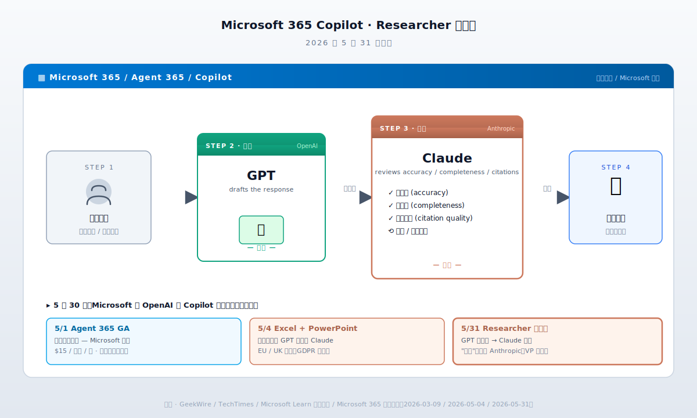

# Microsoft 5/31 让 Claude 给 GPT 挑错那天，OpenAI 最大股东的"多模型策略"话术正式结束

> **发布日期**：2026-06-02 | **分类**：AI产业深度

## 导语

2026 年 5 月 31 日，Microsoft 在 Microsoft 365 Copilot 里上线了 Researcher 智能体的新版本。具体工作流是这样的：

第一步：你问 Researcher 一个问题。
第二步：OpenAI 的 GPT 生成第一稿。
第三步：Anthropic 的 Claude 检查 GPT 生成的内容——查准确性、查完整性、查引用质量。
第四步：把检查后的版本作为最终答案给你。

简单讲：**OpenAI 写答案，Anthropic 改作业。**

这个产品的负责人是 Steve Gustavson——Microsoft Corporate VP，design and research。GeekWire 5 月 31 日那篇报道里，他亲口给出的解释是这样：

> "Claude has proven to be a fantastic synthesizer and sort of check on what the GPT models might be doing."
>
> Claude 被证明是一个很棒的综合器，也是对 GPT 模型可能在做的事的一种核对。

紧接着的下一句更直接：

> "The separation matters because evaluation is a different cognitive mode than generation."
>
> 这种分工很重要，因为评估和生成是两种不同的认知模式。

翻译一下："生成"是 OpenAI 的活，"评估"是 Anthropic 的活。Microsoft 不仅承认了这种分工，还把分工内置进了产品。

Microsoft 是 OpenAI 最大的外部投资人。从 2019 年到 2025 年累计投入超过 130 亿美元。Microsoft 用 Azure 给 OpenAI 跑训练。Microsoft 在 Bing 里第一个塞了 GPT-4。OpenAI 的所有商业突破，Microsoft 都参与了分账。

但 2026 年 5 月这一个月，Microsoft 同时做了三件事：

- **5 月 1 日**：Agent 365 全面可用，$15/用户/月——管理 AI 智能体的"控制平面"
- **5 月 4 日**：Anthropic Claude 成为 **Excel 和 PowerPoint 的默认模型**（Word 夏天跟上）
- **5 月 31 日**：Researcher 智能体让 Claude 给 GPT 校稿

这三件事没有一件是 OpenAI 的产品。一个月里，Microsoft 用 Anthropic 替换了三层关键基础设施：智能体管控层、生产力应用默认模型、研究工作流核稿岗位。

中文圈这一周的相关报道里，主流说法都是"Microsoft 走多模型路线""不再绑死 OpenAI""技术多样化的成熟选择"。听起来很合理。

但把 5/31 那个产品的工作流摆出来——**让对手公开 check 自家投资公司的工作**——再说"多模型策略"就有点像粉饰太平。

这篇拆 5 件事：

- 第一件，**5/31 那个产品的真实机制**——Researcher 智能体不是双模型并行，是 GPT 当工人 / Claude 当组长
- 第二件，**5 月那张时间表**——5/1 → 5/4 → 5/31，三件事是同一个剧本的三幕
- 第三件，**Microsoft 为什么要这么干**——Copilot 6M DAU、Claude 9M DAU、GitHub Copilot 被 Claude Code 抽走的客户
- 第四件，**OpenAI 同期在干什么**——$50B Amazon 独家云、$122B 融资、9 月 IPO，每一件都在把 Microsoft 推开
- 第五件，**6/12 这一天**——SPCX 上市、Cursor $60B 收购、Build 大会，三件事撞在同一周，会有人裸泳

---

<figure style="margin:0 0 36px 0;text-align:center"><figcaption style="margin-top:10px;font-size:13px;color:#64748b;font-style:italic">Microsoft 365 Researcher 智能体的工作流：OpenAI GPT 生成 → Anthropic Claude 评估 → 最终答案。5 月一个月内，Anthropic 接管了 Microsoft 365 三层关键基础设施。</figcaption></figure>

## 一、5/31 那个产品的真实机制

先把这个 Researcher 智能体拆开看。

Microsoft 365 Copilot 里的 Researcher，是 Copilot 体系里专门做"深度研究"那一类任务的智能体——比如你要写一份市场报告、做一次竞品分析、整理一篇行业综述。它和普通的 Copilot 聊天框不一样，它会自己去搜、自己去对照来源、自己去整合内容。

5 月 31 日上线的新版本里，Researcher 不再用单一模型。它的工作流被拆成两个阶段，分别交给两家公司的模型：

**阶段一：生成。** 调用 OpenAI 的 GPT 模型，针对用户的问题写一份草稿答案。

**阶段二：评估。** 把这份草稿喂给 Anthropic 的 Claude。Claude 的任务是：检查事实准确性（accuracy）、检查内容完整性（completeness）、检查引用质量（citation quality）。

Claude 评估完，如果觉得 OK，就把这份答案返回给用户；如果觉得不行，会触发 GPT 重写、再评估。

Microsoft Design 团队官方的说法是"分工"。但任何写过工作流文档的人都知道，分工里的两个角色不是平等关系。"评估方"永远是那个有最终决定权的角色——它能否决"生成方"的输出，能要求重做，能在引用、事实、口径上挑刺。

在内部组织语言里，这种关系叫"组长 / 工人"。

Steve Gustavson 那段话里用的词是"synthesizer"——综合器。但 synthesizer 不只是把别人的输出拼起来，它隐含的是"判断保留什么、删掉什么、修改什么"的权限。Gustavson 紧接着的另一句话更直白：

> "Evaluation is a different cognitive mode than generation."
>
> 评估和生成是两种不同的认知模式。

把这句话翻译成大白话：**生成是 GPT 的强项；评估是 Claude 的强项。我们用前者的强项做粗活，用后者的强项做细活。**

这种话由一家 OpenAI 投了 130 亿美元的公司高管，在 OpenAI 准备 IPO 的当口公开讲出来，是有公关代价的。Gustavson 在 LinkedIn 上发完这段话以后，OpenAI 内部一定是有人皱眉的。

但 Microsoft 还是讲了。

为什么 Microsoft 愿意付这个公关代价？

因为他们测过了。GeekWire 那篇报道里有一句：Microsoft 在"评估 single-model versus two-model configurations 的性能"过程中，发现 GPT + Claude 双模型工作流在准确性指标上**显著优于**单模型——不管是只用 GPT、还是只用 Claude——的版本。

具体数字没公开。但 Decrypt 跟了一篇产品测评，标题原文是《Microsoft Made GPT and Claude Work Together—And the Result Beats Every AI Research Tool Out There》。

"beats every AI research tool"——打败了所有 AI 研究工具。

如果这话只是营销，Microsoft 用不着拉竞品入伙；如果这话是真的，Microsoft 的产品决策只能是这个——管 OpenAI 投资人怎么想，先把产品做好。

产品决策赢了公关考量。这本身就是一件值得看一眼的事。

<<__AIWRITER_PLACEHOLDER__>>

---

## 二、5 月那张时间表：三件事是同一个剧本的三幕

把 5 月那一个月发生在 Microsoft 365 Copilot 上的事情按时间拉一下。

**5 月 1 日**——Agent 365 全面可用。

Agent 365 是 Microsoft 在 3 月 9 日 Wave 3 发布会上预告的产品，5 月 1 日正式 GA。这是一个管理"AI 智能体"的控制平面——给企业管理员一个地方，让他们能看到自己组织内部有多少 AI 智能体在跑、各自在干什么、用的什么模型、用了多少 token、是否符合合规要求。

定价：$15/用户/月。比 Microsoft 365 Copilot 那个 $30/用户/月便宜一半，但属于上层产品——你要先买 Copilot 才能买 Agent 365。

Agent 365 的卖点不是"我们自己有更强的智能体"，是"我们能管所有的智能体"——包括 OpenAI 的、Anthropic 的、Google 的、各种第三方的。这一招在产品定位上是非常关键的——Microsoft 把自己从"AI 模型供应商"切换到"AI 智能体管理平台"。这是托管经济的位置，不是技术经济的位置。

托管经济的位置，意味着**你管的客人越多元越好，绑死一家反而是缺陷**。

**5 月 4 日**——Anthropic Claude 成为 Excel 和 PowerPoint 里 Copilot 的**默认模型**。

注意"默认"两个字。这不是"用户可以选择 Claude"——那个早就有了。是"打开 Excel，按 Copilot，跳出来的那个 AI 助手默认就是 Claude，不是 GPT"。

Microsoft Learn 官方文档原文：

> "Starting May 4, 2026, Anthropic models are enabled by default for Copilot in Word, Excel, and PowerPoint, with data processing outside the EU Data Boundary."

Word 也在路上——夏天 GA。

UK 和 EU/EFTA 区域是个例外——那里 Claude 默认是关的，需要管理员手动开。原因是 Anthropic 模型的数据处理目前发生在 Microsoft EU Data Boundary 之外，触发 GDPR 和欧盟 AI Act 的合规问题。但这只是欧洲特殊情况。商业云的其余地区——美国、加拿大、亚太、中东、拉美——5/4 那天起，全部默认 Claude。

这件事的产品意义：Microsoft 365 一年订阅 4 亿用户。其中 Copilot 付费用户大约 6000 万（按 6M DAU 推算月活）。这 6000 万用户里的大部分，从 5/4 开始，他们点 Copilot 按钮看到的第一份输出，就是 Claude 写的、不是 GPT 写的。

OpenAI 在这 6000 万用户面前的可见性，从"默认"降级到"可选"。

**5 月 31 日**——Researcher 智能体的双模型工作流上线。前面讲过。

把这三件事按一个剧本看：

- 5/1 Agent 365：搭建一个"我们管所有模型"的舞台
- 5/4 Excel/PPT Claude 默认：在最有用户量的产品里，把 OpenAI 从默认拉下来
- 5/31 Claude check GPT：在最高端的智能体产品里，让 Anthropic 拿评估权

三步走完，Microsoft 在自家产品矩阵里给 OpenAI 留的位置是：**生成工人**——干粗活、被 review、不是默认、不在管控层。

这是一个月的事。

媒体当时的报道大多是逐条单点解读——5/1 那天分析 Agent 365 是个新品类、5/4 那天讨论 EU 数据合规、5/31 那天聊"多模型架构"是大势所趋。没人把这三件事在时间轴上摆成一行看。

按一行看是这样的：Microsoft 在 OpenAI 准备 IPO 前的最后一个月里，把自己产品体系里**所有原本属于 OpenAI 默认位置**的关键岗位——管控层、应用层、评估层——挨个切给了 Anthropic。

时间不是巧合。

<<__AIWRITER_PLACEHOLDER__>>

---

## 三、Microsoft 为什么要这么干——Copilot 6M DAU vs Claude 9M DAU

5 月那一系列动作不是 Microsoft 心血来潮。它是被一组数字逼出来的。

2026 年早期，Microsoft 365 Copilot 的全球日活用户大约是 6M。这个数字 Microsoft 公开过，也被 Fortune 5 月 21 日那篇《Microsoft lost its way in the AI race》引用过。同期，Anthropic Claude 的全球日活是 9M——Claude 的消费者产品在 2025 年下半年到 2026 年早期增速明显高于 Copilot。

这是同期增长曲线对比，不是绝对数对比。绝对数上 ChatGPT 还领先，但 ChatGPT 是消费者产品，Copilot 是企业产品，Claude 处于中间。在企业 AI 这一档，**Claude 已经追上 Microsoft Copilot 并超过**——这件事在 Satya Nadella 那里是一个红灯。

Fortune 那篇报道里有一段写得很直接——4 月，Nadella 在 Microsoft 内部启动了一个代号叫"Copilot code red"的项目。这个项目要做的事情，简单讲就是：**Copilot 不能再依赖单一模型供应商决定自己的产品质量上限。**

Code red 是 Microsoft 内部用得很重的词。上一次大规模用这个词是 2023 年初——ChatGPT 刚火、Bing 搜索面临 Google 反扑的那段时间，Nadella 内部叫了一次 code red，然后才有了 Bing + GPT-4 的整合。

这次 code red 的对象不是搜索，是 Copilot 这条线本身。

更具体的痛感来自 GitHub Copilot 那一块。GitHub Copilot 是 Microsoft 旗下、最早商业化的 AI 编码助手。2024-2025 年它一直是这个赛道里的事实标准。但 2026 年这一年，它的市场份额被两个东西抽走——一个是 Anthropic Claude Code，一个是 Cursor。

CNBC 6 月 1 日那篇《Microsoft and Google take on Anthropic and OpenAI in AI coding models》里有一段：

> "Cursor, the AI-powered code editor, has 300 employees and is one of the fastest-growing cloud software companies in history, going from $4 million to $2 billion in annualized revenue in just 18 months."

Cursor，AI 代码编辑器，300 名员工，从 400 万美元 ARR 涨到 20 亿美元 ARR，只用了 18 个月——这是有史以来最快的 SaaS 增长之一。

GitHub Copilot 那边在做什么？CNBC 同一篇报道说，Microsoft 在准备 Build 大会上推自家"内部 AI 编码模型"，要追 Claude 和 Codex。换句话说，Microsoft 也意识到只靠 OpenAI 的 GPT 在编码这一块跑不过 Claude，准备自己练。

到这里 Microsoft 的处境就清楚了：

- 消费侧 Copilot：6M DAU，被 Anthropic Claude 那 9M 超过
- 企业侧 365 Copilot：用户基础大，但产品体验在跑分上落后
- GitHub Copilot：原来的护城河被 Cursor + Claude Code 抽走
- 投资方 OpenAI：模型迭代速度被 Anthropic 反超（4 月 Opus 4.6、5 月 Opus 4.7、5/28 Opus 4.8 三档发版，OpenAI 同期没出新一代）

Microsoft 的反应是同时做两件事：

第一件，把 Anthropic 拉进自家产品矩阵——用 Claude 补 OpenAI 跑分上的短板。

第二件，自己练模型——为下一轮做准备，不能永远靠两家供应商。

第一件是 5 月那一连串动作。第二件是 6 月 Build 大会即将发布的"自家编码模型"。

两件事一起干，是 Nadella 那种典型的"现在止血 + 长期换血"策略。

5/31 那个 Researcher 智能体的工作流，是这个策略最公开、最具象的一帧。Microsoft 用这个产品同时告诉了三批受众：

- 告诉客户："我们的 Copilot 输出质量在涨"——靠 Claude 的评估能力补
- 告诉 Anthropic："你的 Claude 在我们家有正式产品位置"——稳住合作
- 告诉 OpenAI："你不再是我们家唯一的默认选项"——压价格、压条款

这三个信号都重要。但对 OpenAI 来说最难受的是第三条。**Microsoft 不再付出"独家溢价"。**

<<__AIWRITER_PLACEHOLDER__>>

---

## 四、OpenAI 同期在干什么——每一件都在把 Microsoft 推开

要看懂 Microsoft 5 月这一系列动作，得同时看 OpenAI 这一年在干什么。

2026 年 2 月，OpenAI 跟 Amazon 签了一份**最高 $50B 的战略合作协议**。协议核心条款：AWS 成为 OpenAI 企业平台 Frontier 的**独家第三方云分发渠道**。

注意"独家"和"第三方"两个词。它的意思是：OpenAI 的企业模型，从此通过 AWS 卖；Microsoft Azure 还能继续跑 OpenAI 模型，但不能作为"分发渠道"卖给第三方企业客户。

这一条直接冲击 Microsoft 的 OpenAI 业务。Microsoft 跟 OpenAI 原来的协议核心条款之一就是 Azure 作为 OpenAI 模型的独家云供应商。OpenAI + Amazon 这笔合同，绕开了"独家"那一条——OpenAI 的律师认为"分发"和"训练"是两件事，AWS 拿的是"分发"独家，没影响 Microsoft 的"训练"独家。

Microsoft 的律师不同意。

接下来两个月，Microsoft、OpenAI、AWS 三方律师在谈"什么能在哪里卖"。期间 Microsoft 多次"威胁起诉"。

4 月 27 日，三方达成新协议。TechCrunch 当天报道标题：《OpenAI ends Microsoft legal peril over its $50B Amazon deal》。新条款两个核心：

- **Microsoft 停止给 OpenAI 付收入分成**——以前是 Microsoft 把 Azure 跑 OpenAI 的部分收入分给 OpenAI，现在停了
- **OpenAI 继续给 Microsoft 付收入分成到 2030 年**——但加了上限（cap）

CNBC 同一天的标题：《OpenAI shakes up partnership with Microsoft, capping revenue share payments》——加了上限。

这个新协议的实质：Microsoft 从"OpenAI 的母体投资人 + 排他渠道商"，降级成"OpenAI 的众多渠道商之一"。换来的好处是 Microsoft 不再付分成、有了 cap、能跟其他模型供应商签独立合同。

OpenAI 那边换来的是 AWS 那个 $50B 的合作能继续推进、能在 Frontier 企业平台上卖给更多客户。

5 月，OpenAI 的动作更进一步：

- **5/19 附近**，OpenAI 把自己的 confidential S-1 递给了 SEC，IPO 在路上，目标 9 月
- **5 月底**，OpenAI 关了 $122B 的融资轮，投后 $852B，由 Amazon、Nvidia、SoftBank、Microsoft 锚定

注意最后那个投资人名单——Microsoft 还在里面，但已经只是"锚定投资人之一"，跟 Amazon、Nvidia、SoftBank 并列。不是 lead investor。

这个名单里的政治含义：Amazon 排第一。Nvidia 排第二。SoftBank 排第三。Microsoft 排第四。

OpenAI 五年前的 lead 是 Microsoft 一家、独占一档；今天的 lead 是四家并列、Amazon 排前面。

从 OpenAI 的角度，Microsoft 已经不是那个"无可替代"的合作伙伴了——Amazon 给的钱更多、AWS 给的算力更多、Nvidia 给的卡更优先。Microsoft 在 OpenAI 内部的话语权，是肉眼可见地在下降。

从 Microsoft 的角度，OpenAI 一年里发生的这些变化，每一件都在告诉它：**你给的 $14B 买不来 OpenAI 的忠诚。OpenAI 已经把自己重塑成一个面向所有云厂商、所有投资人的开放公司。**

两边都没错。两边都按自己的最优策略在走。

但两边的最优策略一旦展开，就出现了 5/31 那种产品形态——Microsoft 在自己的产品里，让 Anthropic 公开 check OpenAI 的工作。

OpenAI 在 IPO 前的最后冲刺阶段，最不愿意看到的就是这种公开信号——"Microsoft 在自家产品里不再把 OpenAI 当一等公民"——因为这种信号会被 SEC 审核员、二级市场投资人、bank 分析师反复咀嚼。

但 Microsoft 不会因为 OpenAI 要 IPO 就把这个产品推迟。商业逻辑面前没有"友谊"。

5/31 那个产品上线那天，OpenAI 没有公开回应。Sam Altman 那一天的 X 账号发的最后一条推，是关于他自己在练健身。

这种沉默本身就是一种回应。

<<__AIWRITER_PLACEHOLDER__>>

---

## 五、6/12 这一天——SPCX 上市 + Cursor 收购 + Build 大会撞同一周

5/31 那个产品上线之后，AI 行业最关键的下一个节点是 6 月 12 日。

6/12 这天，SpaceX 计划以 SPCX 代码在 Nasdaq 上市。目标估值 $1.75 万亿，目标募资 $75 亿。这是 2026 年最大的 IPO，也是有史以来最大的科技公司 IPO 之一。

SPCX 上市的同时，SpaceX 有一份"权利"协议要兑现——4 月 21 日 CNBC 独家报道、Fortune 4 月 22 日跟进的那笔合同：SpaceX 拿到的是**在 2026 年底之前以 $60B 收购 Cursor 的权利**，加上一个 $10B 的"如果不收购就支付的违约金"。

这份合同的时间窗：SPCX 上市完成后约 30 天，SpaceX 就要决定行不行使收购权。也就是——大约 7 月 12 日左右，SpaceX 要么花 $60B 把 Cursor 收下来，要么付 Cursor $10B 违约金继续做合作。

Cursor 是谁前面讲过——18 个月从 $4M ARR 涨到 $2B ARR 的那家公司。它在编码 AI 这一档已经超过了 GitHub Copilot。Cursor 自己的基础模型主要用的是 Anthropic Claude——Cursor 之所以能跑出来，相当一部分是因为它 wrap 了 Claude Code 的能力。

也就是说，6/12 那一天如果 SpaceX 顺利上市、7 月初顺利收购 Cursor，**Musk 旗下就同时有 SpaceXAI（Grok）+ Cursor 两条 AI 业务**——其中 Cursor 这一条是建立在 Anthropic 模型之上的。

Musk 6 月 12 日如果赢，意味着他在 IPO 估值锚里把"AI 业务"那一栏从 Grok 这一个被反复嘲笑的产品，扩成"Grok + Cursor"两条线。Cursor 这一条按 $60B 收购价 + $2B ARR 推算市盈率，至少是 30 倍——足够把 SpaceX 整体估值在 $1.75T 上面再撑高一档。

同一周，Microsoft Build 大会要开。CNBC 报道说 Microsoft 会在 Build 大会上发布**自家"内部 AI 编码模型"**，跟 Anthropic 和 OpenAI 的编码模型直接竞争。Google 在 5 月开发者大会上已经发过自家的——Microsoft 这次跟。

把这三件事拼在一起看 6/12 那一周：

- **SpaceX SPCX 上市** + 30 天后 Cursor 收购在路上
- **Microsoft Build** 发自家编码模型，对标 Claude Code + Codex
- **OpenAI 9 月 IPO** 的预演——市场会用 SPCX 上市表现给 OpenAI 估值定锚

三件事不是孤立的。它们一起描出 2026 年下半年 AI 行业的赛道格局——三家美国超大公司（Microsoft、Amazon、SpaceX/Musk）、两家顶级 AI 实验室（OpenAI、Anthropic）、两家代码 agent（Cursor、Cognition）——围绕"算力 + 模型 + 应用 + 渠道"四件事重新洗牌。

5/31 那个 Researcher 智能体的工作流上线，只是这场重新洗牌里很小的一帧。但它揭示的东西比它本身重要——**当一家估值 $4T 的 Microsoft，公开在自家产品里让对手公开 check 自家投资公司的输出**，整个行业"友谊 + 排他"的旧逻辑就正式被"按效果配置"的新逻辑替代了。

旧逻辑下，Microsoft 投了 OpenAI 就理所应当用 OpenAI、推 OpenAI、保护 OpenAI。

新逻辑下，Microsoft 投了 OpenAI 不影响它在自家产品里用 Claude check GPT、用 Claude 当默认、用 Claude 卡管控层。

旧逻辑下，"多模型策略"是一句礼貌的话术——大家都知道你最后还是用一家。

新逻辑下，"多模型策略"变成产品逻辑——你真的要从 5 家模型里挑出最适合每一个具体任务的那一个。

5/31 那一天，OpenAI 最大股东亲手让出去的，不是 OpenAI 的 GPT 在 Microsoft 365 里的位置——那个位置 GPT 还在，只是不在默认、不在评估层。OpenAI 最大股东亲手让出去的，是"我有最大股东可以保护我"这种话术。

OpenAI 接下来在 SEC 招股书上要写的故事，得自己写。Microsoft 这个封面纸，从 5 月 31 日开始就不再帮 OpenAI 撑着。

接下来 4 个月——5/31 → 9 月 IPO——OpenAI 要靠的，是 Amazon、SoftBank、Nvidia、自己 ChatGPT 的用户基数、自己 GPT-5 那一档模型在编码 / agent / 推理上的真实跑分。

不是 Microsoft。

Microsoft 这家公司在 OpenAI 的故事里，已经从"母体"降级成"渠道之一"。再过几个月，可能连"渠道之一"都谈不上——因为 Microsoft 的 Copilot 里，默认模型是 Anthropic 的，评估模型是 Anthropic 的，控制平面也是 Microsoft 自己的、不依赖任何一家模型。

OpenAI 在 Microsoft 这边的位置，被压缩成"生成工人"——干粗活的那个。

工人没有不可替代性。

5/31 那一天起，AI 行业进入了一个新阶段——没有谁的位置是"友谊保住的"。所有位置都要靠跑分、靠效果、靠产品配置去抢。

OpenAI 在 Microsoft 365 里的位置，是这套新规则下的第一个公开案例。

接下来还会有第二个、第三个。

就这。

---

## 数据来源

- [Microsoft Copilot Shifts to Agent Governance: Claude Checks GPT Work (TechTimes, 2026-05-31)](https://www.techtimes.com/articles/317458/20260531/microsoft-copilot-shifts-agent-governance-claude-checks-gpt-work-screen-agents-go-live.htm)
- [Microsoft 365 Copilot and the end of the single-model era in enterprise AI (GeekWire, 2026-05)](https://www.geekwire.com/2026/microsoft-365-copilot-and-the-end-of-the-single-model-era-in-enterprise-ai/)
- [Microsoft 365 Copilot's Researcher Agent Now Uses GPT and Claude (Petri, 2026-05)](https://petri.com/microsoft-365-copilot-researcher-gpt-claude/)
- [Microsoft Made GPT and Claude Work Together (Decrypt)](https://decrypt.co/362805/microsoft-gpt-claude-work-together-ai-research)
- [Copilot in Microsoft 365 apps with Anthropic models (Microsoft Learn 官方文档)](https://learn.microsoft.com/en-us/microsoft-365/copilot/copilot-anthropic-apps)
- [Anthropic Models for Copilot in Word, Excel, and PowerPoint on by Default (M365 Admin)](https://m365admin.handsontek.net/anthropic-models-copilot-word-excel-powerpoint-default/)
- [Powering Frontier Transformation with Copilot and agents (Microsoft 365 官方博客, 2026-03-09)](https://www.microsoft.com/en-us/microsoft-365/blog/2026/03/09/powering-frontier-transformation-with-copilot-and-agents/)
- [Microsoft and Google take on Anthropic and OpenAI in AI coding models (CNBC, 2026-06-01)](https://www.cnbc.com/2026/06/01/microsoft-and-google-take-on-anthropic-and-openai-in-ai-coding-models.html)
- [Microsoft lost its way in the AI race. Can Copilot get it back on course? (Fortune, 2026-05-21)](https://fortune.com/2026/05/21/microsoft-copilot-ai-openai-satya-nadella-gemini-claude/)
- ["Code Red": Microsoft CEO Satya Nadella overhauling Copilot (Motley Fool, 2026-04-18)](https://www.fool.com/investing/2026/04/18/code-red-microsoft-ceo-satya-nadella-copilot-buy/)
- [OpenAI ends Microsoft legal peril over $50B Amazon deal (TechCrunch, 2026-04-27)](https://techcrunch.com/2026/04/27/openai-ends-microsoft-legal-peril-over-its-50b-amazon-deal/)
- [OpenAI shakes up partnership with Microsoft, capping revenue share payments (CNBC, 2026-04-27)](https://www.cnbc.com/2026/04/27/openai-microsoft-partnership-revenue-cap.html)
- [SpaceX says it can buy Cursor for $60 billion (CNBC, 2026-04-21)](https://www.cnbc.com/2026/04/21/spacex-says-it-can-buy-cursor-later-this-year-for-60-billion-or-pay-10-billion-for-our-work-together.html)
- [SpaceX strikes $60 billion deal for Cursor (Fortune, 2026-04-22)](https://fortune.com/2026/04/22/spacex-strikes-60-billion-deal-cursor/)
- [Microsoft Adds More Copilots (Spyglass)](https://spyglass.org/microsoft-copilot-copilot-copilot/)
- [Steve Gustavson LinkedIn post on Copilot Cowork](https://www.linkedin.com/posts/stevegustavson_copilotcowork-activity-7437952108915494912-Hoch)
