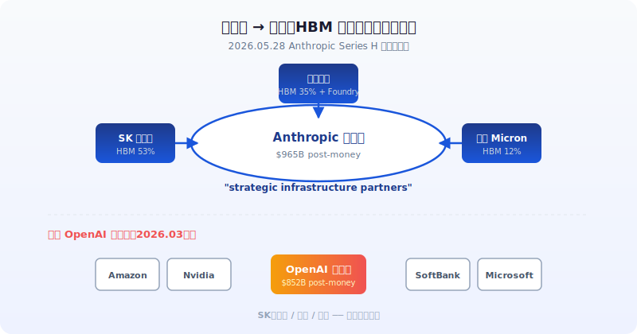
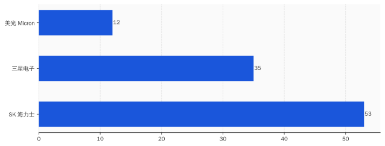
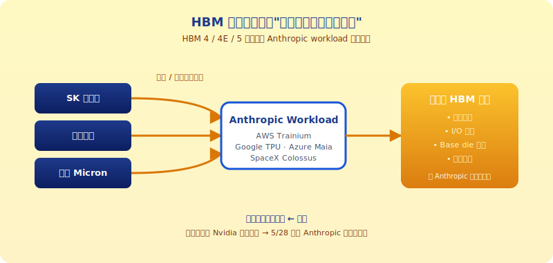
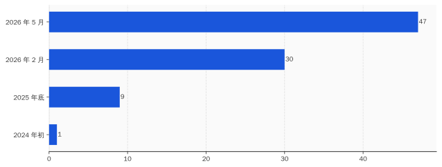

# 三星和 SK 海力士这周进了 Anthropic 股东会，但他们买的不是 Anthropic

> **发布日期**：2026-06-03 | **分类**：AI产业深度

## 导语

2026 年 5 月 28 日，Anthropic 关了 H 轮，金额 $65B，投后估值 $965B。

第二天的中文圈头条是这样写的：「Anthropic 估值超越 OpenAI」「Claude 终于翻盘」「AI 行业老二位置易主」。

听上去像是一个挺过瘾的剧本——憋了三年的二号位选手终于干翻一号位。但这种叙事有个问题：它解释不了 Anthropic 官方公告里被放在第二段的一行字。

那行字是这样写的：

> "Micron, Samsung, and SK hynix joined as **strategic infrastructure partners**, whose technologies play a key role in the global supply of memory, storage, and logic chips."

翻译过来：美光、三星、SK 海力士以**战略基础设施伙伴**身份进入了这一轮。三家公司供应了全世界 95% 以上的 HBM——也就是 AI 推理跑起来必须用的高带宽内存。

这是这三家公司**第一次同时**以股东身份进入一家 AI 公司。

Anthropic 没说他们是"财务投资人"，也没说他们是"战略投资人"，用的词是"strategic **infrastructure** partners"——基础设施伙伴。这个措辞在 H 轮的官方公告里只有这三家拿到。剩下那一长串名字——Altimeter、Dragoneer、Sequoia、Capital Group、Coatue、D1、Fidelity、Blackstone、Brookfield——一个一个全是基金，统称"投资人"。

放在一起看是这样的：

> 主桌坐着 Sequoia、Altimeter 这些基金，他们出钱。
>
> 主桌**旁边那张桌子**坐着三星、SK 海力士、美光，他们出芯片。
>
> Anthropic 给他们两张同样规格的椅子。

中文圈关于这一周这件事的报道，主要在算估值差——$965B vs $852B，Anthropic 比 OpenAI 多 $113B，「老二翻身」「OpenAI 危」之类的标题排了一天。

但把官方公告往下翻三段，把投资人名单里这三家的位置摆出来——这周的真正剧本不是"Anthropic 估值超 OpenAI"。

真正的剧本是：**HBM 三巨头当了三年 AI 公司的供应商，5 月 28 日这天，他们决定也当股东。** 而且是同时进同一家。

这件事过去没发生过。

为什么是这周发生？HBM 已经卖光了——SK 海力士自己说 2026 年产能"essentially sold out"，2027 年都紧张。明明不愁出货的人，干嘛掏真金白银进股东会？

这篇拆五件事：

- 第一件，**5 月 28 日那天 Anthropic 公告里"strategic infrastructure partners"这个措辞，是给谁看的**
- 第二件，**三家 HBM 厂商不愁卖货为什么还要入股**——他们买的不是 Anthropic，是下一代规格的设计话语权
- 第三件，**Anthropic 半年从 $9B 涨到 $47B run rate**——HBM 厂商敢押注是因为这条线跑得动
- 第四件，**OpenAI 那笔 Amazon $50B 里有 $35B 卡在 IPO/AGI 触发条款上**——Anthropic 的 $65B 是真到账，差就差在这里
- 第五件，**AI 供应链的话语权这周开始倒灌**——Nvidia 单点垄断 GPU 的格局有了第一个口子，开口是从上游往下游打的

---

## 一、"Strategic Infrastructure Partners"这个措辞，是给谁看的

5 月 28 日那天，Anthropic 在自家 blog 上发了一篇标题极其朴素的公告——《Anthropic raises $65B in Series H funding at $965B post-money valuation》。

公告整体语气克制。除了估值这个数字本身，叙事节奏几乎没有变化。但读到第二段，措辞有一处不太一样的地方。

公告里把投资人分成了三组写：

第一组是**领投基金**——Altimeter、Dragoneer、Greenoaks、Sequoia。这一组拿到的描述是「co-led」。

第二组是**其他金融投资人**——Capital Group、Coatue、D1 Capital、GIC、ICONIQ、XN、Baillie Gifford、Blackstone、Brookfield、D.E. Shaw、DST Global、Fidelity。这一组拿到的描述是「joined the round」。

第三组就一行字。原文如下：

> "Micron, Samsung, and SK hynix joined as **strategic infrastructure partners**, whose technologies play a key role in the global supply of memory, storage, and logic chips."

这一组只有三个名字。措辞从「投资人」升级成「strategic infrastructure partners」——战略基础设施伙伴。

差别在哪？「投资人」的意思是：你出钱，我给你股，回报算 IRR。「strategic infrastructure partner」的意思是：你出钱**只是**起点，后面我们还有别的事要一起做，这个事跟你的主业有关。

Anthropic 在同一段后面给了一句兜底解释——「这些关系会帮我们 reliably scale compute capacity at the pace our customers need」（按客户需要的节奏可靠地扩展算力容量）。

翻译一下：我们的算力扩张和你们的产能扩张要绑在一起。

这个措辞值得拆开看。因为在过去三年的 AI 公司公告里，「strategic infrastructure partner」这个词的位置基本上是给云厂商和数据中心运营商留的——AWS、Microsoft Azure、Google Cloud、Oracle、CoreWeave 这种公司。从来没有 HBM/DRAM 厂商拿过这个位置。

5 月 28 日是第一次。

而且不是某一家拿，是 Micron、Samsung、SK 海力士**三家同时**拿。这三家加起来供应了全世界几乎全部的 HBM——2025 年三季度 SK 海力士 53% 市场份额，三星 35%，美光 12% 左右。Anthropic 一次把这三家全请到了同一个公告的同一段。

中文报道这一周大多在写 OpenAI vs Anthropic 的估值对比——$852B vs $965B、谁是老大谁是老二、谁会更早 IPO。这是一个挺好讲的故事。

但有个细节没人提：**OpenAI 那 $852B 的估值后面，没有 Samsung、没有 SK 海力士、没有 Micron**。OpenAI 3 月 31 日关的那一轮 $122B，主要投资人是 Amazon、Nvidia、SoftBank、Microsoft——四家分别代表云、GPU、资本、办公生态。没有内存厂商。

两个月差。这两个月里发生了什么？

5 月 28 日那天，HBM 三巨头集体决定：之前那种「我卖货你买货」的关系不够用了，得换一种关系。

新关系叫「strategic infrastructure partner」。

---

## 二、HBM 已经卖光了，三家厂商为什么还要入股

正常逻辑下，供应商主动给客户掏钱这种事不应该发生。

正常逻辑是这样的：客户给供应商钱（订单），供应商给客户货（芯片）。供应商如果手头紧，可能会接受客户预付款；客户如果出货紧，可能会主动锁定供应商产能。**但供应商主动出钱买客户股权，只在一种情况下发生——这个客户能给你的东西，比订单更重要。**

对 HBM 三巨头来说，订单已经不缺。

SK 海力士 2025 年三季度财报会议上自己说的原话——HBM、DRAM、NAND 三条线 2026 年产能 essentially sold out（基本卖完）。三星这边韩国《电子时报》5 月那一篇报道——三星 2026 年要扩产能 50%，但 HBM4 的高端档已经被预订到 2027 年下半年。美光 2026 财年的 guidance 是 HBM 收入贡献从 12% 涨到 35%——还是供不应求。

Tom's Hardware 5 月有一篇报道，标题直白：《Samsung and SK Hynix warn AI-driven memory shortages could last until 2027 and beyond, as HBM demand explodes — customers already reserving supply years ahead》。客户提前几年预订产能——这才是 2026 年 HBM 厂商的日常处境。

这种处境下，HBM 厂商不需要任何"客户关系拓展"。他们需要的不是订单。

那他们需要什么？

需要的是**下一代 HBM 的设计话语权**。

HBM 这种内存的特殊性在于：它不像普通 DDR 内存那样有一个全行业统一的规格。HBM 的下一代——HBM4 和正在路线图上的 HBM5——每一代的细节规格（堆栈层数、I/O 配置、base die 上的逻辑电路、热设计点、定制接口）都需要跟 AI 芯片设计方一起锁定。

HBM4 base die 上能集成多少逻辑电路？HBM5 的 I/O 怎么配？这些规格不是 JEDEC 标准委员会拍板就完事的——主要由谁先和大客户达成 spec 协议来定。CES 2026 那场 HBM4 路线图发布会上，SK 海力士和三星都在抢 HBM4E 的客户 spec 锁定。

简单讲：HBM4 / HBM5 的规格是「客户定制」的。**谁能在规格制定阶段被 AI 公司当成深度合作伙伴，谁就能在下一代竞争里占先。**

之前这个位置是 Nvidia 和 Google 的——HBM 厂商和 Nvidia 共同定义了 HBM3、HBM3e 跑在 H100/H200/B200 上的规格。Google 那边跟 SK 海力士也有 HBM 定制项目，用于 TPU。

但 2026 年的变化是：跑 inference（推理）的大头不在 Nvidia 一家手里了。Anthropic 的算力分布在 AWS Trainium、Google TPU、SpaceX Colossus、Microsoft Maia 200——一句话，分散在四套不同的硬件栈上。

哪一套硬件栈用什么 HBM 规格——按谁的 workload 来调？

按 Anthropic 的 workload 来调。因为 Anthropic 是这四套栈上**最大的推理负载方**。Claude API 单 5 月就跑出 $47B run rate 的推理量。

这就解释了为什么 HBM 三家要进 Anthropic 的股东会——

进了股东会，**就有了看 Anthropic 推理负载数据的资格**。

看到推理负载数据，就能根据这个数据反向设计下一代 HBM 规格——做 base die 集成什么逻辑、做什么 I/O 配置、堆栈怎么排、散热怎么调。这套数据是 HBM4E / HBM5 规格定型的基础。

而且最有意思的一点——同一份 Anthropic 推理负载数据，Micron、Samsung、SK 海力士三家**同时**看。

这意味着 Anthropic 在下一代 HBM 规格的制定上，从「按供应商各自路线图被动接受」升级成了「三家供应商按 Anthropic 一家的 workload 趋同优化」。

供应商 → 股东，话语权倒过来了。HBM 厂商是出钱的那个，但他们买到的是**未来五年下一代内存规格设计的入场券**。

Samsung 那边还多一层心思。三星 Electronics 是 HBM 三巨头里唯一一家有 foundry（晶圆代工）业务的。SK 海力士和美光都没有 foundry。

这意味着 Samsung 进 Anthropic 股东会之后，下一步谈的不只是 HBM 设计，还可能是 Anthropic 的**自研推理加速芯片代工**——如果 Anthropic 像 OpenAI 那样在 2026 年下半年推出自家 Titan 类芯片，Samsung 2nm 工艺的 foundry 是排在 TSMC 之外最现实的选项。

Anthropic 公告里那行字——「play a key role in the global supply of memory, **storage**, and **logic chips**」——"logic chips"（逻辑芯片）这个词出现在公告里很值得注意。Samsung foundry 就是做 logic chips 的。这不是顺手写一笔，是给 Samsung 留了门。

把这一节合起来看：三家 HBM 巨头不愁卖货，进 Anthropic 股东会买的不是订单。他们买的是**下一代 HBM 规格的设计话语权**，附带 Samsung 抢 Anthropic foundry 订单的入场券。

对 Anthropic 来说，付出的是几个百分点的股权。换回来的是把上游内存供应链的话语权**反向收编**到自己手里。

这是过去三年 AI 公司没干成的事。

---

## 三、半年 $9B → $47B：HBM 厂商敢押注，是因为这条线确实跑得动

HBM 三巨头不是慈善家。他们押注 Anthropic，前提是 Anthropic 这条线**真的能跑出量**——跑出来的推理负载，才能真正成为他们做下一代规格的数据源。

那 Anthropic 这条线到底跑得有多快？

公开数字摆一摆：

- **2024 年初**：Anthropic ARR 约 $1B
- **2025 年底**：run-rate 约 $9B
- **2026 年 2 月**：run-rate 约 $30B
- **2026 年 5 月**：run-rate 约 $47B

半年时间，从 $9B 到 $47B，涨了 5 倍多。如果按更长周期算——2024 年初 $1B 到 2026 年 5 月 $47B，**两年半涨了 47 倍**。这种增长曲线在 SaaS 历史里基本没有可比对象。

那这 $47B 怎么涨上来的？拆产品看：

- **Claude API**：占大头，主要靠企业客户跑推理工作负载
- **Claude Code**：单一产品 $2.5B ARR，2026 年初这个数字还是 $1B 出头——半年又翻了一倍多
- **Claude 消费者**（chat、Pro 订阅）：占比相对小，不是增长主引擎

Claude Code 这一个产品 $2.5B ARR——比绝大多数已上市 SaaS 公司全公司营收还高。9 个月时间从 0 干到这个量级。

更有意思的是另一组数字——客户里**单年消费超过 $1M 美元的有 1000+ 家**。两个月之前这个数字是 500+。两个月翻一倍。

这种增长不是 viral 消费品那种"用户量涨一下子"。这种增长是企业 B 端订单一笔一笔签出来的——每一笔都是 procurement、legal、security review 全套流程之后才进系统。

也就是说：Anthropic 5 月份的 $47B run rate，是真有人在按月付的，不是融资轮估值倒推的"市梦率"。

这个营收结构有一个副作用——Anthropic 的**公司性质在变**。

S-1 申报前后，TechTimes 6 月 1 日那篇报道里有一组数据被翻出来：5 月底 Anthropic 公开招聘页面上，**Sales 类岗位 72 个，AI Research 类岗位 67 个**——销售岗第一次多于研究岗。

Anthropic 注册成立时的对外身份是「AI 安全研究实验室」。Founders Letter 里写过一堆关于"安全研究使命"的内容。但 2026 年 5 月底这一刻，Anthropic 招的人里销售比研究员多。

这种对比放在 IPO 申报背景下不是巧合。

Anthropic 在 6 月 1 日把 confidential S-1 递给 SEC 之前，必须先证明自己**是一个能持续印钱的商业实体**——不只是"前沿 AI 实验室"。公司性质叙事从"研究"切到"企业 SaaS"，是 IPO 估值能不能撑住的前提条件。

回到 HBM 三家为什么敢押注。

他们看的不是 Anthropic 的「模型有多好」——这个判断他们没能力做。他们看的是两组数：

第一组：**run-rate $47B、增速半年 5 倍、企业占 80%、$1M+ 客户两月翻倍**——商业实体属性已经稳了。

第二组：**Claude API 的推理 workload 形状**——AWS Trainium、Google TPU、Azure Maia、SpaceX Colossus 四套硬件栈上每天跑多少 tokens、用多少 HBM 带宽、热点分布在哪。这套数据才是他们做下一代 HBM 规格的真正素材。

第一组数据让他们敢付钱。第二组数据是他们付钱要换的东西。

这两组数据齐了——HBM 三巨头就掏支票了。这一笔是 **2026 年最理性的几笔战略投资之一**。Anthropic 给的对价是 strategic infrastructure partner 这个位置；他们给的对价是 H 轮里的真金白银 + 未来产能定向倾斜。

到这里 5 月 28 日那个 H 轮的故事就拼齐了。它不是"Anthropic 估值超 OpenAI"——估值只是结果。它是 Anthropic 在 IPO 申报前的最后两周，**给上游内存供应链发了三张邀请函**，三家全收了。

---

## 四、OpenAI 的 $35B 卡在 IPO/AGI 条款里，Anthropic 的 $65B 是真到账

对比 OpenAI 这边的处境，两边的差距才看得清楚。

OpenAI 3 月 31 日关了 $122B 融资，估值 $852B。这是有史以来最大的一笔私募轮。

但 $122B 里有一笔比较麻烦——Amazon 投的 $50B。

这 $50B 的结构 GeekWire 4 月底有一篇分析专门拆过。SEC 申报文件原文里写得很清楚：

> "Amazon's $50 billion is structured as $15 billion of immediate capital and $35 billion of conditional commitments, triggered upon either (a) an OpenAI initial public offering, or (b) achievement of an [REDACTED] milestone, by December 31, 2028."

翻译：Amazon 给 OpenAI 的 $50B，先付 $15B；剩下 $35B 卡在两个触发条件——OpenAI 在 2028 年 12 月 31 日前完成 IPO，或者达到一个"被涂黑"的里程碑。

那个被涂黑的里程碑，The Verge 等多家媒体的猜测是 AGI——人工通用智能。

也就是说，**Amazon 给 OpenAI 这 $35B 加了两个条件——按时上市，或者证明 AGI。**

两个条件都很硬。按时上市意味着 OpenAI 必须在 2028 年底之前完成 IPO，不能拖。证明 AGI 这事更难——AGI 定义是什么、谁来定义、什么算"达到"——SEC 文件里这部分被涂黑，意味着 OpenAI 和 Amazon 两家律师当时没谈出统一文本，干脆涂掉。

这条款翻译得更直白一点：**Amazon 不完全相信 OpenAI 能按节奏跑出来，所以 $50B 里大头先保留触发权。**

这条款一出，OpenAI 的处境就变得有点紧——必须在 2028 年底之前把 IPO 跑完。但 IPO 时间窗口不是说定就定，市场情绪、监管节奏、宏观利率一个变量都能把它推迟。

所以 OpenAI 5 月份开始非常着急——CNBC 和 WSJ 5 月 19 日附近同时报道，OpenAI 把 confidential S-1 提交给了 SEC，目标 9 月 IPO，估值目标 $1 万亿。

这个时间表急到什么程度？从 5 月递 S-1 到 9 月公开上市，正常流程 SEC review 加 roadshow 需要 4-6 个月——OpenAI 这次走的是最快的那一档。

而 Anthropic 这边的处境是另一种节奏：

- **5 月 28 日**：H 轮 $65B 全部到账（$50B 新增 + $15B 之前承诺兑现）
- **6 月 1 日**：confidential S-1 递给 SEC
- **目标 10 月**：NASDAQ 挂牌

Anthropic 比 OpenAI 晚两周递 S-1，但晚一个月挂牌——9 月 OpenAI、10 月 Anthropic。

两家时间窗口贴这么近不是巧合。Anthropic 这边的安排是有意的——**不要太晚，但要紧贴 OpenAI 之后**。

OpenAI 9 月上的话，会先把市场情绪用一次。如果 OpenAI 上得好，Anthropic 10 月接着上能享受余温；如果 OpenAI 上不动，Anthropic 自己可以推迟。两个窗口之间留了一个月的观察期。

而且 Anthropic 这次 H 轮的钱**是真到账**——$65B 不分阶段、不附条件、不卡 IPO 触发。Sequoia 和 Altimeter 是直接打钱进来的；Samsung、SK 海力士、美光是冲着下一代 HBM 设计权进来的。没有任何一笔卡在"未来某件事是否发生"上。

这跟 OpenAI 的 $35B 触发条款是质的差异。

Amazon 那 $35B 是"如果你按时 IPO，钱才到"——是一个**对赌条款**。Anthropic 这 $65B 是"钱已经到，我们现在谈下一步合作怎么深化"——是一个**已结算的合作起点**。

把这件事和上一节的 run rate 数字合起来看：**Anthropic 不需要 IPO 救命，但必须抢在 OpenAI 之后立刻上**——目的不是融资，是把 H 轮的估值锚定到公开市场，让 $965B 成为 benchmark。

而 OpenAI 9 月那次 IPO——是真有救命压力的。Amazon 那笔 $35B 必须在 2028 年底之前触发完成，不然就成了账面浮值。9 月不行，12 月还得再来一次。

供应链这一端，OpenAI 也没拿到 Samsung / SK 海力士 / Micron 的直接投资。OpenAI 那边走的是另一条路——自己设计 Titan 类芯片，向 Samsung foundry 下订单。但下订单只是"客户身份"，没有"strategic infrastructure partner"那种长期 spec 协议。

两家公司处境就这样彻底拉开了。

---

## 五、AI 供应链话语权这周开始倒灌

把这五件事缝成一行，5 月 28 日那一周的真正意义就出来了——

**过去三年 AI 产业的供应链结构是一个 V 字形**：

- 顶端是 Nvidia，单点垄断 GPU。所有 AI 公司在它面前排队。
- 中段是 HBM 三巨头，被 Nvidia 锁定规格，按 Nvidia 节奏生产。
- 末端是 AI 公司——OpenAI、Anthropic、Google DeepMind、xAI——抢 Nvidia 的 GPU 产能配额。Nvidia 给谁多少卡，谁这一年能干多少事。

这个结构里 Nvidia 是定价权的唯一持有方。HBM 三巨头是供货商，AI 公司是排队的客户。

5 月 28 日开始，这个结构出现了第一个口子——

**Anthropic 直接把 HBM 三家拉进股东会，绕过 Nvidia 这一层，开始和上游内存厂商共同定义下一代规格。**

注意这件事不是"Anthropic 不用 Nvidia GPU 了"——Anthropic 当然还在用 Nvidia 的 GPU，AWS Trainium、Google TPU、SpaceX Colossus 上跑的训练和推理任务一部分仍然依赖 Nvidia 体系。

但**下一代 HBM 怎么设计**这件事，从「Nvidia 一家说了算」开始变成「Anthropic 也有发言权」。

这是 AI 产业过去三年没发生过的事。

类比一下——这相当于汽车行业里，特斯拉直接进了 LG 化学、宁德时代、松下三家电池厂的股东会，开始和这三家共同定义下一代锂电池的化学体系、能量密度、热管理曲线。本来定义权在博世这种 Tier 1 供应商手里，现在被整车厂直接抓了上去。

汽车行业从博世主导到特斯拉主导，花了 10 年。

AI 产业的这个口子，从 Nvidia 主导到 Anthropic 在内存这一层抓住部分话语权，**5 月 28 日**一周之内完成。

而且这只是开始。可以预见的是：

- Google 一定会跟进——Google 自己有 TPU，跟 SK 海力士在 HBM 上有定制项目，下一步可能也会让 SK 海力士拿一定股权交换更深的 spec 协议。
- Meta 也得跟进——Llama 5 / Llama 6 训练推理负载在 2026 下半年还要再涨一档，靠和 Nvidia 单点合作已经不够。
- xAI / SpaceXAI 这边，马斯克的做事风格本来就喜欢把上游绑死，Colossus 2 / Colossus 3 后面应该会用更激进的供应链锁定方式。

OpenAI 那边短期内难跟进——它的资本运作精力全在 9 月那次 IPO 上，估值能不能撑到 $1 万亿是这一年的全部主题。等 IPO 完成、半年后才有可能腾出手来重新设计供应链。

那半年时间里，**Anthropic 和 HBM 三家会一起把 HBM4E、HBM5 的设计规格往 Anthropic workload 的方向倾斜一格**。这一格的差距，在 2027 年开始体现成"同样 die size，跑 Claude inference 比跑 GPT inference 快 10-20%"。

10-20% 看起来不多。但在万亿 token / 天的推理量级上，这是数十亿美元的电力账单差。

那时候大家才会回头看 5 月 28 日这一周。

5 月 28 日不是"Anthropic 估值超 OpenAI"。

5 月 28 日是 **HBM 三家从供应商变股东、AI 公司从被动接 GPU 配额到反向定义内存规格**——AI 产业供应链话语权第一次开始倒灌的那一周。

---

## 数据来源

- [Anthropic raises $65B in Series H funding at $965B post-money valuation - Anthropic Official Blog](https://www.anthropic.com/news/series-h)
- [Anthropic confidentially submits draft S-1 to the SEC - Anthropic Official Blog](https://www.anthropic.com/news/confidential-draft-s1-sec)
- [Samsung, SK hynix invest in Anthropic as AI chip demand surges - Korea Herald](https://www.koreaherald.com/article/10758856)
- [Anthropic $965B Round Lifts Samsung, SK Hynix, Micron - Eastern Herald](https://easternherald.com/2026/05/29/anthropic-965-billion-samsung-sk-hynix-micron-memory-chips/)
- [Anthropic raises $65 billion, nears $1T valuation ahead of IPO - TechCrunch](https://techcrunch.com/2026/05/28/anthropic-raises-65-billion-nears-1t-valuation-ahead-of-ipo/)
- [Anthropic confidentially files IPO prospectus with SEC - CNBC](https://www.cnbc.com/2026/06/01/anthropic-ipo-s1-prospectus.html)
- [Anthropic confidentially files its S-1 first — but the IPO race with OpenAI is just beginning - Fortune](https://fortune.com/2026/06/01/anthropic-s1-confidential/)
- [Anthropic Enterprise Hiring Tops Research as IPO Filing Reveals Commercial Shift - TechTimes](https://www.techtimes.com/articles/317530/20260601/anthropic-enterprise-hiring-tops-research-ipo-filing-reveals-commercial-shift.htm)
- [Filings: How Amazon's $50B OpenAI deal actually works - GeekWire](https://www.geekwire.com/2026/filings-how-amazons-50b-openai-deal-actually-works-and-what-theyre-keeping-secret/)
- [OpenAI Valued at $852 Billion After Backing From Amazon, Nvidia, SoftBank - Bloomberg](https://www.bloomberg.com/news/articles/2026-03-31/openai-valued-at-852-billion-after-completing-122-billion-round)
- [Samsung and SK Hynix warn AI-driven memory shortages could last until 2027 and beyond - Tom's Hardware](https://www.tomshardware.com/tech-industry/artificial-intelligence/samsung-and-sk-hynix-warn-ai-driven-memory-shortages-could-last-until-2027-and-beyond-as-hbm-demand-explodes-customers-already-reserving-supply-years-ahead-while-the-wider-dram-market-begins-to-tighten)
- [Claude Code Is Doing $2.5B in Annualized Revenue — Just from the Terminal Tool - MindStudio](https://www.mindstudio.ai/blog/claude-code-2-5-billion-annualized-revenue-terminal-tool)
- [The State of HBM4 Chronicled at CES 2026 - EE Times](https://www.eetimes.com/the-state-of-hbm4-chronicled-at-ces-2026/)
- [Samsung, SK hynix Join Anthropic Funding Round - The Elec Inc.](https://www.thelec.net/news/articleView.html?idxno=10894)
