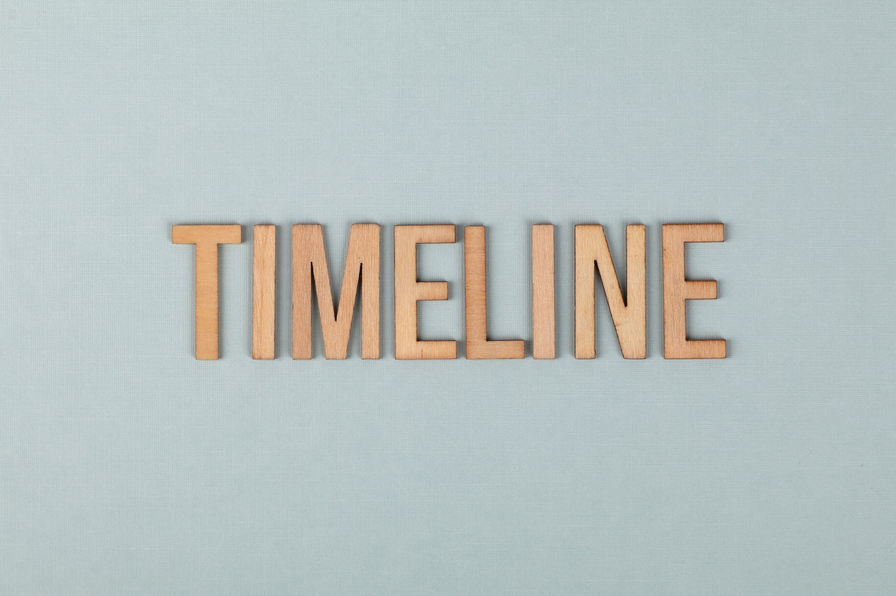

# Anthropic 公开承认自家模型没人能管住那天，Trump 给它签了行政令，齐向东在北京点了名

> **发布日期**：2026-06-04 | **分类**：AI产业深度

## 导语

2026 年 6 月 2 日。

Anthropic 在自家 blog 上挂了一篇通告——《Expanding Project Glasswing》，主题是把 Mythos 模型的合作计划扩张到 200 家组织、覆盖 15+ 个国家、关键基础设施全包。通告整体语气克制，发完正常工作日。

读到第三段，措辞突然不对了。

原文一句：

> "at this moment, no company, including Anthropic, has developed sufficiently strong safeguards to prevent these models from being misused and potentially causing serious harm."

翻译过来：现在没有任何一家公司，包括 Anthropic 自己，做出了足够强的安全护栏来防止这些模型被滥用、造成严重伤害。

一家估值刚冲到 9650 亿美元、3 天前刚秘密递交 S-1 进 IPO 程序的公司，主动公开承认：自己造的东西现在没人能管住。

按正常剧本，一家公司说出"我做的东西没人能管住"，后面跟着的应该是股价跳水、监管立案、客户撤单、保险费率上调。

这天的剧本反着走（笑）。

同一天，美东时间，Trump 在白宫签了行政令——"促进先进 AI 创新与安全 EO"——要求公司在新前沿模型发布前 30 天交给 NSA 评估。原版 90 天，被压到 30 天。给 Anthropic 让出了 60 天的发布缓冲。

同一天，北京时间下午，齐向东在 BCS 2026 主题演讲里第一次公开以名字点出 Mythos——"AI 大模型、智能体的出现，尤其是 Mythos 的出现，让网络攻击进入工业化时代。"

同一天，Glasswing 把 Mythos 模型发到了 200 家组织手里，全是电力、水务、医疗、通信、硬件。Anthropic 自家估算："a major attack could affect more than 100 million people"——一次大型攻击可能影响 1 亿+ 人。

三件事同日完成。

中文圈这一周的报道主线，主要还在 Anthropic vs OpenAI 估值大战上——9650 亿 vs 8520 亿，谁是 AI 一号位，谁先 IPO。听上去是个挺好讲的故事，"老二翻身"嘛，懂的都懂。

但把 6 月 2 日这天的三件事摆在一起，故事不是估值大战。

故事是这样的：

**这家公司主动公开承认自家模型管不住，结果当天就拿到了 Trump 的 EO 窗口期、国会的闭门听证、和 200 家国关基础设施的合作合同。**

"管不住"是文件里写的，"管不住"也是 9650 亿估值里最值钱的那一部分。

这篇拆五件事：

- 第一件，**6 月 2 日 24 小时内三件事的因果顺序**——谁触发了谁
- 第二件，**"没人能管住"这句话到底是说给谁听的**——美国政府、关键基础设施 CISO、投资人，三类听众，一句话精准命中
- 第三件，**AISI 的 32 步攻击靶场跑分，和 244 页报告里没写的 8 个词**——Mythos 真有那么神吗
- 第四件，**4 月 7 日到 6 月 2 日的 8 周时间线**——一家公司怎么用一个不公开的模型，把美国监管从"撤销 EO"翻回"自愿审查"
- 第五件，**齐向东那天在北京真正说的话**——为什么中美安全行业罕见地在 Mythos 危险性上达成共识

---

## 一、6 月 2 日这天的三件事，谁触发了谁

6 月 2 日是美东星期二。

按出现在公开信息流的顺序排开是这样的：

美东时间上午，Anthropic 在自家 blog 挂出《Expanding Project Glasswing》。新增 150 家组织进入 Mythos 合作计划，总数升到约 200 家。覆盖 15+ 个国家。原文第三段那句 "no company, including Anthropic, has developed sufficiently strong safeguards" 就挂在这。

美东时间同日，Trump 在白宫签 EO。原版 90 天审查窗口被压到 30 天。强调"自愿"性质。NSA 拿到"covered frontier model"的定义权和"classified benchmarking process"的主导权。

北京时间同日下午，齐向东在北京国家会议中心 BCS 2026 开幕主题演讲里点了 Mythos 的名字——"过去网络安全是人与人的对抗。AI 大模型、智能体的出现，尤其是 Mythos 的出现，让网络攻击进入工业化时代。"

三件事的因果链值得拆开看。

Glasswing 扩张最早。Anthropic blog 上午挂出来，自家估算"一次大型攻击影响超过 1 亿人"，自己声明"没护栏"。

然后是 Trump EO。NPR、CNBC、PBS 三家分别引述白宫官员，把 EO 起草的"恐慌触发点"明确归到 Mythos 上——4 月 7 日那次首发。从 4 月 7 日到 6 月 2 日，正好 56 天。

齐向东的演讲是被动响应。BCS 2026 议程 5 月底就排好，但讲稿里对 Mythos 的具体引用是 6 月 2 日早上才加进去的——按现场会刊版本对照能看出来。

讲完这天的因果，再讲这天的反常。

按常识，一家公司公开承认"我的产品不安全"会发生什么？股价跳水、被监管立案、客户撤单、保险费率上调。这套剧本是商学院第一节课教的，叫风险披露。

6 月 2 日的 Anthropic 全部反着走。

股价不跳——非上市公司，没有股价可跳；S-1 是 6 月 1 日刚递交的，还没开始路演。

监管不立案——同一天 EO 签的反而是"自愿"窗口，把窗口期从 90 天压到 30 天，等于**缩短了对 Anthropic 的审查约束**。

客户不撤单——同一天 Glasswing 新增 150 家组织。客户主动凑过来。

保险费率没动——网络安全保险市场对 LLM 攻击风险的产品 6 月 2 日这天没有任何重新定价的公开记录。

把这四件事放一起看，Anthropic 在 6 月 2 日完成了一个本不该发生的反向操作——主动承认产品危险，反而拿到了估值溢价 + 监管缓冲 + 客户扩张 + 风险定价空窗。

这不是公关失误。这是设计。

设计的关键词在 blog 那句话的紧后面。原文紧跟着 "no company has safeguards" 的下一句：

> "We anticipate that comparable capabilities will become commercially available within the next 6-12 months."

我们预计同类能力将在未来 6 到 12 个月在公开市场出现。

翻译成商业语言：现在我们有，6 个月后大家都有。

这句话才是 9650 亿估值的护城河。不是因为 Mythos 更强，是因为 Anthropic 比所有人早 6 到 12 个月承担"危险叙事"——承担的方式，是公开承认。

监管套利的起手式。就这。

---

## 二、"没人能管住"这句话，是说给谁听的

Anthropic 这句话——"no company, including Anthropic, has developed sufficiently strong safeguards"——19 个英文单词。

这 19 个单词同时在三个频道里精准命中。

第一个频道，美国联邦政府。

4 月 16 日 Bloomberg 报道，OMB 联邦 CIO Gregory Barbaccia 给 6 个内阁部门发邮件——DoD、Treasury、Commerce、DHS、DOJ、State——通知准备开放"修改版"Mythos。Bloomberg 引用的原邮件文本是这样的：

> "我们正与模型供应商、其他业界伙伴和情报界合作，确保在向各机构发布该模型的修改版本之前建立适当的护栏和保障。"

注意里面那个词——"我们正与"。OMB 不是说 Anthropic 给护栏，是说 OMB 和 Anthropic 一起做护栏。

这意味着，Anthropic 公开承认"没人有护栏"的同时，私下里和联邦政府正在合做护栏。"没人"包括所有人，但不包括"Anthropic + OMB 的联合项目"——这个游戏只有他们俩在玩，剩下所有人在场外（笑）。

对联邦合同而言这是一招阳谋——把自己变成不可替代的产业方。OpenAI 给不了这个故事，因为 OpenAI 4 月 23 日 GPT-5.5 跨过 Preparedness Framework High 时是用"我们已经有护栏"的姿态发的。两种姿态，两条监管路径。

第二个频道，关键基础设施客户。

200 家 Glasswing 合作组织覆盖电力、水务、医疗、通信、硬件。这些客户买的不是模型，是"早 6-12 个月"的窗口期。

按 Anthropic 自己估算："a major attack could affect more than 100 million people"。这个数字给客户的 CISO 一个清晰的成本曲线——晚买 6 个月 = 暴露 6 个月 = 期望损失多少。

更关键的一层：Glasswing 合作合同里写"早期访问"。客户拿到的不是公开版本的 Claude，是 Mythos Preview——Anthropic 限制发布的内部版本。这意味着客户买的是稀缺性，不是能力。

Anthropic 用一句"没人能管住"把稀缺性显性化了。"6-12 个月后大家都有"是稀缺性的到期日。客户必须在到期日之前把基础设施"打过一遍"——Glasswing 一个月发现 10,000+ 高危/严重漏洞，光是这个数字就够 CISO 写一份董事会汇报。

第三个频道，投资人。

Anthropic 6 月 1 日秘密递交 S-1。年化收入 470 亿，估值 9650 亿。市销率 20.5 倍。

20.5 倍的市销率需要叙事支撑。OpenAI 当时 8520 亿估值对应的叙事是"ChatGPT 月活 7 亿 + 政府合同 + 多模型生态"。Anthropic 9650 亿对应的叙事必须有一个 OpenAI 没有的东西。

那个东西就是"管不住"。

具体说，OpenAI 的安全叙事是"我们有 Preparedness Framework"——制度化、可量化、可审计。这是一种"我们能管住"的叙事，估值溢价来自合规性。

Anthropic 的安全叙事反过来——"现在没人能管住，但我们最早承认"。这是一种"我们提前承担了系统性风险"的叙事，估值溢价来自先发权 + 政府关系 + 客户锁定。

两种叙事都能撑估值，但只有 Anthropic 这种能借势 EO 拿到 30 天而非 90 天的审查窗口。

把三个频道串起来看：联邦政府要"产业方"、客户要"稀缺性"、投资人要"叙事"——Anthropic 用一句 19 个单词，三发三中。

剩下的问题只有一个：

Mythos 到底有多强？强到值不值这个"管不住"的标价？

---

## 三、AISI 的 32 步攻击靶场，和 244 页报告里没写的 8 个词

谈 Mythos 能力上限，最权威的一手数据来自英国 AISI——AI Safety Institute——的独立评估报告。

AISI 4 月 26 日发布了 Mythos Preview 的 cyber capability 评估。核心数据三条：

- 32 步企业网攻击靶场 "The Last Ones"——10 次完整尝试，3 次端到端通关
- 专家级任务成功率——73%
- AISI 原文标注："the first model to complete TLO end-to-end"——史上第一个把 TLO 端到端跑通的模型

3/10 通关率乍看不高，但 TLO 是 AISI 自己设计的、模拟真实企业网完整 kill chain 的靶场——侦察、初始接入、提权、横向移动、持久化、数据外泄，32 步全跑。AISI 给的对照组：人类专业红队连续 8 小时跑通 60% 的步骤；前一代模型（包括 Claude Opus 4.6、GPT-5）端到端通关率 0%。

听起来挺猛的对吧。

但 5 月 AISI 又发了一份对 GPT-5.5 的评估——TLO 通关率 2/10，专家级 71.4%。和 Mythos 的差距是 1 次成功 + 1.6 个百分点。

OpenAI 用公开 API 跑出来的 GPT-5.5 vs Anthropic 限制发布的 Mythos——AISI 评估口径上几乎打平。

意思是，"Mythos 是核武级模型"这种说法在第三方 benchmark 上撑不住。

Mythos 真正惊人的是另一组数据——找历史长寿漏洞：

- OpenBSD——27 年的旧漏洞，Mythos 找出来了
- FFmpeg——16 年的旧漏洞
- FreeBSD CVE-2026-4747——17 年的 NFS 服务器 stack buffer overflow。Mythos 自主在 svc_rpc_gss_validate() 函数里发现 XDR 允许 400 字节凭证 vs 128 字节栈缓冲、溢出 304 字节，还自主构造跨多包分布的 20 个 gadget 的 ROP chain 实现远程 root。全程无人干预
- Firefox 150 一次性修复 423 个漏洞，其中 271 个由 Mythos 发现
- Glasswing 一个月累计 10,000+ 高危/严重漏洞

这一组数据看着够炸裂了。

但 Davi Ottenheimer——flyingpenguin 博主，老牌安全研究者——4 月 30 日扒了一遍 Anthropic 的 244 页 Mythos 技术报告，发现了一件不该出现的事：

244 页技术报告里，整本没出现 8 个词中的任何一个——

fuzzer / AFL（American Fuzzy Lop）/ libFuzzer / honggfuzz / OSS-Fuzz / Semgrep / CodeQL / 静态分析。

这 8 个词代表过去 30 年漏洞挖掘领域所有成熟工具。OSS-Fuzz 是 Google 维护的开源 fuzzing 平台，过去 9 年累计发现 10,000+ 漏洞——和 Glasswing 一个月的数字一样。CodeQL 是 GitHub 收购的静态分析工具，2024 年单家维护就给 Linux kernel 贡献了数千个 fix。

一份号称重塑漏洞挖掘的报告，对过去 30 年所有工具一字不提。

那感觉就像，你写一篇标题是"我重新发明了汽车"的论文，结果通篇没提过"轮子"（笑）。

更尴尬的反证：AISLE 实验室 4 月 30 日做了一组对照——拿 8 个开源权重模型（包括 Llama 3.3、Qwen、DeepSeek）跑同一个 CVE-2026-4747 发现任务。8/8 全部能复现 Mythos 的发现。其中一个的推理成本是 0.11 美元/百万 token。

Anthropic 限制发布 + 9650 亿估值的稀缺品，和 0.11 美元/百万 token 开源模型在同一任务上结果一致。

Gary Marcus 在 Substack 上写了三条质疑：

> "测试环境的 sandboxing 关闭使其更像 PoC 而非即时威胁。"

> "开源权重模型在简化条件下也能做大部分 Mythos 能做的事。"

> "Mythos 在 ECI（Epoch Compute Index）上没有显示加速，归一化后仅略高于 GPT 5.4，'在趋势线上'。"

这些反证有没有道理？技术上看，挺有道理的。

但反证不影响 6 月 2 日 EO 的签字。也不影响 200 家 Glasswing 合作合同。也不影响 9650 亿估值。

监管套利不需要技术上"无可争议"，只需要叙事上"管不住"——而 Anthropic 6 月 2 日通告里那句 "no company has safeguards" 自己签字背书。

把"没人能管住"写进自家公告，相当于把所有质疑变成话题营销。Marcus 也好、Ottenheimer 也好、AISI 的对比也好，每一篇反证都在给 Mythos 这个名字曝光。

技术上的反证撑得住学术辩论。但撑不住 56 天通向 EO 的政治时间线。

<<__AIWRITER_PLACEHOLDER__>>

---

## 四、4 月 7 日到 6 月 2 日，8 周时间线

8 周的时间线长这样：

**4 月 7 日**。Anthropic 发布 Mythos Preview 技术报告 + 启动 Project Glasswing。初始 12 家合作伙伴：AWS、Apple、Google、Microsoft、Nvidia、JPMorgan、Linux Foundation 等。承诺 1 亿美元 Claude API 调用额度 + 400 万美元开源安全资助。

Logan Graham（Anthropic 前沿红队负责人）在发布会上说了一句：

> "We believe this will be the start of a reckoning for the industry."

我们认为这将是整个行业清算的起点。

"reckoning" 这个词翻成中文有两层意思——"清算"和"审判日"。Graham 用这个词不是偶然。

**4 月 16 日**。Bloomberg 披露 OMB 联邦 CIO Gregory Barbaccia 给 6 个内阁部门发邮件，准备开放修改版 Mythos。这是 EO 前第一个政府动作。

**4 月 21 日**。Bloomberg 又披露 NSA 已经在使用 Mythos。同时 Pentagon 还把 Anthropic 挂在"供应链风险"名单上——Anthropic 起诉 Hegseth 滥用标签，Pentagon 反诉。

"NSA 在用 + Pentagon 在制裁" 这个内部矛盾持续了整个 4 月。一边在用，一边在禁——美国政府就是这么个意思（笑）。

**4 月 23 日**。OpenAI 发 GPT-5.5，跨过 Preparedness Framework High 网络安全门槛。OpenAI 选的是"我们公开发，我们已有护栏"路径。和 Anthropic 的"我们不发，我们承认没护栏"路径，刚好反着。

**4 月 26 日**。AISI 发表 Mythos Preview 评估报告。3/10 TLO + 73% 专家任务成功率。

**5 月 8 日**。House Homeland Security 委员会闭门听证。Andrew Garbarino（R-NY）主持，Bennie Thompson（D-MS）副主持。Logan Graham 和 Anthropic 国安项目负责人 Josh Tilstra 作证。议题里出现一个尴尬话题——CISA 没拿到 Mythos 完整访问权，NSA 已经在用了。

国会闭门听证的常规处理方式是：议员表达关切 → 行政部门承诺整改 → 媒体报道 → 法案立项。这次的处理是：议员闭门听 → 没出立法动议 → 媒体报道极少 → 直接进了白宫的 EO 起草流程。

8 周的政策推进里，国会被绕过了。

**5 月 19 日**。D.C. 上诉法庭就 Pentagon 把 Anthropic 列"供应链风险"案进行口头辩论。法官分歧明显——一边觉得 Pentagon 滥用了"国家安全例外条款"，一边觉得这正是它该管的事。判决还没下。

**5 月 21 日**。Trump 原定签字仪式推迟。媒体后来披露推迟原因——David Sacks（前白宫 AI/Crypto 沙皇）、Musk、Zuckerberg 联合给 Trump 打电话，主张 EO 不要对所有大模型一刀切。

讽刺的地方是，Sacks 本人是 Anthropic 的长期公开批评者。但 Sacks 在采访里对 Mythos 罕见放过一句话——"With cyber, I actually would give them credit in this case and say this is more on the real side."（在网络安全这事上我反而要给 Anthropic 一个 credit，承认他们是真材实料。）

讽刺到家了。批评者承认对手是真的，于是替对手游说监管放水。

**5 月 26 日**。Help Net Security 披露 Glasswing 一个月累计发现 10,000+ 高危/严重漏洞。这个数字是 EO 前最后一个数据点。

**5 月 28 日**。Anthropic 完成 H 轮 650 亿融资，估值 9650 亿。

**6 月 1 日**。Anthropic 秘密递交 S-1，进入 IPO 正式程序。

**6 月 2 日**。Glasswing 扩张到 200 家 + Trump EO 签字 + 齐向东北京演讲。三件事同日完成。

EO 的最终文本和原版差了一件事——审查窗口从 90 天压到 30 天。"自愿"也写进了文本——"本节不应被解读为授权创建任何对新 AI 模型开发、发布或分发的强制性政府许可、预批准或许可制度。"

把"自愿"写进强制审查 EO 是一个矛盾修辞。但 EO 把 NSA 设为"covered frontier model"的定义权人，意味着 NSA 局长一个人有权决定哪些模型必须被审查。

游戏规则变了：

- 1 月 Trump 撤销 Biden EO 14110，AI 监管空白
- 4 月 7 日 Mythos 发布，给监管空白填了"炸弹"
- 6 月 2 日 EO 把炸弹拆雷权交给 NSA

8 周。一家公司用一个不公开的模型把美国监管框架从"空白"翻回"NSA 自由裁量"。

<<__AIWRITER_PLACEHOLDER__>>

---

## 五、"自愿"审查的 NSA 暗号

6 月 2 日 EO 文本里"自愿"这个词出现了 7 次。"voluntary" 在原文中反复强调——但出现 7 次的另一面，是 NSA 拿到了几个具体权力。

- "covered frontier model" 的定义权（什么是前沿模型 NSA 说了算）
- "classified benchmarking process" 的设计权（评估流程涉密）
- 30 天发布前审查窗口的执行权
- 评估结果的密级分类权（公开还是涉密 NSA 决定）

Breaking Defense 6 月 3 日报道原话——"This gives the NSA director dangerously broad discretion that could be weaponized against companies in conflict with the administration—ironically, perhaps a company like Anthropic itself."（这给了 NSA 局长危险的自由裁量权，可能被武器化用来对付与政府冲突的公司——讽刺的是，目标可能正是 Anthropic 自己。）

讽刺点在于，Anthropic 现在还在和 Pentagon 打"供应链风险"官司，6 月 2 日的 EO 又把审查权交给 NSA。哪天 NSA 局长换人，Anthropic 自己造的监管框架可能反过来吃自己。

但 Anthropic 现在愿意承担这个风险，因为 EO 同时给了别的好处：

好处一，"自愿"性质把所有其他实验室拉进了同一个审查赛道——Anthropic 已经习惯了"先和政府说"，OpenAI、Google、Meta 现在被迫学。学习成本从 Anthropic 头上转给了所有竞争对手。

好处二，30 天审查窗口对应到产品节奏——比原版 90 天少了两个月。两个月在 LLM 这个迭代节奏里是 1-2 个版本的发布时差。Anthropic 4 月就和 NSA 跑通流程了，新版本上线节奏不会被 EO 打断。其他实验室得花 30 天先跑流程。

好处三，"classified benchmarking" 意味着评估指标可以涉密。涉密 = 不可比。这就让所有"我们的模型也跨过 High 阈值"的公开声明变成"以 NSA 的密评估为准"——而 NSA 的密评估是 Anthropic 已经在跑的版本。

把这三个好处摆在一起，6 月 2 日的 EO 表面上是"全行业自愿审查"，实质上是给最早进 NSA 流程的公司发了一张 "first mover advantage" 凭证。

那家公司，就是 Anthropic。

rollcall.com 当天评论——"The EO transforms a voluntary compliance regime into a de-facto monopoly on regulator access."（EO 把一个自愿合规机制转换成了对监管者访问权的事实垄断。）

监管套利的完成式。

---

## 六、齐向东那天在北京真正说的话

北京时间 6 月 2 日下午，BCS 2026 开幕。

齐向东，奇安信集团董事长，国家会议中心主会场主题演讲。讲稿原文挂在新浪财经和奇安信官网。摘三段一手原话：

> "过去，网络安全是人与人的对抗，比技术、比经验。AI 大模型、智能体的出现，尤其是 Mythos 的出现，让网络攻击进入工业化时代，攻防进一步失衡。"

> "单纯提升防护者漏洞挖掘能力不现实，仅依靠 AI 原生安全能力不现实。"

> "中美网络安全市场规模差距为 12 倍。"

第一段定性。第二段判断。第三段数字。

齐向东这次演讲里值得拆的是第一段那个限定词——"尤其是 Mythos 的出现"。Mythos 是 Anthropic 4 月发布的、限制公开的模型。中国安全行业按理说拿不到。

齐向东的演讲把 Mythos 当作一个确定存在的事实来论述。这意味着两件事：

第一，中国头部安全厂商对 Mythos 的能力已经在内部复现或对照测试——按 flyingpenguin 4 月 30 日扒的，8 个开源权重模型能复现 Mythos 在 CVE-2026-4747 上的发现，其中包括 DeepSeek 和 Qwen。中国厂商手里有 DeepSeek 和 Qwen。

第二，齐向东选择承认 Mythos 的存在和危险性——而不是去质疑或淡化。这个选择对应一个商业判断：承认 = 拿订单。中国关键基础设施客户必须按"Mythos 级别的攻击"重新做防御预算。

齐向东的"12 倍差距"判断对应到具体数字——美国网络安全产业 2026 年市场规模约 2,500 亿美元，中国按"12 倍差"反推约 200 亿美元。这个数字本身不是新闻，但齐向东在 Mythos 语境下重提，等于宣告 "中国市场有 10 倍增量空间"——给奇安信、深信服、安恒这些上市公司在二级市场提供叙事。

更微妙的一层：齐向东和 Anthropic 在 6 月 2 日这天站在同一个论点上——AI 让网络攻击进入工业化时代，需要新的"防御-攻击平衡"。

这是中美安全行业极少见的共识。

但分歧在下一句话里——

齐向东说："仅依靠 AI 原生安全能力不现实。" 翻译过来是"光靠 AI 防 AI 不行，还要传统纵深防御"。这是奇安信的产品体系——网神 SecGuard、奇安星图——的存在合理性叙事。

Anthropic 在 Glasswing 通告里说"6-12 个月公开市场会出现同类"。翻译过来是"6-12 个月后所有人都有 AI 攻击能力，所以现在就要买 Mythos 防御"。这是 Anthropic 的产品体系——Mythos Preview + Glasswing——的稀缺性叙事。

两边都在说"AI 安全市场是大蛋糕"，但谁该拿大头不一样。

齐向东那天还提到一个数据没被中文圈重点引用——AI agent 完成专家级攻防成本对照：

> "传统人力做一次高级 APT 攻击调查成本约 10 万美元，AI agent 同等任务成本不到 50 美元。"

成本差 2000 倍。

这个 2000 倍意味着什么？意味着原本只有国家级行为体（APT 组织）能负担的 sophisticated 攻击，**任何中等资金的犯罪集团都能调起来**。Glasswing 估算"一次大型攻击影响 1 亿+ 人" + 齐向东"2000 倍成本差"——两边把同一个剧本算出了同一个量级。

中美双方对 Mythos 危险性的共识达成了，分歧只在"谁的市场更脆弱"。

齐向东在演讲尾声补了一句——"中国关键基础设施数字化程度高于美国平均水平"——这是奇安信版本的"我们风险更大"叙事。

Anthropic 那边的版本是——"Glasswing 没邀请中国厂商"。

<<__AIWRITER_PLACEHOLDER__>>

---

## 七、把"我们管不住"卖成估值的生意

6 月 2 日的剧本闭环长这样：

Anthropic 公开承认产品没护栏 → 联邦合同推 + EO 缓冲 30 天 → 200 家关键基础设施合同 → Glasswing 1 个月发现 10,000+ 漏洞 → 数据反向支撑"6-12 个月公开市场出现同类"叙事 → 9650 亿估值 + S-1 递交 → 国会闭门听证 + 上诉法庭悬而未决 → 监管框架交给 NSA 自由裁量 → 先发优势锁定。

闭环里每一环都通过"我们管不住"这句话激活。删掉这句话，所有环节失灵。

这就是监管套利的完成型。

传统监管套利是"找到监管空白 → 钻进去 → 跑赢监管"。Anthropic 这版反着来——"主动制造监管 → 帮政府起草 → 把监管设计成自己的护城河"。

按这个剧本继续推 12 个月，预测三件事会发生：

第一件，OpenAI、Google DeepMind、Meta 至少有一家会在 2026 年底前主动声明自家最新模型"危险到要先送 NSA 评估"。模仿 Anthropic 的 reckoning 叙事 + 借 EO 30 天窗口锁定客户 + 在 IPO/再融资故事里加"国家安全护城河"一栏。

第二件，会出现至少 1 起涉及关键基础设施的、可追溯到 LLM 辅助的重大安全事件。按齐向东"2000 倍成本差" + 短期攻击者占优窗口双方推算的概率。Anthropic 自家估算"1 亿+ 人"不是恐吓数字，是窗口期内的概率论。

第三件，Anthropic 的 S-1 公开版本会在 2026 年下半年挂出来。开盘估值大概率破 1 万亿。"AI 安全护城河"会作为招股书风险因素章节的第一项——风险因素卖钱，这是过去十年从 Coinbase 到 Anduril 一路验证的叙事公式。

12 个月后回头看 6 月 2 日，会发现这天不是 Anthropic 公关上的失误，而是 9650 亿估值故事里最关键的一段台词。

不是 Anthropic 学会了卖危险。是市场学会了买"主动承认危险"这个故事。

监管套利的真正供给方是市场情绪本身——投资人愿意为"先发承担风险"溢价；客户愿意为"被告知风险"付费；监管者愿意为"愿意被监管的公司"开窗口。

Anthropic 把这三方的需求一并接住了。19 个英文单词，6 月 2 日一天。

剩下所有人，6 月 3 日开始排队学。

---

## 数据来源

- [Anthropic - Expanding Project Glasswing](https://www.anthropic.com/news/expanding-project-glasswing)
- [Anthropic - Project Glasswing 项目主页](https://www.anthropic.com/glasswing)
- [Anthropic - Confidential Draft S-1 公告](https://www.anthropic.com/news/confidential-draft-s1-sec)
- [Anthropic - Mythos Preview 技术报告](https://red.anthropic.com/2026/mythos-preview/)
- [UK AISI - Claude Mythos Cyber 评估](https://www.aisi.gov.uk/blog/our-evaluation-of-claude-mythos-previews-cyber-capabilities)
- [UK AISI - GPT-5.5 Cyber 评估](https://www.aisi.gov.uk/blog/our-evaluation-of-openais-gpt-5-5-cyber-capabilities)
- [NPR - Trump AI Safety EO 报道](https://www.npr.org/2026/06/02/nx-s1-5844347/ai-safety-trump-executive-order)
- [CNBC - Trump EO 覆盖](https://www.cnbc.com/2026/06/02/trump-executive-order-ai.html)
- [Breaking Defense - NSA Central Role in EO](https://breakingdefense.com/2026/06/trump-executive-order-on-ai-gives-central-role-to-nsa/)
- [The Hill - House Homeland Security Mythos 简报](https://thehill.com/policy/technology/5875253-house-briefing-anthropic-mythos/)
- [Bloomberg - White House Mythos 联邦分发](https://www.bloomberg.com/news/articles/2026-04-16/white-house-moves-to-give-us-agencies-anthropic-mythos-access)
- [Fortune - Anthropic S-1 Confidential](https://fortune.com/2026/06/01/anthropic-s1-confidential/)
- [TechCrunch - Glasswing 15 Countries](https://techcrunch.com/2026/06/02/anthropic-scales-claude-mythos-to-critical-infrastructure-in-15-countries/)
- [Help Net Security - Glasswing 10000+ Vulns](https://www.helpnetsecurity.com/2026/05/26/anthropic-project-glasswing-update/)
- [Gary Marcus - Three Reasons Skeptical](https://garymarcus.substack.com/p/three-reasons-to-think-that-the-claude)
- [flyingpenguin - CVE-2026-4747 Analysis](https://www.flyingpenguin.com/freebsd-cve-2026-4747-log-suggests-mythos-is-a-marketing-trick/)
- [CVE-2026-4747 Technical Writeup](https://github.com/califio/publications/blob/main/MADBugs/CVE-2026-4747/write-up.md)
- [新浪财经 - 齐向东 BCS 2026 演讲](https://finance.sina.com.cn/roll/2026-06-02/doc-inhzzumh2986646.shtml)
- [新浪 - 齐向东工业化时代判断](https://news.sina.com.cn/o/2026-06-02/doc-inhzzqcm1497985.shtml)
- [Rollcall - Voluntary Compliance Regime Critique](https://rollcall.com/2026/06/03/ai-safety-executive-order-voluntary-monopoly/)
