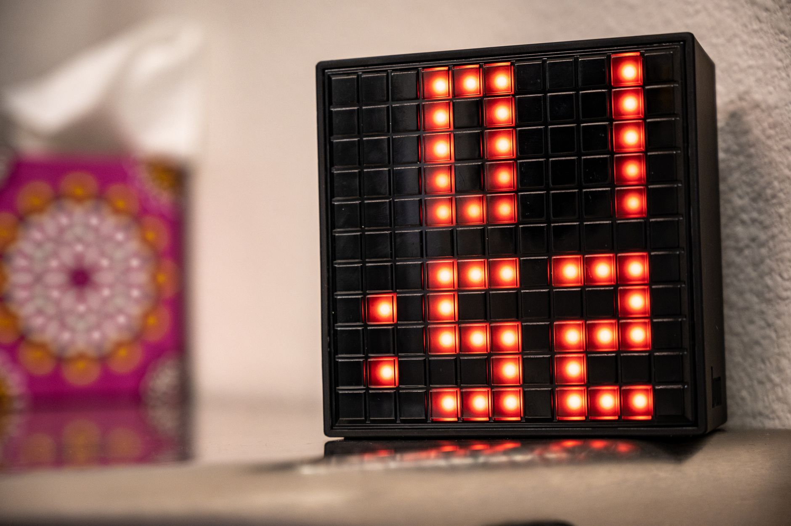
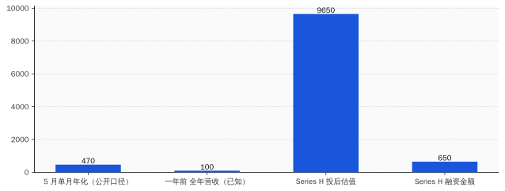
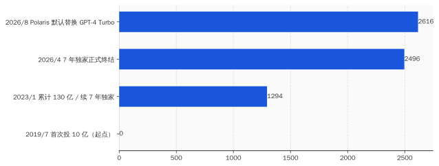
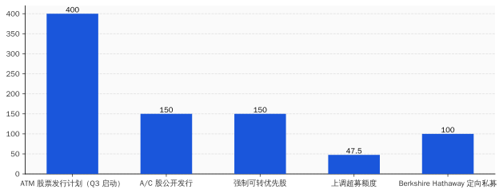

# AI 行业 48 小时干了四件事，没有一件跟模型有关

> **发布日期**：2026-06-06 | **分类**：AI 行业观察

## 导语

2026 年 6 月 1 日和 6 月 2 日，AI 行业发生了四件事。

没有一件是发新模型。

全是资本动作。

---

## 一、6 月 1 日上午，Anthropic 偷偷递了一份招股书

按照美国证监会的规则，秘密递交 S-1 这件事，公司可以不公告。Anthropic 公告了。

时间是 2026 年 6 月 1 日。

往前数 4 天，5 月 28 日，Anthropic 刚刚关掉一轮 Series H。65 亿美元。投后估值 9650 亿美元。这一轮的领投方是 Altimeter、Dragoneer、Greenoaks、Sequoia，跟投阵容里出现了 Capital Group、Coatue、Fidelity、T. Rowe Price——后两家是公募基金。

公募基金出现在一级市场的 Series H 里，是个值得停一下的细节。

公募的钱本来应该在二级市场买股票，按净值申赎、按季度披露。它们出现在一级，说明二级市场上没有足够多能装下这种体量资金的 AI 标的——所以它们只能往一级走，提前埋伏。Anthropic 给它们一张未上市股票，等于发了一张"未来 IPO 入场券"。

然后 4 天后，Anthropic 把 S-1 交了。

这个节奏不叫 IPO 准备。这叫**结算**。

你 28 号刚发完最后一张入场券，1 号就告诉证监会"我打算让这些人去二级市场退场了"。中间隔了一个周末。

招股书里写了什么？没人知道。这是 confidential filing，按 Rule 135 公告，文件内容不公开。Anthropic 公告里能引用的，只有一句"已经秘密提交了一份 S-1 草案"。剩下的全是律师写的免责声明。

但你不需要看里面。看时间就够了。

按 Anthropic 自己的口径，5 月单月年化收入（run-rate）"刚刚突破 470 亿美元"。一年前是 100 亿。账面增长 4.7 倍。这个数字非常炸。问题是 run-rate 不是 revenue。run-rate 的算法是"把最近一个月的收入乘以 12"。你 5 月卖了 39 亿美元，对外说"年化 470 亿"，技术上没错。

但 470 亿不是"今年的收入"。是"假设接下来 11 个月每个月都跟 5 月一样"的外推。

这两个数字在投资人 deck 里看着差不多。在 S-1 里完全是两件事。S-1 要披露的是经审计的财务报表，run-rate 这种东西不能直接写进去。所以**Anthropic 在 confidential S-1 里要披露的，将是另一个数字，没有人看过那个数字，包括投资人**。

不公开 S-1 内容、Series H 4 天后就交、公募基金在最后一轮被塞进来——这三件事任意一件单看都能解释成"准备工作做得好"。三件事拼在一起，叫"赶时间"。

赶什么时间？这要看 6 月 2 日另外两件事。

## 二、那么 OpenAI 那边在干什么

简单回答：在等。

复杂回答：在等结构调整完。

OpenAI 已经在 2025 年 10 月 28 日完成了从非营利到公益公司（PBC）的重组。新结构是这样的：原来的非营利基金会改名叫 OpenAI Foundation，持有新成立的 OpenAI Group PBC 26% 的股份；微软持有 26.79%（按完全摊薄、可转换计算）；剩下 47% 给员工和其他投资人。

按 OpenAI 上一轮估值 8520 亿美元算，微软那 26.79% 价值 2283 亿美元。微软累计投入 OpenAI 大约 130 亿美元。按这个估值算，账面回报 17.6 倍。

你以为这是个好故事。其实是个**死结**。

问题在哪？微软持股 26.79%，OpenAI Foundation 持股 26%——两个最大股东加起来 52.79%，超过半数。但其中一半的所有权（基金会那 26%）法律上属于一家非营利机构。IPO 要给这部分股票定一个流通价，意味着你要给"非营利使命"打一个市价标签。

这件事在律师层面是能做的，在叙事层面是地雷。OpenAI 过去十年的全部公关，都建立在"我们不是一家公司、我们在为人类做研究"上面。现在你要把 26% 的非营利股权拿去交易所敲钟。

这不是技术问题，是公关问题。也不是估值问题，是**程序**问题——你需要时间。

所以业内对 OpenAI 上市的时间表预期，从原来的 2026 Q4，被 PitchBook 在 5 月的一份分析师备忘录里推到了 2027 中后期。理由写得很委婉，叫"基础设施支出义务"——大白话翻译是：钱还没烧完，账还没理清，故事还没换好。

Anthropic 没有这个问题。

Anthropic 从注册那天起就是 PBC（Public Benefit Corporation，公益公司）。它的结构里没有"使命基金会"这种烫手东西。它讲"AI 安全"，但讲的方式是"我们的产品和研究都是为了 AI 安全"——这是公司行为，不是基金会承诺。从招股书写作角度看，**这是一份能直接抄战略报告的 S-1，不是一份需要重写章程的 S-1**。

所以 Anthropic 抢跑 OpenAI 不是因为模型更好，也不是因为收入更多——是因为结构更干净。干净到 Series H 关单 4 天就能交 S-1。

这件事讽刺的地方在于：过去几年 Anthropic 一直在公开场合扮演"我们是更负责任的那一家"。它的整套 Constitutional AI 叙事、Claude 的"价值观训练"、CEO Dario 频繁出席听证会聊 AI 安全——所有这些建构起一个"道德高地"的人设。

现在这个人设在 IPO 节奏上获得了第一次回报：**它跑得比对手快，因为它一开始就没装那么多包袱**。

OpenAI 装了，OpenAI 撑得越久越重。Anthropic 没装，Anthropic 现在可以脱掉鞋跑。

## 三、6 月 2 日上午，微软在 Build 大会上把 GPT-4 踢了出去

第二天，6 月 2 日，西雅图，微软年度 Build 开发者大会。Satya Nadella 上台讲了大约一个小时。中间最重要的一句话是：从 2026 年 8 月开始，GitHub Copilot 默认使用 Microsoft 自家的 Project Polaris 模型，替换原来的 GPT-4 Turbo。

切换方式是"自动迁移"。给老用户三个月 fallback 期，让他们继续用 GPT-4 Turbo。

三个月后，回收。

Project Polaris 的官方描述：MoE（专家混合）架构，跑在微软自己设计的 Maia 200 AI 加速芯片上。微软声称它在 HumanEval 和 MBPP 这两个标准编程基准上跑赢 GPT-4 Turbo，尤其在 Rust 和 Haskell 这种"小语种"上提升明显。这些基准数字没有第三方独立验证。

同一场大会上，微软还发了一组叫 MAI 的自研模型家族，七款：推理、编程、图像、语音、转录全都有。其中 MAI-Thinking-1 是微软的第一个推理模型，官方明确说"训练数据没有用 OpenAI 的任何输出"。

这句话翻译一下：以前的微软模型用了，现在不用了。这是**公关声明**，不是**技术声明**——技术上微软没必要专门强调这一点，除非他们要切断的不是数据通道，是关系本身。

时间倒推一下。

2019 年 7 月，微软首次投资 OpenAI 10 亿美元，签独家云服务合作。
2023 年 1 月，微软追加投资，累计达到约 130 亿美元，独家分发权续约 7 年。
**2026 年 4 月**，微软和 OpenAI 公开宣布结束 7 年独家伙伴关系——这件事当时只在科技媒体角落里跑了几天。
**2026 年 6 月 2 日**，宣布 8 月用 Polaris 替换 GPT-4 Turbo。

从 4 月到 6 月，58 天。微软完成了一件事：把对外的"伙伴退出"变成对内的"产品替换"。

这件事的商业含义需要拆一下。GitHub Copilot 是 OpenAI API 的**最大付费场景之一**。具体数字没披露过，但你按一个常识推：GitHub Copilot 全球付费订阅数是百万级别，每个用户每个月几十次到几百次 API 调用，按 OpenAI API 定价模型反推，年付费金额是个九位数级别的现金流。微软付，OpenAI 收。

微软 8 月切换 Polaris，等于把这个九位数现金流断了。

更关键的是**时点**：8 月。OpenAI 如果按原计划 2026 Q4 上市，路演大约在 9-10 月开始。投行做财务模型的时候，要把 Q3 的实际收入趋势计入估值。8 月切换 = Q3 收入计入断流后的数据 = 路演 deck 里要解释一件特别难解释的事："我们最大的企业客户之一不再付我们 API 钱了。"

你现在能理解为什么 OpenAI 的 IPO 被推到 2027 了。

不是它不想交 S-1，是它**不能现在交**。它的现金流故事需要重写。重写之前不能见证监会。

Anthropic 也明白这一点。所以它在 6 月 1 日交了 S-1。早一天交，就比 OpenAI 早一天定锚。先上市的那家，会被市场用来给后上市的那家做估值参考。如果 Anthropic 9-10 月以 1 万亿美元市值上市，OpenAI 后年路演的时候就不能再喊 1.5 万亿——市场会拿 Anthropic 那个数字打你脸。

谁先去敲钟，谁就拿定价权。

## 四、与此同时，Alphabet 在卖股票

回到 6 月 1 日。Anthropic 递 S-1 那天上午，Alphabet 同时发了一份 8-K。

内容：股权融资 800 亿美元。

几个小时之内，市场反应过来这个数字含义太重，Alphabet 又发了一份更新公告，把规模上调到 847.5 亿美元。

结构是这样的：

- 150 亿美元强制可转换优先股（存托凭证形式）
- 150 亿美元 A 类 + C 类普通股，包销公开发行
- 400 亿美元 ATM（at-the-market）股票发行计划，预计 2026 Q3 启动
- 100 亿美元定向私募给 Berkshire Hathaway（巴菲特）——A 股每股 351.81 美元，C 股每股 348.20 美元

847.5 亿美元，是美国资本市场历史上**单家公司单次股权融资规模的前三**。仅次于沙特阿美和阿里巴巴的 IPO。Alphabet 这次不是 IPO，是已上市公司的二次发行。这是个非常少见的姿势。

Alphabet 自己解释的钱用途：投入 AI 算力基础设施。

同一份公告里附了一组指引数字：2026 年 capex 1800 亿到 1900 亿美元，2027 年"显著高于 2026 年"。

"显著高于"。Alphabet 这种公司在公告里用"显著"这个词，意思就是数字大到让法务都不敢直接写出来。

我们可以做个对比。Alphabet 2024 年全年 capex 是 525 亿美元。**2026 年是 2024 年的 3.5 倍。**2027 年还要在 2026 年基础上"显著增加"。这家公司每年的现金流是 1000-1200 亿美元的量级，这个量级吃 1800-1900 亿的 capex，吃不下。

所以要增发。增发 847.5 亿，刚好顶上 2026 年 capex 减去经营现金流的窟窿。

然后巴菲特进来了。

伯克希尔买 100 亿。这件事的金融含义比所有人理解的都重。巴菲特过去 15 年从来不碰这种**未盈利赛道的大资本支出公司**。他过去四年极少买科技股，例外是苹果，理由是苹果不烧钱、有定价权。Alphabet 现在恰好相反：烧钱、定价权在被 AI 重新定义。

巴菲特进场的时机非常微妙。他买的是 351.81 美元的 A 股、348.20 美元的 C 股——这两个价是 Alphabet 5 月底股价低点附近。**他不是在追高，他是在抄底**。

**问题来了：你需要抄一只 2 万亿美元市值的科技股的底吗？**

答案只有一个：Alphabet 5 月的股价告诉市场，AI 基建的 capex 烧钱速度已经开始让二级市场紧张了。巴菲特用 100 亿告诉市场："我来背书，你们别慌。"

但这是个**双向交易**。Alphabet 拿到了 100 亿现金，巴菲特拿到了"AI 时代的安全边际"。背书的代价是 Alphabet 提前锁定了一个不会在下行周期抛售的大股东。换句话说，Alphabet 在 5 月底已经预见到接下来几个月二级市场会动荡，需要一根定海神针。

Anthropic 6 月 1 日交 S-1，Alphabet 6 月 1 日宣布 847.5 亿增发——同一天。**没有任何一家上市公司会在巴菲特进场背书的同时主动稀释 5%-7% 股本**，除非它接下来要烧的钱真的大到这个程度。

钱要烧到哪里去？要往下看一节。

## 五、所有的钱，最后流进了同一个地方

我们盘点一下这 48 小时的资金流向。

Anthropic 在递 S-1 的同时，正在执行 Series H 公告里附带的几笔"基础设施承诺"。原文是这么写的：跟 Amazon 签了协议，承接最高 5GW 算力容量；跟 Google 和 Broadcom 签了 5GW 下一代 TPU 容量；跟 SpaceX 签了 Colossus 1 和 Colossus 2 集群的 GPU 容量。

5GW + 5GW = 10GW。这个数字什么概念？

一个标准核电反应堆的电功率大约 1GW。Anthropic 一家公司，未来几年要消耗的 AI 推理 + 训练算力，相当于 10 座核电站满负荷发的电。这是 Anthropic **一家**。OpenAI 那边的数字只多不少——OpenAI 和 Oracle 签的星际之门项目目标算力规模据公开报道超过 10GW。

这些电、算力、芯片，钱不是给电力公司的——是给上游硬件供应链的。

具体来说：

- **英伟达**：Vera CPU 首批客户名单里，写着 Anthropic、OpenAI、SpaceX。这三家是英伟达 2026 年最大的客户。
- **台积电**：英伟达 GB200 / Vera 系列全部在台积电 N3 和 N2 制程上生产。
- **SK海力士、三星、美光**：HBM3e 和 HBM4 内存的全部产能。Anthropic 在 Series H 公告里专门点名 Micron、Samsung、SK hynix 为"战略基础设施伙伴"——一个软件公司在融资公告里点名内存厂商，过去 30 年都没出现过。
- **博通**：Google TPU v6e 的协议设计方。

钱的流向是：**公募基金的钱 → 投到 Anthropic（一级）→ 流给 Amazon / Google / SpaceX（云算力账单）→ 流给英伟达 / 博通（芯片）→ 流给台积电（晶圆）→ 流给 ASML / 应用材料（光刻和沉积设备）→ 流给 SK海力士 / 三星 / 美光（内存）**。

Alphabet 那 847.5 亿，绕的圈更短——直接给自己的 TPU 项目、自己的 Compute 部门 capex、自己的 DeepMind 训练成本。但终点一样：博通 / 台积电 / 内存厂。

微软那边也一样。Polaris 跑在 Maia 200 上，Maia 200 是微软自己设计的，但生产在台积电、内存在 SK 海力士、网络芯片在 Marvell。

**这 48 小时的全部资金，绕一大圈，落在不超过 10 家硬件供应链公司的银行账户上。**

如果你愿意把 AI 行业当一个生态系统看，这套循环看着挺健康——上游收钱、中游烧钱、下游讲故事。问题是上游产能是有限的。台积电 N3 / N2 产能不可能跟着 AI 资本无限扩张，HBM 内存的吉瓦级需求让美光和海力士的资本支出也在创历史新高。

也就是说，AI 巨头烧的每一块钱，**有一个明确的天花板**：上游能不能扩出对应产能。

烧到上游产能极限，整个故事就讲不下去了。这是行业**最不性感的一个真相**：所谓"AI 革命"，最后一步是台积电和 SK 海力士的产能曲线。

## 六、窗口在合上

把 48 小时的四件事拼起来，得出的不是"AI 在突破"，是另一件事——

AI 公司开始换故事了。

过去两年的故事是这样讲的：模型能力指数级上升，应用场景指数级扩散，企业付费意愿指数级增强。这套叙事在投资人 deck 里非常好用，在融资公告里非常好用，在媒体头条里非常好用。

但它在两个地方不好用。

一个是 SEC。**美国证监会不接受"指数级"这种词进招股书**。它要看的是审计过的财务数据、可比公司估值倍数、客户集中度披露、关键人员风险因素。所有这些维度，AI 公司都要按传统科技公司的标准被衡量。Anthropic 6 月 1 日递交的 S-1，律师团队过去 3 个月做的全部工作，就是把"AI 改变世界"这种话翻译成 SEC 能读懂的英语。

翻译的过程里，**叙事必然降级**。

另一个不好用的地方是巴菲特。或者更广义地说，是**old money**。巴菲特过去十年从不碰未盈利科技公司——他公开嘲讽过比特币、他对苹果之外的科技股极度克制。他在 6 月 1 日买 100 亿 Alphabet，意思不是"我相信 AI 革命"，意思是"AI 公司开始按传统估值方法定价了，现在可以入场了"。

old money 进场是故事变现实的时刻。也是叙事红利结束的时刻。

所以 Anthropic 抢跑，跑的不是 OpenAI——跑的是这套"故事变现实"的进度条。它要赶在叙事红利还能撑住 1 万亿美元定价的窗口里完成 IPO。早一周递 S-1，就早一周到 9-10 月路演，就早一周锁定那个估值锚。

为什么是 9-10 月？因为 11-12 月是美股传统的财报季和年底盘点期，**机构投资者不会在年底做大体量科技 IPO 的认购**——他们要的是确定性的年底回报，不是 IPO 这种高方差资产。如果 Anthropic 错过 9-10 月窗口，最快也要等到 2027 年 3 月。中间隔了一个完整冬天。

冬天里能发生什么？

冬天里 Polaris 切换 GPT-4 已经完成了一个季度，OpenAI 的 Q3 真实收入数据会出来；冬天里 Alphabet 的 1800 亿 capex 会兑现一半，二级市场会重新计算 AI 公司的 ROI；冬天里至少会发生一次"某家垂直 AI 应用公司爆雷"的事件，因为这种公司在 2024-2025 估值已经离谱到不可持续；冬天里还可能发生宏观层面的事件——美联储利率、地缘政治、台积电产能波动。

任何一件，都可能让 1 万亿美元的 AI 公司估值变成 6000 亿美元。

Anthropic 不能赌。所以它在 5 月 28 日关 Series H、6 月 1 日交 S-1。一气呵成。

我们回过头来看 48 小时的四件事，会发现它们其实在讲同一件事——

**Anthropic 抢跑 S-1**：抢的是估值锚定权。
**Alphabet 847.5 亿增发**：锁的是 2026-2027 年 capex 现金流。
**巴菲特 100 亿入场**：买的是"AI 估值方法切换期"的安全边际。
**微软 Polaris 替换 GPT-4**：拆的是 OpenAI 的 IPO 时间表。

四个动作，四个主体，但都在朝一个方向移动：**为下一阶段的资本结构调整做准备**。

下一阶段是什么？是**AI 公司从"叙事驱动估值"切换到"现金流驱动估值"的过渡期**。这个过渡期会持续 12-18 个月。在这 12-18 个月里，所有想以"叙事估值"完成融资 / 上市 / 退出的动作，都必须在窗口关上之前完成。

窗口什么时候关？没人知道确切时间。但所有头部玩家都在用脚投票。

四件事，48 小时。

没有一件跟新模型有关。

但每一件都在告诉你：这个行业现在最重要的工作，已经不是把模型做得更好。是把仓位调整好。

## 结论

48 小时的四个公告里，最该被记住的不是 Anthropic 的 970 亿估值，也不是 Alphabet 的 1900 亿 capex，更不是巴菲特的 100 亿入场。

**最该被记住的是节奏。**

5 月 28 日关单、6 月 1 日交 S-1、6 月 2 日断 GPT-4——这种紧凑度过去 5 年的 AI 行业从没出现过。AI 公司过去习惯按"模型节奏"做公告：发了 GPT-4 等 GPT-5，发了 Claude 3 等 Claude 4。每次发布之间留够时间让市场消化、让叙事发酵、让估值重新打高一档。

现在不一样了。现在是**按资本市场窗口节奏做公告**。

模型升级在 48 小时里没出现，但资本结构调整一次性出现了四个。这是一个行业从"产品周期"切换到"金融周期"的标志。所有还在按"等下一个模型"判断 AI 行业走势的分析师、媒体、散户，在 6 月 1 日和 6 月 2 日这两天，已经被甩出节奏了。

下次再看见某 AI 巨头发公告，先问一句：

**这是产品动作，还是资本动作？**

答案如果是后者，那你接下来要看的不是 GitHub 上的 release note，是 SEC 上的 8-K。

## 数据来源

- [Anthropic Files Confidential S-1: Joins $3 Trillion AI IPO Race (Yahoo Finance, 2026-06-01)](https://finance.yahoo.com/markets/stocks/articles/anthropic-files-confidential-1-joins-161008569.html)
- [Anthropic confidentially files IPO prospectus with SEC (CNBC, 2026-06-01)](https://www.cnbc.com/2026/06/01/anthropic-ipo-s1-prospectus.html)
- [Anthropic confidentially files its S-1 first—but the IPO race with OpenAI is just beginning (Fortune, 2026-06-01)](https://fortune.com/2026/06/01/anthropic-s1-confidential/)
- [Anthropic raises $65B in Series H funding at $965B post-money valuation (Anthropic official, 2026-05-28)](https://www.anthropic.com/news/series-h)
- [Anthropic tops OpenAI as most valuable AI startup, nears $1 trillion valuation (CNBC, 2026-05-28)](https://www.cnbc.com/2026/05/28/anthropic-open-ai-startup-value.html)
- [Alphabet Inc. Form 8-K — Equity Offerings Announcement (SEC EDGAR, 2026-06-01)](https://www.sec.gov/Archives/edgar/data/0001652044/000119312526257724/d83560dex991.htm)
- [Alphabet Inc. Form 424B5 — Prospectus Supplement (SEC EDGAR, 2026-06-01)](https://www.sec.gov/Archives/edgar/data/0001652044/000119312526252362/d152107d424b5.htm)
- [Invest in AI: Alphabet's $80B equity raise for infrastructure (ECIKS analysis of Alphabet 8-K)](https://eciks.org/7101-38252-invest-in-ai-alphabet-s-80b-equity-raise-for-infrastructure)
- [GitHub Copilot Replaces GPT-4 With Project Polaris, Ships Multi-Agent VS Code at Build (TechTimes, 2026-06-02)](https://www.techtimes.com/articles/317596/20260602/github-copilot-replaces-gpt-4-project-polaris-ships-multi-agent-vs-code-build.htm)
- [Introducing MAI-Thinking-1 (Microsoft AI official, 2026-06-02)](https://microsoft.ai/news/introducing-mai-thinking-1/)
- [Microsoft Build 2026: MAI-Thinking-1 Is First In-House Reasoning Model, Trained Without OpenAI Data (TechTimes, 2026-06-02)](http://www.techtimes.com/articles/317631/20260602/microsoft-build-2026-mai-thinking-1-first-house-reasoning-model-trained-without-openai-data.htm)
- [What Microsoft's 10-Q Says About OpenAI (om.co, 2026-05-01)](https://om.co/2026/05/01/what-microsofts-10-q-says-about-openai/)
- [OpenAI Is Now a For-Profit Company, Paving the Way for a Possible $1 Trillion IPO (Marketing AI Institute)](https://www.marketingaiinstitute.com/blog/openai-for-profit-ipo)
