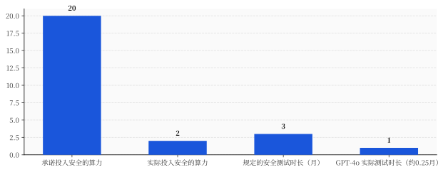
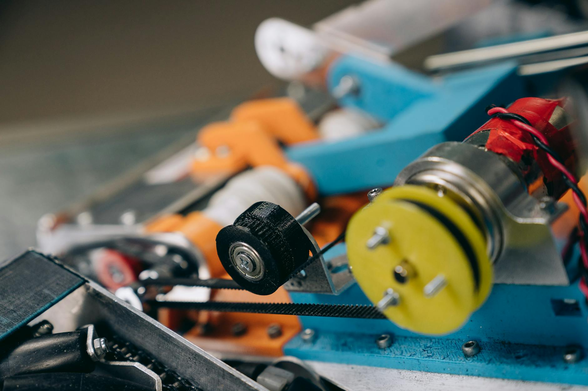

# 佛州把奥特曼本人告上法庭那周，国会递了一份不让你再问"模型怎么造"的法案

> **发布日期**：2026-06-06 | **分类**：AI产业深度

## 导语

2026 年 6 月这一周，美国干了两件关于 AI 的大事。

6 月 1 日，佛罗里达州总检察长 James Uthmeier 起诉 OpenAI，外加把 Sam Altman 本人列为被告。全美第一个动手的州。83 页诉状，10 项罪名，求偿"potentially up to billions of dollars"。

6 月 4 日，众议员 Jay Obernolte 和 Lori Trahan 甩出一份 269 页的法案讨论稿，名字起得气势磅礴——《Great American AI Act》，伟大美国人工智能法案。

绝大多数人看完这两条新闻，脑子里浮出来的是同一句话：终于开始管 AI 了。

一个州把 AI 公司告上法庭，一个国会要给 AI 立规矩，怎么看都是好事成双。

但你把佛州诉状里到底告了什么、国会那 269 页里第一刀砍向哪里，两份原文摊在一张桌子上对着看，会发现这俩根本不是"好事成双"。

**这是一记组合拳。**

佛州在法庭上逼问 OpenAI 一件事：你的模型到底是怎么造出来的。国会那份法案，干的恰恰是把"各州有权过问模型怎么造的"这个权力，从州手里收走，冻结三年。

一边有人在问，一边有人立法不让你问。同一周，同一只手。

这篇拆三层：佛州诉状真正的杀招在哪、那部"伟大法案"的正文第一刀砍向谁、以及谁在掏钱锁这扇门。

---

## 一、佛州告的不是 ChatGPT 说了什么，是 OpenAI 没做什么

你以为佛州起诉 OpenAI，告的是"ChatGPT 教坏了人"。

诉状里确实有这部分。Uthmeier 的指控清单很长：佛罗里达州立大学 2025 年那起枪击案，凶手据称用 ChatGPT 策划了袭击；ChatGPT 被指鼓励脆弱用户走向自杀；让未成年人"上瘾"，在没有家长监督的情况下收集儿童数据。10 项罪名摊开——4 项欺骗性与不公平贸易行为、2 项过失、2 项产品责任、1 项欺诈性虚假陈述，外加一项公共妨害。

这些指控针对的是"ChatGPT 这个产品用出去之后惹了什么祸"。法律上有个词，叫部署端（deployment）。产品已经造好了，卖出去了，在用户手里出了事。

但诉状里真正狠的，不是这部分。

是 OpenAI 自己许过的承诺。

2023 年，OpenAI 公开宣布成立一个 superalignment（超级对齐）团队，对外承诺：未来四年拿出公司 **20% 的算力**，专门用来研究怎么控制比人更聪明的 AI。这是写在公告里、给全世界看的数字。

佛州诉状指控：OpenAI 实际投入 AI 安全的算力，只有 **1% 到 2%**。

承诺 20%，给了 1-2%。差了一个数量级。

还有更具体的一条。诉状称，GPT-4o 这种能同时处理文字、图像、音频的模型，按规矩需要数月的安全测试。OpenAI 实际只做了"a one-week evaluation"——一周。当安全人员要求追加时间、把这套系统能出什么岔子测清楚的时候，诉状里写得很直接：

> "Altman personally overruled them."

奥特曼本人，亲自驳回。

这就是为什么这桩官司要把 Altman 个人列为被告。佛州给他扣的帽子是——他作为 CEO 的行为，体现了对人命风险的"utter disregard"（彻底的漠视）。

你品一下这几条指控的性质。20% 还是 1-2%、测试做数月还是做一周、安全团队的反对该不该被一句话否决——这些全不是"产品用出去之后"的事。这些是模型**还在造的时候**的事。是开发端（development）。

佛州这次能告进去，靠的是部署端的入口——FDUTPA，佛州的《欺骗性与不公平贸易行为法》，一部消费者保护法。它打的是"你把一个你明知有风险的产品当安全的卖给佛州居民"。

但它真正想让法官看见的证据，全在开发端。

记住这个区分：部署端是入口，开发端是杀招。这两个词，下一节你还会再见到。

---

## 二、一部名字带"伟大"的法案，正文第一刀砍向"问模型怎么造"的权力

三天后，6 月 4 日，国会这边出场。

Obernolte 和 Trahan 的《Great American AI Act》讨论稿，269 页。官方新闻稿里的说法很正面：建立全美统一的联邦 AI 治理框架，要求大型前沿开发者做安全披露、报告重大事件、接受第三方审计。

听着是要给 AI 上规矩。

翻到最有争议的那一条，画风就变了。

法案要 preempt（联邦优先，作废）各州"specifically regulating the **development**"——专门针对 AI 模型"开发"——的法律。期限三年。三年内，各州不许就 AI 怎么训练、怎么构建、怎么调权重立新法。

注意它咬得多准。被冻结的是"development"，开发。法案白纸黑字写明：这条 **不适用于** AI 模型"use or deployment"——使用或部署——的法律。

把这句话和上一节连起来。

佛州诉状的杀招在哪？在开发端。OpenAI 承诺 20% 算力实际给 1-2%、该测数月只测一周、Altman 否决安全团队——这些全是"模型怎么造的"。

国会这部法案要冻结的是哪一端的州立法权？开发端。

也就是说：佛州这次靠 FDUTPA 这种部署端、消费者欺诈的入口钻进去了，官司大概率能活。但假如哪个州想立一部法，规定"在我这儿发布的前沿模型，必须做满 X 个月安全测试、必须真投承诺的算力做对齐、安全团队的否决 CEO 不能一句话推翻"——

那才是被这部法案按住、三年内不许碰的东西。

法案还附了一套"给点甜头"的设计：年营收 5 亿美元以上的大型前沿开发者，要发布安全框架、报告重大事件、接受半年一次的第三方独立机构审计，结果报送商务部下面一个叫 CAISI 的中心。

看起来是责任。但三处细节得拎出来。

第一，门槛是 5 亿美元营收。这把一众小公司放出去了，真正套上义务的就是头部那几家——而头部那几家，恰恰是最想要"全美一套规矩、别让 50 个州各管各的"的那几家。

第二，审计是半年一次的"框架披露"，不是哪个州能上门强制核查的硬约束。它管的是"你有没有发个安全框架出来"，不是"你那 20% 算力到底投没投"。

第三，也是最阴的一处——sunset，日落条款。这套审计义务和那条"冻结各州开发立法"的禁令，三年后一起自动到期，除非国会再续。换句话说，义务和禁令打包，三年后义务可能没了，但这三年各州的手是被绑死的。

**一部名字里带"伟大"的法案，正文第一刀，砍的不是 AI，是问 AI 的人。**

---

## 三、把两张原文拼起来：佛州在问的，正是国会要锁的

现在把这两件事彻底拼到一起。

很多解读把它们当成相反的事——一个在加强监管（佛州起诉），一个在放松监管（国会 preempt）。所以才有人说这周"州和联邦打架了"。

打架是真打架。但方向不是"管 vs 不管"。

是"谁来管，管哪一端"。

佛州站在开发端的门口，靠消费者保护法这个侧门挤了进去，想让法官看 OpenAI 模型是怎么造的。国会这部法案，是把开发端这扇正门，对所有州，焊死三年。

佛州这次能活，不是因为法案手软，是因为它走的是部署端的侧门（FDUTPA、消费者欺诈），而法案明确放过了部署端。这恰好暴露了产业真正想锁的是什么——

不是"别告 OpenAI"。告完了产品出事了再赔钱，对一家年化收入早就上了天的公司，是可以预算进成本的事。

产业真正想锁的是"别立法逼我公开模型怎么造的、别立法逼我必须做满安全测试"。因为那个会动到的，是模型发布的速度、是商业模式的根。

这就是为什么这周最该被记住的判断，不是"AI 终于被管了"。

**是反过来的：这周真正被立法保护起来的，不是 AI 安全，是"别问模型怎么造的"这件事本身。**

头条上的案子能活，治本的法被锁。这才是这套设计最值钱的地方。佛州那种官司每隔几个月来一次，赔点钱，上几天头条，对产业来说是可承受的噪音。而"各州不许立法管开发"这条线一旦冻结三年，等三年后市场格局固化，谁还在乎当年立没立成。

有人会替这部法案说话：50 个州各立各的法，patchwork（拼凑式监管），不把美国 AI 公司拖死才怪，联邦统一框架本来就比 50 部州法强。

这话不全错。问题不在"要不要统一"，在"往哪个方向统一"。

真要统一，就该把佛州诉状里那条"承诺 20% 实际 1-2%"的指控，在联邦层面做成强制审计、强制披露、强制问责——而且不设三年日落，让联邦当地板，各州还能往上加码。那才叫统一框架。

这部法案给的是反过来的东西：联邦当天花板，各州不许超，三年免检，到期再说。统一的不是责任，是免责。

---

## 四、谁在掏钱，把这扇门焊死

这套打法不是这周才冒出来的。这已经是第三次了。

2025 年中，国会想在那部"大而美"预算和解法案里塞进一条 10 年（后来缩成 5 年）的"各州 AI 法暂停令"，由参议员 Ted Cruz 主推。结果参议院以 **99 比 1** 把这类条款投了出去。

同年底，2026 财年国防授权法案（NDAA）里又夹了一条 preemption，被两党联手拿掉。

行政令也试过。2025 年 12 月 11 日，Trump 签了一道行政令，专门设立一个"AI 诉讼工作组"，让司法部去识别并起诉那些"冲突"的州法，还拿宽带补贴（BEAD 资金）当杠杆胁迫各州。这道令的合法性当场被质疑——行政令能不能作废州法，本身就悬。2026 年 6 月 2 日，也就是佛州起诉的第二天，Trump 又签了一道，给前沿模型发布前设了个最多 30 天的"自愿"审查框架。

自愿。这个词记一下。

行政令推不动、可能违宪，于是这次改走立法。《Great American AI Act》就是把"冻结各州开发立法"这件事，从行政令的软地基，搬到国会立法的硬地基上。第三次尝试，换了个最体面的壳。

<<__AIWRITER_PLACEHOLDER__>>

为什么这么执着？因为下面这组数字。

据 GovFacts 统计，大型科技公司为了阻止各州监管 AI，已经砸进去 **超过 10 亿美元**。2022 到 2025 年，从事 AI 议题的游说者数量暴涨 **168%**；据 Sludge 的统计，如今 K 街（华盛顿游说一条街）上大约 **四分之一** 的游说者在做 AI。

另一头，各州截至 2026 年 3 月，已经在 45 个州提出了至少 1561 项 AI 相关法案。

这就是矛盾的全貌：一边是 45 个州、1561 项法案，往上长；一边是 10 亿美元游说费，往下压。preemption 是那只往下压的手，要的就是一次性把这 1561 项里管"开发"的那部分，连根冻三年。

10 亿美元买的不是某一部法案的通过，是"未来三年没人能立新规矩拦我"的安静。对一家估值以千亿计的公司，这是这个星球上回报率最高的预算项。

---

## 五、连 DeSantis 都不卖账：这不是党派之争，是州、联邦、公司的三方斗

如果你觉得这是民主党想管、共和党想放，那这周还有一条新闻专门来打这个脸。

起诉 OpenAI 的 Uthmeier，37 岁，全美最年轻的总检察长之一，2025 年 2 月上任，上任前是 DeSantis 州长办公室的幕僚长。根正苗红的佛州共和党。

而 Trump 那套联邦 preemption，佛州共和党这边公开不卖账。州长 DeSantis、还有被看好接班州长的 Byron Donalds，都公开站出来反对联邦把州权收走，主张各州有权自己管 AI。

同一个红州，一只手起诉 AI 公司、把 CEO 个人告上法庭，另一只手顶着同党总统，拒绝把"管 AI"的权力上交联邦。

这就把这周这场仗的真正轴线钉死了：它不是左右之争，是州、联邦、公司的三方博弈。

<<__AIWRITER_PLACEHOLDER__>>

党派线在这件事上彻底乱了。红州（佛州这一系）要州权、要亲手锤公司；一部分民主党人（联署这部法案的 Trahan）愿意配合搞联邦框架；而工会——传统上的民主党铁盟友——对这部法案的反应是直接掀桌。

AFL-CIO 背后站着 63 个工会、1500 万工人，对这类暂停令的态度是"hard no"。AFT（美国教师联合会）主席 Weingarten 和 AFA-CWA 主席 Nelson 联合声明，措辞毫不客气，说这部法案是

> "a giveaway to the AI industry and a handful of trillion-dollar companies, at the expense of American workers."

送给 AI 产业和少数几家万亿美元公司的大礼，代价是美国工人。

工人怕的不是 ChatGPT 会不会上头条。工人怕的是被冻结的那些州法——本来能管算法解雇、自动化压薪、AI 监控的州法。这些法律不上热搜，但它们管的是日常。

---

## 六、floor 还是 ceiling：这部法案最该被记住的一句反对

反对这部法案的声音里，最锋利的一刀来自 Brad Carson——Americans for Responsible Innovation 主席，前俄克拉荷马州民主党众议员。他给的判断是一句"generational mistake"（一代人的错误），以及下面这句：

> "This bill takes the current floor on state AI legislation and turns it into a federal ceiling."

这部法案把当前各州 AI 立法的"地板"，变成了一个联邦"天花板"。

这一句值得拆开。监管立法有两种联邦化路径：联邦当地板（floor），意思是联邦定个最低标准，各州可以在上面加码，管得更严；联邦当天花板（ceiling），意思是联邦定个上限，各州不许超过。

隐私法、电信法吵了二十年的，就是 floor 还是 ceiling。COPPA（儿童在线隐私法）当年没有完全 preempt 州法，给各州留了加码空间，这是地板逻辑。而《Great American AI Act》对"开发"那条，是彻头彻尾的天花板——不光封顶，还直接清零三年。

最该被警惕的不是"封顶"，是封顶之后那些不上头条的伤害怎么办。

佛州这种官司能活，因为它够大、够惨、上得了头条，走得通部署端侧门。但那些管算法招聘歧视、算法解雇、职场 AI 监控的州法——它们往往卡在"开发"和"部署"的交界，往往不够惨烈不上头条，往往就是被这条天花板压住、被这三年冻结的那一批。

**头条上的案子幸存，沉默的多数被冻结。**这是 preemption 最不动声色、也最该被点破的设计。

所以回到这周开头那两条新闻。

一个州把 AI 公司告上法庭，看着像"终于开始管了"。国会递出一部 269 页的"伟大法案"，听着像"要立规矩了"。

但你把两份原文摊在一张桌子上对着读，这周真正被立法保护起来的，从来不是 AI 安全，也不是你。

是"别问模型怎么造的"这件事本身。

## 数据来源

- [佛州总检察长 Uthmeier 起诉 OpenAI 及其 CEO 官方新闻稿（myfloridalegal.com）](https://www.myfloridalegal.com/newsrelease/attorney-general-james-uthmeier-files-first-nation-state-led-lawsuit-against-openai-ceo)
- [佛州总检察长就 FSU 枪击案对 ChatGPT 启动刑事调查新闻稿（myfloridalegal.com）](https://www.myfloridalegal.com/newsrelease/attorney-general-james-uthmeier-launches-criminal-investigation-openai-chatgpt)
- [佛州诉 OpenAI 诉状 PDF（myfloridalegal.com）](https://www.myfloridalegal.com/sites/default/files/openai-filed-stamped-complaint.pdf)
- [Obernolte、Trahan 发布《Great American AI Act》讨论稿官方新闻稿（obernolte.house.gov）](https://obernolte.house.gov/media/press-releases/obernolte-trahan-release-discussion-draft-great-american-ai-act)
- [Roll Call：两党讨论稿提出三年州法 preemption（含条款与 Carson 原话）](https://rollcall.com/2026/06/04/bipartisan-ai-draft-proposes-three-year-preemption-of-state-laws/)
- [Roll Call：Trump 6 月 2 日行政令设前沿模型自愿审查](https://rollcall.com/2026/06/02/executive-order-sets-voluntary-cyber-reviews-for-advanced-ai/)
- [Trump 2025-12-11 行政令《Eliminating State Law Obstruction of National AI Policy》（whitehouse.gov）](https://www.whitehouse.gov/presidential-actions/2025/12/eliminating-state-law-obstruction-of-national-artificial-intelligence-policy/)
- [Fox Business：佛州诉状中关于 20% 算力承诺与一周测试的指控](https://www.foxbusiness.com/technology/5-most-explosive-claims-from-floridas-lawsuit-against-openai-sam-altman)
- [The Conversation："utter disregard for the risk to human life"](https://theconversation.com/utter-disregard-for-the-risk-to-human-life-florida-sues-openai-and-sam-altman-over-ai-safety-284289)
- [NBC News：佛州起诉 OpenAI 与 Altman，罪名拆分](https://www.nbcnews.com/tech/tech-news/florida-sues-openai-sam-altman-saying-put-profit-safety-rcna347602)
- [AFT 工会联合声明：呼吁国会否决《Great American AI Act》（aft.org）](https://www.aft.org/press-release/union-leaders-urge-congress-reject-great-american-ai-act)
- [AFL-CIO：呼吁参议员从预算案中删除州级 AI 问责暂停令](https://aflcio.org/press/releases/unions-urge-senators-remove-ban-state-level-ai-accountability-laws-budget)
- [The Hill：佛州共和党反对联邦 AI preemption，主张州权](https://thehill.com/policy/technology/5906305-florida-republicans-regulate-ai/)
- [GovFacts：大型科技公司已花费逾 10 亿美元阻止各州监管 AI](https://govfacts.org/accountability-ethics/lobbying/big-tech-has-spent-more-than-1-billion-to-stop-states-from-regulating-ai/)
- [Sludge：K 街四分之一游说者现从事 AI 议题](https://readsludge.com/2026/02/24/ai-boom-on-k-street-one-in-four-lobbyists-now-work-on-ai/)
- [Morgan Lewis：联邦政策停滞下各州 AI 执法加速（develop/deploy/UDAP）](https://www.morganlewis.com/pubs/2026/04/ai-enforcement-accelerates-as-federal-policy-stalls-and-states-step-in)
