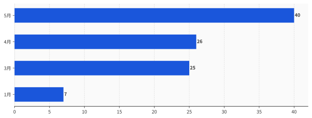
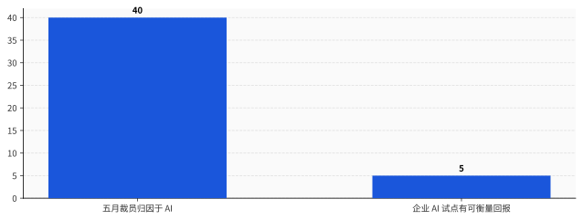
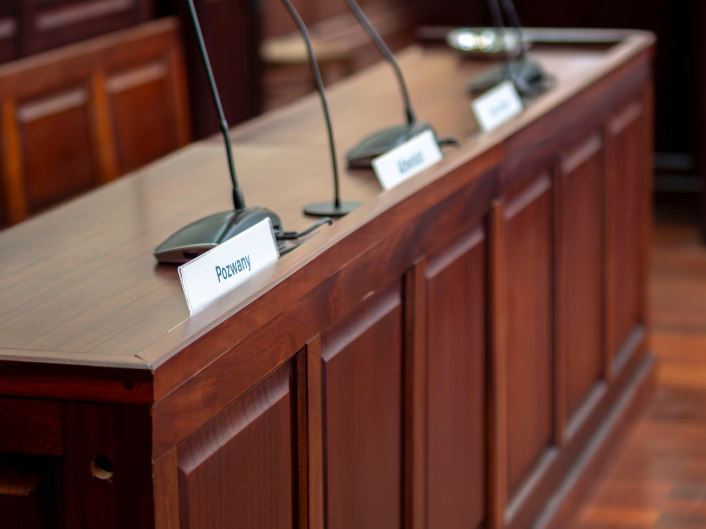

# AI 第一次成为美国裁员头号理由那天，95% 的项目还没赚到一分钱

> **发布日期**：2026-06-07 | **分类**：AI与就业

## 导语

如果你最近被裁，或者公司刚"因为要上 AI"优化掉一批同事，你大概率被同一个数字砸到过：40%。

这个数字来自 2026 年 6 月 5 日，一家叫 Challenger, Gray & Christmas 的机构发的五月就业报告。

五月，美国企业宣布裁员 97,006 人，2020 年以来最高的五月值。其中 38,579 人——整整 40%——被老板们明确归到同一个理由头上：AI。

这是有记录以来第一次，AI 成了美国公司裁员时最爱说的那个词。而且是连续第三个月居首。

新闻出来，大半个互联网在转发同一个数字，配的文案高度统一：狼真的来了。

我把这条曲线单独拉出来看了很久。今年 1 月，AI 归因占比 7%。3 月，25%。4 月，26%。5 月，40%。五个月，涨了快六倍。

然后我去翻了另一组数字。同一时期，麻省理工 NANDA 项目的调研显示，95% 的企业 AI 试点没有产生任何可衡量的回报；Gartner 的研究说，73% 执行了 AI 裁员的公司没拿到财务净收益。

一边是"AI 让我裁人"涨到 40%，一边是"AI 帮我赚钱"还卡在 5%。

把这两条曲线放进同一张图，会看到一件很荒诞的事：AI 被当成裁员理由的速度，比它真能干活的速度，快了整整一个数量级。

这不是"狼来了"。

**这是 AI 史上第一次，借口比产品先量产。**

这篇拆三件事：那个 40% 到底测的是什么、谁从"是 AI 干的"这句话里赚到了钱、以及这个数字底下还藏着一个反方向的、专砸年轻人的真相——它比 40% 这个头条数字更狠，却一个字都没上头条。

---

## 一、先把这个 40% 的口径看清楚：它测的是"老板说的"，不是"AI 干的"

在你把自己或同事的遭遇算进那 40% 之前，得先搞清楚这个数字是怎么数出来的。因为它的数法，和你以为的不一样。

Challenger 这份报告，是美国就业市场被引用最多的月度裁员追踪之一。但它有一个关键的统计方式，绝大多数转发的人没注意到。

它按企业**自己上报的理由**给裁员分类。

公司宣布裁员，会给一个说法——需求下滑、成本控制、并购重组、关厂。Challenger 把这些说法收集起来，归类计数。它统计的是"公司说的原因"，不是独立调查出来的"真实原因"。

更要命的是时间。Challenger 把"人工智能/技术更新"单独列成一个裁员理由的类别，是 2023 年才开始的事。

也就是说，"AI 裁员"这个统计口径本身，到今天只有三岁。

一个三岁的口径，记录的是公司自己愿意说出口的话。这两点叠在一起，意味着那个 40%，严格来说只能读成一句话：五月被裁的人里，有 40% 的人，他们的老板在对外解释时选择了把 AI 摆在台面上。

至于这些岗位是不是真被 AI 干掉的，这份数据不负责回答，也回答不了。

发布数据的人自己也按住了刹车。Challenger 公司的高级副总裁 Andy Challenger，在报告里说了一句和那些狂转的标题完全不一样的话。他说，在那些 AI 头条之外，他们还看到并购相关的裁员急升、破产相关的岗位损失跳增，"这告诉我，企业正在为一场 AI 驱动的经济做激进的重组"。

同一份报告里，他还专门补了一句：这还不是一场 jobpocalypse——就业末日还没到。

数据的生产者，比转发数据的人冷静得多。他知道并购和破产同期也在飙，他知道"激进重组"是个比"AI 取代人类"复杂得多的东西。

自报的理由，和真实的因果，是两件事。

而当一个理由对公司有好处的时候，这个理由的自报率，会自己往上滚。

至于这个"好处"具体是什么，下一节有答案。

---

## 二、为什么老板都爱把锅甩给 AI：这是对投资者最友好的裁员理由

同一笔裁员，有两种说法。

第一种：我们之前招多了，需求没起来，业务判断失误，现在要纠偏。第二种：我们上了 AI，效率提上来了，这部分人力不再需要。

裁的是同一批人，省的是同一笔钱。但这两句话在财报电话会上的效果，是反的。

布鲁金斯学会的高级研究员 Molly Kinder 把这件事说得很直接。她说，把裁员归因到 AI，是"对投资者极其友好的说辞"——它能把一条本该难看的负面新闻，包装成一家公司"前瞻、高效、拥抱未来"的创新成就。

第一种说法，是在承认管理层错了，股价要为管理失误买单。第二种说法，是在宣告管理层赢了，股价要为技术领先付溢价。

**理由不要钱，AI 真干活才要钱。**

一句"我们用 AI 提效了"，不需要你真的部署成功任何东西，不需要你拿出任何回报数字，它在新闻稿里是免费的。而真把 AI 接进生产流程、让它顶替掉一个岗位的活，要砸算力、要踩坑、要数月调试，那是真金白银。

便宜的先量产，太正常了。

最狠的一刀，来自这门生意里最没理由拆台的那个人。

2026 年初的一场峰会上，Sam Altman——OpenAI 的 CEO，这个星球上最大的 AI 既得利益者——说了一句很不像他立场的话。他说，几乎每一家裁员的公司，现在都在把锅甩给 AI，不管这件事到底跟 AI 有没有关系。

你品一下这个画面。一个卖铲子的，公开说大部分买铲子的人其实没在挖金子，只是举着铲子拍了张照，发给投资人看。

连供给端都不愿意为这个叙事兜底。这句话的分量，比任何一个唱反调的经济学家都重。

这不是抽象推断。2026 年 5 月 31 日，Fortune 的一篇报道直接点了名：Wix、Block、Snap、Atlassian，被列为用 AI 叙事裹挟裁员的代表。把视野放到一季度，Oracle 裁了约 3 万人，Amazon 约 1.6 万，Snap 约一千。

这些数字背后还有一个绕不开的压力源。Meta、Amazon、Google、微软这几家，2026 年一年的 AI 基础设施投入合计约 6500 亿美元。这么大的窟窿要填，薪资是企业账本上最大也最好动的那块可控成本。

裁人省下的钱，要去喂 GPU。而对外，这场为 AI 自筹资金的收缩，最好讲成一个被 AI 推动的故事。

省钱的动作，和讲故事的话术，刚好咬合。

可万一这个故事是真的呢？万一 AI 真的在大规模顶替人？

那就得把第二条曲线，摆上桌了。

---

## 三、把第二条曲线放上来：AI 被甩锅的速度，远超它赚钱的速度

如果 AI 真在大规模顶替人，那它至少得先证明自己干得了这活，而且干得划算。

可现有的产业数据，指向相反的方向。

麻省理工 NANDA 项目的调研给出一个被反复引用的数字：95% 的企业生成式 AI 试点项目，没有带来任何可衡量的回报。Gartner 的研究补了另一刀：以自动化为由裁员的公司，不管 AI 有没有真正产生收益，都照裁不误；其中约 73% 没有获得财务净收益。

一边是"因为 AI 裁人"的占比，半年从 7% 冲到 40%。另一边是"AI 真的赚到钱"的比例，趴在地上动都不动。

这不是说没有公司真把 AI 用出了回报。有，而且以后会更多。但"少数公司真靠 AI 划算地省下了人力"，和"四成裁员都是 AI 干的"，是差着一个量级的两句话。后者要成立，需要前者变成普遍现象的证据——而这个证据，现在还不在桌上。

更说明问题的，是裁完之后发生的事。

人力资源机构 Robert Half 的数据显示，约 29% 的企业，在用 AI 替换掉某些岗位之后，又悄悄把人请了回来。Forrester 那边给出的后悔率更高，过半。

这件事在业内有个外号，叫"AI 回旋镖"——你以为甩出去再也不用管了，结果它转一圈又飞回你脸上。

把这两组数据缝在一起，整个闭环就出来了。

第一步，公司用"AI"这个理由裁人。这一步成本是零，理由是免费的，还能换股价上涨。

第二步，AI 顶不上那个岗位真正要干的活，于是公司悄悄回聘。这一步成本是真的——重新招聘的费用、空窗期的损失、还有那个被裁了又被叫回来的人，再也不会真心给你卖命。

免费的那一步先发生，所以被 Challenger 统计成了"AI 裁员"。昂贵的那一步后发生，藏在几个月后的招聘预算里，不上任何头条。

回旋镖飞回来的成本，就是这场叙事真正的账单。只不过它结算得晚，而且没人替它发新闻稿。

AI 第一次让借口比产品先量产。理由这条生产线，已经开到 40% 的产能；产品那条生产线，良率还卡在 5%。

到这儿，结论好像很清楚了：这 40% 大半是虚的，AI 根本没在大规模抢工作。

但如果你就这么收尾，会掉进一个更隐蔽的陷阱。

因为这个数字底下，藏着一个完全反方向的真相。

---

## 四、反方向的真相：AI 真正的伤害，根本不在裁员公告里

斯坦福数字经济实验室主任 Erik Brynjolfsson，带队做了一项研究，名字起得很冷：《煤矿里的金丝雀》。

他们扒的不是裁员公告，而是更底层的就业数据。结论是：22 到 25 岁、处在 AI 高暴露岗位（软件开发、客服这类）的年轻人，从 2022 年底开始，就业相对水平下滑了 13%；论文更新后，这个数字扩大到 16%。而同样岗位上年纪更大的人，就业是稳的，甚至在涨。

这里发生的事，和"裁员"压根不是一回事。

Brynjolfsson 的观点很明确：企业对付年轻人的方式，不是降薪，也不是裁，是**根本不招**。门没关，但门口不再排新人。

而"停止招聘"这件事，永远不会出现在 Challenger 的裁员统计里。没有裁员公告，没有理由上报，没有一个数字会因为"某家公司今年少招了 200 个应届生"而跳动。

这就是为什么洗白论有个危险的副作用。

如果你看完前三节，得出"AI 裁员都是甩锅，AI 其实没动多少工作"，你会低估 AI 对就业的真实冲击。因为真实的冲击不在你能看见的地方。它不在裁员公告里，它在那些根本没发出去的招聘启事里。

被裁的人，至少还上了一份统计、领了一笔遣散费、有个公开的说法。而那个本来今年该被录取、却因为公司"反正以后让 AI 干"而连面试都没拿到的应届生，连一个数字都不是。

所以这件事的真相是双向的，而且两个方向并不矛盾。

整体那个 40%，被叙事吹高了——这是第一到第三节的事。入门级岗位的真实塌陷，被统计漏掉了——这是这一节的事。

**头条上的数字虚高，门背后的停招被低估。**

Anthropic 自己发布的经济指数，给这个双向真相补了一个微妙的注脚。它统计自家 Claude 上的真实用法，发现"增强人类"的用法（52%）已经反超了"替代人类"的用法（45%）——多数人是拿它当协作工具，不是替身。但同一份报告也指出，在编码这一个具体领域，用法正在从"增强"明显往"自动化"迁移。

整体上 AI 还是个助手，但在某些具体工种上，它正在从助手变成替代。22 到 25 岁那批人，恰好站在最先发生迁移的那几个工种门口。

所以这 40%，既不是全真，也不是全假。

它真正的问题是：它把账算错了对象。

---

## 五、"是 AI 干的"这句话，谁在收钱，谁在买单

一句"是 AI 干的"，凭空造出了三个赢家。

第一个赢家是 CFO。裁员从一桩需要解释的管理失误，变成一项不需要担责的技术升级。预算照砍，骂名免了。

第二个赢家是股价。同样一份裁员名单，挂上"成本失控"的标签会跌，挂上"AI 转型"的标签会涨。叙事一换，市值方向就换。

第三个赢家是整个管理层。本来是一连串具体的人做出的具体选择——招多了、押错了赛道、扩张太猛——现在被打包成一句"这是技术大势所趋"。系统性的人为决策，被伪装成了不可抗的技术宿命。

布鲁金斯的 Molly Kinder 把这层点破了：归因 AI，本质是一种权力叙事。它让做决定的人，不必为自己的决定负责。

赢家清楚了，那买单的是谁。

第一个买单的，是被裁的人。他本来是公司过度扩张的纠偏对象，现在却被盖上一个"你被 AI 取代了"的章。这个章比"公司经营不善"难受得多——前者像是被时代淘汰，后者好歹是公司的错。明明是别人赌输了，账却记在他的能力上。

第二个买单的，是那批 22 到 25 岁的年轻人。他们的处境最分裂：一方面，他们是 AI 就业冲击里最真实的受害者，斯坦福那条 13% 到 16% 的曲线就是他们；另一方面，他们又是这套叙事最好用的道具——"看，AI 连初级岗都能干了"这句话，需要他们的消失来当证据。

真受害，又被当成宣传素材。这是这代人最憋屈的地方。

公众其实已经闻出味来了。2026 年 6 月的一项调查显示，87% 的美国人认为，在机器决定裁掉一个人之前，应该有一个活人来签字负责。

这个 87% 翻译过来就是一句话：大家不反对 AI 提效，大家反对的是"AI 让我们这么做的"这种甩锅。当一项裁员决定的责任，可以被推给一个不会上法庭、不会被问责、连工资都不领的算法，那这个决定就没有人需要负责了。

当"是 AI 干的"成了免责声明，AI 就从一个工具，变成了一个替人挨骂的神。

而供奉这个神，不要钱。

---

## 六、下次再看到"AI 裁员"，把它当成一份需要审计的财务声明

知道了这些，作为一个会被这条新闻砸到的普通人，能做的其实很具体。

下次再刷到"某公司因 AI 裁员 X 千人"，别急着转发"狼来了"，也别急着骂 AI。先把这句话当成一份对外披露的财务声明，问它三个问题。

第一，ROI 呢？这家公司有没有拿出任何可衡量的 AI 回报数字？还是只有一个"提效"的形容词？没有数字的提效，约等于没有。

第二，回聘率呢？三个月、半年之后，回头看看它有没有把人悄悄请回来。回旋镖飞回来的那天，才是这场叙事的对账日。

第三，这活 AI 现在真能干，还是公司在赌它以后能干？沃顿商学院的管理学教授 Peter Cappelli 早就点破了这个顺序——很多公司是先把人裁了，再指望 AI 接上，"可它们还没做到，只是在赌"。先裁人后指望，和先验证后替代，是完全不同的两件事。

这三个问题，把"是 AI 干的"从一句不可证伪的技术宣言，还原成一笔可以核对的账。

也回到开篇那两条曲线。它们什么时候并轨——归因于 AI 的比例，和 AI 真正产生回报的比例，哪天真的靠拢了——哪天我们再谈"狼来了"不迟。

在那之前，那个 40%，主要测量的不是 AI 的能力，是一整个行业讲故事的能力。

这是 AI 历史上很奇特的一刻。一项技术，还没普遍证明自己能替人干活，就已经先被普遍用作了不干活的理由。

它最先实现规模化的，不是生产力。

**是甩锅。**

## 数据来源

- [Challenger, Gray & Christmas：2026 年 5 月裁员报告（裁员 16% 环比上升，2020 年来最高五月值）](https://www.challengergray.com/blog/challenger-report-may-job-cuts-rise-16-from-april-highest-may-total-since-2020/)
- [CNBC：AI 已成为企业给出的头号裁员理由（2026-06-05，转引 Challenger 一手数据）](https://www.cnbc.com/2026/06/05/ai-is-now-the-leading-reason-companies-give-for-cutting-jobs-says-new-report-what-that-means-for-workers.html)
- [Tom's Hardware：科技业五月裁员 38,242 人（2026-06-05）](https://www.tomshardware.com/tech-industry/artificial-intelligence/tech-sector-cut-us-jobs-by-38242-in-may)
- [AOL / Challenger：Andy Challenger 称"这还不是就业末日"（2026-06-05）](https://www.aol.com/news/challenger-says-ai-isnt-jobpocalypse-174438793.html)
- [Fortune：CEO 把裁员甩锅给 AI，点名 Wix/Block/Snap/Atlassian（2026-05-31）](https://fortune.com/2026/05/31/tech-companies-ai-washing-layoffs-wix-block-snap-atlassian-disposable-workers/)
- [Built In：AI 洗白——Oxford Economics、Cappelli、Altman 原话集合](https://builtin.com/articles/ai-washing-layoffs)
- [Fortune：AI 自动化裁员未能产生回报（Gartner 研究，2026-05-11）](https://fortune.com/2026/05/11/ai-automation-layoffs-gartner-study-roi/)
- [Stanford"煤矿里的金丝雀"：入门级岗位下滑 13–16%（Brynjolfsson 等，Fortune 报道）](https://fortune.com/2025/08/26/stanford-ai-entry-level-jobs-gen-z-erik-brynjolfsson/)
- [Anthropic Economic Index：增强用法 52% 反超自动化 45%（2026-03 报告）](https://www.anthropic.com/research/economic-index-march-2026-report)
- [Tom's Hardware：Sam Altman 警告企业用"AI 洗白"掩盖裁员](https://www.tomshardware.com/tech-industry/artificial-intelligence/openais-sam-altman-warns-that-firms-are-using-ai-washing-to-mask-layoffs)
- [PRNewswire：87% 美国人要求"机器裁人前需人类签字"（2026-06）](https://www.prnewswire.com/news-releases/the-ai-layoff-defense-why-87-of-americans-want-a-human-to-sign-off-before-a-machine-cuts-their-job-302789648.html)

