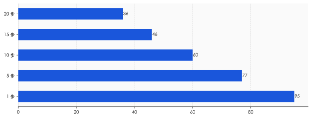
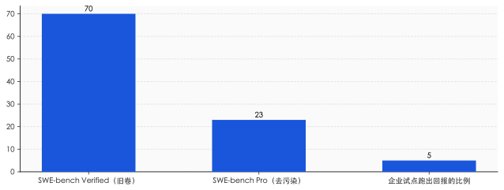
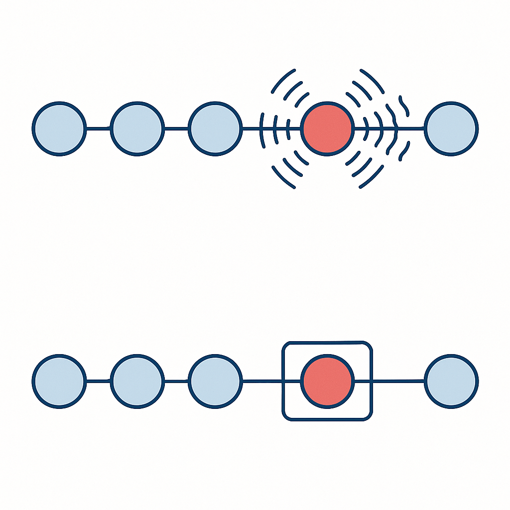
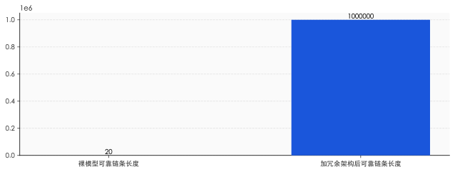

# 95 分的 AI，为什么是个不及格的产品

> **发布日期**：2026-06-10 | **分类**：AI 深度观察

## 导语

先做一道小学三年级的算术题。

一个 AI，每完成一步操作的准确率是 95%——放在任何考试里，这都是个优等生。现在让它替你连续做完 20 步：查航班、比价、改签、对账、填表、发确认邮件，一步接一步。每一步它都有 95% 的把握。那么，它把这一整件事从头到尾做对的概率，是多少？

不是 95%。是 0.95 自己乘自己，乘 20 次，等于 36%。

一个每步都拿 95 分的"员工"，交到你手上的成品，是 36 分。这就是几乎所有 AI Agent 共同的尴尬：单看每一步都很能干，连起来却频频翻车。我们今天就把这件事，从头算清楚。

---

## 一、0.95 的诅咒

这道乘法题有个不留情面的名字，叫复利。

复利你熟。存钱的时候它是你的朋友，每年滚一点，时间越长越甜。可一旦你算的是"每一步都不能出错"，复利就站到了对立面：它不再把收益滚大，而是把"不出错的概率"一点点磨小。

把账摆出来看。单步成功率 95%，做 5 步，端到端成功率掉到 77%；做 10 步，掉到 60%；做 20 步，只剩 36%。那个 95% 一个数字都没动，变的只是步数。链条越长，越往下塌。

这不是纸上推演。METR 这家专门测 AI 能力的机构在 2025 年做过一项研究：今天最前沿的模型，去做 4 分钟以内能干完的任务，成功率接近 100%；可一旦任务长到需要 4 个小时，成功率就掉到 10% 以下。同一个模型，同样的聪明，只是把任务拉长，它就从近乎全能变成几乎全废。

最扎心的例子来自 Devin。2024 年 3 月，一家公司发布了号称"全球第一位 AI 软件工程师"的它，演示视频里独立接活、写码、修 bug，一气呵成，硅谷为之沸腾。一年后，独立测试者给了它 20 个真实任务：14 个失败，3 个成功，3 个说不清。更让人不安的不是成功率低，而是——测试者发现，他根本找不出任何规律，来预测哪些任务 Devin 能做成，哪些会砸。

能力时好时坏，且坏得没有道理可循。这才是复利衰减真正的杀伤力：它不只让 Agent 变弱，还让它变得不可预测。而一个你无法预测的系统，是没法交给它负责任何要紧事的。

## 二、Demo 是单步，生产是连乘

那为什么演示视频里它那么能打，一到真实工作就原形毕露？

因为 demo 考的是单步，生产考的是连乘。一段三分钟的演示，本质上是从无数次尝试里挑出来的、那个恰好每一步都没出错的样本。它展示的是 0.95 的那个 95%，而把背后 0.95 自乘十几次的那个 36% 藏了起来。

行业评测同样藏着这个把戏。软件工程领域有个著名的考卷叫 SWE-bench，顶尖模型在它的"Verified"版本上能拿到 70% 以上，看着很美。可当研究者把题目换成更干净、更难泄题的"Pro"版本，同一批模型的得分直接掉到 23%。差距从哪来？有人去翻了原始题库，发现大约三分之一的题目，在问题描述或评论里就直接埋着答案。模型不是解出来的，是抄到的。

测试分数，本身也是一种 demo。

这就解释了一个奇怪现象：从 2024 年起，"Agent 元年"这个说法每年都被隆重宣布一次，2025 年又来一遍，2026 年还在用。一个需要反复宣布开始的纪元，恰恰说明它迟迟没有真正到来。不是模型不够聪明——今天的模型聪明得吓人。卡住所有人的，是从"挑一次好结果给你看"到"每一次都得给你做对"之间那道巨大的鸿沟。

MIT 在 2025 年的一份调查给这道鸿沟标了价：在企业里部署生成式 AI 的试点项目，95% 没能跑出可衡量的回报。能力的烟花放得震天响，落到地上，绝大多数没能换成钱。

## 三、等一下，这道乘法题算错了

故事似乎到这里就该结束了：Agent 不行，因为复利衰减是道躲不开的诅咒。很多文章就停在这里，得出一个廉价的结论——别信 demo，AI 都是骗局。

但真正较真的人会在这里停下来，问一句：0.95 自乘 20 次，这个算法本身，对吗？

它藏着一个偷偷塞进来的前提：每一步的成败，是相互独立的，像连续抛 20 次硬币，每次都从头开始、互不影响。可 Agent 的每一步，真是这样吗？

不是。而且它从两个相反的方向都不成立。

先看坏的一面。研究者发现 Agent 有一种"自我条件化"的毛病：当它的上下文里已经躺着自己之前犯下的错误，它接下来犯错的概率会显著上升。错误不是独立的硬币，而是会传染的感冒——一步错，后面更容易步步错。在这种情况下，真实的衰减比 0.95 自乘还要陡。这是为什么很多多智能体系统会"自信地、滚雪球般地"集体翻车。

再看好的一面。0.95 自乘的算法还偷偷假设了"一错即死"——任何一步错了，整件事就报废。可真实系统是可以重试、可以回滚的。如果一个错误能被当场发现、当场撤销，那么它根本不会进入那条连乘的链条。

于是，决定 Agent 生死的，根本不是单步那个 95% 有多高，而是另一个被所有人忽略的变量：**错误之间，是相互独立、还是会彼此传染；是无声地累积、还是能被当场抓住。**

这才是问题的真正命门。Sierra 团队设计过一个更诚实的衡量指标，叫 pass^k——不是问"做一次能不能对"，而是问"同一件事，连做 k 次，是不是次次都对"。结果，一个在单次测试里成绩尚可的顶级 Agent，在零售场景下连续做对 8 次的概率，掉到了 25% 以下。它不是不会做，是做不稳。会做和做得稳，是两种完全不同的能力。

## 四、可靠性是可以"买"的——用架构，不是用智商

如果命门是"错误会不会传染、能不能被抓住"，那么破局的方向就立刻变了：你不需要等一个更聪明的模型，你需要一套更会兜底的架构。

2025 年底，一篇论文给出了堪称暴力的证明。研究者用的不是什么顶配大模型，而是一个中等个头的 gpt-4.1-mini。他们做的事很朴素：把一个庞大任务拆成极小的步子，每一步让模型独立跑三遍，然后投票表决——三个里有两个一致，就采信。靠着这套笨办法，他们让模型连续执行了超过一百万步，全程零错误。

关键在成本。三遍投票，听起来要贵三倍，但因为错误被压在了萌芽阶段、不再往下传染，总成本的增长是对数级的，而不是指数级的。换句话说，任务规模翻倍，你要补的冗余只增加一点点。复利衰减这条看似不可逾越的诅咒，在架构层面被正面打破了。

这件事的道理，工程界其实用了几十年。你每天刷的视频、打的电话，信号在传输中无时无刻不在出错，可你几乎从不察觉——因为通信系统里铺满了纠错码，错一位，立刻补回来。飞机的关键系统从不指望单台计算机永不宕机，而是装三台、五台，少数服从多数。可靠性从来不是靠某个零件做到完美，而是靠系统设计出来的冗余。AI 也一样。

吴恩达把这件事说得最直白。他做过一个对比：让又老又笨的 GPT-3.5 套上一层"反思—调用工具—规划"的工作流，去解编程题，正确率能冲到 95%，反过来碾压了直接换用更大模型的收益。同样的脑子，换一套干活的章法，结果天差地别。

**真正稀缺的，从来不是更聪明的模型，而是更稳的架构。** 当所有人都在为下一代模型的参数和跑分屏息以待时，决定 Agent 能不能落地的那把钥匙，其实握在做系统、做容错、做流程的工程师手里。

## 五、为什么"九数长征"走不完

既然可靠性能用架构买到，那是不是再等一两年就万事大吉了？

没那么快。前 OpenAI 创始成员、特斯拉前 AI 总监 Karpathy 给这件事起了个名字，叫"九数长征"。意思是，把可靠性从 90% 提到 99%，再从 99% 提到 99.9%，每往上拱一个 9，所花的工程力气，大致等于此前所有努力的总和。从 0 做到 90%，一个漂亮 demo 就够了；可生产环境要的是小数点后好几个 9，那是一条看不到头的路。

所以 Karpathy 说，这不是"Agent 元年"，这是"Agent 的十年"。

这里要分清两件被混为一谈的事：能力和可靠性，是两条不同的曲线。能力那条，涨得飞快——METR 的数据显示，AI 能独立搞定的任务时长，过去六年每七个月就翻一倍，最近还在加速。但可靠性那条，爬得极慢，因为它要对抗的是复利，是每多一个 9 就翻倍的成本。

落地，本质上是这两条曲线的赛跑：模型的能力在涨，但我们想让它干的活也越来越长、越来越复杂，对可靠性的要求水涨船高。今天卡住所有人的，不是能力那条线太低，而是可靠性那条线，追不上我们野心膨胀的速度。

## 六、最后一道题，不在代码里

就算有一天，架构真的把可靠性那条曲线也拉了上来，故事就圆满了吗？

诺奖经济学家 Acemoglu 泼了盆冷水。他造过一个词，叫"凑合的自动化"——技术上能把人替下来，却没真正创造多少新价值，省下的只是一点人力成本。他据此预测，未来十年 AI 对美国 GDP 的拉动大概只有百分之一，远低于那些动辄"工业革命级"的乐观叙事。他尤其怀疑：Agent 真能接管人类工作里那些琐碎、含混、要同时拎着好几条线的部分吗？

这话点破了一件更要紧的事。回头看 MIT 那份"95% 试点没回报"的报告，研究者反复强调：大多数失败的主因，并不是技术不行，而是组织接不住——业务流程没改、人没培训、数据没打通。可靠性的鸿沟，从来不只在代码里，也在代码之外的那个组织里。

于是我们绕回到开头那道乘法题。一个每步 95 分的 AI，最终是 95 分的产品还是 36 分的废品，并不取决于那个 95 有多漂亮。它取决于三件事：你把它放进了一条多长的链条；你愿不愿意为"稳"额外付钱，去搭那套兜底的冗余；以及，链条的另一端，有没有一个真正准备好接住它的人和组织。

模型会越来越聪明，这一点毫无悬念。但聪明从来都不是终点。**能把聪明稳稳地、一次又一次地交付出去，才是。** 这道题，AI 自己解不了，得我们一起算。

## 数据来源

- [METR: Measuring AI Ability to Complete Long Tasks](https://metr.org/blog/2025-03-19-measuring-ai-ability-to-complete-long-tasks/)
- [Is there a half-life for the success rates of AI agents? (arXiv 2505.05115)](https://arxiv.org/pdf/2505.05115)
- [τ-bench: pass^k 一致性指标 (arXiv 2406.12045)](https://arxiv.org/pdf/2406.12045)
- [Solving a Million-Step LLM Task with Zero Errors (arXiv 2511.09030)](https://arxiv.org/html/2511.09030v1)
- [SWE-Bench Pro: benchmark vs 真实 (arXiv 2509.16941)](https://arxiv.org/html/2509.16941v1)
- [Andrew Ng: Four design patterns for agentic workflows](https://x.com/AndrewYNg/status/1773393357022298617)
- [I Gave Devin 10 Real Tasks. It Completed 3](https://dev.to/alanwest/i-gave-devin-10-real-tasks-it-completed-3-3063)
- [Fortune: MIT report 95% of GenAI pilots failing](https://fortune.com/2025/08/18/mit-report-95-percent-generative-ai-pilots-at-companies-failing-cfo/)
- [VentureBeat: Karpathy's March of Nines](https://venturebeat.com/technology/karpathys-march-of-nines-shows-why-90-ai-reliability-isnt-even-close-to)
- [MIT Sloan: AI Is Not Improving Productivity (Acemoglu)](https://sloanreview.mit.edu/audio/ai-is-not-improving-productivity-nobel-laureate-daron-acemoglu/)
