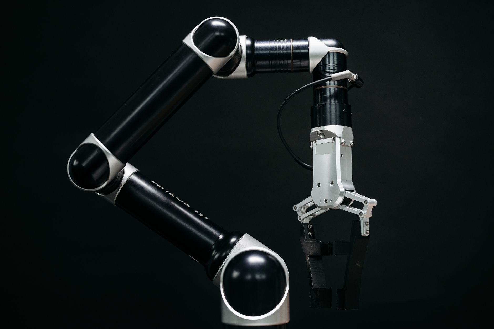
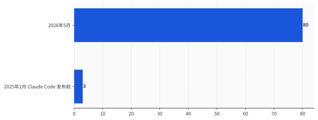
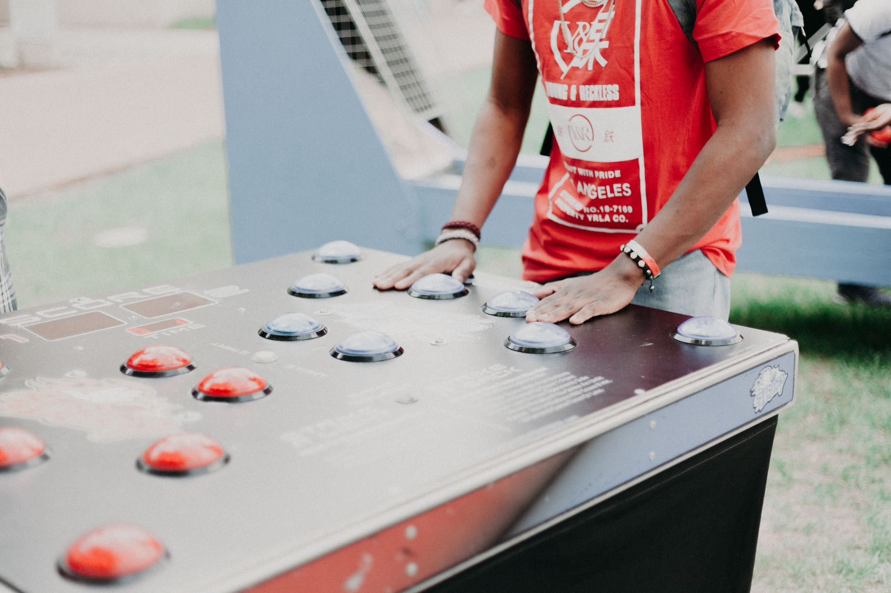
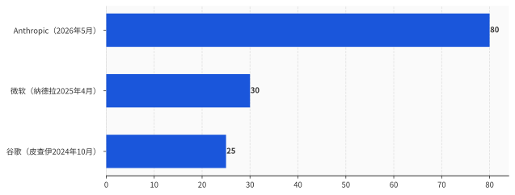

# Anthropic 自曝 80% 代码 AI 写完那天，建议全世界一起踩刹车——这脚刹车，它自己不踩

> **发布日期**：2026-06-10 | **分类**：AI 产业深度

## 导语

2026 年 6 月，Anthropic 在自家研究所的页面上挂出一篇长文，自曝了一个数字：截至 5 月，合并进它代码库的代码里，超过 80% 是 Claude 写的。然后，在同一篇文章里，它郑重建议——全世界的前沿 AI 实验室，是时候考虑一起按下暂停键了。一家把"AI 造 AI"写进自己 KPI 的公司，转头劝整个行业刹车。这事听着像良心发现。可你把那份"暂停"提案的小字读完会发现：它设计的刹车，唯独停不了它自己。

---

## 一、AI 在造 AI，这不是科幻，是它写在 KPI 里的一行字

先把 Anthropic 自己交代的数字摆上桌。

截至 2026 年 5 月，合并进它自家代码库的代码里，超过 80% 由 Claude 编写。而在 2025 年 2 月、它发布 Claude Code 之前，这个比例还只是个位数。一年零三个月，从个位数到 80%。

换句话说，这家全球估值最高的 AI 公司，它的产品，现在主要由它的另一个产品制造。

数字不止这一个。Anthropic 说，2026 年第二季度，一个典型工程师每天合并的代码量，是 2024 年的 8 倍——人不再亲手敲，转而去指挥和审查 Claude 写出来的东西。在最难的、开放式的工程问题上，Claude 的成功率 2026 年 5 月冲到 76%，半年涨了 50 个百分点。

还有两个更扎心的。第一个，它让 Claude 去优化一段训练代码、在保证结果正确的前提下尽量提速：2025 年 5 月，Opus 4 平均能提速约 3 倍；一年后，一个还没发布、内部代号 Mythos 的模型，提到了约 52 倍。作为参照，一个熟练的人类研究员花上 4 到 8 小时，大概能做到 4 倍。第二个，它挑了 129 个真实研究场景里"人类当时走了弯路"的节点，问模型下一步该往哪走，再让另一个 Claude 当裁判：2025 年 11 月的 Opus 4.5 有 51% 的时候选得比人好，到 2026 年 4 月的 Mythos，这个数字是 64%。

把这些拼起来，Anthropic 想说的事情很清楚：AI 已经在显著加速 AI 自己的研发。再往前推，推到足够远、给足够算力，就会出现一个能完全自主设计、训练自己下一代的系统。这件事有个专门的名字，叫递归式自我改进。

然后是那句被所有人引用的话，原文一字不差：

> "我们还没到那一步，递归式自我改进也并非不可避免。但它的到来，可能比多数机构准备好的时间要早。"

一家公司，用自己最敏感的内部数据，给"人类可能很快就管不住 AI"这件事做了背书。听起来，这是一次罕见的、把刀递到自己脖子上的坦白。

## 二、这份坦白，发生在它递交招股书之后第三天

坦白这东西，得看在什么时间点说。

把这一周的日历摊开看。6 月 1 日，Anthropic 把 IPO 招股书（S-1）悄悄递进了 SEC，走的是机密递交，估值标到约 9650 亿美元，离万亿就差一个零头，比同期的 OpenAI 还高。6 月 2 日，白宫签了一道关于先进 AI 的行政令，建立的是一套**自愿**的前沿模型审查框架，并且明确写了：不据此设立强制许可制度。6 月 4 日，那篇自曝 80%、呼吁全球暂停的文章上线。

三天。一头是冲刺万亿美元上市，一头是劝全行业刹车。中间隔着的，不是什么新发现，是同一批数字换了个说话的对象。

对着 SEC 和投资人，80% 代码由 AI 写、8 倍效率、52 倍提速，是增长故事，是"我们的边际成本正在塌、渗透率正在飙"的招股材料。对着公众和监管，同一组数字，变成了"快失控了，大家快停下"的警示弹。

同一份数据，朝资本市场说是油门，朝舆论场说是刹车。这不矛盾，这是精算。

我不打算替它猜动机——猜动机这事，已经被一堆"卖矛又卖盾"的标题写烂了，没什么增量。我只想干一件更没劲、但更扎实的事：把它那份"暂停"提案的条款，一条一条读出来。因为一份倡议是真心要约束自己，还是要约束别人，不看它的措辞多诚恳，看它的触发条件怎么写。

## 三、读小字：这份"暂停"，根本没打算停自己

提案的核心条款，拆开是这么几句。

Anthropic 说，一次有意义的减速或暂停，需要多个实力雄厚、处在或接近前沿的实验室，分布在多个国家，在相同条件下同意停下；而且每一家都要能验证其他家是真的停了。它还说，一个可信的暂停，必须事先写清楚：什么条件触发它、什么条件解除它、由谁来裁决条件是否满足。最后，它给自己的承诺是这样的——只有当别的前沿实验室也以可验证的方式停下时，它才会跟着停。

读完了。现在我们来数一数，要让 Anthropic 真的停下来，需要同时满足几个条件。

多个顶级实验室——OpenAI、谷歌、xAI、DeepSeek，得凑齐。它们分布在多个国家——也就是说，得让中美的实验室在同一张协议上签字。所有人在相同条件下同意停。还要有一套谁也骗不了谁的核查机制，能确认对方没偷偷接着训练。最后还得有人说得清触发线划在哪、谁来当裁判。

这几个条件，但凡有一个没凑齐，这份提案对 Anthropic 自己的约束力，就是零。

而这几个条件，恰好没有一个在短期内凑得齐。OpenAI 没附议，谷歌没附议，没有任何一家前沿实验室站出来说"我也停"。至于那套核查机制——审计、来源追踪、算力证明——按 Anthropic 自己的说法，还停留在"研究所正在研究"的阶段。它甚至诚实地承认：一次训练比一座导弹发射井好藏得多，投入又是通用的，谁都有偷偷违约的动机。

**于是这份提案有了一个很优雅的结构：它把"停"的前提，设成了一件近期绝不可能发生的事。这样一来，它既喊了暂停，姿态拉满；又一步都不用真停，IPO 照递，模型照训。**

这不叫呼吁暂停。这叫给暂停设一个永远不会被触发的扳机，然后把宣传它的功劳收下。

## 四、那个 80%，它自己都说"几乎肯定夸大了"

退一步，就算它真心想停，这场警报赖以成立的证据，结实吗？

最有力的拆台话，又是 Anthropic 自己说的。在同一篇文章里，它给那些惊人数字打了个补丁：代码行数是个不完美的度量，它只看量、不看质；那个 8 倍的效率提升，"几乎肯定夸大了"真实的生产力增长。

这就有点尴尬了。一个连作者自己都标注"几乎肯定夸大了"的数字，被摆在文章最显眼的位置，去给"人类可能失控"这个一万分严肃的判断背书。

更要命的是"由 Claude 编写"这六个字本身的模糊。它到底指什么？是 AI 自己想清楚、自主写下一大段逻辑，还是工程师敲下回车让它自动补全、再由人逐行审过才合并进去？这两件事差着十万八千里，可在"80%"这个数字里，它们被算成了同一件。而 Anthropic 对这块工作的描述，恰恰偏向后者——人在指挥、在审查。那这 80% 衡量的，更像是"人用 AI 把活干得更快了"，而不是"AI 开始自己干活了"。

把它放到同行里看，这事就更清楚了。AI 写大量代码，根本不是 Anthropic 独有的奇观。谷歌 CEO 皮查伊 2024 年 10 月在财报电话会上就说过，谷歌超过四分之一的新代码由 AI 生成、再由工程师审核接受。微软 CEO 纳德拉 2025 年 4 月当着扎克伯格的面说，微软仓库里大概 20% 到 30% 的代码是软件写的。

数字有高有低，口径还不完全一样。但有一件事完全一样：皮查伊和纳德拉报完这个数，都是接着讲下一段增长，没有一个人因此建议全世界停下来。

**同样是 AI 在写代码，到了别人嘴里是生产力，到了 Anthropic 嘴里成了核武器。差的不是技术，是谁需要这个叙事。**

## 五、真正在争的，从来不是"停不停"

如果这份提案近期既停不了别人、也没打算停自己，那它图什么？

图的是定义权。

看清楚 Anthropic 在提案里给自己揽下的那些活：研究那套核查机制——审计、来源追踪、算力证明；界定什么条件算"触发"、什么条件算"解除"、由谁来当裁判。这些听起来像义务，其实是权力。谁写下了"什么时候该停"的标准，谁就握住了那把尺子。等到哪天监管真要落地一套前沿 AI 的暂停规则，桌上现成的草稿、现成的验证方案，是这家公司提前写好的。

这就是为什么时间点关键。一家正在 IPO、自曝 80% 代码由 AI 写的公司，同时给全世界起草"该在哪条线上踩刹车"的标准——它不是在交出方向盘，它是在抢着当那个画线的人。

而现实里，这条线一时半会儿画不到它头上。白宫 6 月 2 日那道行政令，方向恰恰相反：自愿、轻监管、明文拒绝强制许可。在这样的政策环境里，一个"全球协调暂停"的方案，近期没有任何落地的可能。它更像一张提前占好的座位，而不是一份马上生效的承诺。

所以别被"暂停"两个字晃了眼。**真正的问题从来不是"要不要停"，而是"由谁来定义什么时候该停"——而这个问题的答案，Anthropic 想抢在所有人前面写下来。**

至于那脚刹车，它确实踩了。

踩给你看的。

## 数据来源

- [When AI builds itself（Anthropic Institute，2026-06-04）](https://www.anthropic.com/institute/recursive-self-improvement)
- [Claude 3.7 Sonnet 与 Claude Code 发布公告（Anthropic，2025-02-24）](https://www.anthropic.com/news/claude-3-7-sonnet)
- [Responsible Scaling Policy v3.0（Anthropic，含自主 AI 研发阈值）](https://www.anthropic.com/responsible-scaling-policy/rsp-v3-0)
- [Machines of Loving Grace（Dario Amodei，2024-10）](https://darioamodei.com/essay/machines-of-loving-grace)
- [行政令：Promoting Advanced Artificial Intelligence Innovation and Security（白宫，2026-06-02）](https://www.whitehouse.gov/presidential-actions/2026/06/promoting-advanced-artificial-intelligence-innovation-and-security/)
- [Alphabet 2024 Q3 财报 8-K（皮查伊"超四分之一新代码由 AI 生成"语境）](https://www.sec.gov/Archives/edgar/data/0001652044/000165204424000115/googexhibit991q32024.htm)
- [Satya Nadella：微软 20%–30% 代码由 AI 写（CNBC 转录 LlamaCon 现场发言，2025-04-29）](https://www.cnbc.com/2025/04/29/satya-nadella-says-as-much-as-30percent-of-microsoft-code-is-written-by-ai.html)
