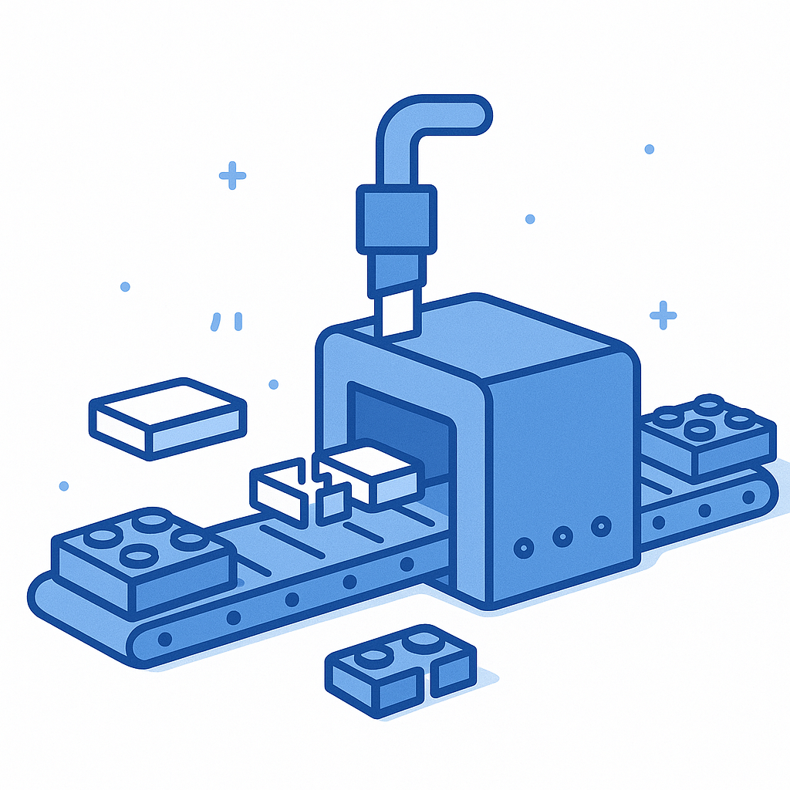
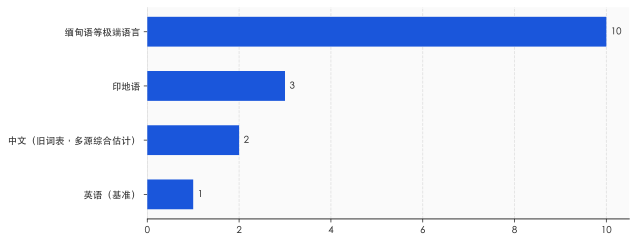
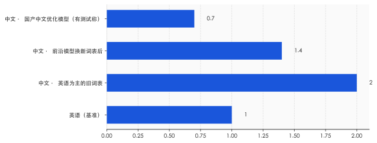

# 一个汉字，在 AI 眼里是三块"积木"

> **发布日期**：2026-06-11 | **分类**：AI 深度观察

## 导语

很多人有个直觉：中文比英文"复杂"，所以 AI 处理起来更费劲、更费钱，这是没办法的事。这个直觉只对了一半。中文确实更费，但贵的不是汉字本身——是"英语太多"这件事，被悄悄写进了大模型最底层的那道工序里。而你既看不见它，也从没为它投过票。

---

## 一、你以为按字付费，其实按"积木"付费

先说一件可能让你意外的事：大模型并不是一个字一个字地读你的话。

你发给它的每一句中文，会先被切成一块块叫 token 的"积木"，模型按积木的数量来收费、来计算、来记忆。这道切割的工序叫 tokenizer，分词器。它才是你和模型之间真正的第一道关口——在模型"思考"之前，你的话已经先被它切过一遍了。

问题就出在怎么切。

今天绝大多数模型用的切法叫 BPE（字节对编码）。它的逻辑很朴素：在训练语料里，哪些字符片段经常一起出现，就把它们合并成一块更大的积木。英文里 "ing" "tion" "the" 总是高频连在一起，于是各自成了一块积木，一个常见英文单词往往只要一两块。中文要复杂些：一个汉字在计算机底层要用 3 个字节存储。最常用的那批字，因为出现得够多，大多也能各自攒成一块完整积木；可一旦碰上不那么高频的字词，或者用的是英语为主、压根没怎么给中文攒过积木的旧词表，很多汉字就合并不成整块，只能拆成两三块字节碎片硬拼。越是不常用、越是没被照顾到的中文，在 AI 眼里就被切得越碎。标题里"一个汉字三块积木"，说的正是这种没被好好照顾时的情形。

结果就是，同样一句话的意思，中文要用掉更多积木。积木更多，意味着三件事同时发生：按 token 计费时账单更高，模型一次能装下的内容更短，每个字吐出来的速度也更慢。

这不是哪家公司故意刁难中文用户。它是一个更冷的事实：分词器的"积木库"是在一堆英文里攒出来的，于是用英文搭东西最省，换成别的语言就开始打折扣。**贵的不是中文，是"英语攒得更多"这件事被焊进了 AI 的底层。**

## 二、还没开始计算，账就已经分了三六九等

这个差距到底有多大？2023 年有一项研究把它量了出来。

牛津大学的 Aleksandar Petrov 等人在那年的 NeurIPS 会议上发表了一篇论文，标题直接就叫《语言模型的分词器在语言之间制造了不公平》。他们拿一套覆盖两百种语言的平行语料——同样的意思、997 个句子、翻译成各种语言——挨个去测，看同一句话在不同语言里被切成多少块积木。

结果是：最极端的两种语言之间，token 数量能差到约 15 倍。也就是说，表达同一个意思，有的语言只需要切十几块，有的语言要切两百多块。即便是那些号称"支持多语言"的分词器，也没能抹平这道沟。

中文落在哪里？Petrov 的论文没有单独标出中文对英文的确切倍数，这一点得说清楚，免得以讹传讹。但综合多个独立测试，在那几年通用的旧词表下，中文大致是英文的两倍上下——你打一段中文，AI 眼里的积木数，差不多是同等英文的两倍。

把这个倍数翻译成你能感觉到的东西，是三笔账。第一笔是钱：按 token 计费的接口，中文每表达同样多的内容，要多付一截。第二笔是记性：模型一次能装下的积木总数是固定的（这就是所谓的"上下文窗口"），中文更占地方，于是同一个窗口里，中文能塞下的实际内容更少——极端语言甚至只剩英文的十分之一。第三笔是速度：积木越多，吐字越慢。

这件事真正刺眼的地方，不在于贵了多少，而在于它发生的位置——它发生在模型开始"思考"之前。**还没进入计算，光是切词这一步，语言就已经被分成了三六九等。** 你以为自己在和一个对所有语言一视同仁的智能对话，可在它真正动脑子之前，那道切割工序已经先按语言给你定了价。

## 三、OpenAI 想修这道不公，结果修出一嘴脏话

好消息是，这件事不是没人管。坏消息是，管起来的样子相当狼狈。

2024 年，OpenAI 发布 GPT-4o 时悄悄换掉了分词器的词表，从原来约 10 万块积木的旧库，扩到约 20 万块的新库，其中大约四分之一留给了非英语。效果立竿见影：按官方说法，同样的内容，中文要切的积木数压缩到了原来的约 1/1.4（少了约三成），印地语压到约 1/2.9，古吉拉特语这类印度语系甚至压到约 1/4.4。这等于 OpenAI 自己承认：旧词表对非英语确实不经济，该补。

补是补了，但补出了新问题。

为了凑出那些中文积木，OpenAI 往词表里塞了大量从网上抓来、却没好好清洗的语料。普林斯顿的博士生 Tianle Cai 把 GPT-4o 词表里最长的 100 个中文 token 翻出来一看，发现其中 97 个不是正常词汇，而是涉黄、赌博、垃圾广告里的长词组——这是《麻省理工科技评论》2024 年 5 月报道的细节。也就是说，模型用来理解中文的那批最"高级"的积木，相当一部分是从灰色产业的网络垃圾里攒出来的。

这不只是难看。研究者随后证明，这些"攒出来却没怎么被训练过"的积木是脆弱点，可以被用来诱导模型胡说八道，甚至绕过安全限制。一道本来想弥补语言不公的工序，反手又开了一个安全口子。

值得琢磨的是整件事里普通用户的位置——你完全不在场。词表怎么定、积木从哪来、清洗到什么程度，全是工程团队在黑箱里完成的决定。你每天用中文和模型对话，却根本不知道自己依赖的那套"积木库"，是用什么料攒出来的。这道决定你说中文贵不贵、稳不稳的底层工序，从头到尾没有征求过你的意见。

## 四、中文并非注定更贵，是谁的语料说了算

讲到这儿，你可能已经得出一个悲观结论：汉字天生吃亏，认命吧。但接下来这部分，恰恰要把前面的故事翻过来。

中文吃亏，从来不是因为汉字有什么先天缺陷，而是因为攒积木的那堆语料里英文太多。那么反过来，如果有人用一堆以中文为主的语料去攒积木，会怎么样？

国产模型给出了答案。像通义千问、DeepSeek 这些主要服务中文用户的模型，做了一件很直接的事：把大量常用汉字、常见词组，整个儿地塞进词表，让它们各自成为一块完整的积木，而不是被拆成字节碎片。这么一调，中文的切割效率立刻就上来了。有测试称，拿同一段平行内容去比，DeepSeek 上中文用掉的积木甚至比英文还少约三分之一——这个数字来源单一、口径也敏感，姑且当个方向看，别当定论，但方向是清楚的：中文完全可以不吃亏，只要攒积木的人，本来就是冲着中文去的。

这恰恰是整件事最该被记住的一层。**所谓"语言税"，根子不是语言学，是话语权——谁的语料更多，谁定义了什么叫"高频"，谁就能把自己的语言切得更便宜。** 它不是刻在汉字里的物理定律，是写在训练数据里的权力分配。能被英语攒走的便宜，也能被中文攒回来。

当然，话不能说满，得补一刀冷水。2026 年有研究者较真地测了一轮，发现只数积木数是片面的：中文优化模型的单块积木单价往往更低，而英语模型的积木数虽多、单价却便宜，两边一抵，所谓"中文更省钱"在不少模型上其实并不成立；更要命的是，同一个模型用中文解题，正确率有时比用英文低好几个百分点——你省下的积木，可能拿答错的概率补了回去。这盆冷水提醒我们：语言税真实存在，但它早已不是"中文一定更贵"这么一句话能概括的了。

## 五、你被切了多少积木，自己看不见

倍数在缩小，国产模型也在反超，那这件事是不是快不算事了？我的看法相反。倍数本身只是表象，真正难解的，是它一直藏在你看不见的地方。

直到现在，你大概率仍然不知道：你刚刚发出去的那句中文，被切成了几块积木；这套切法是按谁的语料定的；你为这几块多付了多少钱、少装了多少内容。这些信息，没有一个写在你和模型对话的界面上。你能看到的只是一个输入框和一段回答，看不到中间那道按语言定价的工序。这种"它在悄悄给你算账，而你浑然不觉"的状态，比贵几倍本身更值得在意。

把镜头拉远一点，这道看不见的工序就成了一条全球的线。在那些语言资源本就稀缺的地方——缅甸、柬埔寨、非洲的许多小语种——这道折扣打得最狠：同样大小的窗口，装得下的母语内容只剩一个零头。越是不发达、母语越小众的地区，用同一个 AI 就越贵、越笨、越早被截断。当智能开始按积木计费，语言就成了一条隐形的贫富线，而画这条线的，是几家公司词表里的语料配比。

所以，作为一个用中文的人，你至少可以做两件具体的事。

一是把这道工序"看见"。找个分词器的可视化小工具（搜 tiktokenizer 这类就有），把你常发的中文段落粘进去，亲眼看看它被切成几块、同样意思的英文又是几块。这一眼，会让"按 token 计费"从一句抽象的话，变成你能算清的账。二是把"中文效率"纳入你选模型的标准。同样的活儿，一个为中文攒过积木的模型，可能比一个英语为主的模型更便宜也更跟手——这本是你该享受的便宜，别白白让给默认选项。

回到开头那个画面：一个汉字，在 AI 眼里被切成三块积木。这件事的演变，藏着一个更大的问题——当变聪明这件事开始论"积木"收费，你用什么语言，就在很大程度上决定了你能多便宜地变聪明。**而这条按语言划下的价格线，从头到尾，没有人请你投过票。**

---

## 数据来源

- [Language Model Tokenizers Introduce Unfairness Between Languages（Petrov et al., NeurIPS 2023）](https://arxiv.org/abs/2305.15425)
- [Tokenization Fairness 交互式可视化（Aleksandar Petrov）](https://aleksandarpetrov.github.io/tokenization-fairness/)
- [Hello GPT-4o：o200k_base 词表与多语言 token 压缩（OpenAI, 2024）](https://openai.com/index/hello-gpt-4o/)
- [GPT-4o's Chinese token-training data is polluted by spam and porn（MIT Technology Review, 2024.05）](https://www.technologyreview.com/2024/05/17/1092649/gpt-4o-chinese-token-polluted/)
- [Tokenization Disparities as Infrastructure Bias（arXiv:2510.12389, 2025）](https://arxiv.org/abs/2510.12389)
- [AI 大模型的"中文税"：中文比英文更费 Token（中文综述，含国产模型对比，数字需复核）](https://www.36kr.com/)
- [tiktokenizer：在线分词器可视化工具](https://tiktokenizer.vercel.app/)
