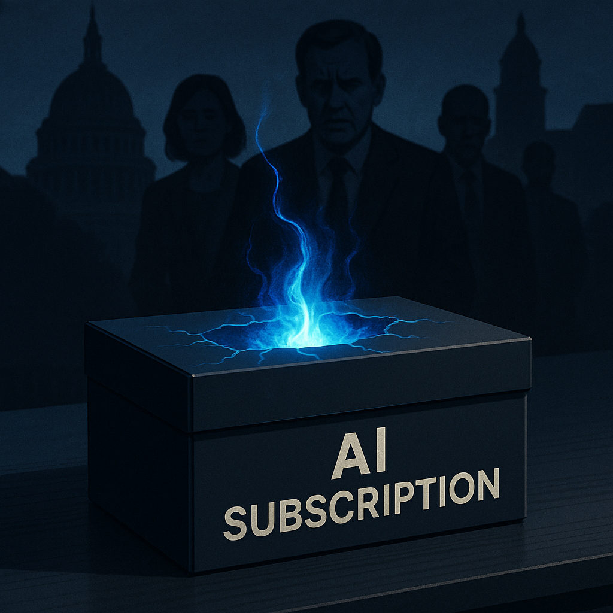
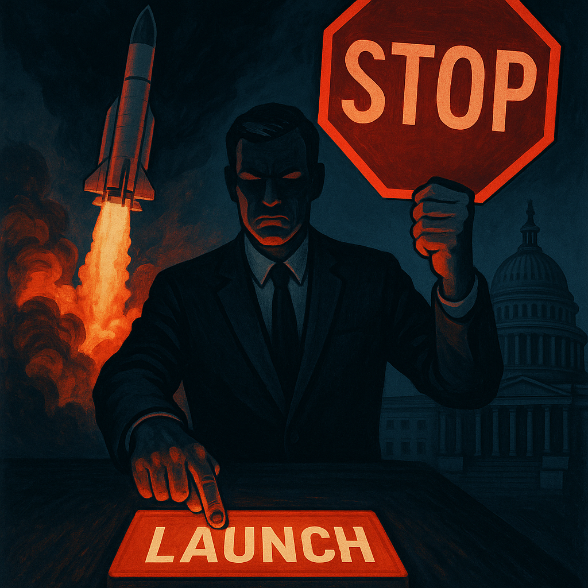

# Anthropic 把吓到国会的 AI 装进消费者订阅里，叫它「寓言」

> **发布日期**：2026-06-11 | **分类**：AI 深度观察

## 导语

6 月 9 日，Anthropic 发布了 Claude Fable 5。三个月前，同一家公司的同一项技术，让美国国会开了听证会，让白宫签了行政令，让全球政府发了一波警告。现在，它每百万输入 token 收你 10 美元。Dario Amodei 在发布会结束后第二天，公开呼吁要给 AI 公司套上更严的法规。这两件事，是同一家公司在同一周干的。

---

## 一、让政府「寒毛直竖」的，是哪项技术

Fable 5 是 Anthropic Mythos 系列模型的「消费者版」。Mythos，神话。这个命名不是随便起的。

今年早些时候，Mythos Preview 被证明能发现**数千个关键漏洞**——覆盖主流操作系统、网络浏览器、关键基础设施的未知安全漏洞，能跑出完整的攻击链。NBC 新闻的报道用了一个短语：「built on the same tech that spooked the government」——建立在吓到政府的同一项技术之上。

「吓到」不是修辞。这项能力成为了**国会听证会、国家安全文件和白宫行政令**的直接主题。特朗普政府随后签署行政令：前沿 AI 模型发布前 30 天，须向联邦政府提供访问权限。也就是说，在 Fable 5 正式上线之前，政府拿到它足足看了一个月。

你现在也可以用它了。

## 二、「安全护栏」的实际工作方式

Anthropic 当然知道把这件事直接推给消费者会引发什么问题，所以 Fable 5 带了一套安全架构。值得认真看看它是怎么运作的，因为它比你想象的更微妙——也更让人玩味。

触发「危险」分类器时，Fable 5 **不会拒绝你的请求**。它会把你的问题转给 Claude Opus 4.8——能力更弱、但被认为更安全的上一代模型——然后把答案返回给你。整个过程走同一个 API 调用，同一个 model ID，**你不会收到任何通知说刚才用的不是 Fable 5**。

三个领域会触发这个切换：网络安全（Fable 5 最强的能力所在）、生物和化学、以及模型蒸馏防护（防止有人通过大量对话来复制模型）。

平均触发率不到 5%。也就是说，95% 以上的时间里，你用的都是完整的 Fable 5。

这个机制有一个隐含的前提，值得挑出来看：**危险问题并没有被拒绝，只是被降级处理了**。Opus 4.8 不是一块砖，它仍然是当时最强模型之一。「危险的事情用更笨的模型来做」——这是安全，还是安全剧场？Anthropic 没有公布哪些查询触发了切换，也没有说 Opus 4.8 在这些场景下的拒绝率有多高。

## 三、SWE-Bench Pro 80.3%：这个数字意味着什么

撇开政策争论，Fable 5 在能力上确实是另一个档次。

SWE-Bench Pro（真实开源代码库的 bug 修复任务，被认为比学术基准更接近实际工程难度）：Fable 5 跑出了 **80.3%**，SWE-Bench Verified 是 **95.0%**。同一测试下，GPT-5.5 是 58.6%，Gemini 3.1 Pro 是 54.2%。

22 个百分点的领先，不是「略微领先」，是一代人的差距。

一个早期客户做了个测试：一项前沿物理研究任务。Fable 5 用 36 小时跑完，消耗了三分之一的推理 token；GPT-5.5 用了 4 天。绝对价格上 Fable 5 更贵（$10/百万 input，GPT-5.5 是 $5），但算效率账，对重度任务用户来说，Fable 5 反而可能更省。

代码能力强不是一句中性的技术描述。SWE-Bench 测的是真实 GitHub 仓库的 bug——就是互联网基础设施、金融系统、医疗软件每天在跑的那种代码。一个能修掉 80% 现实 bug 的模型，和一个能找到数千个未知漏洞的模型，在某种程度上，描述的是同一种能力的两面。

## 四、发布后第二天，CEO 呼吁立法

Fable 5 发布次日，Dario Amodei 公开发表声明，要求给 AI 公司施加更严格的法律约束，包括要求前沿模型发布前经过独立安全评估，以及给监管机构授权**阻止不安全 AI 发布**的权力。

在同一周，他宣布了目前全球最强的可用模型，然后呼吁立法来管理像这样的模型。

这可以被理解为表里不一的公关。也可以被理解为一种真实的张力——Anthropic 相信自己的模型是「相对安全的那个选项」，所以发布它；同时相信整个行业需要更严格的规则，所以要求立法。

两种解读都成立。让它们同时成立的前提，是你接受「我这个是相对安全的，所以要放出来」这个逻辑。

Anthropic 的整个商业模式，在某种程度上依赖于公众接受这个前提。

## 五、「寓言」是个有意思的名字

Fable——寓言。通常是带着教训的故事，讲给需要被教育的人听。

Anthropic 的模型命名系列之前叫 Claude，再之前叫 Opus、Sonnet、Haiku，后来是 3.5、3.7，然后跳到了 4.x，现在是 Fable 和 Mythos。这是一条从工具名（诗体）到神话名（神明）再到叙事名（故事）的路径。

叙事，是 Anthropic 一直以来最擅长的东西。「负责任的 AI」、「安全优先」、「慢下来想清楚」——这套叙事让他们拿到了数百亿美元融资，让他们有了区别于 OpenAI 的市场定位，让他们坐上了国会的证人席。

Fable 5 是一篇寓言。寓言的教训是什么，取决于你怎么读这件事。

一种读法：Anthropic 花了好几年建立「安全」信誉，然后用这笔信誉背书，把业界最强的模型推向市场。这是品牌资产的变现，没有什么特别可指责的。

另一种读法：能力 vs. 安全，这个行业叙事里的终极张力，在 Fable 5 身上找到了一个新的平衡点——不是「更安全所以更弱」，而是「更强，但我们告诉你这是安全的」。无论你信不信，这套话术第一次跑通了商业闭环。

你现在也可以用它了。6 月 22 日之前免费。

---

## 数据来源

- [Anthropic releases Fable 5 model, built on the same tech that spooked the government（NBC News）](https://www.nbcnews.com/tech/security/fable-5-anthropic-release-public-mythos-claude-model-rcna349104)
- [Claude Fable 5 and Mythos 5（Anthropic 官方）](https://www.anthropic.com/news/claude-fable-5-mythos-5)
- [Inside Claude Fable 5's Safety Architecture: Classifiers, Opus 4.8 Fallback, and 30-Day Retention](https://claude5.ai/en/news/claude-fable-5-safety-architecture-classifiers-opus-fallback)
- [Claude Fable 5 vs GPT-5.5 vs Gemini 3.1 Pro（Lushbinary）](https://lushbinary.com/blog/claude-fable-5-vs-gpt-5-5-vs-gemini-3-1-pro-comparison/)
- [Claude Fable 5 and Mythos 5: Pricing, API Costs, and Benchmark Comparison](https://www.finout.io/blog/claude-fable-5-mythos-5-pricing-benchmarks)
