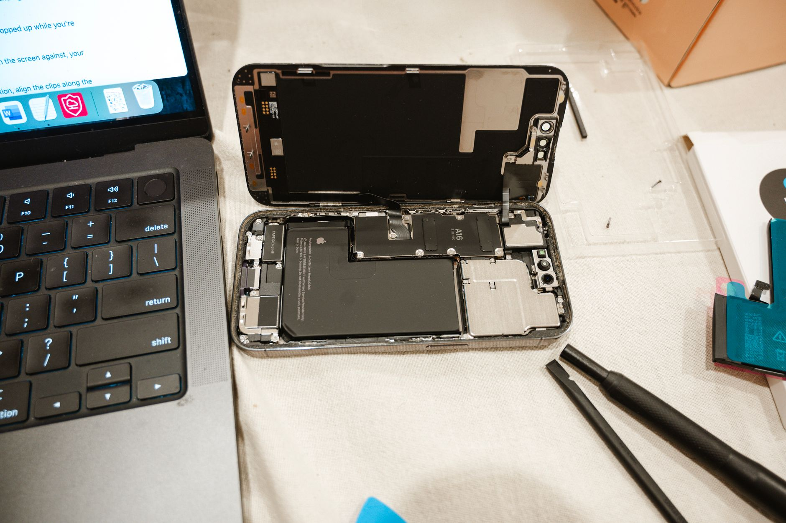
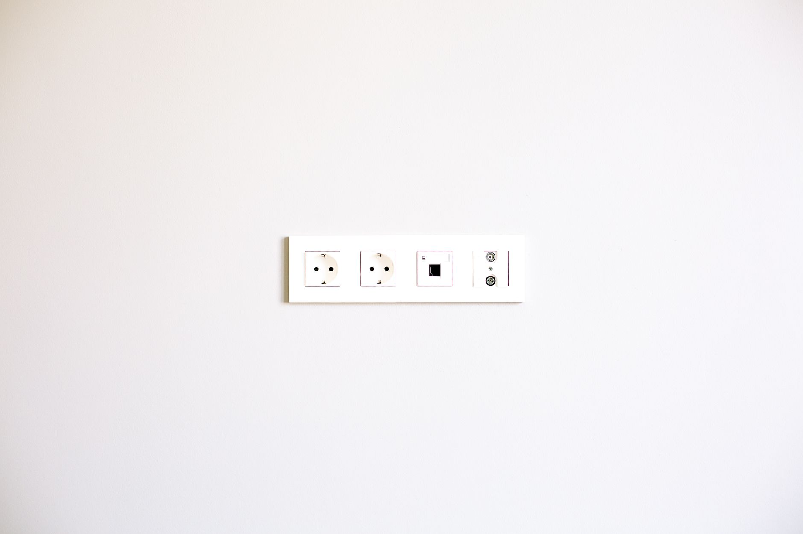
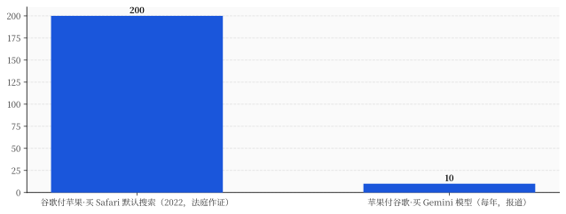
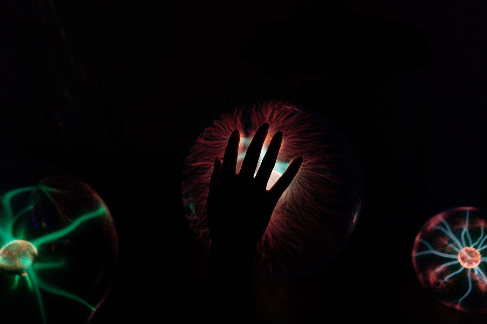

# 苹果请谷歌帮它造 AI，转头当众说"这里面一滴谷歌都没有"

> **发布日期**：2026-06-11 | **分类**：AI 深度观察

## 导语

6 月 8 日，库克在他职业生涯最后一场 WWDC 的舞台上，宣布了"次世代 Apple Intelligence"和一个全新的 Siri。官方通稿里有一句很讲究的话：这套东西，是"与谷歌及其 Gemini 模型协作定制"的（custom-built in collaboration with Google and its Gemini models）。

同一场发布会，软件主管 Craig Federighi 接受采访时说了另一句话：我们用到的谷歌助手的量，是"零"（none）。苹果自家的模型里，"一滴 Gemini 都没有"。

把这两句话叠在一起看，画面就有点喜感了：一家公司，一年掏大约 10 亿美元给谷歌，请谷歌帮它把 AI 搞定，然后站在台上，一脸真诚地告诉全世界——这里面没有谷歌。

很多人看完 WWDC 的结论是"苹果在 AI 上落后了、认怂了、被谷歌拿捏了"。这个判断，错得相当离谱。苹果不是在 AI 上认输，它是在用一套玩了四十年的老打法，把全世界最贵、最自负的那批大模型厂商，一个一个摁成了可以随时拔掉的零件。

---

## 一、苹果造不出前沿模型，这不丢人——丢人的是它演了两年"快了"

先把一件事说清楚：苹果，真的，造不出第一梯队的大模型。

这不是黑它，是它自己用论文承认的。2025 年 7 月，苹果机器学习团队发了份技术报告，白纸黑字写自家那个跑在云端的模型：能"勉强对得过 Llama-4-Scout"，但"落后于更大的模型，比如 Qwen-3-235B 和 GPT-4o"。翻回 2024 年第一版，那个云端模型对 GPT-3.5 的胜率大约是 52%——注意，是 GPT-3.5，而且赢得勉勉强强，至于 GPT-4，苹果压根没敢拿来比。更微妙的细节是：苹果训练这些模型，用的是谷歌的 TPU 芯片。从一开始，谷歌的影子就在了。

模型不行，可以慢慢追。问题是苹果连"慢慢追"都没演明白。

2024 年那场 WWDC，苹果当着全世界承诺了一个"更懂你"的 Siri：能看懂你的屏幕、能记得你的私人语境、能跨 App 替你办事。原定 2025 年春天、跟着 iOS 18.4 就发。结果到了 2025 年 3 月 7 日，苹果发言人 Jacqueline Roy 在一个安静的周五发了份声明，核心就一句："这些功能要花的时间比我们预想的久，预计明年再推。"

"明年再推"是对外的体面说法。对内是什么样呢？那阵子一份泄露的内部会议记录显示，主管这摊事的高管自己都用了"难看"（ugly）和"尴尬"（embarrassing）这种词。紧接着，3 月 20 日，库克直接动了组织架构：把 Siri 从 AI 负责人 John Giannandrea 手里夺走，交给做 Vision Pro 的 Mike Rockwell，让他直接向 Federighi 汇报。一年后，Giannandrea 本人也基本退场了。

人也没留住。苹果那个负责造大模型的核心团队，统共也就五六十号人。2025 年 7 月，团队头儿 Ruoming Pang 被 Meta 用一份超过 2 亿美元的合同挖走，一个月内接连走了四个核心研究员。一边是几十个人的小作坊，一边是 Meta 拿着上亿美元满世界抢人——这仗根本不在一个量级上。

造不出、跳了票、人还跑了。摆在库克面前的选择其实只剩一个：买。

## 二、它觉得 Claude 更好，却挑了便宜的 Gemini——"零件"两个字，就写在这一步上

苹果买之前，是认真比过价的。

据彭博的 Mark Gurman 报道，苹果给新 Siri 找大脑时，搞了一场"赛马"：候选里有谷歌的 Gemini，也有 Anthropic 的 Claude。结论挺有意思——苹果其实觉得 Claude 更能打。但 Anthropic 开的价是"每年几十亿美元，而且三年里逐年翻倍"。苹果一听，扭头就走，签了一年大约 10 亿美元的谷歌。

请你把这一步在脑子里慢放一遍：苹果手握全世界最值钱的一块屏幕入口，挑 AI 大脑的时候，明明判定 A 更聪明，最后却因为 A 太贵，买了便宜的 B。

这个动作，所有人都见过——这不就是你买东西的样子吗？这也正是苹果几十年来对待供应商的标准姿势：买屏幕找三星和京东方互相压价，买基带能自己造就甩开高通，买摄像头模组、买存储、买代工，全是货比三家、谁便宜用谁、随时准备换人。

当一样东西，"更聪明"换不来订单，只有"够用而且便宜"才能成交，它在采购方眼里就完成了一次降级：从一项让人敬畏的技术，变成了一笔可以拿去比价的生意。

**更聪明不是议价权，够用且便宜才是——这就是零件的定义。**

大模型厂商最不愿意承认的，恰恰是这件事。他们花了几百亿美元、烧了无数张显卡，坚信自己造的是"智能"，是要颠覆一切的核武器。而苹果用一场赛马告诉他们：在我这儿，你们是可比价的零部件，编号不同而已。

## 三、苹果给大模型发了一张"零件证"：一个协议

如果说"赛马比价"还只是态度，那苹果接下来这一手，是把"你就是个零件"写进了技术规范里。

WWDC 上，苹果给开发者上线了新的 Foundation Models 框架。它的官方开发者文档里有这么一句，平淡得吓人："你现在可以使用任意语言模型，包括苹果自己的基础模型、像 Claude 和 Gemini 这样的云端模型，或者任何一个实现了'语言模型协议'（Language Model protocol）的提供方。"

读懂这句话，你就读懂了整件事。

苹果亲手定义了一个叫"语言模型协议"的接口。任何大模型，只要实现这个协议，就能插进苹果的系统；开发者一行代码都不用改，就能在 Claude、Gemini、自家模型之间来回切换。Anthropic 已经乖乖发了个 Swift 包来对接它。

为一类东西定义一个统一接口，这个行为本身，就是一份宣言。当年电脑厂商定义了 USB，U 盘、鼠标、键盘、硬盘就成了可以随便插拔的标准件；当年有人定义了 SQL，底下是甲骨文还是 MySQL，上层应用根本不在乎。今天苹果定义了"语言模型协议"，潜台词清清楚楚——

**定义一个协议，就是当众宣布：协议背后那个东西，可以随时换。**

消费者那头，玩法一模一样。新 Siri 默认用谷歌，但你要是不喜欢，可以去设置里把"扩展"（Extensions）换成 Claude、ChatGPT 或别的——默认关闭，你自己选，一次只能开一个。苹果甚至贴心地让第三方模型回答时用一种和 Siri 不同的声音，方便你听出来"这句话不是我亲生的"。

曾经独家供货的 OpenAI，如今被降成了选项之一，据报道气得在考虑起诉苹果。可气也没用——货架是苹果的，摆谁、摆在第几格、要不要给你个默认位，规矩都是房东定的。

大模型从"谁家的大脑"，变成了"插在哪个口上的零件"。这一步，苹果做得悄无声息，却比任何一句"我们 AI 很强"都狠。

## 四、"一滴谷歌都没有"——这才是最苹果的一句话

现在我们回到开头那个喜感的画面：苹果一年给谷歌 10 亿，却说自己"一滴谷歌都没有"。

这话拆开看，其实没撒谎，但每个字都是设计过的。官方口径是"与谷歌及其 Gemini 模型协作定制"；机器学习团队的论文说得更技术——苹果自家模型是"用 Gemini 前沿模型的输出来精炼（refined）"的。说人话，就是请 Gemini 当老师，把它的能力"蒸馏"进自己的小模型里。跑在苹果设备和私有云上的，确实是苹果自己那几个蒸馏出来的模型，所以 Federighi 敢说"一滴 Gemini 都没有"。

可与此同时，谷歌官方发了联合声明，确认这是一份多年合作；为了这件事，苹果的私有云计算（Private Cloud Compute）历史上第一次伸到了自家机房之外，跑到了谷歌云、谷歌的英伟达 B200 显卡上。最重的那部分 Siri 推理，烧的还是谷歌的算力。

所以真相是：老师是谷歌，学费一年 10 亿，最累的活儿外包给谷歌的机房——而对外，只署苹果一个名字。

这不是苹果第一次这么干，这就是苹果。你手里的 iPhone，组装是富士康，最先进的芯片制程是台积电，传感器里有索尼有三星，当年的基带是高通——所有最难、最脏、最重资产的环节，全外包给供应商，再统统塞进一个黑箱，正面只留一个被咬了一口的苹果 logo。苹果卖给你的从来不是零件，是"体验"和那个 logo。

把这套逻辑搬到 AI 上，剧本一字没改：模型这个最烧钱、最难追、迭代最快、最容易贬值的环节，外包出去；自己死死攥住界面、攥住那个叫 Siri 的入口、攥住和 15 亿用户的关系。

连最该出问题的"隐私"，苹果都用话术圆了过去。它过去标榜的隐私是一种架构隐私——数据不离开你的设备，不动的数据就没法被滥用。现在数据要送去谷歌云了，怎么办？苹果的新说法是合同隐私：我们把你的请求匿名化、token 化，谷歌看不出是谁，而且合同里写死了谷歌不许拿你的数据去训练。

这两种隐私，根本不是一回事。前者你信的是物理，后者你信的是两家公司的合同和人品。但对苹果来说无所谓——它要守住的从来不是"模型在哪跑"，而是"用户觉得这是苹果"。

## 五、谁在求谁：200 亿对 10 亿的反向流

有人会说：苹果给谷歌递钱，这不就是矮了一截、求着谷歌吗？

正好相反。你把另一笔账翻出来看就懂了。

在美国司法部告谷歌垄断的庭审上，苹果高管 Eddy Cue 作证过一个数字：光是 2022 年，谷歌为了当 Safari 浏览器的默认搜索引擎，一年付给苹果大约 200 亿美元，按搜索广告收入的 36% 分成。这是法庭实锤，跑不掉的。

现在反过来：苹果当买家、买谷歌的模型，一年付多少？大约 10 亿。

200 亿对 10 亿。即便苹果这次是掏钱的那一方，它付出去的，也只有谷歌为了挤进 iPhone 而付给它的二十分之一。更绝的是，谷歌之所以能拿下这单 AI 生意，业内普遍认为，恰恰因为它早就被那 200 亿的默认搜索关系拴在 iPhone 这棵树上——它太怕丢掉这个入口了，给苹果当 AI 供应商，半是生意，半是续费保平安。

这就是分发的力量。握着 25 亿台活跃设备、握着那个开机就在、张嘴就能用的默认槽位的人，哪怕当买家，也照样是甲方。模型再聪明，进不了这 15 亿块屏幕，就只是 PPT 上一个漂亮的分数。

**分发吃模型。** 这五个字，是整场 WWDC 真正的标题。

## 六、颠覆者排着队，来当 iPhone 里的一个可选项

最能说明问题的，是 Anthropic 的沉默。

Claude 进了 iPhone 的"扩展"，按理说是天大的渠道利好——一夜之间能摸到几亿台设备。可你去 Anthropic 官网翻，关于 Siri、关于 iPhone、关于这件事，一个字的官方公告都没有。它高调发过"Claude 进了 Xcode"，因为那是它作为工具的胜利；但被摆上消费者货架当一个可选项这事，它一声不吭。

被摆上货架的零件，是不会开庆功会的。

往前看，这盘棋的结局其实早有剧本——就是搜索框那个剧本。今天的 AI 槽位，ChatGPT 给苹果分成、Gemini 免费默认占着位，看着一团和气。但搜索框的故事告诉过我们后面是什么：当这个默认入口变得足够值钱，苹果迟早会把"默认大脑"这个位置拿出来竞价。谁想当那个开机自带的 AI，请排队，请出价。模型厂商烧了几百亿美元造出来的"智能"，最后要花钱买的，是苹果货架上一个最显眼的格子。

所以，如果你正押注在大模型这一层——无论是投钱，还是把公司架在某个模型上——WWDC 这一课值得抄下来：模型最强，不是护城河；分发，才是。最聪明的 Claude 输给了便宜的 Gemini，而它俩最后都得排队插进苹果定义的那个协议口。要么你自己握住一个入口，要么你早晚被"协议化"成一个可热插拔的零件。

再回到那句"一滴谷歌都没有"。

一家公司，能一边一年给你递 10 亿美元，一边当着全世界说你不存在——这本身就说明，在它眼里，你早就不是什么颠覆者了，你是个零件。

而零件，是没有名字的。

## 数据来源

- [Apple unveils next generation of Apple Intelligence, Siri AI, and more — Apple Newsroom（2026-06-08）](https://www.apple.com/newsroom/2026/06/apple-unveils-next-generation-of-apple-intelligence-siri-ai-and-more/)
- [Apple introduces Siri AI — Apple Newsroom（2026-06-08，"custom-built in collaboration with Google and its Gemini models"）](https://www.apple.com/newsroom/2026/06/apple-introduces-siri-ai-a-profoundly-more-capable-and-personal-assistant/)
- [Introducing the Third Generation of Apple's Foundation Models — Apple ML Research（"refined using outputs from Gemini frontier models"）](https://machinelearning.apple.com/research/introducing-third-generation-of-apple-foundation-models)
- [WWDC26 Apple Intelligence developer guide — Apple Developer（"any language model… like Claude and Gemini… that conforms to the Language Model protocol"）](https://developer.apple.com/wwdc26/guides/apple-intelligence/)
- [Apple Intelligence Foundation Language Models Tech Report 2025 — arXiv 2507.13575（自承"落后 Qwen-3-235B 和 GPT-4o"）](https://arxiv.org/pdf/2507.13575)
- [Apple says its AI models were trained on Google's custom chips — CNBC（2024-07-29，训练用 Google TPU）](https://www.cnbc.com/2024/07/29/apple-says-its-ai-models-were-trained-on-googles-custom-chips-.html)
- [Apple confirms delay of AI-infused personalized Siri — Bloomberg（2025-03-07 官方延期声明）](https://www.bloomberg.com/news/articles/2025-03-07/apple-confirms-delay-of-ai-infused-personalized-siri-assistant)
- [Meta offered Apple's head of foundation models more than $200M — 9to5Mac（2025-07-09，Ruoming Pang 出走）](https://9to5mac.com/2025/07/09/meta-offered-apples-head-of-foundation-models-more-than-200m-to-jump-ship/)
- [Apple 'runs on Anthropic,' says Mark Gurman — 9to5Mac（2026-01-30，赛马选 Gemini、Anthropic 要价几十亿逐年翻倍）](https://9to5mac.com/2026/01/30/apple-runs-on-anthropic-says-mark-gurman/)
- [Google confirms multiyear AI deal to power Apple models, Siri — Bloomberg（2026-01-12，约 10 亿/年）](https://www.bloomberg.com/news/articles/2026-01-12/google-confirms-multiyear-ai-deal-to-power-apple-models-siri)
- [Apple's new foundation models don't contain a drop of Gemini — AppleInsider（2026-06-08，Federighi "none"）](https://appleinsider.com/articles/26/06/08/apples-new-foundation-models-dont-contain-a-drop-of-gemini-as-we-said-they-wouldnt)
- [iOS 27 will let you choose between Gemini, Claude and more — 9to5Mac（2026-05-05，Extensions 默认关闭/用户自选）](https://9to5mac.com/2026/05/05/ios-27-will-let-you-choose-between-gemini-claude-and-more-for-ai-features-report/)
- [OpenAI considering legal action against Apple over 'strained' Siri partnership — MacRumors（2026-05-14）](https://www.macrumors.com/2026/05/14/openai-considering-legal-action-against-apple/)
- [Google's payments to Apple reached $20 billion in 2022, Cue says — Bloomberg（2024-05-01，36% 分成，法庭作证）](https://www.bloomberg.com/news/articles/2024-05-01/google-s-payments-to-apple-reached-20-billion-in-2022-cue-says)
- [Apple reaches 2.5 billion active devices — 9to5Mac（2026-01-29，Q1 FY2026）](https://9to5mac.com/2026/01/29/apple-reveals-it-has-2-5-billion-active-devices-around-the-world/)
- [Apple is expanding Private Cloud Compute beyond its own data centers — Neowin（PCC 扩到谷歌云 + 英伟达）](https://www.neowin.net/news/apple-is-expanding-private-cloud-compute-beyond-its-own-data-centers/)
