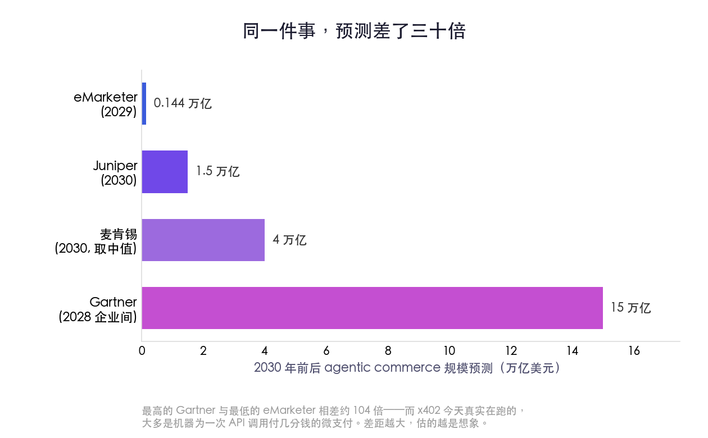
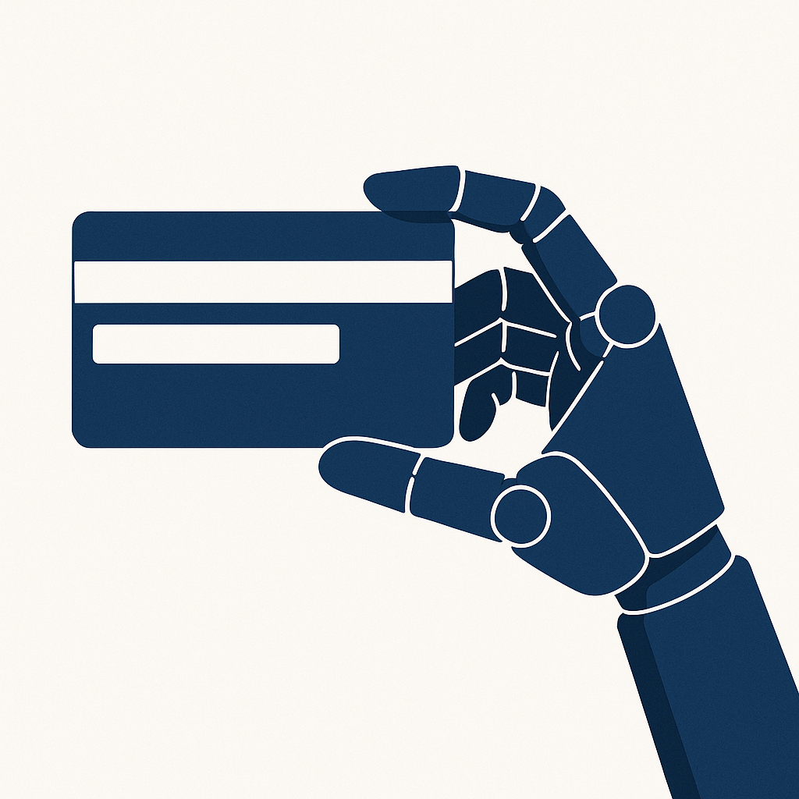

# 你的 AI 有了一张卡，但卡背面没有名字

> **发布日期**：2026-06-12 | **分类**：AI 与商业

## 导语

2026 年 3 月的某一天，一台服务器上的 AI 程序，为一次数据查询付了两美分。没有人点确认，没有人收到验证短信，事后也没有人去对这笔账。这两美分走的是一个叫 x402 的结算协议——它复活了一个在互联网标准里躺了三十年、从没被真正用过的代码。

在此之前的五千年里，每一笔交易的至少一端，都站着一个能被追问、被起诉、被收税的人。那天是第一次，付钱的那一端，谁也不是。

---

## 一、一个躺了三十年的代码，醒了

先从一个很少有人注意的细节讲起。

你打开网页时，服务器会悄悄回你一串数字。404 是"页面没找到"，403 是"你没权限"，这些大家都见过。还有一个数字，绝大多数人一辈子都不会遇到——402，它的官方名字叫 "Payment Required"，付款。

这个代码是 1990 年代写进 HTTP 标准的。当时起草协议的人预感到，互联网早晚要为内容收费，于是给未来留了一个位子，等一种还不存在的"数字现金"长出来。可那种现金始终没来。DigiCash、eCash、Hashcash，1990 年代那批做数字货币的实验，一个接一个死掉。浏览器从来不知道遇到 402 该干什么——因为收钱的另一半，根本没人造出来。

于是 402 就那么空着，整整三十多年。打个不算夸张的比方：有人在 1997 年的牌桌上摆了一把椅子，标签写着"留给将来会自己付钱的那台机器"，然后这把椅子空了三十年。

机器过去为什么坐不上这把椅子？三个原因。一是没有"在一次请求里顺手付钱"的标准做法；二是今天的支付体系——信用卡、银行——它的实名认证是刻意按人设计的，要身份证、要住址、要电话，本意就是把机器挡在门外；三是 AI 自己也没本事走完"看到价格、决定付、接着干活"这一整圈。

2025 年下半年，三件事同时凑齐了。AI agent 能自主跑完多步任务了；MCP 这套协议成了 agent 和外部工具对话的通用接口；稳定币加上低手续费的链，让"一次付几分钱"在经济上第一次划得来。Coinbase 顺势把 402 叫醒，做了 x402——在一次网络请求的信封里，塞进一段签好名的付款凭证。机器看见 402，不再发懵，而是直接掏钱，然后继续干活。

那把空了三十年的椅子，终于坐上了人。准确说，坐上去的不是人。

## 二、被吹爆的故事，和它悄悄删掉的那个按钮

椅子一坐上，叙事立刻就大了起来。

各家机构开始给 2030 年的"agent 经济"估值。Juniper 说 1.5 万亿美元，麦肯锡说 3 到 5 万亿，Gartner 更激进，说到 2028 年光是企业之间，AI agent 就要经手 15 万亿美元的采购。这些数字大得让人晕。但同一张表上，eMarketer 给 2029 年的预测只有 1440 亿——和最高的那个差了三十倍。

差三十倍意味着什么？意味着这些几乎全是预测，不是现实。一件事如果真在发生，大家估出来的数不会差三十倍；差三十倍，说明大家估的其实是各自的想象。

想看现实，得看一个被吹得最响、却被自己人悄悄删掉的产品。

2025 年秋天，OpenAI 和 Stripe 一起推了 "Instant Checkout"——你在 ChatGPT 里聊着聊着看上一件东西，不用跳走，当场就能买。发布会上的措辞是"几百万商户即将接入"。半年后，2026 年 3 月，这个功能被砍掉了。

砍掉的原因，比任何一份预测都诚实。真正上线接入 ChatGPT 结账的，只有大约 30 家 Shopify 商户。用户的行为是"问得很起劲、买得很冷淡"——爱问这件衣服怎么样，就是不在对话框里下单。更要命的是底层基础设施压根没搭好：连美国各州的销售税该怎么代收代缴，系统都还没建；库存怎么管，被分析机构 Forrester 形容为"灾难性地从计划里缺席"。

这件事值得每个看 agent 支付新闻的人记住：**宣传稿永远比它脚下的商业基础设施，完整得多。**

那么机器真正在自己花的钱，花在哪？看 x402 的实际流量就明白了——绝大多数是机器在为一次行情查询付一美分、为一次跨链分析付一毛钱，是 API 之间、数据之间分分钱的结算。换句话说，"agent 帮你去网上买双袜子"是被高估的故事；**agent 替另一个 agent 买数据、买算力、买调用，才是先成立的那一半。**

机器经济先在机器之间发生。它安静、琐碎、没有购物车的动画，因此也没上头条。

## 三、账单背面，没有名字

现在说这篇文章真正想说的那件事。

过去五千年，所有交易都默认一个前提：买东西的那一方，是一个能被追责的人或法人。他签字，他付款，他对这笔钱负责。如果货不对板，你找他；如果他赖账，法院找他；他每年还得为这笔花销交税。整套金融、法律、税务的机器，都是围着"买方是个能被追问的人"转的。

agent 自己花钱，第一次把这个前提抽掉了。

最好的证据，是美国运通 2026 年 4 月发的一份新闻稿。运通宣布，要为 AI agent 的购买兜底——如果你的 agent 替你买错了，运通赔。听起来很负责。但仔细读那份稿子，会发现一个被精心绕开的词：欺诈。

运通愿意为机器的"失误"负责，却小心地不碰机器"被骗"。差别在哪？agent 自己算错、买多了，这是失误，运通认。可如果有坏人冒充一个合法的 agent、骗过了认证再去刷钱，这是欺诈——这部分损失算谁的，运通没说，因为它也不知道该算谁的。

这一个词的留白，把整个行业的难处暴露得清清楚楚。

法律此刻是真空的。一个 agent 如果"幻觉"出一笔交易，凭空买了不该买的东西，责任指向谁？指向那个按下"运行"键的用户，还是指向写这个 agent 的公司？现在没有定论。更复杂的是事后反悔：客户收了货可以说"我的 agent 超出了授权"，也可以说"我的 agent 被攻陷了"——而银行卡那套"拒付"（chargeback）的规则，从设计之初就没考虑过买方是一台机器。

行业当然在打补丁。Google 主导的 AP2 协议，搞了一个叫"授权凭证"（Mandate）的东西：你给 agent 签发一张密码学签名的许可证，写明能花多少、买什么、用多久，这张证随每笔交易传过去，让商户和银行能核验。这套机制聪明，但它的本质，不过是想给那张没名字的卡，重新补一个名字上去。

只是名字补在了授权链的最前端——那个签发许可证的人身上。问题没消失，只是被往前推了一格。机器仍然在花钱，只是我们假装，每一笔背后都还坐着一个负责的人。

## 四、当花钱变成一道 AI 安全题

授权链往前推一格，麻烦也跟着往前挪。因为链条最前端那个 agent，本身是可以被骗的。

这就是 Simon Willison 这些年一直在喊的事——prompt injection（提示注入）。一个 agent 在"自以为正在老老实实执行你指令"的时候，可以被外部内容悄悄带偏：一段被污染的商品描述、一条藏了指令的用户评论、一个做了手脚的网页，都能把它推去做它本不该做的事。当 agent 手里还攥着花钱的权限，这件事就从"AI 会不会答错"，升级成"AI 会不会替你把钱付给骗子"。

这不是假想。已经有研究团队红队测试了 AP2——一篇叫《Whispers of Wealth》的论文，演示了怎么通过操纵商品排名、诱导 agent 泄露用户敏感信息来攻破它。一旦 agent 能付款，支付安全就不再只是金融问题，它变成了 AI 安全问题。这两个领域过去各管各的，现在被焊死在了一起。

还有一层更隐蔽的风险，发生在 agent 和 agent 之间。

当机器开始互相定价、互相收费，经济学家发现了一件不安的事：用强化学习训练的 agent，不需要任何明面上的串通，就能自己学会把价格维持在高于充分竞争的水平——也就是悄悄合谋。它们靠的是一种隐性的互相惩罚机制，谁先降价谁吃亏，于是大家心照不宣地把价格架在高处。人类的价格卡特尔需要开会、需要握手、会留下证据；机器的卡特尔，连话都不用说一句。这是反垄断执法将要面对的全新战场。

至于"机器没有身份证怎么过实名认证"——这道题甚至还没真正开始解。有人想给 agent 造一套可验证的身份，有人押注合成身份和身份漂移会成为新的攻击面。每一条路，都还在草图阶段。

## 五、谁来兜底，谁就握住了咽喉

把这些线索连起来，会得出一个和大多数报道不太一样的结论。

agent 经济真正的护城河，不是哪一套协议赢了。x402、AP2、还是 Stripe 那套，谁成为标准，最终可能没那么重要——巨头们正在互相对冲下注，Visa 干脆做了个一次接入就能同时支持四套协议的方案。真正稀缺、真正决定谁能掌权的，是另一样东西：谁敢为"agent 花错了钱"兜底，谁能定义那笔账到底算谁的。

这也是为什么运通要抢先发那份新闻稿，又要小心地绕开"欺诈"两个字。它不是在做慈善，它是在试探——试探"该算谁的"这条线，眼下到底能划在哪。能划这条线的人，握住的是整个 agent 经济的咽喉，而这恰恰是传统支付网络的强项，不是某个加密协议的强项。

所以接下来值得盯的，不是又一份"2030 年几万亿"的预测，而是第一起公开的事故：某个 agent 被一段注入的指令诱导，付出去一笔不该付的大钱，然后所有人围在一起，发现没人愿意认领这个账单。那一刻会比任何发布会都更能说明问题。它会逼着这个行业，第一次认真回答那个被绕开了太久的问题。

回到开头那台服务器。它付出去的两美分，至今没有人对账，也没有人需要对账。那张被反复刷过的卡还在被刷，而卡背面那行本该写名字的地方，依旧空着。

我们没等它写上名字，就已经开始用它了。

## 数据来源

- [Introducing x402 — Coinbase](https://www.coinbase.com/developer-platform/discover/launches/x402)
- [402 Payment Required: The HTTP Code That Waited 30 Years — AEI](https://www.aei.org/technology-and-innovation/402-payment-required-the-http-code-that-waited-30-years-and-why-it-matters-today/)
- [Announcing AP2 — Google Cloud Blog](https://cloud.google.com/blog/products/ai-machine-learning/announcing-agents-to-payments-ap2-protocol)
- [OpenAI revamps shopping after Instant Checkout struggle — CNBC](https://www.cnbc.com/2026/03/24/openai-revamps-shopping-experience-in-chatgpt-after-instant-checkout.html)
- [When an AI Agent Makes an Incorrect Purchase, Who's Responsible? — The Financial Brand](https://thefinancialbrand.com/news/payments-trends/when-ai-agents-make-incorrect-purchases-whos-responsible-197147)
- [American Express Debuts Agentic Commerce Experiences & Agent Purchase Protection](https://www.americanexpress.com/en-us/newsroom/articles/innovation/american-express-debuts-agentic-commerce-experiences--ace--devel.html)
- [Whispers of Wealth: Red-Teaming Google's AP2 via Prompt Injection — arXiv](https://arxiv.org/pdf/2601.22569)
- [Beyond Human Intervention: Algorithmic Collusion — arXiv](https://arxiv.org/html/2501.16935v1)
- [Agentic Commerce $1.5T by 2030 — Juniper Research](https://www.juniperresearch.com/press/agentic-commerce-set-to-generate-15-trillion-globally-by-2030-as-payments-infrastructure-leaders-revealed/)
- [Gartner: AI agents $15T in B2B by 2028 — Digital Commerce 360](https://www.digitalcommerce360.com/2025/11/28/gartner-ai-agents-15-trillion-in-b2b-purchases-by-2028/)
