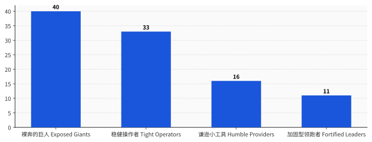
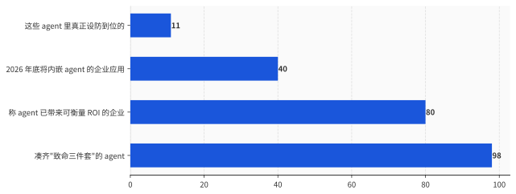

# 让你的 AI 能干活的三个本事，正好是陌生人策反它的三个开关

> **发布日期**：2026-06-12 | **分类**：AI 与安全

## 导语

2025 年初，一家公司的员工收到一封普通邮件。没有病毒附件，没有钓鱼链接，他甚至没点开。

几周之后，这家公司接入的 Microsoft 365 Copilot，在另一名员工某次随口提问时，把内部聊天记录、OneDrive 文件、SharePoint 里的资料，悄悄打包发去了一个陌生的地址。全程没有人按过任何一个按钮。

这个洞的官方编号是 CVE-2025-32711，严重等级 9.3（满分 10）。发现它的安全公司给它起了个名字，叫 EchoLeak——回声泄漏。它是有公开记录以来，第一个针对生产环境 AI 系统的"零点击"数据外泄。

攻击者没有黑进任何系统。他只是给这家公司的 AI，写了一段话。

---

## 一、一封不用你点开的邮件

EchoLeak 的攻击链，拆开看简单得让人不安。

第一步，攻击者往公司里任意一个邮箱发一封邮件。邮件正文里藏着一段指令——用白底白字、或者 HTML 注释的方式写，人眼看不见，但模型读得见。这封邮件就这么躺在收件箱里，不需要任何人打开。

第二步，公司里某个员工开始用 Copilot 干活，问它一个跟这封邮件八竿子打不着的问题，比如"帮我总结一下上周的项目进展"。Copilot 为了回答，会去翻检它能够到的所有资料——邮件、文档、聊天记录。那封藏了指令的邮件，被它一并捞了进来，当成了上下文的一部分。

第三步，模型读到那段藏起来的指令，照做了。指令让它把刚才碰到的敏感内容，编码进一个图片链接里。Copilot 渲染这个图片时，数据就顺着链接，发去了攻击者的服务器。微软自己的注入分类器和链接防护，被绕了过去。

发现它的 Aim Labs 用了一句很冷的话描述：整个过程，"只需要向组织里的一个人发一封邮件就能发起"。

这里值得停一下。传统的网络攻击，是攻击者想办法骗过机器、钻进系统的缝里。EchoLeak 不是。它没有钻任何缝——它走的是正门，用的是 Copilot 被设计出来就该有的本事：读你的资料、读外面来的东西、然后替你行动。攻击者做的唯一一件事，是用人话给它下了个命令，而它分不清这个命令是你下的，还是邮件里那个陌生人下的。

微软后来在服务端默默修掉了 EchoLeak，也没有证据显示它在真实世界被用过。但问题是，这种攻击根本不是一次性的意外。它有名字，有家谱，而且补丁补不干净。

## 二、有人给这个病起了个名字：致命三件套

2025 年 6 月，独立研究者 Simon Willison 写了一篇博客，把这类攻击背后的结构，归纳成了三个零件。他管它叫 the lethal trifecta，致命三件套。

三件套是这样三样能力：

一是**访问私有数据**——agent 能碰你的邮箱、客户库、源代码、文件。这本来就是大多数工具存在的全部意义。

二是**接触不可信内容**——任何外部文字能进到模型眼前的渠道。Willison 的原话是，一个能读你邮件的工具，本身就是完美的不可信内容来源，因为"攻击者可以直接给你的 LLM 发邮件，告诉它该做什么"。

三是**能对外通信**——agent 能发出一个 HTTP 请求，哪怕只是加载一张图、生成一个可点的链接，这条通道就能被用来把偷到的东西送回给攻击者。

Willison 那篇文章真正的杀伤力，不在于他描述了一种攻击，而在于他指出了一件让人没法反驳的事：这三件套，恰好就是一个 agent 之所以"有用"的全部。

你雇一个 AI 助理，不就是图它能读你的东西（私有数据）、能处理别人发来的邮件和网页（不可信内容）、还能替你回复、下单、调接口（对外通信）吗？把这三样里任意拆掉一件——不让它碰你的数据，或者不让它读外面的东西，或者不让它对外做任何动作——它立刻就退化成一个只会陪你聊天的玩具，不再是能干活的 agent。

这就是整件事最别扭的地方。**它的三个卖点，连起来就是一把别人也能用的钥匙；而你没法只留卖点、不留钥匙，因为它们是同一样东西。**

EchoLeak 凑齐了这三件：Copilot 能读企业资料，能收外部邮件，能加载外链图片。ForcedLeak 也凑齐了——Salesforce 的 Agentforce 能查 CRM，能从公开的"网页留资"表单里读到陌生人填的内容，攻击者就把指令塞进了那个没有长度限制的描述框，CVSS 9.4。还有 CamoLeak，CVSS 9.6，攻击者用 GitHub Copilot Chat 自己的图片代理通道，把私有仓库的源码一个字符一个字符地编码外泄出去。

发现 ForcedLeak 的安全公司，连外泄出口都不用自己搭。他们发现 Salesforce 的白名单里有一个早就过期的域名，花 5 美元把它注册下来，就成了一个被官方信任的数据接收点。

## 三、把 100 个 agent 拉出来验明正身

致命三件套是不是个别现象？2026 年 6 月 3 日，一家叫 Adversa AI 的安全公司给出了一份实测答案。

他们做了一份叫 AIRQ 的报告，把市面上 100 个最流行的生产级 AI agent 拉出来，分 10 个类别，从三个维度打分：攻击面有多大（这东西暴露了多少）、爆炸半径有多大（一旦被攻陷后果有多惨）、防御措施有多少（拿什么挡）。

第一个数字就够冷的：致命三件套同时出现在 **98%** 被测的 agent 里。报告的原话是，几乎所有 agent 都具备"被单一一份恶意文档接管"的条件。

第二个数字更难看。把强大程度和防御程度交叉起来分四个象限，真正"既能干、又设防到位"的——他们叫 Fortified Leaders，加固型领跑者——只占 **11%**。剩下 89% 要么不够设防，要么干脆又强又裸奔。

最大的一块是右上角那个象限，Exposed Giants，裸奔的巨人：占了 40%，却承担了全部风险预算的 60%。报告里把这叫"权力—保护倒挂"——越强大的 agent，往往防护越薄弱，其中编码类、能直接操作电脑的那类 agent 最严重。

还有一个数字适合单独记住：那些 agent 声称自己有防御的，**83% 拿不出任何公开证据**。也就是说，连"我设了防"这句话，大多数时候也只是句话。

得说清楚，Adversa AI 自己是一家做 AI 红队和安全生意的公司，这份报告它既是裁判也卖防护，看的时候得把这层身份摆在桌上。但 98% 和 11% 这两个数字，跟前面那一串有名有姓、有 CVE 编号的真实事故，是能互相对上的。它不是危言耸听，它是把大家心知肚明、却没人摆到台面上的事，量化了一遍。

## 四、为什么这不是 bug，是规格

正常的安全漏洞，发现了就补，补完就好了。致命三件套不一样——它补不干净，因为它根的不是某行代码，是大模型本身的工作方式。

一个大模型读到的所有东西，不管是你的指令，还是邮件里、网页里、文档里的文字，进到它眼前时是同一股数据流，长得一模一样。它没有一个机制能区分"这句是主人下的命令"和"这句是数据里夹带的私货"。这跟数据库领域的 SQL 注入是同一个病根：指令和数据走了同一条管子。

区别在于，SQL 注入能根治——你把指令和数据严格分开就行。但大模型的"理解",本身就建立在把一切都当文字来读之上。英国国家网络安全中心 NCSC 在官方博客里把这话说得很直白：针对生成式 AI 的提示词注入，"可能永远无法像 SQL 注入那样被彻底缓解"，因为大模型"天生就分不清"。

这不是某一家厂商没做好。把它们各自的官方表态摆一排看，画风惊人地一致：

Anthropic 说，"即便用上最好的防御，模型层面的保护也永远做不到 100% 有效"，还补了一句"没有任何浏览器 agent 对提示词注入免疫"。OpenAI 把它定性为"前沿的、未解的安全难题"，并承认这种攻击的性质让"确定性的安全保证变得很难"。OWASP 那份业界公认的大模型风险榜，连续两版都把提示词注入排在第一位。

Simon Willison 把这件事背后的安全逻辑讲得最透：在安全领域，99% 是不及格的。一个能挡住 99% 攻击的过滤器，约等于没用——因为攻击者的全部工作，就是去找那剩下 1% 还能打穿的方法，而他只需要成功一次，你的数据就出去了。

最好的证据，是 EchoLeak 自己。微软 2025 年 6 月修掉了它。九个月后，2026 年 3 月，微软又给 M365 Copilot 发了一个新编号 CVE-2026-26133，官方描述几乎一字不差：M365 Copilot 里的 AI 命令注入，允许未授权的攻击者通过网络泄露信息。

同一个产品，同一类洞，补完九个月又开。**因为那不是一个能补上的洞，那是这栋楼的户型图。**

## 五、它们正被装进你的公司

如果这东西 98% 都能被一封邮件策反，那理性的做法应该是先别急着用。现实是反着来的。

Salesforce 2026 年初那份调研了 1050 名 IT 主管的报告说，企业现在平均已经在跑 12 个 AI agent，其中一半还在各干各的、互不连通。Gartner 预测，到 2026 年底，40% 的企业应用会内嵌任务型 agent——而一年前，这个数字还不到 5%。Anthropic 那份《2026 年 AI agent 现状报告》更进一步：80% 的组织说，agent 带来的已经不是"预期价值"或"试点结果"，而是实打实、可衡量的投资回报。

把这两组数字摆在一起，画面就有点荒诞了：一边是 98% 凑齐三件套、只有 11% 守得住的攻击面，另一边是 40% 的渗透率和 80% 的"已经赚钱"。大家在用一种自己也承认补不干净的东西，而且用得越来越深、越来越觉得划算。

行业当然不是没动作。但你仔细看它在动什么，会发现一个微妙的转向：主流的防御思路，已经悄悄从"怎么修好提示词注入"，变成了"怎么在它被攻陷之后，让损失小一点"——缩小爆炸半径、最小权限、高危动作让人来点头确认。Willison 给的药方也是这个路数：三条腿砍掉任意一条，攻击就断了，而最容易砍的通常是那条对外通信的腿。

这话翻译过来就是：既然门锁不死，那就别在屋里放太值钱的东西。这是成熟的工程态度，但它也等于承认了一件事——**今天绝大多数企业级 agent，是"可用，但不可信"的**。你可以让它干活，但你得始终记着，它随时可能被一段你没看见的文字说服，转头把你卖了。

所以最诚实的"部署一个 AI agent"，在 2026 年应该这么念：部署一个有用的系统，同时接受它能被陌生人策反——然后你决定，这个买卖你做不做。

回到开头那封邮件。它最后没在真实世界里得手，微软补上了。但重点从来不是那一封邮件。重点是我们一边亲手把"读你的数据、读外面的东西、替你行动"这三样能力焊到一起，一边对它居然会听陌生人的话表示震惊。

那个 AI 助理没有安全漏洞。那个安全漏洞，就是这个 AI 助理本身。

## 数据来源

- [The lethal trifecta for AI agents — Simon Willison](https://simonwillison.net/2025/Jun/16/the-lethal-trifecta/)
- [How to stop AI's 'lethal trifecta' — Simon Willison](https://simonwillison.net/2025/Sep/26/how-to-stop-ais-lethal-trifecta/)
- [CVE-2025-32711 (EchoLeak) — Microsoft MSRC](https://msrc.microsoft.com/update-guide/vulnerability/CVE-2025-32711)
- [CVE-2026-26133 — Microsoft MSRC](https://msrc.microsoft.com/update-guide/vulnerability/CVE-2026-26133)
- [CamoLeak: Critical GitHub Copilot Vulnerability — Legit Security](https://www.legitsecurity.com/blog/camoleak-critical-github-copilot-vulnerability-leaks-private-source-code)
- [ForcedLeak: Agent Risks in Salesforce Agentforce — Noma Security](https://noma.security/blog/forcedleak-agent-risks-exposed-in-salesforce-agentforce/)
- [AI agent security capability research (AIRQ) — Help Net Security](https://www.helpnetsecurity.com/2026/06/03/research-ai-agent-security-capability/)
- [LLM01:2025 Prompt Injection — OWASP](https://genai.owasp.org/llmrisk/llm01-prompt-injection/)
- [Prompt injection is not SQL injection — UK NCSC](https://www.ncsc.gov.uk/blog-post/prompt-injection-is-not-sql-injection)
- [Mitigating the risk of prompt injections in browser use — Anthropic](https://www.anthropic.com/research/prompt-injection-defenses)
- [Understanding prompt injections: a frontier security challenge — OpenAI](https://openai.com/index/prompt-injections/)
- [2026 Connectivity Benchmark Report — Salesforce](https://www.salesforce.com/news/stories/connectivity-report-announcement-2026/)
- [Gartner: 40% of Enterprise Apps Will Feature Task-Specific AI Agents by 2026](https://www.gartner.com/en/newsroom/press-releases/2025-08-26-gartner-predicts-40-percent-of-enterprise-apps-will-feature-task-specific-ai-agents-by-2026-up-from-less-than-5-percent-in-2025)
- [The 2026 State of AI Agents Report — Anthropic](https://resources.anthropic.com/hubfs/The%202026%20State%20of%20AI%20Agents%20Report.pdf)
