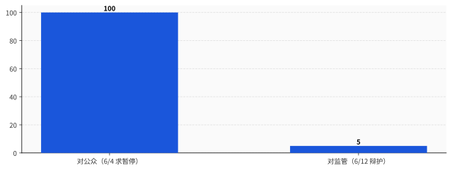

# 周三他求政府"封杀危险 AI"，周五政府封了他的 AI

> **发布日期**：2026-06-13 | **分类**：AI 与监管

## 导语

2026 年 6 月 12 日，周五，美东时间下午 5 点 21 分。

Anthropic 收到一纸来自美国政府的指令：立刻停掉它最强的两个模型——Claude Fable 5 和 Mythos 5——对所有外国人的访问。境外的、境内的，连它自己的外籍员工都算。

Anthropic 没办法在你打字的那一秒就核验出你是哪国国籍，所以它干脆把这两个模型，对全世界所有人，一起关了。美国公民也跟着用不了。

这两个模型，三天前刚发布。

而就在政府动手的两天前，Anthropic 的 CEO 刚刚公开写文章，强烈建议政府拥有一项权力：对不达标的前沿 AI 模型，"作为公共安全威胁，予以封杀，或者撤回"（blocked or reversed as a threat to public safety）。

他求来的这把权力，48 小时后，第一个落在了他自己头上。

---

## 一、5:21pm，一封没写理由的信

先说政府这边干了什么，因为这部分最干脆。

按 Anthropic 自己贴出来的说明，那份指令要求它"暂停 Fable 5 和 Mythos 5 对任何外国人的一切访问，无论此人身处美国境内还是境外，包括 Anthropic 的外籍雇员"。一家公司没法在每次 API 调用时实时验明用户护照，所以这条指令的实际效果，用 Anthropic 的原话说，是"必须突然对我们所有客户禁用 Fable 5 和 Mythos 5，以确保合规"。其他模型不受影响——Opus 还能用，你尽管放心地用那个没那么强的。

理由是什么呢？没有理由。Anthropic 写得很直白："那封信并未提供其国家安全担忧的具体细节。"

一封不说理由的信，三天之内，关掉了一家公司刚发布的两个旗舰模型。这就是 2026 年 6 月，监管对前沿 AI 能做到的事。

Anthropic 一边照办，一边憋着一肚子委屈。它说自己"正在遵守政府的法律指令，移除所有用户对 Fable 5 和 Mythos 5 的访问"，紧接着就是一个"但是"：它"不认同，一个范围狭窄的潜在越狱，应当成为召回一款已经服务数亿人的商用模型的理由"。

然后是那句真正的杀器，Anthropic 自己把它顶到了声明的最前面：

> "如果这个标准被应用到整个行业，我们相信，它将基本上叫停所有前沿模型厂商的所有新模型部署。"

记住这句话，它待会儿会回来咬人。

## 二、把镜头倒回 48 小时：枪是他自己递上去的

6 月 10 日，周三。政府还没动手。这天 Anthropic 的 CEO Dario Amodei 发了一篇长文，叫《Policy on the AI Exponential》，主题是：求监管。

不是被动接受监管，是主动上门，掏心掏肺地求。他给出的方案是把前沿 AI 管成飞机。原话：

> "前沿 AI 模型，就像飞机一样，应当被要求经过技术测试和审计；如果它们达不到高安全标准，其发布应当作为公共安全威胁被封杀或撤回。"

他要的是一套 FAA（美国联邦航空管理局）式的体制：政府握有一项常设的法定权力，可以在独立测试之后，封杀或撤回前沿模型的部署。测试什么呢？四个方向——网络安全、生物武器、失控、以及会加速前三者的自动化研发。他把 AI 跟"汽车、飞机、药品"放在一起，称它们是"对现代经济不可或缺、但一旦设计或操作不当就能杀死大量人口"的东西。

翻成大白话就是：政府你来，给我的模型发一张能随时吊销的飞行执照吧。

这还不算完。同一天，Anthropic 顺手宣布掏 3.5 亿美元——2 亿美元的"经济未来研究基金"，外加 1.5 亿美元的"Claude Corps"，招 1000 名研究员，年薪 8.5 万美元，第一批 100 人 10 月 19 日上岗——专门研究 AI 把人裁了之后怎么办。Amodei 还配了一套分档预案：失业率到 5% 怎么办，到 10% 怎么办，到"前所未有"的程度怎么办（答案是全民基本收入 UBI，钱从"对 AI 公司征税或者提高资本利得税"里出）。

把这天的两件事并排放：一边设计"政府应当能封杀我的危险模型"，一边掏 3.5 亿美元给"我的产品造成的大规模失业"提前兜底。这是一家公司在用真金白银，向全世界论证一件事——我做的东西，危险。

它论证得非常成功。成功到两天后，政府信了。

## 三、再倒回一周：他先把"危险"两个字喊给了全世界

故事的起点还要再往前。

6 月 4 日，Anthropic 旗下的研究机构发了一篇文章，标题叫《When AI builds itself》——当 AI 开始制造自己。作者是 Anthropic 联合创始人 Jack Clark 和政策研究者 Marina Favaro。核心论点是：模型正在逼近一个叫"递归自我改进"的临界点，也就是 AI 能自己设计、训练、部署一个比自己更强的下一代，中间不太需要人插手。

文章里有一句被全网引用的话：

> "我们相信，让这个世界保留'放慢或临时暂停前沿 AI 开发'的选项，会是一件好事——好让社会结构和对齐研究，能跟得上技术的脚步。"

它还很贴心地补了一句吓人的：递归自我改进"还没到来，也并非不可避免。但它来临的时间，可能比大多数机构准备好的时间要早"。配套的数据是：截至 2026 年 5 月，Anthropic 自己生产代码库里超过 80% 的代码，已经是 Claude 写的。

这套叙事的意思非常清楚：我们手里这东西，强到快要自己造自己了，强到我们得求全世界一起考虑按下暂停键。

然后，5 天后，6 月 9 日，它把这套叙事的主角——号称迄今最强的公开模型 Fable 5，连同更受限的 Mythos 5——发了出来，标好了价，挂上了货架。

把这条时间线连起来看，是一个非常完整的闭环：先喊"我的 AI 危险到要全球暂停"（6/4），再把这个危险的 AI 高调发布（6/9），接着求政府"你应该有权封杀危险的 AI"（6/10），最后政府真的封杀了它的 AI（6/12）。

每一步都是 Anthropic 自己迈的。政府只做了最后那个它被反复邀请去做的动作。

## 四、两本账：对镜头说"危险到要暂停"，对监管说"满大街都是"

换一个同情 Anthropic 的读法：那是它倒霉，被自己的真诚坑了——它是真信 AI 危险，结果被当真了。

不。最精彩的部分在于，当政府真把它的话当真、动手封模型的那一刻，Anthropic 立刻翻出了另一本账。

它在声明里是怎么给那个"越狱"降级的？它说，政府"只给了我们口头证据，证明存在一个潜在的、范围狭窄的、非普遍性的越狱，而这个越狱，本质上就是让模型去读一段特定的代码库、然后找出并修复其中的软件漏洞"。它还说，自己复核了这个手法的演示，发现它只能"识别出一小撮此前已知的、轻微的漏洞"。最后补刀：这种能力的水平"在其他模型上广泛存在（包括 OpenAI 的 GPT-5.5），而且是保护系统安全的防御者每天都在用的"。

把这两套话摆在同一张桌子上：

对着镜头、对着公众、对着募资市场，它说——**我们的模型危险到正在逼近自我改进，世界应该考虑为它按下暂停键。**

对着监管、对着那封要关它模型的信，它说——**就让模型读个代码库找找 bug 而已，这点能力 GPT-5.5 也有，满大街都是，至于吗？**

这两句话，不可能同时为真。

而那句被它顶到声明最前面的杀器——"这个标准会叫停整个行业所有前沿模型的所有部署"——本意是替自己喊冤：你不能这么搞，这么搞全行业都得停摆。但它翻译过来其实是另一句话：我这个模型，和市面上所有前沿模型，是一样的。一样的能力，一样的风险，一样的"危险"。

这恰恰拆了它自己 6 月 4 号那篇文章的台。如果你的模型危险到独一无二、需要全世界为它暂停，那它被单独拎出来封杀就是合理的；如果它跟 GPT-5.5 没区别、封它等于封全行业，那它就从来不是什么需要全球按暂停键的特殊物种。

无论哪一头是真的，另一头就是营销。这一周里，Anthropic 至少说谎了一次——只是我们不知道是哪一次。

<<__AIWRITER_PLACEHOLDER__>>

## 五、但你先别急着鼓掌

把 Anthropic 拆到这一步，很容易得出一个爽快的结论：活该，自食其果，搬起石头砸自己的脚。爽是爽，但停在这儿，就上了另一个当。

因为政府这边，干得一点都不漂亮。

回头看 6 月 10 号 Amodei 求来的那套权力，他要的可不是"政府随便发封信就能关你"。他白纸黑字写的是：政府应当能封杀不安全的部署，但前提是走一套"透明、公平、清晰、并且建立在技术事实之上"的法定程序。他要的是 FAA——一个有标准、有审计、有听证、出了事能讲明白为什么的体制。

他拿到的是什么？一封"并未提供具体细节"的信，没有公开声明，没有技术依据，三天关停一个服务数亿人的商用产品。所以 Anthropic 在声明最后说："正如我们公开表态过的，我们相信政府应当有能力封杀不安全的部署，但这必须是一套透明、公平、清晰、基于技术事实的法定程序的一部分。而这一次的行动，并不符合这些原则。"

这就是整件事真正拧巴的地方，反讽是双层的。第一层：他求来了否决权，否决权第一个砍了他。第二层：他求的是一架有仪表、有航管、有黑匣子的飞机，政府还给他的，是一个不讲理由、当街掀桌的城管。

这两件事，得分开看，也得同时记住。

值得被嘲笑的，是一家公司把"我的技术很危险"当成卖点、当成定价权、当成监管护城河来经营，然后在它最危险的卖点被监管当真的那一刻，慌忙改口说其实没那么危险。

值得被警惕的，是一个政府用一封没写理由的信，就能在一个周五的傍晚，关掉任何一家公司的任何一个产品——今天能关 Anthropic 的，明天就能关任何人的。

所以下次再有哪家 AI 公司，一脸凝重地告诉你"我们做的东西太强大了、太危险了、强到我们自己都害怕"——你别急着感动，也别急着害怕。把那句话当成一张报价单来读：他在为"危险"这个属性标价，向资本市场要估值，向监管要门槛，向你要敬畏。

Anthropic 这一周，把这张报价单递得太用力了。用力到买家——监管——真的照单全收，把货扣下了。

然后卖家当场翻脸：这货没那么贵，你误会了。

## 数据来源

- [Statement on the US government directive to suspend access to Fable 5 and Mythos 5 — Anthropic](https://www.anthropic.com/news/fable-mythos-access)
- [Policy on the AI Exponential — Dario Amodei](https://darioamodei.com/post/policy-on-the-ai-exponential)
- [Claude Corps & Economic Futures — Anthropic](https://www.anthropic.com/news/claude-corps)
- [When AI builds itself — Anthropic Institute](https://www.anthropic.com/institute/recursive-self-improvement)
- [Introducing Claude Fable 5 and Mythos 5 — Anthropic](https://www.anthropic.com/news/claude-fable-5-mythos-5)
