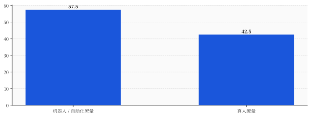
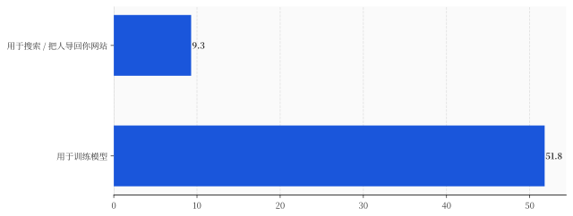

# 互联网第一次，多数访客不是人——它们读你的每一页，是为了让你以后没人读

> **发布日期**：2026-06-14 | **分类**：科技商业

## 导语

兄弟们，今天聊一个听起来像科幻、但已经是事实的事——

这个月，互联网迎来了一个谁都没准备好的拐点：**网页流量里，多数访客不再是人。**

57.5% 对 42.5%，机器赢了。

而且最魔幻的地方不是机器人变多了。是这群"访客"挤进你的网站，不看你一眼广告、不买你一件东西、来了就把你的内容抄走——抄去喂那个让真人以后不用再来找你的东西。

流量第一次过半，是坏消息。

---

## 那一周，访客过半不是人

先说事实，不带情绪的那种。

6 月初，Cloudflare 公布了一组 Radar 数据。Cloudflare 是给全世界很大一块网站做流量入口的基础设施公司，全球差不多五分之一的网站从它门口过，所以它说的"互联网流量长什么样"，是这个星球上少数能说了算的口径之一。

数据是这样：在它服务的网页里，**57.5% 的请求来自自动化程序，只有 42.5% 来自真人。**

这是有记录以来第一次，机器人在网页流量上占了多数。

Cloudflare 的 CEO Matthew Prince 自己都有点没绷住。他几个月前还公开预测，机器人流量超过真人这事，大概要到 2027 年才会发生。结果话音没落多久，提前了一整年。

他的原话是，这"比我预测的来得快"。

你品品这句话。一个掌握着全球流量入口、天天盯着这条曲线的人，对速度的判断，被现实甩了一年。

为什么会快这么多？

因为这一波不是过去那种刷量的垃圾机器人、薅羊毛的脚本。这一波的主力，是 **agent（智能体）**——就是 ChatGPT、Gemini 这些 AI 助手派出去的"代办员"。

你让 AI "帮我查一下这五家公司的财报、对比一下、再总结成一段话"。在过去，这是你自己要开十几个网页、点几十下鼠标才能干完的活。现在 AI 一句话派一个 agent 出去，它"啪"地一下访问几千个页面，全读完，回来给你一段总结。

一个真人一上午的浏览量，一个 agent 几秒钟就刷完了。

所以这 57.5% 不是"网上的人变少了"。是每个真人背后，多了一队不知疲倦、不用睡觉、一次访问几千页的影子访客。

---

## 但数量根本不是重点

如果故事到这就结束，那它顶多算个"哇好多机器人"的奇观新闻。

真正要命的，是这群访客**来干嘛**。

还是 Cloudflare 自己的数据，5 月份它把 AI 爬虫的请求拆开看了一眼，拆出来两个数字，摆在一起特别扎眼：

**这些 AI 爬虫的请求里，51.8% 是为了训练模型，只有 9.3% 是为了帮真人搜索、把人导回你的网站。**

这两个数字一摆出来，整件事的性质就变了。

过去你网站来个访客，哪怕是搜索引擎的爬虫，逻辑是清楚的：它来读你，是为了在用户搜东西的时候，把用户**送回**你这。爬虫是个媒婆，它抄走你的内容，是为了回头给你介绍客人。这笔买卖你不亏。

现在不是了。

现在过半的 AI 爬虫读你，是为了**训练**。

什么叫训练？说人话就是——它把你写的东西，一个字一个字嚼碎，消化进一个大模型的权重里。从此你的知识、你的观点、你熬夜码出来的那篇攻略，变成了模型肚子里的一团参数。

然后呢？然后用户再问相关问题，模型直接在对话框里把答案吐出来了。

**用户不需要再来你的网站了。因为你已经在模型里了。**

这就是那 9.3% 和 51.8% 的差距：一个是把人送回你这，一个是把你消化掉、好让人不用再回来。

媒婆变成了食客。它读你的每一页，不是为了让更多人读到你，是为了让以后没人需要读你。

---

## 互联网的原始契约，被单方面撕了

我们得往回退一步，看看这事到底动了谁的奶酪。

整个开放互联网，三十年来其实就靠一个谁也没签、但人人默认的契约活着：

**我免费把内容放出来，你（人）跑过来看，看的时候顺便看几眼广告、或者记住我这个牌子。我用你的注意力换钱，你用我的内容省事。**

这笔交易能成，前提是访客是个**人**——人会看广告，会点链接，会下单，会下次再来，会跟朋友说"我在那个网站看到个好东西"。

现在访客过半变成了 agent。

agent 不看广告。它眼里压根没有广告这个东西，它只解析文字。

agent 不下单——它就算下单，也是替主人下，主人那一单和你这个内容网站半毛钱关系没有。

agent 不会"记住你的牌子"，不会回头，更不会跟谁安利你。

它来，把你榨干，走。下一次它还来，因为模型要更新。

你可能会说，这不就是当年 Google、Facebook 干的事吗，平台抽走广告分成，老掉牙了。

不一样。**本质上不一样。**

Google 再怎么吸血，它至少还是个媒婆——你给它内容，它把人送回你的网站，你还能在自己的地盘上把这波流量变现。这是抽成。

agent 是只进不出。它在自己的对话框里就把你的答案给用户了，用户从头到尾没踏进你家门一步。这是截流，而且是带着"以后也不用来了"的截流。

从抽成，到截流加替代。这是两个物种。

而且这个物种的繁殖速度，是吓人的。

另一家专门盯自动化流量的安全公司 HUMAN Security，今年的报告里给了个数字：过去一年，agent 类流量同比涨了 **7851%**。整个自动化流量的扩张速度，大概是真人的 **8 倍**。

8 倍。这意味着那条 57.5% 的曲线，不会停在 57.5%，它只会往上走。

---

## Cloudflare 立了个收费站，但收费站本身就是墓碑

面对这事，Cloudflare 做了件挺狠的事，也算是这波最有信息量的动作。

它推了一个叫 **Pay Per Crawl（按次爬取付费）** 的东西，并且对新接入的网站，**默认把 AI 爬虫全部拦在门外**。你想让某个 AI 爬虫进来，得自己主动开门。

开门之后还有三个选项：白让它爬、按次收费、或者干脆继续拦着。

Prince 给这事配了句话，说得挺漂亮：

> "如果互联网要在 AI 时代活下来，我们就得把控制权还给创作者，建立一套对所有人都管用的新经济模型。"

听着像救世主，对吧。

但你换个角度看——

**一个东西要专门给它修收费站，恰恰说明白嫖已经是默认状态了。**

你什么时候见过谁给自家大门修收费站？只有当门口的路已经被人当成免费高速公路、车流哗哗地过、谁也不给钱的时候，你才会急吼吼地架一个杆子下来收费。

Pay Per Crawl 不是一个新功能。它是一张诊断书：开放互联网"免费内容换注意力"那套老经济模型，已经被 agent 流量冲垮了。Cloudflare 只是第一个公开承认尸体已经凉了、并且开始在尸体边上收门票的人。

而且这个收费站，罩得住的范围很有限。它只能保护躲在 Cloudflare 身后的那部分网站。全网剩下那海量的、没有这层保护的内容，该被免费嚼碎的，还在被免费嚼碎，一秒都没停。

所以这一周真正发生的，不是"机器人比人多了"这么一句奇闻。

是有人当着所有人的面，给开放互联网的旧合同，盖了个章：作废。

---

## 写在最后

回到你我身上。

如果你是做内容的——开网站的、写公众号的、做攻略的、拍测评的——你得想清楚一件事：你的流量数字以后会越来越好看，但这好看里，越来越大的一块，是一群不看你、不买你、还顺手把你喂给替代品的影子访客。

数字在涨，价值在漏。

如果你不做内容，只是个普通用户，这事也跟你有关。因为开放互联网之所以有那么多免费的好东西可看，靠的就是"创作者能从访客身上赚到钱"这个循环。当访客过半变成不付任何对价的 agent，这个循环的电，是会慢慢断的。

到那时候，AI 倒是什么都答得上来。只是它转述的那个原始的、鲜活的、有人味的互联网，可能已经没人愿意再写了。

机器人第一次在网上比人多的那个月，没有警报，没有头条爆炸。

只有一行安静的数据：57.5%。

它读了你的每一页。它没打算让你被任何人读到。

## 数据来源

- [Cloudflare Radar：自动化流量首次超过真人（57.5% vs 42.5%）](https://radar.cloudflare.com/)
- [Cloudflare CEO Matthew Prince：机器人流量超过真人"比我预测的来得快"](https://techcrunch.com/2026/03/19/online-bot-traffic-will-exceed-human-traffic-by-2027-cloudflare-ceo-says/)
- [Cloudflare：AI 爬虫请求中 51.8% 用于训练、9.3% 用于搜索（2026 年 5 月）](https://radar.cloudflare.com/)
- [Cloudflare Pay Per Crawl：默认拦截 AI 爬虫、按次收费](https://blog.cloudflare.com/introducing-pay-per-crawl/)
- [HUMAN Security 2026 State of AI Traffic：agent 流量同比 +7851%，自动化扩张约为真人 8 倍](https://www.humansecurity.com/newsroom/2026-state-of-ai-traffic-cyberthreat-benchmark-report/)
