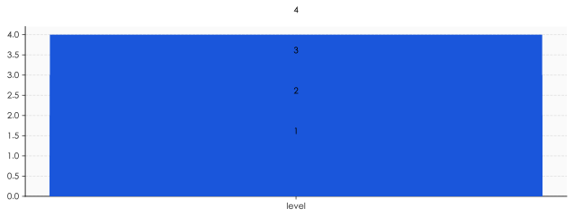

# 无招走了，但「权力美学」是中层管理的默认皮肤

> **发布日期**：2026-06-14 | **分类**：管理 · 商业观察

## 导语

兄弟们，6 月 4 日阿里内网炸出 7.5 万字的《置身钉内》，6 月 10 日合伙人委员会公开认错，6 月 11 日钉钉 CEO 陈航（无招）卸任。

72 小时，火速换帅。

阿里说"这不是我们文化该有的样子"。

但你仔细想想——

无招走了，「权力美学」走了吗？

这玩意儿不是无招一个人的人设。这是中文互联网中层管理的**默认皮肤**。

卸不掉。

---

## 72 小时换帅，干净得有点诡异

先复盘一下时间线。

**2026 年 6 月 4 日**，阿里 ATH 事业群悟空 BU 的员工滕雅辛（化名 Corgi），在阿里内网发表《置身钉内》，全文 7.5 万字，分八章——发心、定位、设计、用户、敏捷、秩序、军争、长期。

文章核心是讲钉钉旗舰 AI 产品 ONE 的故事：从立项、上线到收缩。这个产品想做"事找人"，DAU 峰值约 300 万。然后被砍了。

**6 月 10 日**，阿里合伙人委员会公开回应，原话："文中提及的管理方式不是阿里文化该有的样子。"

**6 月 11 日**，钉钉 CEO 陈航（无招）卸任。

**6 月 12 日**，SpaceX 在 NASDAQ 上市，1.75 万亿美元市值——你看，资本市场的星辰大海和阿里巴巴的中层管理，同一周发生。

这个换帅速度，干净得有点诡异。

正常大厂处理这种公关事件，要走调查、要走流程、要给老板留体面，72 小时基本只够发个"我们高度重视"的公告。

阿里这次不一样。

它选择**用最快的速度切割**——一切割就到顶端。

但兄弟们仔细想想——

**切割一个具体的人，比承认一个系统性问题，容易得多。**

无招好切。中层"权力美学"那一整套打法不好切。

所以这次切的，是看得见的脸。看不见的皮肤，还在。

---

## 7.5 万字到底骂了什么

很多人没看完 7.5 万字。我帮你拆。

《置身钉内》骂的不是无招个人，骂的是**一整套被工程化的中层管理打法**。

文章里说了几个关键的"症状"——

**症状一：双重汇报，没有明确层级**

一个产品经理，技术上汇报给 A，业务上汇报给 B。A 和 B 互相不知道对方在派活。两边都觉得这人是自己的下属，两边都要他在 deadline 之前出活。

结果是——这个产品经理同时被两条线榨干，没有一个人能为他的工作量负责。

**症状二：用户问题向上传递失灵**

一线员工看到用户的真实抱怨，但没法把这些抱怨准确传到决策层。每往上传一层，"抱怨"就被翻译一次："用户在抗议" → "用户反馈较多" → "我们已经关注到" → "正在持续优化"。

到了 VP 桌子上，已经是"产品体验有提升空间"。

**症状三：极致工作强度 + 反复返工**

需求加了又加，设计改了又改，临近上线被推翻重来。一线员工不是不想做事，是**做的事一直在被推翻**。

文章里有个很狠的描述："实际干活的人，越来越少。"

不是裁员裁少了。是大家都被反复返工耗死了精力，只剩下能"汇报"的人还能撑住。

**症状四：KPI 驱动 + "权力美学"**

这是全文最锋利的指控。

"权力美学"——这个词不是骂人，是观察。

它指的是：决策不靠用户数据，靠"谁敢顶 leader"。会议不为了对齐方向，为了**演给上面看你有多重视**。功能不是为了用户的需求，是为了下个季度财报里有个新的 highlights。

兄弟们这套语法熟悉吗？

熟悉。这就是中文互联网中层的默认操作系统。

无招只是把它演得过于赤裸。

---

## ONE 产品的悲剧——AI 时代的「功能堆砌」诅咒

聊聊那个被砍掉的 ONE。

ONE 的核心定位是"事找人"——通过 AI 自动总结工作消息，帮你从无数群聊里捞出真正需要你处理的事。

听起来是不是很好？

听起来很好。

DAU 巅峰 300 万，证明用户最初是买单的。

然后被砍了。

为什么？

我个人感觉——

ONE 死在了**AI 时代的「功能堆砌」诅咒**上。

让我解释。

钉钉这种巨型 IM，本质上是一个**信息分发管道**。它的核心价值是让消息高效地传递。

AI 介入这套管道的正确方式，应该是**减法**——帮你过滤、帮你筛掉、帮你只看到该看的。

但你看 ONE 实际做了什么？

它在原本的钉钉首页之上，又叠加了一层 AI 摘要。然后这层 AI 摘要又开始有自己的 tab、自己的 quota、自己的 KPI 要求……

这玩意儿不是"事找人"，这玩意儿是"AI 功能找人"。

你以为是 AI 在帮你减负，其实是 AI 在帮产品经理立项。

兄弟们这套打法熟悉吗？

熟悉。这是 2024-2026 年大厂 AI 产品的标准死法——

不是因为 AI 不行，是因为**组织内部对"AI 功能"有 KPI 配额**。

每个 PM 都要在自己的 module 里加一个"AI 增强"。每个 leader 都要在述职 PPT 里写"本季度新增 N 个 AI feature"。每个 BU 都要在年度规划里报"AI 战略级产品 X 个"。

这套配额一旦下达——

AI 就从"工具"变成了"任务"。

它的目标不是让用户更轻松，是让 PPT 更好看。

ONE 的悲剧不在于产品差，在于**它从一开始就承担了不该承担的组织叙事**。

把"AI 战略级旗舰"扛在一个还在 MVP 阶段的产品上——

这不是产品错，是组织错。

但兄弟们想清楚——做这个决策的不是无招一个人。

是整个互联网中层的"AI 战略"焦虑。

---

## 「权力美学」是怎么工程化的

这一节最狠。

「权力美学」这个词我前面用了几次。它到底是什么？

它不是性格。不是脾气。不是"无招就是这种人"那种简单解释。

它是一套**可以工程化的管理语法**。

具体怎么工程化？我拆四层给你看。

**第一层：决策仪式化**

大厂的中层决策，95% 是开会决策。

但开会的目的不是讨论，是**表态**——leader 抛个想法，你必须在 30 秒内接住，并且接住的方式得"高级"：先肯定老板的视角是对的，再补一句"我从用户角度还有个补充"，最后回到老板想要的方向。

这套话术叫"对齐"。

对什么齐？不是对齐方向，是对齐**表态姿势**。

**第二层：质询美学**

你看那种典型的中层管理者怎么 review 下属——

不是问"这个数据是怎么得到的"。是问"你为什么不知道？"。

不是问"我们能怎么改进"。是问"是谁决定这么干的？"。

不是问"我能怎么帮你"。是问"你这周到底在干什么？"。

这种问法的本质是——**通过让对方在压力中失误，证明自己作为质询者的高位**。

它不解决问题。它表演权力。

**第三层：返工驱动**

返工不是 bug，是 feature。

因为返工是 leader 最便宜的"产出"。一句"再想想"，下属就要熬两个通宵。两个通宵的工作量，对外可以说成"我推动了团队迭代"。

返工得越多，leader 显得越"有要求"。下属累得越狠，leader 显得越"严格"。

这套打法的副作用是——优秀的人最快被耗死。因为他们的迭代速度最快，被反复返工的次数也最多。

最后留下来的，往往是**最擅长在返工中保持情绪稳定的人**——也就是最不在乎结果的人。

**第四层：KPI 美化**

季度末的述职 PPT，本质上是一场**叙事重构**。

把"我们改了三版方案，最后上线一版"包装成"敏捷迭代，快速验证"。
把"用户增长 5%"包装成"在结构性挑战中实现关键突破"。
把"团队被裁掉 30%"包装成"组织效率优化"。
把"产品被砍"包装成"战略聚焦"。

这套语言一开始是给上级看的，慢慢就内化了——人会真的相信自己的 PPT。

这才是「权力美学」最可怕的地方。

它不是装出来的。是一套**自我认同的真实操作系统**。

无招演得太过，所以被骂。但你公司里那些没被骂的，一样在演。

只是分寸感更好。

---

## 阿里的回应为什么不能根治问题

阿里的反应很快。也很体面。

合伙人委员会公开说"不是阿里文化该有的样子"，CEO 卸任，CTO 接班——这套流程，已经是大厂能做出的最高分动作。

但兄弟们仔细想想——

这套动作能解决什么？

**能解决的是公关问题。**不能解决的是结构问题。

为什么？

因为**「权力美学」的真正载体不是 CEO，是中层**。

CEO 可以换。中层一个个换不了。

阿里几万个中层 leader，每一个都是在过去 10 年里**因为"权力美学"做得好而被提拔上来的**。

这套筛选机制不变，留下来的人就是同一种人。换一批，还是同一种风格。

你看金融行业、看 P&G、看 GE——历史上每一次"换帅救公司"，能改变的都是公司的方向，改变不了公司中层的**人格类型**。

因为中层的人格类型是被招聘标准、考核标准、晋升标准筛选出来的。这三个标准不变，人格类型就不变。

所以《置身钉内》这次的震荡，会经历一个典型的"危机-修复-遗忘"周期：

- 6 月：内网爆文 → 全网热议
- 7-8 月：钉钉调整 → 内部新政策
- 9-12 月：声音逐渐沉淀
- 2027 年初：下一份《置身 XX 内》出现，可能来自其他大厂

我个人感觉，《置身钉内》的真正意义不是改变阿里——

而是给所有还在大厂中层挣扎的人，一份**可以被命名的语言**。

以前你说"我们 leader 很烦"，没人理你。

现在你说"这是权力美学"，全网都懂。

命名本身就是一种解放。

但命名不等于解决。

阿里之外，还有 90% 的中层在用同一套打法。它们没出爆款离职信，不代表它们没问题——只是**它们的 Corgi 还没决定写**。

<<__AIWRITER_PLACEHOLDER__>>

---

## 置身钉内的你，怎么办

最后一节，聊聊你。

你大概率不在钉钉。但你大概率在某个有「权力美学」的中层架构里。

你的 leader 不叫无招。但他可能叫"X 哥""Y 总""Z 老师"，那个让你周五晚上 10 点改 PPT 的人。

你怎么办？

我有几个个人感觉——不是建议，是观察。

**观察一：「权力美学」最害怕的不是反抗，是公开**

无招的真问题不是管得严，是被写出来了。

「权力美学」依赖于**信息不对称**——leader 知道这套游戏怎么玩，下属只觉得是自己"不够努力"。一旦这套语法被命名、被写下来、被全网传播——

它就失效一半。

所以《置身钉内》这种文本的真正威力，不是改变阿里，是**让所有在大厂的人知道——"这不是你的错，这是一个系统"**。

你不用反抗，你只需要看清楚。

**观察二：内卷不是你能赢的游戏**

如果你想在「权力美学」的游戏里赢——你赢不了。

因为这套游戏的目的不是产出，是表演。而表演的天花板，永远是你 leader 设的。

你越努力，你 leader 显得越严格；你越认真，你 leader 显得越"有要求"；你越主动加班，你 leader 显得越"有抓手"。

你的产出，最终是他述职 PPT 里的一行字。

那行字里没有你的名字。

**观察三：「转身离开」也是一种 KPI**

我个人感觉，2024-2026 这一波大厂出走潮，本质不是钱的事。

是**越来越多的人意识到「权力美学」是一种零和游戏，于是选择不玩了**。

有人转身去创业，有人去小公司，有人 gap year，有人转行做 AI——共同点不是赚得更多，是**不再为一个不存在的"被认可"而消耗自己**。

兄弟们，如果你现在还在某个"无招式"的团队里——

我不劝你立刻走。生计是第一位的。

但请保持一件事——**不要内化这套语法**。

不要开始用"对齐"来掩盖你的真实判断。
不要开始用"敏捷"来描述无意义的返工。
不要开始用"赋能"来包装你的疲惫。
不要开始用"复盘"来给自己做思想政治工作。

只要你还能用大白话描述你的工作——

你就还没被"权力美学"驯化。

那是你最后的体面。

也是你以后回头看这段经历，能给自己保留的那块**没被烂掉的核心**。

无招走了。

但你的「无招」还在。

——而你不在「权力美学」里，是你自己决定的。

<<__AIWRITER_PLACEHOLDER__>>

---

## 数据来源

- [《置身钉内》7.5 万字内网原文转载（知乎）](https://zhuanlan.zhihu.com/p/2047067667811537005)
- [阿里合伙人委员会回应：不是阿里文化该有的样子（36 氪）](https://36kr.com/p/3847037138717186)
- [钉钉 72 小时极速换帅复盘（虎嗅）](https://www.huxiu.com/article/4866710.html)
- [《置身钉内》作者再发《云空未必空》（新浪科技）](https://finance.sina.com.cn/tech/roll/2026-06-12/doc-iniccspn5028638.shtml)
- [钉钉 ONE 产品发起到收缩历程（搜狐科技）](https://www.sohu.com/a/1034360584_122641464)
- [《置身钉内》引发的职场共鸣分析（网易）](https://www.163.com/dy/article/KV3884AN0512D3VJ.html)
- [钉钉飞书企微 IM 文化对比（人人都是产品经理）](https://www.woshipm.com/it/6410732.html)

> 注：《置身钉内》原作者笔名为 Corgi/优素，文章发布于阿里内网。本文基于公开报道与外部转载内容做评论性分析，不代表当事人或当事公司立场。
