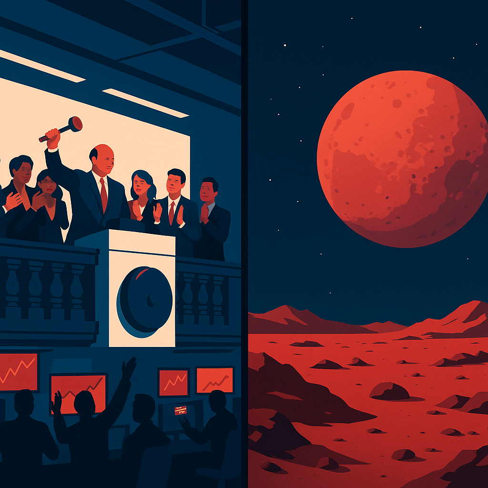
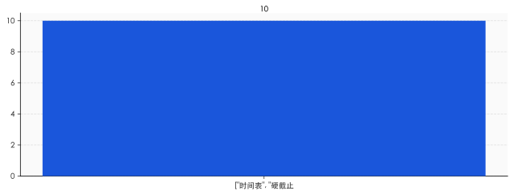

# SpaceX 上市当天，火星就死了

> **发布日期**：2026-06-14 | **分类**：科技商业

## 导语

兄弟们，今天聊一个反常识的事——

资本市场买的从来不是希望抵达，是希望**永远在路上**。

SpaceX 一上市，火星这个目的地就死了。从此它只能活在 PPT 里、活在路演里、活在每一份让股价上涨的"长期愿景"里。

不能到达。一旦到达，故事就结束了。

---

## 上市那天，火星死了

那天，纽交所敲钟。

马斯克穿着那件标志性的黑 T 恤，在镜头前露出一个略带尴尬的笑。屏幕上的 SPCX 以每股 X 美元开盘，30 分钟后涨到 Y，市值突破 1 万亿。

新闻标题写得很煽情：「人类太空梦想，正式上市」。

但你仔细想想，这一刻其实有点诡异。

因为上市的本质，是把一家公司的「未来现金流」算清楚、量化、贴现，让市场给一个价格。

而火星这种东西，是没法贴现的。

你不能在第二年财报里写："本季度火星殖民进度 +12%"。SEC 不允许这么写，投资者也不接受这种 KPI。

所以上市那一刻，那个无法量化的「火星梦想」必须被翻译成一种可以被资本市场理解的东西——叙事溢价、Optionality、Sum-of-the-parts 估值。

说人话就是——梦想被打包成了金融产品。

我个人感觉，那一天才是星辰大海这个故事真正的拐点。不是 2002 年马斯克成立 SpaceX，不是 2008 年 Falcon 1 第四次发射成功，不是 2020 年 Crew Dragon 把宇航员送上 ISS。

是那个敲钟的瞬间。

因为从这一刻开始，资本市场不让 SpaceX 抵达火星——资本市场只让 SpaceX 一直**即将**抵达火星。

这两件事，差了一个时态。也差了一万亿美金。

---

## 资本市场到底在买什么

你以为投资者买 SpaceX 是在赌火星？

不是。这玩意儿没人真的在赌。

SpaceX 的估值结构，简单来说是两层：

**第一层：星链（Starlink）**

这是估值的底盘。星链已经有几百万付费用户，年化营收超过 100 亿美元规模。这部分是「可 DCF 的现金流」，分析师能算清楚的：用户数 × ARPU × 留存率 × 折现率，得出一个数字。

这个数字撑得起 SpaceX 估值的 30%-40%。

**第二层：火星（Mars Optionality）**

剩下的 60%-70% 估值，都是「期权价值」。

什么叫期权价值？翻译过来就是——「如果 SpaceX 真的把人送上火星、真的开始火星贸易、真的成了银河系第一家殖民公司，那它值多少钱」。

这个数字理论上是无限的。所以分析师在模型里只能用主观概率乘以「无限上限」，得出一个看起来很大的中间数。

你看出问题了吗？

第一层是地板，第二层是天花板。SpaceX 的市值，本质上是一个不断被抬高的天花板游戏。

而天花板的高度，取决于火星这件事「**看起来**还有多远的可能性」。

不是「真实进度」。是「可能性的感知」。

这玩意儿最妙的地方在于——星链负责糊弄财报，火星负责糊弄想象力。两个搭配着用，市值就能涨。

但兄弟们，仔细想想这个结构。

如果火星突然变得没希望了——比如 Starship 连炸三次、火星基地预算被砍——天花板崩了，市值跌一半。

如果火星突然真的实现了——比如 2035 年人类第一次踏上火星表面——天花板被「兑现」了，从可能性变成现实。那剩下的估值靠什么撑？只能靠星链。星链值多少钱？三千亿美金顶天了。

所以一旦真的抵达——SpaceX 市值会从 1 万亿，跌到三千亿。

---

## 抵达即破产——太空版的「元宇宙诅咒」

我知道你听到这里要骂人了：到了火星反而市值跌？这什么逻辑？

兄弟们，资本市场就是这么反直觉的地方。

我给你举三个金融史的真实案例：

**案例一：Meta 改名**

2021 年 10 月，Facebook 改名 Meta，All in 元宇宙。当时市值 1 万亿。后来呢？2022 年股价腰斩，市值跌到 2500 亿。

为什么？因为故事开始要兑现了。Reality Labs 部门一年烧 100 亿美金，做出来的东西连员工自己都不爱用。故事一旦进入「兑现期」，就要面对真实成本和真实收入。

**案例二：AI 算力芯片**

2023-2024 年，英伟达股价飙到几万亿，逻辑是「AI 训练需要无限算力」。

但所有 AI 硬件公司心里都清楚一件事——一旦推理芯片 ASIC 化、一旦 AGI 的训练范式从「scale up」转向「scale down」、一旦模型能在边缘端跑——这套估值逻辑就崩了。

所以英伟达每个季度都在抢着发布「下一代」「再下一代」「下下下一代」。它必须永远站在「即将变革」的位置上。

**案例三：生物医药临床三期**

这个最经典。一家生物医药公司，临床三期之前股价 50 美元，市值十亿。

公布临床三期失败——直接腰斩，跌到 25。

公布临床三期成功——你以为会涨？错。它会先涨 30%，然后慢慢跌回 35。因为「成功」之后，市场要重新用「卖药」的现金流给它定价，而不是用「可能成功」的期权定价。

这三个案例的共同点是什么？

资本市场最爱的不是成功，是「**永远即将成功**」。

成功是终点。终点意味着故事结束，意味着估值锚必须切换，意味着大概率回归基本面。

所以你看 SpaceX 的所有路演 PPT——

火星基地一直在「计划中」。星舰一直在「即将量产」。登陆窗口期一直在「下一个 26 个月」。

这不是马斯克在画饼。这是马斯克在帮整个资本市场，**精心维护一个永远在路上的故事**。

---

## 马斯克最伟大的发明，不是火箭

聊到这里，我得为马斯克说句公道话——他真的造出了火箭。

Falcon 9 复用次数突破 30 次，单位发射成本从 2008 年的 6 万美元每公斤，降到现在的 2000 美元。Starship 已经完成数十次测试，部分构型实现了完全回收。星链在轨卫星过万颗。NASA 的载人月球任务核心承包商。

这些是真实的工程奇迹，我没法否认。

但兄弟们，我个人感觉——

马斯克最伟大的发明，不是火箭。是把"长期亏损 + 永续融资 + 持续讲故事"这套打法工程化了。

你看 Apollo 时代——

1961 年肯尼迪演讲，承诺 10 年内登月。1969 年阿姆斯特朗踏上月球。整个项目花了 250 亿美元（按当时美元算），动用了 40 万人。

那是国家意志。有明确时间表、明确预算、明确终点。**必须**在 1970 年代前抵达，因为那是政治承诺。

到了之后呢？登月计划被砍了。土星五号生产线关闭。NASA 预算从占联邦预算 4% 跌到 0.4%。

为什么？因为故事讲完了。苏联输了，美国赢了，月球去过了，剩下的火星没有同等的政治紧迫性。

所以你看清楚这两套逻辑——

**Apollo 时代的逻辑是：必须抵达，因为不抵达政治叙事就破产。**

**SpaceX 时代的逻辑是：不能太快抵达，因为抵达了金融叙事就破产。**

这是两种完全不同的驱动力。前者是国家信用做担保，要求事情发生；后者是资本溢价做担保，要求事情**即将**发生。

马斯克的真正创新，不是飞船图纸——

是发现了「在资本市场上永续融资讲一个 50 年都讲不完的故事」**这件事本身是可以工程化的**。

具体怎么工程化？

每隔一段时间，发布一个里程碑（Starship 第 X 次发射）；每隔半年，给一个新时间表（火星载人 2030 / 2032 / 2035，永远在 5-7 年后）；每隔几年，扩大叙事边界（从火星到月球，从月球到深空，从深空到星舰间贸易）；每次基本面顶不住的时候，扔一个能让股价涨 10% 的工程突破出来。

兄弟们这套打法熟悉吗？

熟悉。这是亚马逊 90 年代-2010 年代的打法。是特斯拉 2010-2020 年代的打法。是字节跳动 PE 估值打法的太空版。

马斯克最大的本事，是把这套打法搬到了**最不该商业化的领域**——人类的太空梦想。

然后他成功了。

---

## 中国版 SpaceX，为什么跑不出来

聊完美国，聊中国。

每次说起中国民营航天，大家都在比技术：蓝箭航天的朱雀三号、星际荣耀的双曲线、中科宇航的力箭一号、东方空间的引力一号。

技术差距确实有，但没有想象中那么大。

朱雀三号已经验证了 VTVL 垂直起降。多家公司已经开始可重复使用火箭的实战测试。星链对标的「千帆星座」「国网星座」正在加速布网。

真正的差距，不在技术，在资本结构。

兄弟们我直说——中国民营航天的最大对手，不是 SpaceX。

是**没有愿意陪一个梦想烧 20 年的资本**。

SpaceX 1 万亿市值是怎么撑起来的？

是 2002 年成立到 2008 年——6 年里马斯克自己快破产，Falcon 1 连炸三次。是 2010 年代 SpaceX 拿了 NASA 几十亿美元的开发合同。是 Google、富达、a16z 这些机构一轮接一轮往里投钱，知道短期不赚钱，但**愿意陪**。

愿意陪 20 年。这是关键词。

中国资本市场的结构性问题是——它不容忍 20 年。

A 股要求三年内盈利，连续亏损会被 ST、退市。注册制改革之后情况有所好转，但科创板、北交所最长也只能容忍 5-7 年的亏损叙事，远远不够支撑火星这种 50 年叙事。

港股美股相对容许，但有两个新问题：一是地缘政治，民营航天涉敏感技术，赴美上市要过 CFIUS；二是中概股估值长期被砍折，火星这种期权价值在中概股结构下根本撑不起。

所以你看现在中国民营航天的状态——

拿不到 SpaceX 级别的长期资本，就只能更早地证明现金流，就只能更早地接政府订单和卫星发射服务，就只能更早地变成「卫星互联网运营商」，就只能放弃「火星这种叙事天花板」。

我个人感觉——

中国不缺造火箭的人。中国缺的是「允许造火箭 20 年不上市的市场」。

A 股是地板逻辑——你要先证明你站得稳。美股是天花板逻辑——你要让我相信你能飞得高。

火星这种事情，必须用天花板逻辑融资。地板逻辑融不出来火星。

那中国怎么办？

我个人感觉，唯一的解法是——**国家信用做担保**。

也就是说，中国版的星辰大海，本质上得回到 Apollo 那条路：国家意志驱动，长期主义靠政治承诺，时间表靠五年规划而不是资本市场季度财报。

这套逻辑的好处是真的能抵达。坏处是只能产生一个 SpaceX，没法产生 SpaceX、Blue Origin、Rocket Lab、Astra、Relativity 这种多元生态。

这是两条不同的路。没有对错。但兄弟们必须想清楚——SpaceX 这条路，复制不了。

<<__AIWRITER_PLACEHOLDER__>>

---

## 当星辰大海变成你账户里的一行字

最后一节，聊聊你。

SpaceX 一上市，意味着一件你可能没意识到的事——

普通人第一次可以买「星辰大海」。

打开你的雪球、富途、Robinhood，输入 SPCX，按下买入。一千美金、一万美金，看你心情。你的养老金账户里，从此可能会有一行小字写着「SpaceX 持仓 0.3%」。

听起来很浪漫对吧？人类太空梦想，被你买了一小块。

但兄弟们想清楚——你买的到底是什么？

不是火星地皮（哪怕马斯克说要发行火星地契你都别信）。不是火箭股权（那只是会计意义上的）。不是抵达火星后的回报（如前所述，抵达即破产）。

你买的是「永远在路上的浪漫」。

这是一份诅咒。因为你大概率等不到马斯克兑现「2030 年载人登火」的承诺，也大概率等不到 2035、2040。这个时间表会被永远推迟。你持有的，是一个永远不结算的期权。

但这也是一份祝福。因为你也永远不会失去这个故事。

每个季度财报，SpaceX 都会更新一次「火星进度」。每次 Starship 发射，新闻里都会再讲一遍「迈向多行星物种」。你买的不是回报，是**对一个故事的赞助权**。

我个人感觉，这其实是资本市场最有意思的产品形态——**赞助型资产**。

你出钱，不是为了未来兑现，是为了让这个故事继续被讲下去。

你买 SpaceX 的逻辑，本质上跟你给一个 YouTuber 充会员、跟你打赏一个长期连载小说作者、跟你给一个独立游戏开发者众筹一样——

不是图回报，是图「这件事在我有生之年还在发生」。

你的钱买的不是火星，是一种世界观的延续。

兄弟们，这就是星辰大海被定价之后的样子。

它从「人类必须抵达的目的地」，变成了「人类愿意一直支付的故事」。从远征，变成了订阅。

但说真的，仔细想想——

抵达火星这件事，对绝大多数人来说，本来也是没意义的。99.9% 的人不会去火星。我们在乎的从来不是真的踏上那块红色的土壤。

我们在乎的是——人类还有能力相信「我们能去」这件事。

只要这种相信还在，星辰大海就还在。

**所以幸运的是，永远到不了。**

抵达的那一天，我们就不再需要星辰大海了。

而我们需要星辰大海，远胜于需要火星本身。

<<__AIWRITER_PLACEHOLDER__>>

---

## 数据来源

- [SpaceX 公司公开信息](https://www.spacex.com/)
- [NASA SpaceX 合同披露](https://www.nasa.gov/commercial-crew-program/)
- [Starlink 用户数与营收公开报道（Bloomberg, Reuters）](https://www.bloomberg.com/)
- [Apollo 计划历史预算（NASA History Division）](https://history.nasa.gov/)
- [中国民营航天公开融资信息（蓝箭航天/星际荣耀/中科宇航官网）](https://www.landspace.com/)
- [Aswath Damodaran 关于叙事估值的研究（Stern NYU）](https://pages.stern.nyu.edu/~adamodar/)

> 注：本文涉及的 SpaceX IPO 估值和市值数字为推演性场景。Starlink 营收为业界估算区间，具体以实际公开披露为准。
