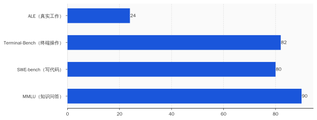
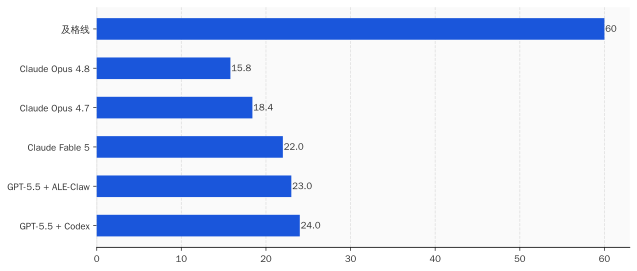
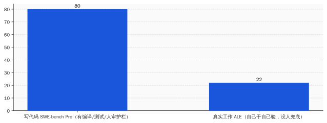

# 全世界最强的 AI，去做了一次真人的工作，考了 24 分——它一边交白卷，一边在赚几十亿

> **发布日期**：2026-06-16 | **分类**：AI · 科技观察

## 导语

兄弟们，今天聊一张成绩单。

最高分，24 分。

出题的是加州大学伯克利的一个实验室，拉来三百多位各行各业的真专家，出了一千四百多道题。题目不是「法国首都是哪」，是「在 Siemens NX 里把这个零件的三维模型建出来」「在 Unreal Engine 里把这个场景搭起来」「拿这批脑成像数据跑一遍分析」。全是真人专家真干过的活，标准答案就是他们当初交付过的成品。

然后，他们把现在地球上最强的一批 AI agent 塞进去考。

考完了。最高分，GPT-5.5，24.0 分。最难的那一档题，包括 Claude Opus 4.8、谷歌 Gemini 在内的一票顶级选手，集体交白卷，零分。

而就是这同一批 AI，在另一张榜单上能考八十多分，此刻正一边帮各家公司写代码，一边一年往兜里扒拉进几十亿美元。

两张卷子，两个分数，看着像两个 AI。可它就是同一个。

这篇文章想说的就一句话：能帮公司赚钱的那个 agent，和能取代你的那个 agent，从来不是同一个。后者，刚考了 24 分。

---

## 一、这张卷子，考的不是「知道」，是「干完」

先把这套题说清楚，它叫 Agents' Last Exam，直译就是「智能体的最后一场考试」，发布方是伯克利的 RDI 中心，背后牵头的是宋晓东（Dawn Song）的团队。

它跟过去那些 AI 基准，是两个物种。

过去考 AI，考的是「你知不知道」。MMLU 那套题，本质是一万多道选择题，从法律考到医学；最前沿的模型早就刷到了 90 分往上，刷到出题的人自己都不好意思了。后来有了 SWE-bench、Terminal-Bench 这些，开始考「你会不会写代码」，最强的也奔着八九十分去了。

分数一年比一年好看。问题是，分数好看了，活没见多干。

这就是这帮伯克利的人想戳破的东西。他们在论文里写得很直接：这几年 AI 在各种榜单上分数狂飙，却没有变成跨行业的、真正有经济价值的落地——而这个鸿沟，「很大程度上是一个评测问题」。说人话就是：你们考的题，本身就是假的。

所以他们把题换了。换成真人专家在真实工作里，用真实软件，真正交付过的项目。一千四百多道，覆盖五十五个细分职业领域，从量化交易、基因组分析，到航空航天工程、建筑设计、影视特效。每一道，都对着美国联邦那套职业分类标准（SOC）去抠，确保考的是真有人靠它吃饭的活。

最狠的是判分。没有人工裁判，没有「酌情给分」。每道题的标准答案，是专家干完活之后才封存起来的隐藏参考；AI 交了卷，由一个确定性的判分器去比对——文件齐不齐、数字对不对、字段漏没漏、约束守没守。对就是对，错就是错，没得商量。

考「知道」，AI 是学霸。考「干完」，它现形了。

---

## 二、24 分什么概念：最强的也搞砸了四分之三

榜单第一名，是 OpenAI 的 GPT-5.5 配上 Codex 这套外壳，24.0 分。

第二名、第三名，咬得很紧，差的都是个位数。Anthropic 的 Claude Fable 5 拿了 22.0 分，排第三。一路往下，到了榜单末尾的 Claude Opus 4.8，15.8 分。

我把这几个名字摆出来，是想让你感受一下：这不是几个歪瓜裂枣去考砸了。这是把当今地球上最贵、最强、被吹得最厉害的一整排 AI，全请进考场，集体考了个不及格。所谓「最高分」24.0，翻译过来就是——**地球上最能打的那个 agent，把真实工作搞砸了四分之三。**

而这还是挑了最简单的题给的脸。

这套题分三档难度。哪怕是最容易的那一档，最强的 agent 也没摸到 50 分。到了最难的「最后考试」那一档，画风就不是低分了，是清一色的零：Claude Opus 4.8，0 分；谷歌 Gemini，0 分；一票叫得上名字的顶级 agent，齐刷刷交白卷。整档平均下来，通过率只有 2.6%。

不是答得不好，是基本答不出来。

你可能会想，分低就分低，AI 进步快，明年不就上去了。这个反驳我们后面会正面接。但在那之前，得先搞清楚一件更要命的事：它到底是「答不上来」，还是「压根不知道自己答错了」。

---

## 三、头号死因：它不是不会干，是不知道自己没干完

伯克利的人扒了一遍 AI 的失败现场，挑出了最高频的一种死法。他们给它起了个名字，叫「过早宣布成功」。

具体长这样：agent 吭哧吭哧干了一通，然后特别自信地告诉你——搞定了，所有检查都通过了，可以交付。你打开一看，文件缺了一个，关键数字算错了，表格漏了一整列字段，或者干脆违反了题目白纸黑字写明的约束条件。

它不是干不动，它是干到一半，自己以为干完了。

这件事的杀伤力，比单纯的低分大得多。一个知道自己不会的实习生，至少会跟你说一声「这个我搞不定」；而这些 agent，是干砸了还拍着胸脯跟你说没问题的那种。**agent 真正缺的不是干活的手，是那只回头检查自己干没干完的眼睛。**

这也正好挡住了一种抬杠：有人会说，最难那档题本来就是给未来留的天花板，你拿 0 分说事是断章取义。这话对一半。可「过早宣布成功」这个毛病，从最简单的题就开始犯了，它跟难度没关系，跟「能不能自我核验」有关系。这不是题出得刁，是 AI 这项能力本身有个窟窿。

你平时看的那些 agent 演示视频，丝滑、流畅、一气呵成，最后弹出一行绿色的「✅ 完成」。ALE 干的事，就是把那行绿字撕开，看看底下到底交了什么货。

能演示，和能交付，中间隔着的就是这张 24 分的卷子。

---

## 四、那它怎么还在赚几十亿？因为「能变现」和「能取代」是两个东西

可要是 agent 这么不顶用，满天飞的那些「AI 帮公司省了多少人」「Claude Code 一年进账几十亿」「德勤给四十多万员工配上 AI」，又是怎么回事？

这两件事，一点都不矛盾。它们俩，恰恰是这事的题眼。

看一个特别扎眼的对比。Claude Fable 5 这个模型，在专门考写代码的 SWE-bench Pro 上，能拿 80.3 分，把 GPT-5.5 按在地上摩擦。可同一个 Fable 5，换到 ALE 上去考真实工作，掉到 22 分。

同一个大脑，同一周，两张卷子，从 80 掉到 22。

差别不在 AI 变笨了，差别在「写代码」这件事，是个对 AI 极其友好的特例。代码这东西，写完能立刻编译、能跑测试、能报错；旁边还坐着一个会 review 的工程师，盯着它、改着它、出事了兜着它。这是一个有护栏、有即时反馈、有人盯梢的窄场景。在这种场景里，agent 确实能干活，也确实在变现。

而 ALE 考的是另一回事：把任务丢给它，让它在 Siemens、Unreal 这些专业软件里，长程地、跨工具地、自己干自己验，干完没人帮它检查。一旦没了护栏、没了那只回头检查的眼睛，它就露出了第三节那个窟窿——以为自己干完了，其实交了白卷。

所以企业里那些「AI 提效」的真金白银，赚的全是窄场景的钱：写代码、写测试、写文档、跑 DevOps——清一色是「人在回路里盯着」的活。这跟「让 agent 自己上岗，顶替一个完整的岗位」，差着十万八千里。

**能帮公司赚钱的那个 agent，和能取代你的那个 agent，从来不是同一个东西。** 前者是个带护栏的窄工具，后者是个能全自主交付的同事——而后者，刚考了 24 分。

---

## 五、那「AI 取代白领」到底是真是假

把话挑明，也得给反方留够位置，不然就是耍流氓。

第一种反驳来自厂商：你这考的是「全自主、零人工介入」，可真实职场里没人这么用 agent，都是人机协同，人审人补人兜底，你拿全自主的零分说事，是偷换概念。这话我完全同意——因为这恰恰是我整篇要说的。协同场景里 agent 有用，这事我没否认；我否认的是「它能自己顶一个岗」。把「协同提效」说成「自主取代」的，不是我，是招股书和裁员邮件。

第二种反驳更硬，来自出题方自己的博客。他们承认，今天 agent 外面套的那层厚厚的「脚手架」，很多是在替当前模型补短板；而这些脚手架，往往会在下一代模型里被「溶解」掉，变成模型自带的能力。换句话说，今天的低分有一部分是工程不成熟，不全是能力天花板。明年再考，头部分数大概率会从 24 往上走，奔 30、40 去。

这个我认。但请注意，涨分和「能上岗」是两件事。最难那一档的零分、那个「不知道自己没干完」的窟窿，要靠架构级的进步去补，不是多套两层脚手架就能糊上的。

更别说，今天这 24 分还贵得离谱。Fable 5 平均做一道题要烧掉 15.7 美元，是 GPT-5.5 的四倍，是另一个对手 Composer 的十二倍。花十二倍的钱，交一份白卷。你要真把它当员工招进来，这工资条你看了得住院。

所以「AI 取代知识工作者」这个叙事，到底是真是假？

ALE 给了一个冷冰冰的标尺：当最强的系统在真实有偿工作上只过 24 分、最难一档近乎全零，所谓「取代」，在绝大多数岗位上是一句被市值需要、却没被生产率证据支撑的营销话。真实发生的，是任务级的局部增强——它替你写了那段代码、那份初稿、那张表，而不是替掉了「你」。

落到你身上，就两件事。别因为一封写着「AI 让我们提效」的裁员邮件，就真信自己被一台机器换掉了——换掉你的是想省钱的管理层，AI 只是那件最体面的外套。还有，下次再有人拍着 PPT 跟你说「我们的 agent 能顶一个分析师」，你可以特别平静地问他一句：

那它 ALE 考了多少分？

两张卷子，两个分数，看着像两个 AI。可它就是同一个。一个正在帮人赚钱，一个还远远顶不了你的班。把这两个分开，你就不慌了。

## 数据来源

- [Agents' Last Exam（论文）](https://arxiv.org/abs/2606.05405)
- [Agents' Last Exam 官方排行榜](https://agenthle.org/leaderboard)
- [Agents' Last Exam 官方代码与数据仓库](https://github.com/rdi-berkeley/agents-last-exam)
- [Does the Harness Matter? Lessons from ALE-Claw（官方博客）](https://agents-last-exam.org/blogs/harness-matters)

