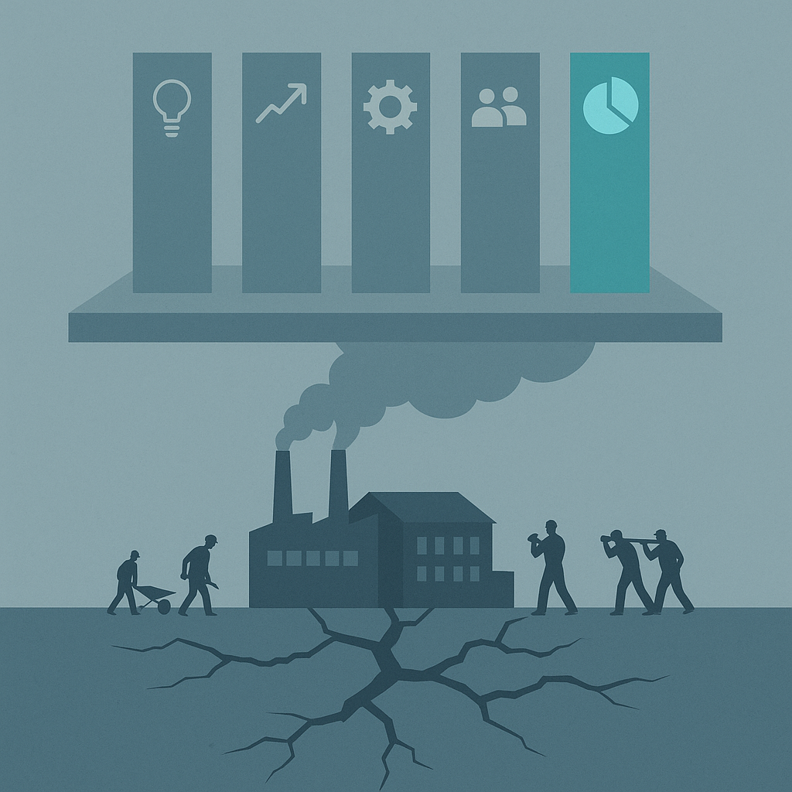
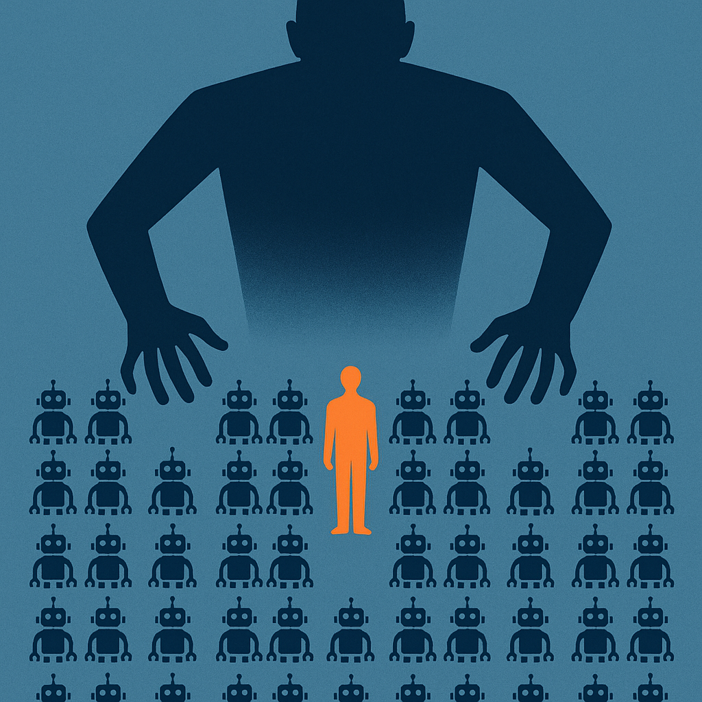

# Agentic Organization：1% 的未来，99% 的话术

> **发布日期**：2026-06-17 | **分类**：管理 · 商业观察

## 导语

兄弟们，麦肯锡 2025 年 9 月发了份报告，提了个新词——**agentic organization**（智能体组织）。

听起来很玄。

但报告里最炸裂的不是这个新词。是它顺手公布的一组数据——

**89% 的公司还停留在工业时代。9% 是数字时代。只有 1% 是真正的网络化组织。**

也就是说，麦肯锡画的"AI 时代下一种组织"这张饼，全世界只有 1% 的公司有资格吃。

剩下 99% 干嘛？

把这套话术做成下一份 PPT。

---

## 麦肯锡到底说了什么

先复述一下原文，不然容易被人觉得我在断章取义。

报告标题：《The Agentic Organization: Contours of the Next Paradigm for the AI Era》，麦肯锡 People & Organizational Performance 部门出品。

核心论点是——

AI 正在带来**工业革命和数字革命以来最大的组织范式转移**。

新范式叫 agentic organization：人类和 AI agent（虚拟的 + 物理的）在近乎零边际成本下并肩工作。

麦肯锡给这个新组织搭了五根柱子：

| 支柱 | 翻译成人话 |
|------|---------|
| Business model | 你卖的是什么变了 |
| Operating model | 你怎么干活变了 |
| Governance | 谁说了算变了 |
| Workforce, people, culture | 你雇谁、怎么管、文化怎么塑变了 |
| Technology & data | 底层技术栈变了 |

然后给了几个具体的"未来形态"描述——

**未来形态一：agentic team（智能体团队）**

未来的组织结构会变成小型、结果导向的"智能体团队"。一个 2-5 人的多学科人类小队，可以监督一座"agent factory"——50 到 100 个专业 AI agent，跑一整套端到端流程。

**未来形态二：performance management 变形**

绩效考核不再看你完成了多少任务，而是看你**有多会编排 agent、释放价值、交付结果**。

**未来形态三：人才系统重写**

职业路径、激励机制、领导力模型，全部要重新设计。

听起来很美。

兄弟们这套描述熟悉吗？

熟悉。这是麦肯锡过去 30 年发过的所有"下一代组织"报告的标准模板。

只是这次主角从 BPR、敏捷、数字化、平台化，换成了 agent。

---

## 真正炸裂的不是新概念，是 89-9-1 这三个数字

报告里有一组数据被很多读者忽略了。我把它单拎出来——

> 89% 的组织还停留在工业时代。  
> 9% 是数字时代的"敏捷/产品平台"模式。  
> 只有 1% 是去中心化网络。

这三个数字才是整篇报告的真正暴击。

为什么？因为它们彻底打脸了过去 30 年所有的"数字化转型"叙事。

我们听了多少年"中台战略"、"敏捷转型"、"产品平台化"、"data-driven"、"组织变革"——

最后的结果是：**全球只有 9% 的公司勉强算"数字时代"。**

也就是说，过去 30 年，全世界 91% 的公司在"转型"上花的钱，转出了一个寂寞。

兄弟们想清楚——

90% 的"转型"投入，本质上是给咨询公司、给软件供应商、给中层管理者**提供叙事素材**。

不是真的在变。

是在**演变**。

那现在麦肯锡说 "agentic organization 是下一个范式"——

凭什么相信这次能跑出 10%？

凭什么相信它不会变成下一份占据 91% 公司 PPT 的"演变"？

我个人感觉，**它跑不出来。**

它会变成 99% 公司的话术，1% 公司的实战。

而且更骚的是——这 1% 大概率不是听了麦肯锡才变的。**这 1% 是已经变了，麦肯锡才能写报告。**

报告永远是事后归纳。不是事前指南。

---

## Agent Factory 这件事，可能没那么浪漫

报告里有个具体的形态描述——

"2 到 5 个人，监督 50 到 100 个 AI agent。"

听起来很科幻，对吧？

兄弟们仔细想想——

**这玩意儿其实就是个新版的中层管理结构。**

你以为你升级了？

你只是从"管 5 个下属"变成了"管 50 个 agent"。

KPI 没变（按 agent 产出算）。汇报关系没变（你向 leader 汇报，agent 向你汇报）。返工没变（agent 输出错了你要兜底）。压力没变（甚至更大，因为 agent 不会请假）。

更恐怖的是——

**agent 不会跳槽、不会维权、不会写《置身钉内》。**

这意味着 agent factory 模式下，"老板对中层的剥削上限"被打开了。

以前一个中层管 10 个人，要顾及流失率、要团建、要做职业规划。现在管 100 个 agent，纯粹的工具关系，**没有任何人性约束**。

理论上麦肯锡说的是"人类小队监督 agent factory"——人是核心，agent 是工具。

但实操上，绝大部分公司会演变成——

**人也变成 agent factory 里的一个 supervisor agent。**

你被一个更高阶的 manager（可能是真人，可能是更高级的 orchestrator agent）监督。

你的工作不是"做事"，是"让 agent 出活"。

你的价值不是"创造"，是"调度"。

这是升级，还是异化？

我个人感觉，**取决于谁来设计这套系统**。

如果是被「权力美学」浸泡过的中层来设计——这是异化。

如果是真的有 product mindset 的人来设计——这才可能是升级。

但你公司更可能是哪种？

兄弟们答案你自己心里清楚。

---

## 麦肯锡话术的真实用途

聊聊咨询报告这件事本身。

我没有要黑麦肯锡的意思。这份报告的 framework 是认真的，里面的数据也都有出处。

但兄弟们想清楚一件事——

**麦肯锡报告的真实读者不是"未来的组织"。是"现在的 CEO"。**

CEO 拿到这份报告，他要做什么？

他要做的不是真的把公司改成 agentic organization。

他要做的是——

第一步：开高管会，PPT 第一页放"麦肯锡 2025 年报告"。

第二步：宣布"我们要拥抱 agentic organization 这个范式"。

第三步：给每个 BU 下指标——"今年年底前每个团队要落地 X 个 AI agent，覆盖 Y 个流程"。

第四步：CTO 部门成立"Agentic Transformation Office"，VP 级编制。

第五步：基层员工被通知"从今天起你要学会使用 agent"。

第六步：半年后，复盘——"我们已经部署了 1000 个 agent，覆盖 50 个流程，效率提升 30%"。

第七步：CEO 在年报里写"我们正在向 agentic organization 转型"。

兄弟们这套打法熟悉吗？

熟悉。

这跟 2010 年代的"中台战略"、2018 年的"数字化转型"、2020 年的"All in 云"、2023 年的"大模型 + 各业务"，是同一套剧本。

每次咨询公司发布新概念，CEO 就有了新的**组织叙事素材**。

每次新叙事，就有一波 KPI 下达、一波 reorg、一波"战略级项目"立项。

最后落到一线员工头上的——

是更多的会、更多的双重汇报、更多的"AI 战略"配额。

而真正的 1%，那些已经在做 agentic organization 的公司，根本不需要看麦肯锡。

他们都是因为业务被逼到这个形态。

**麦肯锡只是给 99% 的公司提供了一个"我也要变"的借口。**

这才是咨询经济学的核心——

**它卖的不是答案，是行动理由。**

<<__AIWRITER_PLACEHOLDER__>>

---

## 1% 的公司为什么不需要咨询报告

如果 99% 是话术，那 1% 长什么样？

我观察过几家真的在做 agentic-like 组织的公司。它们有几个共同点——

**共同点一：业务被逼到这个形态，不是战略选的**

Anthropic 自己 80% 的代码由 Claude 写。不是因为高管开会决定"我们要 dogfood"，是因为**他们工程师人数少、产品迭代快、不用 AI 就 ship 不出来**。

这种"被逼"的状态，是 agentic organization 的真正前提。

任何一个**有充足人手、流程稳定、不缺时间**的公司，都不会真的变成 agentic。它会留在"演变"阶段。

**共同点二：决策层就是执行层**

1% 的公司，往往是创始人就在写 prompt、就在调 loop、就在跑 agent。

他们不需要"组织设计师"，他们就是组织本身。

而 99% 的公司，从 CEO 到一线员工中间有 7 层管理。每一层都在用自己的方式翻译"agentic organization"——翻到一线，已经变成"你这个月要加 3 个 AI button"。

**共同点三：没有 transformation office**

真正的 1%，没有专门的转型部门。

转型部门是数字时代的产物，它的存在前提是"组织有一个稳定结构，需要被改造"。

agentic organization 的核心是**结构本身就是流动的**——没什么好转型的，因为没有"型"。

所以 99% 的公司搞 Transformation Office 是个悖论：

**你越认真搞转型，你越证明自己还在工业时代。**

真正网络化的组织，连"我要转型"这个意识都没有。

它就是这样。

<<__AIWRITER_PLACEHOLDER__>>

---

## 你怎么办——别做 99% 里的内卷分子

最后一节，聊聊你。

如果你的公司刚好被这波 agentic organization 话术砸到——

你的 leader 在群里转发麦肯锡报告，VP 在述职 PPT 里加了"agent 战略"，CTO 部门开始招聘 "AI Transformation Director"——

你怎么办？

几个个人感觉。

**观察一：分清"agent 部署"和"agent thinking"**

你公司大概率在做的是 **agent 部署**——按 KPI 配额，往现有流程里塞 agent，让覆盖率好看。

但真正有价值的是 **agent thinking**——从一开始就用"如何让 agent 自动跑这个流程"的思维方式设计工作。

前者是任务，后者是能力。

把时间花在练能力上，不要花在凑配额上。

**观察二：不要成为"AI button 制造者"**

接上《置身钉内》那篇我说过的话——

如果你公司给你的 KPI 是"在你 module 里加 N 个 AI feature"——

我建议你**只加一个**。但这一个必须是真的有用的。

凑数加 N 个，结果就是另一个 ONE 产品的悲剧。

**观察三：把自己当成 1% 来思考**

你公司是 99% 的，不代表你要按 99% 的方式思考。

下次 leader 让你"推进 agent 落地"的时候，问自己三个问题：

1. 这个流程**真的需要 agent 吗**？不用 agent 现在哪里卡？
2. 用 agent 之后，**谁会真的受益**？是用户、是公司、还是只是 leader 的 PPT？
3. 如果我是这家公司的创始人，**我会这么做吗**？

如果三个答案都不令人满意——

那这个 agent 项目就是 99% 的话术，不是 1% 的实战。

参与还是参与，但你要知道自己在做什么。

不要内化"agent 数量 = 价值"的逻辑。

**观察四：真正的 agentic 能力是个人的，不是组织的**

最后一个反直觉判断——

麦肯锡说"agentic organization"，但真正的 agentic 能力，**首先是个人的，不是组织的**。

一个会写 loop 的工程师，比一个有 Transformation Office 的公司更 agentic。

一个能让 Claude/Cursor/Codex 自动完成端到端任务的 PM，比一个有"agent 战略"的 BU 更 agentic。

一个用 AI 一个人撑起一家公司的创业者，比一个开了 100 场"AI 赋能"会议的大厂 VP 更 agentic。

你公司转型不转型不归你管。

但你自己能不能成为那个 1% 的个体——这是你能选的。

兄弟们这才是麦肯锡报告真正值得读的部分。

不是它给的 framework。

是它**给你一个对标的镜子**：

89% 的公司还在工业时代，9% 在数字时代，1% 在网络时代。

你呢？

你自己是哪个时代的个体？

<<__AIWRITER_PLACEHOLDER__>>

---

## 数据来源

- [The Agentic Organization: Contours of the Next Paradigm for the AI Era（McKinsey）](https://www.mckinsey.com/capabilities/people-and-organizational-performance/our-insights/the-agentic-organization-contours-of-the-next-paradigm-for-the-ai-era)
- [McKinsey 2025 报告 PDF](https://www.mckinsey.com/~/media/mckinsey/business%20functions/people%20and%20organizational%20performance/our%20insights/the%20agentic%20organization%20contours%20of%20the%20next%20paradigm%20for%20the%20ai%20era/the-agentic-organization-contours-of-the-next-paradigm-for-the-ai-era.pdf)
- [The State of Organizations 2026（McKinsey）](https://www.mckinsey.com/~/media/mckinsey/business%20functions/people%20and%20organizational%20performance/our%20insights/the%20state%20of%20organizations/2026/the-state-of-organizations-2026.pdf)
- [AI is everywhere, the agentic organization isn't yet（McKinsey）](https://www.mckinsey.com/capabilities/people-and-organizational-performance/our-insights/ai-is-everywhere-the-agentic-organization-isnt-yet)
- [Agentic AI Mesh 架构（QuantumBlack / McKinsey on Medium）](https://medium.com/quantumblack/how-we-enabled-agents-at-scale-in-the-enterprise-with-the-agentic-ai-mesh-baf4290daf48)
- [State of AI Trust in 2026（McKinsey）](https://www.mckinsey.com/capabilities/tech-and-ai/our-insights/tech-forward/state-of-ai-trust-in-2026-shifting-to-the-agentic-era)
- [Anthropic Claude Code 自我代码占比 80% 报道](https://www.anthropic.com/institute/recursive-self-improvement)

> 注：本文基于麦肯锡公开报告做评论性分析，不代表当事机构立场。文中所引数据（89% / 9% / 1%、2-5 人 / 50-100 agent、2-3 of enterprises / <10% scale 等）均来自原报告。
