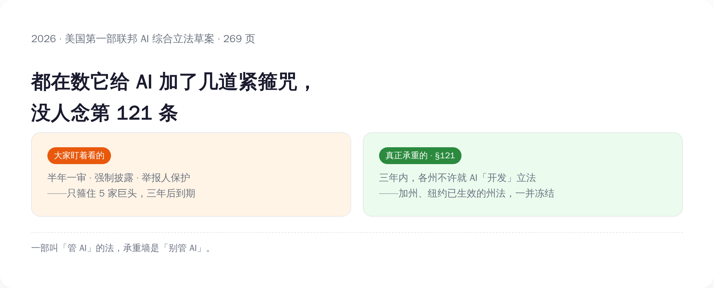
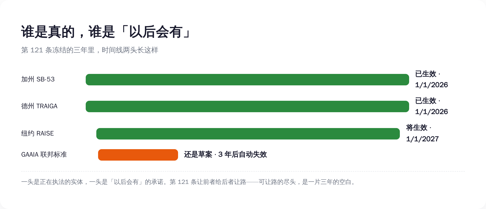
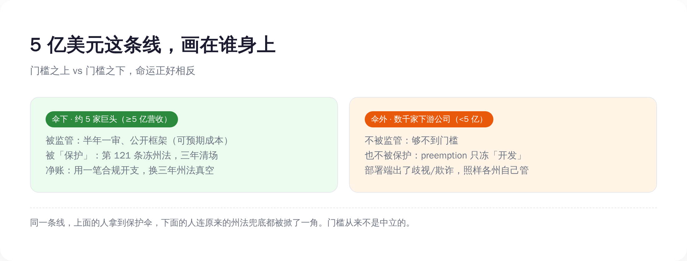

# 美国第一部 AI 大法，真正管的不是 AI，是不让各州管 AI

> **发布日期**：2026-06-19 | **分类**：AI 观察

## 导语

兄弟们，今天聊一份没人读完、但很多人替你解读的文件。

6 月 4 日，美国国会拿出一份 269 页的草案，名字起得相当有自信，叫《大美国人工智能法》（Great American AI Act，下面简称 GAAIA）。号称美国历史上第一部联邦层面的 AI 综合大法。所有媒体的标题都在数它给 AI 加了几道紧箍咒——半年一审、强制披露、举报人保护，听着挺狠。

但你要是真把它翻到第 121 条，会发现一件很拧巴的事：这部叫「管 AI」的法，最硬、最承重的一条，根本不是用来管 AI 的，是用来管「想管 AI 的人」的。

它规定：法案生效后三年内，美国各州不许就 AI 的「开发」立任何新法、也不许执行已有的法。加州今年 1 月 1 日刚生效的前沿 AI 透明法，纽约明年要生效的 RAISE 法案，统统按下暂停键。

一部叫「管 AI」的法，承重墙是「别管 AI」。今天就把这 269 页拆开，看看那条没人念给你听的第 121 条，到底替谁干了活。

---

## 一、先看清楚，这 269 页到底硬在哪

要骂一份文件软，得先承认它硬的地方。

GAAIA 分四个部分：前沿 AI 治理、劳动力、网络安全、研发与国际合作。真正长牙的是第一部分。它对一类公司提了一串实打实的义务：你得在模型上线时公开一份「前沿 AI 框架」，把灾难性风险怎么评、模型权重怎么防泄露写清楚；你得每半年请一家独立核查机构（IVO）上门审计一次；出了「关键安全事件」，15 天内上报；要是涉及迫在眉睫的死亡或重伤风险，24 小时内通知执法部门。

还有举报人保护：员工和外包合同工，谁举报了公司的 AI 违规，公司不许报复，否则要复职加两倍补发工资。配套还把商务部底下那个 CAISI（人工智能标准与创新中心）正式写进法律，每年拨款一亿美元。

单看这些，确实像一套紧箍咒。问题在于，每一道箍，只箍一类人。

这串义务，全都只压在「大型前沿开发者」头上。而这个词在法案里有精确定义：用超过 10 的 26 次方次浮点运算训出过前沿模型，并且上一年合并营收超过 5 亿美元。两个条件同时满足，才算。

满足的有谁？掰着手指头数得过来——OpenAI、Anthropic、Google、Meta，再加上够呛能凑齐的两三家。整个美国，五到八家公司。

*图注：同一份草案，左手给巨头加义务，右手替巨头冻州权——而加的义务三年到期，冻的州权也三年，真正贯穿始终的是后者。*

所以这是一份很精准的文件。它知道自己要箍谁，也知道自己要替谁松绑。

## 二、第 121 条：管 AI 的法，承重墙是「不许管 AI」

现在来念那条没人念给你听的。

第 121 条的措辞大意是：任何州、任何地方政府，不得制定、维持或执行「专门规制 AI 模型开发行为」的法律。而「开发」在这里被定义得很宽——「开发者在部署前实施或主导的一切行为」。期限：三年，到期得国会重新授权，否则各州监管权自动恢复。

翻成大白话：联邦这边大手一挥，各州过去两年辛辛苦苦立起来的那批 AI 法，先冻三年再说。

被冻的不是空气，是一批已经生效、正在运转的真东西。加州的 SB-53，参议员 Scott Wiener 牵头，2026 年 1 月 1 日已经生效，要求 5 亿营收以上的大型前沿开发者公开安全框架，加州总检察长执法，每违规一项最高罚 100 万美元。纽约的 RAISE 法案，州长 Hochul 签了，2027 年 1 月 1 日生效，要求 72 小时内报告安全事件。德州的 TRAIGA，2026 年 1 月 1 日生效。科罗拉多更惨，自己那部 AI 法还没等到生效，先被本州改了个稀碎。

这些法不是完美的，但它们是真实存在、且大部分已经压在巨头身上的约束。GAAIA 第 121 条干的事，就是把这些约束统一调成飞行模式。

这里有个最容易被「全国统一标准」这句话糊弄过去的细节，得拎出来说：

GAAIA 不是用一套联邦标准，去替换各州那套乱七八糟的标准。它是用「以后会有一套联邦标准」，去替换「现在就有的州标准」。

差别大了。因为那套联邦标准，现在根本不存在。GAAIA 到今天为止，还只是一份「讨论草案」（discussion draft），两位议员明说了没决定哪天正式提交，文末还挂着个征求意见的邮箱。更妙的是，前面那串给巨头加的义务（第 111、112 条），法案自己写了三年后自动失效。

*图注：州法是已经生效、正在执法的实体；联邦标准还停在草案、且三年后自动失效。被冻的窗口期里，统一的不是标准，是空白。*

把这几样摆一起，画面就清楚了：现在就生效的州法，给三年后会过期的联邦义务让路；而那个本该用来填空的联邦标准，连提交都没提交。统一的不是标准，是一段三年的真空。

## 三、为什么是 5 亿美元？因为这条线刚好圈住该被罩的人

回到那个营收门槛。为什么偏偏是 5 亿美元，不是 5000 万，也不是 50 亿？

因为 5 亿这条线，画得刚刚好。往上，圈住的是那五到八家真正训前沿大模型的巨头；往下，把成千上万家「拿别人的模型做产品」的下游 AI 公司，干净利落地排除在外。

这条线一画，一件很讽刺的事就成立了：门槛以下那几千家公司，**既不被这部法监管，也不被这部法保护**。

不被监管好理解——你营收没到 5 亿，不用做审计、不用公开框架。但「不被保护」是怎么回事？关键就在第 121 条只冻「开发」，不冻「部署」。也就是说，州政府管不了模型怎么「造」，但你拿模型去「用」——用 AI 筛简历筛出了歧视、用 AI 算信用分算错了人、用 AI 生成了骚扰内容——这些发生在「部署」环节的事，照样归州里管。

于是真正承接 AI 落地伤害的下游公司，一点保护伞都没分到。伞，是给伞下那五家撑的。

那五家被点名监管的巨头，换到的是什么？本来它们要应付的是 50 个州各立各的法、加州能罚它 100 万一项的拼图地狱；现在好了，三年清场。代价呢？是每半年请人来审一次——这种成本可预期、可量化、可以直接写进财报的合规开支。对一家年营收几百亿的公司，半年一审根本不算事，换三年的州法真空，这买卖稳赚。

你不用猜它们乐不乐，看它们自己的反应就行。

代表谷歌、微软、苹果的行业协会 ITI，当天就发声明感谢两位议员的「两党领导力」。商业软件联盟 BSA 称它是一份「可信、扎实」的努力。硅谷顶级风投 a16z 早就在公开路线图里喊话要联邦抢占。

**当一群被监管的公司，集体给一部监管法鼓掌，你就该回头去翻：它到底监管了谁。**

*图注：5 亿美元这条线把世界切成两半——伞下五家被监管也被州法真空保护，伞外几千家既不被监管、伤害落地了也只能各州自己扛。*

门槛这种东西，看着像技术参数，其实是政治。5 亿这个数字本身不重要，重要的是它把谁圈进来、把谁挡出去。

## 四、连 Anthropic 都嫌它软，可它本来就不是冲着「硬」去的

得替反方打一拳最硬的，不然不公道。

有人会说：你别阴阳怪气了，巨头要是真在偷着乐，怎么连最该被管的公司，自己都嫌这法太软？

这话有出处。6 月 12 日，Anthropic 的 CEO Dario Amodei 发了篇长文，叫《Policy on the AI Exponential》。他的意思很直接：AI 进步的速度已经甩开了社会能应对的速度，对前沿模型得上像飞机适航认证那样的强制第三方测试，政府得有法律权力去拦下危险的部署。换句话说，被监管的人，亲口嫌 GAAIA 这套「半年请人审一次」的自愿框架不够硬。

被管的求更硬的管，这听着像是给「巨头偷着乐」打脸。其实正好相反，它戳穿了这部法的设计意图。

因为「硬不硬」和「谁有权管」，是两件不同的事。Amodei 嫌软，嫌的是义务那一侧的烈度。而 GAAIA 真正的发力点，从来不在义务的烈度，在第 121 条的归属——谁有权管 AI。你可以一边觉得对前沿风险的约束太松（义务侧），一边照单全收那个三年清场的红利（归属侧）。这俩诉求在一家公司身上，毫不冲突。Amodei 嫌软，恰恰证明这法的承重墙不在大家盯着看的义务那一侧。

再说回那拳最硬的反驳：50 个州各立各的法，确实是真问题，企业被几十套法规来回拉扯，合规成本是实打实的。建立一个全国统一标准，方向本身没毛病。

这个我接。但统一是有前提的——得先有那个统一标准，再去拆州法。GAAIA 干的是反的：拆州法（三年抢占）立刻生效，而那个统一标准还停在讨论草案，自己还写了三年后过期。先拆后立，中间留一段真空，这跟「统一」是两码事，这叫「清场」。

何况这条路，国会自己一年前刚否过一次。2025 年 7 月 1 日，参议院以 99 票对 1 票，把一份预算法案里夹带的「十年禁止各州管 AI」条款给删了——那条款当时是绑在 BEAD 宽带补贴上、由参议员 Ted Cruz 力推的。99 比 1，唯一投反对的是 Thom Tillis。连国会自己都用压倒性票数说过：把州的手绑死，不行。

GAAIA 不过是把「十年」改成了「三年」，把硬绑改成了「先给点义务再绑」。骨架是同一根。

## 五、所以这事真正的看点，不是松还是紧，是谁有权管

把整件事翻到底，你会发现大多数解读都站错了战场。

它们在争这部法「松还是紧」——义务够不够、罚款狠不狠、审计勤不勤。但这部法真正的战场，根本不在义务的松紧，在管辖权的归属：AI 这件事，到底是联邦说了算，还是 50 个州也能各自说话。

反对的人，看的就是这个。36 位州总检察长，两党都有，联名反对联邦抢占。6 月 16 日，200 多位州议员联署致信国会，让它别动各州的监管权。消费者团体 Public Citizen 把话说得最白：这法案「剥夺各州应对真实伤害的权力」，然后承诺「国会以后会想出办法……以后」——它还补了一句，这是「一份大科技公司正在庆祝的灾难性提案」。公民自由联盟 ACLU 的评价更损：它「没从国会上一次的失败里学到任何东西」。

所以下次你再刷到「美国又出 AI 新规了」这种新闻，别急着数它加了几条义务、罚款写了几个零。翻到后面去找三样东西：有没有一条 preemption（联邦抢占）；它冻住了哪些已经生效的州法；那条圈定监管对象的门槛，把谁圈进来、把谁挡在外面。这三样，才决定这部法到底替谁干活。

一部叫「大美国 AI 法」的法案，最「大」的发明，不是管住了 AI，是教会了 50 个州的立法机关：在 AI 这件事上，先闭嘴三年。

至于那个被反复许诺、用来填空的「全国统一标准」——它现在的全部形态，是一份 269 页的讨论草案，落款处写着：欢迎提意见，邮箱 GAAIA@mail.house.gov。

就这。

## 数据来源

- [众议员 Obernolte 官方新闻稿：Obernolte、Trahan 发布《大美国人工智能法》讨论草案](https://obernolte.house.gov/media/press-releases/obernolte-trahan-release-discussion-draft-great-american-ai-act)
- [Obernolte & Trahan 联名社论：America Needs One National Framework for Artificial Intelligence（Bloomberg Law）](https://news.bloomberglaw.com/legal-exchange-insights-and-commentary/america-needs-one-national-framework-for-artificial-intelligence)
- [GAAIA 讨论草案分节摘要（Trahan 官网 PDF）](https://trahan.house.gov/uploadedfiles/gaaia_discussion_draft_section-by-section.pdf)
- [参议院 99-1 删除 AI 暂停令（参议院商务委员会官方声明，2025-07-01）](https://www.commerce.senate.gov/2025/7/senate-strikes-ai-moratorium-from-budget-reconciliation-bill-in-overwhelming-99-1-vote/)
- [36 位州总检察长两党联名反对联邦抢占州 AI 法（NAAG）](https://www.naag.org/press-releases/bipartisan-coalition-of-36-state-attorneys-general-opposes-federal-ban-on-state-ai-laws/)
- [200+ 州议员反对 GAAIA 抢占条款联名信（2026-06-16）](https://ari.us/wp-content/uploads/2026/06/State-Lawmakers-Letter_-GAAIA-State-AI-Law-Preemption-6-16-26.pdf)
- [Public Citizen 声明：该法案剥夺各州保护消费者、劳动者与儿童的权力](https://www.citizen.org/news/obernolte-trahan-bill-strips-states-authority-to-protect-consumers-workers-and-children/)
- [ACLU 对 GAAIA 抢占条款的反对声明](https://www.aclu.org/press-releases/aclu-reacts-to-draft-bipartisan-ai-bill-that-would-preempt-state-laws)
- [ITI（信息技术产业委员会）回应 GAAIA](https://www.itic.org/news-events/news-releases/iti-reacts-to-the-great-american-ai-act)
- [BSA（商业软件联盟）回应 GAAIA](https://www.bsa.org/news-events/news/bsa-on-bipartisan-great-american-ai-act)
- [Dario Amodei：Policy on the AI Exponential（2026-06-12）](https://darioamodei.com/post/policy-on-the-ai-exponential)
- [加州 SB-53《前沿人工智能透明法》正式文本（已生效 2026-01-01）](https://leginfo.legislature.ca.gov/faces/billTextClient.xhtml?bill_id=202520260SB53)
- [纽约州长 Hochul 签署 RAISE 法案（州长办公室）](https://www.governor.ny.gov/news/governor-hochul-signs-nation-leading-legislation-require-ai-frameworks-ai-frontier-models)

<!-- re-sync: WeChat IP whitelist updated 2026-06-20 -->
