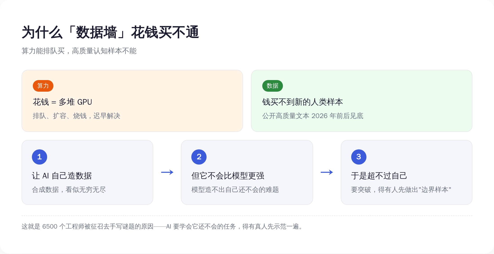

# AI 撞上的第一堵墙不是算力，是人脑——Meta 花 143 亿，把 6500 个工程师变回了标注工

> **发布日期**：2026-06-19 | **分类**：AI深度报道

## 导语

2026 年 6 月，一名 Meta 工程师对《连线》说出了一个词：古拉格。他不是在抱怨加班。他在描述自己的新工作——每周给 AI 手写谜题和编程题，教机器"人类是怎么用电脑的"。一年前，扎克伯格花 143 亿美元买下数据标注公司 Scale AI，挖来创始人执掌超级智能实验室。一年后，这笔"史上最贵 AI 并购"结出的果实之一，是 6500 名年薪百万的工程师，被征召去做时薪两美元的活。

---

## 一、一座用工程师当矿工的矿

事情在 6 月 12 日被 TechCrunch 捅破。Meta 三月新建的 Applied AI 部门，约 6500 名工程师和产品经理，被内部称作"draftees"——被征召的兵。他们的日常，是每周生成谜题和编程题目，喂给 AI agent 学习"人类如何完成计算机任务"。

一名员工的原话是："突然之间，你的人生失去了意义。你几乎不和任何人交流，每周只是不断完成那些任务。"另一名员工更直接：这里就是古拉格。

这不是孤立的牢骚。五月，Meta 裁掉约 8000 人、强制转岗约 7000 人，裁员加转岗合计触及全球约 20% 的员工。超过 1600 人联署，抗议一项追踪他们每一次点击和键盘操作的 AI 训练数据计划。一场内部直播会上，有人当着全体失控，要求把一句话转告某位 AI 高管——他是个混蛋。

6 月 13 日，扎克伯格在备忘录里认错："我们犯了错误，而且几乎肯定会再犯更多错误。"他承诺年内不再大规模裁员。但他没有解释一件更要命的事：为什么全世界市值最高的科技公司之一，要让自己最贵的工程师，去干最原始的体力活。

## 二、这不是管理事故，是一堵墙第一次显形

答案不在管理层，在工程学。

算力是能用钱买通的。GPU 不够，就排队、扩容、烧钱，迟早解决。数据不行。Epoch AI 的测算显示，互联网上的高质量公开文本，将在 2026 年前后被训练消耗见底——这就是业内说的"数据墙"。它不是一道预算问题，是一道物理上限。

那为什么不让 AI 自己造数据？这正是多数人会卡住的地方。

*算力可以排队买，但要让模型学会它还不会的难任务，必须有人类先做出那个样本——这是合成数据补不上的硬伤。*

模型无法用比自己更弱的数据，把自己变强。要让它学会一项它还不会的难任务，必须有人类先做出那个"边界样本"。于是绕了一圈，AI 进步最稀缺的原料，不是 GPU，**是还没被榨干的人类高质量认知**。Meta 的特殊之处只在于：它手里正好攥着 6500 个可以"征用"的工程师。

## 三、一座古拉格，两层人

如果你对硅谷工程师的遭遇感到同情，先别急。古拉格不止一层。

内层是这些上了头条的工程师。外层早就存在，而且更深：Scale AI 的标注工散布在肯尼亚、菲律宾，时薪低到两美元，甚至按任务计、一单一美分。今年三月有人爆料，他们被要求标注 Meta 智能眼镜用户如厕、行房的私密画面。工程师的"古拉格"和他们相比，仍然是优越的——但这恰恰是重点。

*多数人以为 AI 先取代低技能岗位，结果第一批被降格的，是写代码的高技能工程师。*

AI 对自家工程师的用法——廉价、可替换、把人当成训练原料——正在复制它对第三世界工人的用法。我们习惯了一句话：AI 先取代低技能岗位。可第一批被降格的，恰恰是写代码的高技能者。他们以为自己站在浪潮之上，结果发现自己是浪潮的燃料。

## 四、这堵墙，全行业都在撞

有人会说，这是过渡期。蒸汽机刚出现时，反而雇了更多煤矿工人；数据标注是 AI 的"煤矿工时代"，会随效率提升而消退。也许吧。但过渡期可能很长，而此刻钱买不通这道坎，是事实。

也有人——比如去年离开 Meta 的 Yann LeCun——会说，数据墙只是大语言模型这条路上的局部病，根本问题是路线选错了。如果他对，那么在一条错的路上花 143 亿买数据公司，只会更荒诞。

无论哪种解释成立，Meta 都只是第一块露馅的多米诺。OpenAI、谷歌同样要靠人类的高质量样本喂养，只是还没把账单摊到自家工程师脸上。更难堪的是，自从 Scale AI 站队 Meta，OpenAI 和谷歌随即与它停止合作——Meta 用 143 亿买下的数据护城河，转头变成了一座没人来的孤岛。

扎克伯格说，我们犯了错误。但他没说的是：把工程师变成标注工，不是某个执行环节的失手，是这条路本身的账单，第一次寄到了硅谷的核心。**AI 没有取代这些人，它只是让他们看清，自己一直在为它打工。**

## 数据来源

- [TechCrunch：Meta's months-old AI unit is a 'soul-crushing gulag'](https://techcrunch.com/2026/06/12/metas-months-old-ai-unit-is-a-soul-crushing-gulag-say-the-engineers-stuck-inside-it/)
- [TechTimes：Meta Conscripts 6,500 Engineers as Data Labelers — Revolt Exposes AI Training Ceiling](https://www.techtimes.com/articles/318586/20260617/meta-conscripts-6500-engineers-data-labelers-revolt-exposes-ai-training-ceiling.htm)
- [Business Chief：Mark Zuckerberg admits Meta has 'made mistakes'](https://businesschief.com/news/mark-zuckerberg-meta-made-mistakes-with-ai-overhaul)
- [Epoch AI：Will we run out of ML data?](https://epoch.ai/publications/will-we-run-out-of-ml-data-evidence-from-projecting-dataset)
- [CNBC：A year after Meta tapped Alexandr Wang to build AI](https://www.cnbc.com/2026/06/14/meta-hired-alexandr-wang-to-build-ai-its-zuckerbergs-job-to-sell-it.html)
- [新浪科技：扎克伯格承诺 Meta 今年不会再裁员](https://finance.sina.com.cn/tech/digi/2026-06-19/doc-inicyfhq2621749.shtml)
