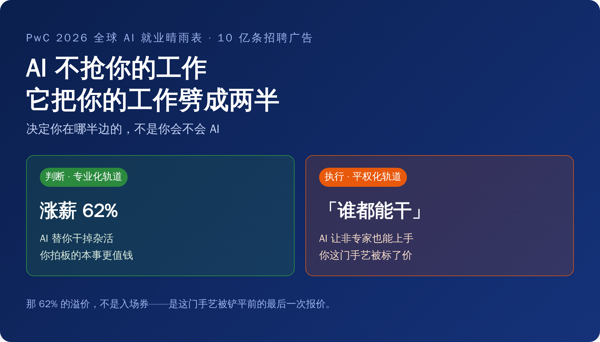
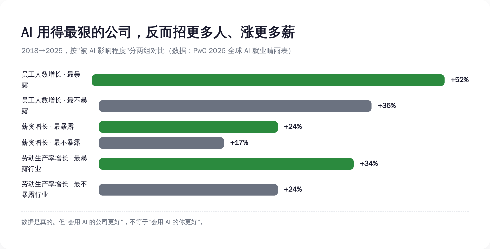
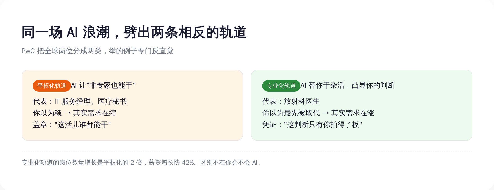
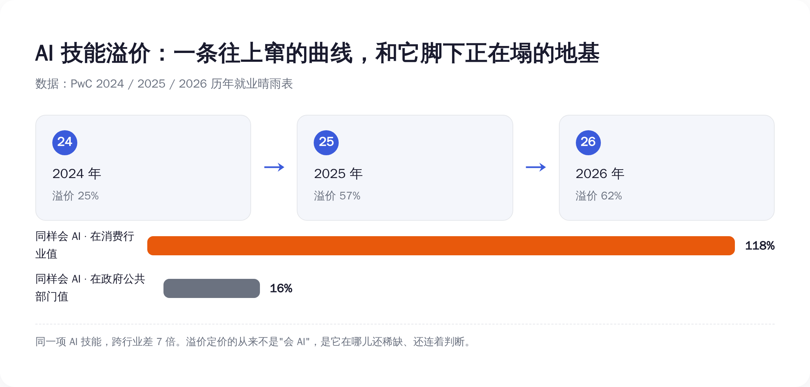
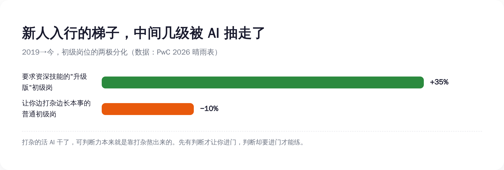

# AI 不抢你工作，它把你工作劈成两半——一半涨薪 62%，一半标上"谁都能干"

> **发布日期**：2026-06-21 | **分类**：AI 观察

## 导语

兄弟们，今天聊一份让你看完想给自己加薪、但仔细一想其实是给你判了缓刑的报告。

6 月 15 日，全球最大的会计师事务所之一普华永道（PwC）发布了《2026 全球 AI 就业晴雨表》。这玩意儿不是拍脑袋写的，它扒了 27 个国家和地区、超过 10 亿条招聘广告，又把这些广告跟公司财报、岗位任务数据缝在一起。样本大到这个程度，里面的数字你不太好嘴硬。

而它最抓眼球的一个数字是：**会用 AI 的打工人，工资溢价已经冲到 62%。** 也就是干同一个岗位，会 AI 的比不会的，平均多挣六成。两年前这个数还是 25%，去年 57%，今年 62%——一条肉眼可见往上窜的曲线。

于是所有解读都在喊同一句话：快去学 AI，上车，吃这波溢价。

但这份报告自己起的副标题，叫"就业的两种未来"（Two Futures for Jobs）。注意，是两种，不是一种。它真正说的，不是"AI 让打工人涨薪了"，而是 AI 正在拿一把刀，把你这份工作劈成两半：一半叫判断，一半叫执行。然后它只给判断那一半涨薪，给执行那一半，盖上一个章——"这活儿现在谁都能干"。

那 62% 的溢价，不是入场券。今天就把这份 10 亿条广告堆出来的报告拆开，看看那把刀，到底落在你身上的哪个位置。

---

## 一、先把硬的认了：AI 真没在裁人，它在疯狂招人、疯狂涨薪

要拆一份报告的叙事，得先承认它数据硬的地方。不然就成了为反对而反对，那是耍流氓。

这份晴雨表最反直觉、也最实在的一组数据是这样的：把所有公司按"被 AI 影响的程度"排队，AI 暴露度最高的那批公司，从 2018 年到 2025 年，员工人数涨了 52%；而 AI 暴露度最低的那批，只涨了 36%。

你没看错。用 AI 用得最狠的公司，不是在裁人，是在比别人更快地招人。

工资也是。最暴露的那批公司，员工整体薪资涨了 24%，最不暴露的只涨了 17%。劳动生产率，最暴露的行业 2025 年比 2018 年涨了 34%，最不暴露的涨了 24%。每一项，会用 AI 的一边都赢。

所以 PwC 给了一句很提气的官方结论：AI"远不是一个就业杀手，当它被用来撬动增长、打开新市场时，它甚至可能是一个就业扩张器"。

这话听着是不是特别舒服？特别想转发到家族群，告诉天天担心你被 AI 取代的老妈："看，专家说了，AI 是来给我加薪的。"

*图注：四项指标全是会用 AI 的公司赢——这一栏 PwC 反复在讲。问题是它没把另一栏并排放给你看。*

舒服归舒服，先在心里记一笔账：这份告诉你"AI 对打工人是好事"的报告，是谁发的？是普华永道。一家靠帮企业做"AI 数字化转型"咨询赚钱的公司。它说 AI 是好事，约等于卖铲子的告诉你这山里有金子。

铲子可能是真好铲子，金子也可能是真金子。但这话从谁嘴里出来，你得记着。我们接着往下看，看它招人、涨薪这串好数字底下，那把刀藏在哪。

## 二、报告自己起的名字就泄了底：不是"更好"，是"两种"

把这份报告从头读到尾，你会发现 PwC 其实根本没说"AI 让所有打工人都更好"。是解读的人，自动把"两种未来"读成了"一种好未来"。

它说的是，全球的活儿正在被 AI 劈成两条轨道。

第一条，PwC 叫它"专业化"（professionalised）。它的原话定义是：AI 把岗位里那些重复的、routine 的活儿自动化掉，于是人类的判断力和专业知识被进一步凸显。说人话就是——脏活累活机器干了，你那点真本事更值钱了。

第二条，叫"平权化"（democratised）。原话定义是：AI 让这个岗位本身，变得连非专家也能上手。说人话就是——你这活儿，AI 一加持，外面随便拉个人来都能干个七七八八。

同一场 AI 浪潮，落在这两条轨道上的人，是两种完全相反的命运。而 PwC 给的例子，狠就狠在它专门挑了反直觉的。

专业化轨道，它举的代表是放射科医生。这职业你熟吧？过去十年被预言"最先死于 AI"的头号种子选手，AI 看片子又快又准，多少人断言放射科要凉。结果晴雨表的数据显示，放射科医生的岗位需求在涨。为啥？因为 AI 把读片这种重复劳动接走之后，医院能处理的病例量上去了，对那个最后拍板、签字、负责的高水平判断，需求反而更大了。

平权化轨道，它举的代表是 IT 服务经理、医疗秘书。这些岗位，多少人觉得稳得很，坐办公室、懂流程、饿不着。结果它们在另一条轨道上——AI 让这些活儿对非专家敞开了，需求往下走。

*图注：你以为最先被 AI 取代的放射科医生，在涨；你以为稳的 IT 服务经理，在缩。分轨标准不是'会不会 AI'，是 AI 接走的到底是你的杂活、还是你这个人。*

这两条轨道差多少？专业化岗位的数量增长，是平权化的整整 2 倍；薪资增长速度，从 2021 年算起快了 42%。

那么，决定你被分到哪条轨道的，到底是什么？

直觉会告诉你：是"你会不会用 AI"。学会了 AI，上专业化的车；不学，被平权化淘汰。所有让你赶紧报班的解读，都建立在这个直觉上。

但 PwC 的定义里，分轨标准压根不是这个。是 AI 在你这份工作里，接走的到底是哪一半——它接走的是你判断周围那些重复的执行，你就被抬上专业化轨道；它接走的是你这份工作本身的门槛、让谁都能进来，你就被铲到平权化轨道。

会不会 AI，是你手里的工具。判断和执行的配比，是这份工作的命。工具你能学，命这个东西，得看你这活儿原本是靠脑子吃饭，还是靠"会这套流程"吃饭。

## 三、那 62% 的溢价，不是入场券，是一张倒计时的票

回到那个最诱人的数字，62% 的工资溢价。

为什么会用 AI 能多挣六成？经济学里这事一点都不神秘：因为稀缺。会的人少，活儿需要，价格就上去。62% 是稀缺给的价。

但你把"平权化"那条轨道的定义再读一遍——"让非专家也能干"。这句话翻译过来是什么？是稀缺正在被亲手摧毁的过程。今天你会某个 AI 技能值钱，是因为它还稀缺；而 AI 工具进化的方向，就是让这个技能不再稀缺、让它"谁都能上手"。你吃的这口溢价，本质是在吃这个技能"还没烂大街"的时间差。

这不是我瞎推的，报告里有个数据直接戳穿了它：AI 暴露度最高的那些岗位，它们要求的技能，变化速度是 AI 暴露度最低岗位的 2 倍还多。而且这个差距，比去年又扩大了 75%。

技能换得越来越快，是什么意思？是你今天辛辛苦苦考下来、能吃 62% 溢价的那个 AI 技能，保质期正在变短。今天的稀缺溢价，两三年后大概率变成招聘要求里的一行基线——"熟练使用 XX，应届亦可"。

*图注：溢价这条曲线在往上窜，但它脚下的技能保质期在缩短；而且同样会 AI，在消费行业值 118%，在政府部门只值 16%——溢价不是'会 AI'给的，是稀缺给的。*

还有个数字能把"溢价是会 AI 给的"这个错觉彻底打碎：同样是会 AI，在消费市场这个行业，溢价高达 118%；在政府和公共部门，只有 16%。同一身本事，换个行业，价格差了 7 倍多。

这说明什么？说明给你涨薪的从来不是"会 AI"这三个字本身，而是这门本事在你这个具体的位置上，到底还稀不稀缺、还连不连着判断。把"会 AI"当成护身符的人，相当于揣着一张写着金额的票，却没看票面上那行小字：本券两到三年内作废。

更别说，当一个技能从稀缺变成"谁都会"，会它的人就从"稀缺人才"变成"庞大供给"。供给一上来，你在老板面前那点议价的腰杆，是会软下去的。你以为 62% 是你赢了，其实那是这门手艺，被铲平之前的最后一次报价。

## 四、最狠的一刀，落在还没入行的新人身上

如果说前面这些落在存量打工人身上还算缓刀，那 AI 对一类人是直接抽梯子——刚毕业、想入行的新人。

这份报告今年专门加了一块对"初级岗位"的分析，光美国就扒了 240 万条入门级招聘广告。它发现了一个很拧巴的现象，PwC 给它起名叫"高级化"（seniorization）。

什么意思？在 AI 暴露度高的领域，那些标着"初级""应届可"的岗位，要求你具备领导力、判断力这类传统上属于资深员工技能的概率，是 AI 暴露度低岗位的 7 倍。在最暴露的那些职业里，初级岗位招聘广告上新冒出来的技能要求，有 52% 是过去只跟老员工挂钩的；而最不暴露的职业，这个比例只有 7%。

PwC 全球劳动力业务负责人 Pete Brown 的原话说得很清楚：

> "经验和专业能力之间那种传统的关系正在改变。AI 拿走了一部分过去充当'学徒期'的日常工作，同时又把对判断力、领导力和适应力的需求，提前到了职业生涯非常早的阶段。"

这话斯文，翻成大白话就很扎心了：过去你进一个行业，是从打杂、跑腿、做表、改格式这些纯执行的活儿干起，干着干着，判断力就在这些杂活里慢慢熬出来了。这套"边打杂边长本事"的路子，就是所谓的学徒期。

现在 AI 把打杂的活儿全接走了。听上去是好事？可问题是，企业转头就要求你一进门就有判断力——而判断力这东西，原本恰恰是靠那几年打杂熬出来的。梯子中间那几级被 AI 抽掉了，然后它指着梯子顶端跟你说：你得先站到这儿，我才让你上来。

*图注：AI 接走了新人打杂的活，却要求新人一进门就有本该靠打杂熬出来的判断力——升级版初级岗 +35%，普通初级岗 -10%。入行的梯子，中间几级被抽了。*

数据也对得上：那种一进门就要求资深技能的"升级版"初级岗，从 2019 年到现在涨了 35%；而那种能让你边打杂边长本事的普通初级岗，缩了 10%。

这就是"AI 不裁人"这句话里，最不动声色的一刀。它没裁掉在职的人，它裁掉的是"入行"这件事本身。纯执行的活儿是新人唯一的入场口，而执行，正是 AI 第一个清空的东西。一个连门都进不去的人，不会出现在"裁员率"的统计里——他只是从来没被算进来过。

## 五、所以这报告真正该怎么用：先别急着励志

得替最硬的一种反驳挡一刀，不然不公道。

有人会说：你通篇在泼冷水，那照你说，这份报告唯一的用处就是制造焦虑？那我学不学 AI、往哪儿走，不还是得有个说法？

有说法。但在给说法之前，得先把这份报告里被所有"励志解读"自动跳过的那个数字摆出来——它才是这事的底色。

PwC 发现，在 AI 暴露度最高的公司里，收益也不是平均分的。最顶端那 20% 的"超级明星"企业，劳动生产率增长高达 163%，是整体最暴露公司平均水平（34%）的差不多 5 倍。也就是说，AI 创造的那块大蛋糕，绝大部分被极少数头部公司端走了。

这正是 2024 年诺贝尔经济学奖得主、MIT 的 Daron Acemoglu 一直在敲的警钟：技术进步从来不会自动变成所有人的繁荣。当 163% 的生产率红利高度集中在金字塔尖那一小撮企业手里时，这就不再是一个"你努力学 AI 就能分一杯羹"的技能问题了，这是个谁拿走了蛋糕的权力问题。

把这层说破，是为了先把丑话讲在前头：**指望靠个人选对赛道，就能在 AI 这局里翻盘，是不现实的。** 163% 流向哪里，不在你我这种打工人的牌桌上。你往判断密集的轨道挪，挪到头，也只是从"马上被铲平"换成"晚一点被铲平"，房子还是那个着火的房子，你只是挑了个离门近点的座位。

但——在这个房子既定的前提下，挑离门近的座位，依然比闭着眼乱坐强。这就是这份报告对个人唯一诚实的用法：

它不该被你读成"快去考个 AI 证书追那 62% 溢价"。它该被你读成一道盘点题——把你现在这份工作摊开，老老实实分一下：哪些是判断（要不要、对不对、谁负责，这些只有你拍得了板的部分），哪些是执行（流程化的、能写成 SOP 的、别人照着就能干的部分）。判断占的比重越大，AI 来了你越往上抬；执行占的比重越大，你越早被盖上那个"谁都能干"的章。

然后往判断那一头使劲。不是去追最新最炫的 AI 工具——那是执行，而且保质期两年。是去练那些 AI 替不掉、也"民主化"不掉的东西：在信息不全时拍板的判断力、对一件事到底值不值得做的品味、出了事敢负责的担当。报告里也说了，AI 暴露岗位新长出来的任务，有 2.5 倍更依赖同理心、判断力和创造力。机器越能干，这几样越是你最后的护城河。

这份 10 亿条招聘广告堆出来的报告，最该让你记住的，不是 62% 那个让你想转发的数字。是它背后那句没明说的话：

**AI 从来不裁人。它只是把"裁人"这个词，悄悄改成了"这个岗位现在谁都能干"。然后它还会先给你涨 62%，奖励你学会了亲手说出这句话。**

至于那 163% 去了哪儿——它不在你的盘点题里，也不在你能改的范围里。但你至少有权知道，自己盘的是哪一半。

就这。

## 数据来源

- [PwC：2026 全球 AI 就业晴雨表新闻稿《AI 把全球劳动力市场分成两条截然不同的路径，奖励人类技能》（2026-06-15）](https://www.pwc.com/gx/en/news-room/press-releases/2026/pwc-2026-ai-jobs-barometer.html)
- [PwC：2026 Global AI Jobs Barometer 主报告页](https://www.pwc.com/gx/en/services/ai/ai-jobs-barometer.html)
- [PwC：2026 Global AI Jobs Barometer 全报告 PDF](https://www.pwc.com/gx/en/issues/artificial-intelligence/job-barometer/2026/2026-global-ai-jobs-barometer-full-report.pdf)
- [PwC：2025 全球 AI 就业晴雨表新闻稿（提供 25%→56% 历史基准）](https://www.pwc.com/gx/en/news-room/press-releases/2025/ai-linked-to-a-fourfold-increase-in-productivity-growth.html)
- [Anthropic：AI 的劳动力市场影响研究（反证——AI 暴露度上升与就业总量下降相关）](https://www.anthropic.com/research/labor-market-impacts)
- [Daron Acemoglu & Jonas Loebbing：Automation and Polarization（2024）](https://shapingwork.mit.edu/wp-content/uploads/2026/03/Automation-and-Polarization.pdf)
