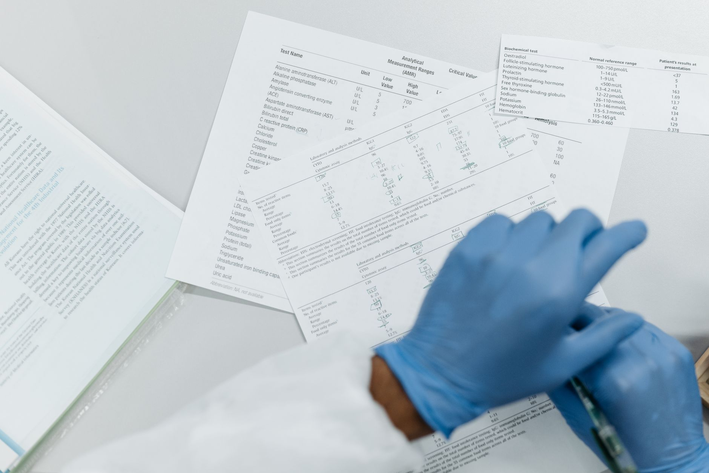
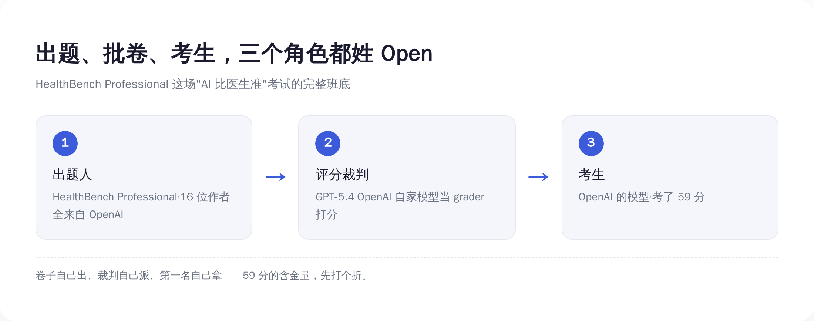
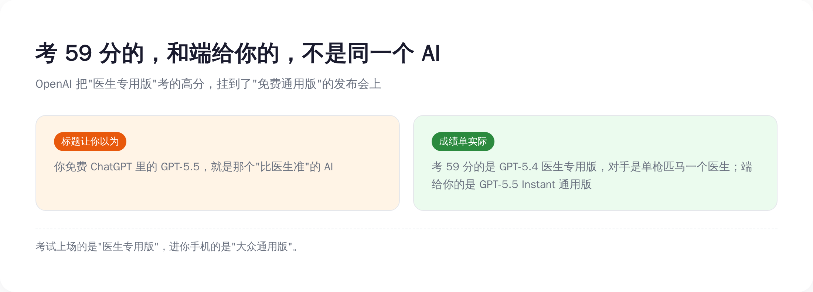
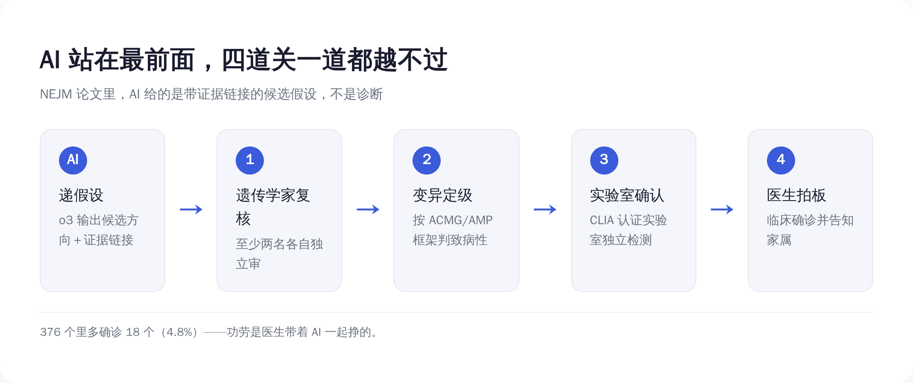
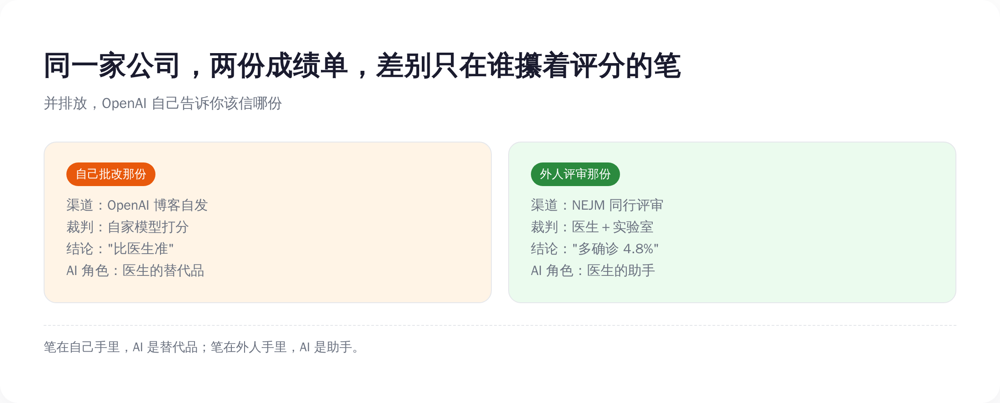

# OpenAI 同一天发了两份 AI 看病成绩单：自己批改那份说"比医生准"，送外人评审那份只敢说"多对了 4.8%"

> **发布日期**：2026-06-21 | **分类**：AI 观察

## 导语

兄弟们，今天聊一件 OpenAI 自己都没好意思放在一起说的事。

6 月 18 日，OpenAI 一天之内发了两份 AI 看病的成绩单。

第一份，挂在自家官网首页，标题翻译过来叫"提升 ChatGPT 的健康智能"。核心卖点一句话：让全世界免费用户都能用的 GPT-5.5，回答健康问题的质量，已经超过了人类医生手写的答案。配的数字也很硬——AI 拿 59 分，医生拿 43.7 分。

第二份，发在《新英格兰医学杂志》旗下的 NEJM AI 上，是一篇规规矩矩、过了同行评审的学术论文。讲 AI 帮波士顿儿童医院诊断罕见病。这份的结论谦虚得不像同一家公司写的：在 376 个孩子里，AI 帮医生多确诊了 18 个，也就是 4.8%。而且论文白纸黑字写着：模型一个病人都没诊断，每一个诊断都是医生下的。

同一天，同一家公司，同一个"AI 看病"的主题。一份吹得震天响，一份收得规规矩矩。

所有人转的都是第一份。"AI 看病比医生准"，标题党狂喜，家族群刷屏，焦虑的、兴奋的，全都奔着那个 59 分去了。

但真正值得看的，是把这两份成绩单并排放在一起。因为 OpenAI 自己已经用这两份东西，悄悄告诉了你一件事：它在什么场合能吹，在什么场合得收着。今天就把这两张卷子摊开，看看那个"比医生准"，到底是怎么考出来的。

---

## 一、先把吹的那份认了：59 比 43.7，AI 确实赢了

拆一份成绩单，得先承认它硬的地方。不然就成了为黑而黑，那是耍流氓。

OpenAI 这次甩出来的数字，单看是真不虚。

先是一个 71%。OpenAI 说，过去大约两个月里，ChatGPT 上那些健康类回答中，被标记"含至少一个事实性错误"的比例，下降了 71%。错误率砍掉七成，听着确实是质的飞跃。

然后是那个最唬人的对比实验。OpenAI 找了一批医生，让他们给一批有代表性的健康问题写标准答案——时间随便花，网随便查，唯一不许用的就是 AI。然后再找另一批医生，盲评：同一个问题，AI 答的和人医生答的摆在一起，哪个更好。一共评了 3500 条回答。结果是，GPT-5.5 在准确性、沟通质量、完整性、对做健康决策的帮助，四个维度全部赢过医生手写的答案。

还有那个 59 分。在 OpenAI 一个叫 HealthBench Professional 的专业医疗评测里，它的模型拿了 59.0 分，作为对照的医生基线只有 43.7 分。其中"写病历、写文书"这类任务，AI 64.1 分对医生 32.1 分，几乎是翻倍碾压。这个差距，统计学上 p 值小到 3.7×10⁻¹⁰，基本可以排除"碰巧赢的"。

这些数字摆出来，你很难嘴硬。AI 在处理医学文字这件事上，又快又全，是真本事。

而且 OpenAI 反复强调，这次更新是给免费用户的。GPT-5.5 早就是 ChatGPT 的默认模型，不充钱也能用。230 万——不对，是它自报的每周 2.3 亿人在 ChatGPT 上问健康相关的问题。一个比医生答得还好的东西，免费向几亿人开放。

这话听着是不是特别提气？特别想转给那个一生病就乱搜、搜完更焦虑的朋友：你看，以后别瞎搜了，直接问 AI，专家说了，比医生还准。

提气归提气，先在心里记一笔账：这份告诉你"AI 比医生准"的成绩单，是谁出的题，又是谁批的卷？

## 二、出题的、批卷的、考生，三个都姓 Open

把那份成绩单翻到背面，问题就出来了。

HealthBench Professional 这套医疗考卷，是谁编的？是 OpenAI。论文署名的 16 个作者，从通讯作者到打杂的，全部来自 OpenAI，没有一家外部医院、外部大学联署。

那批卷子的，又是谁？这里是最骚的一步。这套评测不是请医生一份份人工打分的——是让一个 AI 模型当裁判，照着评分标准给答案打分。而这个当裁判的模型，是 GPT-5.4。也是 OpenAI 自己家的。

你把这条链子捋一遍：题，OpenAI 出的；给答案打分的裁判，是 OpenAI 的模型；考出 59 分的考生，还是 OpenAI 的模型。出题人、裁判、考生，三个角色，全姓 Open。

这就好比一场考试，卷子是你出的，改卷的是你弟弟，考第一名的是你儿子。然后你开发布会宣布：经过严格测评，我儿子的水平超过了在场所有老师。

*出题、批卷、考生三个角色全姓 Open——59 分这场考试，是 OpenAI 自己跑完的闭环。*

OpenAI 当然会辩解：评分标准（rubric）是真医生写的，一条条临床要点，迭代了好几轮。这没错。但写标准的是医生，真正一份份对着标准打分、决定 59 还是 43 的，是那个 AI 裁判。标准再客观，最后捏着分数笔的手，姓什么很重要。

更要命的是，这块牌子还不是什么"医疗金标准"。它是开放的，谁都能来刷分——今年 1 月，中国的百川 M3 就在同款 HealthBench 上反超过 OpenAI 当时的最强模型。一块能被对手刷过去的评测，本质就是个竞争靶子：靶子上的环数，证明你枪法比对手准，证明不了你能上手术台。何况这块靶子还是 OpenAI 自己造的、长期自家模型霸榜——值得起疑的，从来不是谁分高，是谁攥着这套打分的规则。

这一节不是要说 AI 在装。AI 处理医学文字的能力是真的。这一节要说的是：当一家公司自己出题、用自己的模型批卷、再发布自己的胜利时，那个"赢"字，含金量是要打折的。打多少折，下一节有个更直接的证据——连 OpenAI 自己，都没敢把这张卷子端到你面前。

## 三、考 59 分的那个 AI，根本不是端给你的那个

这是整件事里最绕、也最值得停下来看的地方。说穿了就一句：考试上场的，和进你手机的，根本是两个 AI。版本号你不用记，记住这层错位就行。

考出 59 分、把医生按在地上摩擦的，是哪个 AI？翻 OpenAI 自己的论文，那个版本叫 GPT-5.4，而且是 "ChatGPT for Clinicians"——一个专门给临床医生用的版本。它的对手呢？是单枪匹马、一个人作答的医生。

而 6 月 18 日那篇官网博文，吹的、要端到你免费 ChatGPT 里的，是 GPT-5.5 Instant。一个面向所有普通人的通用版。

发现没有？考试时上场的是"医生专用版"，发奖时领奖、进你手机的是"大众通用版"。OpenAI 把一个专业版考出的高分，挂到了一个通用版的发布会上。考的和卖的，不是同一个东西。

*考高分的是医生专用版、对手是单个医生；端到你手机里的却是另一个通用版。*

这还只是第一层错配。第二层更直接：对照实验里，医生是一个人、没有 AI 帮忙、单独答题；现实里真正的好医生，是会查文献、会会诊、会拿 AI 当工具的。让一个被绑住手脚的单人医生，去对打一个调好了的模型——这场比试，从设计上就是奔着 AI 赢去的。

而最诚实的一句话，藏在 OpenAI 自己的免责声明里。官网原文写着：健康功能"旨在支持、而非替代医疗护理，不用于诊断或治疗"。

你品品这个拧巴：左手发布会上说我比医生准，右手用户协议里写着别拿我来诊断。一家公司同时讲这两句话，不是精神分裂，是精算——能吹的地方一个字不少，要担责的地方一个字不沾。

连 Sam Altman 自己都露过底。他公开说过，ChatGPT 多数时候是比多数医生更强的诊断工具；但紧接着同一场，他又说了下半句——**"我真的不想在没有人类医生在场的情况下，把自己的医疗命运交给 ChatGPT。"**

老板亲自给你打了样：这东西可以信，但别拿自己的命去信。这话他自己懂。可这半句，从来不会印在发布会的大屏幕上。

## 四、同一天那份规矩的成绩单，AI 连诊断都不许下

现在翻到第二份，那份没人转的。

同一天，OpenAI 和波士顿儿童医院、哈佛，一起在 NEJM AI 上发了篇论文。研究对象是 376 个孩子——注意，这 376 个，全是已经做过基因检测、看过专科、医生们用尽办法还是没查出病因的疑难病例。是医学体系里被剩下的那批人。

AI 在这里干了什么？它用的是 o3 Deep Research 模型，输入病历、症状、预筛的基因清单，输出的不是诊断，而是"**带证据链接的候选假设**"。说人话：AI 不下结论，它只递线索——"我怀疑可能是这几个方向，证据在这儿，你们看"。然后把球踢回给医生。

接下来这套流程，才是这篇论文最硬的地方。AI 递上来的假设，要过四道关：

第一关，至少两名临床遗传学家，各自独立审。第二关，按国际通行的 ACMG/AMP 框架（一套给基因变异定"致病等级"的国际标准），把可疑的基因变异定级，够不够得上"致病"。第三关，送 CLIA 认证（美国临床实验室的资质体系）的实验室，独立做检测确认。第四关，临床团队拍板，再把结果告诉家属。

*AI 只递线索，诊断要过医生、框架、实验室、临床四道关——它一道都越不过。*

四道关，AI 站在最前面，一道都越不过去。它只能把线索递到第一关门口，剩下三关全是人和实验室在走。

最后的成果是：376 个里，多确诊了 18 个，4.8%。分布是 10 例罕见神经发育障碍、4 例神经肌肉病、2 例儿童猝死、2 例早发精神病——每一个，都是一个本来要在黑暗里继续等下去的家庭。

这篇论文的结论部分，OpenAI 写了一句和发布会画风完全相反的话：本研究不能作为"患者、医生或用户应该用 OpenAI 模型来诊断疾病或做医疗决策"的证据；模型没有诊断任何一个参与者，每一个诊断，都由合格的临床专家通过既定流程作出。

它甚至主动认怂，列了一堆没做到的：这是回顾性研究、没测假阳性会带来多少负担、没算省了多少时间和成本。

你看，把外人（NEJM 的同行评审）请进来当裁判，AI 的角色立刻就老实了——从"比医生准"的替代品，变成了"帮医生多找到 4.8%"的助手。一个字都不敢吹大。

## 五、同一家公司，两副面孔，差别只在谁攥着评分的笔

把这两份成绩单并排钉在墙上，结论就自己跳出来了。

*自评那份 AI 是替代品，外审那份 AI 是助手——变的只是评分的笔在谁手里。*

左边这份，OpenAI 自己出题、用自己的模型批卷、自己在博客发布，没人管。于是 AI 成了"超过医生"的替代品，标题敢用最大号字。

右边这份，送进 NEJM 让外人评审，规则是医生复核、实验室确认、专家拍板。于是 AI 缩回到"给候选假设"的助手，连"诊断"两个字都不敢碰。

技术是同一拨技术，公司是同一家公司。唯一变的，是**评分的那支笔，攥在谁手里**。笔在自己手里，AI 就是医生的替代品；笔在外人手里，AI 就只敢当医生的助手。

有人会较真：这两份研究本来就不是一回事，一个考的是回答健康问题的文字质量，一个测的是罕见病里找线索的本事，苹果跟橘子，没法直接比。没错。可正因为是两件事，OpenAI 在这两件事上挑的说法，才更露馅——同样是它家的 AI、同样有它深度参与，能自己说了算的场合，它就喊"超过医生"；得过外人那一关的场合，它就乖乖退回"给医生打下手"。

OpenAI 没有撒谎。两份成绩单的数字可能都是真的。它只是非常清楚地知道，哪份能拿去做免费用户的增长故事，哪份得规规矩矩走学术程序。能吹的吹满，要担责的收紧——这不叫造假，这叫公关。比造假高级，也比造假难防。

所以下次再刷到"AI 看病比医生准"这种标题，先别急着焦虑或狂喜，问三句话就行：这个 benchmark 是谁建的？给答案打分的裁判是谁？过没过外部同行评审？三句话问下来，多数"碾压医生"的神话，都会缩水成"在某个自己画的靶子上多打了几环"。

AI 真能帮上医疗的忙，那份 NEJM 论文已经证明了——在专家都束手的地方，多救回 18 个孩子，这是实打实的功德。但功德是医生带着 AI 一起挣的，不是 AI 一个人挣的。

把免费 ChatGPT 给你的健康回答，当成一条值得拿去问医生的线索，可以。当成诊断，别。

这不是我说的。这是 OpenAI 自己，用同一天发的两份成绩单，亲口告诉你的。

## 数据来源

- [OpenAI：Improving health intelligence in ChatGPT](https://openai.com/index/improving-health-intelligence-in-chatgpt/)
- [OpenAI：Using AI to help physicians diagnose rare genetic diseases affecting children](https://openai.com/index/diagnose-rare-childhood-diseases/)
- [NEJM AI：LLM-Assisted Reanalysis of Unsolved Rare Disease（DOI: 10.1056/AIcs2501343）](https://ai.nejm.org/doi/full/10.1056/AIcs2501343)
- [HealthBench Professional（arXiv: 2604.27470）](https://arxiv.org/abs/2604.27470)
- [Nature Medicine：行业自建基准可能系统性偏向开发者模型（2026-06-12）](https://www.nature.com/articles/s41591-026-04431-5)
