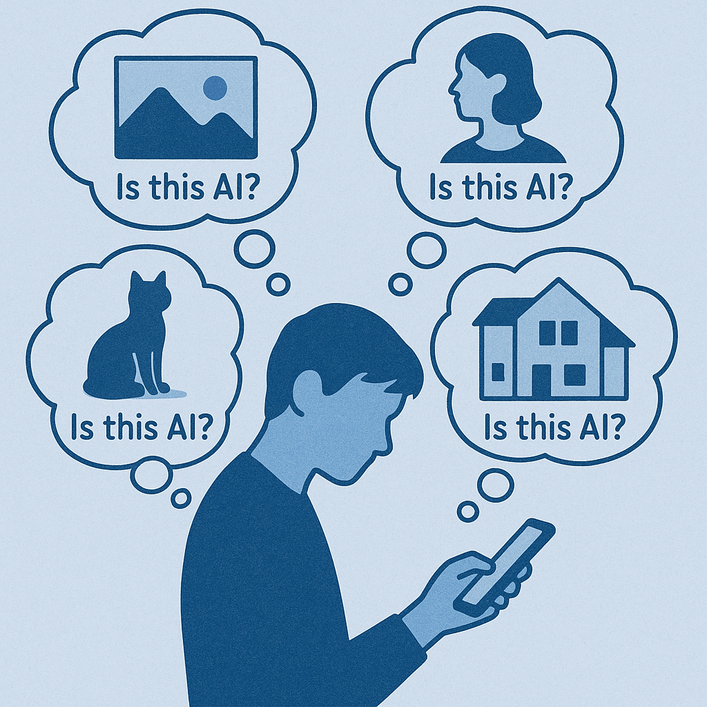
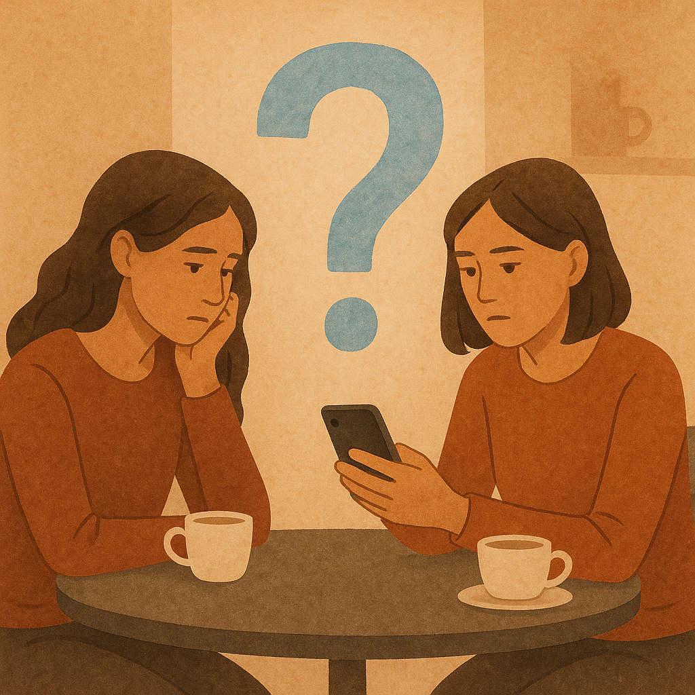
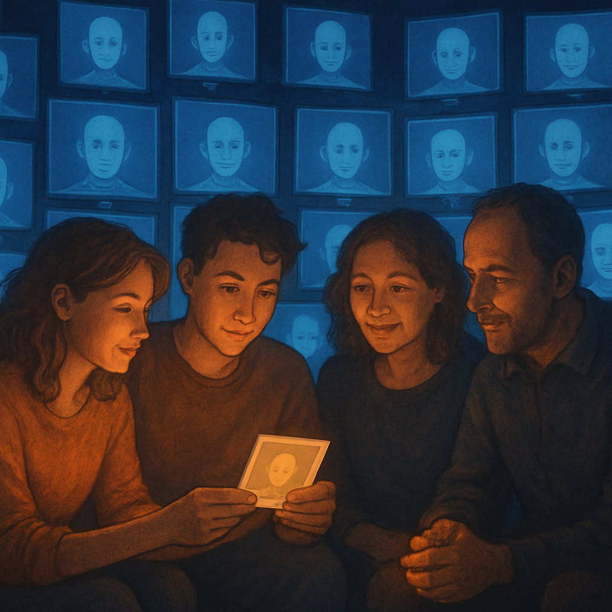

# AI 抢走的不是工作，是社会信任

> **发布日期**：2026-06-22 | **分类**：AI 观察 · 社会观察

## 导语

兄弟们，最近有没有发现自己多了一个口头禅——

"这是 AI 做的吗？"

刷小红书看到一张图，问。刷抖音看到一段视频，问。朋友圈里同事发了个旅行照，也问。

这个问题已经从一个**理性判断**，变成了一个**条件反射**。

但你仔细想想——

你真的关心答案吗？

不关心。你想要的不是"真假"，是**一个允许自己继续不信任的借口**。

这才是 AI 时代最大的暗成本——

它抢走的不是创作工作，是**社会信任的预设**。

---

## 你以为问的是"是不是 AI"，其实问的是"我还能不能相信"

先看一组打脸的数据。

人类识别 AI 生成内容（音频、视频、图片）的准确率是——**53.7%**。

只比扔硬币高一点点。

更具体一点：能稳定识别 deepfake 视频的人，只有 24.5%。

也就是说，**每四个人里就有三个，根本分辨不出来视频是不是 AI 做的**。

这意味着什么？

意味着你每天问"这是 AI 吗"这个问题，**得到的答案有 47% 的概率是错的**。

但你还在问。

为什么？

因为你问的不是"是不是 AI"。你问的是——

**"我还能不能像以前那样，不假思索地相信我看到的东西？"**

答案是：不能了。

而且这个不能，是永久的。

你以为这只是技术问题。

兄弟们，这是文明级别的转折点。

---

## 辨别真伪是个伪命题——AI 的进化速度远超验证速度

很多人寄希望于"鉴别工具"。

让我直接给你拆穿这个幻觉。

**第一层：人眼鉴别**——前面说了，53.7%。基本等于瞎猜。

**第二层：广泛可用的检测技术**——大概 65% 准确率。意思是 35% 的内容会被错判。要么真的当假，要么假的当真。哪一种都很糟。

**第三层：最先进的实验室级检测**——加州大学圣地亚哥分校 2025 年 8 月发布的检测器，可以达到 98.3% 准确率。

听起来很厉害？

兄弟们仔细看那一句话——**"在 controlled evaluations"（受控评测）下**。

什么叫"受控评测"？就是实验室里给定一批样本，测一遍准确率。

到了真实世界呢？真实世界里，AI 模型每三个月迭代一次，每次迭代都会把上一代检测器打穿。检测器永远在追，AI 永远在跑。

**这场赛跑，检测器永远是输的一方。**

为什么？

因为 AI 生成的成本是边际递减的——参数越多、训练越久，生成越逼真。

而检测的成本是边际递增的——AI 越逼真，检测算法就越复杂，需要的训练数据就越多。

一个走在下行曲线，一个走在上行曲线。

这道剪刀差只会越张越大。

**第四层：C2PA 内容凭证**——业界的"终极方案"。

简单说，就是让相机、AI 工具、编辑软件在生成内容时打上加密签名。Adobe、微软、Google、Sony、Nikon、佳能、徕卡、TikTok、Reuters、BBC 都已经在用。三星 Galaxy S25 是第一款原生集成 C2PA 的手机。

听起来很 robust？

兄弟们，这套机制有一个致命漏洞——

**社交平台在你上传内容时，会自动 strip 掉所有 metadata。**

包括 C2PA 签名。

也就是说，你拍一张带 C2PA 签名的真照片，传到微信、传到 X、传到小红书——签名没了。

到了别人手里，就是一张光秃秃的 JPEG。无法验证。

C2PA 的 governance 团队当然也意识到这个问题，所以推出了 "Durable Content Credentials"——结合 watermark + fingerprint + metadata。但这套方案的部署，至少还要 3-5 年。

而在这 3-5 年里，AI 已经又迭代了 12-20 次。

**结论：技术上没解。这场仗不是"暂时不能赢"，是"结构上不可能赢"。**

---

## 举证责任反转——这是文明级别的转折

接下来这一节是全文最锋利的部分。请慢慢看。

学术界对 AI 时代的核心命名，叫 **「Liar's Dividend」**——**撒谎者红利**。

这个词由两位法学教授 Robert Chesney 和 Danielle Citron 在 2019 年提出。

它指的是——

> 当 AI 可以伪造一切，**真实的证据也可以被一句"这是 AI 做的"否定**。

兄弟们体会一下这句话的杀伤力。

**以前**：默认真，怀疑假需要证据。看到一张照片，你的预设是"这是真的"，除非有人能证明它是假的。

**现在**：默认假，证明真需要证据。看到一张照片，你的预设是"可能是假的"，除非有人能证明它是真的。

举证责任反转了。

这不是一个小变化。这是**整个人类信任系统的预设值切换**。

历史上有过类似的事——19 世纪相机刚发明时，照片是绝对真实的代名词。后来到 PS 时代，"P 过的"成为新的怀疑预设。但那个转折花了 **100 年**。

AI 用了 **3 年**。

让我给你看三个具体的受害者——

**受害者一：调查记者**

以前一段秘密录音可以扳倒一个贪官。现在贪官可以一句"这是 AI 合成的"，把举证责任甩回给记者。

记者要证明这是真录音——但他证明不了。因为 AI 生成的音频在频谱上和真录音已经无法区分。

整个调查记者的工作方法，被一句话废了。

**受害者二：法庭证据**

美国已经出现多起案例：被告对监控视频说"这是 AI 做的"，要求重新做技术鉴定。

而鉴定专家说——"我们无法完全排除"。

法官面对"无法完全排除"这五个字，怎么办？只能弱化这个证据的权重。

正义被技术拖延了。

**受害者三：你自己**

如果有一天你被恶意伤害——比如有人假冒你做坏事——你想拿出"真相"来澄清。

你拿不出来。

因为你的"真"，可以被任何人一句"这是 AI 吧"轻飘飘地否定。

兄弟们想清楚——

**Liar's Dividend 是 AI 时代最大的隐藏权力转移**。

它把权力从**说真话的人**手里，转移到了**敢撒谎的人**手里。

因为说真话的人无法证明自己说的是真话。
而敢撒谎的人不需要证明任何事——他只要说"这可能是 AI" 就够了。

这不是技术问题。这是一个文明级别的伦理塌方。

---

## 你以为 AI 抢走的是工作，其实抢走的是日常关系里的信任

聊到这里你以为我在说政治和法庭，离你很远？

恰恰相反。

Liar's Dividend 最毒的地方，不在新闻里，**在你身边**。

我列几个场景，你对照一下你自己——

**场景一：同事在飞书发了个"项目复盘 PPT"**

你打开第一反应：这是不是 AI 写的？

不重要。重要的是——**你心里多了一层过滤**。

你以前默认"这是同事的真实工作"，现在默认"这可能是 AI 凑数"。

这层过滤一旦产生，你和同事的协作信任就被打了折扣。

**场景二：朋友发来一条"我刚出差去成都，太好吃了"的图文**

你点进去看了三秒，心里飘过一个念头：**会不会是 AI 生成的**？

你不会问出口，因为问出来很尴尬。但你的"真心点赞"已经掺水。

你和朋友的连接，被 AI 削弱了 5%。

**场景三：你伴侣发来一段语音说"今晚要加班"**

你脑子里闪过：**这语音听起来好像有点不对，不会是 AI 合成的吧**？

99.9% 是冤枉。但那 0.1% 的怀疑种子，已经种下去了。

兄弟们这才是 AI 真正在做的事——

**它不是让你失去工作。是让你失去对身边人不假思索的信任。**

这是一种**社会基础设施级别**的损耗。

经济学家可以用 GDP 算工作损失，但没人能算这种损失——

因为信任是一种"不被注意时才存在"的东西。一旦你开始注意它，它就已经被损坏了。

数据上还有个佐证：Gartner 2026 年 3 月的调研显示，**50% 的美国消费者更愿意和"明确不使用生成式 AI"的品牌做生意**。

50% 是一个非常恐怖的数字——它意味着市场已经在大规模"逆向选择"：宁可低效，也要真人。

这不是因为消费者反智，是因为消费者用脚投票——

**他们买的不是产品，是「不需要每次都怀疑」的安心。**

<<__AIWRITER_PLACEHOLDER__>>

---

## 真人做的，正在成为新奢侈品——AI 时代的"有机食品"经济学

如果你以为故事就这么悲观，那 AI 也太无敌了。

实际上，**市场已经在自发反弹**。

让我给你看几组 2026 年的新数据——

- **45% 资深创意总监**主动拒绝 AI 生成的素材进入 tier-1 品牌 campaign，理由是"需要 soul 和 provenance"
- **83% 创作者**认为"人工声音"在情感连接上明显优于 AI 生成的声音
- **Gucci 等奢侈品**开始推"Human-Made Design"运动，强调可见的不完美、可追溯的工艺过程
- Adorno Design、VAWAA 等手工艺平台流量激增，"AI 滤镜疲劳"成为新的消费心理

你看出趋势了吗？

**当 AI 内容像工业品一样泛滥，真人内容会像有机食品一样溢价。**

这是个经济学规律。

20 世纪 60-70 年代，化肥农业把蔬菜价格打到地板。然后到 21 世纪初，"有机食品"作为新概念出现——更贵、更稀缺、更高端。

它不是因为更营养（科学上至今没确证）。是因为**消费者需要"我不被工业化欺骗"的心理慰藉**。

AI 时代会重演这个故事——

**未来 5 年，"真人手作"会变成一个新的奢侈标签。**

照片：手机拍的、有 EXIF 元数据、有可见缺陷、有创作者签名 → 比 AI 生成图贵 10 倍。

文字：能查到作者真实身份、能追溯写作过程（草稿、修改、对话）、有具体场景细节 → 比 AI 生成内容贵 5 倍。

视频：原始素材可调取、拍摄设备可验证、有真实人物在场 → 比 AI 视频贵 20 倍。

但兄弟们也要警惕——

**就像出现"装有机"的工业食品，未来一定会出现"装真人"的 AI**。

判断"真真人"还是"装真人"，将成为新的认知技能。

我个人感觉，真真人内容会有几个共同特征——

1. **不完美**：错字、磕巴、犹豫、低效率
2. **可追溯**：作者有过去 5 年的创作轨迹，可以横向比对
3. **有损耗**：创作需要时间，所以产出频率必然有上限
4. **有偏见**：人会有偏好、立场、情绪——AI 反而力求"平衡"

如果一个内容**太完美、太高产、太中立**——

那它大概率是 AI 或者 AI 加持的伪人。

<<__AIWRITER_PLACEHOLDER__>>

---

## 你怎么办——做"可信任的人"，不做"会鉴别的人"

最后一节，聊聊你。

如果整个 AI 时代的核心问题是社会信任侵蚀——

你的应对策略只有一个方向：**别去鉴别，去成为可信任的源**。

几个个人感觉。

**观察一：放弃"识别 AI"这个执念**

这场仗你赢不了。AI 进化速度永远快于你的辨识能力。

你花在"这是不是 AI"上的注意力，本质上是被消耗掉的。AI 时代最贵的资源不是创意，是**未被消耗的注意力**。

不要把注意力花在鉴别。花在**判断这个内容对你有没有价值**。

如果有价值——是 AI 是真人都无所谓。

如果没价值——是真人是 AI 都不重要。

**观察二：让自己变成"可被验证的信源"**

兄弟们，AI 时代不是没有解。解是**信任不再依附于内容，而是依附于个人**。

未来你能积累的最值钱的资产是——

- **多年可追溯的内容轨迹**（公开发表过的、有时间戳的）
- **真实人际网络的背书**（认识你的人愿意为你担保）
- **可重复的现场出席**（线下见过、有视频证明你在场）
- **特定领域的长期一致性**（10 年都在说同一件事的人，造假成本极高）

这些东西 AI 模仿不了。

它可以生成一张你的脸，但生成不了"你这 10 年的连续言论"。

它可以伪造一段你的话，但伪造不了"100 个认识你的人都说这不是你"。

**这才是 AI 时代真正的护城河——你作为「人」的可验证性**。

**观察三：保护你信任的人**

社会信任是一张网。一个节点损坏不要紧，整张网瓦解才致命。

不要随便指控别人发的东西是 AI——尤其是你信任的人。

每说一次"你这是不是 AI 做的"，你就在腐蚀自己的信任网络。

如果有疑问，**问清楚**而不是**当面质问**。

被怀疑过一次的关系，永远回不到从前。

**观察四：你的内容要有"人的指纹"**

AI 的弱点是它没有具体的、不可复制的人生经验。

你的文章如果只写普世道理——AI 写得比你好。

你的文章如果写**你昨天晚上在便利店看到一个老人买半斤花生米**——AI 写不出来。

不是因为 AI 没那个能力。

是因为 AI 没那个**经历**。

具体场景 + 个人经验 + 情绪痕迹 + 名字和时间——这是 AI 时代你最便宜也最有效的反 AI 武器。

也是你作为"人"留下的指纹。

**最后说一句**——

AI 不会问"这是 AI 吗"。

AI 也不在乎答案。

但你会问。你也在乎。

这就是人和 AI 的根本差别——不是创作能力，而是**关心真实这件事本身**。

只要你还关心，你就还是"人"那一边的。

兄弟们，AI 抢走的不是工作，是社会信任。

但社会信任的反攻，也必须靠人。

**靠你。靠我。靠每一个还愿意慢一点、还愿意问一句、还愿意为信任买单的人。**

<<__AIWRITER_PLACEHOLDER__>>

---

## 数据来源

- [Liar's Dividend 原始概念（Brennan Center for Justice）](https://www.brennancenter.org/our-work/research-reports/deepfakes-elections-and-shrinking-liars-dividend)
- [Chesney & Citron Liar's Dividend 学术阐释（Center for Security and Emerging Technology, Georgetown）](https://cset.georgetown.edu/article/deepfakes-elections-and-shrinking-the-liars-dividend/)
- [Deepfake Statistics 2026 / 人类识别率 53.7%（Truthscan）](https://truthscan.com/blog/deepfake-statistics/)
- [UC San Diego deepfake 检测器 98.3% 准确率（2025-08）](https://www.brightdefense.com/resources/deepfake-statistics/)
- [C2PA 2026 Adoption Status（SoftwareSeni）](https://www.softwareseni.com/c2pa-adoption-in-2026-hardware-platforms-and-verification-reality/)
- [Microsoft、Adobe、Sony、TikTok 接入 C2PA（C2PA Viewer）](https://c2paviewer.com/articles/what-is-c2pa)
- [50% 消费者倾向"不用 AI"品牌（Gartner 2026/3，via MindStudio）](https://www.mindstudio.ai/blog/human-made-premium-ai-backlash-authentic-content)
- [45% 创意总监拒绝 AI 进 tier-1 campaign（Crea8ive Solution）](https://crea8ivesolution.net/anti-ai-design-trends-2026/)
- [83% 创作者：人工声音情感连接更强（Epidemic Sound Future Creator Economy Report 2026）](https://www.epidemicsound.com/data-trends/sound-of-creativity-reports/future-creator-economy-report-2026/)
- [人工创作正在变成奢侈品（The Conversation）](https://theconversation.com/in-the-age-of-ai-human-creative-output-is-becoming-a-luxury-276514)

> 注：本文核心概念 "Liar's Dividend" 由法学教授 Robert Chesney 和 Danielle Citron 在 2019 年提出。文中数据均来自公开报告与学术研究，具体以原始来源为准。
