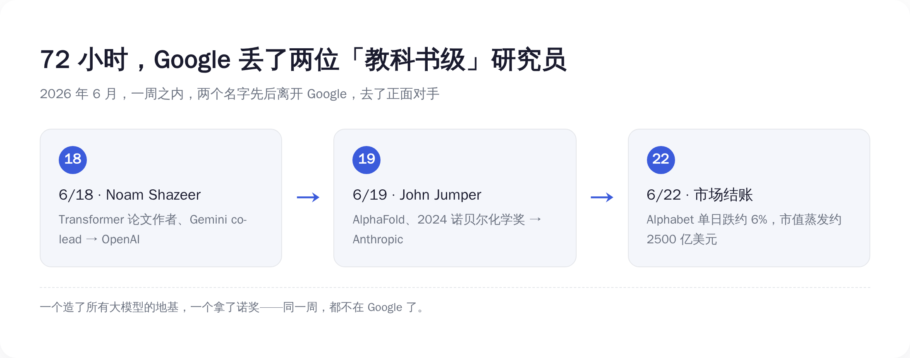
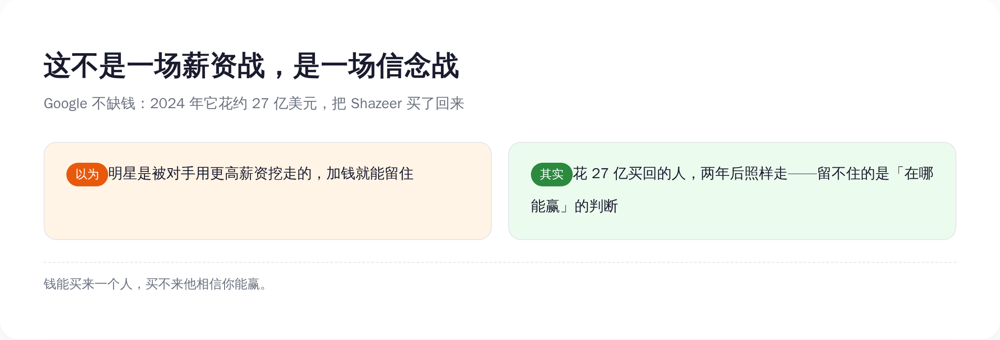
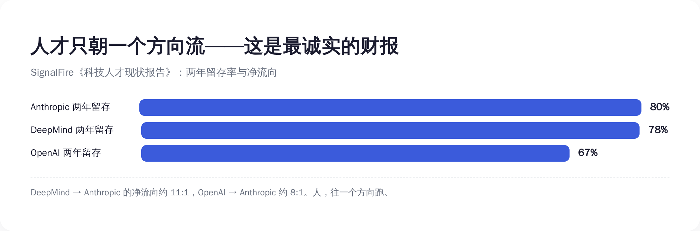
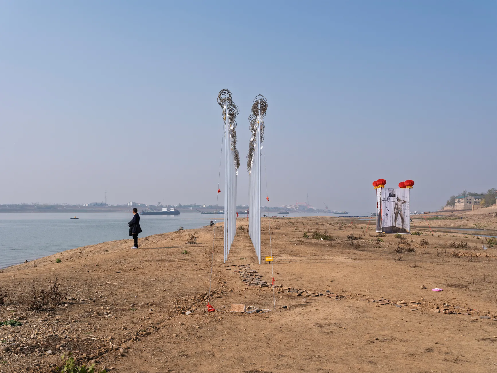

# 造出 Transformer 的人走了，拿诺奖的人也走了——同一周，Google 亲手把发明送进了对手公司

> **发布日期**：2026-06-23 | **分类**：AI 观察 · 行业观察

## 导语

兄弟们，先说一个这周发生的事。

2026 年 6 月 18 日，一个叫 Noam Shazeer 的人，离开 Google，去了 OpenAI。

第二天，6 月 19 日，又一个叫 John Jumper 的人，离开 Google，去了 Anthropic。

这两个名字你可能没听过。但你天天在用他们造的东西——

Shazeer 是 2017 年那篇《Attention Is All You Need》的作者之一，这篇论文造出了 **Transformer**。今天所有大模型，GPT 的 "T"、Gemini 的底座、Claude 的骨架，全是它。

Jumper 是 **AlphaFold** 的核心作者，2024 年靠它拿了诺贝尔化学奖。

一个造了 AI 的地基，一个拿了诺奖。同一周，先后离开 Google，分别投奔 OpenAI 和 Anthropic——Google 这辈子最大的两个对手。

三天后，6 月 22 日，市场给这件事结了账：Alphabet 单日跌了约 6%，市值蒸发约 **2500 亿美元**。

兄弟们，这事的恐怖之处不在于走了两个明星。

而在于——**Google 发明的一切，正在养肥它的对手。**

而判断一家 AI 公司到底行不行，最诚实的信号，不是发布会上的 benchmark，是它的顶级人才，在往里走，还是往外跑。

---

## 一周内走两个，分量是「教科书级」的

先把这两个人的分量说清楚，不然你体会不到 Google 这一刀有多疼。

**第一个，Noam Shazeer。**

2017 年，8 个 Google 员工合写了一篇论文，标题很狂——《Attention Is All You Need》（注意力就是你需要的全部）。这篇论文提出的 Transformer 架构，是今天整个生成式 AI 的地基。没有它，没有 ChatGPT，没有 Gemini，没有 Claude，没有这三年所有的故事。

Shazeer 是这 8 个作者之一。后来他出去创业做了 Character.AI，2024 年，Google 花了大约 **27 亿美元**，把他和他的团队又买了回来，让他去 co-lead（联合领导）最重要的 Gemini 项目。

27 亿。买一个人回来带队。

两年不到，他走了。去了 OpenAI。

**第二个，John Jumper。**

他是 AlphaFold 的核心作者。AlphaFold 干了一件事：用 AI 预测蛋白质的三维结构。它把人类已知的 **2 亿多个**蛋白质结构全算了出来，免费开放给全球科学家，覆盖了地球上几乎每一种已知蛋白质。

这件事的分量，2024 年诺贝尔化学奖给了答案——Jumper 和他的老板 Demis Hassabis 一起拿了奖，获奖理由是「蛋白质结构预测」。

在 Google DeepMind 干了快 9 年，拿了诺奖。这周，他走了。去了 Anthropic。

兄弟们感受一下这个密度——

**一周之内，Google 丢了一个 Transformer 作者，和一个诺奖得主。**

这不是「人员流动」，这是地基级别的人在搬家。

*图注：72 小时三连击——发明地基的人、拿诺奖的人、市场结账，按顺序发生在同一周。*

---

## Google 的悖论：发明了一切，却留不住发明它的人

这才是整件事最荒诞的地方。

Transformer，Google 发明的。AlphaFold，Google 发明的。

可你看看今天 AI 圈的格局——

最火的 ChatGPT，是 OpenAI 的，用的是 Transformer。
口碑最好的 Claude，是 Anthropic 的，用的是 Transformer。
连 Google 自己的 Gemini，也是 Transformer。

**Google 发明了一把枪，结果全世界都拿这把枪在跟它对射。**

更扎心的是人。

那篇《Attention Is All You Need》8 个作者，到今天，**一个都不在 Google 了**。全走光了。有人去创业，有人去了对手公司。Shazeer 是其中相对晚走的一个——他还被 Google 花 27 亿买回来过一次——这周，连他也走了。

发明 Transformer 的实验室，留不住任何一个 Transformer 的作者。

这是一种很特殊的失败。Google 不是没做出东西，恰恰相反，它做出了这个时代最重要的东西。它只是**留不住做出这些东西的人**。

兄弟们，技术可以是你发明的，但技术的红利，是跟着人走的，不是跟着公司走的。

一个研究员的脑子里装着「下一个 Transformer」可能长什么样。他走到哪，这个可能性就到哪。他从 Google 走到 Anthropic，那个未来就从 Google 挪到了 Anthropic。

**发明的功劳记在 Google 账上，发明的未来兑现在对手账上。**这就是 Google 现在的处境。

---

## 钱不是答案：花 27 亿买回的人，照样走

很多人第一反应是：肯定是对手出了更高的价。挖人嘛，加钱就完了。

兄弟们，这个解释，被一个数字直接打穿了——

**27 亿美元。**

这是 2024 年 Google 为了把 Shazeer 买回来花的钱。这不是年薪，这是把他和团队整个「买」回来的代价。这种价码，全世界没几家公司付得起，Google 付了。

结果呢？两年不到，人走了。

如果加钱能解决问题，27 亿应该够了吧？

不够。

因为这从来不是一场薪资战。**这是一场信念战。**

顶级研究员到了 Shazeer、Jumper 这个段位，钱对他们来说早就过了「改变生活」的门槛。他们再做选择，看的不是哪里给的多，是**哪里能让他做出下一个诺奖级的东西**，是**哪里相信、并且有能力，赢下 AGI 这场仗**。

Google 给得起钱，但它给不了那个判断。

在一个研究员眼里，Google 是一家什么都做、广告养着一切、AI 只是其中一块业务的巨型公司。而 OpenAI、Anthropic 这种地方，整个公司就是为 AGI 这一件事而生的，没有别的业务分心，决策快，下注狠。

你是那个研究员，你押哪边？

所以你看，Google 真正的问题，不是钱包不够厚，是**它没法让最聪明的人相信「赢的是我」**。

钱能买来一个人的时间，买不来他赌你能赢。

*图注：留不住人的，从来不是出价高低，是「在哪能赢」这个判断——Google 输在这里。*

---

## 人才只朝一个方向流——这才是最诚实的财报

如果只是走两个人，还可以说是偶然。

但有一组数据，把「偶然」两个字也撕了。

一家专门追踪科技人才流动的机构 SignalFire，发了一份《科技人才现状报告》，里面有几个数字，比任何财报都诚实——

**两年留存率：** Anthropic **80%**，DeepMind **78%**，OpenAI **67%**。

**净流向，这才是关键：**

- 从 OpenAI 跳去 Anthropic 的人，是反方向（Anthropic 跳去 OpenAI）的约 **8 倍**。
- 从 Google DeepMind 跳去 Anthropic 的人，比例约为 **11:1**。

11 比 1。

意思是，DeepMind 和 Anthropic 之间，每有 1 个人从 Anthropic 跳到 DeepMind，就有大约 11 个人反向跳过去。

兄弟们，这不是流动，这是**单向漏水**。

这个数字的可怕，在于它的方向性。人才市场如果是健康的，流动应该是双向的——你挖我的人，我也挖你的人，大家互相流。但 11:1 不是流动，是**逃逸**。它说明在这群最懂行的人心里，已经形成了高度一致的判断：那边更值得去。

而且最懂 AI 的，恰恰就是这群人。他们不是看新闻做判断，他们**自己就是新闻**。他们用脚投的票，比任何分析师的研报都准。

这就是为什么我说，**人才流向是 AI 公司最诚实的财报。**

营收会滞后，benchmark 能调，市值有情绪。只有顶级研究员往哪走，是骗不了人的——因为他们赌上的是自己的职业生涯，没人会拿这个开玩笑。

Google 这周丢的不是两个人。是这张「人才流向表」上，又重重记了一笔：**净流出。**

*图注：留存率三家咬得很近，但净流向是单向的——11:1 不是流动，是逃逸。*

---

## 顶级人才为什么往「小厂」跑

讲到这里有个反常识的地方：钱多、资源多、算力多、品牌响的 Google，反而在往外漏人；而 Anthropic 这种成立没几年的公司，反而是人才的黑洞。

为什么？

我个人感觉，有三个原因，而且都跟「钱」无关。

**第一，专注。**

Anthropic、OpenAI 这种公司，整个组织就为 AGI 一件事而生。一个研究员进去，他的工作和公司的命运是直接挂钩的——他做出突破，公司就往前一步。这种「我的工作直接决定公司生死」的感觉，是巨型公司给不了的。在 Google，AI 做得再好，也只是财报里的一行，上面还压着搜索、广告、云、安卓一堆业务。

**第二，自主权。**

SignalFire 那份报告里点了一句很关键的话：Anthropic 留人靠的不是钱，是「不搞职级政治、不强推管理路线、给研究员真正的自主权」。

翻译成人话——在那里，一个厉害的研究员可以一直做研究、一直往深里钻，而不用为了升职被迫去管人、去开会、去搞政治。对真正热爱这件事的人来说，这比钱诱人得多。大公司最擅长的，恰恰是把一个天才研究员，慢慢变成一个开不完会的中层。

**第三，下注的胆量。**

小公司敢 all in，敢把全部筹码押在一个方向上。大公司什么都想要，反而什么都押不重。在一个相信「AGI 几年内会发生」的研究员眼里，他要找的是一张能让他下重注的牌桌——而不是一个什么都做、什么都浅尝辄止的自助餐厅。

兄弟们注意，这三条，Google **一条都补不了**。

不是 Google 不努力，是它的体量本身就是诅咒。它太大了，大到没法让一个研究员相信「公司的命运和我这一行代码有关」。

这也解释了为什么这次特别疼——留下来的人里，连 Demis Hassabis（Jumper 的诺奖搭档）这种顶级人物还在掌舵 DeepMind，但和他一起拿奖的人，已经走了。**连诺奖搭档都留不住，剩下的人会怎么想？**

人才流失最可怕的不是走的那个人，是**还没走的那些人，开始重新算账**。

---

## 你该怎么用这件事——把「人才流向」当核心指标

最后，聊聊这件事跟你有什么关系。

你不是 Google 高管，你管不了 DeepMind 留不留得住人。但这件事里有一个判断工具，你能直接拿去用——

**判断一家 AI 公司到底行不行，别光看它发布了什么，看它的顶级人才在流入还是流出。**

这个指标，比你想的有用得多。

**如果你是投资人 / 关注股价的人**——别只盯着 benchmark 和财报。Google 这周市值蒸发 2500 亿，不是因为某个产品翻车，是因为市场突然意识到：人才在单向流出。人才流向是先行指标，市值是滞后反应。等财报体现出来，已经晚了。

**如果你是求职、或者在选平台的人**——一家公司值不值得加入、值不值得押注，看它最近半年是在「净吸引」顶级的人，还是在「净流失」。人才是用脚投票的，跟着最聪明的那群人走，大概率不会错。他们掌握的信息比你多得多。

**如果你是在选 AI 工具、选模型的人**——一家公司能不能在未来两三年持续给你好东西，取决于现在还有没有顶级的人在里面玩命。今天的人才流向，就是两年后产品力的预告片。

说到底，benchmark 会过时，融资额会注水，发布会的 PPT 谁都会做。

只有一群最懂行的人，赌上自己职业生涯做出的选择——他们往哪走——这件事，骗不了人。

兄弟们，Google 这周不是输在技术。它发明了 Transformer，发明了 AlphaFold，技术它从不缺。

它输在——**它再也没法让最聪明的人相信，赢的会是它。**

而一家公司一旦留不住造未来的人，它就只剩下过去了。

---

## 数据来源

- [《Attention Is All You Need》原论文（arXiv:1706.03762，Transformer 架构，含 Shazeer 等 8 位作者）](https://arxiv.org/abs/1706.03762)
- [2024 年诺贝尔化学奖官方公告（Hassabis、Jumper「蛋白质结构预测」）](https://www.nobelprize.org/prizes/chemistry/2024/summary/)
- [AlphaFold 蛋白质结构数据库（2 亿+ 结构，免费开放，EMBL-EBI）](https://alphafold.ebi.ac.uk/about)
- [SignalFire State of Talent Report（各实验室两年留存率与净流向数据）](https://www.signalfire.com/blog/signalfire-state-of-talent-report-2025)
- [Bloomberg：诺奖得主 John Jumper 离开 DeepMind 加入 Anthropic（2026-06-19）](https://www.bloomberg.com/news/articles/2026-06-19/nobel-winner-john-jumper-to-leave-google-deepmind-for-anthropic)
- [CNBC：John Jumper to leave Google DeepMind for Anthropic（2026-06-19）](https://www.cnbc.com/2026/06/19/john-jumper-to-leave-google-deepmind-for-anthropic.html)
- [Calcalist/CTech：Google 花约 27 亿美元买回 Shazeer，两年后他转投 OpenAI（2026-06-18）](https://www.calcalistech.com/ctechnews/article/r1je3bzzze)
- [Axios：Google takes the hit in AI's talent war（2026-06-23）](https://www.axios.com/2026/06/23/ai-lab-agi-google-deepmind-departures)
- [Fortune：DeepMind 顶级人才出走，引发能否赢下 AI 竞赛的质疑（2026-06-23）](https://fortune.com/2026/06/23/google-deepmind-ai-researcher-departures-raise-doubts-about-ability-to-win-the-ai-race-shazeer-jumper-eye-on-ai/)
- [MLQ：Alphabet 单日跌约 6%，因 Transformer 作者与诺奖得主投奔对手](https://mlq.ai/news/alphabet-drops-6-after-transformer-co-author-and-nobel-laureate-defect-to-rival-ai-labs/)

> 注：本文事实与数据均来自公开一手来源（原始论文、诺奖官方公告、AlphaFold 数据库、SignalFire 报告及 Bloomberg/CNBC/Axios/Fortune 等原始报道）。市值蒸发约 2500 亿美元为 6 月 22 日 Alphabet 单日跌幅对应的近似量级，具体以交易所数据为准。
