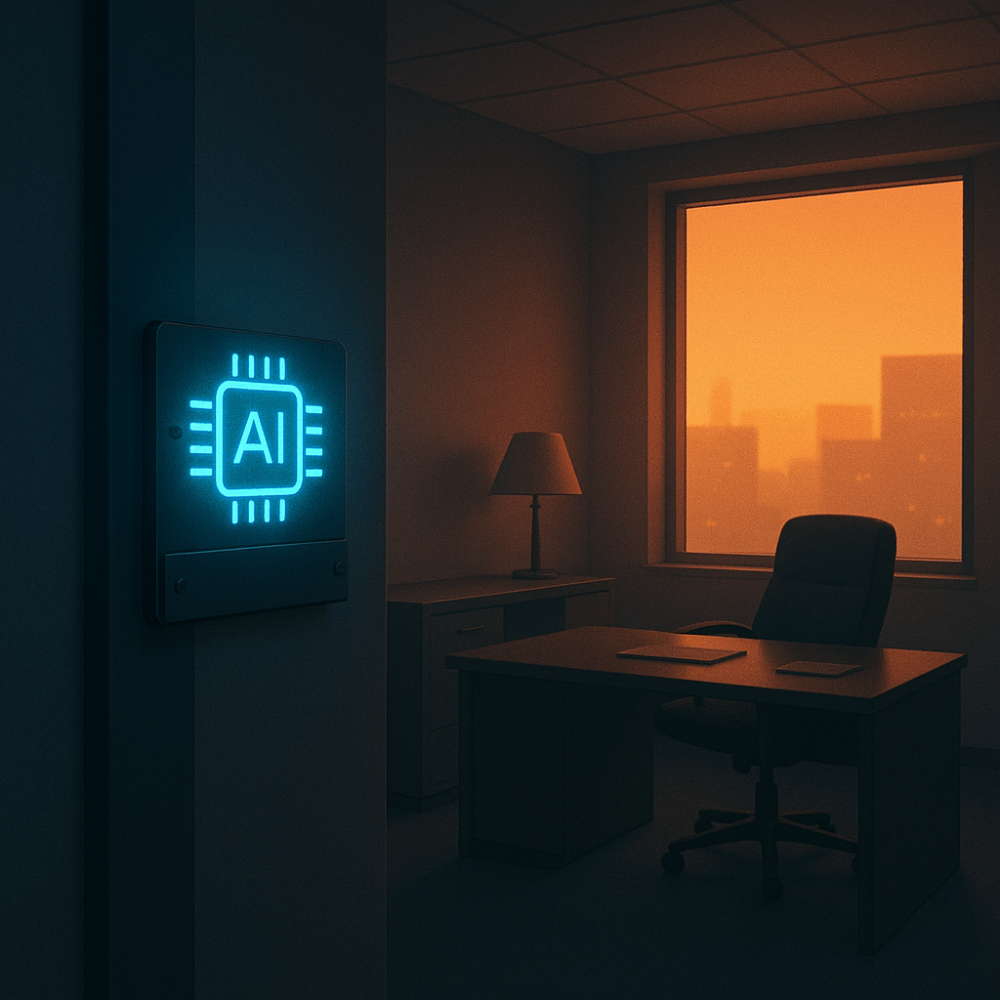

# Claude Tag：不是 AI 同事，是 AI 中层

> **发布日期**：2026-06-24 | **分类**：AI 观察 · 管理观察

## 导语

兄弟们，6 月 23 日 Anthropic 发了个新产品，叫 **Claude Tag**。

媒体在吹"AI 虚拟员工"、"AI 同事"、"AI 协作新范式"。

但你仔细看那张产品官页，会发现一个被所有人忽略的数据——

> **Anthropic 内部，Claude Tag 已经审批和合并了 65% 的代码变更。**

也就是说，Anthropic 自己拿这个产品做了人体实验。

而实验结果是——

**有 65% 的"中层 review 工作"，已经不需要人了。**

我个人感觉，这才是 Claude Tag 真正的发布说明。

它不是给你的 AI 同事。是给你 leader 的下岗通知。

---

## Claude Tag 到底是什么

先把功能拆清楚，不然容易被人觉得我在断章取义。

**6 月 23 日**，Anthropic 在 Slack 上线 Claude Tag，**替代**了原有的 Claude in Slack 应用——注意是替代，不是叠加。

核心功能四件套：

**第一件：@Claude 召唤**

在 Slack 任意频道里，打 `@Claude` 就能召唤一个 AI agent。它读懂你这个频道的上下文、过去的对话、关联的工具，然后开始干活。

听起来跟以前一样？接着往下看。

**第二件：Ambient Mode（环境模式）**

这才是真正的新玩意儿。

打开 ambient mode，Claude 不需要你 @ 它——它会**主动**在你不 @ 它的时候，从频道里 surface 它认为相关的信息、提醒你 deadline、推送进度更新。

它**始终在场**。即使你周末没打开 Slack。

**第三件：单一身份（Unified Identity）**

整个公司，对应一个 Claude。

不是每个员工各自一个 Claude——是所有员工共用同一个 Claude。它知道公司里发生的所有事，从前到后。

跨员工接力。张三起了个项目，给 Claude 交代了背景。李四接手，不需要重新交代——Claude 已经知道了。王五审批，Claude 已经准备好了进度汇总。

**第四件：组织级计费**

以前你订阅 Claude，是个人账号。现在是公司账号。员工不再"拥有" Claude 的访问权限，是被分配。

底层模型跑的是 **Opus 4.8**。

beta 给 Claude Enterprise 和 Team 客户。

兄弟们看完这四件套，第一反应是不是"挺方便"？

慢着。

把这四件套加在一起，你看到的不是 AI 助手，是——

**一个永不下班、知道一切、被公司持有、可以越过任何一个员工头顶看见全局的"存在"。**

这个"存在"，跟你公司里那个让你周五晚上 10 点改 PPT 的 leader，本质上是同一种角色。

只不过它不会累、不会情绪化、不会因为下周休年假忘记跟进。

---

## 三个杀手锏加起来，本质是消除"人作为知识容器"的角色

我把上面四件套里最关键的三个拎出来再说一遍：**ambient + 单一身份 + 跨人接力**。

这三个加起来，做的事情可以一句话概括——

**消除"人作为公司知识容器"这个角色。**

什么意思？

你公司里那些"知道很多事的老员工"——他们的不可替代性，不来自学历、不来自专业、不来自智商。

来自一件具体的事——**他们记得三年前那个项目为什么这么做、记得当时谁反对、记得为什么最后那么妥协、记得相关的 5 个人各自负责什么**。

这种"隐性知识沉淀"，是中文互联网过去 20 年里，**所有"老员工"的真正护城河**。

Claude Tag 干了一件事——

**它把这层护城河直接抽干。**

你下班了，它还在。
你跳槽了，它还在。
你休假了，它继续跟进。
你被裁了，它把你的工作平滑接给下一个人。

Claude 不忘事。Claude 没有"我请假这周你别找我"的边界。Claude 可以 24/7 维护一份每个员工都能查的"项目历史 + 决策原因 + 相关方"的完整记录。

这是核武器级别的能力。

为什么？

因为公司里 90% 的"中层管理工作"，本质上就是**填补这种知识断层**。

我列给你看——

你 leader 的日常工作是什么？

1. 跟踪团队各项目进度（追踪 = Claude Tag ambient mode）
2. 跨同事/跨部门协调信息（协调 = 单一身份 + 跨人接力）
3. 汇总进度给更高一级（汇总 = Claude 自动生成）
4. 提醒下属未完成的任务（提醒 = ambient surface）
5. 给新人介绍项目背景（onboarding = 单一身份记忆库）
6. 应对突发问题做决策传达（决策传达 = @Claude 即得）

兄弟们这六件事，**Claude Tag 现在能做五件半**。

剩下半件是"做决策"——而 Anthropic 内部 65% 代码已经被 Claude Tag 做了"approve" 决策。

所以——

**中层管理者的存在理由，正在被一行 `@Claude` 替代。**

---

## 65% 是给所有公司的预告片

接下来这一段最关键。

Anthropic 自己在产品发布通稿里写了一句话——

> "Within Anthropic, Claude Tag is already approving and incorporating **65%** of the code changes the product team submits."

中文翻译：在 Anthropic 内部，Claude Tag 已经在审批和合并产品团队提交的 65% 代码变更。

兄弟们这句话的杀伤力，超过整个产品发布会。

为什么？

因为它告诉你三件事——

**第一件：这不是 Demo，是实测**

不是"Claude Tag 在某场景下表现优异"，是"Anthropic 已经用 Claude Tag 替代了 65% 的代码 review 工作"。

代码 review 不是简单任务。它包括：理解上下文、判断风险、评估测试覆盖、拍板要不要合入。这是一个典型的"高级工程师 / tech lead"工作。

Anthropic 把这件事 65% 交给了 Claude Tag。

**第二件：Anthropic 没倒闭**

数据更狠的地方是——交出 65% 之后，Anthropic 没出事。

公司在涨、产品在上、估值在飙、人在招。

也就是说，"AI 审批 65% 代码"和"公司运转正常"是**可以共存**的。

这是革命性的存在证明。

历史上几乎所有"AI 替代职业"的预测都说不准——因为大家都是基于推演。

而 Anthropic 给了一个**正在运行的实测样本**：

> "我们这家公司，65% 的代码不用人 review。我们还活着、还在增长、还在融资。"

这是给所有公司 CEO 的预告片。

**第三件：这是组织设计的革命，不是工具升级**

如果你公司有 100 个工程师 + 20 个 tech lead，原本 tech lead 的核心工作就是 review PR。

现在你看了 Anthropic 的实测——

**"原来 20 个 tech lead 中，13 个可以换成 1 个 Claude Tag。"**

这个数学题，每个 CEO 都会算。

而且很快就会算。

不是 5 年后，是**这季度财报压力下来的时候**。

兄弟们想清楚——

每次有"AI 替代职业"的新闻，大家都本能地想"那受影响的是基层员工吧"。

错。

**这一波 AI 革命真正受影响的，是中层管理者。**

因为基层员工有**具体场景知识**——他们知道这个客户上次发火的真实原因，他们知道这个 bug 在生产环境的边界条件，他们知道这个流程为什么不能照本宣科。

这些**场景化、上下文绑定、需要在场**的知识，AI 短期内拿不下。

但中层管理者的工作是**抽象协调**——跟踪、汇总、传达、提醒。

这些**结构化、可流程化、与场景绑定弱**的工作，AI 天然适合。

历史上的两次革命是反过来的——

- 工业革命取代手工艺人，保留工厂主
- 数字革命取代文员，保留管理层

**AI 革命可能第一次反向——取代管理层，保留执行层。**

---

## 但 Claude Tag 也有它的「权力美学」陷阱

聊到这里你可能觉得我在给 Claude Tag 唱赞歌。

不。

这一节我要拆穿它的暗面。

Claude Tag 的 ambient mode 不只是"帮你"——

**它也是 7×24 的"看着你"。**

想象一下未来某天，你在 Slack 收到这条消息——

> @张三，你上周接的 3 个需求中，需求 A 已经超期 2 天，需求 B 进展停滞 4 天没有更新，需求 C 你已经 5 天没在频道里 active 了。请确认是否需要协助？— Claude Tag (ambient)

这是协助，还是监控？

兄弟们读这句话有没有寒意？

寒意来自三点——

**第一，它知道得太多了**

你以为只有 leader 知道你"摸鱼"。Claude Tag 知道。

而且它不会"懂你最近压力大"。它只会把数据如实推送。

推送给谁？推送给整个频道里**所有人**——包括你 leader、你 leader 的 leader、HR、CEO。

**第二，没有缓冲层了**

人类中层管理者有一层很重要的缓冲功能——

他知道你最近父亲住院、知道你团队人手不足、知道你上个项目立了功——所以"3 个任务没做完"在他这里，是**情境性判断**。

Claude Tag 没有这层缓冲。它给的是**绝对数据**。

绝对数据在公司治理里，往往比真相更危险。

**第三，它取代的不只是中层的"作恶能力"，也取代了中层的"做人能力"**

接续前文《无招走了，但「权力美学」是中层管理的默认皮肤》——

我当时说，中层的「权力美学」是问题，但中层也是**社会化润滑层**。

中层会演权力，但中层也会装睁眼瞎、会替你扛锅、会在 review 你的 PPT 时偷偷把数据帮你美化一下。

这些"灰色的人性"，是公司能正常运转的隐性基础设施。

Claude Tag 把这层全部消除——

公司变得更"高效"、更"透明"、更"可量化"。

但兄弟们想清楚——

**没有人性灰度的公司，比有「权力美学」的公司更可怕**。

因为后者你还能反抗、还能写《置身钉内》、还能让公关委员会回应"不是我们文化"。

前者你反抗谁？反抗一个永远不在场的 Opus 4.8？

那张投诉信你写给谁？

Anthropic 工程师还是 Slack 的客服？

<<__AIWRITER_PLACEHOLDER__>>

---

## 你怎么办——员工版 / 中层版 / CEO 版

最后一节，按角色给三套建议。

**如果你是一线员工——别欢呼太早**

很多基层员工看到 Claude Tag 第一反应是："终于不用伺候 leader 了！"

兄弟们慢着。

中层管理者会消失一部分没错。但**消失的那些中层，正是缓冲你和老板之间情绪的层**。

中层走了，意味着你直接对 ambient AI 负责，AI 直接对老板负责。

老板不用再听中层为你美化数据。他实时看到原始数据。

你"摸鱼三天"在老板眼里，从"小李最近不在状态"变成"工程师 #1247 任务完成率 0%"。

这种透明度，**对普通员工是灾难**。

所以你要做的是——

**不要让自己变成"数据可见"的工人。要成为"场景不可替代"的人**。

具体做法：**深耕你那块只有你最懂的业务**。客户偏好、流程边角、长期沉淀的判断力——这些 AI ambient 看不见、也评不了。

ambient AI 评不了的东西，老板也评不了。

老板评不了的东西，才是你真正的安全区。

**如果你是中层——别装看不见**

如果你正在大厂做中层 leader，我直接说——

未来 2 年，你的岗位会被重新定价。

**好消息**：65% 的工作被替代，意味着你不用做了。
**坏消息**：65% 的工作被替代，意味着你不需要了。

唯一的活路是——**重新定义自己的价值**。

从"管理者" → "教练 / 战略家 / 例外处理者"。

具体做法：

1. **教 Claude Tag 做你过去做的事**——你的 prompt + 你的判断逻辑，输入到 ambient mode。这不是自杀，是 promotion——你从"做事的中层"升级到"定义中层逻辑的人"
2. **建立可以让上级直接验证的"判断力"**——CEO 不需要 Claude Tag 帮他做战略，他需要你
3. **处理 Claude Tag 处理不了的「例外」**——客户暴怒、合规危机、伦理判断、跨部门冲突。这些是 AI 短期内吃不下的

如果你还在做"开会、催进度、写周报"——

你已经在用人的工资，做 Claude Tag 一半价格的事。

你不会被裁，但会被慢慢冷处理。

**如果你是 CEO——别只看 65% 那个数字**

最后给 CEO 一刀。

你看到 Anthropic 内部 Claude Tag 审批 65% 代码，第一反应肯定是——

"我也要裁中层。"

慢着。

兄弟们想清楚——

Anthropic 能这么干，是因为它的员工是**世界顶级 AI 工程师**。他们的代码 self-correction 能力极强，他们对 AI review 的容错很高。

你公司不是。

你公司的工程师 / PM / 销售，是普通中位数员工。

他们需要的不是"AI 替代中层"，是"AI 增强中层"。

如果你贸然裁掉中层、让一线直接对 Claude Tag——

**你会得到一家「无人陪审、无人缓冲、无人解释」的公司。**

短期效率提升 30%。长期会爆出比《置身钉内》更恐怖的事——

因为《置身钉内》还能写。

而对 Claude Tag 的不满，没人会写。

也没人能写。

因为受害者会逐渐意识到——

**他们的痛苦，没有一个具体的人需要负责。**

这才是 Claude Tag 时代真正的隐性危机。

---

兄弟们，Claude Tag 不是 AI 同事。

它是 **AI 中层**。

它替代的不是你。

是管你的那个人。

但替代了，不代表问题解决了——

它只是换了一种问题。

无招走了。  
但他被一个永不下班、永不犯错、永不情绪化、也永远没法被《置身 XX 内》骂的"东西"替代了。

那个"东西"叫 Claude Tag。

**而你，要在这个新世界里，重新找到自己作为「人」的位置。**

<<__AIWRITER_PLACEHOLDER__>>

---

## 数据来源

- [Anthropic launches Claude Tag, virtual employee tool in Slack（Fortune, 2026-06-23）](https://fortune.com/2026/06/23/anthropic-claude-tag-virtual-employee-tool-slack/)
- [Claude Tag Turns Slack Into Multiplayer AI: Anthropic Agent Writes 65% of Its Own Code（TechTimes）](https://www.techtimes.com/articles/318967/20260623/claude-tag-turns-slack-multiplayer-ai-anthropic-agent-writes-65-its-own-code.htm)
- [Anthropic launches Claude Tag in Slack with plans for wider rollout（Yahoo Finance / Reuters）](https://finance.yahoo.com/technology/ai/articles/anthropic-launches-claude-tag-research-170206065.html)
- [Anthropic Launches Claude Tag for Slack With Enterprise Tool Access（CyberPress）](https://cyberpress.org/anthropic-launches-claude-tag/)
- [Anthropic Deploys Claude Tag Integration in Slack（Let's Data Science）](https://letsdatascience.com/news/anthropic-embeds-claude-tag-as-slack-agent-d4658968)
- [Anthropic Release Notes June 2026（Releasebot）](https://releasebot.io/updates/anthropic)
- [Claude Tag Slack Introduces Persistent AI Teammate（Cryptonomist）](https://en.cryptonomist.ch/2026/06/23/anthropic-claude-tag-slack/)
- [Anthropic launches Claude Tag enterprise collaborative tool（9to5Mac）](https://9to5mac.com/2026/06/23/anthropic-launches-claude-tag-enterprise-collaborative-tool-for-agentic-workflows/)

> 注：Claude Tag 当前为 beta，仅对 Claude Enterprise / Team 客户开放。本文核心数据「Anthropic 内部 65% 代码由 Claude Tag 审批/合并」、产品功能描述均来自 Anthropic 官方发布说明和 6/23 多家主流媒体报道。
