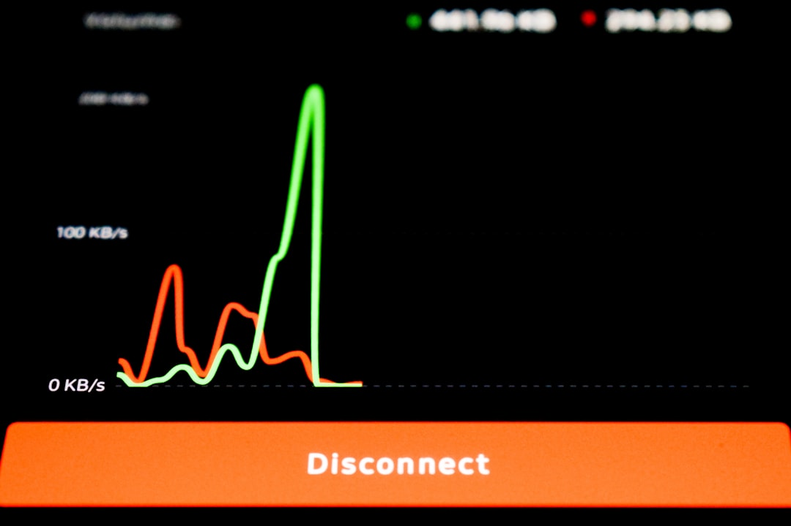

# Fable 5 被政府关掉的那晚，GLM-5.2 被政府放出来了

> **发布日期**：2026-06-25 | **分类**：AI 深度观察

## 导语

6 月 12 日，Anthropic 全球停服 Fable 5；17 小时后，智谱宣布 GLM-5.2 完全开源。两件事同时发生，包含了"AI 自由"这个说法的真实意涵——政府决定你能用什么。

---

## 一、时间线

美东时间 6 月 12 日下午 5 点 21 分，Anthropic 向全球用户发出通知：Fable 5 因美国出口管制法规，即刻在全球范围停止服务。

距 Fable 5 正式发布，不足 72 小时。

发布时它是当时全球最强的可用模型，SWE-bench Pro 80.3%。三天前 Dario Amodei 还在发布会上说这是"AI 历史上的里程碑时刻"。三天后，订阅用户打开 Claude，看到的是 404。

北京时间 6 月 13 日上午 10 点，智谱发布公告：GLM-5.2，MIT 协议，完全开源，全量用户即刻可用。

时间差：不到 17 小时。

智谱 CEO 张鹏在发布会上说了一句话："前沿智能属于每一个人。"在那个具体的时间节点，这句话有了一个不需要解释的对照组。智谱股价当日一度涨 47%。

## 二、那本没被算完的账

GLM-5.2 确实很强。SWE-bench Pro 62.1，GPT-5.5 是 58.6，差距超过 3 个百分点。API 定价每百万输入 token 1.4 美元，GPT-5.5 是 5 美元——同等任务，成本差 6 倍。

这本账算起来很容易。

还有另一本账没算完。

智谱（Z.ai）于 2025 年 1 月被美国商务部工业安全局列入出口管制实体名单，理由是"推进中国军事现代化"。你通过 API 发给它的代码，依据中国《国家情报法》（2017），理论上可以被中国政府合法调取。这不是阴谋论，是写在法条里的文字。

此刻你可能在想：但它开源了，我可以自托管。

这是正确的思路。MIT 协议下的开源权重，本地部署不经过 Z.ai 服务器，物理上切断了数据传输路径。但 GLM-5.2 总参数 753B，FP8 量化后仍需数十张 H100 才能跑满精度。这不是一个工程团队在下午就能解决的事。

## 三、MIT 开源，不等于数据主权

大多数关于 GLM-5.2 的报道，在这两个概念之间打了一个等号，然后就过去了：**开源 = 安全**。

这个等号不成立。

MIT 协议是软件著作权许可，规定了权重的使用、修改和再发布条款。国家情报法是主权国家的安全法律，规定了国境内组织对境外客户数据的配合义务。两件事在不同的法律体系里运作，一个不能覆盖另一个。

准确的表述是：MIT 开源解决了"能不能用这个权重"，没有解决"API 调用数据去哪里"。

对于真的在意数据安全的企业，选项只有一个——自托管开源权重，不走 Z.ai 的任何服务器。技术上可行，成本上对大多数团队仍是挑战。

对于其他人，这道题还没有简单答案。

## 四、同一周，AI 多了一条选轴

Fable 5 被美国政府用一纸行政令关掉。GLM-5.2 被中国政府背书的公司在精确计算的时机点放出来。

这不是关于谁对谁错的叙事。这是一个关于 AI 工具选择依据的结构变化。

在这之前，选 AI 工具的轴是：性能、价格、生态。在这之后，多了一条：你的工作负载在哪个法律体系里运行，那个体系里的政府对这个模型有没有主张。

这条轴以前不是没有，只是从来没有用同一周两件事这么直白地展示过。

你现在也可以用 GLM-5.2 了。先想好，你在用哪个模型——还是在选择把代码放在哪个主权体系里。

---

## 数据来源

- [Z.ai's open-weights GLM-5.2 beats GPT-5.5 on coding at 1/6 the cost（VentureBeat）](https://venturebeat.com/technology/z-ais-open-weights-glm-5-2-beats-gpt-5-5-on-multiple-long-horizon-coding-benchmarks-for-1-6th-the-cost)
- [GLM-5.2: Built for Long-Horizon Tasks（Hugging Face Blog）](https://huggingface.co/blog/zai-org/glm-52-blog)
- [GLM-5.2 Open Weights Live — API Use Carries China Data Risk（TechTimes）](https://www.techtimes.com/articles/318543/20260617/glm-52-open-weights-live-top-coding-benchmark-api-use-carries-china-data-risk.htm)
- [美国禁掉 Fable 5 后，智谱暴涨 47%（36氪）](https://www.36kr.com/p/3854227612554501)
- [GLM-5.2全量开源，借竞品停服窗口期对冲IPO不确定性（虎嗅）](https://www.huxiu.com/article/4867170.html)
- [GLM-5.2 is probably the most powerful text-only open weights LLM（Simon Willison）](https://simonwillison.net/2026/Jun/17/glm-52/)
