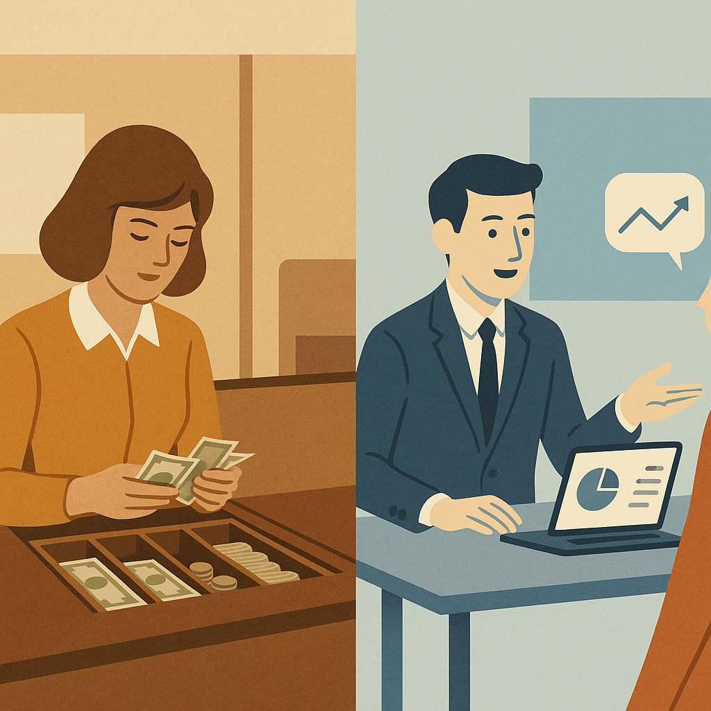

# AI 不消灭中层，AI 重新定价中层

> **发布日期**：2026-06-26 | **分类**：管理 · AI 观察

## 导语

兄弟们，前几天我写了一篇《Claude Tag：不是 AI 同事，是 AI 中层》。

文章主张——AI 会替代管理中层。

但发完之后我冷静下来，觉得自己说得**对了一半，错了一半**。

对的部分：中层的一部分工作确实会被 AI 接走。

错的部分：「替代」不是这件事的本质。

本质是——

**AI 不消灭中层。AI 重新定价中层。**

把所有中层分成两种——**会能力迁移的**，和**被冷处理的**。

前者会涨薪。
后者不会被裁，但会被慢慢边缘化。

哪一种更恐怖？

我个人感觉，**后者**。

因为"被裁"还能写离职信、还能上脉脉骂、还能让全网知道。

"被冷处理"是无声的——你坐在工位上，工资照发，但你已经死了。

只是没人通知你。

---

## 我可能错了一半——历史给的教训

先承认错误。

我之前那个判断："Claude Tag 替代中层管理"，本质上是 Twitter 标题党思维。

历史上每一次"新技术消灭某个职业"的预言，几乎都被打脸了——

**1969 年，ATM 诞生**

当时所有人预言"银行柜员要消失了"。

结果呢？1970 到 2010 年，美国银行柜员数量从 50 万**增加**到 60 多万。

不是 ATM 没用——ATM 确实接走了存取款这件事。

是柜员的**工作内容**变了：从"递钱数钞"变成"卖理财、推保险、客户关系"。

ATM 没消灭柜员。ATM 把柜员从**操作工**变成了**销售员**。

**1995 年，互联网起来**

当时所有人预言"百货公司要消失了"。

结果呢？百货公司确实倒了一批，但**还活着的那一批比以前更赚钱**。

为什么？因为剩下的百货公司学会了——卖体验，不卖商品。

亚马逊接走了"我要买东西"的需求，但带不走"我想逛逛"的需求。

**2010 年代，云计算来了**

当时所有人预言"系统管理员要消失了"。

结果呢？AWS、Azure 接走了"装服务器、装机房"的活，但**带火了一个新工种叫 SRE**——他们的工资是传统 sysadmin 的 2-3 倍。

----

兄弟们这三个案例告诉你一件事——

**技术从来不消灭岗位。技术消灭的是岗位里的"重复性低价值部分"。**

剩下的部分被压缩，但同时**单价被抬高**。

这才是 Claude Tag 真正要做的事——

它不会让中层消失。

它会让 80% 的中层活成 20% 的样子。

**80% 被冷处理。20% 涨薪。**

---

## 中层的两层结构——功能 vs 角色

要理解"重新定价"这件事，得先把中层这个岗位拆开看。

中层管理者，本质上是**两层结构**——

**第一层：功能层**

这是中层的"日常动作"——

- 跟踪各项目进度
- 汇总数据写周报
- 跨部门协调信息
- 提醒下属未完成任务
- 给新人介绍背景
- 模板化的决策传达

这一层，**Claude Tag 现在能做 80% 以上**。

不是因为 AI 有多神，是因为这一层的工作**本质上是信息搬运**。

信息搬运是 AI 的天然主场。

**第二层：角色层**

这是中层的"存在意义"——

- 在关键时刻**做判断**（数据不全的情况下拍板）
- 在跨团队冲突时**做担保**（用自己的政治资本压住一方）
- 在下属失败时**做缓冲**（替下属扛锅、给下属时间）
- 在团队低谷时**做激励**（不是说漂亮话，是真的让人觉得有希望）
- 在伦理灰区**做底线**（什么能做、什么不能做）

这一层，**Claude Tag 短期内做不了**。

也许永远做不了。

为什么？因为这一层依赖的不是数据处理能力，是——

**人对人的信任、人对人的承诺、人对人的责任**。

这三件事，AI 给不了。

不是技术问题，是结构问题。

----

兄弟们想清楚——

**你被 AI 替代的从来不是"你这个人"。**

是你在中层岗位上**那个功能层**。

如果你的工作 90% 是功能层（开会、催进度、写周报、转达消息）——

你正在被 Claude Tag 慢慢替代。

如果你的工作 50% 是角色层（判断、担保、缓冲、激励、底线）——

你正在被 Claude Tag **赋能**。

同一个中层岗位，结局完全相反。

**这就是"重新定价"的真正含义。**

---

## 哪些能力能迁移、哪些不能

接下来这一节是最实用的。

如果你是中层，你最关心的问题是——

**"我现在哪些能力能保住未来的位置，哪些是注定要被替代的？"**

我给你拆。

**能迁移的能力（继续有价值）：**

1. **结构化判断力**——面对模糊问题，能在 30 分钟内给出有理有据的方向。AI 给你 10 个选项，但选哪个还得你拍。

2. **跨部门政治资本**——你说一句话，财务部、法务部、销售部都会买账。这是 10 年职场积累，AI 复制不了。

3. **情境化情绪管理**——下属哭了，你知道怎么安慰。下属嘴硬，你知道怎么戳穿。这是人对人。

4. **例外处理直觉**——你知道哪些客户不能按流程处理。你知道哪些 bug 一定要立刻 escalate。这是经验。

5. **隐性知识沉淀**——你知道三年前那个决策为什么这么做，谁反对，谁妥协。但你的方式是"我能说清楚"，而不是"我藏在心里"。

**不能迁移的能力（注定贬值）：**

1. **会议组织能力**——AI 自动排日历、自动写会议纪要、自动跟进 action items。开会主持人这个角色，正在被压缩。

2. **数据汇总能力**——AI 可以自动出周报、月报、季度报告，颗粒度比你细。

3. **进度催办能力**——ambient mode 会 24/7 提醒所有人未完成的任务，比你 @ 人有效率。

4. **模板化决策传达**——"按照公司政策"那种话，AI 说得比你更标准。

5. **PPT 美化和叙事重构**——AI 写汇报材料的水平已经超过 80% 中层。

----

兄弟们看到这两组列表，请做一件事——

**拿你过去一周的工作时长，按这两组归类。**

如果你"能迁移"那一组占 60% 以上——

恭喜，你是会涨薪的那 20%。

如果"不能迁移"那一组占 60% 以上——

你已经在被冷处理的路上了。

不是危言耸听，是数学题。

---

## "迁移成功"的中层长什么样

我观察过一些已经完成能力迁移的中层 leader。他们有几个共同点——

**特征一：管理半径放大 3-5 倍**

以前一个中层管 10 个下属，已经很累了。

现在一个迁移成功的中层管 30-50 个人 + 100 个 AI agent。

为什么能管这么多？

因为 Claude Tag 接走了 80% 的"信息搬运"——

进度跟踪、跨人协调、周报汇总、提醒催办——全部不用他做。

他只做 20% 的事：**判断、担保、缓冲、激励、底线**。

20% 的时间，做最值钱的事。

这就是"杠杆"。

**特征二：会议时间砍掉 60%**

以前一个中层每天 6 小时开会——同步进度、对齐方向、传达决策。

现在一个迁移成功的中层每天开会不超过 2 小时。

剩下 4 小时干嘛？

**深度思考 + 战略对接 + 跨部门谈判 + 客户对接**。

这些是 AI 帮不上、但价值最高的事。

**特征三：自己变成"AI 操作系统"的一部分**

他们的 prompt、判断逻辑、决策原则，已经被显性化、文档化、教给了 Claude Tag。

也就是说——

**他们不是和 AI 竞争。他们让 AI 跑自己的判断模式。**

每个迁移成功的中层，本质上是把自己变成了一个**"可扩展的判断函数"**。

AI 是他们的执行层。他们是 AI 的决策层。

**特征四：薪资被重新评估**

这种中层在公司里的 title 可能没变，但**有效产出已经是过去的 3-5 倍**。

CEO 看到的不是"他管 30 个人"，是"他撑住了一整个 BU 的运转，每月只要 3 万块"。

下一次薪资 review，他会涨到 5 万、8 万、10 万。

不是因为他工作时长变长了——

是因为他的**单位时间价值**变了。

<<__AIWRITER_PLACEHOLDER__>>

---

## "迁移失败"的中层长什么样——温水煮青蛙

接下来这一段最残酷。

如果你没有完成能力迁移——你不会被裁。

你会被**冷处理**。

我给你画一下迁移失败的中层未来 3 年的轨迹——

**第 1 年：你的 leader 给你"赋能"**

公司宣布"全员 AI 战略"，给你团队配了 Claude Tag。

你 leader 拍着你肩膀说："以前那些汇总、跟进、写周报的工作，让 Claude Tag 帮你跑。你腾出时间做更有价值的事。"

你开心，因为终于不用熬夜写周报了。

但你没注意——

你"以前 80% 的工作"，正是公司付你工资的理由。

**第 2 年：你被慢慢边缘化**

你发现重要的会议你不再被 invite。

公司战略会议、客户会议、跨部门高层会议——你以前都在的。

现在你的角色从"必须在场的人"，变成"会议纪要看一下就行的人"。

你 leader 不会直接说，但你能感觉到。

你试图主动出现，但发现自己**说不上话**——因为你不掌握新信息流。Claude Tag 直接对接 VP，VP 决策已经做完，你只是被通知。

**第 3 年：你被建议"转岗"**

某天 HR 找你聊，话术很温柔——

"我们觉得你的经验在 X 部门会更有发挥空间。"

"现在公司在做组织优化，你这个 level 的 leader 需求在收缩，但我们看好你的某某能力。"

"你考虑下转去做某某顾问？薪水不变。"

你看出来了吗？

**这不是裁员。这是冷处理。**

公司不会让你失业，因为他们要保住"不裁中层"的品牌形象。

但你的实际价值已经被剥离。

你从"决策链上的人"变成"流程图边缘的注释"。

你的工资照发，但你**已经不再是公司在乎的人**。

----

兄弟们想清楚——

**「被冷处理」是 AI 时代最难反抗的中层困境**。

为什么难反抗？

因为没有具体的"加害者"。

不是某个 leader 在欺负你。是整个组织的能力定价机制变了。

你被冷处理，是市场反应。

市场没法上告。

<<__AIWRITER_PLACEHOLDER__>>

---

## 能力迁移的 4 个具体步骤

最后一节，给你可执行的迁移指南。

不要把"迁移"想成一个抽象概念。它有 4 个非常具体的步骤。

**步骤一：把你的判断逻辑显性化**

这是最重要的一步，也是最反直觉的。

很多中层的核心价值是"我知道怎么判断这种事"——但这个能力如果只在你脑子里，**它对你的公司没有累积价值，对你自己也没有杠杆**。

显性化的具体做法：

- 每次做决策前，写下"我为什么这么做"，至少 3 条理由
- 每个月做一次"决策复盘"，把过去 30 天的关键判断整理成文档
- 把这些文档喂给 Claude Tag，让 AI 学会用你的方式判断

听起来像在帮 AI 替代你？

错。你是在**把自己的判断能力，变成可被衡量、可被复用、可被推广的资产**。

CEO 不需要你做事。CEO 需要你做事的方式可以被复制。

显性化你的判断 → 你的 leader 升职 → 他带你升职 → 你管的人变多 → 你的价值变大。

这是杠杆。

**步骤二：把 50% 时间从"管理"转到"教练"**

迁移成功的中层，时间分配长这样——

| 时间 | 任务 |
|------|------|
| 30% | 关键决策 + 战略对接 |
| 30% | 教 Claude Tag 做事 / 教 junior 做事 |
| 20% | 跨部门谈判 + 客户对接 |
| 10% | 处理紧急例外 |
| 10% | 团队沟通 |

注意——"开会催进度"已经完全消失。

被替代了。

**步骤三：建立"AI 接不了"的护城河**

未来 3 年最值钱的中层能力是——**AI 接不了的那部分**。

具体清单：

1. **特定行业的深度 know-how**（医疗、金融、监管行业的判断不可能让 AI 拍板）
2. **跨部门政治资本**（你能让 CFO 在 24 小时内拨款 100 万——这不是 AI 能做的）
3. **客户/合作伙伴的个人信任**（你和某个大客户 CEO 一起喝过 5 次酒——AI 没这个履历）
4. **伦理判断**（什么能做、什么不能做——AI 永远只会说"取决于具体情况"）
5. **危机沟通**（团队出事时谁出来扛、对外怎么说——这是人的活）

如果你过去 5 年没有积累这些——

不晚。但要立刻开始。

**步骤四：换一套衡量自己价值的指标**

最后这一步是认知层面的。

**旧指标：**
- "我管几个人"
- "我开几个会"
- "我的 team 出几个项目"

**新指标：**
- "我让多少产出成为可能"
- "我做了几个高质量判断"
- "我培养了几个比我强的下属"
- "我让多少 AI agent 在用我的判断逻辑运行"

兄弟们看出区别没——

旧指标是**「我有多忙」**。
新指标是**「我有多大杠杆」**。

AI 时代，杠杆才是钱。

忙不是。

----

这就是我对上一篇文章的修正。

AI 不会消灭中层。

AI 会让中层分成两种——

**会迁移的，活得更好。**
**没迁移的，慢慢退场。**

哪一种是你，不是 AI 决定的。

是**你自己怎么用接下来这 18 个月**决定的。

兄弟们，AI 时代最大的不公平，不是 AI 让一些人失业。

是 AI 让"是否拥抱变化"这件事，**第一次有了财务上的直接惩罚**。

以前不拥抱变化，你只是慢一点。
现在不拥抱变化，你直接被冷处理。

但反过来——

只要你愿意迁移，AI 也是**第一次有了给个体打杠杆的能力**——

你不再需要等公司提拔你。
你可以靠 Claude Tag 自己扩大管理半径。
你可以靠显性化判断把自己变成可复制的资产。
你可以靠 AI 杠杆撬动以前撬不动的事。

中层不会消失。

**会消失的，只是不愿意进化的那部分中层。**

而你属于哪一边——

只看你今天做不做这件事。

<<__AIWRITER_PLACEHOLDER__>>

---

## 数据来源

- [Claude Tag 发布信息（Fortune, 2026-06-23）](https://fortune.com/2026/06/23/anthropic-claude-tag-virtual-employee-tool-slack/)
- [Anthropic 内部 65% 代码 by Claude Tag（TechTimes）](https://www.techtimes.com/articles/318967/20260623/claude-tag-turns-slack-multiplayer-ai-anthropic-agent-writes-65-its-own-code.htm)
- [ATM 与银行柜员就业变化 1970-2010（James Bessen, Boston University）](https://www.atmmarketplace.com/news/study-atms-have-not-cost-bank-teller-jobs/)
- [The Future of Management in an AI World（MIT Sloan Management Review）](https://sloanreview.mit.edu/article/the-future-of-management-in-an-ai-world/)
- [McKinsey: How AI is changing middle management 2026](https://www.mckinsey.com/capabilities/people-and-organizational-performance/our-insights/the-agentic-organization-contours-of-the-next-paradigm-for-the-ai-era)
- [HBR: Managers Aren't Going Away（Harvard Business Review on managerial roles in AI era）](https://hbr.org/2024/05/managers-arent-going-away-theyre-leveling-up)
- [前一篇互文：《Claude Tag：不是 AI 同事，是 AI 中层》](https://silvere.github.io/aiwriter/posts/2026-06-24/claude-tag-ai-middle-manager/article.html)

> 注：本文是上一篇《Claude Tag：不是 AI 同事，是 AI 中层》的辩证修正——上篇主张 AI 替代中层，本篇主张 AI 重新定价中层。文中"迁移失败者"和"迁移成功者"的画像基于业界观察归纳，非具体个案。
