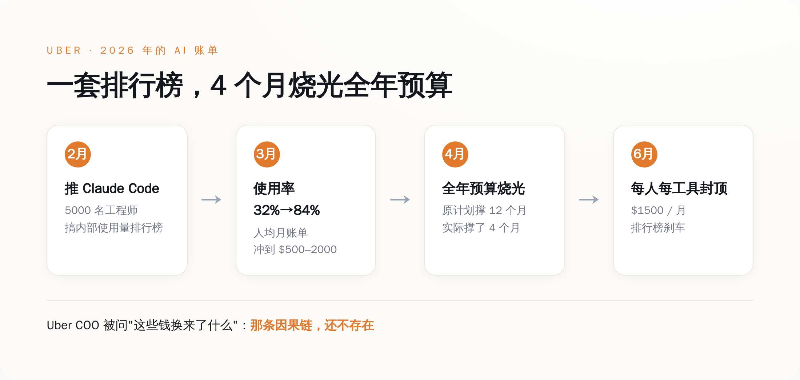
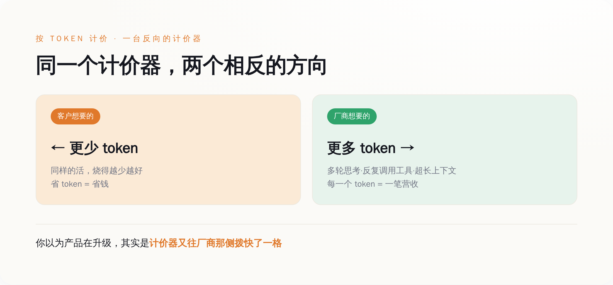
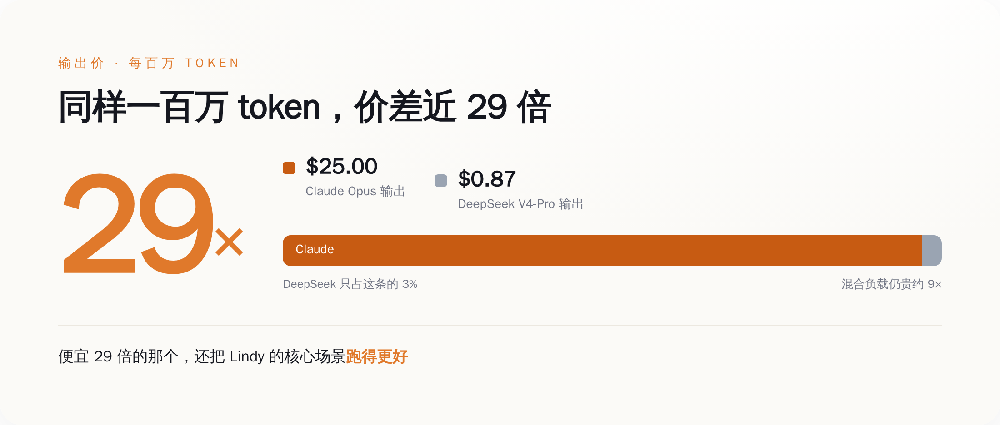
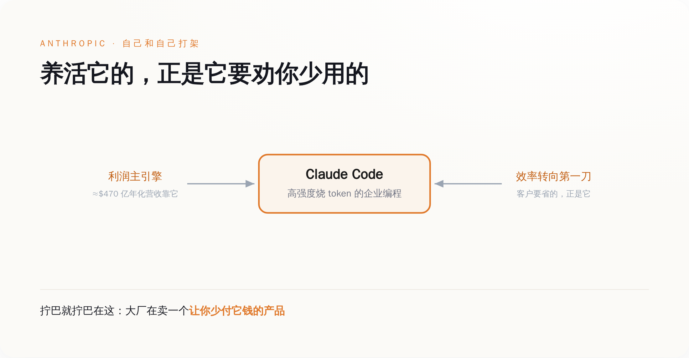

# AI 大厂最大的对手，是想省钱的你

> **发布日期**：2026-06-26 | **分类**：商业 · AI 观察

## 导语

兄弟们，6 月有家叫 Lindy 的公司，做 AI agent 的，25 个人。

它的 AI 账单，已经比给全公司发的工资还高。

于是它的 CEO 某天扣下扳机，把 100% 的流量从 Claude 切到了便宜得多的 DeepSeek，一个月省下几百万美元。

这不是一家穷公司的小算盘。它是 2026 年 6 月整个 AI 行业转身的缩影——

**大家终于发现：按 token 收费这件事，厂商和客户的利益，是反的。**

你越会用 AI、越高效、越省 token，大厂就越穷。

这不是价格战，不是 ROI 不及预期，不是账单太贵。

这是一台计价器，从一开始就是按厂商的利益在转。而客户，刚刚才看懂表。

---

## 「扣扳机」那天，他算的是一道生存题

先把 Lindy 这事说清楚，因为它是这一整套逻辑最干净的样本。

它的 CEO Flo Crivello 某天在 X 上发了一句话，原文是这样的——

> "今天扣了扳机，把 Lindy 100% 的流量从 Anthropic 切到了 DeepSeek v4。每个月省几百万美元，而且很多核心场景的表现还变好了。对公司是转折性的。"

他后来补了一句更狠的：这是"关乎公司生死"的决定。

Lindy 是一家 AI agent 创业公司，25 个人。它的产品要大量调用大模型——用户每点一下，背后是一连串的 token 在烧。

烧到什么程度？

Crivello 自己说的：AI 成本已经超过了人员成本。

兄弟们体会一下这句话的重量——

一家公司养 25 个人，给这些人发的工资，加起来还没有它喂给 AI 的钱多。

这在三年前是科幻。在 2026 年，是账单。

所以他切到 DeepSeek。一刀切，100%，不留余地。

省下来的，按他自己的说法，是"每个月几百万美元"。

而且最让 Anthropic 难堪的是那半句话——"很多核心场景表现还变好了"。

也就是说，这不是"用便宜的凑合一下"。

是"便宜的，活还干得更好"。

那 Anthropic 凭什么收你 9 倍的价？

Crivello 留了个台阶：如果哪天 Anthropic 降价了，他会考虑切回去。

但他下一句才是真话——"在那之前，**我们有选择了**"。

这五个字，是过去一年里 AI 大厂最不想听到的五个字。

因为大厂过去一年卖的，根本不是模型。

是"你别无选择"。

---

## tokenmaxxing：一场比谁烧钱多的荒诞比赛

要理解 Lindy 为什么会被账单逼到墙角，得先看看这一年大家是怎么花钱的。

这一年有个词，叫 **tokenmaxxing**。

直译过来就是"把 token 消耗量拉满"。

它本来是程序员之间的黑话，后来变成了一种企业文化——

谁烧的 token 多，谁就显得"AI 用得深"，谁就是先进生产力。

听起来很扯？我给你看一个真实案例。

Uber。

2026 年 2 月，Uber 给它大约 5000 名工程师推广 Claude Code。

为了让大家用起来，公司搞了个内部排行榜——按团队的 AI 工具使用量排名。

效果立竿见影：Claude Code 的使用率从 2 月的 32%，一个月冲到 3 月的 84%。

每个工程师每月的 API 账单，飙到了 500 到 2000 美元。

然后呢？

4 个月，Uber 烧光了它整个 2026 年的 AI 预算。

全年的，4 个月烧完。

公司急了，6 月出了个规定：每个人、每个工具，每月封顶 1500 美元。

排行榜那套"烧得越多越光荣"，戛然而止。

但真正值钱的是 Uber 总裁兼 COO Andrew Macdonald 的那句话。

有人问他：花这么多钱用 Claude Code，到底给用户带来了什么？

他说：很难把公司暴涨的 Claude Code 用量，和那些真正服务消费者的创新连起来——

"**那条因果链，还不存在。**"

*图注：Uber 用一套「比谁烧得多」的排行榜把 token 用量冲到 84%，4 个月烧光全年预算，最后只能靠封顶刹车——而 COO 承认，烧掉的钱和给用户的价值之间，那条因果链还不存在。*

Uber 不是孤例。

Salesforce 的 CEO Marc Benioff，5 月在一档播客里亲口说：

"我今年在 Salesforce 大概要用掉 **3 亿美元**的 Anthropic。"

3 亿美元，一家公司，一年，喂给一家模型公司。

而其中大头，是拿去跑编程 agent 的。

兄弟们看明白这个画面没有——

一边，Salesforce 2025 年初就冻结了软件工程师的招聘，理由是 AI 让效率涨了 30% 以上；

另一边，它给 Anthropic 开 3 亿的支票。

省下来的人力钱，原封不动、甚至加倍地，付给了卖 token 的人。

这就是 tokenmaxxing 的本质——

它不是"用 AI 提效"，它是"把省下的人力成本，换个名目交给大模型公司"。

你以为你在降本。

你只是换了个债主。

---

## 计价器，是按谁的利益在转

到这里，得问一个所有人都绕过去的问题——

为什么 AI 会这么贵？

标准答案是："因为算力贵、模型大、训练烧钱。"

这个答案对，但它回避了一件更要命的事：

AI 是按 **token** 卖给你的。你用得越多，它赚得越多。

这意味着，卖你 AI 的那家公司，它的商业利益，和你的利益，从根上就是拧着的。

我给你拆开看。

你想要什么？你想要 AI 用最少的 token，把活干完。又快又省。

厂商想要什么？厂商想要你烧掉尽可能多的 token。

这两件事，是反的。

而且不是嘴上反，是产品设计层面就反——

这一年大模型公司最得意的几个"进步"，全都在制造 token：

agent 能自己多轮思考了（每一轮都是 token）；

能调用工具、反复试错了（每一次调用、每一次重试都是 token）；

上下文窗口更长了，能把整个代码库塞进去了（塞进去的每一个字都是 token）。

听起来都是能力升级。

但你换个角度看——

这些"升级"，每一个都在让你花更多的钱，而你花的每一分钱，都直接变成厂商的营收。

厂商不是在帮你提效。

厂商是在帮你提"耗"。

*图注：按 token 计价，厂商的赚钱方向（让你多烧）和客户的省钱方向（让你少烧）天生相反——所谓的产品「升级」，多半是把计价器往厂商那一侧又拨快了一格。*

兄弟们，这才是 tokenmaxxing 真正荒诞的地方。

它不是用户自己疯了，主动要烧钱。

是整个计价模式，在奖励烧钱。

你想想，有哪个正常的买卖关系是这样的——

你去餐厅吃饭，餐厅按你嚼了多少下收钱；

你打车，司机按发动机转了多少圈收钱；

你请律师，律师按他打了多少个字收钱。

**按 token 收费，就是按打字的字数给作家发工资。**

字越多，钱越多。

那作家干嘛要写得精炼？

他当然往啰嗦了写。

过去一年，整个 AI 行业，就是一群被鼓励往啰嗦了写的作家。

而你，是那个按字数付钱、还以为自己买到了文采的甲方。

---

## DeepSeek 把价格砍到 1/4，戳破的不是价格

Lindy 切去的那个 DeepSeek，到底便宜多少？

我给你摆数字，都是公开的官方定价，你自己感受。

DeepSeek V4-Pro，5 月 22 日把一个"75% 折扣"变成了永久价格：

输入 token，每百万 0.435 美元；输出 token，每百万 0.87 美元。

折扣前是多少？输入 1.74、输出 3.48。

砍掉 75%，砍到原来的四分之一。

那 Claude 呢？

Claude Opus 这一档，输入每百万 5 美元，输出每百万 25 美元。

兄弟们做个除法——

同样输出一百万 token，Claude 收你 25 美元，DeepSeek 收你 8 毛 7。

差了将近 29 倍。

就算把各种任务混在一起算一笔总账，跑同样的活，Claude 的费用大概是这一档中国模型的 9 倍左右。

9 倍。

*图注：同样输出一百万 token，Claude Opus 收 25 美元，DeepSeek V4-Pro 收 0.87 美元——价差近 29 倍；混合真实负载跑下来，大厂模型仍贵约 9 倍。便宜的那个，还把 Lindy 的核心场景跑得更好。*

但兄弟们，如果你只看到"中国模型便宜"，你就看小了。

DeepSeek 这一刀，砍的不是自己的价。

砍的是一个叙事——"**前沿模型，值这个价**"。

过去一年，大厂收你高价的底气，是"我最强、我别无可替代、你爱用不用"。

现在 DeepSeek 站出来说：我便宜 29 倍，活还干得不差。

这一下，"贵 = 强"的等号，断了。

更要命的是连锁反应。

据报道，OpenAI 已经在认真考虑大幅降价，来接住 DeepSeek 和 Anthropic 的两头夹击。

一旦大厂开始降价，那个最尴尬的问题就藏不住了——

你之前收我那么贵，到底是因为成本，还是因为我没得选？

客户一旦问出这句话，定价权这件事，就开始易主了。

---

## 大厂的死结：养活它的，正是它要劝你少用的

你可能会说：那大厂跟着降价、推效率工具，不就行了？

问题就在这——它降不动，也不太敢推。

先看 Anthropic 现在的处境，数字都是公开的。

它的年化营收，从 2024 年底的约 10 亿美元，一路冲到 2026 年的约 470 亿美元。

2026 年第二季度，它第一次实现了盈利。

最新一轮融资，估值 9650 亿美元，离一万亿一步之遥。

它和 OpenAI，6 月都已经秘密递交了 IPO 申请。

听起来烈火烹油，对吧？

但你拆开它营收的引擎看——

撑起这台机器的主力，正是 Claude Code 这种企业级、高强度、往死里烧 token 的编程业务。

Salesforce 那 3 亿、Uber 那烧光的预算，就是这台引擎的燃料。

现在问题来了——

"efficiency 转向"，客户要省 token，第一个被砍的，**正是这块高烧 token 的业务**。

*图注：Anthropic 的利润主引擎，是 Claude Code 这种往死里烧 token 的企业编程业务；而客户的「效率转向」第一刀，砍的恰恰就是它——养活大厂的，正是大厂被迫要劝你少用的。*

这就是死结。

大厂现在站在一个特别拧巴的位置上——

它要上市，要给投资人讲盈利故事，所以不能让营收掉下来；

可它营收的来源，是客户烧 token；

而客户现在最想干的事，就是少烧 token。

它要是真心实意帮客户提效，等于亲手砍自己的营收，IPO 故事崩一半；

它要是继续闷声鼓励你烧，DeepSeek 在旁边便宜 29 倍地招手，客户随时跑。

所以你看到的是一套精神分裂的操作——

嘴上，所有大厂都在开发布会讲 "efficiency"、讲"帮你优化成本"；

手上，所有大厂的新功能，agent、多轮、长上下文，全都在让你烧更多。

**一家公司，一边卖你省钱的承诺，一边卖你费钱的产品。**

这不是哪个 CEO 坏。

这是按 token 收费，把厂商架在了火上。

---

## 省下的钱之外，还有一张没人看的账单

钱的事吵到这儿，还有一层没人掀开。

到现在为止，所有人吵的都是"钱"——账单贵不贵、省了多少、谁定价。

但有一张账单，一直没人翻出来看。

回到 Uber COO 那句话："那条因果链，还不存在。"

5000 个工程师，烧光了一整年的 AI 预算。这笔钱，是公司付的。

可"值不值"这件事，最后是谁在承担？

是那些被 AI 生成的 bug 拖住、加班返工的工程师。

是那些拿到一个看起来对、其实错的建议、然后踩坑的用户。

是那些为了一个"AI 用得深"的排行榜名次，把时间烧在没意义的 token 上的人。

账面上，公司在为 token 付钱。

账面下，一群具体的人，在为这些 token 的"乱花"买单。

所谓的"efficiency 转向"，如果只是把问题从"我们花太多"换成"我们花得不够聪明"——

那它就只是给"继续花"找了个更体面的借口。

真正的效率，不是换个便宜的模型接着烧。

是先想清楚：这个 token，到底该不该烧。

所以，如果你是花钱买 AI 的那个人，我给你三句实在话——

第一，别再拿 token 消耗量当生产力指标。那是给大厂打工的 KPI，不是给你自己的。烧得多不等于干得好，Uber 用一年预算给你做过实验了。

第二，重新定义"用得好"。不是"我用了多少 AI"，是"我用最少的 token，把活干成了"。该路由到便宜模型的就路由，该封顶的就封顶——Lindy 和 Uber 都已经替你试过水。

第三，记住那台计价器是按谁的利益转的。当一家公司一边劝你省钱、一边靠你花钱活着，它递给你的"效率工具"，你得自己掂量掂量分量。

兄弟们，回到开头那个画面——

Lindy 的 CEO 扣下扳机，把流量从 Claude 切走的那一刻，他不是在赌气。

他是看懂了一件大多数人还没看懂的事：

**这台计价器，从来不是按你的利益转的。**

该扣扳机的，不只是一家 25 人的小公司。

是每一个，还在用对手的 KPI，给自己打分的人。

## 数据来源

- [Flo Crivello（Lindy CEO）本人 X 帖：切换 100% 流量至 DeepSeek v4](https://x.com/Altimor/status/2062389885437366342)
- [AI startup Lindy ditched Claude entirely for Deepseek, saving millions（The Decoder, 2026-06）](https://the-decoder.com/ai-startup-lindy-ditched-claude-entirely-for-deepseek-saving-millions-as-cost-pressure-mounts-on-anthropic/)
- [OpenAI and Anthropic face new AI reality as users shift from 'tokenmaxxing' to efficiency（CNBC, 2026-06-26）](https://www.cnbc.com/2026/06/26/openai-anthropic-new-ai-spending-reality-as-users-shift-to-efficiency.html)
- [Uber burned through its entire 2026 AI budget in four months（Fortune, 2026-05-26，含 COO Andrew Macdonald "That link is not there yet" 原话）](https://fortune.com/2026/05/26/uber-coo-ai-spending-tokens-claude-code/)
- [Uber caps employee AI spending after blowing through budget in 4 months（TechCrunch, 2026-06-02，$1500/月封顶）](https://techcrunch.com/2026/06/02/uber-caps-employee-ai-spending-after-blowing-through-budget-in-four-months/)
- [Salesforce CEO Marc Benioff 本人播客原话：今年用掉约 $300M 的 Anthropic（Quartz, 2026-05-18）](https://qz.com/salesforce-benioff-anthropic-300-million-coding-051826)
- [DeepSeek V4-Pro 官方定价（DeepSeek API Docs）](https://api-docs.deepseek.com/quick_start/pricing)
- [DeepSeek V4-Pro 75% Price Cut Goes Permanent（Dataconomy, 2026-05-25）](https://dataconomy.com/2026/05/25/deepseek-slashes-v4-pro-price-by-75-percent/)
- [Claude 官方定价（Anthropic Platform Docs）](https://platform.claude.com/docs/en/about-claude/pricing)
- [Anthropic raises $65B Series H at $965B valuation（Anthropic 官方新闻稿）](https://www.anthropic.com/news/series-h)
- [Enterprise customers cut OpenAI and Anthropic AI spending（Quartz, 2026-06-26）](https://qz.com/enterprise-ai-spending-openai-anthropic-roi-pullback-062626)

> 注：本文所有金额、定价、使用率与当事人引述，均来自上述一手来源——当事人本人公开发言（Crivello 的 X 帖、Benioff 的播客、Macdonald 的受访原话）、厂商官方定价页与融资公告。文中刻意不采用未经核实的二手转述数据（如各类"ROI 拆解比例""试点失败率"等坊间流传但无法回溯到原始报告的数字）。
