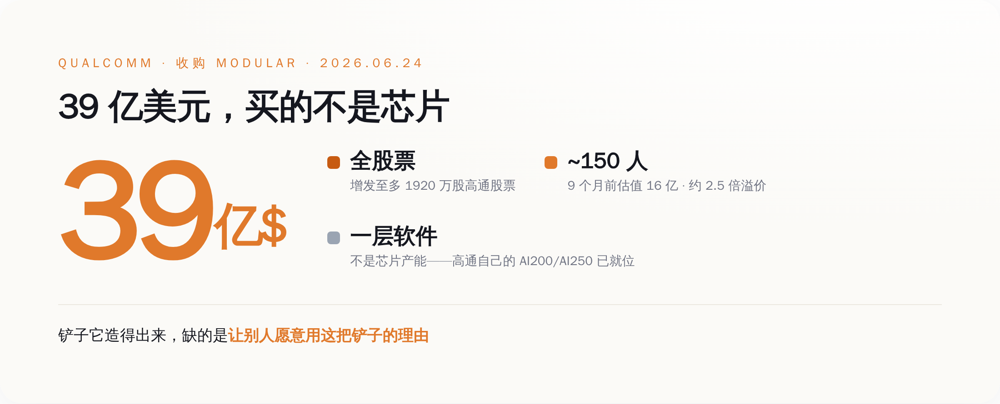
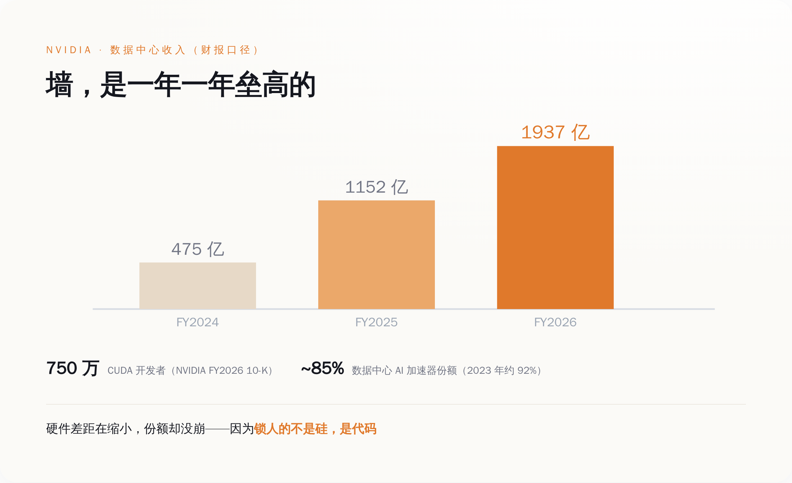
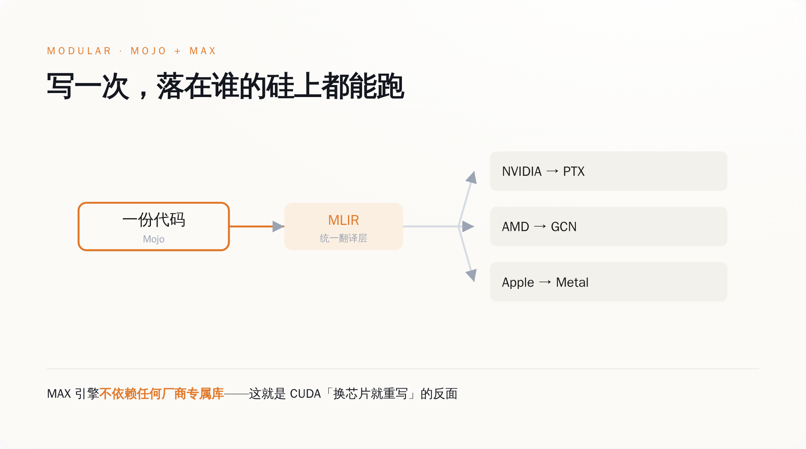
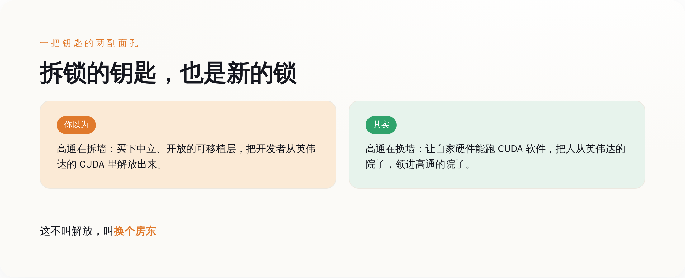

# 英伟达的护城河不是芯片，是 7500 万人懒得重写的代码——高通花 39 亿，买了把梯子

> **发布日期**：2026-06-26 | **分类**：AI 观察 · 算力护城河

## 导语

兄弟们，先看一笔账。

6 月 24 日，高通宣布收购一家叫 Modular 的公司。全股票，作价约 **39 亿美元**，要增发最多 **1920 万股**高通股票去换。

这家公司多大呢？**150 人左右**。9 个月前的上一轮融资，估值才 16 亿。也就是说，高通用了**两倍半**的溢价，去买一家连产品都还在 beta 的小公司。

所有媒体的标题都在说：高通要拿这个去**追英伟达**。

这话没错，但它把最关键的地方说糊了。高通追英伟达，缺的从来不是芯片——它自己的数据中心推理芯片 AI200、AI250 早在去年 10 月就发了。

它缺的是**软件**。

更准确地说，它花 39 亿买的不是一项技术，是**一把梯子**——一把专门用来翻英伟达那堵墙的梯子。

而这件事最骚的地方在于：造这把梯子的人，已经造了 25 年的"逃跑工具"；现在，这把梯子被一家卖芯片的公司，买走了。

---

## 一、高通买的不是芯片，是"翻译"

先把交易本身说清楚，不然容易被当成标题党。

6 月 21 日双方签了最终协议，6 月 24 日高通在投资者日上正式官宣。全股票，约 39 亿美元，最多增发 1920 万股，预计 2026 下半年完成交割，还要过反垄断。Modular 那 150 来号人，整建制并进高通的工程团队。

高通 CEO Cristiano Amon 在当天的官方稿里是这么说的：

> "我们正在定义高通的下一个篇章……并**进化成一家平台公司**。"

注意"平台公司"这四个字。一家做了四十年芯片和专利授权的公司，突然说自己要做平台。平台是软件的词，不是硬件的词。

为什么？因为硬件这块，高通其实不缺了。

去年 10 月，高通已经发布了数据中心推理芯片 AI200（2026 年上市）和 AI250（2027 年）。今年 6 月的投资者日上，它又甩出一整套叫 Dragonfly 的数据中心路线图：自研 CPU、推理加速卡、网络、定制硅，连内存都自己搞了个"高带宽计算"。Meta 已经签了多代 CPU 大单。高通还放话，2029 财年数据中心要做到 **150 亿美元**收入，非手机业务要做到 **400 亿**。

铲子，它造得出来。

缺的是什么？是让别人**愿意用**这把铲子的理由。

而这个理由，从来不在硅里。

*图注：39 亿全股票、2.5 倍溢价、买 150 人——高通买的不是产能，是一层能让别人愿意用它芯片的软件。*

---

## 二、英伟达真正的护城河，是"重写代价"

要看懂高通在买什么，得先看懂英伟达到底靠什么赚钱。

大多数人以为，英伟达赢在芯片快。这话只对了一半。

英伟达的数据中心业务，按它向 SEC 报的财报：2024 财年 475 亿美元，2025 财年 1152 亿，2026 财年 **1937 亿**，三年涨了四倍多，占了整个公司九成的收入。

但真正撑住这个数字的，不是 GPU 跑得多快。是一个 2006 年就推出的软件平台，叫 **CUDA**。

按英伟达 2026 财年的 10-K（这是要对 SEC 宣誓担责的法律文件），全球有**超过 750 万开发者**在用 CUDA。一年前的 10-K 还是 590 万。这些人写的每一行 AI 代码，几乎都默认跑在英伟达的硅上。

这才是墙。

你想换一块更便宜的芯片？可以。但你的代码得**重写**。CUDA 这套东西——cuDNN、TensorRT、那些攒了快二十年的算子库——换到别家芯片上，没有自动翻译。AMD 的 ROCm 至今没有 TensorRT 的等价物；最新的 FlashAttention 3 只在英伟达 H100 上跑；连官方的转换工具 hipify，都明说转不了内联 PTX 汇编。

所以你会看到一个反常识的现象：英伟达在数据中心 AI 加速器的份额，从 2023 年的约 92% 掉到了 2026 年的 80%-85%。硬件上的差距，AMD 们确实在追。

可份额没崩。

因为**锁人的不是硅，是代码**。竞争对手的芯片就算免费送，迁移要重写的工程量，也比省下的钱贵。

**英伟达卖的是芯片，护住它的，是 750 万人懒得重写的代码。**

*图注：英伟达数据中心收入三年翻四倍，但撑住它的不是 GPU 速度，是 CUDA 这堵越垒越高的「重写代价」之墙。*

---

## 三、那把梯子叫 Modular；造梯子的人，造了 25 年"翻译"

现在回头看高通买的东西，就清楚了。

Modular 这家公司，2022 年成立，两个创始人。一个叫 Tim Davis，谷歌出来的，搞过 TensorFlow Lite。另一个，叫 **Chris Lattner**。

这个名字，写代码的人应该都认识。

他在伊利诺伊读书时的硕士论文，就是 **LLVM**——今天几乎所有编译器的底座。后来去苹果，造了 **Clang**，又偷偷搞了四年，整出了 **Swift** 语言。中间去特斯拉做了半年 Autopilot 主管，嫌不合适走了。再去谷歌，主导了 **MLIR**——专门用来把 AI 模型编译到各种乱七八糟硬件上的中间层。然后去 RISC-V 芯片公司 SiFive 当工程总裁。2022 年出来，创立了 Modular。

你把这条履历连起来看，会发现这个人 25 年只在干一件事：**做"翻译层"**。让你写的代码，不被绑死在任何一块具体的芯片上。LLVM、Clang、Swift、MLIR，每一个都是在不同层面拆"你只能用某一家"的锁。

Modular 是这件事的集大成者。它的两个产品——**Mojo** 语言和 **MAX** 推理引擎——卖点就一句话：write once, run anywhere。一份代码，CPU、英伟达 GPU、AMD GPU、苹果芯片、各种 NPU，都能跑，不用为每块芯片重写。

技术上怎么做到的？Mojo 建在 MLIR 上，同一份代码经过编译，能分别吐出英伟达要的 PTX、AMD 要的 GCN 指令、苹果要的 Metal。MAX 引擎按官方文档的说法，**"不依赖任何厂商专属的硬件库"**。

翻译成人话：它就是专门来拆"重写代价"这堵墙的。Lattner 自己在收购公告里说：

> "Modular 创立的信念，就是 AI 需要一个更开放、更高效的软件底座，能横跨各种硬件和部署环境。"

英伟达最怕的，就是这种东西。

*图注：一份 Mojo 代码经 MLIR 编译，能同时落到英伟达、AMD、苹果的硅上——这正是 CUDA「换芯片就重写」逻辑的反面。*

---

## 四、解放者被买走的那一刻

到这里，故事本该是个爽文：屠龙少年造了把梯子，要带大家翻过英伟达那堵墙。

但你仔细想想就会发现哪里不对。

一个标榜"开放""中立""让 AI 计算民主化"的可移植层，最大的价值，恰恰在于它**不属于任何一家硬件公司**。它得对所有芯片一视同仁，开发者才信它，才敢把代码托付给它。

现在，它被一家**卖芯片的公司**买走了。

高通收购它，图的是什么？高通自己说得很直白：这笔交易能让它"在自己的硬件上，跑那些基于 CUDA 写的软件"。

听懂了吗？高通要的不是拆掉世界上所有的墙。它要的是：把英伟达那堵墙拆了，然后**在自己的院子里，垒一堵新的**。

把开发者从英伟达的锁里放出来，转头领进高通的门。这不叫解放，这叫**换个房东**。

这就是整件事最半佛的地方——

**能拆掉一堵墙的钥匙，本身就是最好的另一堵墙。**

谁拿到这把能让你"逃离英伟达"的钥匙，谁就握住了你下一程的去向。可移植性这东西，最值钱的时候，是它还没被任何一家硬件公司装进口袋的时候。一旦装进去了，它就从"梯子"变成了"绳子"。

*图注：你以为高通在拆墙、做开放；其实它是把英伟达的墙拆了，在自己院里垒一堵——开发者换的是房东，不是自由。*

---

## 五、"花大钱买逃生工具"，高通演过一次了

如果你觉得上面是诛心之论，那我们看高通自己的前科。

"花一大笔钱，买一个能让自己逃离别人的锁的东西"——这个剧本，高通 2021 年完整演过一遍。

那年，它花 **14 亿美元**买了家叫 Nuvia 的 CPU 公司。目的很纯粹：用 Nuvia 的自研架构，绕开向 Arm 交的授权费——CEO 自己在法庭上算过，一年能省下高达 14 亿。

听起来跟今天买 Modular 一模一样：买个东西，逃离一个卡着你脖子的供应商。

结果呢？

Arm 一纸诉状告了高通三年，理由是 Nuvia 的授权不能随收购自动转移。高通最后在 2024 年底打赢了官司，2025 年 10 月拿到终审，Arm 还在上诉。打赢了，但这三年的法律风险，悬在高通整个芯片业务头上。

更刺的还在后面。2026 年 4 月——也就是两个月前——当年 Nuvia 的核心创始团队，从高通**集体出走**，拿了红杉的钱，又开了家新公司叫 Nuvacore。

高通花 14 亿买回来的那批人，把技术做进产品之后，转身走了。

这就是"买逃生工具"这种生意最大的两个雷：

第一，**人是会走的**。你买的是 150 个工程师和一套理念，不是一座厂房。Lattner 这种人，过去二十年换了五家公司，最长的一站也就十一年。

第二，**社区是用脚投票的**。Modular 的全部价值建立在"中立"上。它越是被一家硬件公司攥在手里，那些指望它逃离锁定的开发者，就越要重新掂量：我费劲从英伟达的院子搬出来，是为了住进高通的院子吗？

顺便说一句，高通更大的那笔收购——2018 年想花 440 亿买 NXP——最后黄在中国监管手里，赔了 20 亿美元分手费。

买东西它很会买。买完能不能拿住，是另一回事。

---

## 六、下次再有人跟你吹"性价比吊打英伟达"

说回我们普通人能用上的东西。

这事最大的启发，不是高通能不能赢，而是它教你**怎么看一块芯片、一个云、一个 AI 供应商到底有没有护城河**。

以后再有人跟你吹某款芯片"TOPS 吊打英伟达""性价比碾压英伟达"，你先别急着信。问一句就够了：

**换到你这块芯片，我的代码要重写多少行？**

如果答案是"几乎不用改"，那它可能真有戏。如果答案是"重写、重测、重新调三个月"，那它再快再便宜，也翻不过那堵墙。

因为锁住 AI 的，从来不是最慢的硬件，是**最贵的重写**。

高通看懂了这一点，所以它没去硬刚芯片，而是花 39 亿买了把梯子。这一步，比绝大多数"我要做中国的英伟达""我要做英伟达平替"的公司，都清醒得多。

但梯子这东西有个悖论：它搭稳的那一天，就是它变成新墙的那一天。

这笔交易最终是好是坏，就看一件事——Modular 落到高通手里之后，那把梯子还开不开源、还中不中立。如果它继续对所有芯片一视同仁，那是开发者的胜利；如果它慢慢变成只为高通的硅服务的私产，那不过是把英伟达的墙，换了块砖。

**可移植性最值钱的时候，是它还不属于任何一家硬件公司的时候。**

而它现在，属于高通了。

---

## 数据来源

- [Qualcomm to Acquire Modular（高通官方新闻稿，2026-06-24）](https://investor.qualcomm.com/news-events/press-releases/news-details/2026/Qualcomm-to-Acquire-Modular/default.aspx)
- [Qualcomm Unveils Comprehensive Data Center Roadmap for the Agentic AI Era with New Qualcomm Dragonfly Portfolio（Qualcomm / BusinessWire 官方稿，含 Amon 表述，2026-06-24）](https://www.businesswire.com/news/home/20260624731900/en/)
- [Modular 官方博客：Qualcomm to Acquire Modular（含 Chris Lattner 原话）](https://www.modular.com/blog/qualcomm-to-acquire-modular)
- [Modular：Democratizing AI Compute（Chris Lattner 一手系列文）](https://www.modular.com/democratizing-ai-compute)
- [NVIDIA Q4 & FY2026 财报（SEC Form 8-K，数据中心收入 1937 亿美元）](https://www.sec.gov/Archives/edgar/data/0001045810/000104581026000019/q4fy26pr.htm)
- [NVIDIA FY2026 年报 10-K（SEC，CUDA 开发者超 750 万、CUDA 2006 年起）](https://www.sec.gov/Archives/edgar/data/1045810/000104581026000021/nvda-20260125.htm)
- [NVIDIA FY2025 年报 10-K（SEC，CUDA 开发者 590 万、数据中心收入 1152 亿）](https://www.sec.gov/Archives/edgar/data/0001045810/000104581025000023/nvda-20250126.htm)
- [Modular 官方博客：$250M 融资、16 亿美元估值（2025-09-24）](https://www.modular.com/blog/modular-raises-250m-to-scale-ais-unified-compute-layer)
- [Qualcomm Completes Acquisition of NUVIA（高通官方，2021-03-16，14 亿美元）](https://investor.qualcomm.com/news-events/press-releases/news-details/2021/Qualcomm-Completes-Acquisition-of-NUVIA-03-16-2021/default.aspx)
- [Qualcomm Achieves Complete Victory Over Arm（高通官方，Nuvia/Arm 诉讼终审，2025-10）](https://investor.qualcomm.com/news-events/press-releases/news-details/2025/Qualcomm-Achieves-Complete-Victory-Over-Arm-in-Litigation-Challenging-Licensing-Agreements/default.aspx)
- [Qualcomm Announces Termination of NXP Acquisition（高通官方，2018，20 亿美元分手费）](https://investor.qualcomm.com/news-events/press-releases/news-details/2018/Qualcomm-Announces-Termination-of-NXP-Acquisition-and-Board-Authorization-for-30-Billion-Stock-Repurchase-Program-07-26-2018/default.aspx)

> 注：本文核心事实——交易结构（39 亿美元全股票 / 至多 1920 万股）、高通数据中心路线图与营收目标、Chris Lattner 与 Amon 的引述、英伟达数据中心营收与 CUDA 开发者数量、Nuvia/NXP 前例——均取自高通、Modular、英伟达三方官方新闻稿、SEC 财报与 10-K 等一手文件。Modular 上市后产品形态可能调整，交易尚待 2026 下半年完成交割与监管审批。
