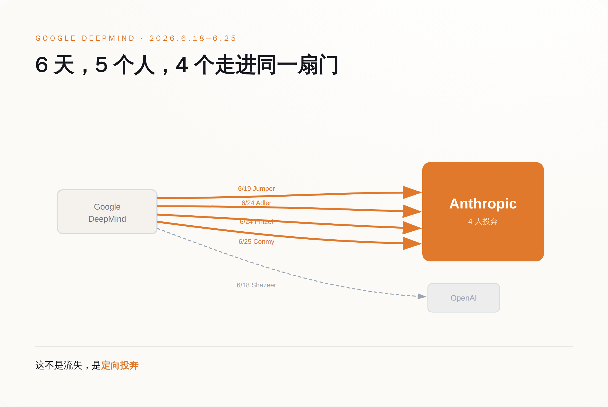
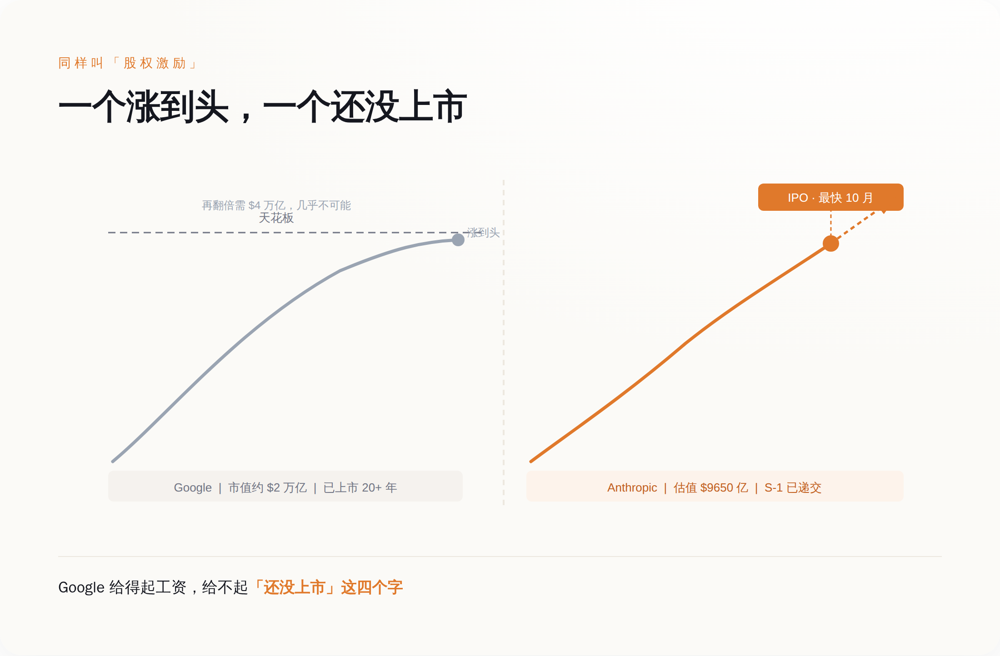

# Google 不缺钱，缺一张还没上市的股票

> **发布日期**：2026-06-27 | **分类**：AI 观察 · 行业观察

## 导语

兄弟们，先看一组数字。

2026 年 6 月 18 日到 6 月 25 日，七天，Google 走了 5 个顶级 AI 研究员。其中 4 个，去了同一家公司——Anthropic。

6 月 22 日，市场给这事结了第一次账：Alphabet 单日跌了约 6%，市值蒸发约 **2250 亿美元**。一周算下来，蒸发约 2700 亿。

同一周，Google DeepMind 的老大 Demis Hassabis 在戛纳的台上说：我们在顶尖人才争夺里，赢得了自己应得的那份，我们的研究团队是所有实验室里最大、最广的。

一边是 4 个人用脚投票投奔同一个对手，一边是 CEO 站台说一切健康。

这两件事不矛盾。它们说的其实是同一件事——

Google 缺的不是钱，也不是人，更不是算力。它缺的，是一张**还没上市**的股票。

---

## 4 个人，同一周，去了同一家公司

先把事实钉死，不然容易被人说我在拱火。

**6 月 18 日**，Noam Shazeer 离开 Google，去 OpenAI。这人是 2017 年那篇《Attention Is All You Need》的作者之一，Transformer 的爹之一，在 Google 是工程副总裁，联合带 Gemini。2024 年 Google 花了大约 27 亿美元，才把他从他自己创办的 Character.AI 买回来。买回来不到两年，走了。

**6 月 19 日**，第二天，John Jumper 离开 Google，去 Anthropic。他是 AlphaFold 的核心作者，2024 年跟 Hassabis 一起拿了诺贝尔化学奖。注意，是跟现任老板一起拿的奖，转头去了对家。

如果到这里你觉得“就走俩明星，至于吗”，那是因为故事还没讲完。

**6 月 24 日到 25 日**，又有三个人陆续被曝出走，无一例外，全去 Anthropic。一个做 Google 的 AI 编程工具，一个做预训练，还有一个是 Gemini 2.5 的贡献者、做 AI 安全——最后这位干脆自己在 X 上发帖认领了。

数一下。5 个人，7 天，4 个去了 Anthropic，1 个去了 OpenAI。

这就不是“人才流失”了。人才流失是水漏了，四面八方往下渗。这是 4 个人朝着同一个方向，排着队，往同一个门里走。

定向的。

*6 天 5 人，4 个流向同一家公司 Anthropic——不是四散流失，是定向投奔。*

---

## Google 给的工资，大概率是全行业最高的

讲到这儿，正常人的第一反应是：肯定是 Google 给少了呗，被人加钱挖走了。

这个反应，错得很彻底。

Google 缺钱吗？2024 年它光是为了把 Shazeer 一个人买回来，就付了约 27 亿美元的技术授权费。2026 年，Alphabet 计划的 AI 资本开支是大约 1900 亿美元——这个数字比绝大多数国家一年的 GDP 都高。

Google 缺算力吗？它有自研的 TPU，有全球最深的数据中心家底。Hassabis 在戛纳那番话里专门点了一句：我们的研究团队是所有实验室里**最大、最广的**。这话是凡尔赛，但也是事实。

Google 缺平台、缺品牌、缺顶级问题吗？都不缺。AlphaFold 拿诺奖是在这儿拿的，Transformer 是在这儿造的，全世界最聪明的一批脑子，本来就长在这棵树上。

所以你看，钱、算力、平台、声望，这四样 Google 一样不缺，甚至样样领先。

可它还是在一周里，眼睁睁看着 4 个人朝同一个对手走。

于是只剩一个解释：如果一家公司什么都给得起，人还是要走，那它一定有一样东西，无论花多少钱都给不出来。

---

## 它缺的那张牌，叫“还没上市”

我们来看看那 4 个人奔过去的 Anthropic，手里到底攥着什么。

2026 年 5 月 28 日，Anthropic 官宣完成 Series H 融资：一轮融了 **650 亿美元**，投后估值 **9650 亿美元**，红杉等机构领投。官方说，年化收入跑道（run-rate revenue）已经越过 **470 亿美元**。

6 月 1 日，Anthropic 秘密递交了 IPO 申请（S-1），目标是 2026 年秋天、最快 10 月在纳斯达克上市。它的老对手 OpenAI，估值约 8520 亿美元，也在同一条队里排着。

现在把两边摆一起看。

你去 Google，拿到的是一家市值约 2 万亿美元、已经上市二十多年的公司的股票。这股票好不好？好，稳，年年分红，但它的天花板就在那儿——它要再翻一倍，得变成 4 万亿美元的公司，这事不是不可能，是这辈子大概率轮不到因为你加班加出来。

你去 Anthropic，拿到的是一家 9650 亿美元、**下个月就要上市**的公司的、还没上市的股权。就算按现在这个估值进去，它从私募市场迈进公开市场、再带着 470 亿美元的年化收入往上长的空间，也比一只早被市场磨平了预期的成熟股要厚——更何况越早进去，那张纸越值钱，先到的人吃的就是这一口。

这两样东西，名字都叫“股权激励”，但根本不是一个物种。

一个是已经涨到头的钱，一个是还没上市、还能翻倍的票。

*同叫“股权激励”，一个已涨到天花板，一个还卡在上市前最陡的那一跳。*

**Google 能开出全行业最高的工资，唯独开不出“还没上市”这四个字。**

而这四个字，恰恰是一个顶级研究员在 2026 年最想要的东西。因为他清楚，模型这东西迟早趋同，benchmark 你追我赶，真正一次性、不可逆、改变人生量级的财富机会，就卡在某家公司“从未上市到上市”的那一下。错过了，就没了。

---

## 这是一场上市公司在规则上就打不了的仗

你可能会说：那 Google 也去发期权啊，多发点不就行了？

发不了。因为期权的价值，来自“还没上市”这个状态本身。Google 二十多年前就把这个状态用掉了。它现在能给你的，是一家成熟公司的成熟股票——稳定、可预期、没有那一跳。它越成功、越大、越稳，那一跳就越不可能再来。

这就是反常识的地方：**让 Google 留不住人的，恰恰是它“已经成功”这件事。**

当然，得给反方留位置。Hassabis 在戛纳的反驳不是没道理：单个模型的迭代是系统工程，不是哪一个研究员拍脑袋决定的，走几个人，Gemini 明天不会崩。Gemini 的市场份额这一年确实从个位数涨到了 27% 以上，产品没掉链子。市场那 2250 亿美元的单日蒸发里，多少是基本面，多少是情绪，这事谁也说不清——不同口径给的数字本身就从 2250 亿到 2700 亿不等，本来就带着市场的过激反应。反过来，对家那 9650 亿美元的估值你也大可以说是泡沫，赌它的人未必都能全身而退。

所以我不说“走了几个人 Google 就完了”，那是蠢话。

我说的是，这一周像一次压力测试，测出了一个 Google 花多少钱都补不上的结构性漏洞：它能在工资单上赢，却在“未上市股权”这张牌上，连牌桌都上不了。

这事什么时候算我错？很简单：等 Anthropic 和 OpenAI 真上了市，期权红利锁定、那一跳兑现完了，如果到时候人才不再单向往外跑，甚至开始回流 Google，那就说明我把“上市与否”看得太重了。这个，我们 12 到 18 个月后回来对账。

但在那之前，如果你最近也在看 offer，记住一件事：别光盯着工资数字谁高。去看那家公司的股票——它是已经涨到头了，还是，还没上市。

能开出最高工资的公司，往往恰恰开不出最值钱的那张纸。

## 数据来源

- [Anthropic raises $65B in Series H funding at $965B post-money valuation](https://www.anthropic.com/news/series-h)
- [Anthropic on X：Series H $65B / $965B 估值公告](https://x.com/AnthropicAI/status/2060061347522433422)
- [Anthropic confidentially files for IPO at $965 billion valuation — Fortune](https://fortune.com/2026/06/01/anthropic-confidentially-files-ipo-965-billion-valuation/)
- [Anthropic raises $65 billion, nears $1T valuation ahead of IPO — TechCrunch](https://techcrunch.com/2026/05/28/anthropic-raises-65-billion-nears-1t-valuation-ahead-of-ipo/)
- [AI researchers continue to leave Google for its rivals — TechCrunch](https://techcrunch.com/2026/06/24/ai-researchers-continue-to-leave-google-for-its-rivals/)
- [As top talent leaves Google DeepMind, some question if the lab can remain at the forefront — Fortune](https://fortune.com/2026/06/23/google-deepmind-ai-researcher-departures-raise-doubts-about-ability-to-win-the-ai-race-shazeer-jumper-eye-on-ai/)
- [Demis Hassabis says Google's still winning AI talent — Semafor](https://www.semafor.com/article/06/23/2026/deepmind-chief-demis-hassabis-says-googles-still-winning-ai-talent)
- [Alphabet sees $225 billion market cap wipeout — Morningstar/MarketWatch](https://www.morningstar.com/news/marketwatch/20260622213/alphabet-sees-225-billion-market-cap-wipeout)
- [Google Loses Four Researchers to Anthropic as Alphabet Sheds $270 Billion](https://easternherald.com/2026/06/26/google-deepmind-anthropic-ai-talent-exodus-alphabet/)
