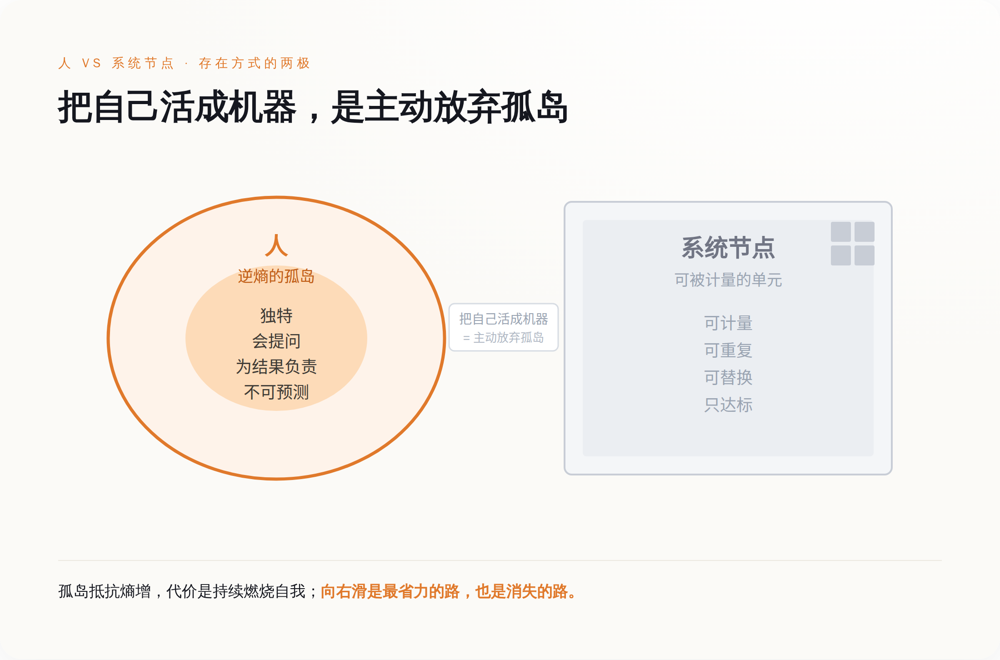
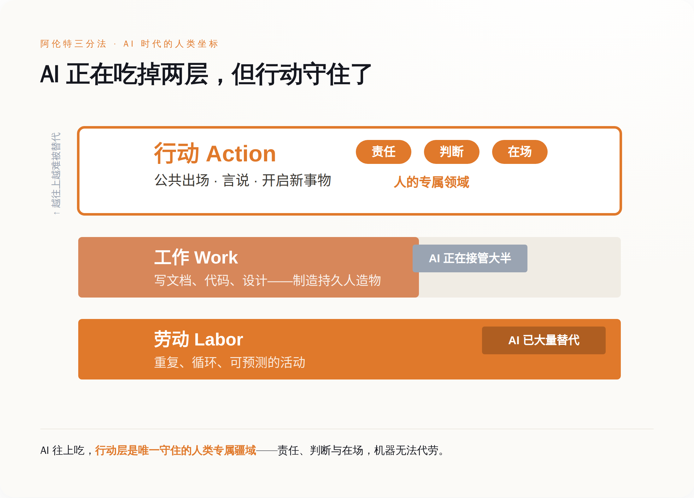

# 人有人的用处：AI 不会取代你，但你可能把自己活成一台更差的机器

> **发布日期**：2026-06-27 | **分类**：科技人文

## 导语

1950 年，控制论之父诺伯特·维纳写了一本书，书名叫《人有人的用处》。七十多年来，大多数人把它读成了一本"人机和平相处指南"。这是个天大的误会。维纳真正害怕的，从来不是机器变得像人——他害怕的是，人会被组织和系统当成零件来使用，最后活得像机器。

今天我们都在问同一个问题：AI 会不会取代我？这个问题问错了。真正的危险不是你被一台更聪明的机器替换掉，而是你为了不被替换，亲手把自己改装成一台更差的机器。

---

## 一、维纳的预言，被我们倒着读了七十年

诺伯特·维纳（1894—1964）不是哲学家，是个数学家，麻省理工学院的教授，控制论这门学科的开创者。二战期间，他参与研发军用防空火控系统——要让高射炮自动预测飞机的轨迹并开火。正是在那段日子里，他第一次清楚地看到：人和机器可以被接进同一个反馈回路，变成一个统一的系统。

这个发现让他兴奋，也让他后怕。

兴奋的是，控制论给了人类一套全新的语言去理解生命。在维纳眼里，信息是核心。他有一句被反复引用的判断："信息就是信息，既不是物质也不是能量。"信息是秩序的度量，是熵的反面。而宇宙的大势是熵增——一切都在自发地走向混乱、无序、平均化。生命是什么？维纳给出的定义冷峻而漂亮：生命体是熵增汪洋里"代表有序的孤岛"。你活着，就是在逆着整个宇宙的混乱倾向，维持自己这个独特的、不断自我更新的模式。他甚至说，人不过是"永流不息的河水中的漩涡"——你不是一块固定的石头，你是一个过程，一个自我延续的模式。

后怕的是另一件事。维纳看到，同样一套反馈和控制的逻辑，一旦被权力拿去，就可以反过来把人变成系统里的一个零件。他在《人有人的用处》里写下了全书最锋利的一句话：

> 当人类被编织进一个组织，他们不是作为负责任的人被使用，而是被当作齿轮、杠杆和连杆——此时，他们的原材料是血肉之躯这一事实，并不会让情况有任何不同。

这句话是理解维纳的钥匙。他不反对机器，不反对自动化，他甚至预见到自动化会像"精确的奴隶劳动的经济等价物"那样冲击人类劳动者。他反对的是一种**使用人的方式**：把活生生的人，当成可以计量、可以调度、可以随时替换的功能单元。

所以"The Human Use of Human Beings"这个书名，本身是个三层的双关。第一层是冷的：人类如何"使用"人类。第二层是问句：怎样才算用得合乎人性。第三层才是维纳真正想说的：人应当发挥**人本来的用处**——不是去做机器能做的事，而是去做只有人才能做的事。

七十年后，我们把这本书的封面认成了"如何和机器人做朋友"。维纳在书里画的那条警戒线，我们几乎没看见。

---

## 二、人人都怕被取代，但真正发生的是另一件事

先把焦虑摆到台面上，因为它是真的。

这一轮生成式 AI 对白领的冲击，不是炒作。麦肯锡 2025 年的研究估算，以当前技术，AI 已经可以自动化大约 57% 的美国工作"时间"——注意，是工作时间，不是岗位。高盛估计全球约有 3 亿个全职岗位会受到冲击，仅美国就有约 1100 万工人面临直接置换。最刺眼的是入门级岗位：22 到 25 岁的软件开发者，就业率较 2022 年的峰值下跌了近 20%；在 AI 高暴露的岗位里，这个年龄段的就业下滑约 16%。Anthropic 的 CEO 达里奥·阿莫迪在 2025 年公开预测，未来五年 AI 可能消灭约一半的白领入门级岗位。

数字够吓人了。但如果你只盯着数字，你会错过真正诡异的地方。

2026 年 1 月，《哈佛商业评论》发表了一项基于 1006 名全球高管的调查，结论是一记反转：眼下大量裁员的真实驱动力，不是"AI 的实际表现"，而是"AI 的潜力预期"。换句话说，很多人被裁掉，不是因为机器已经干得比他们好，而是因为老板**相信**机器将来会干得比他们好。人力资本的贬值，跑在了技术成熟的前面。恐慌先到，能力还没到，人已经被提前抛下了车。

更完整的故事藏在 Klarna 这家公司身上。2024 年，这家瑞典支付公司高调宣布，它的 AI 客服系统顶得上 700 名人工客服，这条新闻被全世界引用，成了"AI 取代人"的标志性案例。可到了 2025 年，剧情急转——Klarna 开始重新雇回人工客服，CEO 西米亚特科夫斯基改口说，人工服务会成为一种"VIP 体验"。

一条完整的弧线：AI 替代 → 发现问题 → 人工回归，而且是作为更贵的服务回归。

这条弧线告诉我们一件被焦虑掩盖的事实：在很多场景里，"人"并没有输给 AI 的功能，而是输给了对 AI 的想象。当想象退潮，人重新变得值钱——但只有一种人重新变得值钱，就是那些能提供 AI 给不了的东西的人。如果你回到工位上做的事，和那台被你恐惧的机器做的事一模一样，那 Klarna 的弧线就和你无关，你只是排在被替换名单上、靠前还是靠后的区别。

---

## 三、什么叫"把自己活成一台机器"

抽象的话说多了没用，看具体的人。

在亚马逊的仓库里，2025 年的多项报道和一篇发表在 ACM 的学术研究描绘了同一幅画面：工人的每一个动作都被算法追踪，生产配额由系统自动生成并实时调整，甚至存在一套"自动终止合同"的机制——指标不达标，系统直接触发解雇，不需要经过一个人的判断。研究者的措辞很准确：追踪系统"把工人及其劳动具体化为数字"，工人成了系统里一个可计量、可优化的变量。

外卖骑手的故事你更熟悉。平台用算法持续压缩送餐时间，参数越调越紧，骑手为了不被罚款、不掉单，只能闯红灯、逆行、与时间赛跑。系统设定参数，人肉执行，后果由骑手自己和马路上的所有人承担。

这就是维纳警告的那句话，七十年后的字面兑现：人被当作齿轮、杠杆和连杆来使用，而他是血肉之躯这件事，对系统来说毫无差别。

但你可能会想，这是蓝领的事，是底层的事，和坐在写字楼里的我有什么关系。

关系大了。同一套逻辑，正在以更体面的方式爬上白领的工位。绩效追踪在变得越来越精密，KPI 的颗粒度越切越细，"可量化产出"的压力越来越大。你的代码提交量、你的工单处理速度、你的文档产出数、你回复消息的及时率，都在被记录、被排名、被用来给你打分。当一个知识工作者的全部价值，被压缩成一组可以被仪表盘实时监控的数字时，他和亚马逊仓库里那个被算法计量的工人，结构上没有区别——区别只是他的椅子更舒服，灯光更好看。

回到维纳的定义：人是熵增汪洋里那座"逆熵的孤岛"，是一个独特的、会自我更新的模式。而一台机器、一个系统节点，恰恰相反——它要的是可预测、可重复、可替换，它最怕的就是"独特"。

所以"把自己活成机器"是什么意思？就是你主动放弃了那座孤岛，把自己塞进系统给你预留的那个节点形状里：不提问，只执行；不判断，只达标；不为结果负责，只为指标负责。你把自己身上那些不可计量、不可预测、不可替换的部分，一点点磨平，好让自己更顺滑地嵌进流程。你以为这样最安全。可一旦你把自己彻底节点化了，你就真的和一台机器在同一个赛道上竞争了——而那是一场你必输的比赛，因为机器更快、更便宜、不睡觉。

*图：人是熵增汪洋里的逆熵孤岛，机器节点是它的反面。把自己活成机器，就是从左侧主动滑向右侧——最省力，也最危险。*

---

## 四、先把一句话说清楚：这不是穷人的修养问题

写到这里，必须停下来，正面回应一个最该被回应的质疑。否则这篇文章就是不诚实的。

质疑是这样的：你说"别把自己活成机器"，可对那个被算法逼着闯红灯的外卖骑手、那个被系统自动解雇的仓库工人来说，这话太轻巧了。他们不是不想发挥人性，是系统根本不给他们这个余地。他们面对的问题不是"如何活出人的样子"，而是"如何在系统的压迫下活下去"。让他们去谈"人的尊严用处"，几乎是一种残忍。

这个质疑是对的。我接受它。

所以必须把话说死：对于被强制纳入算法管理的劳动者，"不要活成机器"不是一道个人修养题，而是一道**系统设计题**。当一家公司用自动解雇系统取代人的判断、用越压越紧的参数把人逼向违章，问题出在设计这套系统的人身上，不在被它碾压的人身上。把这个责任偷换成"你要保持人性、你要提升自己"，是把系统的罪过，转嫁给了系统的受害者。这种话术本身，就是另一种把人当零件的方式——零件坏了，怪零件不够努力。

但承认这一点，恰恰不能推出"那这篇文章只配讲给中产听"的结论。理由很简单：**算法管理不是底层的专利，它正在向上蔓延。** 今天用在仓库工人身上的那套追踪、计量、自动裁决的逻辑，明天就会用在程序员、设计师、运营、文案身上，只是换上更体面的名字，叫"效能管理""数字化绩效""AI 辅助评估"。维纳的警告之所以可怕，正因为它没有阶级边界——任何被纳入这种使用方式的人，无论他穿西装还是穿工服，都会被当成齿轮。

所以这一节的结论不是"穷人活该、富人清醒"，而是：**真正的抵抗有两层。** 在系统设计的层面，要追问那些设计规则的人——你凭什么用一套自动机器来裁决人的去留？在个人选择的层面，对于还握有一点余地的人——别主动地、不必要地、为了一点安全感就把自己往节点里塞。这两层缺一不可。只讲个人修养，是给系统打掩护；只讲系统批判，又会让每个具体的人觉得自己什么都做不了。维纳要的是两者都做。

---

## 五、阿伦特的那把刀：AI 能吃掉什么，吃不掉什么

光说"别活成机器"还不够，得回答一个硬问题：那"人的用处"到底是什么？凭什么说它不可替代？

这里需要一把更锋利的刀，来自汉娜·阿伦特。

阿伦特在 1958 年的《人的境况》里，把人的活动切成了三块，这个三分法到今天依然好用得惊人。第一块叫**劳动（labor）**，是维持生命的循环性活动——吃饭、清洁、重复的体力消耗，做完就消失，明天还得再做。第二块叫**工作（work）**，是制造持久人造物的活动——造一把椅子、写一份能反复使用的文档、建一栋房子，它在世界上留下了一件能用很久的东西。第三块，也是阿伦特最看重的，叫**行动（action）**：在公共空间里出场、言说、与他人发生真实的关系，并且开启某种全新的、不可预测的东西。

现在拿这把刀去切 AI，画面立刻清晰了。

AI 极其擅长 labor——一切重复的、循环的、有标准答案的活，它做得又快又便宜。AI 也越来越能干 work——它能写文档、能生成代码、能出设计稿、能起草合同，它正在大量接管"制造人造物"这件事。这两块，人确实在节节败退，且看不到反转。

*图：用阿伦特的三分法去切 AI——劳动几乎被吃光，工作被接管大半，唯有行动（责任、判断、在场）仍是人的专属疆域。*

但 action 是另一回事。阿伦特说，行动的前提是"复数性"——需要真实的他者在场，需要你以一个独一无二的人的身份，对另一个独一无二的人说话和负责。行动的本质是"开端"——是引入一个此前不存在、也无法从过去推算出来的新东西。这恰恰是一切机器在定义上做不到的：机器的本职就是可预测、可重复，而行动的本职是不可预测、是开始。

这不是玄学。把它翻译成日常，就是三样东西。

**第一是责任。** 凯文·凯利说过一句被低估的话：我们向雇主出售的，归根到底是责任和信任，这是 AI 永远无法提供的。一份合同 AI 能起草，但当它出错、当客户暴怒、当事情砸了，必须有一个人站出来说"这事我负责"——AI 没法负责，因为负责意味着承担后果，而它没有可被承担的东西。

**第二是判断，尤其是在没有标准答案时的判断。** 凯利还有一个精准的区分：AI 擅长"爬山"（hill climbing），在一个已经给定的框架里把目标优化到极致；而人的独特性在于"造山"（hill making），是去创造一个全新的问题、定义一座此前不存在的山。AI 能给你一百个答案，但"该问哪个问题""这件事到底值不值得做"，这个判断是人的。

**第三是真实的在场与开端。** 一句安慰，AI 可以生成得比你更流畅；但你知道屏幕对面坐着的是一个真的会因为你的处境而失眠的人，和你知道那只是一段被预测出来的文字，是两件不同的事。2025 年《心理学前沿》那篇讲"共情幻觉"的研究说得很清楚：AI 能识别悲伤，但不能感受悲伤；能生成安慰，但不能真正关心。差别在体验上正在变小，但在本体上从未消失。

这三样——责任、判断、在场——合起来，就是阿伦特说的 action，就是维纳说的"人本来的用处"。它们的共同点是：都无法被计量，都无法被预测，都无法被一个节点承担。也正因为如此，它们才是你这座"逆熵孤岛"真正的海岸线。

---

## 六、所以，人有人的用处

现在可以把话收回来了。

这一轮 AI 浪潮里，最流行的建议是："去学那些 AI 还学不会的技能。"这个建议听起来很对，其实是个陷阱。因为它把你重新拖回了那场你必输的功能竞赛——今天你学会一个 AI 不会的技能，明天它就会了，达里奥·阿莫迪说的窗口期，确实在变短。如果你的全部安全感建立在"我会一项机器暂时不会的功能"上，那你永远活在被追上的恐惧里，而且你迟早会被追上。

真正的出路不在功能那一侧，在主体性这一侧。不是去证明"我能做 AI 做不了的事"，而是守住"我不把自己活成一台更慢的 AI"。

这两者的区别，是这篇文章全部的重量。前者是一场关于能力的军备竞赛，你和机器比谁的功能多，你注定落败。后者是一个关于你想成为什么样的人的选择，在这件事上，机器根本没有入场资格——它没有"想成为"这回事。维纳说人是"自我延续的模式"，模式的意思是，它有方向、有取舍、会因为自己的选择而成为某个样子。一台机器没有方向，它只有参数。

所以"人有人的用处"这句话，最后落回它最朴素也最重的那层意思：人应当活出人本来的样子。具体到每天的工作里，它意味着一些很不起眼、却很要命的选择——

在该提问的时候提问，而不是闷头执行一个你明知有问题的指标；在该负责的时候站出来负责，而不是把判断推给"系统是这么算的""模型是这么建议的"；在面对一个真实的人时，给出真实的在场，而不是一段最优措辞；在所有人都用同一个 AI、生成同一种答案、活成同一个形状的时候，固执地保留你身上那些不可计量、不可预测、不可替换的部分——那不是低效，那是你之所以是你。

维纳在 1964 年、去世前不久写下一句话，像是专门留给我们这个时代的：

> 未来的世界，对那些指望机器奴隶把我们从思考中解放出来的人，几乎没有提供什么希望。它要求的，是最高度的诚实和智慧。

七十年过去，机器奴隶真的来了，比维纳想象的还聪明。而我们当中的很多人，正排着队，急切地想把"思考"这件最像人、也最累人的事，外包出去。维纳的警告还在原地：能把你从思考中解放出来的东西，也能顺手把你从"人"这个位置上解放出来。

AI 不会取代你。它没有这个义务，也没有这个意愿。能不能守住"人"这个位置，从头到尾，是你自己的事。

## 数据来源

- [The Human Use of Human Beings (Wikipedia)](https://en.wikipedia.org/wiki/The_Human_Use_of_Human_Beings)
- [Norbert Wiener on The Human Use of Human Beings (The Marginalian)](https://www.themarginalian.org/2018/06/15/the-human-use-of-human-beings-norbert-wiener/)
- [Norbert Wiener is more relevant than ever (Slate)](https://slate.com/technology/2019/02/norbert-wiener-cybernetics-human-use-artificial-intelligence.html)
- [Companies Are Laying Off Workers Because of AI's Potential, Not Its Performance (Harvard Business Review, 2026)](https://hbr.org/2026/01/companies-are-laying-off-workers-because-of-ais-potential-not-its-performance)
- [AI Job Displacement Statistics 2026 (DesignRush)](https://www.designrush.com/agency/ai-companies/trends/ai-job-displacement-statistics)
- [AI Job Displacement by Industry (Prof. Hung-Yi Chen)](https://www.hungyichen.com/ai-job-displacement-labor-market)
- [Amazon's algorithmic management of warehouse workers (The Register, 2025)](https://www.theregister.com/2025/03/18/amazon_algorithmic_worker_management/)
- [对话凯文·凯利：AI 时代人类的价值是什么（36氪）](https://36kr.com/p/3382982642973448)
