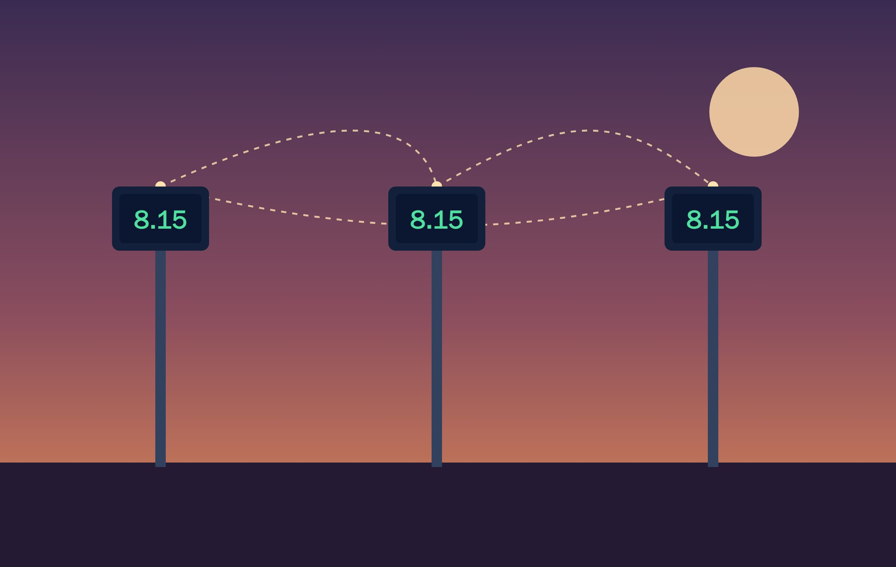
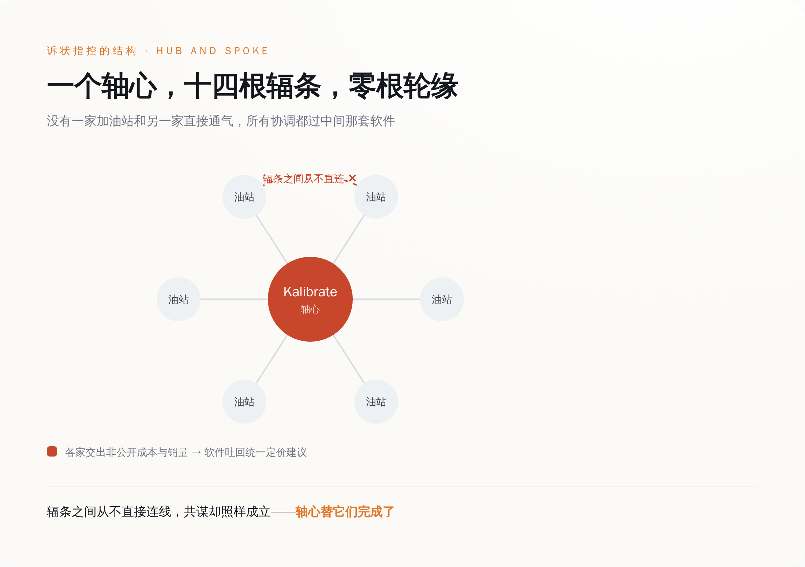
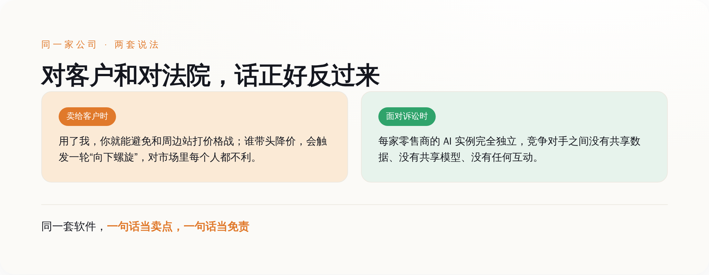
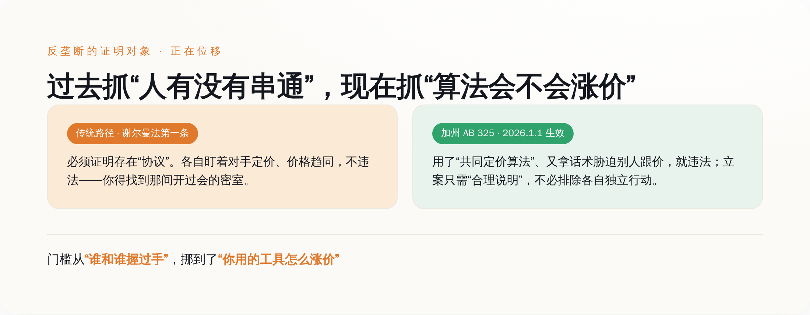

# 1700座加油站串通涨价，没有一个人开过会

> **发布日期**：2026-06-28 | **分类**：AI 观察 · 反垄断

## 导语

先说一件反常识的事。

加州东区联邦法院 6 月 22 日立案的这桩集体诉讼，被告席上塞了 14 家连锁——Marathon、BP、7-Eleven、沃尔玛、Circle K，外加一家你大概没听过的软件公司，Kalibrate。涉案的加油站超过 1700 座。按诉状里的算法，油价每加仑只要涨 1 美分，一年就从加州司机兜里多掏走 1.34 亿美元。

但整桩案子最吓人的地方，不是钱。

是从头到尾，没有一个人开过会。

没有密室，没有微信群，没有一封“哥几个把价格抬一抬”的邮件。把这些互为对手的加油站协调到一起、一起把价格往上顶的，是一套软件。人没动手，活干完了。

更骚的是，这事甚至不需要谁去挖证据。共谋的逻辑，厂商自己印在了营销材料里，当卖点推销。

这案子真正的看点，不是“又一个大公司用 AI 割韭菜”。是反垄断这门一百多年的老手艺，可能正在这里变天——它过去抓的是“谁和谁串通了”，现在开始抓“谁用了那个会涨价的算法”。

---

## 先把案子钉死，省得说我在拱火

讲这种事最容易被人说带节奏，所以先把事实摆桌上。

立案时间，2026 年 6 月 22 日，地点是加州东区联邦法院（萨克拉门托），案号 2:26-cv-02211。三名加州居民代表所有近年在被告门店加过油的消费者起诉。被告除了上面那串零售巨头，核心是那家叫 Kalibrate 的英国定价软件公司——它才是这案子的真主角。

诉状给 Kalibrate 的定性，原话是这么写的：它是“一个共谋的中枢神经系统，用来消灭加油站之间的零售价格竞争”（the central nervous system for a conspiracy to extinguish retail price competition among gas stations）。

中枢神经系统。这个词用得很准。

它的工作方式，诉状描述得很具体：各家加油站把自己的**非公开**成本和销量数据交给 Kalibrate，软件汇总分析，再给每一家吐回一个“最优定价建议”。诉状指控，Kalibrate 甚至会把竞争对手的非公开销量数据，展示给潜在客户看——你的同行卖了多少、底价多少，本该是商业机密，结果在这套系统里成了公共信息。

用了这套软件的加油站，诉状称，每加仑要比正常竞争状态贵 6 到 30 美分。

把结构拆开看就清楚了。中间一个软件轴心，外面十四根辐条连着各家门店，辐条之间不直接联系。每一家只是单独跟那个软件做了笔买卖，谁也没跟谁握过手，但价格整整齐齐地一起上去了。

*十四家互为对手的连锁，谁也没跟谁直接通气，协调全过中间那个软件——这就是诉状指控的轴辐结构。*

---

## 最骚的地方：共谋逻辑，是厂商自己印在宣传册上的

一般搞价格共谋，是要藏的。开会关手机，沟通用暗语，最怕白纸黑字。安达信当年帮安然销毁文件，销毁的就是这种东西。

Kalibrate 反过来。

诉状里抄进去一句它的营销话术，原文是：如果加油站带头降价，会触发“一轮向下螺旋，对这个市场里运营的每一个人都有负面影响”（a downward spiral and has negative implications for everyone operating in that market）。别降价啊兄弟，你一降，大家都得跟着降，谁都赚不到钱了——咱们一起把价端着，多好。

这话本身没毛病，毛病在它的位置。这句“别降价、要不大家都没钱赚”，如果是两个老板在饭局上说的，叫串通，是要被罚的。Kalibrate 把它做成了产品功能，写进宣传材料，当卖点卖。共谋的动机、共谋的逻辑、共谋的后果，全被它打包成了一个 SaaS 订阅服务。你不需要去想怎么跟对手协调，软件替你想好了，还告诉你这么干的好处。

诉状律师等于没费什么劲。证据不用挖，厂商自己印出来了，照抄进诉状当呈堂证供就行。

Kalibrate 的辩词才是真正魔幻的部分。它在官网上说，每一家零售商的 AI 实例都是“完全独立的，竞争对手之间没有共享数据、没有共享模型、也没有任何互动”（each retailer's AI instance entirely separate, with no shared data or models, and no interaction between competitors）。

把这两句话摆一起看，画面就很魔幻了。

*同一家公司，卖软件时承诺帮你避开价格战，进了法院又说各家完全独立——这套自相矛盾，正是本案的核心事实争点。*

到底有没有把 A 家的非公开数据拿去算 B 家的价格，这是整桩官司的命门。如果发现阶段查实了，被告基本没得跑；如果查不到，那就只是各家各自优化，案子大概率会黄。两边的说法此刻是直接对撞的。

---

## 真正变天的不是 AI，是“共谋”这两个字的定义

到这儿你可能觉得，不就是个证据问题吗，查呗。

不止。这案子底下压着一个更大的东西，那才是它值得被认真对待的原因。

传统反垄断抓共谋，靠的是美国《谢尔曼法》第一条，核心就两个字：协议（agreement）。你得证明这些公司之间存在某种“合意”——可以是合同，可以是口头约定，甚至可以是心照不宣的默契，但你得拿出它存在的证据。光是“大家价格都差不多”不行。这在法律上叫“有意识的平行行为”，寡头市场里本来就这样，你卖 8 块我也不会傻到卖 6 块，这不违法。

这就是算法共谋最阴的地方。

软件不开会。十四家公司各自买了同一个软件，各自把数据喂进去，各自照着建议定价，价格神奇地一起涨了。你去法庭上指控他们“串通”，被告两手一摊：我们谁也没联系过谁，我们只是各自用了个挺好用的工具，市场充分竞争的结果就是大家算出来的最优价差不多，这怎么能叫共谋？

过去几十年，这个反驳基本是无解的。证明不了“协议”，案子就立不住。算法成了共谋的完美马甲——把人从犯罪现场抹掉了，效果一点不少。

加州的 AB 325，就是冲着这个死结来的。这部法 2026 年 1 月 1 日生效，是对加州《卡特莱特法》的修订，专门加了几条针对算法的。

第一刀，它造了个新概念，叫“共同定价算法”（common pricing algorithm），定义写得很死：任何方法，包括计算机、软件或其他技术，只要被两个或以上的人使用、且使用了竞争对手的数据来推荐、对齐、稳定、设定或以其他方式影响价格——就算。

第二刀，新增的 16729(b) 条直接规定：任何人使用或分发一个共同定价算法、并以此**胁迫**（coerce）他人采纳算法推荐的价格，违法。Kalibrate 那句“你敢降价就触发向下螺旋”的话术，对得上不对得上“胁迫”，法庭说了算，但立法者画的靶子，明显就是这种东西。

第三刀最狠，藏在举证门槛里。新法把原告立案的标准，从“必须排除被告各自独立行动的可能性”，降到了“合理说明存在共谋即可”。这一条等于把前面说的那个“无解死结”给松了绑——你不用再去证明那间不存在的密室，只要能讲清楚“他们用了同一个会涨价的算法”，案子就能往下走。

把三刀连起来看，反垄断的准星挪位置了。

*抓的东西变了：从“证明人有没有串通”，挪到“审查工具是怎么定价的”——这才是 Kalibrate 案真正的分量所在。*

**过去反垄断盯的是人的行为，现在加州开始盯工具和后果。**这句话听着抽象，落到地上就是一件很具体的事：你不用再抓住那只握手的手，你只要证明他们摸的是同一张会涨价的牌。

---

## 这不是第一次，RealPage 已经趟过一遍——但结局没那么解气

觉得这套打法新鲜的，可以先去看看 RealPage。

2024 年 8 月，美国司法部带着八个州的总检察长，起诉了一家叫 RealPage 的公司。它干的事和 Kalibrate 几乎是一个模子：给房东们提供租金定价算法，各家房东把自己的非公开租约数据喂进去，软件再吐回“建议租金”。司法部的诉状用的正是“轴辐共谋”这个词——RealPage 是轴，房东是辐，每个房东都和 RealPage 签了一份纵向协议，明知道自己的私密数据会通过算法的定价建议流向竞争对手，还是选择把数据交了上去。横向的共谋，靠一堆纵向协议拼了出来。

这套理论框架，就是 Kalibrate 案的爹。加油站案几乎是把房租案的剧本，换了个行业重演一遍。

但 RealPage 的结局，得给所有觉得“这下大公司要完蛋”的人泼盆冷水。

2025 年 11 月 24 日，司法部和 RealPage 达成和解。条款是有的：禁止它在实时运算里使用非公开的竞争对手数据，用来训练模型的数据必须是 12 个月以上的历史数据。这等于把那个“轴辐机制”的核心给拆了——你不能再拿 A 房东的底牌去算 B 房东的房租。

代价呢？RealPage 不认任何责任，不交一分钱罚款。

读懂这个结局，才读懂 Kalibrate 案的天花板在哪。算法定价这件事本身，到今天为止，监管并没有把它定成“天生违法”。被抓住的公司，大概率的下场是：改架构、装个外部监察员、承诺以后不这么干，然后该干嘛干嘛。没有人进监狱，多收的那些钱也未必吐得出来。

所以别指望 Kalibrate 案能让油价明天就跌回去。它更像一场确权——确认加州这套新打法，到底能不能在法庭上站住。

---

## 够得着的先抓，够不着的，得留着

把话说圆，也得把没解决的留在桌上。

AB 325 这套组合拳，抓的是“工具 + 胁迫”。它能逮住 Kalibrate 这种把共谋逻辑写进产品、还拿话术逼你跟价的。但有一种更难缠的东西，它逮不到：算法自己学会了“跟涨不跟跌”。

设想一种情形：没有任何人给软件下过“维持高价”的指令，软件只是被扔进市场里反复试错，慢慢自己摸索出一条规律——降价会引来报复，涨价大家会默契跟上，于是它学会了永远不带头降价。这里没有协议，没有胁迫，连一句能被抄进诉状的营销话术都没有。这种纯粹由机器自主学习产生的默契，现有的法，包括加州这部新的，基本还是抓瞎。

加州没假装解决了这个终极难题。它做的是另一件更务实的事：先把够得着的那层法律化。能抓住的先抓，抓不住的，那条尾巴留在那儿，等下一部法、或者下一个判例。

这也给了被告反扑的空间。他们几乎一定会去打 AB 325 本身——说它把举证门槛降得太低、违反正当程序，说州法管了本该联邦管的事、被联邦反垄断法优先排除掉。这种宪法层面的拉锯，一打就是两三年。所以这案子什么时候算我判断错了，有个很具体的检验点：如果最后法院认定 AB 325 那条降门槛的规定站不住、必须回到老路上去证明传统“协议”，那“反垄断变天”这个说法就是我夸大了。这个我们过两三年回来对账。

但在那之前，这案子跟你的关系，比“加州油价”要近得多。

把“加油站”三个字换成任何一个高频定价的行业，剧本立刻就熟悉了：租房有 RealPage，酒店、机票、网约车、电商的动态定价，背后都站着第三方的“智能定价”或“收益管理”系统。它们的卖点话术，和 Kalibrate 那句“别降价”往往是同一个味道——帮你优化价格，帮你避免恶性竞争，帮你把利润端住。

所以如果你在一家用着这类系统的公司，别再只盯着“这工具能不能帮我多赚钱”。换两个问题问它：

它算我的价，吃没吃竞争对手的非公开数据？它有没有用某种方式，拦着我降价？

这两个问题的答案，决定的不是你赚多少，而是哪天一纸诉状递上来，你坐在原告席还是被告席。

毕竟，这案子已经把一件事讲明白了：以后想抓共谋的人，可能真的不用再去找那间开会的密室了。他们只要去查，你们是不是在用同一个会涨价的算法。

## 数据来源

- [Kalibrate 集体诉讼诉状原文 PDF（2026-06-22, E.D. Cal. 2:26-cv-02211）](https://www.courthousenews.com/wp-content/uploads/2026/06/kalibrate-class-action-california.pdf)
- [加州 AB 325 法案正文 — California Legislative Information](https://leginfo.legislature.ca.gov/faces/billTextClient.xhtml?bill_id=202520260AB325)
- [加州 AB 325 法案条文 — LegiScan](https://legiscan.com/CA/text/AB325/id/3272268)
- [Kalibrate 官网：Fuel Pricing Optimization AI（厂商自述）](https://kalibrate.com/kalibrate-fuel-pricing-software/fuel-pricing-optimization-ai/)
- [DOJ 起诉 RealPage 算法定价案新闻稿（2024-08-23）](https://www.justice.gov/opa/pr/justice-department-sues-realpage-algorithmic-pricing-scheme-harms-millions-american-renters)
- [DOJ 要求 RealPage 停止共享竞争敏感信息（和解条款，2025-11-24）](https://www.justice.gov/opa/pr/justice-department-requires-realpage-end-sharing-competitively-sensitive-information-and)
- [Gas station owners have found a use case for AI: colluding to fix prices — Fortune](https://fortune.com/2026/06/25/kalibrate-ai-gas-price-fixing-california-marathon-bp/)
- [Gas stations are using AI to inflate prices, new lawsuit alleges — Popular Information](https://popular.info/p/gas-stations-are-using-ai-to-inflate)
