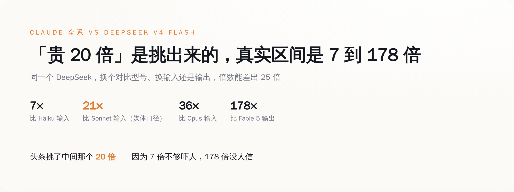
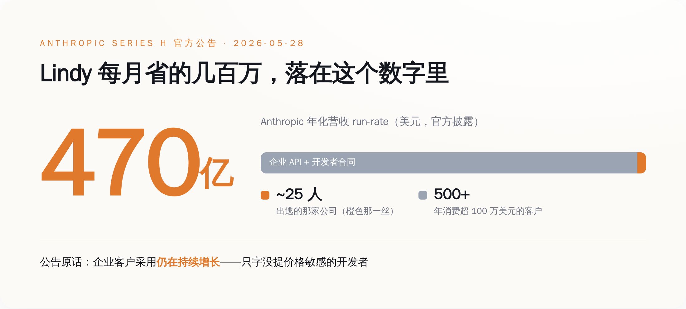
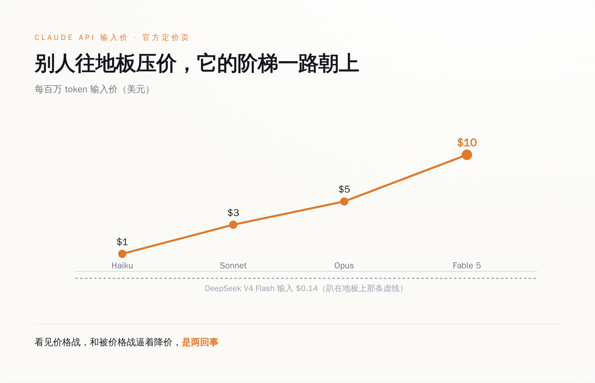
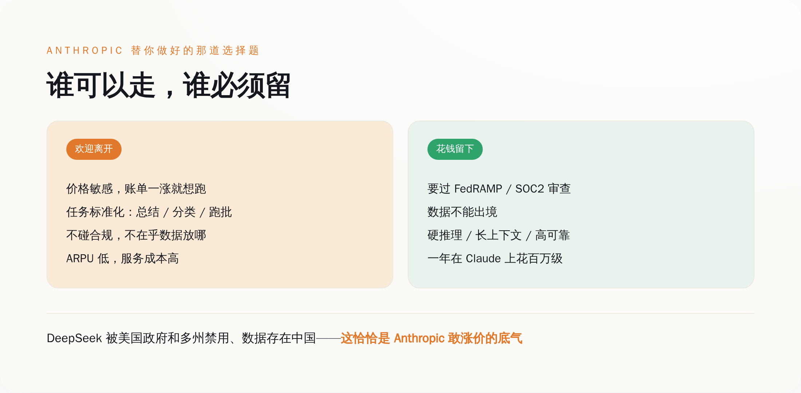

# 全网都说 Claude 贵 20 倍，Anthropic 转头把价格又抬了一倍

> **发布日期**：2026-06-29 | **分类**：AI 观察 · 商业拆解

## 导语

这两天 AI 圈最热闹的一条新闻，是一家叫 Lindy 的公司「出逃」了。

25 个人的小破公司，CEO 跑去 CNBC 说，我们把 100% 的流量从 Claude 切到了 DeepSeek，这是「关乎生死的决定」（a matter of survival for the business），一个月能省好几百万美元。

媒体一拥而上：开发者用脚投票了，DeepSeek 便宜 20 倍，Anthropic 的护城河塌了，再不降价就要完。

然后我打开了 Anthropic 自己的官网定价页。

它最新、最贵的那档模型 Fable 5，定价是每百万 token 输入 10 美元、输出 50 美元——**正好是被你们骂贵的 Opus 的两倍。**

一家据说被价格战打得快不行的公司，在所有人喊它贵的时候，把旗舰又涨了一倍价。

被打的人不是这个反应。

---

## "贵 20 倍"这个数字，是怎么被算出来的

先说那个满天飞的「20 倍」。

我不引用任何分析师，也不引用任何「业内人士」。我只用两个东西：Anthropic 挂在官网的定价页，和 DeepSeek 公布的 V4 价格。一手的，谁都能去点开看。

Claude 这边，一共四档，从便宜到贵：Haiku 4.5（输入 1 美元 / 输出 5 美元），Sonnet 4.6（3 / 15），Opus 4.8（5 / 25），Fable 5（10 / 50），单位都是每百万 token。

DeepSeek 这边，最便宜的 V4 Flash，输入 0.14 美元，输出 0.28 美元。

现在我们来做小学算术。同样是输入价，你拿 DeepSeek 去比谁？

比 Haiku，1 除以 0.14，是 7 倍。
比 Sonnet，是 21 倍。
比 Opus，是 36 倍。
比 Fable 5，是 71 倍。

如果你比的是输出价，Fable 5 的 50 除以 0.28，是 **178 倍。**

*同一句「便宜 N 倍」，换个型号、换输入还是输出，就能差出 25 倍——「20 倍」只是被挑出来的那一个*

所以「20 倍」是哪来的？是拿 Sonnet 的输入价去比的，21 倍，四舍五入喊成 20。

（严谨一点：Lindy 到底切去跑哪一档，公开报道里没说清楚，所以这个 20 倍是媒体最流通的口径，不是 Lindy 的真实账单。但这恰恰是重点——连被比的是哪个型号都没定下来，这个数就敢满天飞。）

挑这个数，不是因为它最真实，是因为它最顺口（笑）。7 倍说出去没人转，178 倍说出去没人信，21 倍刚刚好，又唬人又像那么回事。

更别说，这个对比里还藏了一刀没人替你算：缓存。

简单说，同一段 prompt 你反复发，Claude 第二次之后自动给你打折。Opus 的输入价缓存命中后直接砍到 0.5 美元，再开个批处理又是五折。真实账单里，很多场景的差距，远没有定价单上那么吓人。

「便宜 20 倍」这句话本身没错。错的是，它假装这是一个确定的数字，而不是一道你可以算出任意答案的应用题。

---

## 那个出逃的 25 人公司，Anthropic 根本没在看

回到 Lindy。

它的故事是真的，CEO 说省几百万也是真的。一个 25 人的创业公司，AI 调用成本能压到每月省几百万美元，对它来说这确实是生死。我完全理解他为什么切。

问题是，Anthropic 在不在乎。

5 月 28 日，Anthropic 发了一份官方公告，宣布完成 Series H 融资：拿了 650 亿美元，估值 9650 亿美元，逼近一万亿。同一份公告里，它顺手披露了一个数字——年化营收 run-rate 这个月初刚跨过 **470 亿美元。**

470 亿是什么概念。Lindy 那种公司，省到极致，一年也就给 Anthropic 贡献几千万美元的账单，还是往多了说。它整个切走，落到 470 亿的盘子里，是小数点后面的事。

*Anthropic 官方公告里，企业客户采用「仍在持续增长」，500 多家年消费超百万——出逃的那家 25 人公司，根本不在这张表上*

这份公告我反复读了几遍，最有意思的是它没说什么。

它说企业客户采用「持续增长」，说有 30 万家企业客户，说有 500 多家客户一年在它身上花超过 100 万美元。它通篇在炫耀的，是越来越多的大客户、越来越贵的合同。

它一个字都没提价格敏感的开发者。没提要不要降价，没提怎么留住中小客户，没提 DeepSeek。

一家公司在融资公告里着重夸什么，约等于它想要什么。Anthropic 想要的，写得明明白白——是 500 家一年花百万的金主，不是 5000 家一个月省百万的 Lindy。

Lindy 觉得自己在「抛弃 Claude」。但在 Anthropic 的财务报表里，这种抛弃连一个像样的扰动都算不上。

---

## 价格战打到最凶的时候，它把旗舰涨了一倍

现在我们把两件事并在一起看。

一边，是 DeepSeek 把价格压到 Claude 的几十分之一，是 Lindy 这样的公司在出逃，是全网在喊「再不降价就完了」。

另一边，是 Anthropic 推出 Fable 5，定价每百万 token 输入 10 美元、输出 50 美元，是 Opus 的整整两倍。它全系四档价格，在价格战最凶的这半年里，没有任何一档跟着 DeepSeek 往下调过。

*DeepSeek 把价格压到地板的同时，Claude 的价格阶梯一路朝上，新旗舰 Fable 5 是 Opus 的两倍——没有任何一档下调*

正常逻辑里，一家被低价对手围攻的公司，要么降价跟，要么哭着喊护城河。Anthropic 两样都没干。它在涨价。

有人会说，Fable 5 涨价是因为它更强、训练成本更高，这是正常的旗舰定价，你别过度解读。

这话单看 Fable 5 一个点，成立。但你把方向连起来看就不成立了：在价格被打到地板的半年里，Anthropic 全系没有一档下调，新旗舰还翻倍，融资公告里通篇夸的是大客户和百万合同——这不是某一个孤立的定价动作，这是一个一以贯之的方向。

这个方向只有一个解释：它压根没想在便宜这个维度上跟 DeepSeek 打。

你以为它在价格战里挨打，其实它根本没进这个战场。

要是它真被打疼了，账面会先露馅——大客户掉单、合同砍价、营收增速下台阶。可它公告里摆出来的数是反的：470 亿还在涨，500 家百万级大客户还在加。一个真在失血的公司，体检报告不长这样。

它站在另一个战场。那个战场里，贵不是缺点，是身份。

---

## 被「欢迎离开」的客户，和被留下的客户

所以所谓「出逃」，逃的到底是什么人。

逃的是价格敏感的人，是拿模型跑总结、跑分类、跑标准化批处理的人，是任务简单到 Haiku 都嫌杀鸡用牛刀、账单一涨就想换供应商的人。

这批人走了，对 Anthropic 来说不是失血，是体检。它们贡献的营收薄、要求的服务多、对价格还最敏感——在任何一个 SaaS 公司的内部测算里，这都是 ARPU 最低、最该被「优化」掉的那一档客户。它们走了，Anthropic 的客户结构反而更干净，人均更值钱。

那留下来的是谁。

*价格敏感、任务标准化的客户被「欢迎离开」；要过合规、数据不能出境、跑硬任务的客户花钱留下——Anthropic 早就替你分好了类*

留下来的，是要过 FedRAMP、过 SOC2 审查的企业，是数据一个字节都不能出境的金融和医疗，是任务硬到便宜模型一上就出错、宁可多花钱也要稳的团队。

对这批客户，DeepSeek 不是「便宜的选项」，是「不能用的选项」。

这不是我吹的。美国政府机构和十几个州已经明令禁止在公务设备上用 DeepSeek，它的隐私政策白纸黑字写着数据存在中国服务器，安全公司 Wiz 还扒出过它一个没加密的数据库，泄露了上百万条日志，里面有聊天记录和 API 密钥。

对一个要过合规审查的企业采购来说，这些不是减分项，是一票否决项。便宜几十倍也没用，因为这道门它根本进不来。

所以 Anthropic 的底气，从来不是「我比 DeepSeek 便宜」——它便宜不过，也不想便宜。它的底气是「我能进的那道门，DeepSeek 进不来」。在那道门后面，它想标多少价，标多少价。

---

## 一刀

把这事捋直了说。

媒体的叙事是：开发者在抛弃 Claude，Anthropic 被价格战打得快不行了，再不降价就要完。

Anthropic 自己摆出来的两张纸是：营收 470 亿还在涨，大客户 500 家还在加，新旗舰定价翻倍，全系一档没降。

这两个故事不可能同时为真。要么是 Anthropic 在用一份假公告骗投资人，要么是媒体把一家 25 人公司的账单焦虑，包装成了行业的塌方。

我赌后者。

**Lindy 们省下的每月几百万，是真的；但它落进 470 亿的盘子里，连个响都听不见，也是真的。**

这个判断不是耍嘴皮子的事后诸葛，它能被证伪：要是接下来半年，Anthropic 真把 Sonnet 砍到一美元以下去硬刚 DeepSeek，那就是我看走眼了，它确实是被逼降价的。在那之前，账摆在这儿。

下次你再看到「某某出逃 DeepSeek 省了多少钱」的标题，先别急着替 Anthropic 着急。先低头算算自己：你是拿 Opus 在跑 Haiku 就能干的活，然后回头怪模型贵；还是你真的卡在了便宜模型过不去的那道合规线、那道任务难度线上。

如果是前者，你早该走了，Anthropic 巴不得你走。如果是后者，你压根没得选，跑去 DeepSeek 才是真的拿业务赌命。

**你以为你在抛弃它。其实从它官网那张定价页开始，它就在给你发好人卡了。**

## 数据来源

- [Anthropic 官方 API 定价页](https://platform.claude.com/docs/en/about-claude/pricing) — Claude 全系（Haiku/Sonnet/Opus/Fable 5）每百万 token 输入输出价、缓存价（已直接核实）
- [Anthropic Series H 融资官方公告](https://www.anthropic.com/news/series-h) — 650 亿融资、9650 亿估值、470 亿 run-rate、30 万企业客户、500+ 客户年消费超百万、"企业采用持续增长"原话（已直接核实）
- [DeepSeek 官方 API 定价文档](https://api-docs.deepseek.com/quick_start/pricing) — V4 Flash 输入 0.14 / 输出 0.28 美元（官网对自动抓取返回 403，价格为多源搜索结果交叉一致，未从官方页面逐字核实）
- [CNBC：用户从「堆 token」转向效率（2026-06-26）](https://www.cnbc.com/2026/06/26/openai-anthropic-new-ai-spending-reality-as-users-shift-to-efficiency.html) — Lindy 迁移与 CEO「关乎生死」表态首发（原文 403，引述经多家转载交叉一致）
- [DigitalPolicyAlert：各国对 DeepSeek 的调查与限制](https://digitalpolicyalert.org/threads/investigations-and-restrictions-on-deepseek) — 美国政府/各州禁用、海外监管动作汇总
- [SecurityScorecard：DeepSeek 安全问题与漏洞分析](https://securityscorecard.com/blog/what-you-need-to-know-about-deepseek-security-issues-and-vulnerabilities/) — Wiz 发现的未加密数据库、数据驻留中国等
