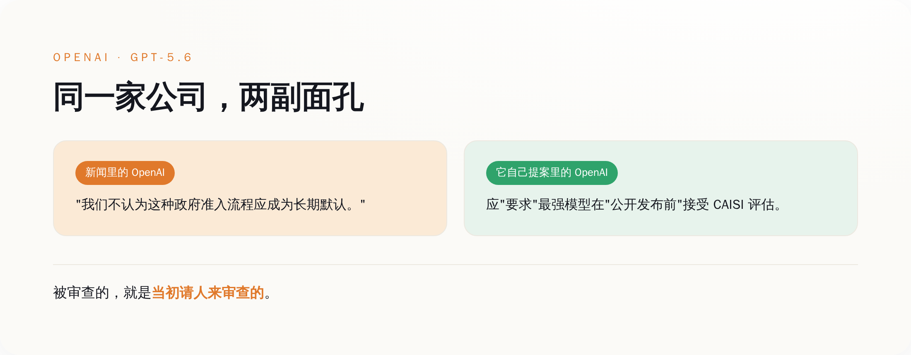
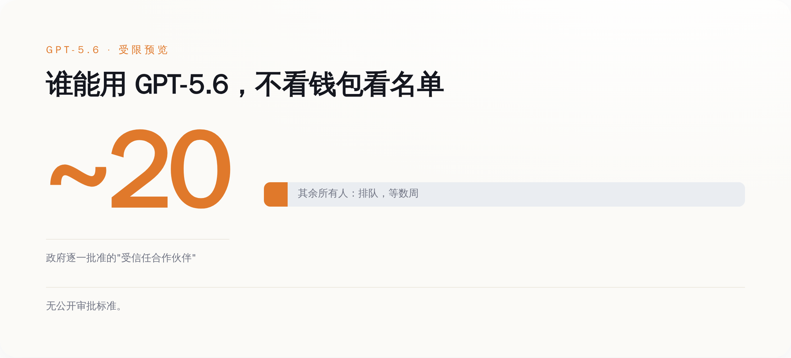
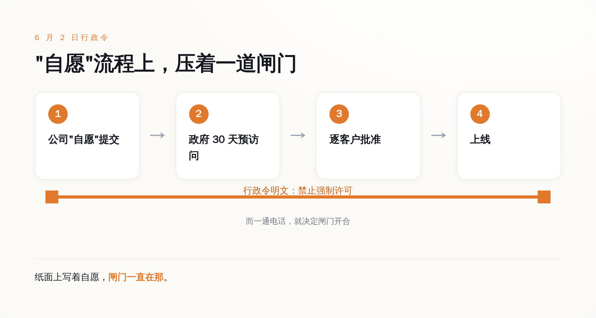
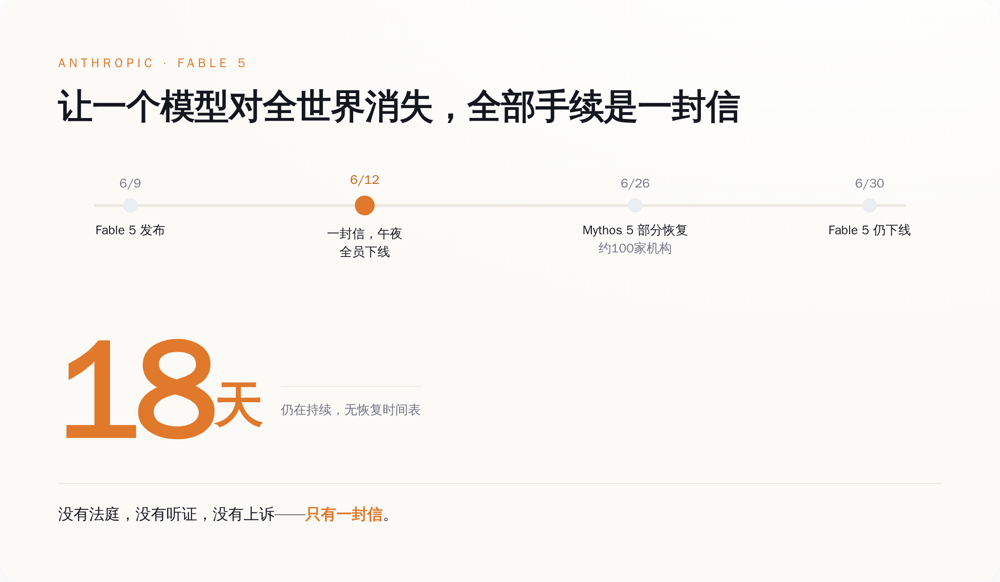

# OpenAI 求了一年让政府审查最强 AI，这回真审了，它转头说"这不该成为常态"

> **发布日期**：2026-06-30 | **分类**：AI 观察 · 商业拆解

## 导语

这两天的新闻是这么写的：OpenAI 最强的那个模型 GPT-5.6 发布了，但你用不了。

白宫一句话，它现在只对二十来家"受信任合作伙伴"（trusted partners）开放，剩下所有人——开发者、企业、你和我——排队等着。OpenAI 自己发了个声明，话说得相当委屈：

> "我们不认为这种政府准入流程，应该成为长期的默认。"
> （We don't believe this kind of government access process should become the long-term default.）

一个被卡了脖子的受害者形象，就这么立住了。媒体顺着往下写：技术自由的黄昏、国家机器的手伸进了实验室、连 OpenAI 都顶不住了。

然后我去翻了翻 OpenAI 自己交给政府的文件。

那份文件里，它白纸黑字地建议政府：**请要求最强的前沿模型，在公开发布前，先接受一遍评估。**

被审查的这家公司，就是当初请政府来审查的那家公司。

（你可能想说，"请人评估"和"被人卡住"不是一回事。这话没错，差别确实在。它怎么从自己点的"评估"，一步步滑成现在这副"审批"模样，下面一节一节拆给你看。）

---

*受害者和请愿人，是同一张脸。*

## "受限预览"那天，OpenAI 到底说了什么

先把它委屈的那一面说完整，不然不公平。

6 月 26 日，GPT-5.6 发布，三档模型，代号 Sol、Terra、Luna。但这不是一次正常发布。它是"受限预览"——访问权限被锁死在大约二十家机构手里，而且这二十家不是 OpenAI 自己挑的，是政府一家一家批的。Sam Altman 跟员工说得很直白：商业访问权，政府"一个客户一个客户地"（customer by customer）批，目前没有任何公开的审批标准。

没有公开标准，是这句话里最值钱的四个字。意思是没人知道凭什么你能用、凭什么他不能用，全看那张看不见的名单。

OpenAI 在声明里把这次定性成"短期步骤"（short-term step），说接下来几周会放开给更广的人群，还说正在和政府一起设计一套"可重复使用的、未来模型发布的流程"（a repeatable process for future model releases）。这后半句，记住，待会儿要回来算账。

声明里最硬的一句是这个：

> "它把最好的工具，挡在了那些真正需要它的用户、开发者、企业、网络安全防御者和全球合作伙伴之外。"
> （It keeps the best tools from users, developers, enterprises, cyber defenders, and global partners who need them.）

翻过来就是一句话：好东西做出来了，可惜被拦着，不能给你们用，我们也很无奈。

到这里为止，剧本是完整的。一家想把最强 AI 普惠给所有人的公司，撞上了一堵叫"国家安全"的墙，它在墙这边喊话，听着挺惨。

我本来也准备同情它一下。

*能用最强 AI 的不是有钱人，是名单上的人。*

## 然后我翻出了它自己写的东西

OpenAI 有一份政策文件，标题叫《前沿 AI 的民主治理：一份联邦框架蓝图》（Democratic Governance of Frontier AI: A blueprint for a federal framework）。

这份文件不是别人塞给它的，是它主动写出来递给华盛顿的，核心就一句：

> "政策制定者应当要求，能力最强的前沿模型，在公开发布前接受一次 CAISI 评估。"
> （Policymakers should require the most capable frontier models to undergo a CAISI evaluation before public release.）

CAISI 是商务部底下专门给 AI 定标准、做评估的机构，前身就是那个"AI 安全研究所"，去年才改的名。这句话里有两个词得拆开看。一个是 require——要求，不是建议，不是鼓励，是带强制意味的"应当要求"。另一个是 before public release——发布之前。

把这两个词拼起来，就是：**最强的模型，发布前，政府必须先过一遍手。**

这正是 GPT-5.6 现在经历的事。区别只在于，现实给的剂量比 OpenAI 点的菜还重了一点——不光要评估，还顺手加了个"逐客户审批"的浇头。

Altman 本人怎么看这份文件？他公开说："对这份文件很满意，尤其是它强调了要强化、要把 CAISI 放到中心位置。"（Am happy with this document, and in particular the emphasis on strengthening and centering CAISI.）他还给那道 6 月 2 日的行政令背了书，原话是："这道新行政令，把平衡拿捏对了。"（the new EO gets the balance right.）

所以现在你再回头看导语里那句委屈话。

一家亲手提案"请审查最强模型"、亲口给审查框架点过赞、还说政府"平衡拿捏对了"的公司，在政府真照着做之后，发声明说"这不该成为长期默认"。

这不叫被审查。这叫请客吃饭，客人真来了，主人嫌上菜慢。

## "自愿"两个字，是怎么变成"必须"的

有人会替 OpenAI 辩护：它支持的是"评估"，反对的是"审批否决"，这两件事不一样。

这个辩护有道理，我们得认真对待。OpenAI 的立场确实是：政府可以评估，但不该握有"批不批准你部署"的否决权。问题在于，这次它实际吃下去的，恰好就是它说自己反对的那种。逐客户审批，政府一家一家批，能批就能不批，不批就是否决——这跟它嘴上反对的"否决权"，是同一只手。它一边把这只手请进了门，一边声明自己反对这只手。

而真正让"自愿"两个字变味的，是那道行政令本身。

6 月 2 日，行政令签了，名字叫《促进先进人工智能的创新与安全》。这份文件特意在第 3 节里写明：**本节内容不授权设立任何强制性的政府许可、预先批准或许可证制度。**（nothing in Section 3 authorizes the creation of a mandatory governmental licensing, preclearance, or permitting requirement.）

写得清清楚楚——这是自愿的，没人逼你。开发者可以"自愿"把模型交上去评估，政府拿到后有最长 30 天的预先访问期（这个窗口草案里原本是 90 天，业界嫌长，砍到了 30——这扇门开多久，业界自己也是伸过手的）。

"自愿"两个字，是整套机制的遮羞布。

因为只要它是自愿的，那政府就不算在审查，公司也不算被审查，大家面子上都过得去，也绕开了一个麻烦事——真要白纸黑字搞强制许可，一道行政令是立不起来的，所以它自己在第 3 节里抢先把"强制"两个字撇得干干净净。

可问题是，当那个握着审批权的政府，同时还是你最大的潜在客户、是能动用出口管制把你刑事处罚的那一方时，"自愿"这两个字还剩多少分量？

你想知道答案，不用看 OpenAI。看它隔壁就行。

*自愿是写给纸看的，闸门是装给产品的。*

## 想看"自愿"到底自不自愿，看隔壁 Anthropic

OpenAI 这次还算体面，叫"受限预览"，发布即受限，没经历过把模型公开放出去再被摁回来的难堪。

Anthropic 经历了。

6 月 9 日，Anthropic 发布了它当时最强的模型 Claude Fable 5。三天后，6 月 12 日下午，商务部长 Howard Lutnick 给 CEO Dario Amodei 寄了一封信。当天午夜前，Fable 5 和另一个模型 Mythos 5，对全体用户下线。

Anthropic 自己的声明是这么写的，一个字都没绕：

> "美国政府以国家安全为由，发布了一道出口管制指令，要求暂停任何外国籍人士访问 Fable 5 和 Mythos 5——无论其身在美国境内还是境外，包括 Anthropic 自己的外籍员工。这道命令的净效果是：为了合规，我们必须立刻对所有客户停用 Fable 5 和 Mythos 5。"

念一遍这句话的逻辑链。政府要的是"别让外国人用"。Anthropic 做不到只拦外国人——因为一个全球实时调用的 AI 产品，没法在你敲下回车那一刻精准识别你的国籍。所以它唯一能做到的合规，就是把所有人一起拦掉。要拦一个外国实习生，先得让全世界的付费客户一起断网。

这就是出口管制这把老工具的尴尬。它当年是为"芯片"这种看得见、摸得着、能卡在海关的东西设计的。现在你拿它去管一个长在云端、按 token 吐字的生成式模型，它只有一个动作能做：一刀切。

Anthropic 在声明结尾还留了句话："我们为给客户造成的中断致歉。我们相信这是一场误会，正在尽快恢复访问。"

误会归误会。这封信里 Lutnick 威胁的是刑事和民事处罚，不是请你喝咖啡。而所谓"尽快恢复"，到我写这篇文章的 6 月 30 日，Fable 5 已经全球下线 18 天，还没回来。中间只有 Mythos 5 在 6 月 26 日"部分恢复"——政府又寄了封信，说经过认定，"适当的安保措施已经到位，可以允许某些受信任的合作伙伴访问 Mythos 5 模型"，名单上大约一百家美国机构，可以让它们的非美籍员工用了。

看明白这套流程没有。政府一句话，模型消失；政府再一句话，模型对名单上的一百家回来；名单外的，继续等。从头到尾，没有一个法庭、没有一次听证、没有一条能上诉的渠道。靠的就是部长的信和给 Altman 的那通电话。

*这是「自愿」机制有牙齿的证明，也是它有多钝的证明。*

## 所以别急着同情谁

一封信，一通电话。这就是 2026 年让一个最强 AI 模型上线或下线，需要的全部手续。把两家放一起看，事情就清楚了。

得说清楚，这是两扇门：Anthropic 撞的那扇叫出口管制，OpenAI 走的那扇叫"自愿"评估框架，法律依据完全不同。但两扇门朝同一个方向开——最强的模型，发布或访问之前，先过政府这一关。

Anthropic 是被门夹了手——出口管制、刑事处罚、18 天黑屏，这是有人把门狠狠摔上。OpenAI 是自己把门请进了屋，又在门口喊疼——它提案要这道关，给这道关点过赞，然后在关卡真的立起来那天，发声明说它不该常驻。

两件事拼起来，指向同一个事实：发布前要过政府这一关，已经从传闻变成了现实，两家最顶尖的美国实验室在两周内先后撞上。而把这扇门一砖一瓦递上去的人里，就有现在喊得最委屈的那个。

这事的行动含义其实特别朴素，跟 AI 没关系，跟看新闻的方法有关系：

下一次，再看到哪家 AI 公司站出来，一脸悲壮地说"我们被监管误伤了"，你先别急着递同情。打开它官网那个叫 policy 或者 global affairs 的栏目，翻翻它过去一年自己提过什么、给哪道法案点过赞，两分钟的事。翻完再决定，这眼泪你信几分。

OpenAI 那份蓝图的名字，叫《前沿 AI 的民主治理》。

它求的从来不是别让政府管，它求的是政府按它设计的方式管。现在政府接过了笔，只是写出来的字，比它预想的重了一号。委屈是真的。但这扇门是谁递的，也是真的。

## 数据来源

- [OpenAI: Statement on GPT-5.6 limited preview](https://openai.com/) — OpenAI 关于 GPT-5.6 受限预览的官方声明（"long-term default""short-term step""keeps the best tools..."等逐字引述）
- [OpenAI: Democratic Governance of Frontier AI — A blueprint for a federal framework](https://openai.com/global-affairs/) — OpenAI 政策蓝图，"require the most capable frontier models to undergo a CAISI evaluation before public release"
- [The White House: Executive Order — Promoting Advanced Artificial Intelligence Innovation and Security (2026-06-02)](https://www.whitehouse.gov/presidential-actions/) — 行政令全文，含第 3 节"不授权强制许可"条款与 30 天预访问窗口
- [Anthropic: Statement on the US government directive to suspend access to Fable 5 and Mythos 5](https://www.anthropic.com/news) — Anthropic 官方声明逐字引述
- [Bloomberg: Read the Lutnick Letter That Led Anthropic to Disable Mythos](https://www.bloomberg.com/) — 商务部长 Lutnick 出口管制信函全文与 6/26 部分解禁信
