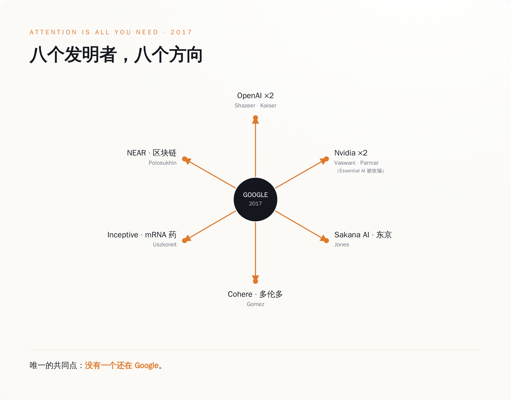
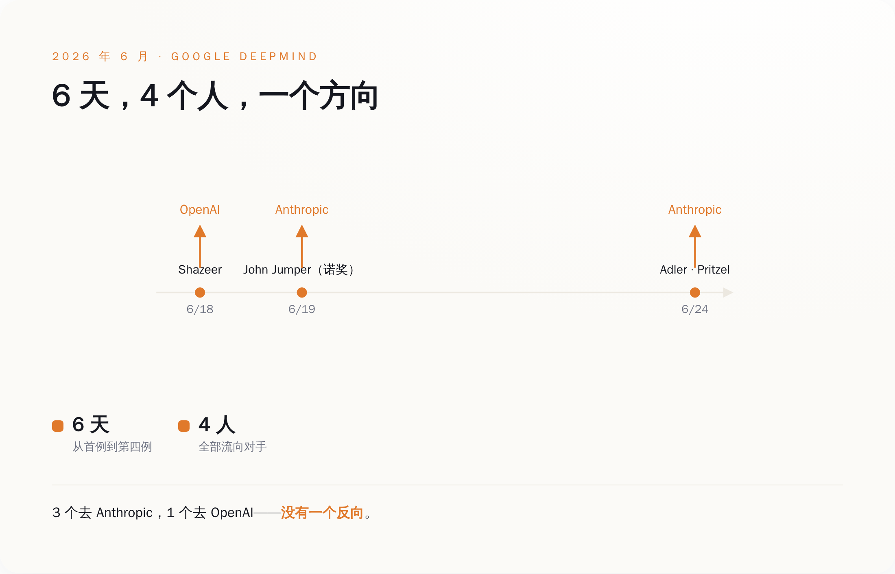
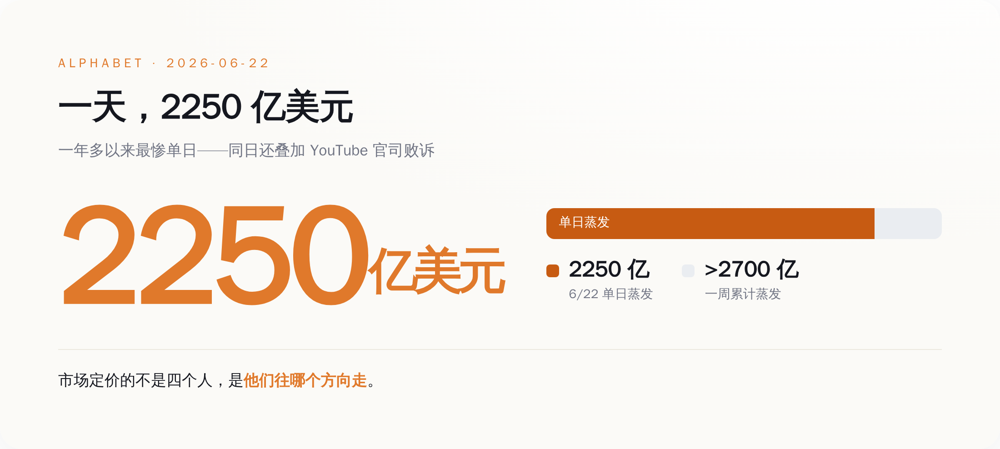
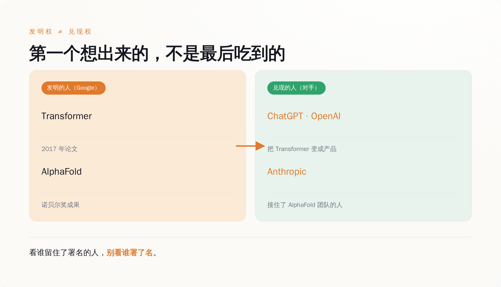

# 发明 Transformer 的 8 个人，现在没有一个还在 Google

> **发布日期**：2026-07-01 | **分类**：AI 观察 · 商业拆解

## 导语

2024 年 8 月，Google 做了一笔看上去很划算的买卖：花 27 亿美元，把一个三年前从自己公司辞职的老员工请回来。

这个人叫 Noam Shazeer。2021 年他嫌 Google 动作太慢，出门自己开了家公司，叫 Character.AI。Google 掏 27 亿把他和手底下三十来号人一起打包买回，给了他一个位子——Gemini 联合负责人，管的是 Google 押上全部身家的那个大模型。

买回来的这个人，是 2017 年那篇论文《Attention Is All You Need》的作者之一。那篇论文提出了一个叫 Transformer 的东西，今天你用的每一个大模型——ChatGPT、Gemini、Claude、豆包、DeepSeek——地基全是它。换句话说，Google 花 27 亿买回来的，是亲手给这个 AI 时代打地基的八个人里的一个。

不到两年，2026 年 6 月 18 日，他又走了。

这次去了 OpenAI。

同一个人，同一家公司，同一扇门，进去一次，出来两次。而这只是个开头——发明了 Transformer 的那 8 个人，我数了一遍，现在没有一个还坐在 Google。

（你可能觉得，几个研究员跳槽，至于吗？一家市值两万亿美元的公司，走几个人能伤到哪儿。这话有道理，我们下面一节一节算。但先记住一个数字：就在这几天前后，Alphabet 单日市值蒸发了大约 2250 亿美元（这里面有别的官司掺了一脚，后面拆给你看）。市场显然不觉得"至于吗"。）

---

  
🎨

  
概念图占位

  

生成 Prompt
<pre>a one-way revolving door at a glass corporate headquarters entrance, several human silhouettes walking out, none walking in, cold early-morning light, flat minimalist editorial illustration, muted slate-blue palette with a single warm orange accent, lots of negative space, no text, no labels, clean background</pre>

*人能被买进来，留不留得住是另一回事。*

## 一、这扇门，只朝一个方向转

先把 Shazeer 这条线走完，因为它是整件事的缩影。

2021 年，Shazeer 从 Google 离职。原因外面传了很多版本，但有一件事是清楚的：他在公司内部推动把对话模型公开发布，没推动成。Google 那时候手里已经有能聊天的原型了——比 ChatGPT 早了整整一年多——但它压着没发。

他出去开了 Character.AI，做能跟你聊天的 AI 角色，产品 2022 年上线，很快火了。到 2022 年底 ChatGPT 出来，全世界才反应过来：哦，原来这东西能这么用。而 Google 手里那个更早的原型，还在抽屉里。

2024 年 8 月，Google 把 Shazeer 买回来了。27 亿美元，非独家授权 Character.AI 的技术，顺带把创始人和核心团队一起"回收"。业内管这种操作叫 reverse acquihire（逆向收购）——正常收购是买下整个公司、连人带资产一起端走，这次反过来：Character.AI 这家公司基本没动，27 亿直接砸向创始人和核心团队本人。买的不是公司，是人。

Google 为什么肯花这个钱？因为它需要 Shazeer 这样的人来救 Gemini。买回来，给联合负责人，位子够高，钱够多。

结果两年不到，人又走了。

6 月 18 日，Shazeer 加入 OpenAI，职位是 Lead for Architecture Research——架构研究负责人，管的正是神经网络最底层的结构，也就是他当年发明 Transformer 的那个领域。Sam Altman 在 X 上发了一条：

> "noam is one of the people I have most wanted to work with since the very beginning of openai. only took 10 years. i think it will be worth the wait!"
> （noam 是打从 OpenAI 一开始，我就最想合作的人之一。只用了 10 年。我觉得这个等待值了。）

这条话你得品一下。Altman 说"只用了 10 年"——OpenAI 2015 年成立，他从那时候就想要 Shazeer。而这 10 年里，Shazeer 大部分时间在 Google，中间还被 Google 花 27 亿"锁"了一道。锁了两年，没锁住。

所以你看这扇门。Google 能把人买回来，说明它有钱、也识货。但买回来是一次性的动作，留下来是天天的事。**Google 能花 27 亿买回一个人，买不回那种让人不想走的公司。**

这扇门只朝一个方向转：钱能把人转进来，转不住他往外走。Shazeer 一个人，就把这扇门来回演示了一遍。

## 二、一张署了 8 个名字的论文，现在散在 8 个地方

Shazeer 不是特例。他是规律里最戏剧化的那一个。

把 2017 年那篇论文的作者名单拉出来，一个一个查现在在哪，你会看到一张完整的人才流出图。八个名字：Ashish Vaswani、Noam Shazeer、Niki Parmar、Jakob Uszkoreit、Llion Jones、Aidan Gomez、Łukasz Kaiser、Illia Polosukhin。

现在他们在哪：

- **Ashish Vaswani、Niki Parmar**：一起出去开了 Essential AI，2023 年拿了 Google、Nvidia、AMD 一堆钱；2026 年团队被 Nvidia 收编，Vaswani 转进 Nvidia 做开源模型。
- **Jakob Uszkoreit**：在 Google 干了 13 年，出去开了家叫 Inceptive 的公司，用 AI 设计 mRNA 药物——直接转行去救命了。
- **Llion Jones**：在 Google 干了 12 年，跑去东京，和人合开了 Sakana AI，自己当 CTO。
- **Aidan Gomez**：开了 Cohere，2026 年 4 月宣布和德国的 Aleph Alpha 合并，合完估值大约 200 亿美元。
- **Łukasz Kaiser**：2021 年就去了 OpenAI，ChatGPT、GPT-4、还有后来的推理模型 o1，都有他。
- **Illia Polosukhin**：更早就出去了，搞了个区块链项目 NEAR，现在是 NEAR 基金会的 CEO。
- **Noam Shazeer**：上一节讲完了，Character.AI → 回 Google → OpenAI。

八个人，八个方向：OpenAI、Nvidia、东京、多伦多、一家做药的、一条区块链。有的创业，有的被收购，有的干脆换了赛道。唯一的共同点是——没有一个还在 Google 原来的岗位上。

*八个发明者，八个方向——没有一个还在 Google 原来的岗位。*

这张图我建议你盯着看十秒。Google 2017 年在一间办公室里，凑齐了后来定义整个 AI 时代的八个人。这是什么概念？相当于一支球队同时握着八个能拿金球奖的球员。然后接下来九年，这支球队把八个人一个一个放走了——放到竞争对手那里、放到另一个国家、放到另一个行业。

有人会说，人才流动很正常啊，硅谷本来就这样。这话得分两半看。这 8 个人里，有几个是自己创业冲动使然——Uszkoreit 跑去做 mRNA 药、Polosukhin 搞区块链，这类你确实可以说跟 Google 好不好没关系。但另一半，尤其是 2026 年这一批，是被对手带着 offer 精准挖走的，那就不是"想创业"能解释的了。而无论哪一半，最后拼出来的图是同一张：只有出，没有进。你能培养出发明 Transformer 的团队，这是顶级能力；但你一个都没留下，这是另一个问题。这两件事，Google 一件不落全占了。

## 三、6 天，又走了 4 个

如果说八作者流散是九年慢慢漏，那 2026 年 6 月这一周，是决口。

时间线摆出来：6 月 18 日，Shazeer 走，去 OpenAI；6 月 19 日，John Jumper 宣布走，去 Anthropic；6 月 24 日前后，Jonas Adler、Alexander Pritzel 两人也确认去 Anthropic。

6 天，4 个人。3 个去了 Anthropic，1 个去了 OpenAI。

Jumper 这个人得单独说。他不是 Transformer 八作者，但他手里那块牌，比 Transformer 还硬——AlphaFold，用 AI 算蛋白质结构，2024 年拿了诺贝尔化学奖。一个刚拿了诺奖的科学家，在 Google DeepMind 干了将近 9 年，说走就走了。他自己在 X 上发的原话：

> "A bit of news: After nearly 9 years, I have decided to leave Google DeepMind and join Anthropic (after taking some time to recharge). I am incredibly grateful for my time at GDM."
> （报个信：干了将近 9 年之后，我决定离开 Google DeepMind，加入 Anthropic（先歇一阵子再去）。我非常感激在 GDM 的这段时间。）

后面那句"非常感激"是场面话，前面那个决定才是真的。感激归感激，人还是走了。

Adler 和 Pritzel 名气不如前两位，但方向很说明问题：Adler 做的是 AI 写代码，Pritzel 做的是模型预训练——一个管当下 AI 产品里变现最快的能力（编程助手），一个管模型最底层的能力。这不是边缘岗位在走，是核心动脉在往外抽血。

一周之内，一个诺奖得主、一个 Transformer 发明者、两个核心研究员，走了。去向高度集中：Anthropic 和 OpenAI，Google 的两个正面对手。

*6 天走了 4 个，3 个去 Anthropic、1 个去 OpenAI，方向是单一的。*

DeepMind 的老板 Demis Hassabis 出来回应了。他没躲，接了 Semafor 的独家专访，说 DeepMind"拥有所有实验室里最大、最广的研究阵容"，说"我们赢得了属于我们的那份顶尖人才"，还说现在是"科技行业史上人才争夺最凶猛的时候"。

Hassabis 这套话术其实挺高级的。他做的事情叫"把个案正常化"——你别盯着我走了几个，你看整个行业都在抢人，大家都在掉人，这是市场太热，不是我有问题。

这话对一半。市场确实热。但"大家都在掉人"和"人都往你对手那儿掉"，是两码事。你什么时候听说过一个诺奖得主从 OpenAI 跳去 Google 救场的？这一周的四个人，方向是一致的，都从 Google 流向 Anthropic 和 OpenAI。这不是随机的人才对流，这是单向的水。

## 四、市场怎么给"人走了"开罚单

人往对手那边单向流，这件事市场是怎么知道、又怎么给它标价的？开头那个问题，到这儿也必须回答了：几个人走，至于伤到两万亿美元的公司吗？

市场用真金白银回答了。

6 月 22 日，也就是 Shazeer 和 Jumper 的消息传开后第一个交易日，Alphabet 股价单日跌了 5% 以上（有的口径报到 6.7%、接近 7%），一天蒸发市值大约 2250 亿美元，是它一年多以来最惨的一天。到 6 月 24 日 Adler、Pritzel 也确认离开，那一周累计蒸发的市值，过了 2700 亿美元。

2250 亿美元是什么概念？它比这四个人这辈子拿的所有工资加起来，还多几万倍。市场显然不是在给"四个人的产出"定价，它在给别的东西定价。

不过这里我得拆穿一件事，不然对 Google 不公平。6 月 22 日那天股价跌，不全是因为人走。同一天，加州一个法官驳回了 Google 的重审请求——那是一起指控 YouTube 让未成年人上瘾的官司，Google 输了。所以那天的跌，是"人才出走"和"官司败诉"两件事叠一块儿的。把 2250 亿全算到四个研究员头上，是懒惰的归因。

但"人才叙事"为什么还是被市场当成了主因？因为官司这种事 Google 常年在打，投资人见得多、早就算进价里了。真正让投资人后背发凉的，是另一个问题：如果连发明 Transformer 的人、拿诺奖的人都在往对手那儿跑，那 Google 手里最值钱的到底是什么？

*单日蒸发约 2250 亿美元，一周累计超 2700 亿——罚的不是人，是方向。*

一家公司的市值，从来不是它今天赚多少钱，是市场信不信它明天还能赚。Google 今天的赚钱能力没问题，搜索广告照样是印钞机。但顶尖人才的流向，是市场用来赌"明天"的最灵敏的那根指针。指针往对手那边偏，市值就往下掉。这跟四个人本身值多少钱没关系，跟他们"往哪个方向走"关系极大。

所以那 2250 亿，不是四个人的身价，是市场在说一句话：我们不再那么相信 Google 能守住 AI 这张牌了。**股价跌的不是人走了，是人往哪儿走。**

## 五、为什么发明的人，偏偏是留不住的人

现在到了最该问的问题：Google 又不缺钱、不缺算力、不缺题目，怎么就留不住人？

得先破一个懒惰的答案。网上最流行的说法是"Google 太官僚、动作太慢、大公司病"。这话不算错，但它解释不了全部——如果只是慢，为什么慢的偏偏是这家发明了 Transformer 的公司？真正的机制，藏在三个地方。

第一，发明和发布，在 Google 内部是两件打架的事。开头说过，Google 把能对话的原型压在抽屉里一年多才发。那不是技术不行，是它算不过一笔账——Google 最赚钱的生意是搜索广告，而一个能直接给你答案的聊天机器人，恰恰是搜索广告的天敌——你都不点链接了，广告卖给谁？所以对 Google 这个体量的公司，把最先进的对话 AI 公开发布，不是技术问题，是"要不要亲手动自己饭碗"的问题。它犹豫了一年多，直到 ChatGPT 逼它不得不发。而对一个研究员来说，最痛苦的事莫过于：我发明的东西，公司因为怕伤自己的生意，不让它见人。

第二，DeepMind 内部的资源，正在从"仰望星空"转向"下地干活"。有分析指出，DeepMind 近来把资源大量倾斜到像"AI 编程突击队"这种商业化优先的方向上。这对公司是对的——得赚钱。但对那些冲着通用人工智能、冲着"造出会做科学的机器"来的科学家，这意味着他们的题目被降了优先级。Jumper 做的 AlphaFold 是纯粹的科学突破；当公司的钱越来越多往写代码的方向流，一个想解开生命密码的人，会觉得错位。

第三，也是最现实的，对手手里有一张 Google 给不出的牌：还没兑现的股权。OpenAI 6 月 8 日确认已经秘密递交了 IPO 文件，估值预期上万亿；Anthropic 更早一些，还在高速融资。这两家给顶尖研究员的股权，共同点是都还没开奖——上市那一下、或者下一轮估值跳涨，可能再翻一大截。而 Google 能给的，是一家已经两万亿、股价再翻倍都难的成熟公司的期权：股票是好股票，但奖早开完了。同样是一张纸，一个还没开奖、可能翻几倍，一个开完了、很难再涨。对一个功成名就、不缺存款的顶级科学家，你猜他要哪张？

把这三件事叠一起，Google 的处境就清楚了：它是一台完美的发明机器，可它发明的东西会威胁自己的主业，它的组织重心在往回收，它能给的回报又没有对手性感。**它什么都不缺，就缺一个让发明者愿意留下来把发明做完的理由。**

Hassabis 说得对，这是史上最凶的人才争夺。但在这场争夺里，Google 的结构性劣势不是它不努力，是它太成功了——太成功的主业，成了留不住发明者的那道墙。发明权它 2017 年就拿到了；可发明权是一次性的，兑现权是天天要还的。Google 赢了前者，正在结构性地输掉后者。

## 六、加州的反讽，和一个看新闻的方法

如果前面还不够说明问题，6 月 29 日又来了一记。

加州州长 Newsom 宣布，加州全州政府机构可以五折价格采购 Anthropic 的 Claude，还配免费培训和 Anthropic 工程师的技术支持。

加州是谁的主场？Google 总部就在加州山景城，DeepMind、Google Brain 的很多人就在加州上班。结果加州州政府要给几百万公务员配 AI，选的不是家门口这家发明了 Transformer 的公司，是隔壁那家刚从 Google 挖走一个诺奖得主的公司。

这事没有隐喻，它就是字面意思：在 Google 的主场，公权力掏钱买了 Google 对手的产品，还开了发布会。

你可以说这只是时间上的巧合，采购决定不是因为谁挖了谁的人。没错。但把它和前面五节摆在一起，画面就完整了：Google 送走的那些人，正在变成对手手里能卖给政府的产品力，而第一个当着全世界买单的，是 Google 自己的主场。

当然，这个采购决定背后是更大的问题——公家的钱去买私有的闭源模型、权力和数据往少数几家公司集中，这些都值得单拎出来追问，但那是另一篇文章的事。这里我只想让你记住这个画面：发明者的主场，正在被摘桃子的人占领。

*发明的是 Google，兑现的是对手：第一个想出来的，常常不是最后吃到的。*

这篇讲了一堆 Google 的故事，但我真正想给你的，不是"Google 要完了"这个结论——它没完，它还很能赚钱。我想给你的是一个看新闻的方法，一个你明天就能用上的判断：

**下次再看到"某某公司发明了某项技术"，别急着把它当成这家公司会赢的证据。发明权和兑现权，是两码事。**

发明 Transformer 的是 Google，把 Transformer 变成 ChatGPT 的是 OpenAI；拿诺奖的 AlphaFold 长在 Google，而拿 AlphaFold 的那个人现在在 Anthropic。历史一次又一次证明，第一个想出来的人，常常不是最后吃到的人。想知道谁会吃到，别看谁的论文署名，看谁留住了那些署名的人。

Shazeer 那扇门，进去一次，出来两次。你要判断一家公司行不行，不用看它招进来谁，看它的门，往哪个方向转。

## 数据来源

- [Sam Altman on X（2026-06-18，一手）](https://x.com/sama/status/2067427421083652131) — "only took 10 years. i think it will be worth the wait!" 逐字引述
- [John Jumper on X（2026-06-19，一手）](https://x.com/JohnJumperSci/status/2068001285173834106) — "After nearly 9 years, I have decided to leave Google DeepMind and join Anthropic..." 逐字引述
- [Google Gemini co-lead Noam Shazeer leaves for OpenAI — CNBC（2026-06-18）](https://www.cnbc.com/2026/06/18/google-gemini-co-lead-noam-shazeer-leaves-for-openai.html) — Shazeer 离职时间线与职位
- [Character.AI Co-Founders Hired by Google in Licensing Deal — Bloomberg（2024-08-02）](https://www.bloomberg.com/news/articles/2024-08-02/character-ai-co-founders-hired-by-google-in-licensing-deal) — 27 亿美元逆向收购
- [Nobel Winner John Jumper to Leave Google DeepMind for Anthropic — Bloomberg（2026-06-19）](https://www.bloomberg.com/news/articles/2026-06-19/nobel-winner-john-jumper-to-leave-google-deepmind-for-anthropic) — Jumper 离职
- [Google Poised to Lose Two More High-Profile AI Staffers to Anthropic — Bloomberg（2026-06-24）](https://www.bloomberg.com/news/articles/2026-06-24/google-poised-to-lose-two-more-high-profile-ai-staffers-to-anthropic) — Adler / Pritzel 去向与方向
- [Alphabet has its worst day in over a year after high-profile exits — CNBC（2026-06-22）](https://www.cnbc.com/2026/06/22/alphabet-goog-stock-ai-departures.html) — 单日跌幅与市值蒸发，及同日 YouTube 官司败诉
- [DeepMind chief Demis Hassabis says Google's still winning AI talent — Semafor（2026-06-23，独家专访）](https://www.semafor.com/article/06/23/2026/deepmind-chief-demis-hassabis-says-googles-still-winning-ai-talent) — Hassabis 回应逐字引述
- [OpenAI submits confidential S-1 — OpenAI 官方（2026-06-08）](https://openai.com/index/openai-submits-confidential-s-1/) — IPO 保密递交
- [Governor Newsom announces first-of-its-kind partnership with Anthropic — gov.ca.gov（2026-06-29）](https://www.gov.ca.gov/2026/06/29/governor-newsom-announces-a-first-of-its-kind-partnership-providing-anthropic-tools-to-state-agencies-and-improving-services-for-californians/) — 加州州政府五折采购 Claude
- [Attention Is All You Need — arXiv:1706.03762](https://arxiv.org/abs/1706.03762) — Transformer 论文与八位作者署名
- [Cohere to acquire German AI company Aleph Alpha — CNBC（2026-04-24）](https://www.cnbc.com/2026/04/24/cohere-aleph-alpha-germany-ai-europe-expansion.html) — Gomez / Cohere 合并估值
