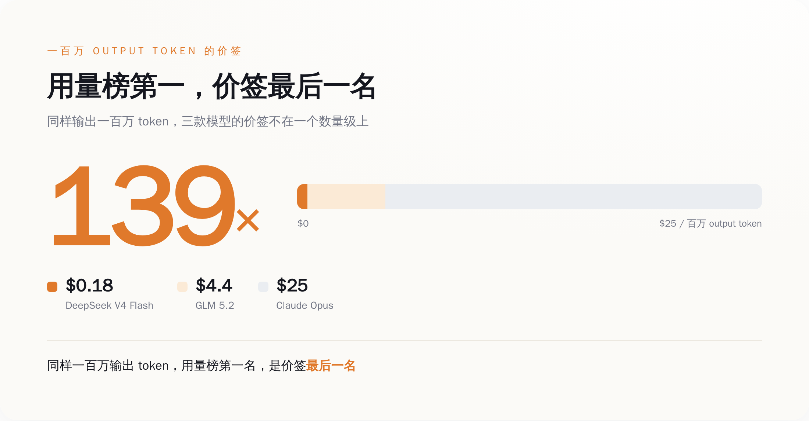
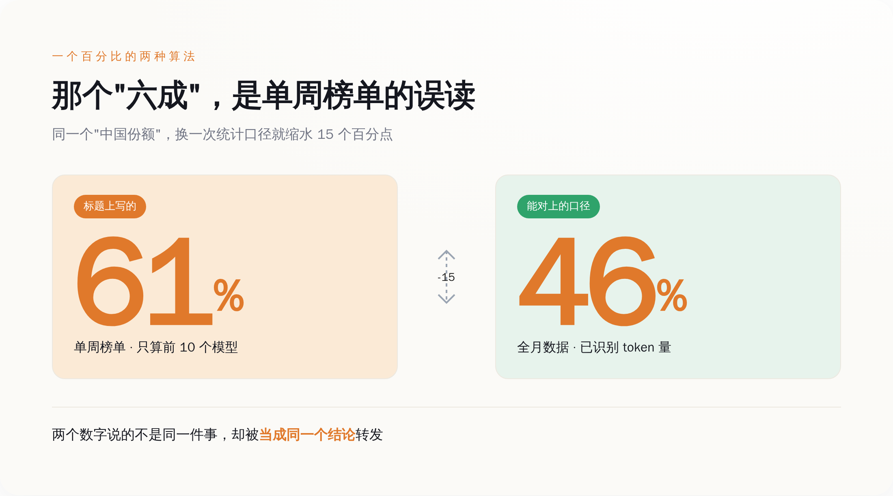
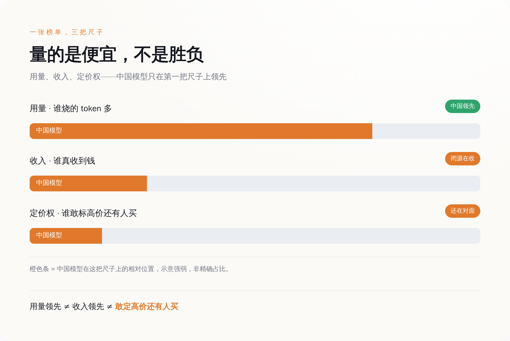
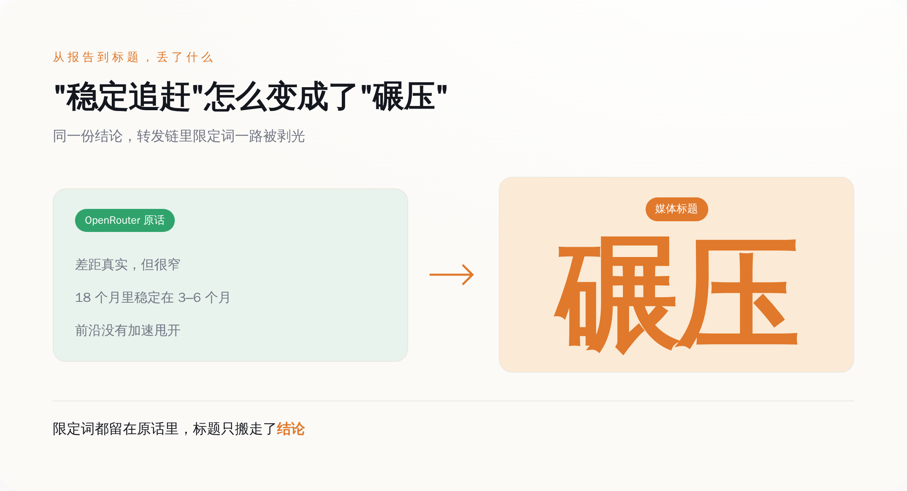

# 中国大模型登顶用量榜：一百万个 token 卖一毛八，量的是白菜价，不是胜负

> **发布日期**：2026-07-02 | **分类**：AI 观察 · 数据打假

## 导语

先给你两个价签，都是官方标的，你自己看。

DeepSeek V4 Flash，中国的开源模型，跑一百万个输出 token，收你 0.18 美元。一毛八。

Claude Opus，Anthropic 的旗舰闭源模型，同样跑一百万个输出 token，收你 25 美元。

同样的活儿，一个收一毛八，一个收二十五块，差 139 倍。

这半年，全网都在传一个消息：中国开源模型在 OpenRouter 上把美国模型摁在地上摩擦，用量份额从一年前的百分之几，一路飙到"六成"。标题一个比一个响——碾压、统治、夺取领导地位。转发的人手指头都快点冒烟了。

我不否认这事有它的分量。但在你跟着一起激动之前，先记住上面那个 139 倍。因为接下来我要跟你算一笔账：那张让所有人高潮的用量榜，量的根本不是谁赢了，是谁最便宜。中国模型确实登顶了，登的是价签最低的那个顶。

而且更好笑的是——连"六成"这个数字本身，都是被算错的。

---

  
🎨

  
概念图占位

  

生成 Prompt
<pre>a towering mountain of cheap green cabbages with one tiny paper price tag, beside a single premium bottle glowing under a spotlight in a glass case with a huge ornate price tag, conceptual contrast of cheap volume versus expensive scarcity, flat design, minimalist editorial illustration, tech magazine style, warm orange accent with muted grey, no text, no labels, clean background</pre>

## 一、榜单登顶那天，价签是一毛八

先搞清楚"用量第一"这四个字，到底在说什么。

OpenRouter 是个模型路由平台，你可以理解成 AI 模型的一个大集市，全世界的开发者在上面挑模型、发请求。它会统计每个模型被消耗了多少 token，排个榜。所谓"中国模型用量登顶"，说的就是在这个集市里，被点得最多的那几个摊位，现在挂的是中文招牌。

排在最前面的摊位，叫 DeepSeek V4 Flash。2026 年 4 月 24 日发布，284B 总参数、13B 激活的 MoE 架构，100 万 token 上下文，MIT 协议开源，权重直接甩 Hugging Face 上让你随便下。这串参数你一个都不用记，翻译过来就一句话：个头够大、能打、还免费。真正要你盯住的是它的价签——官方定价页写得清清楚楚：输入 0.09 美元、输出 0.18 美元，每百万 token。缓存命中的部分，按输入价的两折算。

另一个被 OpenRouter 在六月报告里点名的中国摊位，是智谱的 GLM 5.2，六月中发布，744B 总参数、约 40B 激活，同样 100 万上下文，同样 MIT 开源。价签稍微贵点：输入 1.4 美元、输出 4.4 美元。

然后你回头看闭源那一桌。Claude Opus 4.5，输入 5 美元、输出 25 美元；往下一档的 Claude Sonnet 4.5，也要 3 美元和 15 美元。

把价签摆一排，账就出来了：DeepSeek V4 Flash 的输出价，是 Claude Opus 的 1/139；就算跟同为中国开源、定价偏高的 GLM 5.2 比，也便宜到人家的零头。这不是打折，这是把桌子掀了。

*同样一百万个输出 token，DeepSeek 一毛八、Claude Opus 25 美元——用量榜排最前的，价签排最后。*

当一样东西便宜到对手的百分之一，它卖得多，到底证明了什么？

证明它好用，还是证明它便宜？

一个开发者，手里有个跑起来要烧几千万 token 的 agent 流水线，让它反复调用、反复重试、反复读长文档。他选模型的时候，脑子里第一个蹦出来的不是"哪个最聪明"，是"哪个最聪明我用不起，哪个够用又不肉疼"。0.18 美元和 25 美元摆在面前，只要那个一毛八的能把活儿干到"不算太差"，他就用一毛八的。这不是信仰投票，这是算账。

所以用量榜首的真相是这样的：它不是一张"谁最强"的榜，是一张"在够用的前提下谁最便宜"的榜。中国模型冲上去，靠的不是把 Claude 比下去，是把价格砍到 Claude 的百分之一，然后被大批量塞进那些"要烧海量 token、但又付不起高价"的场景里跑量。

**用量登顶是价格战的战报，不是质量战争的战报。** 这两张战报长得像，但说的根本不是一回事。

把这句话记住，我们去看那个"六成"。

## 二、那个"六成"，你转发之前查过是怎么算的吗

我做了件很无聊的事：把各家报道里"中国模型份额"那个数字，一个一个抄下来对了对。

officechai 说美国模型份额从 70% 崩到 30%。加密媒体的快讯标题直接写 61%。有的写 46%，有的写 48%，还有的写 45%。同一件事，同一个平台，同一个月，六七个数字在天上飞，彼此差着十几个百分点。

这本身就很说明问题了。一个被反复引用、当成"行业共识"的数字，如果真有一个干净的官方出处，它不该长这样——它该是一个数，不是一团。数字打架，说明转发它的人里，没几个真去核过它到底怎么算的。大家转的不是数据，是那个"中国赢了"的爽感，数字只是拿来给爽感盖个章。

而这团数字里最响的那个"六成/61%"，恰恰是最经不起问的。你只要追一句"这是全平台四百多个模型的占比，还是排名靠前那几个的占比？是整个月的，还是某一周的？"——追到这一层，"碾压"的地基就开始晃。因为一个只统计头部若干模型、只取某个时间切片的份额，和一个全平台、全时段的份额，是两个完全不同的东西。前者天然偏高，天然波动大，天然适合做标题。把前者当成后者来喊，等于拿班里前十名的平均分，去代表全年级。

相对稳一点、能对得上的口径，是中国厂商合计约占 OpenRouter "已识别 token 量"的 46% 上下。注意这几个字——"已识别"，说明还有一部分没归类进去；"token 量"，说明量的是 token，不是钱，也不是用户数。就算是这个更保守的数，它也只是"在能数清的那部分请求里，有 46% 的 token 是被中文招牌的摊位消耗掉的"。

从"46% 的已识别 token 量"，到标题上的"中国 AI 碾压美国"，中间隔着多少层放大和偷换，你现在应该有点感觉了。

*同一个“中国份额”，标题上的 61% 是单周、只算前十个模型；能对上的口径约 46%，还只是已识别 token 量。*

**一个数字，靠误读接力，就能从'某周头部占比'变成'行业常识'。** 这不是谁在造假，比造假更普通——是一群人各自省了那三十秒的核对，然后把省下来的三十秒，全用来转发了。

## 三、用量、收入、定价权，是三件互不认识的事

就算我们大方一点，把口径的账先记下不算，退一万步，承认中国模型确实吃下了平台上大半的 token——用量榜首，就等于赢了吗？

想搞清楚这个，得先把三个被搅成一锅粥的词分开：用量、收入、定价权。

用量，量的是 token 被烧掉了多少。这里有个陷阱，Ai2 的研究员 Nathan Lambert 一直在提醒：现在大家做 agent，让模型自己规划、自己调工具、自己反复读文档，同样一个任务，agentic 地跑一遍烧的 token，是当年你正常聊天的几十倍。所以"token 份额涨了一大截"里，有多少是真的更多人在用中国模型，有多少只是同样一批人、干同样的活、单位任务烧的 token 变多了？——token 这个计量单位，本身就在通货膨胀。用它来量"渗透率"，尺子是软的。

收入，量的是谁真收到了钱。跑得多不等于收得多，因为单价差 139 倍。你卖出一百万杯一毛八的水，和别人卖出一万杯二十五块的酒，货架上你的杯子摞得高，收银台前站着的是他。

这里插一句，因为总有人拿它来抬杠。社交网络上流传一个更"内行"的反驳：说 Anthropic 在 OpenRouter 上只占 12% 的 token 用量，却拿走了 46% 的收入，所以真正赢的是它。这个反驳听着比"中国碾压"高级多了，很多人拿它来显得自己看得透。

但你要是去查这个 12% 对 46%，会发现一件很有意思的事：它也不是 OpenRouter 官方公布的。它出自一个叫 @Normal_2610 的 X 用户，是他自己对公开数据的一段测算。OpenRouter 作为路由平台，公开的基本是 token 量，压根没披露过各家的收入分成明细。

所以你看这个局面有多离谱——喊"中国碾压"的那批人，举着一个没核过口径的用量数字；反过来喊"其实 Anthropic 才赢"的那批人，举着一个同样没有官方出处的收入数字。两边吵得面红耳赤，手里攥的都是没盖过章的纸。这才是这场狂欢最真实的底色：**大家争的不是数据，是一张谁都没读完小字的榜单。**

至于定价权，量的是你能不能挺直腰把价格标高。这个最诚实。你能收 25 美元还有人排队，说明你手里有别人替代不了的东西；你只能收一毛八，说明你能提供的，市场愿意付的价就是一毛八。价签本身，就是市场对你那点"不可替代性"最不留情面的打分。

打住，我知道有人已经想抬杠了：照你这么说，中国模型就是没本事、只能卖便宜？恰恰相反。把价格摁到一毛八这件事，狠得很，也值钱得很——这个我留到后面一节专门拆，你先别急着关页面。

用量、收入、定价权，是三把不同的尺子，量的是三件不同的事。把用量榜首这一把尺子的读数，直接抄到"谁赢了"那张成绩单上，是这半年 AI 圈最大的一次集体看错。

*用量、收入、定价权是三把不同的尺子——中国模型只在最上面那把（用量）领先，下面两把还在对面手里。*

## 四、连 OpenRouter 自己，都没敢说"碾压"

最讽刺的地方在这儿。

所有"中国碾压美国"的报道，源头都指向 OpenRouter 六月那篇《The Open Weight Models that Matter: June 2026》。那我们就去看看，作为数据的正主，OpenRouter 自己是怎么下结论的。

它的原话大意是：开源模型和闭源前沿之间的差距，是真实存在的，但很窄，而且没有在扩大。它还补了一句更关键的：开源模型和美国前沿实验室之间，稳定保持着一个 3 到 6 个月的差距，这个差距已经稳了 18 个月以上；至少到目前为止，前沿实验室并没有表现出要加速甩开开源的迹象。

你把这段话读三遍。它讲的是"稳定追赶、差距没拉大"，是一个"咬得挺紧、但人家还在前面"的状态。这跟"碾压""统治"是一个意思吗？差着十万八千里。第三方研究机构 Epoch AI 的测算也是同一个方向：开源模型大约落后最先进的闭源模型 4 个月。

从"开源稳定落后 3 到 6 个月"，到"中国 AI 碾压美国"，这中间发生了什么？发生的就是新闻本身——一个克制的、带着限定条件的技术判断，在转发链条上被一层层剥掉限定词，最后剩下一个可以做标题、可以收割转发的两字口号。真正的新闻不是"中国份额涨了"，是"一句稳定追赶，怎么就被翻译成了碾压"。

*OpenRouter 的原话带着一堆限定词，到了标题只剩“碾压”两个字。*

还有个更煞风景的细节。OpenRouter 那篇报告点名的"最重要的开源模型"，一共四个：DeepSeek V4 Flash、GLM 5.2、MiniMax M3，还有一个叫 NVIDIA Nemotron。前三个是中国的，第四个是英伟达的——一家美国公司，做的是"财力最雄厚的、完全开放的美国自建选项"。

也就是说，就连"开源 = 中国"这个大前提，都是拼凑出来的叙事。开源这张牌桌上坐着美国队，只是它不符合"中美对决"这个更好卖的剧本，被顺手从画面里裁掉了。

## 五、把价格砍到 1/139，本身就是一种武器

你可能觉得，我这是在给中国模型泼冷水，说它们不过是靠便宜跑量的白菜货。

不是。恰恰相反。我要说的是：把价格砍到对手的百分之一，这件事本身，比"用量登顶"凶狠得多，也值钱得多——只是它值的不是"我们赢了"这种情绪价值。

你想，Claude Opus 凭什么能收 25 美元还有人排队？凭的是那 139 倍价差背后，客户觉得"没有它不行"。这种"没有它不行"的错觉，就是定价权，是所有 AI 公司账面利润的真正来源。而当 DeepSeek 用一毛八，把"够用"这条线的价格死死摁在地板上，它干的事不是"卖得比 Opus 多"，是逼着所有闭源模型去回答一个要命的问题：你凭什么还敢收 25 美元？

ChinaTalk 的 Jordan Schneider 长期盯着中美科技这盘棋，他会提醒你：别把中国的低价看成"只是便宜"，便宜本身就是战略武器。Interconnected 的 Kevin Xu 讲得更狠，中国开源模型的低价打法，本质是釜底抽薪——不是要在高端市场跟你抢客户，是要把整张牌桌的价格连同你的定价权一起摁进土里。你在楼上数着高端客户的钱，人家在楼下把楼拆了。

所以低价这把刀，砍的不是用量榜，砍的是对手的利润表。这才是真正该让美国实验室睡不着的地方——不是"中国模型被人用得多"，是"中国模型正在把'AI 很贵'这个共识，一刀一刀砍成'AI 该很便宜'"。

但你注意，这依然不等于用量榜上写着的那个"赢"。这是一场关于定价权的战争，它还在打，胜负远没到揭晓的时候。OpenRouter 自己都说了，差距稳定、没有扩大——意思是这把低价的刀还没能捅穿高端市场那层壳，钱暂时还在对面手里。它是进行时，不是完成时。

把一场正在进行的定价权围攻，用一张当天的用量榜宣布"结束、中国赢了"，既低估了这把刀的狠，也误判了这场仗的长。

## 六、下次看到"份额 60%"，先问三个问题

这篇文章其实没多复杂，就是想帮你在下次刷到"某某 AI 拿下 X 成份额"这类标题、手指头准备去点转发之前，多问三个问题——都是小学生就能问出来的，但恰恰是这半年最没人问的。

第一，什么口径。是全平台，还是排名靠前那几个？是所有请求，还是"能识别"的那部分？口径一换，同一件事能从 46% 变成 61%，也能变回 30%。

第二，什么时间窗。是整月、整季度的稳定值，还是某一周的快照？越短的窗口，数字越吓人，也越不作数。

第三，量的是什么。是 token，是收入，是用户，还是定价权？这四样谁涨了，是四条完全不同的新闻，别拿一条去顶另外三条。

三个问题问完，大部分"碾压体"标题会自己瘪下去。剩下没瘪的，才值得你认真对待。

回到中国模型这件事上。它猛不猛？猛。但它猛的地方，不在用量榜那个虚高的名次上，在于它正把整个行业"AI 就该很贵"的定价共识，用一毛八一刀一刀地锯断。这件事的分量，比任何一张用量榜都重。

只是别搞错了——**用量榜是一张价签排行榜，不是英雄榜。** 排在最前面的那个中国名字，证明的不是它打赢了谁，是它把这桌菜的价格，连同对手、也连同自己的利润，一起摁进了土里。

登顶的是白菜价。至于胜负，还早着呢。

## 数据来源

- [DeepSeek API 官方定价页（V4 Flash 输入 $0.09 / 输出 $0.18 每百万 token）](https://api-docs.deepseek.com/quick_start/pricing)
- [DeepSeek V4 Flash 官方发布公告（2026-04-24，284B/13B MoE，1M 上下文，MIT）](https://api-docs.deepseek.com/news/news260424)
- [智谱 GLM 5.2 官方文档（744B/40B MoE，1M 上下文，MIT）](https://docs.bigmodel.cn/cn/guide/models/text/glm-5.2)
- [智谱 GLM 5.2 官方定价（输入 $1.4 / 输出 $4.4 每百万 token）](https://bigmodel.cn/pricing)
- [Anthropic 官方定价文档（Claude Opus $5/$25、Sonnet $3/$15、Haiku $1/$5 每百万 token）](https://docs.anthropic.com/en/docs/about-claude/pricing)
- [OpenRouter 官方报告《The Open Weight Models that Matter: June 2026》（点名 DeepSeek V4 Flash / GLM 5.2 / MiniMax M3 / NVIDIA Nemotron；"差距真实但很窄、未在扩大"）](https://openrouter.ai/blog/insights/the-open-weight-models-that-matter-june-2026/)
- [Epoch AI：开源模型约落后最先进闭源模型 4 个月](https://epoch.ai/data-insights/open-closed-eci-gap)
- [X 用户 @Normal_2610 关于"Anthropic 12% 用量 / 46% 收入"的个人测算（非 OpenRouter 官方数据）](https://x.com/Normal_2610/status/2070405462881665341)
