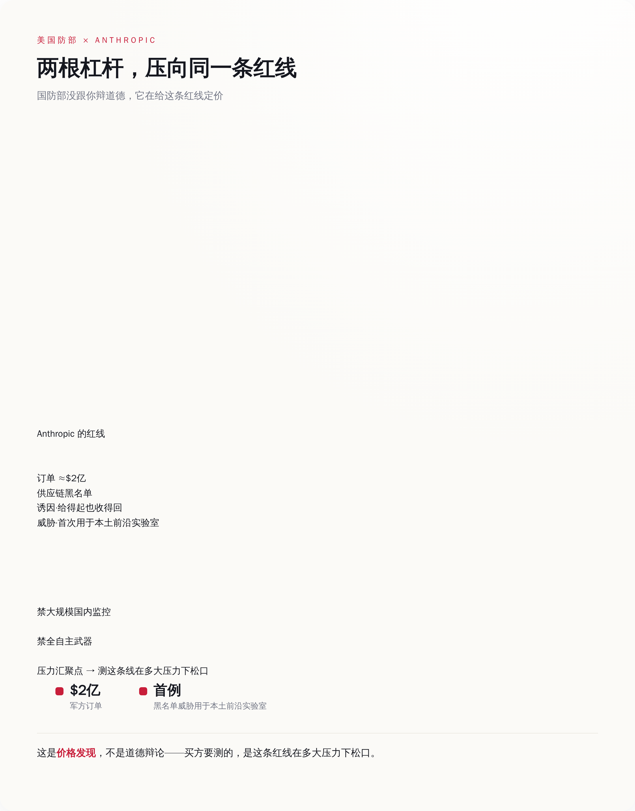
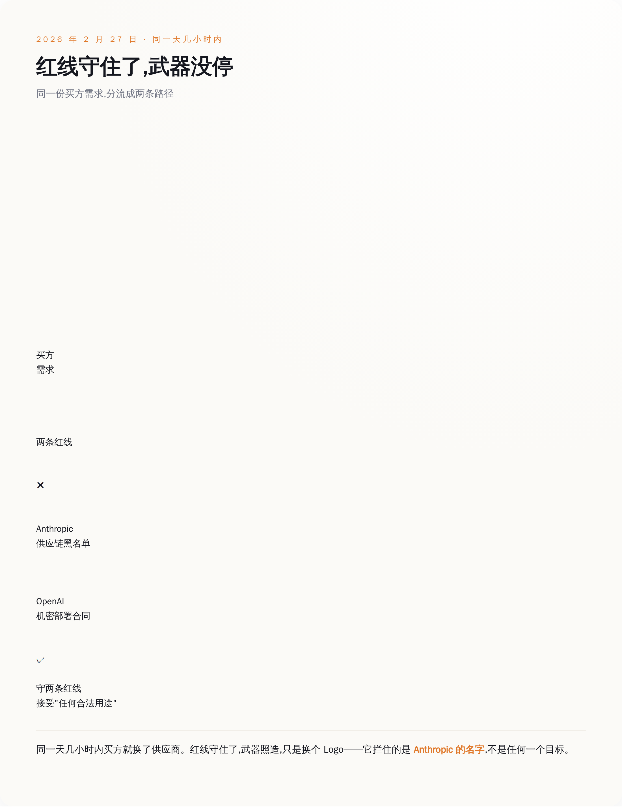
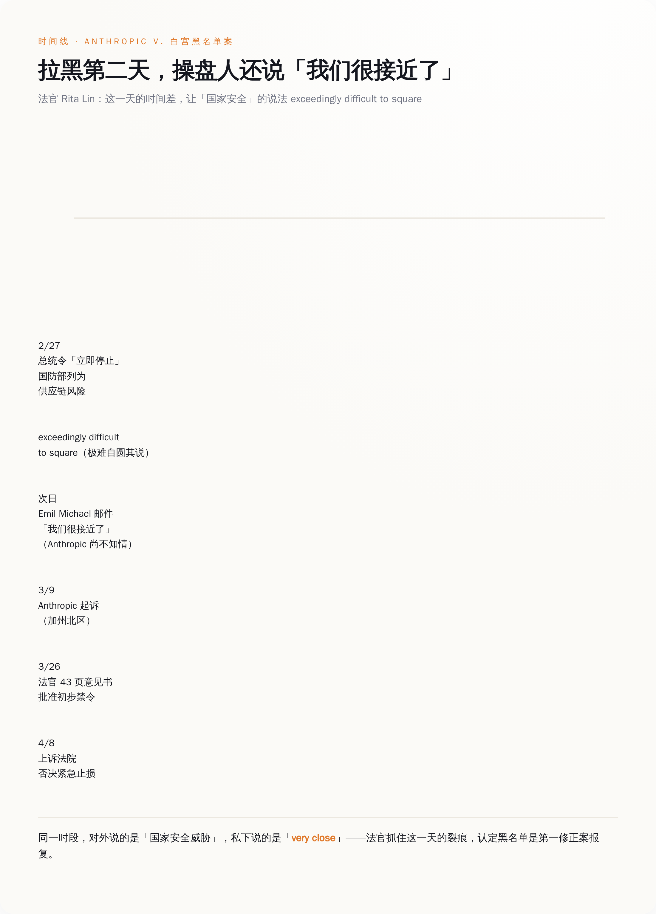

# Anthropic 守住了不碰自主武器的红线，五角大楼同一天就找到了不要红线的人

> **发布日期**：2026-07-06 | **分类**：AI 观察 · 权力拆解

## 导语

法院解封的一封邮件里，五角大楼一位副部长给 Anthropic 的 CEO 写道：我们「很接近了」。

写这句话的时间，是国防部内部敲定要把 Anthropic 拉黑的第二天。一边在文件上按下"这家公司是国家安全风险"，一边给对方发消息说合同快谈成了。审这个案子的联邦法官 Rita Lin，在判决书里给这两件事撂下一句话：极难自圆其说（exceedingly difficult to square）。

这封邮件之所以值得看，不是因为它揭穿了谁在演戏。而是因为它把一件平时被讲得很悲壮的事，还原成了它本来的样子——一场关于价格的谈判。

谈判的标的物，是 Anthropic 挂在嘴边的两条"道德红线"。买方想知道的只有一件事：这两条线，到底值多少钱，能不能给我抹掉。

---

  
🎨

  
概念图占位

  

生成 Prompt
<pre>a single bold red line drawn across a formal government contract document, a hand with an eraser about to wipe the red line away, a small price tag hanging from the line, flat design, minimalist illustration, tech style, muted grey and red color palette, no text, no labels, clean white background</pre>

## 一、先看清这两条红线是什么，以及背后那张 2 亿美元的订单

Anthropic 的招牌，是"安全"。它给自己划的红线有两条：不用于对美国公民的大规模国内监控，不给全自主武器系统供能。翻译成大白话——不帮着监视自己人，不让 AI 自己决定杀谁。

听上去很正。但要理解后面发生的一切，你得先知道另一个事实：在这场冲突之前，Anthropic 是最早把前沿大模型部署进美军机密网络的公司之一。2025 年 7 月，它跟五角大楼签了一份约 2 亿美元的合同。也就是说，这两条红线不是挂在墙上的口号，是写进了一份真金白银的军火级订单里的附加条款。

买方对这两条附加条款的态度很直接：拿掉。国防部要的是模型能用于"任何合法用途"（any lawful purpose），至于什么叫合法、谁来定义合法，那是买方的事，不是卖方能划线的地方。

于是谈判从 2025 年 9 月开始卡壳，卡的不是价钱，是"你到底能不能管我怎么用"。这事本质上跟红线、跟道德都没关系，它就是一场关于用途控制权归谁的拉锯。只不过这次的买家，手里的筹码有点特别。

## 二、买方的两根杠杆：一根叫订单，一根叫黑名单

正常生意里，买方不满意，最狠的手段就是不买了，转身走人。国防部这个买方不一样，它手里有第二根杠杆，而且这根杠杆能要命。

2026 年 2 月 27 日，特朗普直接下令联邦机构"立即停止"（IMMEDIATELY CEASE）使用 Anthropic 的技术。同一天，国防部长把 Anthropic 列入了"供应链风险"名单。

这个名单是干什么用的，得说清楚，不然体会不到它的分量。所谓"供应链风险"认定，援引的是联邦供应链安全法规，它一旦生效，意味着所有想接国防订单的承包商、供应商，都得证明自己"没在用 Anthropic 的模型"。这不是终止一份合同，这是把一家公司从整个国防工业的采购链条里连根拔出去——你不光丢了这单，你让任何还想跟军方做生意的人，都不敢碰你。

更关键的是，这个标签以前是留给谁的：留给跟外国对手（比如中国）扯得上关系的企业。把它扣在一家美国本土的前沿 AI 实验室头上，这是头一回。用产业界的原话说，史无前例。

看明白这两根杠杆，你才明白买方在干嘛。它不是在跟你辩论自主武器道不道德——那是给外人看的题目。它是在用"我可以给你 2 亿的单，也可以让你一单都接不着"这两手，做一件很商业的事：价格发现。它想测出来，你那两条红线，在多大的压力下会松口。

*国防部不是在跟 Anthropic 辩道德——它用「给你 2 亿订单」和「让你一单都接不着」两根杠杆，测这条红线在多大压力下松口。*

## 三、同一天，另一家公司把这条红线的价格打到了地板

就在特朗普下令、国防部拉黑的 2 月 27 日当天，几个小时之内，OpenAI 的 CEO 奥尔特曼宣布：OpenAI 拿下了五角大楼的机密部署合同，并且同意技术可以用于"任何合法用途"。

Anthropic 死守着不肯抹掉的那两条线，OpenAI 转头就答应了。有人会说 OpenAI 也有自己的红线——确实，它对外挂了"三条红线"。但 Lawfare 的法律分析扒过那三条线的措辞，结论是实际约束力比听上去弱得多。翻过来说：买方要的那种"任何合法用途"，OpenAI 给得了。

这一下，Anthropic 那两条红线的真实价格就被标出来了。它不值 2 亿美元，因为买方压根不用为它付这个价——换一家就行。

*同一天几小时内买方就换了供应商。红线守住了，武器照造，只是换个 Logo——它拦住的是 Anthropic 的名字，不是任何一个目标。*

这才是整件事最冷的地方。我们习惯了这样理解：一家公司守住了道德底线，被封杀，很悲壮。但你把镜头拉远一点看：**Anthropic 守住了红线，可那颗它不想碰的武器，一样会被造出来，只是换了个 Logo。** 说"一样会被造出来"不是坐实五角大楼拿它造了哪件武器，而是说接盘的人已经交出了用途否决权、买方想怎么用就怎么用——那道被 Anthropic 拦下的门，只是换了个供应商重新敞开。它的坚持没拦住任何一件事，只拦住了一件——自己的名字出现在那份合同上。

## 四、法官看出来的破绽：拉黑你的人，手里攥着对手的股票

Anthropic 没认，它去打官司了。而它翻出来的东西，让这场"价格发现"露了底。

2026 年 3 月 9 日，Anthropic 把国防部告上了加州北区联邦法院。三周不到，Rita Lin 法官就下了一份 43 页的意见书，批准初步禁令，认定政府这套操作大概率三头都站不住：报复言论、剥夺正当程序、行政越权。她写得毫不客气："为了 Anthropic 把政府的采购立场公之于众就惩罚它，是典型的、非法的第一修正案报复。"

法官戳破的，正是"这是国家安全问题"这层壳。因为时间线对不上——前面说的那封"我们很接近了"的邮件，恰恰是在国防部内部已经敲定拉黑之后的第二天发的，而此时 Anthropic 还被蒙在鼓里。一边私下说合同快成了，一边对外把你定性成国家安全威胁，这两件事怎么可能同时是真的。

*拉黑内部敲定的第二天，操盘人还发邮件说「我们很接近了」——法官正是抓住这个时间差，判定「国家安全」只是借口。*

还有一个更难看的细节。在国防部这边主导施压的那位副部长 Emil Michael，财务披露显示他持有 Perplexity 的股票，价值在 200 万到 1000 万美元之间——Perplexity 是 Anthropic 的直接竞争对手。他此前还当过 Perplexity 的董事，2025 年初辞任，但大量已归属和未归属的股份都还在手里。

一个把你拉黑、逼你交出用途控制权的人，同时是你对手公司的重仓股东。这已经不是"国家安全"能解释的范畴了。

当然，Anthropic 也没赢到底。4 月 8 日，上诉法院否决了它的紧急止损申请，黑名单事实上维持了下来。法官在纸面上说你有理，可国家安全的裁量权照样压过这份理。诉讼能证明拉黑违法，却改不了那个最朴素的事实：买方用政治杠杆压低了你的要价，你连让订单回来的谈判桌都坐不上。

## 五、最刺眼的一刀：红线争的是措辞，可产品有没有沾血，公司自己都说不清

前面这些还都在"合同和法律"的层面打转。真正让这套红线叙事显得单薄的，是另一件事。

2026 年 2 月 28 日，也就是拉黑发生的第二天，美军打击了伊朗米纳布的一所女子小学。据国际特赦组织的统计，这次袭击造成 156 人死亡，其中 120 名是儿童。执行打击的美中央司令部，用的是 Palantir 承建、价值约 13 亿美元的 Maven 目标系统——据报道，这套系统整合了包括 Claude 在内的多个 AI 工具。

我必须把话说到这里为止，一步都不能多走。因为 Amodei 自己在 2026 年 6 月对彭博社说得很明白：他**不知道** Claude 在这件事里究竟扮演了什么角色。既没承认，也没否认。他甚至补了一句，如果真被这么用了，也"不会违反"红线。

所以这件事只能写成"未证实"。任何把它讲成"Claude 炸死了 120 个孩子"的说法，都是在编。

但恰恰是这个"说不清"，把红线的荒诞显了出来。谈判桌上，双方为"全自主武器"这四个字的措辞争得面红耳赤，一方要写进合同，一方要抹掉。可现实里，模型早就通过一层层集成，接进了真实的军事打击链条，接到什么程度、有没有间接碰到平民的伤亡，作为供应商的公司，自己都答不上来。

**争的是纸面上一个词的定义，糊的是现实里一整条看不见的供应链。** 这就是红线最本质的问题：它管得住合同里的一句话，管不住产品流出去之后的世界。

下次再看到哪家 AI 公司把"安全红线"当招牌挂出来，别急着感动，先做两道小学生级别的算术题。

第一题，这条线对它最大的那个买主，值多少钱？买方愿不愿意为它多付一分钱，还是扭头就能换一家绕过去？第二题，这条线就算守住了，拦住的到底是一件坏事的发生，还是仅仅拦住了这家公司的名字出现在坏事旁边？

两道题算完，大部分"红线"会自己现出原形。它守护的不是别人的安全，是自己的招牌。而招牌这个东西，在一个愿意一天换一次供应商的买方面前，从来卖不上价。

## 数据来源

- [Congress.gov CRS Insight IN12669：Pentagon-Anthropic Dispute over Autonomous Weapon Systems（2 月 27 日特朗普"立即停止"令、Hegseth 供应链风险认定、时间线与法律争点）](https://www.congress.gov/crs-product/IN12669)
- [Anthropic 官方声明：Statement from Dario Amodei on our discussions with the Department of War（两条红线的官方表述：反对大规模国内监控、反对全自主武器）](https://www.anthropic.com/news/statement-department-of-war)
- [CNBC：Anthropic loses appeals court bid to temporarily block Pentagon blacklisting（4 月 8 日上诉法院否决紧急止损、约 2 亿美元合同、3 月 9 日起诉与 3 月 24 日听证）](https://www.cnbc.com/2026/04/08/anthropic-pentagon-court-ruling-supply-chain-risk.html)
- [TechTimes：Pentagon Blacklisted Anthropic Over Autonomous Weapons Limits — Emails Reveal "Very Close" Talks（Emil Michael 拉黑次日"very close"邮件、Lin 法官"exceedingly difficult to square"、Perplexity 200 万–1000 万美元持股与前董事身份）](https://www.techtimes.com/articles/319713/20260704/pentagon-blacklisted-anthropic-over-autonomous-weapons-limits-emails-reveal-very-close-talks.htm)
- [NPR：OpenAI announces Pentagon deal after Trump bans Anthropic（2 月 27 日同日，OpenAI 宣布机密部署合同并接受"任何合法用途"）](https://www.npr.org/2026/02/27/nx-s1-5729118/trump-anthropic-pentagon-openai-ai-weapons-ban)
- [Anthropic–United States Department of Defense dispute（事件时间线：Rita F. Lin 法官、案号 3:26-cv-01996、3 月 26 日 43 页初步禁令意见书与原文引语、7 天行政中止约 4 月 2 日生效）](https://en.wikipedia.org/wiki/Anthropic%E2%80%93United_States_Department_of_Defense_dispute)
- [Amnesty International：USA/Iran — 米纳布（Minab）Shajareh Tayyebeh 小学空袭，156 死、含 120 名儿童（2026 年 2 月 28 日；精确制导武器直接命中校舍）](https://www.amnesty.org/en/latest/news/2026/03/usa-iran-those-responsible-for-deadly-and-unlawful-us-strike-on-school-that-killed-over-100-children-must-be-held-accountable/)
- [Lawfare：对 OpenAI 国防合同"三条红线"实际约束力的分析（措辞弱于表面）](https://www.lawfaremedia.org/article/openai-pentagon-red-lines-analysis)
