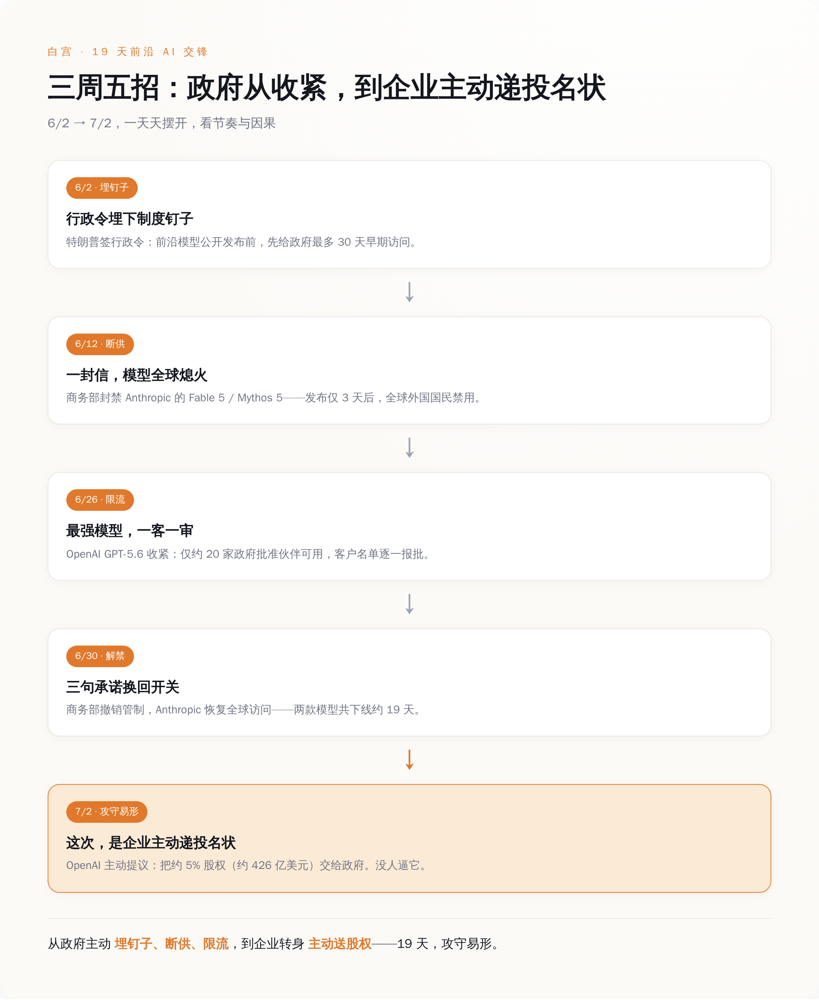
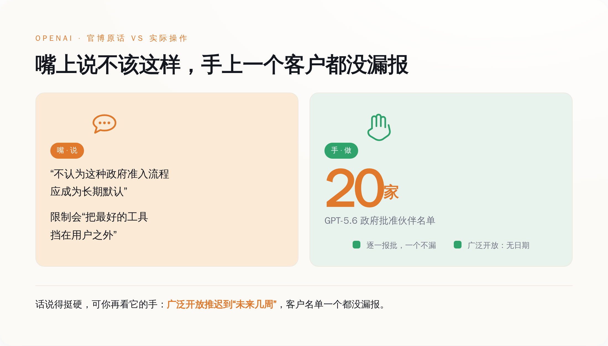
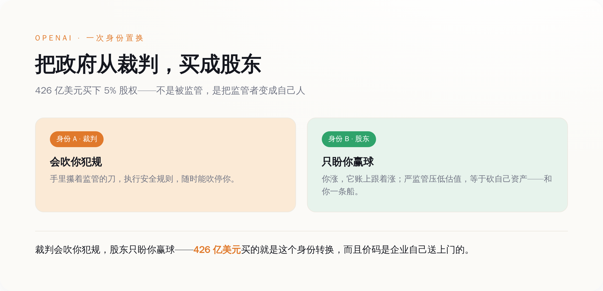
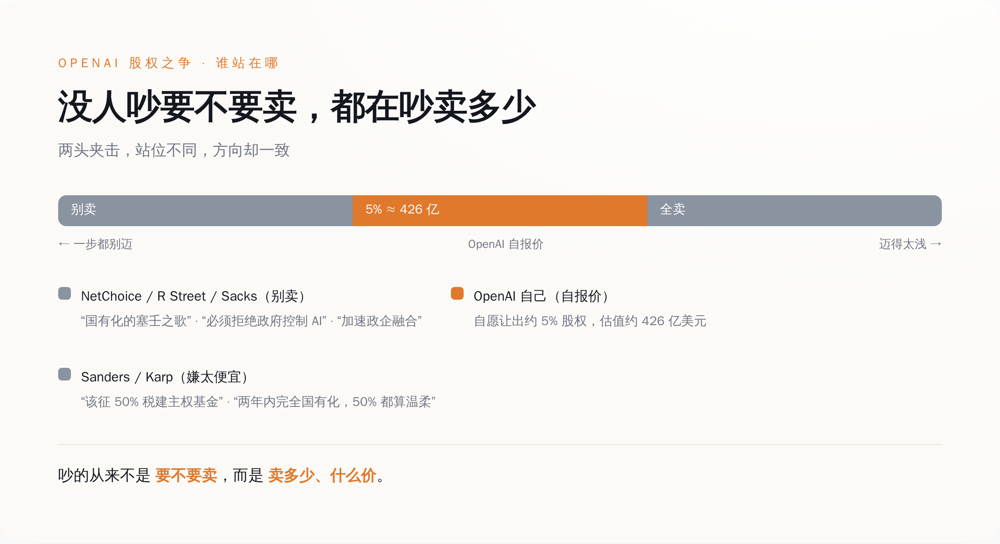

# 政府把一家 AI 公司摁死 19 天，另一家看完，主动要送它 5% 股份

> **发布日期**：2026-07-06 | **分类**：AI 观察 · 权力拆解

## 导语

2026 年 6 月 12 日，Anthropic 刚发布三天的两个新模型——Claude Fable 5 和 Mythos 5——被美国商务部一封信摁死在全球。所有外国人，包括在美国上班交税的那些，一律不许用。Anthropic 没办法按国籍一个一个筛，干脆两个模型全球下线。

19 天后，同样这两个模型，一行代码没改，商务部长又写了封信，说，行了，可以卖了。

这 19 天里，模型没变。变的是 Anthropic 递上去的三句承诺。

而就在解禁信发出后的第三天，7 月 2 日，另一家公司 OpenAI，主动开口：政府要不要拿走我 5% 股份，四百多亿美元那种。

没人逼它。

---

*三周五步：政府这只手，怎么一步步收紧，又让企业主动递上投名状*

## 一、19 天里模型没改一个字，改的是三句话

先把 Anthropic 这 19 天，一天一天摆出来。

6 月 9 日，Claude Fable 5 和 Mythos 5 公开发布。三天后的 6 月 12 日，美国商务部长 Howard Lutnick 直接写信给 Anthropic 的 CEO 达里奥（Dario Amodei），援引国家安全和出口管制的权限，要求在全球范围内，暂停所有外国国民访问这两款模型——注意，是「全球」，是「所有外国国民」，连持工作签证在美国给 Anthropic 自己打工的都算。

导火索是亚马逊的研究人员发现的一个越狱漏洞。被越狱之后的 Fable 5，不光能标记出软件里的漏洞，还在至少一个案例里，直接写出了利用这个漏洞的攻击代码。翻过来说，它有可能变成一把不挑人的网络攻击刀。白宫的 AI 顾问 David Sacks 公开开火，说 Anthropic「拒绝修复」。

Anthropic 不服。它的说法是：就凭一个「狭窄的、潜在的」越狱点，就下架一整个商用模型，不讲道理；这要成了行业标准，往后没哪个新模型能活着发布——毕竟没人能证明自己的模型绝对越不了狱。

可道理归道理，真到执行，Anthropic 傻眼了。它的模型跑在 AWS Bedrock、Google Cloud、微软 Foundry、Snowflake、Box，还有它自家 API 上，想按国籍在这么多朵云上，把外国人一个一个挑出来关掉（对，全都得手动一个个来），技术上短期内根本做不到。

做不到，那就一刀切。Anthropic 选择把两个模型在全球一起下线。企业客户全世界一起断供。

这就是政府手里那只手的分量：不需要国会，不需要开庭，不需要给你一个申诉窗口，一封部长的信，价值千亿美元的模型，当天全球熄火。

僵持了将近三周。其间管制略有松动，但两款模型对外的全球访问，始终没真正恢复。直到 6 月 30 日，Lutnick 又写了封信，这次是给 Anthropic 的联合创始人兼首席计算官 Tom Brown，宣布撤销 6 月 12 日的管制，模型恢复全球访问，出口许可证也不用办了。

模型没改。改的是 Anthropic 同意的三件事：主动检测并处理模型的安全风险、配合政府为往后的新模型制定标准、向政府上报「恶意活动」。

三句承诺，换回一个价值千亿的开关重新合上。你要说这 19 天里发生了什么技术上的和解，没有——安全圈子里 76 位 CEO、CISO、投资人和安全研究者联名给 Lutnick 写信，痛批这场管制「把最好的模型从防御者手里夺走、制造市场不确定性、损害美国的 AI 领导地位，却没真正防住任何风险」。

危险的从来不是模型。是它不听话。听话了，就安全了。

---

*嘴上说着不该这样，手上一个客户的名字都没漏报*

## 二、OpenAI 嘴上说着「不该这样」，手上一个客户都没漏报

Anthropic 被断供的时候，OpenAI 在干嘛？在演另一出戏。

时间往前倒一点。6 月 2 日，特朗普签了一道行政令，名字很正，《促进先进人工智能创新与安全》。里面埋了一根钉子：所谓「受管辖前沿模型」的开发商，在公开发布之前，要「自愿」给联邦政府最多 30 天的早期访问权，让政府先做国家安全和网络安全评估。

这个 30 天，还是砍出来的。更早没签的草案版本里，写的是 90 天。谈着谈着，压到了 30 天。至于哪些模型算「受管辖」——这个门槛由 NSA、CISA、NIST 一起定，是一套机密基准。什么标准算危险，不公开。你只知道有条线，不知道线在哪。

行政令里还专门写了一句免责：本节任何内容，都不得被解释成授权政府对新模型设立强制性的许可、预先审批或审查要求。翻过来，就是一句「这都是自愿的，我没逼你」。

6 月 26 日，轮到 OpenAI 表演什么叫「自愿」。它发布了 GPT-5.6 系列——旗舰版 Sol、均衡版 Terra、轻量版 Luna。其中 Sol 被称为它迄今最强的模型，编码和网络安全能力最突出。可这次发布，普通用户一个都摸不着。应白宫要求，GPT-5.6 先以「受限预览」的形式，只开放给大约 20 家「政府批准的合作伙伴」，而且每一个客户的名字，都得逐一提交给政府审批，批了才能用。广泛开放推迟到「未来几周」，没有具体日期。

36 氪给这套机制起了个特别传神的名字，叫「一客一审」。你想用最强的 AI？行，先把名字报上去（对，实名登记），政府点头了，你才有资格。

OpenAI 心里当然不痛快，还专门在官方博客上公开抱怨了一句：「我们不认为这种政府准入流程应该成为长期默认。」它说，这种限制会「把最好的工具，挡在用户、开发者、网络防御者和全球合作伙伴之外」。

话说得挺硬。可你再看它的手——一个客户没敢漏报，名单老老实实一份份交上去，模型乖乖限流。嘴上写着抗议博客，手上把每个客户的名字都递了上去，这不叫抵制，这叫一边配合一边留个体面。

20 天后，这个心不甘情不愿的乙方，自己走到了桌前，掏出一份提议。

---

*裁判会吹你犯规，股东只盼你赢球——426 亿买的就是这个身份转换*

## 三、5% 不是慈善，是把裁判买成股东

7 月 2 日，据《金融时报》报道，OpenAI 向美国政府提议：由政府持有 OpenAI 5% 的股权。

按 OpenAI 2026 年 3 月约 8520 亿美元的估值算，这 5% 值大约 426 亿美元。426 亿，主动送。

而且奥特曼（Sam Altman）想的不止 OpenAI 一家。他的完整设想是：每一家美国领先的 AI 公司——OpenAI、Anthropic、谷歌、Meta——都拿出大约 5% 股权，注进一个仿照阿拉斯加永久基金搭起来的「公共财富基金」，往后 AI 赚的钱，直接给美国公民分红。阿拉斯加那只基金规模近 900 亿美元，从 1982 年起每年给本州居民发钱。听上去，很有普惠精神。

先别急着感动。你把前面两件事和这一件摆在一起看。

一家公司，Anthropic，因为一个越狱漏洞不肯低头，被政府一封信摁在地上 19 天，损失是全球企业客户断供、砸在自己保密上市的窗口期上；最后靠三句承诺赎身。另一家公司，OpenAI，眼看着这一幕，转头就主动提出：政府，你来当我股东吧，5%，四百多亿，不用你出钱。

**给一个刚刚证明了「我一封信就能弄死你」的对手送股份，这不是慷慨，这是保护费。**

而且这笔钱买的东西，比单纯的「你交钱、我不打你」还高级。政府一旦成了你的股东，你涨，它账上跟着涨；你要是被拆、被重罚，它自己也跟着亏。它和你的利益，从这一刻起焊死在一起。

这里有个特别精妙、也特别脏的地方。消费者组织 Public Knowledge 的 Nat Purser 点破过一个反向的风险：政府一旦持股 AI 公司，反而会更不愿意认真执行安全监管——因为严监管会压低公司估值，等于砍它自己账上的资产。

普通人听这句，觉得是个 bug，是漏洞。可你站在 OpenAI 的角度再听一遍——这哪是 bug，这就是它花 426 亿要买的那个 feature。

它买的不是政府不打它。它买的是：当政府往后想拿起监管的刀砍 AI 的时候，会先摸摸自己的口袋，然后把刀放下。

**这不是政府在管 AI，是 AI 巨头在花钱，把政府从裁判，买成股东。** 裁判会吹你犯规，股东只会盼你赢球。奥特曼比谁都清楚这两个身份的差别值多少钱。

至于「给全体公民分红」那层普惠外壳，它当然存在，也当然好听。但它是真心还是包装，其实一点都不重要。这套结构只要搭起来，无论奥特曼安的什么心，效果都一样：政府和头部大厂绑成利益共同体，剩下所有人在门外看着。

---

*从「别卖」到「迟早全卖」，吵的都是价钱——没人在吵要不要卖*

## 四、吵成一团的人，吵的都是价钱，没人在吵要不要卖

这事一出，反对的声音铺天盖地。可这些声音从两个完全相反的方向骂过来，骂的却是同一件事。

一头嫌这一步迈得太远。右翼智库 NetChoice 说政府入股是「AI 国有化的塞壬之歌」——听着美，跟着走就是撞礁石。连白宫自己的 AI 沙皇 David Sacks 都反对，说国有化会「加速本已在滑向的政企融合」，还反手把锅甩给 CEO 们：是你们自己天天渲染 AI 要害大家失业，才把这份恐慌招来的。

另一头，嫌这一步迈得太浅。参议员 Bernie Sanders 在《纽约时报》上撰文，说对大型 AI 公司的股票，该一次性征 50% 的税，拿去建主权财富基金——你 OpenAI 提 5%？太小气了，该拿 50%。

Palantir 的 CEO Alex Karp 更狠，他预言两年之内，AI 公司会被完全国有化，到那时候回头看，Sanders 要的 50% 都算温柔的。他说这话已经私下跟同行的高管们念叨了半年，可人家大多不当回事。

你把这几个人的话拼起来听：NetChoice 说别卖，Sacks 说别卖，Sanders 说卖得太便宜，Karp 说迟早全卖。吵得不可开交。

可你退一步看这个吵架的现场，会发现一件更凉的事——**没有一个人在争论「要不要卖」，他们争的全是「卖多少、什么价」。** 5% 还是 50%，自愿还是强制，现在卖还是两年后被拿走。至于 AI 公司要不要跟政府绑成利益共同体这件事本身，桌上没有一个人反对。因为默认已经卖了，剩下的只是砍价。

那么问题就剩最后一个：这桌牌局，谁是输家？

不是 OpenAI，它花 426 亿买了个能保护自己资产的股东。不是政府，它没掏一分钱，白得千亿资产还落个「还政于民」的名声。也不是 Anthropic，它 19 天赎完身，照样奔着上市去。

输的是那些没资格上桌的人。

一道机密门槛、一套「一客一审」的审批、一份要跟政府共享股权才换得来的「保护」——这些东西对头部大厂是成本，几十亿几百亿，掏得起。可对一个想从车库里冲出来颠覆行业的小团队呢？它连那道机密门槛画在哪都不知道，更别提派个客户名单去政府那儿排队报批。

监管从来不只是拦住坏人的墙。当墙足够高、足够贵、足够看不清，它同时也拦住了所有买不起门票的新玩家。而墙里头那几家，正好就是有钱、有关系、能主动给政府送股份的那几家。

那 19 天，其实不是一场监管，是一次报价。政府亮出手里的开关——昨天你还是国家安全威胁，今天一句「我配合」就能卖——告诉所有 AI 公司：我这只手，有多硬。OpenAI 看懂了，用 5% 股权，飞快报出了它愿意付的价。

没人逼它。它比谁都清楚，主动交出去的那部分，是为了保住更大的那部分。

而你我这样的普通人，既不在那张报价单上，也没在那份分红名单里被认真算过。我们只是被反复告知：这一切，都是为了你们的安全。

## 数据来源

- [CNBC: OpenAI proposes U.S. government own 5% stake](https://www.cnbc.com/2026/07/02/openai-proposes-us-government-own-5percent-stake-to-address-political-blowback.html)
- [CNBC: Anthropic says Trump admin lifted export controls on Claude Fable 5 and Mythos 5](https://www.cnbc.com/2026/06/30/anthropic-says-trump-admin-has-lifted-export-controls-on-claude-fable-5-and-mythos-5.html)
- [TechCrunch: OpenAI limits GPT-5.6 rollout after government request](https://techcrunch.com/2026/06/26/openai-limits-gpt-5-6-rollout-after-government-request-says-restrictions-shouldnt-be-the-norm/)
- [Tom's Hardware: Trump signs AI executive order seeking 30-day government access to frontier models](https://www.tomshardware.com/tech-industry/artificial-intelligence/trump-signs-ai-executive-order-seeking-30-day-government-access-to-frontier-models-before-release)
- [Al Jazeera: US lifts restrictions on Anthropic's powerful AI models Fable and Mythos](https://www.aljazeera.com/economy/2026/7/1/us-lifts-restrictions-on-powerful-ai-models-fable-mythos-anthropic-says)
- [Forbes: Sam Altman wants a global referee for AI. He also wants the U.S. government to own a piece of OpenAI](https://www.forbes.com/sites/anishasircar/2026/07/06/sam-altman-wants-a-global-referee-for-ai-he-also-wants-the-us-government-to-own-a-piece-of-openai/)
- [Fortune: Sam Altman seeks new world order for AI as OpenAI slowly loses ground](https://fortune.com/2026/07/02/sam-altman-new-world-order-ai-openai-google-anthropic/)
