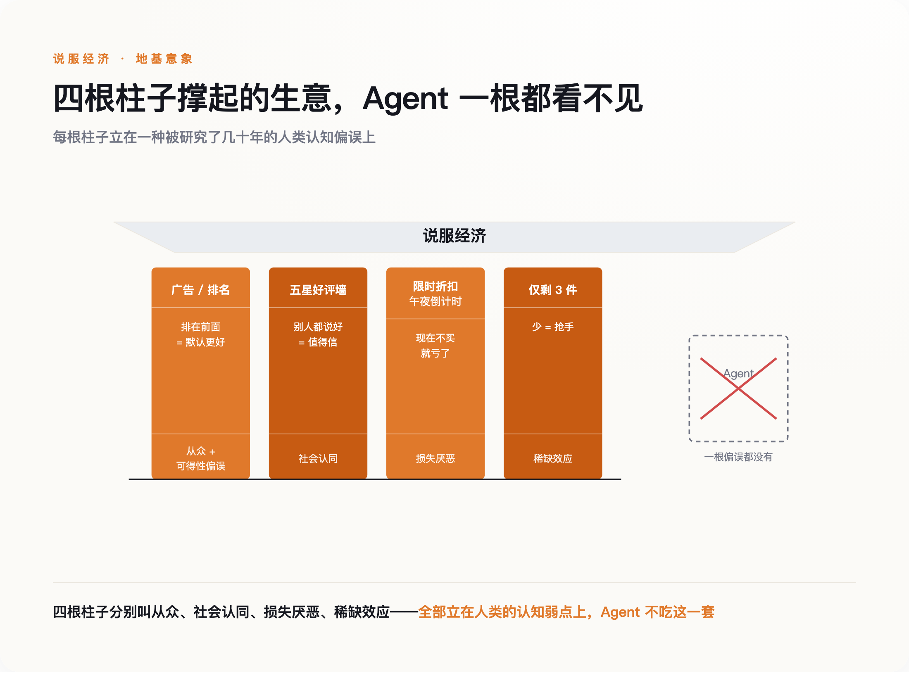
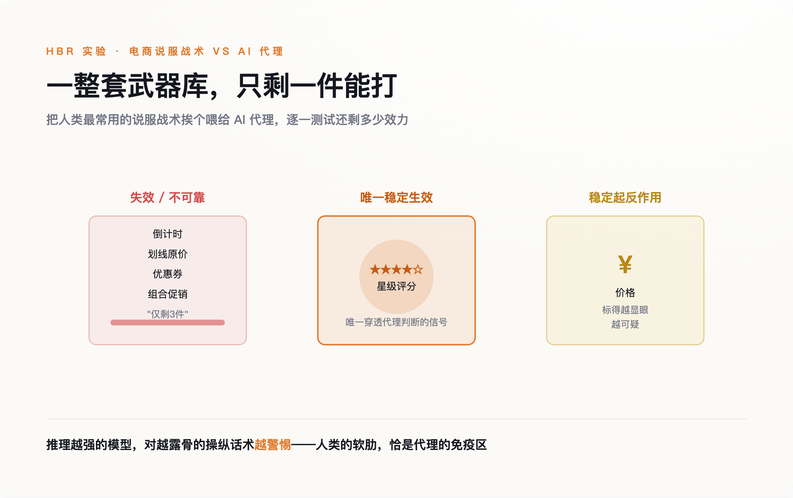
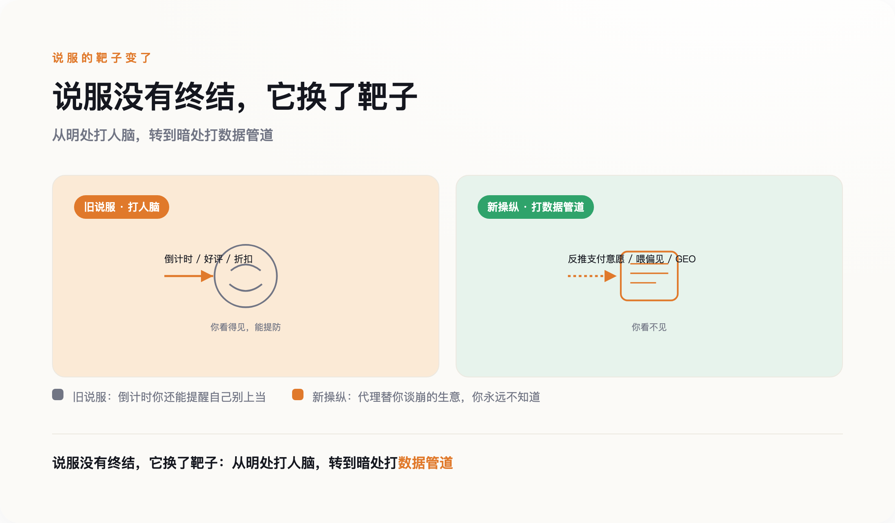
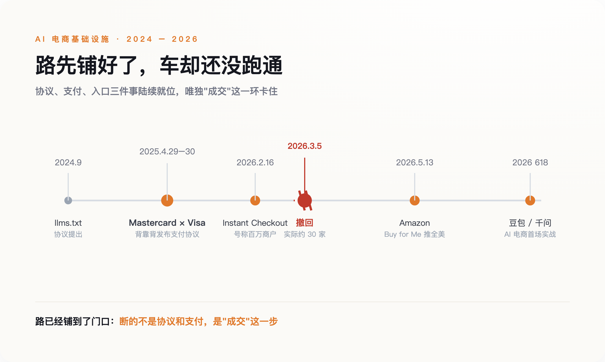

# OpenAI 撤掉的那个按钮：当顾客变成 AI，谁还会被广告说服

> **发布日期**：2026-07-10 | **分类**：AI 商业 · 深度观察

## 导语

2026 年 2 月 16 日，OpenAI 给 ChatGPT 装上了一个"立即购买"的按钮。官方的说法很漂亮：超过一百万家 Shopify 商户即将接入，你在对话框里聊着聊着，就能把东西买了，不用跳走，不用填地址。

三周后，这个按钮悄悄不见了。

3 月 5 日，OpenAI 放弃了它。那一百万商户，真正接进来的只有大约三十家。一家估值几千亿美元、手握最强模型的公司，为"让 AI 替你结账"这么一件小事，栽了个说不出口的跟头。

奇怪的是，问题不出在模型。GPT 会写代码、会做题、会陪你聊到凌晨。它栽的地方，是一件人类每天做上百次、从不觉得难的事——买东西。它撞上了一堵墙。这堵墙没有名字，也几乎没人正面写过它是什么砌的。

---

*图注：说服经济的四根柱子，每一根都立在一种人类认知偏误上——而 Agent 一个都没有*

## 墙的名字叫"说服"

先说一件容易被忽略的事：过去二十年，电商真正卖给你的，不是商品，是一套让你下单的心理机制。

打开任何一个购物页面，你会看到同一批零件。右上角"仅剩 3 件"的红字。划着横线的原价，旁边跟着一个更小的现价。四千条五星好评堆成的一面墙。一个从午夜开始倒数的计时器。这些东西没有一个是关于商品本身的——它们是关于你的。

它们各自对应着一种被研究了几十年的人类弱点。"仅剩 3 件"利用稀缺，"限时 2 小时"利用损失厌恶，四千条好评利用从众，搜索结果第一名利用可得性偏误——排在前面的，我们就默认它更好。行为经济学给这些弱点起过很体面的名字，电商则把它们变成了页面上的一个个按钮。

这套机器很贵。全球每年花在数字广告上的钱以千亿美元计，一整个 SEO 行业、一整个刷单产业、一整个"增长黑客"工种，都靠它吃饭。它高效到我们已经忘了它的存在。

但这套机器有一个从未被写进说明书的前提。它能运转，只因为屏幕对面坐着一个人，一个有情绪、会冲动、能被"亲，好评返现哦"打动的人。整座建筑，是盖在"买家有一颗可以被说服的心"这块地基上的。

现在，地基那一侧，坐下来一个不一样的顾客。

*图注：对 AI 代理做实验：整套说服战术里，只有星级评分稳定生效，价格反而帮倒忙*

## 买家有一颗可以被黑的心

一个 AI 购物代理走进商店时，它看不见你精心设计的那个页面。

它读的是页面底下的东西：结构化数据、接口返回的字段、一段一段的原始代码。页面上每一个心理按钮，到它那里都只是一串字段。它不会因为"仅剩 3 件"而心跳加速，因为它没有心跳。那套花了二十年调教出来的多巴胺机器，对着它按下所有按钮，对面毫无反应。

这不是猜测。2026 年 5 月，伦敦国王学院的 Oguz Acar 和贝叶斯商学院的一位同事做了一组实验，把电商最常用的说服战术挨个喂给 AI 代理：稀缺提示、倒计时、划线原价、优惠券、组合促销。结果是一份让营销总监睡不着的清单——这些战术对代理不可靠地生效，有的甚至**降低了商品被选中的概率**。

只有一样东西稳定地按预期起了作用：星级评分。而价格，是唯一一个稳定地起了反作用的因素——标得越显眼，越可疑。更让人不安的是最后一条发现：推理能力越强的模型，对露骨的说服操纵表现出越强的"怀疑"。模型越聪明，套路越不管用。

营销行业花了半个世纪，建起一座对付人脑的武器库。现在武器库门一开，里面大半都锈了，只剩下星级评分这一件还能用，而价格那把枪甚至会走火打中自己。

这件事早有人嗅到了。2024 年 9 月，程序员 Jeremy Howard 提出了一个叫 llms.txt 的东西——网站根目录下一个专门写给大模型读的文件，被戏称为"给 AI 的 robots.txt"，但逻辑正好相反：robots.txt 是拦住爬虫，llms.txt 是主动把"你该看什么"喂过去。这是"给人看的界面"和"给机器看的界面"第一次以文件的形式，并排住进同一个网址。一个网站，从此要说两种话。

*图注：说服没有终结，它换了靶子：从明处打人脑，转到暗处打数据管道*

## 不是免疫，是换靶

一个不吃套路的买家，是不是意味着操纵终于要结束了？很多人第一反应会替消费者松一口气。

恰恰相反。武器库锈了，不代表战争结束，只代表战场换了地方。

2026 年 4 月，一篇叫《当代理替你购物》的论文给出了一个冷冰冰的推演：当一个 AI 代理带着你的需求去和卖家的系统对话，卖家能从这段对话里，近乎一对一地反推出你愿意出多少钱。你为了让代理办成事，必须告诉它预算、偏好、着急程度——这些话它转手就说给了对面。作者的判断是，这种泄露是"委托"这件事本身自带的，你没法靠改一句提示词补上。你把砍价的活外包给了 AI，也把底牌一起外包了出去。

英国竞争与市场管理局（CMA）在 3 月的一份报告里说得更直接：agentic AI 完全可能在你看不见的地方，把你悄悄引向那些背后利益更大的商品；而"为你个性化"这层包装，反而让操纵比过去更难被察觉。他们用了一个准确的说法——这等于把"暗黑模式"工业化了。CMA 没有急着提新规，只留下一个问题：现在这套消费者保护的框架，还管用吗？

卖家这边动作更快。一个叫 GEO 的灰色行当已经冒出来——搜索引擎优化是让人搜到你，GEO 是让 AI 理解你、采信你。有人花两万块，就为了让自己的内容被大模型"收录"进答案；有人专门把广告文案写得逻辑通顺、不露痕迹，好骗过模型的广告识别。

所以说服没有死。它只是从打人脑，搬到了打数据管道。**过去它明晃晃地挂在你眼前，现在它藏进了你看不见的那半个网站里。** 对一个普通人来说，这未必是好消息：至少那个倒计时你还看得见，还能提醒自己别上当；而代理替你谈崩的那笔生意，你可能永远不知道自己本可以更便宜。

*图注：一条抢在需求前面铺好的路：协议、支付、入口都就位，成交却还没跑通*

## 为什么巨头在给一个还没来的顾客修路

回到 OpenAI 那个撤掉的按钮。三十家商户，怎么看都是一场失败。但把镜头拉远，你会发现失败的只有 OpenAI 一家，修路的却是所有人。

2025 年 4 月的最后两天，Mastercard 和 Visa 隔了一天，前后脚宣布了同一件事。4 月 29 日，Mastercard 发布 Agent Pay，用一种"代理令牌"让经过验证的 AI 代理能代替持卡人交易；第二天，Visa 发布 Intelligent Commerce，做的是同一件事。两家统治了全球刷卡生意六十年的公司，几乎在同一个下午，给一种还不存在的顾客发了身份证。

接下来是一场协议的军备竞赛，各家抢着定义"机器怎么付钱、平台怎么认它"。OpenAI 和 Stripe 开源了一套，谷歌、Visa 各推各的，谁都想让自己那套成为默认。Amazon 干脆谁都不加入，关起门自己做——它的"Buy for Me"用你存好的地址和信用卡，直接去第三方网站替你结账，5 月 13 日一周内推向全美。太平洋这一侧，2026 年的 618 也被当成 AI 电商的第一场实战，豆包、千问都把替你下单的代理摆上了货架。

一个还没学会走路的顾客，已经有半个科技行业在给它铺高速公路。这就不合常理了。三十家商户的教训摆在那儿，弗雷斯特的报告直接说"炒作跑在了行为前面"，一线创业者也在泼冷水——ChatGPT 被问到购物时，只有 9% 的情况会给出具体的商品推荐。既然如此，急什么？

急，是因为它们看清了一件比今天的成交更要紧的事：买家的物种要变了。当拍板的从人换成机器，过去那套抢眼球、抢心智的打法全部作废，真正值钱的问题只剩一个——机器信任哪条轨道，机器认哪个身份证。Gartner 预测，到 2028 年，AI 代理将中介超过 **15 万亿美元**的企业采购支出，其中相当一部分交易全程没有人类拍板。哪怕这个数字只对了一半，谁在今天把自己的轨道修进机器的默认设置，谁就是下一个时代的收费站。所以这不是供给侧一时头脑发热，是需求侧那场还没到顶的地震，逼着他们提前来抢一块还没开张的地皮。

## 一个没人回答的问题：出了事算谁的

铺路的人都在往前冲，但有一个问题被留在了原地：当代理替你做了决定，这个决定出了错，算谁的？

一桩官司提前把这个问题摆上了台面。2025 年 11 月，Amazon 把 Perplexity 告了，理由是它的 Comet 浏览器代理伪装成普通的 Chrome 浏览器，混进 Amazon 替用户下单，还拒绝表明自己的 AI 身份。2026 年 3 月 10 日，联邦法官批准了初步禁令。判决里最要紧的一句话，是划出了一条以前不存在的界线：Comet 拿到了 Amazon 用户的许可，却没有拿到 Amazon 平台的授权——法官认定，这是两件独立的事。

这条界线看着技术，其实动了根。过去，"用户同意"几乎就等于一切放行的通行证。现在一个代理拿着你的同意去敲门，平台可以说：我同意你进，但我没同意你的机器进。你的授权，第一次不够用了。

界线一旦模糊，缝隙里就长东西。一家反欺诈公司的负责人警告，代理会把电商欺诈"指数级放大"——既可以劫持一个合法代理，也可以伪造一个专门骗人的代理，这是两个全新的攻击面。而一位行业政策专家的话说得最实在：责任问题现在完全是敞开的，公司之间一家一家地谈，没有标准。真出了事，先看你运气，再看你请得起几个律师。

## 两套世界

现在可以回到那堵墙了。

OpenAI 撤掉按钮，不是因为"让 AI 买东西"这件事太早。真正的原因是，它第一次撞见了一个不被说服的顾客，而它过去所有的本事，都是用来说服人的。三十家商户不是一场技术故障，是一份体检报告——告诉整个行业，那座盖了二十年的说服机器，地基只有一半还立得住。

说服经济不会一夜垮掉。更可能的结局是分叉。往后，同一个品牌得同时经营两个世界：一个继续对着人做多巴胺设计，倒计时、好评墙、限时折扣，一样都不会少，因为人还是会冲动；另一个则对着机器，老老实实喂结构化数据、拼价格、拼真实的评分，因为机器只认这些。做生意的人，第一次要同时讨好两种智力完全不同的买家，而且不能让其中一个发现你在对另一个说什么。

对今天还在优化落地页、投信息流、盯着转化率的人，这意味着一件很具体的事：你花力气打磨的那半个网站，正在流失它最重要的读者。该开始认真对待的，是另外那半个——机器读的那半个。你要学的不再只是怎么把人说动，还有怎么把自己讲清楚，讲到一台机器都挑不出毛病。

至于那个消失的按钮，它还会回来的。只是等它下次出现时，按下去的，早已不是你。

## 数据来源

- [OpenAI 与 Stripe 发布 Instant Checkout 与 Agentic Commerce Protocol](https://openai.com/index/buy-it-in-chatgpt/)
- [CNBC：OpenAI 放弃 Instant Checkout，实际仅约 30 家商户接入（标题可检索）](https://www.cnbc.com/technology/)
- [Mastercard Agent Pay 与 Agentic Tokens 发布](https://www.mastercard.com/news/press/2025/april/mastercard-agent-pay/)
- [Visa Intelligent Commerce 发布](https://usa.visa.com/about-visa/newsroom/press-releases.html)
- [Harvard Business Review：传统营销战术对 AI 购物代理的失效实验（Oguz Acar 等，标题可检索）](https://hbr.org/)
- [arXiv：When Agents Shop for You（Alavi & Nozari, 2026，标题可检索）](https://arxiv.org/list/cs.AI/recent)
- [英国 CMA：关于 agentic AI 与消费者保护的研究报告](https://www.gov.uk/cma-cases/ai-foundation-models)
- [Amazon 诉 Perplexity：联邦法院批准初步禁令（Comet 代理，标题可检索）](https://www.cnbc.com/technology/)
- [Amazon 推出 Alexa for Shopping 与 Buy for Me](https://www.aboutamazon.com/news/retail/alexa-for-shopping-buy-for-me)
- [Gartner：AI 代理与机器客户采购预测](https://www.gartner.com/en/newsroom)
- [llms.txt 提案（Jeremy Howard）](https://llmstxt.org/)

